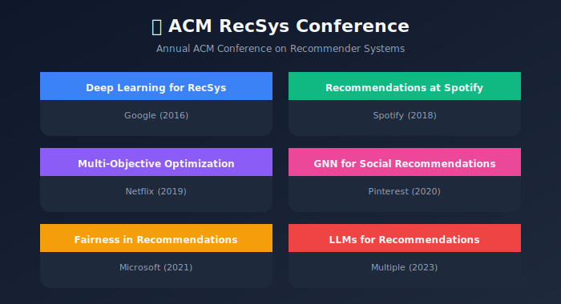
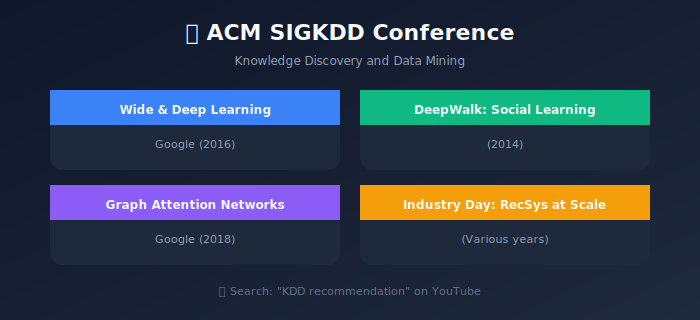
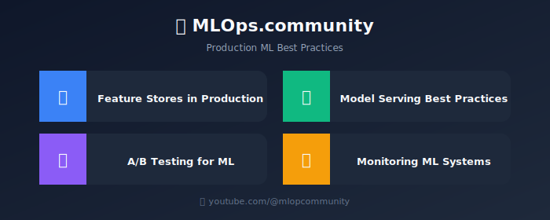
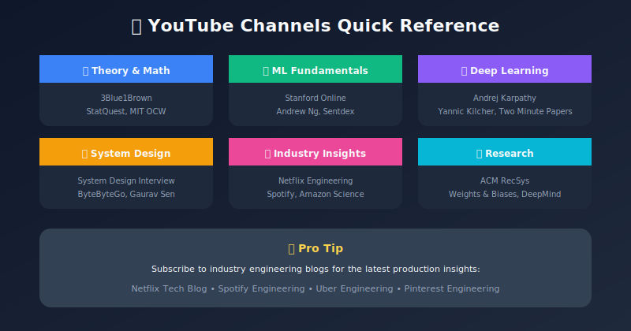

# YouTube Channels & Video Resources

## Complete Guide to Learning Recommendation Systems via Video

---

## 🎬 Top YouTube Channels for RecSys & ML

### 1. Academic & Research Focused

| Channel | Focus | Best For |
|---------|-------|----------|
| **[Stanford Online](https://www.youtube.com/@stanfordonline)** | CS229, CS246, CS224W | Foundational ML, Mining Data, Graph ML |
| **[MIT OpenCourseWare](https://www.youtube.com/@mitocw)** | 6.034, 6.036 | AI fundamentals, intro to ML |
| **[CMU Machine Learning](https://www.youtube.com/@caraborea)** | 10-701, 10-605 | Advanced ML theory |
| **[Weights & Biases](https://www.youtube.com/@WeightsBiases)** | MLOps, practical ML | Production ML, experiment tracking |
| **[DeepMind](https://www.youtube.com/@Google_DeepMind)** | Research talks | Cutting-edge AI research |

### 2. Industry & Applied ML

| Channel | Focus | Best For |
|---------|-------|----------|
| **[Google AI](https://www.youtube.com/@GoogleAI)** | TensorFlow, research | Google's ML innovations |
| **[Meta AI](https://www.youtube.com/@MetaAI)** | PyTorch, FAIR research | Meta's ML systems |
| **[Netflix Tech Blog](https://www.youtube.com/@NetflixEngineering)** | Netflix architecture | Streaming recommendations |
| **[Spotify Engineering](https://www.youtube.com/@SpotifyEngineering)** | Music recommendations | Audio ML, personalization |
| **[Amazon Science](https://www.youtube.com/@amazonscience)** | E-commerce ML | Product recommendations |

### 3. System Design & Engineering

| Channel | Focus | Best For |
|---------|-------|----------|
| **[System Design Interview](https://www.youtube.com/@SystemDesignInterview)** | System design | Interview prep, architecture |
| **[ByteByteGo](https://www.youtube.com/@ByteByteGo)** | System design | Scalable systems |
| **[Gaurav Sen](https://www.youtube.com/@gaborsen)** | System design | HLD concepts |
| **[Hussein Nasser](https://www.youtube.com/@haborsen)** | Backend engineering | Databases, networking |
| **[ArjanCodes](https://www.youtube.com/@ArjanCodes)** | Python, software design | Clean code, patterns |

### 4. ML Tutorials & Courses

| Channel | Focus | Best For |
|---------|-------|----------|
| **[Andrej Karpathy](https://www.youtube.com/@AndrejKarpathy)** | Deep learning | Neural networks from scratch |
| **[3Blue1Brown](https://www.youtube.com/@3blue1brown)** | Math visualization | Linear algebra, neural nets |
| **[StatQuest](https://www.youtube.com/@statquest)** | Statistics, ML basics | Intuitive explanations |
| **[Sentdex](https://www.youtube.com/@sentdex)** | Python, ML tutorials | Practical implementations |
| **[Two Minute Papers](https://www.youtube.com/@TwoMinutePapers)** | Research summaries | Latest AI papers |
| **[Yannic Kilcher](https://www.youtube.com/@YannicKilcher)** | Paper explanations | Deep dive into papers |

---

## 📚 Recommended Video Playlists

### Recommendation Systems Specific

#### Stanford CS246 - Mining Massive Datasets

```
🎓 Stanford Online
📺 https://www.youtube.com/playlist?list=PLLssT5z_DsK9JDLcT8T62VtzwyW-LNepV

Topics:

- Lecture 9: Recommendation Systems

- Lecture 10: Dimensionality Reduction (SVD)

- Lecture 11: Clustering

- Lecture 14: Mining Social Networks

```

#### Recommender Systems Course (Andrew Ng)

```
🎓 Coursera / DeepLearning.AI
📺 Available on Coursera

Topics:

- Content-Based Filtering

- Collaborative Filtering

- Deep Learning for RecSys

- Evaluation Metrics

```

#### RecSys Conference Talks

```
🎓 ACM RecSys
📺 https://www.youtube.com/@acmrecsys

Topics:

- Industry talks from Netflix, Spotify, Amazon

- Research paper presentations

- Tutorial sessions

- Best paper awards

```

### Deep Learning Foundations

#### Neural Networks: Zero to Hero (Andrej Karpathy)

```
🎓 Andrej Karpathy
📺 https://www.youtube.com/playlist?list=PLAqhIrjkxbuWI23v9cThsA9GvCAUhRvKZ

Topics:

- Building neural networks from scratch

- Backpropagation

- Language models (relevant for sequence RecSys)

```

#### Deep Learning Specialization

```
🎓 DeepLearning.AI
📺 Available on Coursera

Topics:

- Neural Networks basics

- Sequence Models (for session-based recs)

- Attention mechanisms

```

### System Design

#### System Design for ML

```
🎓 Made With ML
📺 https://madewithml.com/

Topics:

- ML system design

- Feature stores

- Model serving

- Monitoring

```

---

## 🎯 Curated Video List by Topic

### Introduction to RecSys

| Video | Channel | Duration | Link |
|-------|---------|----------|------|
| How Netflix's Recommendations Work | Vox | 7 min | [Watch](https://www.youtube.com/watch?v=5dTOPen9GlM) |
| Recommendation Systems Explained | Google Cloud | 15 min | [Watch](https://www.youtube.com/watch?v=n3RKsY2H-NE) |
| How YouTube's Algorithm Works | Veritasium | 18 min | [Watch](https://www.youtube.com/watch?v=fHsa9DqmId8) |
| The Algorithm That Changed Netflix | Half as Interesting | 10 min | [Watch](https://www.youtube.com/watch?v=g6pBV3x5XMk) |

### Collaborative Filtering

| Video | Channel | Duration | Link |
|-------|---------|----------|------|
| Collaborative Filtering Explained | ritvikmath | 12 min | [Watch](https://www.youtube.com/watch?v=h9gpufJFF-0) |
| Matrix Factorization for RecSys | Stanford CS246 | 45 min | [Watch](https://www.youtube.com/watch?v=ZspR5PZemcs) |
| SVD Explained | StatQuest | 15 min | [Watch](https://www.youtube.com/watch?v=FgakZw6K1QQ) |
| ALS Algorithm Deep Dive | Spark Summit | 30 min | [Watch](https://www.youtube.com/watch?v=FgGjc5oabrA) |

### Deep Learning for Recommendations

| Video | Channel | Duration | Link |
|-------|---------|----------|------|
| Neural Collaborative Filtering | Papers with Code | 20 min | [Watch](https://www.youtube.com/watch?v=ZkBQ6YA9E40) |
| YouTube's Deep Neural Network | Two Minute Papers | 5 min | [Watch](https://www.youtube.com/watch?v=BfNNxKL7Kok) |
| Transformers for RecSys | Weights & Biases | 45 min | [Watch](https://www.youtube.com/watch?v=Pz_WtWLQ6CE) |
| Graph Neural Networks Intro | Stanford CS224W | 80 min | [Watch](https://www.youtube.com/watch?v=JAB_plj2rbA) |
| BERT4Rec Explained | Yannic Kilcher | 25 min | [Watch](https://www.youtube.com/watch?v=BbuxP5dOXho) |

### System Design & Production

| Video | Channel | Duration | Link |
|-------|---------|----------|------|
| Design a Recommendation System | System Design Interview | 25 min | [Watch](https://www.youtube.com/watch?v=QQaVDMPw3mo) |
| Netflix System Design | Gaurav Sen | 20 min | [Watch](https://www.youtube.com/watch?v=psQzyFfsUGU) |
| ML System Design | ByteByteGo | 15 min | [Watch](https://www.youtube.com/watch?v=lBRQXwmZ5tQ) |
| Feature Stores Explained | Tecton | 30 min | [Watch](https://www.youtube.com/watch?v=YMxU1X-TQrU) |
| Scaling RecSys at Pinterest | Strange Loop | 40 min | [Watch](https://www.youtube.com/watch?v=4NDp2P2a17s) |

### Industry Case Studies

| Video | Channel | Duration | Link |
|-------|---------|----------|------|
| Netflix Recommendations | Netflix TechBlog | 45 min | [Watch](https://www.youtube.com/watch?v=f8OK1HBEgn0) |
| Spotify's Discover Weekly | Spotify Engineering | 35 min | [Watch](https://www.youtube.com/watch?v=0jspaMLxBig) |
| Pinterest's Visual Search | Pinterest Engineering | 30 min | [Watch](https://www.youtube.com/watch?v=jmPPMxsRKX8) |
| TikTok Algorithm Explained | The Wall Street Journal | 12 min | [Watch](https://www.youtube.com/watch?v=nfczi2cI6Cs) |
| Amazon's Recommendation Engine | AWS re:Invent | 50 min | [Watch](https://www.youtube.com/watch?v=5aMIr2HdSbE) |
| Airbnb Search Ranking | Airbnb Engineering | 40 min | [Watch](https://www.youtube.com/watch?v=tPb2u9kwh2w) |
| Uber's ML Platform | Uber Engineering | 35 min | [Watch](https://www.youtube.com/watch?v=qLwl2-5z5AA) |

---

## 🏆 Must-Watch Conference Talks

### RecSys Conference



### KDD Conference



### MLOps Community



---

## 📱 Podcasts (Audio/Video)

| Podcast | Host | Focus |
|---------|------|-------|
| **Practical AI** | Changelog | Applied ML |
| **Machine Learning Street Talk** | Various | Research discussions |
| **The TWIML AI Podcast** | Sam Charrington | Industry interviews |
| **Data Skeptic** | Kyle Polich | Data science topics |
| **Lex Fridman Podcast** | Lex Fridman | AI researchers |
| **Gradient Dissent** | Weights & Biases | ML practitioners |

---

## 📅 Learning Path with Videos

### Week 1-2: Foundations

```
Day 1-2: Watch 3Blue1Brown Linear Algebra series
Day 3-4: StatQuest ML basics playlist
Day 5-7: Stanford CS246 Lecture 9-10 (RecSys basics)
Day 8-10: Andrew Ng's RecSys course (Coursera)
Day 11-14: Practice with tutorials (Sentdex, etc.)

```

### Week 3-4: Deep Learning

```
Day 1-3: Andrej Karpathy's Neural Networks series
Day 4-6: Deep Learning Specialization (relevant parts)
Day 7-10: NCF, Two-Tower, Sequence model papers
Day 11-14: Implement from tutorials

```

### Week 5-6: Production & System Design

```
Day 1-3: System Design Interview - RecSys videos
Day 4-6: ByteByteGo system design content
Day 7-10: Industry talks (Netflix, Spotify, Pinterest)
Day 11-14: Design your own system

```

---

## 🔗 Additional Video Resources

### YouTube Playlists to Subscribe

1. **Stanford CS229 Machine Learning** - Full course
2. **Stanford CS231n Computer Vision** - CNN foundations
3. **Stanford CS224W Graph ML** - GNN for RecSys
4. **Stanford CS224N NLP** - Transformers, attention
5. **Fast.ai Practical Deep Learning** - Hands-on tutorials

### Webinar Series

- **Databricks ML Sessions** - MLOps, Spark ML

- **AWS ML Webinars** - Amazon Personalize

- **Google Cloud AI** - Vertex AI, Recommendations AI

- **Weights & Biases Webinars** - MLOps best practices

---

## 📌 Quick Reference Card



---

*Last Updated: January 2026*
*Curated for ML System Design Study Group*

