# Introduction to Recommendation Systems

## A Complete Guide to Understanding Modern Recommendation Engines

---

## 📊 Visual Overview

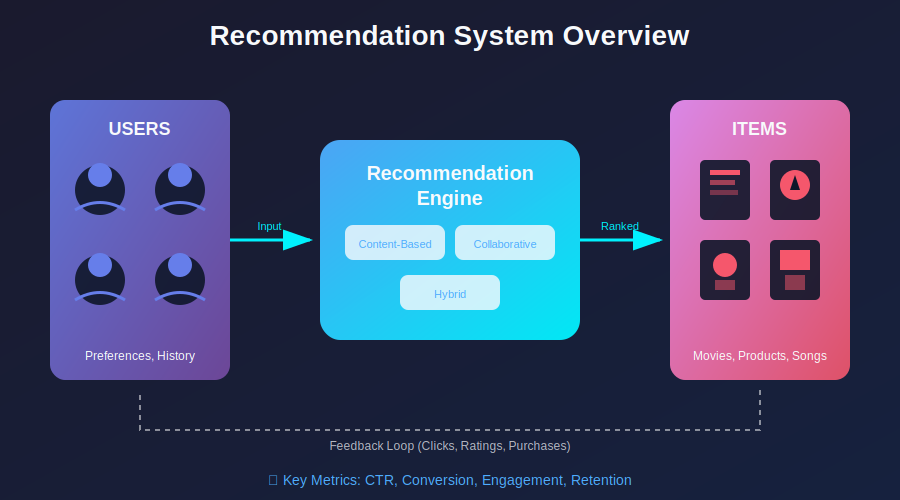

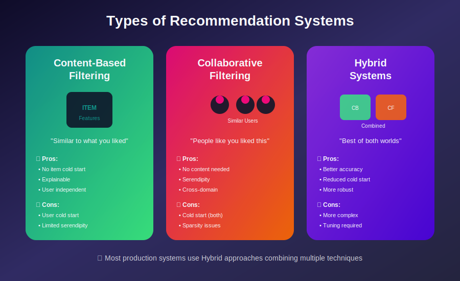

---

## 📖 Table of Contents

1. [What are Recommendation Systems?](#what-are-recommendation-systems)
2. [Why Recommendation Systems Matter](#why-recommendation-systems-matter)
3. [Historical Evolution](#historical-evolution)
4. [Core Components](#core-components)
5. [Types of Recommendation Systems](#types-of-recommendation-systems)
6. [Key Challenges](#key-challenges)
7. [Industry Applications](#industry-applications)
8. [Metrics and Evaluation](#metrics-and-evaluation)
9. [Getting Started](#getting-started)

---

## What are Recommendation Systems?

**Recommendation Systems** (also known as Recommender Systems or RecSys) are a subclass of information filtering systems that predict the "rating" or "preference" a user would give to an item. They are the backbone of personalized experiences across the digital world.

### Formal Definition

> A recommendation system is a function `f(U, I, C) → R` where:
> - **U** = Set of users
> - **I** = Set of items
> - **C** = Context (time, location, device, etc.)
> - **R** = Predicted relevance/rating

### Real-World Analogy

Think of a recommendation system as a highly knowledgeable friend who:
- Knows your preferences deeply
- Has knowledge about millions of products/content
- Can predict what you'll like before you even know it exists
- Learns and adapts from your behavior

---

## Why Recommendation Systems Matter

### Business Impact

| Metric | Impact |
|--------|--------|
| **Netflix** | 80% of watched content comes from recommendations |
| **Amazon** | 35% of revenue attributed to recommendations |
| **YouTube** | 70% of watch time from recommended videos |
| **Spotify** | Discover Weekly has 40M+ active users |

### The Information Overload Problem

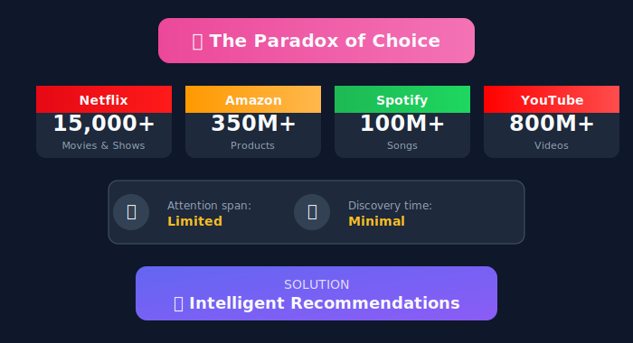

### Value Proposition

1. **For Users:**
   - Discover relevant content/products
   - Save time in decision-making
   - Personalized experience
   - Serendipitous discoveries

2. **For Businesses:**
   - Increased engagement and retention
   - Higher conversion rates
   - Improved customer satisfaction
   - Competitive differentiation

---

## Historical Evolution

### Timeline of Recommendation Systems

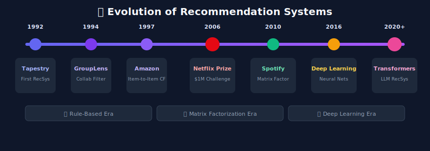

### Key Milestones

| Year | Milestone | Significance |
|------|-----------|--------------|
| 1992 | Tapestry System | First documented collaborative filtering |
| 1994 | GroupLens | Email filtering based on user ratings |
| 1997 | Amazon's Item-to-Item CF | Scalable e-commerce recommendations |
| 2006 | Netflix Prize | $1M competition sparks research boom |
| 2009 | BellKor's Solution | Matrix factorization becomes standard |
| 2016 | Deep Learning Era | Neural networks for recommendations |
| 2020+ | Transformers & LLMs | Foundation models for RecSys |

---

## Core Components

### System Architecture Overview

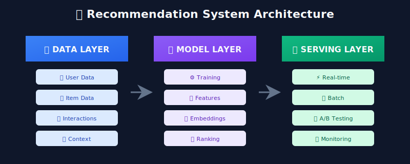

### 1. Data Layer

The foundation of any recommendation system:

- **User Data:** Demographics, preferences, history
- **Item Data:** Attributes, categories, metadata
- **Interaction Data:** Clicks, views, purchases, ratings
- **Contextual Data:** Time, location, device, session

### 2. Model Layer

The intelligence of the system:

- **Candidate Generation:** Reduce millions to thousands
- **Ranking:** Score and order candidates
- **Re-ranking:** Apply business rules and diversity

### 3. Serving Layer

Delivering recommendations at scale:

- **Low Latency:** < 100ms response time
- **High Throughput:** Millions of requests/second
- **Reliability:** 99.99% uptime

---

## Types of Recommendation Systems

### Overview Comparison

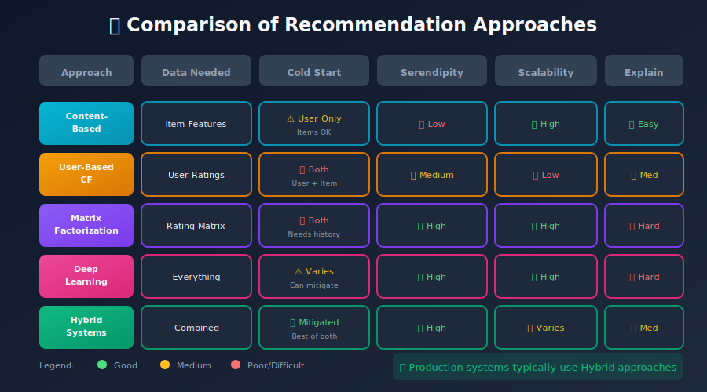

### Quick Comparison Table

| Approach | Data Needed | Cold Start | Serendipity | Scalability |
|----------|-------------|------------|-------------|-------------|
| Content-Based | Item features | User only | Low | High |
| User-Based CF | User ratings | Both | Medium | Low |
| Item-Based CF | Item ratings | User only | Medium | Medium |
| Matrix Factorization | Ratings | Both | High | High |
| Deep Learning | Everything | Varies | High | High |
| Hybrid | Combined | Mitigated | High | Varies |

---

## Key Challenges

### 1. Cold Start Problem

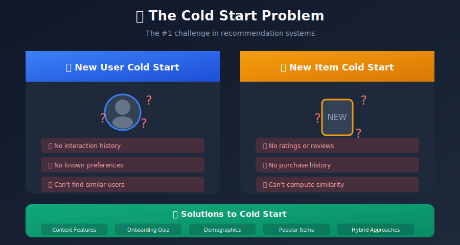

### 2. Scalability

- **Netflix:** 230M+ subscribers × 15K+ titles
- **Amazon:** 300M+ users × 350M+ products
- **YouTube:** 2B+ users × 800M+ videos

**Solution Architecture:**
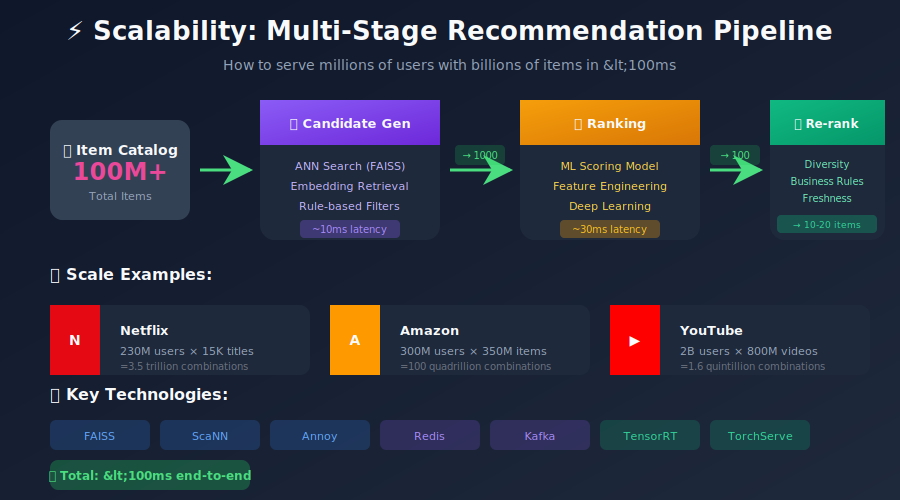

### 3. Filter Bubbles & Echo Chambers

The risk of showing only similar content:

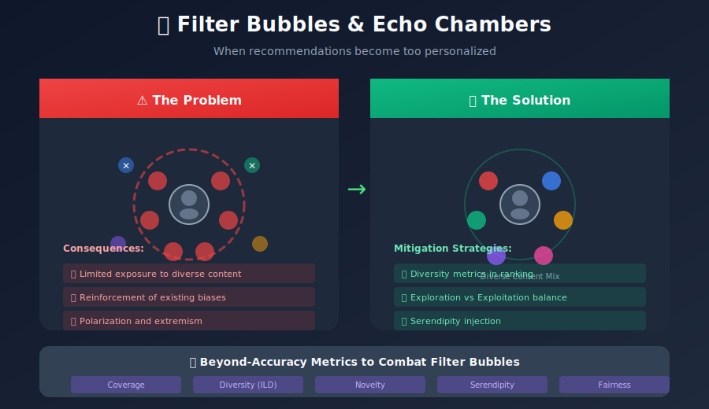

### 4. Data Sparsity

```
User-Item Matrix (Simplified Example)

        Item1  Item2  Item3  Item4  Item5  ... ItemN
User1     5      ?      ?      3      ?   ...   ?
User2     ?      4      ?      ?      2   ...   ?
User3     ?      ?      5      ?      ?   ...   1
User4     3      ?      ?      ?      ?   ...   ?
...      ...    ...    ...    ...    ...  ...  ...
UserM     ?      ?      2      ?      ?   ...   ?

Typical sparsity: 99%+ empty cells

```

---

## Industry Applications

### E-Commerce (Amazon, Alibaba)

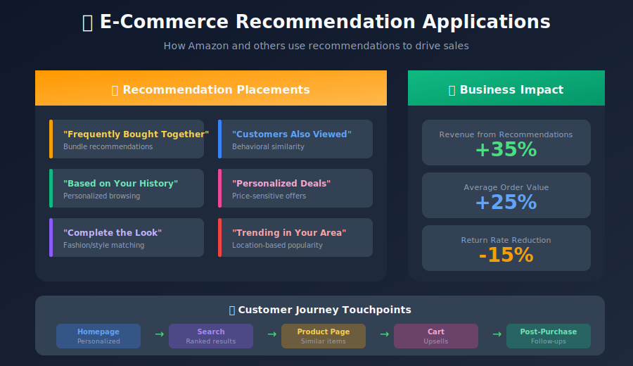

### Streaming (Netflix, Spotify, YouTube)

- Personalized content discovery
- "Continue Watching" features
- Playlist generation
- Thumbnail personalization

### Social Media (TikTok, Instagram, Twitter)

- Feed ranking
- Friend suggestions
- Content recommendations
- Ad targeting

### News & Content (Google News, Medium)

- Article recommendations
- Topic clustering
- Personalized newsletters

---

## Metrics and Evaluation

### Offline Metrics

| Metric | Formula | Use Case |
|--------|---------|----------|
| **RMSE** | √(Σ(actual-predicted)²/n) | Rating prediction |
| **MAE** | Σ|actual-predicted|/n | Rating prediction |
| **Precision@K** | Relevant in top-K / K | Ranking quality |
| **Recall@K** | Relevant in top-K / Total relevant | Coverage |
| **NDCG@K** | DCG@K / IDCG@K | Ranking with relevance grades |
| **MAP** | Mean of AP across queries | Overall ranking |
| **Hit Rate** | Users with ≥1 hit / Total users | Basic coverage |
| **Coverage** | Recommended items / Total items | Catalog coverage |
| **Diversity** | Average pairwise distance | Recommendation variety |

### Online Metrics

- **Click-Through Rate (CTR):** Clicks / Impressions
- **Conversion Rate:** Purchases / Clicks
- **Session Duration:** Time spent on platform
- **User Retention:** Return rate over time
- **Revenue per User:** Direct business impact

### A/B Testing Framework

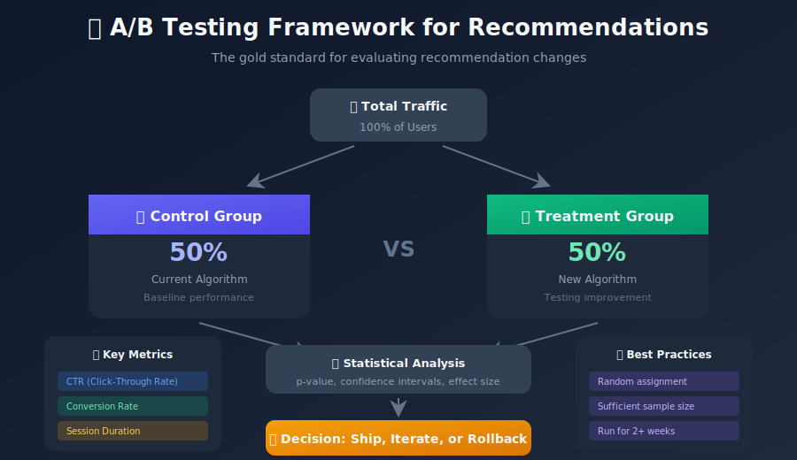

---

## Getting Started

### Learning Path

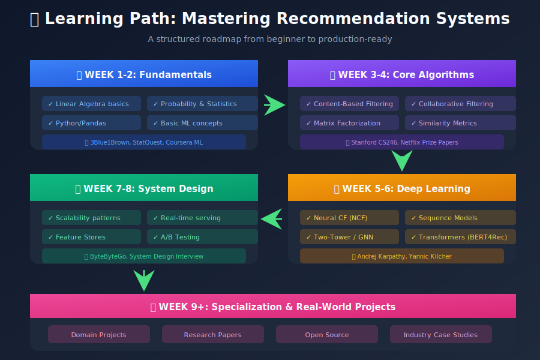

### Recommended Resources

**Books:**
- "Recommender Systems Handbook" - Ricci et al.
- "Practical Recommender Systems" - Kim Falk
- "Deep Learning for Recommender Systems" - Zhang et al.

**Courses:**
- Stanford CS246: Mining Massive Data Sets
- Coursera: Recommender Systems Specialization
- Fast.ai: Practical Deep Learning

**Papers:**
- Amazon's Item-to-Item Collaborative Filtering
- Matrix Factorization for Recommender Systems
- Deep Neural Networks for YouTube Recommendations
- Wide & Deep Learning for Recommender Systems

---

## Summary

Recommendation systems are at the heart of modern digital experiences. They solve the fundamental problem of connecting users with relevant content in an ocean of choices. From Netflix to Amazon, from TikTok to Spotify, these systems drive engagement, revenue, and user satisfaction.

### Key Takeaways

1. **RecSys is essential** for any platform with large catalogs
2. **Multiple approaches** exist with different trade-offs
3. **Hybrid systems** often perform best in practice
4. **Evaluation** requires both offline metrics and online A/B tests
5. **Challenges** like cold start and scalability need careful design
6. **Ethics** matter - be mindful of filter bubbles and bias

---

## 🎬 Video Resources

### Recommended YouTube Videos

| Video | Channel | Duration |
|-------|---------|----------|
| [How Netflix's Recommendations Work](https://www.youtube.com/watch?v=5dTOPen9GlM) | Vox | 7 min |
| [Recommendation Systems Explained](https://www.youtube.com/watch?v=n3RKsY2H-NE) | Google Cloud | 15 min |
| [How YouTube's Algorithm Works](https://www.youtube.com/watch?v=fHsa9DqmId8) | Veritasium | 18 min |
| [The Algorithm That Changed Netflix](https://www.youtube.com/watch?v=g6pBV3x5XMk) | Half as Interesting | 10 min |

### Recommended Channels
- **[Stanford Online](https://www.youtube.com/@stanfordonline)** - CS246 Mining Massive Datasets
- **[StatQuest](https://www.youtube.com/@statquest)** - ML fundamentals explained simply
- **[3Blue1Brown](https://www.youtube.com/@3blue1brown)** - Linear algebra visualizations

### Full Courses
- **Stanford CS246** - Mining Massive Data Sets (Lecture 9-10 for RecSys)
- **Coursera RecSys Specialization** - University of Minnesota
- **Google ML Crash Course** - Recommendation Systems module

---

## Next Steps

Continue to the next module: [Content-Based Filtering](../02_content_based_filtering/README.md)

---

*Last Updated: January 2026*
*Author: ML System Design Study Group*

---

<div align="center">

**[⬆ Back to Top](#)** | **[📚 Main Repository](https://github.com/Gaurav14cs17/ml_system_design)**

Made with 💜 by [Gaurav14cs17](https://github.com/Gaurav14cs17)

</div>
