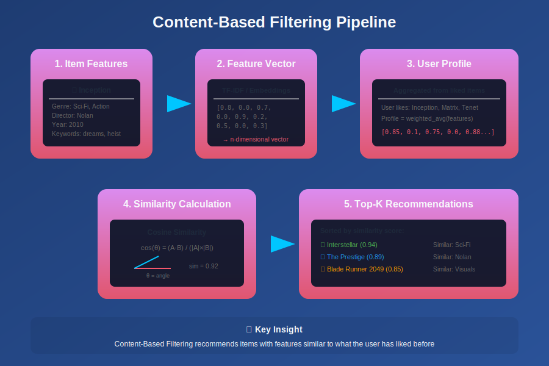
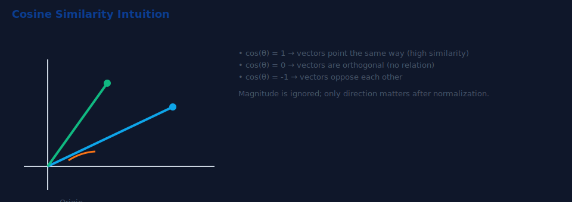
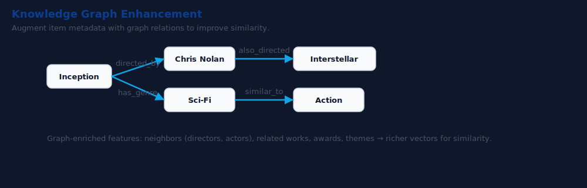
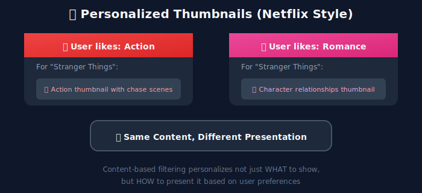
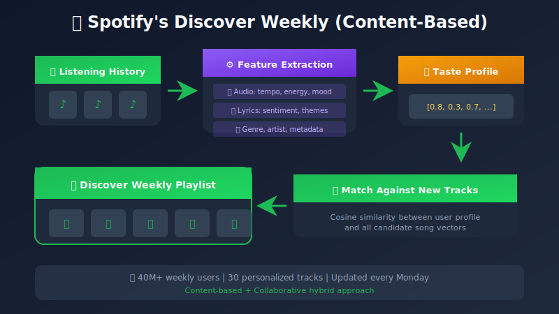

# Content-Based Filtering

## A Deep Dive into Item Feature-Based Recommendations

---

## 📊 Visual Overview



---

## 📖 Table of Contents

1. [Introduction](#introduction)
2. [How Content-Based Filtering Works](#how-content-based-filtering-works)
3. [Feature Extraction Techniques](#feature-extraction-techniques)
4. [Similarity Metrics](#similarity-metrics)
5. [Building User Profiles](#building-user-profiles)
6. [Implementation from Scratch](#implementation-from-scratch)
7. [Advanced Techniques](#advanced-techniques)
8. [Pros and Cons](#pros-and-cons)
9. [Real-World Applications](#real-world-applications)
10. [Best Practices](#best-practices)

---

## Introduction

**Content-Based Filtering** recommends items based on a comparison between the content of items and a user's preferences. The key idea is: *"If you liked item X with features A, B, C, you'll probably like item Y with similar features."*

### Core Philosophy


### When to Use Content-Based Filtering

| Scenario | Why It Works |
|----------|--------------|
| New items with no ratings | Uses item features, not interaction history |
| Niche items with few interactions | Doesn't need popularity |
| Explainable recommendations needed | "Because you liked similar items" |
| Privacy concerns | Doesn't need other users' data |
| Domain with rich metadata | Books, movies, products with descriptions |

---

## How Content-Based Filtering Works

### The Algorithm Pipeline


### Mathematical Formulation

**Item Representation:**

```
Item i = [f₁, f₂, f₃, ..., fₙ]
Where fⱼ represents the j-th feature value

```

**User Profile Construction:**

```
User Profile(u) = Σᵢ (ratingᵤᵢ × Item_Vectorᵢ) / Σᵢ ratingᵤᵢ

Or using TF-IDF weights:
User Profile(u) = Σᵢ (tfidf_weightᵢ × Item_Vectorᵢ)

```

**Prediction/Scoring:**

```
score(u, i) = similarity(User_Profile(u), Item_Vector(i))
            = cos(θ) = (u · i) / (||u|| × ||i||)

```

---

## Feature Extraction Techniques

### 1. Structured Features (Metadata)

```python
# Example: Movie metadata features
movie_features = {
    "Inception": {
        "genres": ["Sci-Fi", "Action", "Thriller"],
        "director": "Christopher Nolan",
        "year": 2010,
        "duration": 148,
        "rating": "PG-13",
        "actors": ["Leonardo DiCaprio", "Joseph Gordon-Levitt"],
        "language": "English",
        "budget": 160000000
    }
}

```

**One-Hot Encoding for Categorical Features:**

```
Genres: [Action, Comedy, Drama, Horror, Sci-Fi, Thriller]
Inception: [1, 0, 0, 0, 1, 1]  # Action=1, Sci-Fi=1, Thriller=1

```

### 2. Text-Based Features

#### TF-IDF (Term Frequency-Inverse Document Frequency)

```
TF(t, d) = (Number of times t appears in d) / (Total terms in d)

IDF(t) = log(Total documents / Documents containing t)

TF-IDF(t, d) = TF(t, d) × IDF(t)

```

**Visual Example:**


#### Word Embeddings (Word2Vec, GloVe)

```python
from gensim.models import Word2Vec

# Train or load pre-trained embeddings
# Each word → Dense vector (100-300 dimensions)
word_vectors = Word2Vec.load("word2vec.model")

# Document embedding = Average of word embeddings
def get_document_embedding(text, model, dim=300):
    words = text.lower().split()
    vectors = [model.wv[w] for w in words if w in model.wv]
    if vectors:
        return np.mean(vectors, axis=0)
    return np.zeros(dim)

```

### 3. Image-Based Features

For visual items (products, fashion, art):


### 4. Audio Features (for Music)

```python
# Spotify-style audio features
audio_features = {
    "song_id": "track_123",
    "danceability": 0.735,      # 0.0 to 1.0
    "energy": 0.578,            # 0.0 to 1.0
    "key": 5,                   # 0-11 (C to B)
    "loudness": -11.840,        # dB
    "mode": 1,                  # Major (1) or Minor (0)
    "speechiness": 0.0461,      # 0.0 to 1.0
    "acousticness": 0.514,      # 0.0 to 1.0
    "instrumentalness": 0.0902, # 0.0 to 1.0
    "liveness": 0.159,          # 0.0 to 1.0
    "valence": 0.624,           # 0.0 to 1.0 (positivity)
    "tempo": 98.002,            # BPM
}

```

---

## Similarity Metrics

### 1. Cosine Similarity (Most Common)

```
cos(θ) = (A · B) / (||A|| × ||B||)
       = Σ(Aᵢ × Bᵢ) / (√Σ(Aᵢ²) × √Σ(Bᵢ²))

Range: [-1, 1] (typically [0, 1] for positive vectors)

```

**Visual Intuition:**



### 2. Euclidean Distance

```
d(A, B) = √Σ(Aᵢ - Bᵢ)²

To convert to similarity:
similarity = 1 / (1 + distance)

```

### 3. Jaccard Similarity (for Sets)

```
J(A, B) = |A ∩ B| / |A ∪ B|

Example:
Movie A genres: {Action, Sci-Fi, Thriller}
Movie B genres: {Action, Horror, Thriller}

J = |{Action, Thriller}| / |{Action, Sci-Fi, Thriller, Horror}|
  = 2 / 4 = 0.5

```

### 4. Pearson Correlation

```
r = Σ((Aᵢ - Ā)(Bᵢ - B̄)) / (√Σ(Aᵢ - Ā)² × √Σ(Bᵢ - B̄)²)

Range: [-1, 1]
Useful when dealing with rating data

```

### Comparison Table

| Metric | Best For | Magnitude Sensitive | Range |
|--------|----------|---------------------|-------|
| Cosine | Text, sparse vectors | No | [-1, 1] |
| Euclidean | Dense, numeric features | Yes | [0, ∞) |
| Jaccard | Categorical, sets | No | [0, 1] |
| Pearson | Rating data | No | [-1, 1] |

---

## Building User Profiles

### Profile Construction Methods

#### Method 1: Weighted Average

```python
def build_user_profile_weighted(user_id, ratings, item_features):
    """
    Build user profile as weighted average of item features
    Weights = user ratings
    """
    profile = np.zeros(item_features.shape[1])
    total_weight = 0

    for item_id, rating in ratings[user_id].items():
        profile += rating * item_features[item_id]
        total_weight += rating

    return profile / total_weight if total_weight > 0 else profile

```

#### Method 2: TF-IDF Weighted

```python
def build_user_profile_tfidf(user_id, liked_items, tfidf_matrix):
    """
    Build user profile using TF-IDF features
    """
    liked_indices = [item_to_idx[item] for item in liked_items]
    user_profile = tfidf_matrix[liked_indices].mean(axis=0)
    return np.asarray(user_profile).flatten()

```

#### Method 3: Exponential Time Decay

```python
def build_user_profile_decay(user_id, interactions, item_features,
                              decay_rate=0.1):
    """
    Recent interactions weighted more heavily
    """
    profile = np.zeros(item_features.shape[1])
    total_weight = 0
    current_time = time.time()

    for item_id, timestamp, rating in interactions[user_id]:
        age = (current_time - timestamp) / 86400  # Days
        weight = rating * np.exp(-decay_rate * age)
        profile += weight * item_features[item_id]
        total_weight += weight

    return profile / total_weight if total_weight > 0 else profile

```

### Profile Update Strategies


---

## Implementation from Scratch

### Complete Python Implementation

```python
import numpy as np
import pandas as pd
from sklearn.feature_extraction.text import TfidfVectorizer
from sklearn.metrics.pairwise import cosine_similarity
from collections import defaultdict

class ContentBasedRecommender:
    """
    A complete Content-Based Filtering recommendation system.
    """

    def __init__(self):
        self.tfidf_vectorizer = TfidfVectorizer(
            max_features=5000,
            stop_words='english',
            ngram_range=(1, 2)
        )
        self.item_features = None
        self.item_ids = None
        self.user_profiles = {}
        self.item_id_to_idx = {}

    def fit(self, items_df, content_column='description'):
        """
        Build item feature matrix from content.

        Parameters:
        -----------
        items_df : DataFrame with 'item_id' and content_column
        content_column : Column containing text content
        """
        self.item_ids = items_df['item_id'].values
        self.item_id_to_idx = {
            item_id: idx for idx, item_id in enumerate(self.item_ids)
        }

        # Create TF-IDF matrix
        self.item_features = self.tfidf_vectorizer.fit_transform(
            items_df[content_column].fillna('')
        )

        print(f"Built feature matrix: {self.item_features.shape}")
        return self

    def build_user_profile(self, user_id, liked_items, ratings=None):
        """
        Build user profile from liked items.

        Parameters:
        -----------
        user_id : User identifier
        liked_items : List of item_ids user has liked
        ratings : Optional dict of {item_id: rating}
        """
        if len(liked_items) == 0:
            return None

        # Get indices of liked items
        valid_items = [
            item for item in liked_items
            if item in self.item_id_to_idx
        ]

        if len(valid_items) == 0:
            return None

        indices = [self.item_id_to_idx[item] for item in valid_items]

        # Compute weighted average
        if ratings:
            weights = np.array([ratings.get(item, 1.0) for item in valid_items])
            weighted_features = self.item_features[indices].multiply(
                weights.reshape(-1, 1)
            )
            profile = weighted_features.sum(axis=0) / weights.sum()
        else:
            profile = self.item_features[indices].mean(axis=0)

        self.user_profiles[user_id] = np.asarray(profile).flatten()
        return self.user_profiles[user_id]

    def recommend(self, user_id, n_recommendations=10,
                  exclude_seen=True, seen_items=None):
        """
        Generate recommendations for a user.

        Parameters:
        -----------
        user_id : User identifier
        n_recommendations : Number of items to recommend
        exclude_seen : Whether to exclude already seen items
        seen_items : Set of item_ids user has already interacted with
        """
        if user_id not in self.user_profiles:
            raise ValueError(f"User {user_id} has no profile. "
                           f"Call build_user_profile first.")

        user_profile = self.user_profiles[user_id].reshape(1, -1)

        # Compute similarity with all items
        similarities = cosine_similarity(
            user_profile,
            self.item_features
        ).flatten()

        # Get top items
        if exclude_seen and seen_items:
            seen_indices = {
                self.item_id_to_idx[item]
                for item in seen_items
                if item in self.item_id_to_idx
            }
            for idx in seen_indices:
                similarities[idx] = -1

        top_indices = np.argsort(similarities)[::-1][:n_recommendations]

        recommendations = [
            {
                'item_id': self.item_ids[idx],
                'score': similarities[idx]
            }
            for idx in top_indices
        ]

        return recommendations

    def get_similar_items(self, item_id, n_similar=10):
        """
        Find items similar to a given item.
        """
        if item_id not in self.item_id_to_idx:
            raise ValueError(f"Item {item_id} not found")

        idx = self.item_id_to_idx[item_id]
        item_vector = self.item_features[idx]

        similarities = cosine_similarity(
            item_vector,
            self.item_features
        ).flatten()

        # Exclude the item itself
        similarities[idx] = -1

        top_indices = np.argsort(similarities)[::-1][:n_similar]

        return [
            {
                'item_id': self.item_ids[i],
                'score': similarities[i]
            }
            for i in top_indices
        ]

    def explain_recommendation(self, user_id, item_id, top_k_features=5):
        """
        Explain why an item was recommended.
        """
        if user_id not in self.user_profiles:
            return None

        if item_id not in self.item_id_to_idx:
            return None

        user_profile = self.user_profiles[user_id]
        item_idx = self.item_id_to_idx[item_id]
        item_vector = self.item_features[item_idx].toarray().flatten()

        # Find features contributing most to similarity
        feature_names = self.tfidf_vectorizer.get_feature_names_out()
        contribution = user_profile * item_vector

        top_feature_indices = np.argsort(contribution)[::-1][:top_k_features]

        explanations = [
            {
                'feature': feature_names[i],
                'contribution': contribution[i],
                'user_weight': user_profile[i],
                'item_weight': item_vector[i]
            }
            for i in top_feature_indices
            if contribution[i] > 0
        ]

        return explanations

# Example Usage
if __name__ == "__main__":
    # Sample movie data
    movies = pd.DataFrame({
        'item_id': ['m1', 'm2', 'm3', 'm4', 'm5'],
        'title': [
            'Inception',
            'The Dark Knight',
            'Interstellar',
            'The Notebook',
            'Titanic'
        ],
        'description': [
            'A thief who steals secrets through dreams takes on '
            'the task of planting an idea. Sci-fi action thriller.',
            'Batman fights the Joker in Gotham. Dark action thriller '
            'with stunning visuals and complex villain.',
            'A team of explorers travel through a wormhole in space. '
            'Epic sci-fi drama about love and survival.',
            'A romantic story between two people from different '
            'social classes. Love drama and emotional journey.',
            'A love story set on the ill-fated Titanic ship. '
            'Romance drama with tragedy and beautiful cinematography.'
        ]
    })

    # Initialize and fit
    recommender = ContentBasedRecommender()
    recommender.fit(movies, content_column='description')

    # Build user profile (user likes sci-fi action movies)
    recommender.build_user_profile(
        user_id='user1',
        liked_items=['m1', 'm2'],
        ratings={'m1': 5, 'm2': 4}
    )

    # Get recommendations
    recommendations = recommender.recommend(
        user_id='user1',
        n_recommendations=3,
        seen_items={'m1', 'm2'}
    )

    print("\nRecommendations for user1:")
    for rec in recommendations:
        print(f"  {rec['item_id']}: {rec['score']:.4f}")

    # Find similar items
    similar = recommender.get_similar_items('m1', n_similar=2)
    print("\nItems similar to Inception:")
    for item in similar:
        print(f"  {item['item_id']}: {item['score']:.4f}")

```

---

## Advanced Techniques

### 1. Hybrid Content Features

Combine multiple feature types:

```python
class HybridContentRecommender:
    """
    Combines text, categorical, and numerical features.
    """

    def __init__(self, text_weight=0.5, cat_weight=0.3, num_weight=0.2):
        self.text_weight = text_weight
        self.cat_weight = cat_weight
        self.num_weight = num_weight

    def build_hybrid_features(self, items_df):
        # Text features (TF-IDF)
        text_features = self.build_text_features(items_df['description'])

        # Categorical features (One-hot)
        cat_features = self.build_categorical_features(
            items_df[['genre', 'director', 'rating']]
        )

        # Numerical features (Normalized)
        num_features = self.build_numerical_features(
            items_df[['year', 'duration', 'budget']]
        )

        # Combine with weights
        combined = np.hstack([
            self.text_weight * text_features,
            self.cat_weight * cat_features,
            self.num_weight * num_features
        ])

        return combined

```

### 2. Deep Content Features

Using neural networks for feature extraction:

```python
import torch
import torch.nn as nn
from transformers import BertModel, BertTokenizer

class DeepContentEncoder(nn.Module):
    """
    Use BERT for text understanding.
    """

    def __init__(self, output_dim=128):
        super().__init__()
        self.bert = BertModel.from_pretrained('bert-base-uncased')
        self.projection = nn.Linear(768, output_dim)

    def forward(self, input_ids, attention_mask):
        outputs = self.bert(input_ids, attention_mask)
        pooled = outputs.pooler_output  # [CLS] token
        projected = self.projection(pooled)
        return projected

# Using Sentence Transformers (simpler)
from sentence_transformers import SentenceTransformer

def get_semantic_embeddings(texts):
    model = SentenceTransformer('all-MiniLM-L6-v2')
    embeddings = model.encode(texts, show_progress_bar=True)
    return embeddings

```

### 3. Knowledge Graph Enhanced



---

## Pros and Cons

### Advantages ✅

| Advantage | Explanation |
|-----------|-------------|
| **No Cold Start for Items** | New items can be recommended immediately using features |
| **Transparency** | Easy to explain: "Because you liked X with feature Y" |
| **User Independence** | Doesn't need other users' data |
| **Domain Expertise** | Can leverage rich domain knowledge |
| **Niche Items** | Can recommend unpopular items with matching features |
| **Privacy** | No need to share user behavior with others |

### Disadvantages ❌

| Disadvantage | Explanation |
|--------------|-------------|
| **Cold Start for Users** | Need initial user preferences |
| **Limited Serendipity** | May not suggest surprising items |
| **Feature Engineering** | Requires good feature extraction |
| **Over-specialization** | Creates filter bubbles |
| **Feature Quality** | Recommendations are only as good as features |
| **Cannot Capture Quality** | A well-featured bad movie may be recommended |

### Mitigation Strategies


---

## Real-World Applications

### 1. Netflix Artwork Personalization

Netflix uses content-based features to personalize thumbnails:



### 2. Spotify's Discover Weekly



### 3. Amazon Product Recommendations

- Extract features: category, brand, price range, specifications

- Combine with product descriptions and reviews

- Match against user's browsing and purchase history

---

## Best Practices

### 1. Feature Engineering

```python
# DO: Combine multiple feature sources
features = combine([
    text_features,       # TF-IDF of descriptions
    metadata_features,   # Genre, year, rating
    embedding_features,  # Pre-trained embeddings
    behavioral_features  # Aggregate user signals
])

# DON'T: Use raw text without preprocessing
# DON'T: Ignore domain-specific features

```

### 2. Profile Updates

```python
# DO: Use time decay for evolving preferences
profile = α * recent_profile + (1-α) * historical_profile

# DO: Handle negative feedback
if rating < 3:
    profile -= β * item_features  # Negative signal

# DON'T: Only update on positive interactions

```

### 3. Evaluation

```python
# DO: Use multiple metrics
metrics = {
    'precision@10': calculate_precision(recs, ground_truth, k=10),
    'recall@10': calculate_recall(recs, ground_truth, k=10),
    'coverage': len(unique_recommended) / len(all_items),
    'diversity': calculate_diversity(recs)
}

# DON'T: Only optimize for accuracy (may hurt diversity)

```

### 4. System Design


---

## Summary

Content-Based Filtering is a powerful technique that leverages item features to make personalized recommendations. While it has limitations like reduced serendipity and user cold start, its transparency, independence from other users' data, and ability to recommend niche items make it an essential component of modern recommendation systems.

### Key Takeaways

1. **Feature quality is paramount** - invest in good feature extraction
2. **Combine multiple feature types** - text, metadata, images, etc.
3. **Handle user preferences dynamically** - time decay, negative feedback
4. **Balance relevance and diversity** - avoid over-specialization
5. **Use as part of a hybrid system** - combine with collaborative filtering

---

## 🎬 Video Resources

### Recommended YouTube Videos

| Video | Channel | Duration |
|-------|---------|----------|
| [Content-Based Filtering Explained](https://www.youtube.com/watch?v=9siFuMMHNIA) | ritvikmath | 10 min |
| [TF-IDF Explained](https://www.youtube.com/watch?v=hXNbFNCgPfY) | StatQuest | 12 min |
| [Word Embeddings - Word2Vec](https://www.youtube.com/watch?v=viZrOnJclY0) | StatQuest | 15 min |
| [Cosine Similarity Explained](https://www.youtube.com/watch?v=e9U0QAFbfLI) | Normalized Nerd | 8 min |
| [Sentence Transformers for Semantic Search](https://www.youtube.com/watch?v=OATCgQtNX2o) | James Briggs | 20 min |

### Deep Dive Tutorials

- **[Sentdex](https://www.youtube.com/@sentdex)** - Python NLP tutorials

- **[Krish Naik](https://www.youtube.com/@krishnaik06)** - NLP & feature extraction

### Papers with Video Explanations

- **Item-Based CF** - Original Amazon paper explained on Yannic Kilcher

---

## Next Steps

Continue to the next module: [Collaborative Filtering](../03_collaborative_filtering/README.md)

---

*Last Updated: January 2026*
*Author: ML System Design Study Group*

---

<div align="center">

**[⬆ Back to Top](#)** | **[📚 Main Repository](https://github.com/Gaurav14cs17/ml_system_design)**

Made with 💜 by [Gaurav14cs17](https://github.com/Gaurav14cs17)

</div>
