# Collaborative Filtering

## Learning from User Behavior Patterns to Make Recommendations

---

## 📊 Visual Overview

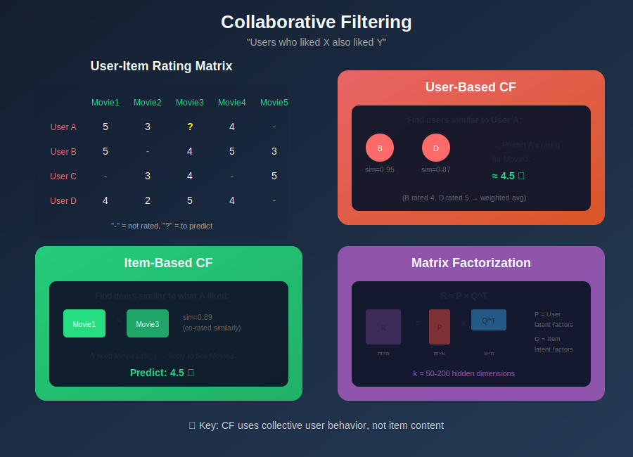

---

## 📖 Table of Contents

1. [Introduction](#introduction)
2. [Types of Collaborative Filtering](#types-of-collaborative-filtering)
3. [User-Based Collaborative Filtering](#user-based-collaborative-filtering)
4. [Item-Based Collaborative Filtering](#item-based-collaborative-filtering)
5. [Matrix Factorization](#matrix-factorization)
6. [Similarity Measures](#similarity-measures)
7. [Implementation Guide](#implementation)
8. [Handling Challenges](#handling-challenges)
9. [Production Considerations](#production-considerations)
10. [Best Practices](#best-practices)

---

## Introduction

**Collaborative Filtering (CF)** makes recommendations based on the collective preferences of users. The core assumption is:

> *"Users who agreed in the past will agree in the future."*

Unlike content-based filtering, CF doesn't require item features—it relies purely on user-item interaction patterns.

### The Power of Collective Wisdom

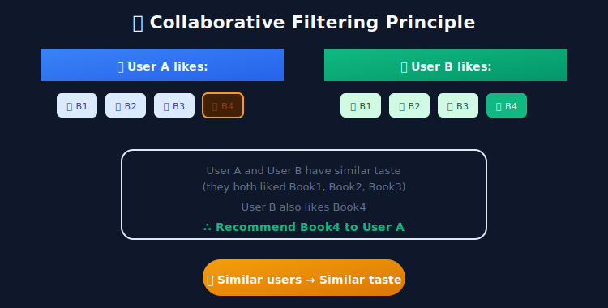

### Key Advantages

| Advantage | Description |
|-----------|-------------|
| **No Feature Engineering** | Works without item descriptions or metadata |
| **Serendipity** | Can recommend surprising, diverse items |
| **Cross-Domain** | Patterns transfer across categories |
| **Self-Improving** | Gets better with more user data |
| **Captures Nuance** | Learns implicit quality signals |

---

## Types of Collaborative Filtering

### Overview

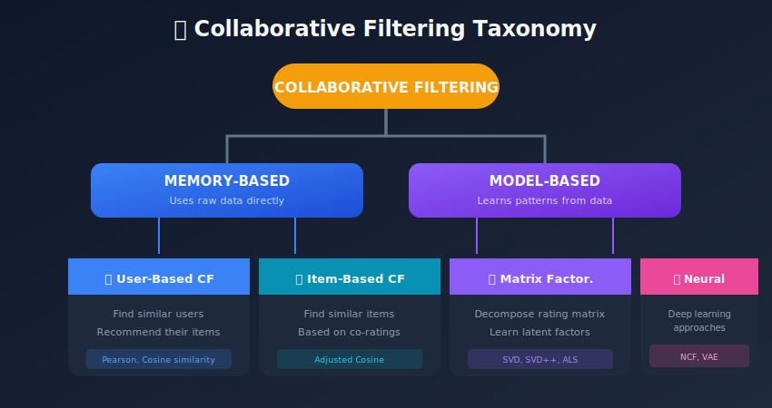

### Comparison Table

| Approach | Pros | Cons | Best For |
|----------|------|------|----------|
| **User-Based** | Intuitive, explainable | Scalability issues | Small user base |
| **Item-Based** | Stable, scalable | Less serendipity | E-commerce |
| **Matrix Factorization** | Handles sparsity, scalable | Less interpretable | Large-scale systems |
| **Neural CF** | Captures complex patterns | Needs lots of data | Rich interaction data |

---

## User-Based Collaborative Filtering

### How It Works

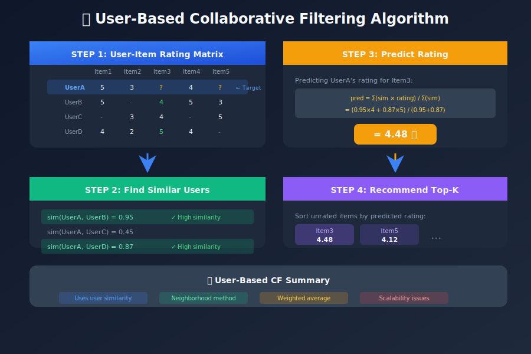

### Mathematical Formulation

**Similarity Calculation (Pearson Correlation):**

```
sim(u, v) = Σᵢ(rᵤᵢ - r̄ᵤ)(rᵥᵢ - r̄ᵥ) / √[Σᵢ(rᵤᵢ - r̄ᵤ)² × Σᵢ(rᵥᵢ - r̄ᵥ)²]

Where:
- rᵤᵢ = rating of user u on item i
- r̄ᵤ = mean rating of user u
- i ∈ items rated by both u and v

```

**Rating Prediction:**

```
pred(u, i) = r̄ᵤ + [Σᵥ sim(u,v) × (rᵥᵢ - r̄ᵥ)] / [Σᵥ |sim(u,v)|]

Where:
- v ∈ neighbors of u who rated item i
- sim(u,v) = similarity between users u and v

```

### Python Implementation

```python
import numpy as np
from collections import defaultdict
from scipy.spatial.distance import cosine

class UserBasedCF:
    """
    User-Based Collaborative Filtering implementation.
    """

    def __init__(self, k_neighbors=20, min_common_items=3):
        self.k = k_neighbors
        self.min_common = min_common_items
        self.ratings = None
        self.user_means = None
        self.similarity_cache = {}

    def fit(self, ratings_matrix):
        """
        Fit the model with user-item ratings.

        Parameters:
        -----------
        ratings_matrix : 2D numpy array (users × items)
                        Use np.nan for missing ratings
        """
        self.ratings = ratings_matrix.copy()
        self.n_users, self.n_items = ratings_matrix.shape

        # Compute user mean ratings (ignoring NaN)
        self.user_means = np.nanmean(ratings_matrix, axis=1)

        # Precompute all user similarities
        self._compute_all_similarities()

        return self

    def _compute_all_similarities(self):
        """Precompute pairwise user similarities."""
        for u in range(self.n_users):
            self.similarity_cache[u] = {}
            for v in range(self.n_users):
                if u != v:
                    sim = self._pearson_similarity(u, v)
                    if sim is not None:
                        self.similarity_cache[u][v] = sim

    def _pearson_similarity(self, u, v):
        """
        Compute Pearson correlation between users u and v.
        """
        # Find common items
        u_ratings = self.ratings[u]
        v_ratings = self.ratings[v]

        common_mask = ~np.isnan(u_ratings) & ~np.isnan(v_ratings)
        common_items = np.sum(common_mask)

        if common_items < self.min_common:
            return None

        u_common = u_ratings[common_mask]
        v_common = v_ratings[common_mask]

        # Mean-center
        u_centered = u_common - np.mean(u_common)
        v_centered = v_common - np.mean(v_common)

        # Pearson correlation
        numerator = np.sum(u_centered * v_centered)
        denominator = np.sqrt(np.sum(u_centered**2) * np.sum(v_centered**2))

        if denominator == 0:
            return 0

        return numerator / denominator

    def predict(self, user_id, item_id):
        """
        Predict rating for a user-item pair.
        """
        if np.isnan(self.ratings[user_id, item_id]) == False:
            return self.ratings[user_id, item_id]

        # Get similar users who rated this item
        neighbors = []
        for v, sim in self.similarity_cache.get(user_id, {}).items():
            if not np.isnan(self.ratings[v, item_id]):
                neighbors.append((v, sim))

        if not neighbors:
            return self.user_means[user_id]

        # Sort by similarity and take top-k
        neighbors = sorted(neighbors, key=lambda x: abs(x[1]), reverse=True)
        neighbors = neighbors[:self.k]

        # Weighted average prediction
        numerator = 0
        denominator = 0

        for v, sim in neighbors:
            deviation = self.ratings[v, item_id] - self.user_means[v]
            numerator += sim * deviation
            denominator += abs(sim)

        if denominator == 0:
            return self.user_means[user_id]

        prediction = self.user_means[user_id] + numerator / denominator

        # Clamp to valid rating range
        return np.clip(prediction, 1, 5)

    def recommend(self, user_id, n_recommendations=10):
        """
        Generate top-N recommendations for a user.
        """
        predictions = []

        for item_id in range(self.n_items):
            # Skip already rated items
            if not np.isnan(self.ratings[user_id, item_id]):
                continue

            pred = self.predict(user_id, item_id)
            predictions.append((item_id, pred))

        # Sort by predicted rating
        predictions.sort(key=lambda x: x[1], reverse=True)

        return predictions[:n_recommendations]

# Example usage
if __name__ == "__main__":
    # Sample ratings matrix (5 users, 6 items)
    # NaN = not rated
    ratings = np.array([
        [5, 3, np.nan, 4, np.nan, 2],
        [5, np.nan, 4, 5, 3, np.nan],
        [np.nan, 3, 4, np.nan, 5, 4],
        [4, 2, 5, 4, np.nan, 3],
        [np.nan, 4, np.nan, 3, 4, 5],
    ])

    cf = UserBasedCF(k_neighbors=3)
    cf.fit(ratings)

    # Predict rating for user 0, item 2
    pred = cf.predict(0, 2)
    print(f"Predicted rating for User 0, Item 2: {pred:.2f}")

    # Get recommendations for user 0
    recs = cf.recommend(0, n_recommendations=3)
    print("\nTop 3 recommendations for User 0:")
    for item_id, score in recs:
        print(f"  Item {item_id}: {score:.2f}")

```

---

## Item-Based Collaborative Filtering

### Core Concept

Instead of finding similar users, find similar items based on co-rating patterns.

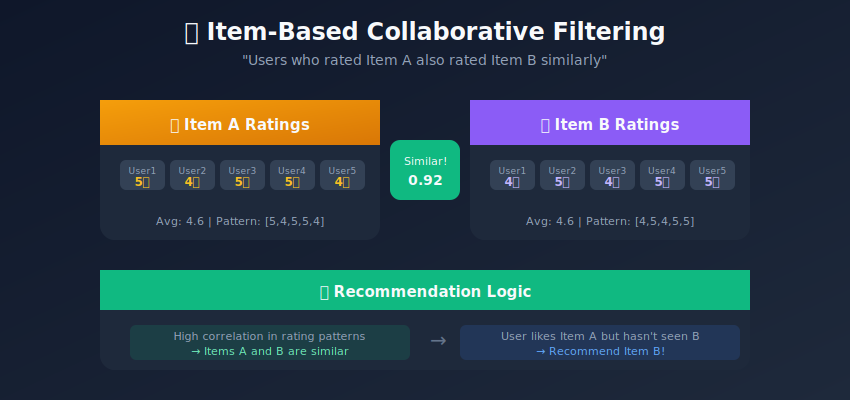

### Why Item-Based is Often Better

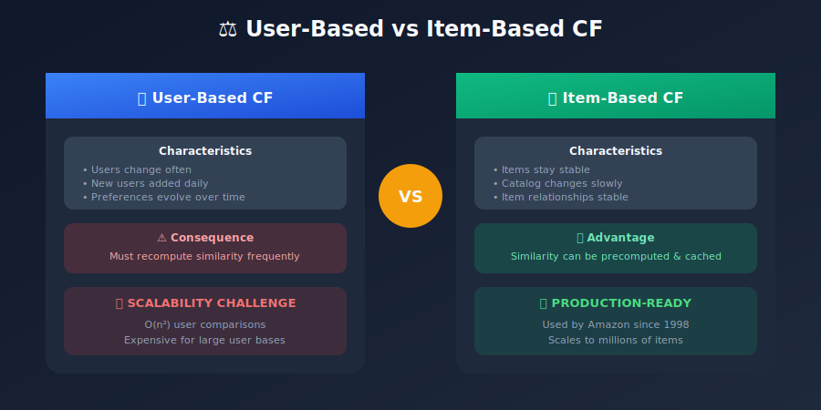

### Amazon's Item-to-Item CF (Original Paper)

```
Algorithm: Item-to-Item Collaborative Filtering

1. For each item i:
   a. For each user u who rated i:
      b. For each item j rated by u:
         c. Record (i, j) co-occurrence

2. Compute item-item similarity:
   sim(i, j) = cosine(rating_vectors(i, j))

3. For recommendations:
   a. For each item i in user's history:
      b. Retrieve similar items
      c. Aggregate and rank by weighted sum

```

### Implementation

```python
import numpy as np
from scipy.sparse import csr_matrix
from sklearn.metrics.pairwise import cosine_similarity

class ItemBasedCF:
    """
    Item-Based Collaborative Filtering.
    More scalable and stable than User-Based.
    """

    def __init__(self, k_neighbors=20, min_common_users=5):
        self.k = k_neighbors
        self.min_common = min_common_users
        self.item_similarity = None
        self.ratings = None

    def fit(self, ratings_matrix):
        """
        Compute item-item similarity matrix.

        Parameters:
        -----------
        ratings_matrix : 2D array (users × items)
        """
        self.ratings = ratings_matrix.copy()
        self.n_users, self.n_items = ratings_matrix.shape

        # Replace NaN with 0 for computation (will mask later)
        ratings_filled = np.nan_to_num(ratings_matrix, nan=0)

        # Compute item-item similarity (transpose so items are rows)
        # Using adjusted cosine (mean-centered by user)
        self.item_similarity = self._adjusted_cosine_similarity(ratings_filled)

        return self

    def _adjusted_cosine_similarity(self, ratings):
        """
        Compute adjusted cosine similarity between items.
        Adjusts for user rating biases.
        """
        # Mean-center by user
        user_means = np.nanmean(self.ratings, axis=1, keepdims=True)
        user_means = np.nan_to_num(user_means, nan=0)

        centered = ratings - np.where(ratings != 0, user_means, 0)

        # Compute cosine similarity on item vectors (transpose)
        item_sim = cosine_similarity(centered.T)

        # Zero out diagonal
        np.fill_diagonal(item_sim, 0)

        return item_sim

    def predict(self, user_id, item_id):
        """
        Predict rating for user-item pair.
        """
        # Get items user has rated
        user_ratings = self.ratings[user_id]
        rated_mask = ~np.isnan(user_ratings)

        if not np.any(rated_mask):
            return 3.0  # Default rating

        # Get similarities to the target item
        item_sims = self.item_similarity[item_id, rated_mask]
        item_ratings = user_ratings[rated_mask]

        # Select top-k most similar items
        if len(item_sims) > self.k:
            top_k_idx = np.argsort(item_sims)[-self.k:]
            item_sims = item_sims[top_k_idx]
            item_ratings = item_ratings[top_k_idx]

        # Only use positive similarities
        positive_mask = item_sims > 0
        if not np.any(positive_mask):
            return np.nanmean(user_ratings)

        item_sims = item_sims[positive_mask]
        item_ratings = item_ratings[positive_mask]

        # Weighted average
        prediction = np.sum(item_sims * item_ratings) / np.sum(item_sims)

        return np.clip(prediction, 1, 5)

    def recommend(self, user_id, n_recommendations=10):
        """
        Generate recommendations for a user.
        """
        predictions = []

        for item_id in range(self.n_items):
            if not np.isnan(self.ratings[user_id, item_id]):
                continue

            pred = self.predict(user_id, item_id)
            predictions.append((item_id, pred))

        predictions.sort(key=lambda x: x[1], reverse=True)
        return predictions[:n_recommendations]

    def get_similar_items(self, item_id, n=10):
        """
        Get most similar items to a given item.
        Useful for "Similar Items" features.
        """
        similarities = self.item_similarity[item_id]
        top_indices = np.argsort(similarities)[::-1][:n]

        return [(idx, similarities[idx]) for idx in top_indices]

```

---

## Matrix Factorization

### Core Concept

Decompose the sparse user-item matrix into low-rank latent factor matrices.

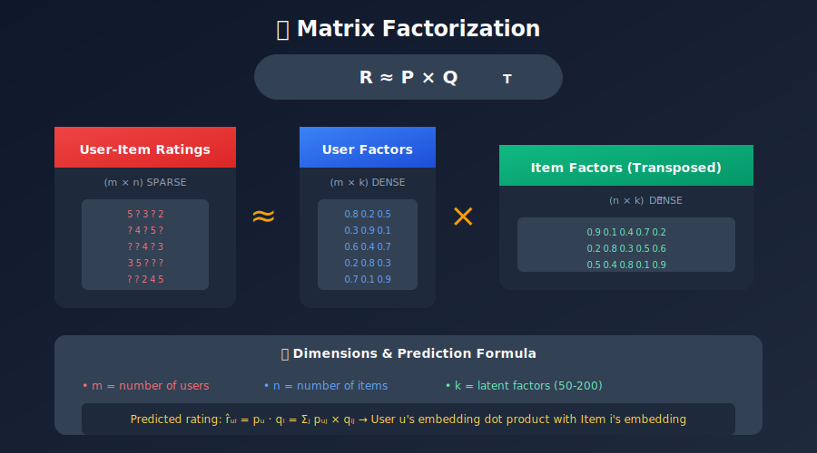

### Latent Factors Interpretation

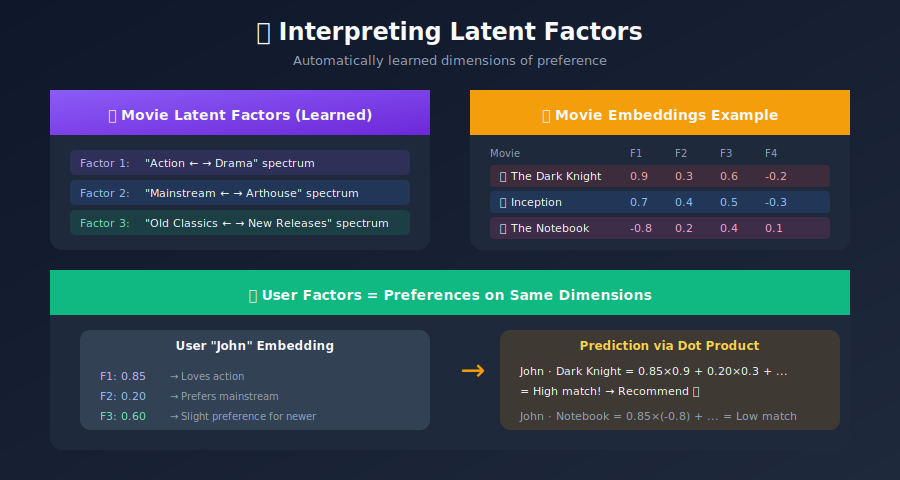

### SVD (Singular Value Decomposition)

```
R = U × Σ × V^T

Where:
- U: Left singular vectors (user factors)
- Σ: Diagonal matrix of singular values
- V: Right singular vectors (item factors)

For recommendations: keep top-k singular values

```

### ALS (Alternating Least Squares)

Optimization approach for matrix factorization:

```
Objective: minimize Σ(rᵤᵢ - pᵤ·qᵢ)² + λ(||pᵤ||² + ||qᵢ||²)

Algorithm:
1. Initialize P and Q randomly
2. Fix Q, solve for optimal P (least squares)
3. Fix P, solve for optimal Q (least squares)
4. Repeat until convergence

```

### Implementation

```python
import numpy as np
from scipy.sparse import csr_matrix
from scipy.sparse.linalg import svds

class MatrixFactorization:
    """
    Matrix Factorization using SVD for Collaborative Filtering.
    """

    def __init__(self, n_factors=50, learning_rate=0.01,
                 regularization=0.02, n_iterations=100):
        self.k = n_factors
        self.lr = learning_rate
        self.reg = regularization
        self.n_iter = n_iterations

    def fit_svd(self, ratings_matrix):
        """
        Fit using truncated SVD.
        Fast but doesn't handle missing values directly.
        """
        # Fill missing with 0 or mean
        filled = np.nan_to_num(ratings_matrix, nan=0)

        # Mean-center
        self.global_mean = np.nanmean(ratings_matrix)
        centered = filled - np.where(filled != 0, self.global_mean, 0)

        # SVD
        U, sigma, Vt = svds(csr_matrix(centered), k=self.k)

        # Reconstruct factors
        self.user_factors = U @ np.diag(np.sqrt(sigma))
        self.item_factors = Vt.T @ np.diag(np.sqrt(sigma))

        return self

    def fit_sgd(self, ratings_df):
        """
        Fit using Stochastic Gradient Descent.
        Handles missing values naturally.

        Parameters:
        -----------
        ratings_df : DataFrame with columns [user_id, item_id, rating]
        """
        # Get dimensions
        self.n_users = ratings_df['user_id'].max() + 1
        self.n_items = ratings_df['item_id'].max() + 1

        # Initialize factors
        self.user_factors = np.random.normal(0, 0.1, (self.n_users, self.k))
        self.item_factors = np.random.normal(0, 0.1, (self.n_items, self.k))
        self.user_bias = np.zeros(self.n_users)
        self.item_bias = np.zeros(self.n_items)
        self.global_mean = ratings_df['rating'].mean()

        # Training data
        samples = ratings_df[['user_id', 'item_id', 'rating']].values

        for iteration in range(self.n_iter):
            np.random.shuffle(samples)
            total_loss = 0

            for u, i, r in samples:
                u, i = int(u), int(i)

                # Prediction
                pred = self._predict(u, i)
                error = r - pred
                total_loss += error ** 2

                # Update biases
                self.user_bias[u] += self.lr * (error - self.reg * self.user_bias[u])
                self.item_bias[i] += self.lr * (error - self.reg * self.item_bias[i])

                # Update factors
                user_factor = self.user_factors[u].copy()
                self.user_factors[u] += self.lr * (
                    error * self.item_factors[i] - self.reg * self.user_factors[u]
                )
                self.item_factors[i] += self.lr * (
                    error * user_factor - self.reg * self.item_factors[i]
                )

            rmse = np.sqrt(total_loss / len(samples))
            if iteration % 10 == 0:
                print(f"Iteration {iteration}: RMSE = {rmse:.4f}")

        return self

    def _predict(self, user_id, item_id):
        """Internal prediction with biases."""
        return (
            self.global_mean +
            self.user_bias[user_id] +
            self.item_bias[item_id] +
            np.dot(self.user_factors[user_id], self.item_factors[item_id])
        )

    def predict(self, user_id, item_id):
        """Predict rating for user-item pair."""
        pred = self._predict(user_id, item_id)
        return np.clip(pred, 1, 5)

    def recommend(self, user_id, n_recommendations=10,
                  exclude_items=None):
        """Generate recommendations for a user."""
        # Compute scores for all items
        scores = (
            self.global_mean +
            self.user_bias[user_id] +
            self.item_bias +
            self.item_factors @ self.user_factors[user_id]
        )

        # Exclude seen items
        if exclude_items:
            for item in exclude_items:
                scores[item] = -np.inf

        # Get top-N
        top_items = np.argsort(scores)[::-1][:n_recommendations]

        return [(item, scores[item]) for item in top_items]

# Example with SGD
import pandas as pd

# Sample ratings data
ratings_data = pd.DataFrame({
    'user_id': [0, 0, 0, 1, 1, 2, 2, 2, 3, 3],
    'item_id': [0, 1, 3, 0, 2, 1, 2, 4, 0, 3],
    'rating':  [5, 3, 4, 5, 4, 3, 4, 5, 4, 4]
})

mf = MatrixFactorization(n_factors=10, n_iterations=50)
mf.fit_sgd(ratings_data)

# Get recommendations
recs = mf.recommend(0, n_recommendations=3, exclude_items={0, 1, 3})
print("\nRecommendations for user 0:")
for item, score in recs:
    print(f"  Item {item}: {score:.2f}")

```

---

## Similarity Measures

### Comparison of Methods

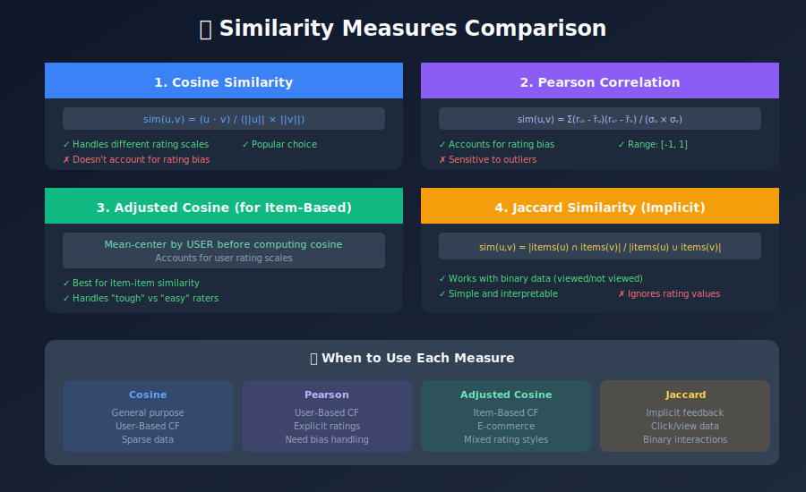

### When to Use Which

| Similarity | Best For | Data Type |
|------------|----------|-----------|
| Cosine | User-based CF, text | Ratings |
| Pearson | User-based CF | Ratings with bias |
| Adjusted Cosine | Item-based CF | Ratings |
| Jaccard | Implicit feedback | Binary |
| Euclidean | Dense data | Ratings |

---

## Handling Challenges

### 1. Cold Start Problem


### 2. Scalability

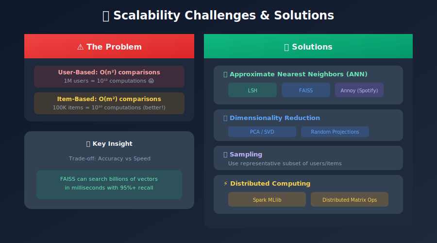

### 3. Data Sparsity

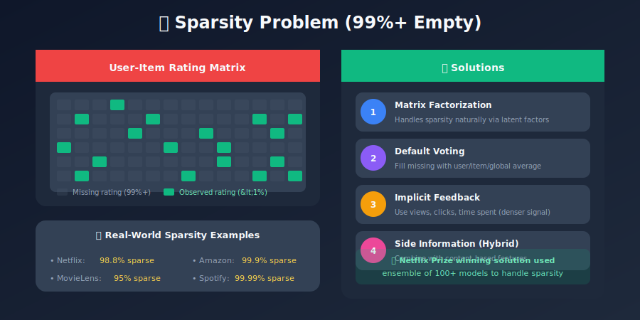

---

## Production Considerations

### Architecture for Scale


### Storage and Caching

```python
# Precompute and cache recommendations
class CFServingLayer:
    def __init__(self, redis_client, model):
        self.redis = redis_client
        self.model = model
        self.cache_ttl = 3600  # 1 hour

    def get_recommendations(self, user_id, n=10):
        # Check cache
        cache_key = f"recs:{user_id}"
        cached = self.redis.get(cache_key)

        if cached:
            return json.loads(cached)

        # Compute recommendations
        recs = self.model.recommend(user_id, n_recommendations=n)

        # Cache results
        self.redis.setex(cache_key, self.cache_ttl, json.dumps(recs))

        return recs

    def invalidate_user(self, user_id):
        """Call when user behavior changes."""
        self.redis.delete(f"recs:{user_id}")

```

---

## Best Practices

### 1. Data Quality

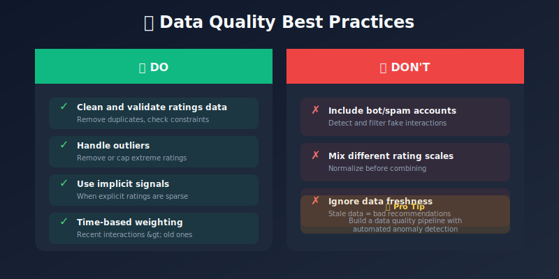

### 2. Algorithm Selection


### 3. Evaluation Strategy

```python
# Proper train/test split for recommendations
def temporal_split(ratings_df, test_ratio=0.2):
    """
    Split by time - train on past, test on future.
    More realistic than random split.
    """
    ratings_df = ratings_df.sort_values('timestamp')
    split_idx = int(len(ratings_df) * (1 - test_ratio))

    train = ratings_df.iloc[:split_idx]
    test = ratings_df.iloc[split_idx:]

    return train, test

# Use multiple metrics
def evaluate(predictions, ground_truth):
    return {
        'rmse': calculate_rmse(predictions, ground_truth),
        'mae': calculate_mae(predictions, ground_truth),
        'precision@10': calculate_precision_at_k(predictions, ground_truth, 10),
        'recall@10': calculate_recall_at_k(predictions, ground_truth, 10),
        'ndcg@10': calculate_ndcg_at_k(predictions, ground_truth, 10),
        'coverage': calculate_coverage(predictions, all_items),
        'diversity': calculate_diversity(predictions)
    }

```

---

## Summary

Collaborative Filtering is the workhorse of recommendation systems. From simple nearest-neighbor approaches to sophisticated matrix factorization, CF methods leverage the collective wisdom of users to make accurate predictions.

### Key Takeaways

1. **User-Based CF**: Intuitive but doesn't scale well
2. **Item-Based CF**: More stable and production-ready
3. **Matrix Factorization**: Handles sparsity, reveals latent factors
4. **Cold Start**: Major challenge—use hybrid approaches
5. **Scalability**: ANN and approximate methods are essential
6. **Evaluation**: Use time-based splits and multiple metrics

---

## 🎬 Video Resources

### Recommended YouTube Videos

| Video | Channel | Duration |
|-------|---------|----------|
| [Collaborative Filtering Explained](https://www.youtube.com/watch?v=h9gpufJFF-0) | ritvikmath | 12 min |
| [Matrix Factorization for RecSys](https://www.youtube.com/watch?v=ZspR5PZemcs) | Stanford CS246 | 45 min |
| [SVD Explained Visually](https://www.youtube.com/watch?v=FgakZw6K1QQ) | StatQuest | 15 min |
| [ALS Algorithm Deep Dive](https://www.youtube.com/watch?v=FgGjc5oabrA) | Spark Summit | 30 min |
| [Netflix Prize & Matrix Factorization](https://www.youtube.com/watch?v=ZspR5PZemcs) | Jure Leskovec | 45 min |

### Academic Lectures
- **Stanford CS246** - Lecture 9: Recommendation Systems
- **Stanford CS246** - Lecture 10: Dimensionality Reduction (SVD)

### Implementation Tutorials
- **[Surprise Library Tutorial](https://www.youtube.com/watch?v=9gBC9R-msAk)** - Python CF implementation
- **[Implicit Library Tutorial](https://www.youtube.com/watch?v=Mn1AqQf9cRs)** - ALS for implicit feedback

### Papers Explained
- **[Matrix Factorization Techniques](https://www.youtube.com/watch?v=ZspR5PZemcs)** - Netflix Prize paper

---

## Next Steps

Continue to the next module: [Hybrid Recommendation Systems](../04_hybrid_systems/README.md)

---

*Last Updated: January 2026*
*Author: ML System Design Study Group*

---

<div align="center">

**[⬆ Back to Top](#)** | **[📚 Main Repository](https://github.com/Gaurav14cs17/ml_system_design)**

Made with 💜 by [Gaurav14cs17](https://github.com/Gaurav14cs17)

</div>
