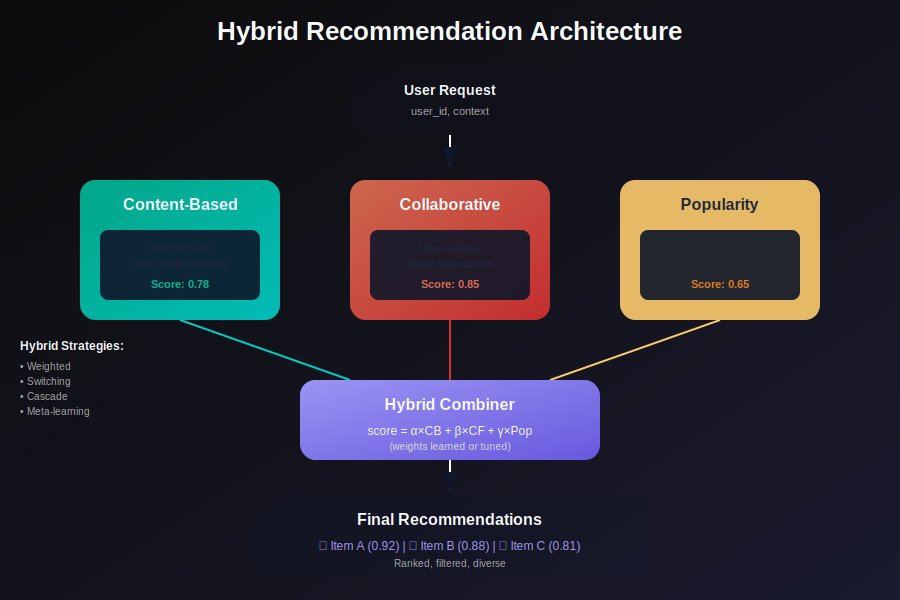
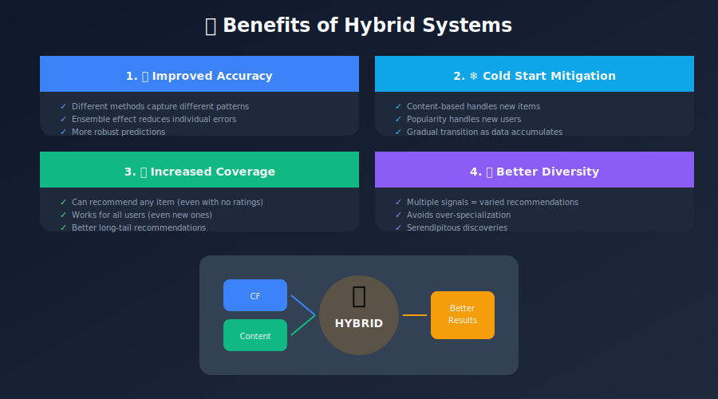
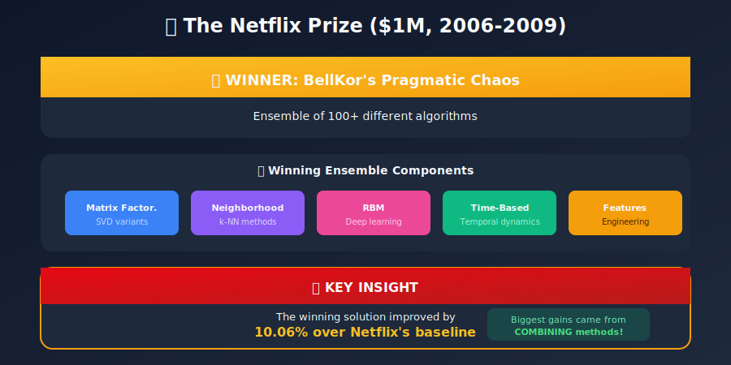
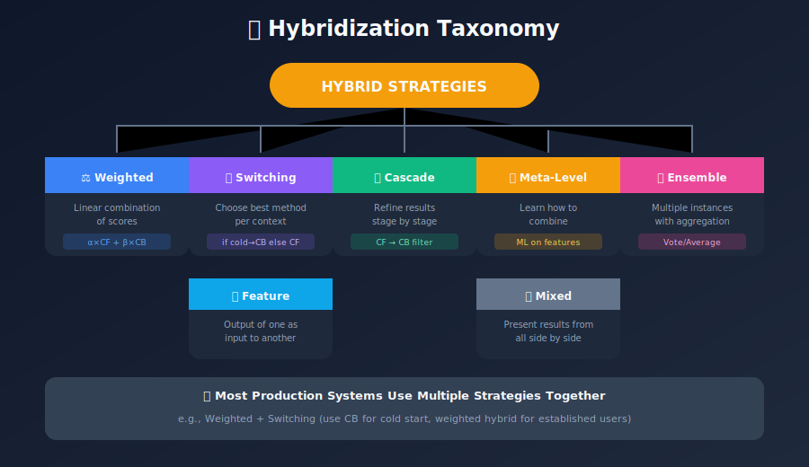
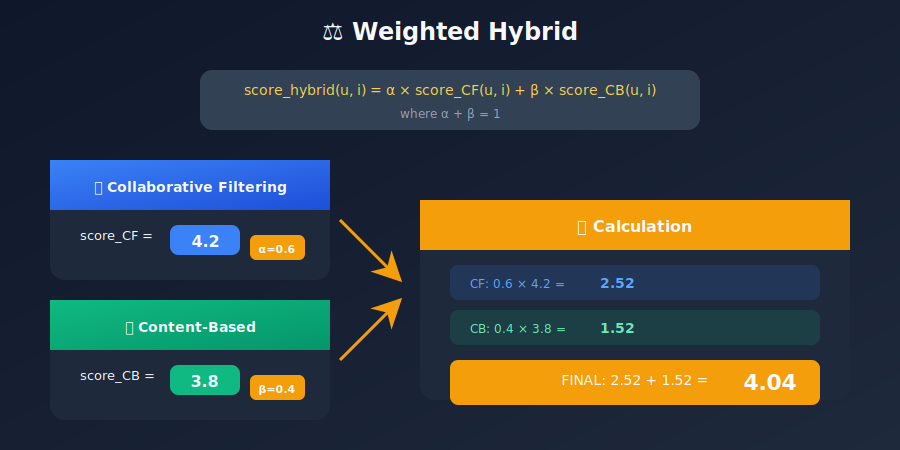
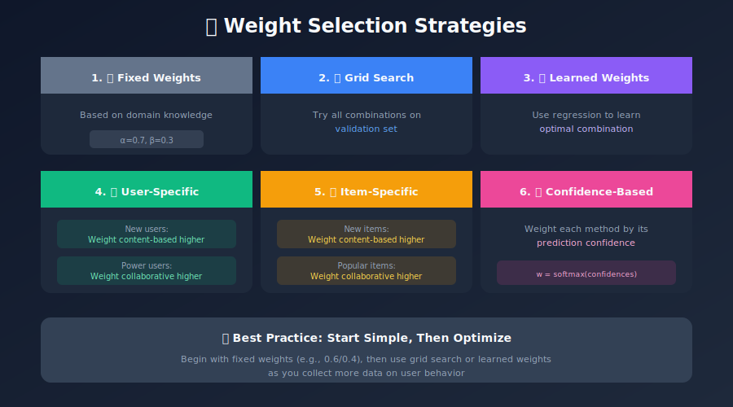
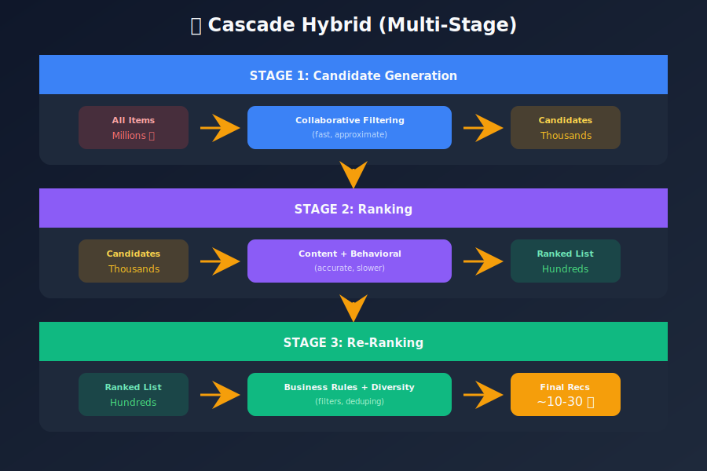
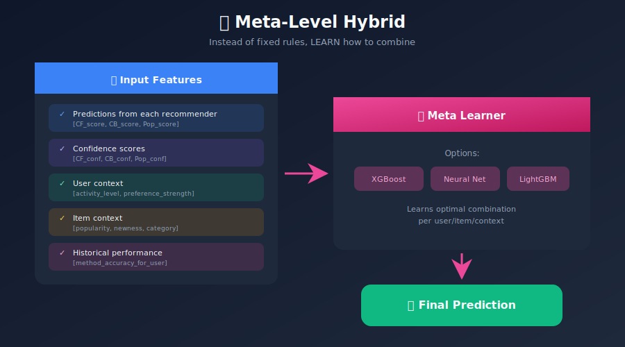
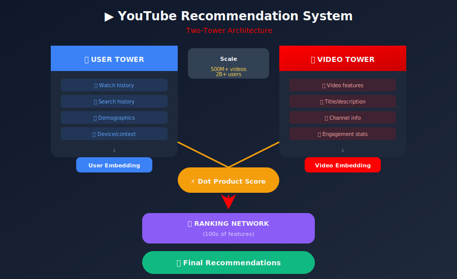
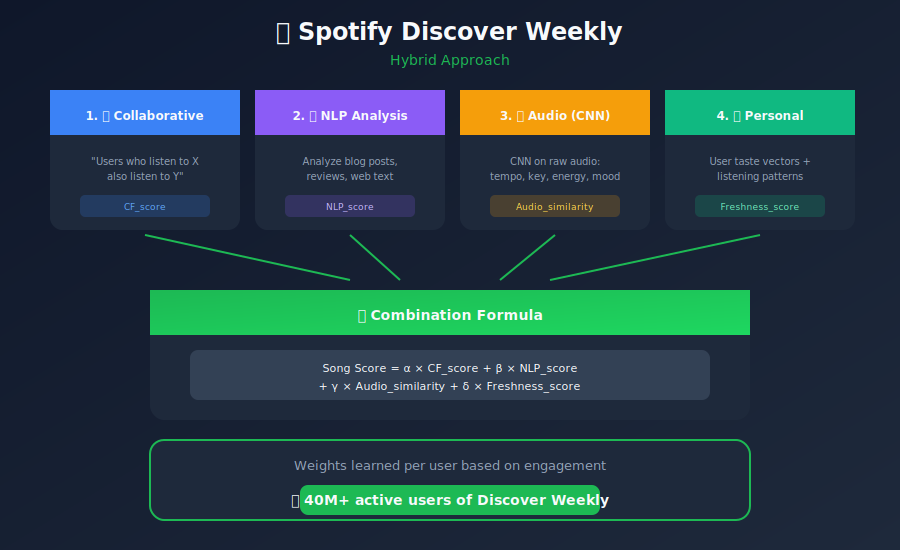

# Hybrid Recommendation Systems

## Combining Multiple Approaches for Superior Recommendations

---

## 📊 Visual Overview



---

## 📖 Table of Contents

1. [Introduction](#introduction)
2. [Why Hybrid Systems?](#why-hybrid-systems)
3. [Hybridization Strategies](#hybridization-strategies)
4. [Weighted Hybrid](#weighted-hybrid)
5. [Switching Hybrid](#switching-hybrid)
6. [Feature Combination](#feature-combination)
7. [Cascade Hybrid](#cascade-hybrid)
8. [Meta-Level Hybrid](#meta-level-hybrid)
9. [Implementation Examples](#implementation-examples)
10. [Real-World Case Studies](#real-world-case-studies)

---

## Introduction

**Hybrid Recommendation Systems** combine two or more recommendation techniques to achieve better performance than any individual approach. They leverage the strengths of different methods while mitigating their weaknesses.

### The Fundamental Insight


---

## Why Hybrid Systems?

### Problem with Single Approaches

| Approach | Main Weakness | Impact |
|----------|---------------|--------|
| Content-Based | Filter bubbles, user cold start | Limited discovery |
| Collaborative | Item cold start, sparsity | Can't recommend new items |
| Knowledge-Based | Manual maintenance | Doesn't scale |
| Demographic | Stereotyping, privacy | Inaccurate generalizations |

### Benefits of Hybridization



### Netflix Prize: Hybrid Victory



---

## Hybridization Strategies

### Overview of Strategies



### Quick Comparison

| Strategy | Complexity | Interpretability | Best For |
|----------|------------|------------------|----------|
| Weighted | Low | High | Simple combination |
| Switching | Medium | High | Context-dependent |
| Feature Combination | Medium | Medium | Feature augmentation |
| Cascade | Medium | Medium | Multi-stage refinement |
| Meta-Level | High | Low | Maximum accuracy |
| Mixed | Low | High | Diverse presentation |
| Ensemble | High | Low | State-of-the-art |

---

## Weighted Hybrid

### Concept

Combine scores from multiple recommenders with weighted averaging.



### Implementation

```python
import numpy as np
from typing import List, Dict, Tuple

class WeightedHybridRecommender:
    """
    Combines multiple recommenders using weighted averaging.
    """

    def __init__(self, recommenders: Dict[str, object],
                 weights: Dict[str, float] = None):
        """
        Parameters:
        -----------
        recommenders : dict of {name: recommender_object}
        weights : dict of {name: weight}, must sum to 1
        """
        self.recommenders = recommenders

        if weights is None:
            # Equal weights by default
            n = len(recommenders)
            self.weights = {name: 1/n for name in recommenders}
        else:
            # Normalize weights
            total = sum(weights.values())
            self.weights = {k: v/total for k, v in weights.items()}

    def fit(self, *args, **kwargs):
        """Fit all recommenders."""
        for name, rec in self.recommenders.items():
            print(f"Fitting {name}...")
            rec.fit(*args, **kwargs)
        return self

    def predict(self, user_id: int, item_id: int) -> float:
        """
        Weighted average of predictions from all recommenders.
        """
        weighted_sum = 0
        weight_sum = 0

        for name, rec in self.recommenders.items():
            try:
                score = rec.predict(user_id, item_id)
                weight = self.weights[name]
                weighted_sum += weight * score
                weight_sum += weight
            except Exception:
                # Recommender couldn't predict, skip
                continue

        if weight_sum == 0:
            return 3.0  # Default rating

        return weighted_sum / weight_sum

    def recommend(self, user_id: int, n: int = 10,
                  exclude_items: set = None) -> List[Tuple[int, float]]:
        """
        Generate hybrid recommendations.
        """
        item_scores = {}

        for name, rec in self.recommenders.items():
            weight = self.weights[name]
            recs = rec.recommend(user_id, n=n*3)  # Get more candidates

            for item_id, score in recs:
                if exclude_items and item_id in exclude_items:
                    continue

                if item_id not in item_scores:
                    item_scores[item_id] = 0
                item_scores[item_id] += weight * score

        # Sort and return top-n
        sorted_items = sorted(item_scores.items(),
                             key=lambda x: x[1],
                             reverse=True)
        return sorted_items[:n]

    def tune_weights(self, validation_data, metric='rmse'):
        """
        Find optimal weights using grid search.
        """
        from itertools import product

        best_weights = None
        best_score = float('inf') if metric == 'rmse' else 0

        # Grid search over weight combinations
        weight_options = [0.0, 0.2, 0.4, 0.6, 0.8, 1.0]
        names = list(self.recommenders.keys())

        for combo in product(weight_options, repeat=len(names)):
            if sum(combo) == 0:
                continue

            weights = {names[i]: combo[i] for i in range(len(names))}
            self.weights = {k: v/sum(combo) for k, v in weights.items()}

            # Evaluate
            score = self._evaluate(validation_data, metric)

            if (metric == 'rmse' and score < best_score) or \
               (metric != 'rmse' and score > best_score):
                best_score = score
                best_weights = self.weights.copy()

        self.weights = best_weights
        return best_weights, best_score

# Dynamic weights based on confidence
class AdaptiveWeightedHybrid(WeightedHybridRecommender):
    """
    Adjusts weights dynamically based on confidence.
    """

    def predict_with_confidence(self, user_id: int,
                                item_id: int) -> Tuple[float, Dict]:
        """
        Returns prediction and confidence from each method.
        """
        predictions = {}
        confidences = {}

        for name, rec in self.recommenders.items():
            try:
                if hasattr(rec, 'predict_with_confidence'):
                    score, conf = rec.predict_with_confidence(user_id, item_id)
                else:
                    score = rec.predict(user_id, item_id)
                    conf = 1.0  # Default confidence

                predictions[name] = score
                confidences[name] = conf
            except Exception:
                continue

        # Weight by confidence
        weighted_sum = sum(
            predictions[n] * confidences[n] * self.weights[n]
            for n in predictions
        )
        weight_sum = sum(
            confidences[n] * self.weights[n]
            for n in confidences
        )

        final_score = weighted_sum / weight_sum if weight_sum > 0 else 3.0

        return final_score, {
            'predictions': predictions,
            'confidences': confidences
        }

```

### Weight Selection Strategies



---

## Switching Hybrid

### Concept

Choose between recommenders based on context or conditions.


### Implementation

```python
class SwitchingHybridRecommender:
    """
    Switches between recommenders based on context.
    """

    def __init__(self,
                 cf_recommender,
                 cb_recommender,
                 popularity_recommender,
                 min_user_ratings: int = 10,
                 min_item_ratings: int = 5):
        self.cf = cf_recommender
        self.cb = cb_recommender
        self.popularity = popularity_recommender
        self.min_user_ratings = min_user_ratings
        self.min_item_ratings = min_item_ratings

        self.user_rating_counts = {}
        self.item_rating_counts = {}

    def fit(self, ratings_df):
        """Fit all recommenders and compute statistics."""
        # Count ratings
        self.user_rating_counts = ratings_df.groupby('user_id').size().to_dict()
        self.item_rating_counts = ratings_df.groupby('item_id').size().to_dict()

        # Fit recommenders
        self.cf.fit(ratings_df)
        self.cb.fit(ratings_df)
        self.popularity.fit(ratings_df)

        return self

    def _select_recommender(self, user_id: int,
                           item_id: int = None) -> Tuple[object, str]:
        """
        Select the appropriate recommender based on context.
        """
        user_ratings = self.user_rating_counts.get(user_id, 0)

        # Cold start user
        if user_ratings < self.min_user_ratings:
            if user_ratings == 0:
                return self.popularity, "popularity"
            return self.cb, "content_based"

        # Check item if provided
        if item_id is not None:
            item_ratings = self.item_rating_counts.get(item_id, 0)
            if item_ratings < self.min_item_ratings:
                return self.cb, "content_based"

        # Default to collaborative
        return self.cf, "collaborative"

    def predict(self, user_id: int, item_id: int) -> float:
        """Predict rating using selected recommender."""
        recommender, method = self._select_recommender(user_id, item_id)
        return recommender.predict(user_id, item_id)

    def recommend(self, user_id: int, n: int = 10) -> List[Tuple[int, float]]:
        """Generate recommendations using selected recommender."""
        recommender, method = self._select_recommender(user_id)
        recommendations = recommender.recommend(user_id, n=n)

        return {
            'recommendations': recommendations,
            'method_used': method
        }

# Advanced: Smooth transition between methods
class GradualSwitchingHybrid:
    """
    Gradually transitions between methods based on data availability.
    """

    def __init__(self, cf, cb, transition_start=5, transition_end=20):
        self.cf = cf
        self.cb = cb
        self.transition_start = transition_start
        self.transition_end = transition_end

    def _compute_cf_weight(self, user_ratings: int) -> float:
        """
        Smoothly transition from CB to CF as user accumulates ratings.
        """
        if user_ratings <= self.transition_start:
            return 0.0
        elif user_ratings >= self.transition_end:
            return 1.0
        else:
            # Linear interpolation
            progress = (user_ratings - self.transition_start) / \
                      (self.transition_end - self.transition_start)
            return progress

    def predict(self, user_id: int, item_id: int,
                user_ratings: int) -> float:
        """
        Weighted prediction with gradual transition.
        """
        cf_weight = self._compute_cf_weight(user_ratings)
        cb_weight = 1 - cf_weight

        score = 0
        if cf_weight > 0:
            score += cf_weight * self.cf.predict(user_id, item_id)
        if cb_weight > 0:
            score += cb_weight * self.cb.predict(user_id, item_id)

        return score

```

---

## Feature Combination

### Concept

Use features/outputs from one system as inputs to another.


### Implementation

```python
import numpy as np
from sklearn.ensemble import GradientBoostingRegressor

class FeatureCombinationHybrid:
    """
    Combines features from multiple sources for a unified model.
    """

    def __init__(self,
                 content_extractor,
                 cf_embeddings,
                 meta_learner=None):
        self.content_extractor = content_extractor
        self.cf_embeddings = cf_embeddings
        self.meta_learner = meta_learner or GradientBoostingRegressor(
            n_estimators=100,
            max_depth=6,
            learning_rate=0.1
        )

    def extract_features(self, user_id: int, item_id: int) -> np.ndarray:
        """
        Combine features from all sources.
        """
        features = []

        # Content features
        content_feats = self.content_extractor.get_item_features(item_id)
        features.extend(content_feats)

        # CF embeddings
        user_embed = self.cf_embeddings.get_user_embedding(user_id)
        item_embed = self.cf_embeddings.get_item_embedding(item_id)
        features.extend(user_embed)
        features.extend(item_embed)

        # User-item interaction features
        dot_product = np.dot(user_embed, item_embed)
        features.append(dot_product)

        # Behavioral features (if available)
        # features.extend(self.get_behavioral_features(user_id, item_id))

        return np.array(features)

    def fit(self, training_data):
        """
        Fit the meta-learner on combined features.

        Parameters:
        -----------
        training_data : list of (user_id, item_id, rating)
        """
        X = []
        y = []

        for user_id, item_id, rating in training_data:
            try:
                features = self.extract_features(user_id, item_id)
                X.append(features)
                y.append(rating)
            except KeyError:
                continue

        X = np.array(X)
        y = np.array(y)

        self.meta_learner.fit(X, y)
        return self

    def predict(self, user_id: int, item_id: int) -> float:
        """Predict using combined features."""
        features = self.extract_features(user_id, item_id)
        prediction = self.meta_learner.predict([features])[0]
        return np.clip(prediction, 1, 5)

# Neural Network approach for deep feature combination
import torch
import torch.nn as nn

class DeepHybridNetwork(nn.Module):
    """
    Neural network that combines content and collaborative features.
    """

    def __init__(self,
                 n_users: int,
                 n_items: int,
                 content_dim: int,
                 embed_dim: int = 64,
                 hidden_dims: list = [128, 64]):
        super().__init__()

        # Collaborative embeddings
        self.user_embedding = nn.Embedding(n_users, embed_dim)
        self.item_embedding = nn.Embedding(n_items, embed_dim)

        # Content feature transformation
        self.content_mlp = nn.Sequential(
            nn.Linear(content_dim, 64),
            nn.ReLU(),
            nn.Linear(64, embed_dim)
        )

        # Combined prediction layers
        combined_dim = embed_dim * 3  # user + item + content
        layers = []
        prev_dim = combined_dim

        for hidden_dim in hidden_dims:
            layers.extend([
                nn.Linear(prev_dim, hidden_dim),
                nn.ReLU(),
                nn.Dropout(0.2)
            ])
            prev_dim = hidden_dim

        layers.append(nn.Linear(prev_dim, 1))
        self.prediction_mlp = nn.Sequential(*layers)

    def forward(self, user_ids, item_ids, content_features):
        # Get embeddings
        user_embed = self.user_embedding(user_ids)
        item_embed = self.item_embedding(item_ids)

        # Transform content
        content_embed = self.content_mlp(content_features)

        # Concatenate all features
        combined = torch.cat([user_embed, item_embed, content_embed], dim=1)

        # Predict
        output = self.prediction_mlp(combined)
        return output.squeeze()

```

---

## Cascade Hybrid

### Concept

Use one recommender to filter/reorder results from another.



### Implementation

```python
class CascadeHybridRecommender:
    """
    Multi-stage recommendation pipeline.
    """

    def __init__(self,
                 candidate_generator,      # Fast, broad retrieval
                 ranker,                   # Accurate scoring
                 reranker=None,            # Business rules
                 n_candidates: int = 1000,
                 n_ranked: int = 100):
        self.candidate_generator = candidate_generator
        self.ranker = ranker
        self.reranker = reranker
        self.n_candidates = n_candidates
        self.n_ranked = n_ranked

    def recommend(self, user_id: int, n: int = 10,
                  context: dict = None) -> List[Tuple[int, float]]:
        """
        Three-stage recommendation pipeline.
        """
        # Stage 1: Candidate Generation
        candidates = self.candidate_generator.get_candidates(
            user_id,
            n=self.n_candidates
        )
        candidate_ids = [c[0] for c in candidates]

        # Stage 2: Ranking
        ranked = []
        for item_id in candidate_ids:
            score = self.ranker.score(user_id, item_id, context)
            ranked.append((item_id, score))

        ranked.sort(key=lambda x: x[1], reverse=True)
        ranked = ranked[:self.n_ranked]

        # Stage 3: Re-ranking (optional)
        if self.reranker:
            ranked = self.reranker.rerank(
                user_id,
                ranked,
                n=n,
                context=context
            )
        else:
            ranked = ranked[:n]

        return ranked

class DiversityReranker:
    """
    Re-ranks to ensure diversity in recommendations.
    """

    def __init__(self, diversity_weight: float = 0.3,
                 item_features: dict = None):
        self.diversity_weight = diversity_weight
        self.item_features = item_features

    def rerank(self, user_id: int,
               ranked_items: List[Tuple[int, float]],
               n: int = 10,
               context: dict = None) -> List[Tuple[int, float]]:
        """
        Maximal Marginal Relevance (MMR) reranking.
        """
        selected = []
        remaining = ranked_items.copy()

        while len(selected) < n and remaining:
            best_score = float('-inf')
            best_item = None

            for item_id, relevance in remaining:
                # Compute diversity from already selected
                if selected:
                    max_similarity = max(
                        self._item_similarity(item_id, sel[0])
                        for sel in selected
                    )
                else:
                    max_similarity = 0

                # MMR score
                mmr_score = (
                    (1 - self.diversity_weight) * relevance -
                    self.diversity_weight * max_similarity
                )

                if mmr_score > best_score:
                    best_score = mmr_score
                    best_item = (item_id, relevance)

            if best_item:
                selected.append(best_item)
                remaining.remove(best_item)

        return selected

    def _item_similarity(self, item1: int, item2: int) -> float:
        """Compute similarity between items."""
        if self.item_features is None:
            return 0

        feat1 = self.item_features.get(item1)
        feat2 = self.item_features.get(item2)

        if feat1 is None or feat2 is None:
            return 0

        # Cosine similarity
        return np.dot(feat1, feat2) / (
            np.linalg.norm(feat1) * np.linalg.norm(feat2) + 1e-8
        )

```

---

## Meta-Level Hybrid

### Concept

Use machine learning to learn how to combine recommenders.



### Stacking Implementation

```python
from sklearn.ensemble import RandomForestRegressor, GradientBoostingRegressor
from sklearn.linear_model import Ridge
from sklearn.model_selection import KFold
import numpy as np

class StackingHybridRecommender:
    """
    Uses stacking ensemble to combine recommender predictions.
    """

    def __init__(self, base_recommenders: dict,
                 meta_learner=None,
                 n_folds: int = 5):
        self.base_recommenders = base_recommenders
        self.meta_learner = meta_learner or GradientBoostingRegressor(
            n_estimators=100,
            max_depth=4,
            learning_rate=0.1
        )
        self.n_folds = n_folds

    def fit(self, ratings_df):
        """
        Fit using stacking with cross-validation.
        """
        # Generate out-of-fold predictions for meta features
        n_samples = len(ratings_df)
        n_recommenders = len(self.base_recommenders)

        meta_features = np.zeros((n_samples, n_recommenders))
        targets = ratings_df['rating'].values

        kf = KFold(n_splits=self.n_folds, shuffle=True, random_state=42)

        for fold_idx, (train_idx, val_idx) in enumerate(kf.split(ratings_df)):
            train_data = ratings_df.iloc[train_idx]
            val_data = ratings_df.iloc[val_idx]

            # Fit base recommenders on training fold
            for i, (name, rec) in enumerate(self.base_recommenders.items()):
                rec_copy = self._clone_recommender(rec)
                rec_copy.fit(train_data)

                # Generate predictions for validation fold
                for j, row in val_data.iterrows():
                    try:
                        pred = rec_copy.predict(row['user_id'], row['item_id'])
                        meta_features[row.name, i] = pred
                    except:
                        meta_features[row.name, i] = np.nan

        # Handle missing predictions
        meta_features = np.nan_to_num(meta_features, nan=3.0)

        # Fit meta-learner
        self.meta_learner.fit(meta_features, targets)

        # Fit base recommenders on full data
        for name, rec in self.base_recommenders.items():
            rec.fit(ratings_df)

        return self

    def predict(self, user_id: int, item_id: int) -> float:
        """Generate prediction using stacked model."""
        meta_features = []

        for name, rec in self.base_recommenders.items():
            try:
                pred = rec.predict(user_id, item_id)
            except:
                pred = 3.0
            meta_features.append(pred)

        meta_features = np.array(meta_features).reshape(1, -1)
        prediction = self.meta_learner.predict(meta_features)[0]

        return np.clip(prediction, 1, 5)

    def _clone_recommender(self, rec):
        """Create a copy of a recommender."""
        import copy
        return copy.deepcopy(rec)

# Feature-rich meta learner
class RichMetaLearner:
    """
    Meta-learner with extensive feature engineering.
    """

    def extract_meta_features(self, user_id, item_id, base_predictions):
        """
        Create rich feature vector for meta-learning.
        """
        features = []

        # Base predictions
        for name, pred in base_predictions.items():
            features.append(pred['score'])
            features.append(pred.get('confidence', 1.0))

        # User features
        features.append(self.user_activity[user_id])
        features.append(self.user_avg_rating[user_id])
        features.append(self.user_rating_std[user_id])

        # Item features
        features.append(self.item_popularity[item_id])
        features.append(self.item_avg_rating[item_id])
        features.append(self.item_rating_count[item_id])

        # Cross features
        features.append(
            self.user_genre_affinity[user_id].get(
                self.item_genre[item_id], 0
            )
        )

        # Historical method performance for this user
        for name in base_predictions:
            features.append(
                self.method_user_performance.get(
                    (name, user_id), 0.5
                )
            )

        return np.array(features)

```

---

## Implementation Examples

### Complete Hybrid System

```python
class ProductionHybridRecommender:
    """
    Production-ready hybrid recommendation system.
    Combines multiple strategies for robust recommendations.
    """

    def __init__(self, config: dict):
        self.config = config

        # Initialize components
        self.cf_model = CollaborativeFiltering(
            n_factors=config.get('cf_factors', 100)
        )
        self.cb_model = ContentBasedFiltering(
            embedding_dim=config.get('cb_dim', 128)
        )
        self.popularity_model = PopularityRecommender()

        # Meta components
        self.candidate_generator = None
        self.ranker = None
        self.reranker = DiversityReranker(
            diversity_weight=config.get('diversity_weight', 0.2)
        )

        # Thresholds for switching
        self.min_user_interactions = config.get('min_user_interactions', 10)
        self.min_item_interactions = config.get('min_item_interactions', 5)

    def fit(self,
            ratings_df,
            items_df,
            users_df=None):
        """
        Train all component models.
        """
        print("Training Collaborative Filtering...")
        self.cf_model.fit(ratings_df)

        print("Training Content-Based...")
        self.cb_model.fit(items_df)

        print("Training Popularity...")
        self.popularity_model.fit(ratings_df)

        # Setup candidate generator
        self.candidate_generator = HybridCandidateGenerator(
            cf_model=self.cf_model,
            cb_model=self.cb_model,
            popularity_model=self.popularity_model
        )

        # Setup ranker
        self.ranker = HybridRanker(
            cf_model=self.cf_model,
            cb_model=self.cb_model
        )

        # Store statistics
        self.user_interactions = ratings_df.groupby('user_id').size().to_dict()
        self.item_interactions = ratings_df.groupby('item_id').size().to_dict()

        return self

    def recommend(self,
                  user_id: int,
                  n: int = 10,
                  context: dict = None,
                  exclude_items: set = None) -> dict:
        """
        Generate personalized recommendations.

        Returns dict with:
        - recommendations: list of (item_id, score)
        - metadata: explanation of how recommendations were generated
        """
        user_activity = self.user_interactions.get(user_id, 0)

        # Determine strategy based on user activity
        if user_activity == 0:
            # Complete cold start - use popularity + CB
            strategy = "cold_start"
            candidates = self.popularity_model.recommend(
                n=n * 5, exclude_items=exclude_items
            )
        elif user_activity < self.min_user_interactions:
            # Warm start - blend CB and popularity
            strategy = "warm_start"
            candidates = self._warm_start_candidates(
                user_id, n * 3, exclude_items
            )
        else:
            # Full personalization
            strategy = "personalized"
            candidates = self.candidate_generator.generate(
                user_id,
                n=self.config.get('n_candidates', 500),
                exclude_items=exclude_items
            )

        # Rank candidates
        if strategy != "cold_start":
            ranked = self.ranker.rank(
                user_id,
                candidates,
                context=context
            )
        else:
            ranked = candidates

        # Rerank for diversity
        final = self.reranker.rerank(
            user_id,
            ranked,
            n=n,
            context=context
        )

        return {
            'recommendations': final,
            'metadata': {
                'strategy': strategy,
                'user_activity': user_activity,
                'candidates_generated': len(candidates),
                'context': context
            }
        }

    def _warm_start_candidates(self, user_id, n, exclude_items):
        """
        Generate candidates for users with limited history.
        """
        # Get CB recommendations based on limited history
        cb_recs = self.cb_model.recommend(user_id, n=n//2)

        # Supplement with popular items
        pop_recs = self.popularity_model.recommend(
            n=n//2,
            exclude_items=exclude_items
        )

        # Merge and deduplicate
        seen = set()
        merged = []

        for item, score in cb_recs + pop_recs:
            if item not in seen and item not in (exclude_items or set()):
                merged.append((item, score))
                seen.add(item)

        return merged[:n]

    def explain_recommendation(self, user_id: int,
                               item_id: int) -> dict:
        """
        Generate explanation for why an item was recommended.
        """
        explanations = {
            'cf_contribution': self.cf_model.explain(user_id, item_id),
            'cb_contribution': self.cb_model.explain(user_id, item_id),
            'item_popularity': self.item_interactions.get(item_id, 0),
            'similar_items_user_liked': self._get_similar_liked_items(
                user_id, item_id
            )
        }

        return explanations

```

---

## Real-World Case Studies

### 1. Netflix


### 2. YouTube



### 3. Spotify



---

## Summary

Hybrid systems represent the state-of-the-art in recommendation systems. By intelligently combining multiple approaches, they achieve accuracy and robustness that no single method can match.

### Key Takeaways

1. **No single method is best** - combine to get the best of all
2. **Choose the right hybridization strategy** for your use case
3. **Weighted hybrids are simple** but effective for many cases
4. **Cascade architectures scale** for production systems
5. **Meta-learning** can automatically optimize combinations
6. **Context matters** - adapt weights based on user/item state

---

## 🎬 Video Resources

### Recommended YouTube Videos

| Video | Channel | Duration |
|-------|---------|----------|
| [Hybrid Recommender Systems](https://www.youtube.com/watch?v=3LqNLgMOUWo) | ritvikmath | 14 min |
| [Netflix Recommendation Algorithm](https://www.youtube.com/watch?v=f8OK1HBEgn0) | Netflix Tech Blog | 45 min |
| [How Spotify's Algorithm Works](https://www.youtube.com/watch?v=0jspaMLxBig) | Spotify Engineering | 35 min |
| [Ensemble Methods in ML](https://www.youtube.com/watch?v=Un9zObFjBH0) | StatQuest | 10 min |

### Industry Talks
- **[Netflix: Artwork Personalization](https://www.youtube.com/watch?v=gS_XhYj87bE)** - Netflix TechBlog
- **[Spotify: Discover Weekly](https://www.youtube.com/watch?v=6bCNO4-4pqQ)** - Spotify Engineering
- **[YouTube: Recommendations at Scale](https://www.youtube.com/watch?v=BfNNxKL7Bok)** - Google AI

### Conference Talks
- **RecSys Conference** - Annual hybrid systems presentations
- **KDD Industry Day** - Production hybrid systems

---

## Next Steps

Continue to the next module: [Feature Engineering for RecSys](../05_feature_engineering/README.md)

---

*Last Updated: January 2026*
*Author: ML System Design Study Group*

---

<div align="center">

**[⬆ Back to Top](#)** | **[📚 Main Repository](https://github.com/Gaurav14cs17/ml_system_design)**

Made with 💜 by [Gaurav14cs17](https://github.com/Gaurav14cs17)

</div>
