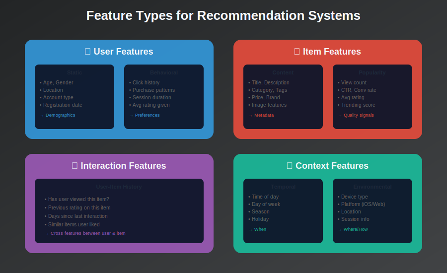
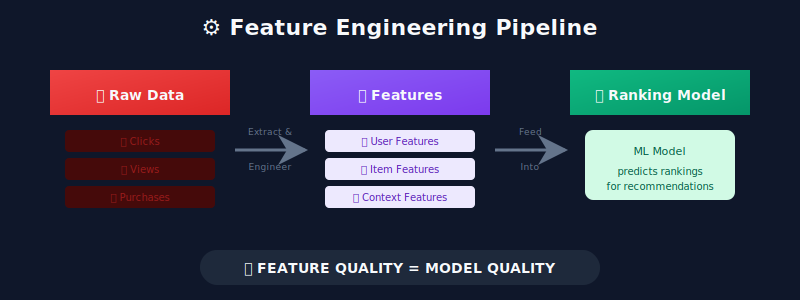
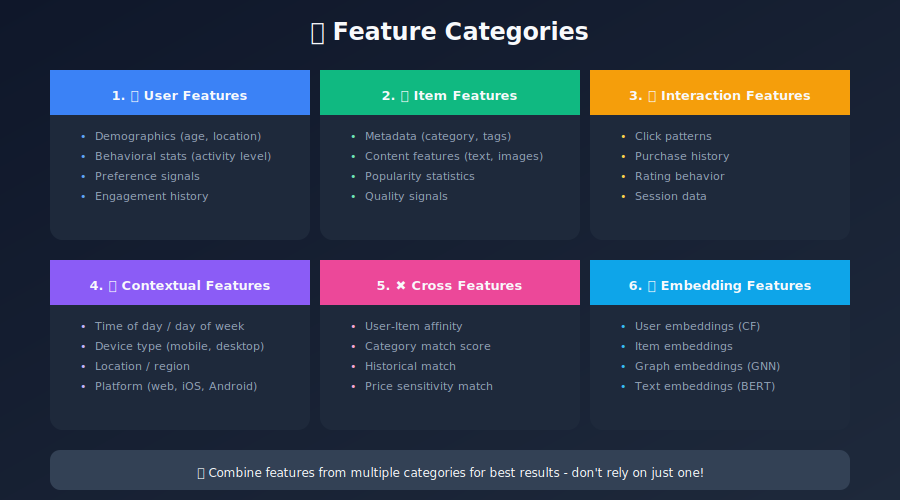
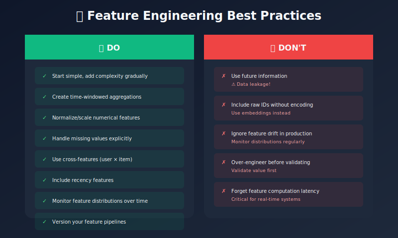

# Feature Engineering for Recommendation Systems

## Building the Foundation for Accurate Predictions

---

## 📊 Visual Overview



---

## 📖 Table of Contents

1. [Introduction](#introduction)

2. [Types of Features](#types-of-features)

3. [User Features](#user-features)

4. [Item Features](#item-features)

5. [Interaction Features](#interaction-features)

6. [Contextual Features](#contextual-features)

7. [Feature Encoding Techniques](#feature-encoding-techniques)

8. [Embeddings](#embeddings)

9. [Feature Selection](#feature-selection)

10. [Best Practices](#best-practices)

---

## Introduction

Feature engineering is often the difference between a mediocre and a great recommendation system. Well-crafted features capture the signals that drive user preferences.

### The Feature Engineering Pipeline



---

## Types of Features

### Feature Taxonomy



---

## User Features

### Static User Features

```python
class UserFeatureExtractor:
    """Extract features from user data."""

    def get_demographic_features(self, user_id):
        """Static demographic features."""
        user = self.user_db.get(user_id)
        return {
            'age_bucket': self._age_to_bucket(user.age),
            'gender': user.gender,
            'country': user.country,
            'language': user.language,
            'account_age_days': (now() - user.created_at).days,
            'is_premium': int(user.subscription == 'premium'),
        }

    def _age_to_bucket(self, age):
        """Convert age to privacy-preserving bucket."""
        if age < 18: return '0-17'
        elif age < 25: return '18-24'
        elif age < 35: return '25-34'
        elif age < 45: return '35-44'
        elif age < 55: return '45-54'
        else: return '55+'

```

### Behavioral User Features

```python
def get_behavioral_features(self, user_id, window_days=30):
    """
    Extract behavioral features from user activity.
    """
    interactions = self.get_user_interactions(
        user_id,
        days=window_days
    )

    return {
        # Activity level
        'total_interactions': len(interactions),
        'unique_items_viewed': len(set(i.item_id for i in interactions)),
        'avg_daily_interactions': len(interactions) / window_days,

        # Engagement depth
        'avg_session_duration_sec': np.mean([i.duration for i in interactions]),
        'avg_items_per_session': self._items_per_session(interactions),
        'return_user': int(len(interactions) > 1),

        # Rating behavior
        'avg_rating_given': np.mean([i.rating for i in interactions if i.rating]),
        'rating_std': np.std([i.rating for i in interactions if i.rating]),
        'num_ratings_given': sum(1 for i in interactions if i.rating),

        # Purchase behavior (for e-commerce)
        'purchase_rate': self._purchase_rate(interactions),
        'avg_purchase_value': self._avg_purchase_value(interactions),

        # Time patterns
        'preferred_hour': self._most_common_hour(interactions),
        'weekend_ratio': self._weekend_ratio(interactions),
    }

```

### User Preference Features

```python
def get_preference_features(self, user_id):
    """
    Extract user preferences from historical interactions.
    """
    history = self.get_user_history(user_id)

    # Category preferences
    category_counts = Counter(
        item.category for item in history.liked_items
    )
    total = sum(category_counts.values())
    category_prefs = {
        f'pref_{cat}': count / total
        for cat, count in category_counts.items()
    }

    # Price preference (for e-commerce)
    prices = [item.price for item in history.purchased_items]
    price_features = {
        'avg_price_preference': np.mean(prices) if prices else 0,
        'price_range_min': np.min(prices) if prices else 0,
        'price_range_max': np.max(prices) if prices else 0,
    }

    # Brand preference
    brand_counts = Counter(
        item.brand for item in history.purchased_items
    )
    top_brands = brand_counts.most_common(5)
    brand_features = {
        f'top_brand_{i}': brand
        for i, (brand, _) in enumerate(top_brands)
    }

    return {**category_prefs, **price_features, **brand_features}

```

---

## Item Features

### Content Features

```python
class ItemFeatureExtractor:
    """Extract features from item data."""

    def get_content_features(self, item_id):
        """Extract content-based features."""
        item = self.item_db.get(item_id)

        return {
            # Basic metadata
            'category': item.category,
            'subcategory': item.subcategory,
            'brand': item.brand,
            'price': item.price,
            'price_bucket': self._price_to_bucket(item.price),

            # Content attributes
            'title_length': len(item.title.split()),
            'description_length': len(item.description.split()),
            'num_images': len(item.images),
            'has_video': int(item.video is not None),

            # Quality signals
            'avg_rating': item.avg_rating,
            'num_ratings': item.num_ratings,
            'rating_variance': item.rating_variance,
        }

    def get_text_features(self, item_id):
        """Extract text-based features using NLP."""
        item = self.item_db.get(item_id)
        text = f"{item.title} {item.description}"

        # TF-IDF features
        tfidf_vector = self.tfidf_vectorizer.transform([text])

        # Sentiment
        sentiment = self.sentiment_analyzer.polarity_scores(text)

        # Named entities
        entities = self.ner_model.extract(text)

        return {
            'tfidf_vector': tfidf_vector,
            'sentiment_pos': sentiment['pos'],
            'sentiment_neg': sentiment['neg'],
            'sentiment_neu': sentiment['neu'],
            'num_entities': len(entities),
        }

```

### Popularity Features

```python
def get_popularity_features(self, item_id, time_windows=[1, 7, 30]):
    """
    Time-windowed popularity features.
    """
    features = {}

    for days in time_windows:
        stats = self.get_item_stats(item_id, days=days)

        features.update({
            f'views_{days}d': stats.view_count,
            f'clicks_{days}d': stats.click_count,
            f'purchases_{days}d': stats.purchase_count,
            f'ctr_{days}d': stats.click_count / max(stats.view_count, 1),
            f'conversion_{days}d': stats.purchase_count / max(stats.click_count, 1),
        })

    # Trend features (is it growing or declining?)
    features['view_trend'] = (
        features['views_7d'] / max(features['views_30d'] / 4, 1)
    )
    features['is_trending'] = int(features['view_trend'] > 1.5)

    return features

```

---

## Interaction Features

### Historical Interaction Features

```python
def get_interaction_features(self, user_id, item_id):
    """
    Features derived from user-item interaction history.
    """
    # User's history with this item
    user_item_history = self.get_user_item_history(user_id, item_id)

    features = {
        # Direct history
        'has_viewed': int(user_item_history.view_count > 0),
        'has_clicked': int(user_item_history.click_count > 0),
        'has_purchased': int(user_item_history.purchase_count > 0),
        'has_rated': int(user_item_history.rating is not None),
        'user_rating': user_item_history.rating or 0,

        # Recency
        'days_since_last_view': user_item_history.days_since_view or 999,
        'days_since_last_click': user_item_history.days_since_click or 999,

        # Frequency
        'view_count': user_item_history.view_count,
        'click_count': user_item_history.click_count,
    }

    return features

def get_similar_item_features(self, user_id, item_id):
    """
    Features based on user's interaction with similar items.
    """
    similar_items = self.get_similar_items(item_id, n=10)
    user_history = self.get_user_history(user_id)

    # How many similar items has user interacted with?
    similar_viewed = sum(
        1 for item in similar_items if item in user_history.viewed
    )
    similar_purchased = sum(
        1 for item in similar_items if item in user_history.purchased
    )

    # Ratings on similar items
    similar_ratings = [
        user_history.ratings.get(item)
        for item in similar_items
        if item in user_history.ratings
    ]

    return {
        'similar_items_viewed': similar_viewed,
        'similar_items_purchased': similar_purchased,
        'similar_items_ratio': similar_viewed / len(similar_items),
        'avg_rating_similar': np.mean(similar_ratings) if similar_ratings else 0,
    }

```

---

## Contextual Features

### Time-Based Features

```python
def get_temporal_features(self, timestamp):
    """
    Extract time-based contextual features.
    """
    dt = datetime.fromtimestamp(timestamp)

    return {
        # Basic time features
        'hour_of_day': dt.hour,
        'day_of_week': dt.weekday(),
        'day_of_month': dt.day,
        'month': dt.month,
        'is_weekend': int(dt.weekday() >= 5),

        # Time buckets
        'time_bucket': self._hour_to_bucket(dt.hour),
        # morning (6-12), afternoon (12-18), evening (18-22), night (22-6)

        # Special events
        'is_holiday': int(dt.date() in self.holidays),
        'days_to_holiday': self._days_to_nearest_holiday(dt),

        # Cyclical encoding (for neural networks)
        'hour_sin': np.sin(2 * np.pi * dt.hour / 24),
        'hour_cos': np.cos(2 * np.pi * dt.hour / 24),
        'dow_sin': np.sin(2 * np.pi * dt.weekday() / 7),
        'dow_cos': np.cos(2 * np.pi * dt.weekday() / 7),
    }

```

### Device and Platform Features

```python
def get_device_features(self, request_context):
    """
    Extract device and platform context.
    """
    return {
        'device_type': request_context.device_type,  # mobile/desktop/tablet
        'os': request_context.os,
        'browser': request_context.browser,
        'app_version': request_context.app_version,
        'screen_size_bucket': self._screen_to_bucket(
            request_context.screen_width
        ),
        'is_app': int(request_context.platform == 'app'),
        'connection_type': request_context.connection,  # wifi/cellular
    }

```

### Session Features

```python
def get_session_features(self, session_id):
    """
    Extract features from current browsing session.
    """
    session = self.session_store.get(session_id)

    return {
        'session_duration_sec': session.duration_seconds,
        'items_viewed_this_session': len(session.viewed_items),
        'items_clicked_this_session': len(session.clicked_items),
        'items_carted_this_session': len(session.cart_items),
        'session_position': session.current_position,  # How far into session

        # Search context
        'has_search': int(session.search_query is not None),
        'search_query_length': len(session.search_query.split()) if session.search_query else 0,

        # Navigation pattern
        'page_depth': session.page_depth,
        'referrer_type': session.referrer_type,  # search/direct/social
    }

```

---

## Feature Encoding Techniques

### Numerical Features

```python
from sklearn.preprocessing import StandardScaler, MinMaxScaler, QuantileTransformer

class NumericalEncoder:
    """Encode numerical features."""

    def __init__(self, method='standard'):
        self.method = method
        self.encoders = {}

    def fit_transform(self, features_df):
        """Fit and transform numerical features."""
        result = {}

        for col in features_df.select_dtypes(include=[np.number]).columns:
            if self.method == 'standard':
                encoder = StandardScaler()
            elif self.method == 'minmax':
                encoder = MinMaxScaler()
            elif self.method == 'quantile':
                encoder = QuantileTransformer(output_distribution='normal')
            else:
                raise ValueError(f"Unknown method: {self.method}")

            values = features_df[col].values.reshape(-1, 1)
            result[col] = encoder.fit_transform(values).flatten()
            self.encoders[col] = encoder

        return pd.DataFrame(result)

```

### Categorical Features

```python
from sklearn.preprocessing import LabelEncoder, OneHotEncoder

class CategoricalEncoder:
    """Encode categorical features."""

    def __init__(self, max_cardinality=100):
        self.max_cardinality = max_cardinality
        self.encoders = {}

    def encode(self, features_df):
        """
        Choose encoding based on cardinality:
        - Low cardinality: One-hot encoding
        - High cardinality: Target encoding or embedding
        """
        result = {}

        for col in features_df.select_dtypes(include=['object']).columns:
            cardinality = features_df[col].nunique()

            if cardinality <= self.max_cardinality:
                # One-hot encoding
                encoded = pd.get_dummies(
                    features_df[col],
                    prefix=col,
                    dummy_na=True
                )
                for enc_col in encoded.columns:
                    result[enc_col] = encoded[enc_col].values
            else:
                # Label encoding (for embedding later)
                le = LabelEncoder()
                result[f'{col}_encoded'] = le.fit_transform(
                    features_df[col].fillna('UNKNOWN')
                )
                self.encoders[col] = le

        return pd.DataFrame(result)

```

### Target Encoding

```python
def target_encode(df, categorical_col, target_col, smoothing=10):
    """
    Encode categorical with target statistics.
    Handles high cardinality well.
    """
    global_mean = df[target_col].mean()

    # Calculate stats per category
    stats = df.groupby(categorical_col)[target_col].agg(['mean', 'count'])

    # Smoothed mean (regularization)
    smoothed_mean = (
        (stats['count'] * stats['mean'] + smoothing * global_mean) /
        (stats['count'] + smoothing)
    )

    return df[categorical_col].map(smoothed_mean).fillna(global_mean)

```

---

## Embeddings

### Learning User and Item Embeddings

```python
import torch
import torch.nn as nn

class EmbeddingModel(nn.Module):
    """
    Learn user and item embeddings from interactions.
    """

    def __init__(self, n_users, n_items, embed_dim=64):
        super().__init__()
        self.user_embedding = nn.Embedding(n_users, embed_dim)
        self.item_embedding = nn.Embedding(n_items, embed_dim)

        # Initialize weights
        nn.init.normal_(self.user_embedding.weight, std=0.01)
        nn.init.normal_(self.item_embedding.weight, std=0.01)

    def forward(self, user_ids, item_ids):
        user_embed = self.user_embedding(user_ids)
        item_embed = self.item_embedding(item_ids)

        # Dot product for prediction
        return (user_embed * item_embed).sum(dim=1)

    def get_user_embedding(self, user_id):
        return self.user_embedding.weight[user_id].detach().numpy()

    def get_item_embedding(self, item_id):
        return self.item_embedding.weight[item_id].detach().numpy()

```

### Pre-trained Text Embeddings

```python
from sentence_transformers import SentenceTransformer

class TextEmbedder:
    """
    Generate embeddings for text content.
    """

    def __init__(self, model_name='all-MiniLM-L6-v2'):
        self.model = SentenceTransformer(model_name)

    def embed_items(self, items_df, text_columns=['title', 'description']):
        """
        Generate embeddings for item text.
        """
        # Combine text columns
        texts = items_df[text_columns].fillna('').agg(' '.join, axis=1)

        # Generate embeddings
        embeddings = self.model.encode(
            texts.tolist(),
            show_progress_bar=True,
            batch_size=32
        )

        return embeddings

```

---

## Feature Selection

### Importance-Based Selection

```python
from sklearn.ensemble import RandomForestRegressor
import shap

def select_features_by_importance(X, y, n_features=50):
    """
    Select top features based on importance.
    """
    # Train a model
    model = RandomForestRegressor(n_estimators=100, random_state=42)
    model.fit(X, y)

    # Get feature importance
    importances = pd.DataFrame({
        'feature': X.columns,
        'importance': model.feature_importances_
    }).sort_values('importance', ascending=False)

    # Select top features
    selected = importances.head(n_features)['feature'].tolist()

    # SHAP values for interpretability
    explainer = shap.TreeExplainer(model)
    shap_values = explainer.shap_values(X)

    return selected, importances, shap_values

```

---

## Best Practices

### Feature Engineering Checklist



---

## Summary

Feature engineering is crucial for recommendation systems. The right features capture user preferences, item characteristics, and contextual signals that drive predictions.

### Key Takeaways

1. **Diverse feature sources** - Use user, item, interaction, and context

2. **Time-aware features** - Recency and trends matter

3. **Smart encoding** - Match technique to cardinality

4. **Embeddings** - Capture complex relationships

5. **Validate carefully** - Avoid data leakage

---

## 🎬 Video Resources

### Recommended YouTube Videos

| Video | Channel | Duration |
|-------|---------|----------|
| [Feature Engineering for ML](https://www.youtube.com/watch?v=68ABAU_V8qI) | Google Cloud | 12 min |
| [Feature Stores Explained](https://www.youtube.com/watch?v=YMxU1X-TQrU) | Tecton | 30 min |
| [Embeddings in ML](https://www.youtube.com/watch?v=5PL0TmQhItY) | StatQuest | 18 min |
| [One-Hot vs Embeddings](https://www.youtube.com/watch?v=RPlXGRDHqZI) | CodeEmporium | 15 min |
| [Target Encoding Explained](https://www.youtube.com/watch?v=589nCGeWG1w) | Kaggle | 10 min |

### Deep Dives

- **[Feast Feature Store](https://www.youtube.com/watch?v=_omIgYLiJZg)** - Open source feature store

- **[Sentence Embeddings](https://www.youtube.com/watch?v=OATCgQtNX2o)** - James Briggs

- **[Time-Series Features](https://www.youtube.com/watch?v=vV12dGe_Fho)** - Rob Mulla

### Kaggle Tutorials

- **Kaggle Learn** - Feature engineering courses

- **Kaggle Competition Walkthroughs** - Real-world feature engineering

---

## Next Steps

Continue to: [Model Training & Evaluation](../06_model_training_evaluation/README.md)

---

*Last Updated: January 2026*
*Author: ML System Design Study Group*

---

<div align="center">

**[⬆ Back to Top](#)** | **[📚 Main Repository](https://github.com/Gaurav14cs17/ml_system_design)**

Made with 💜 by [Gaurav14cs17](https://github.com/Gaurav14cs17)

</div>
