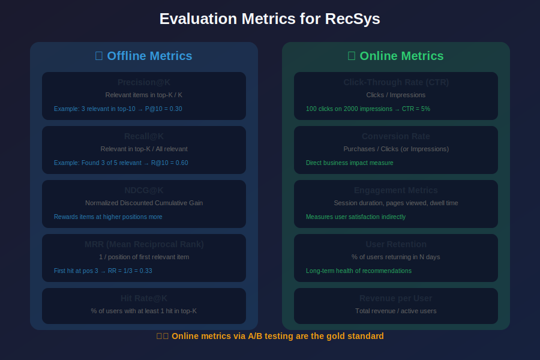
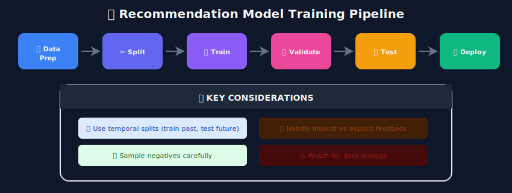
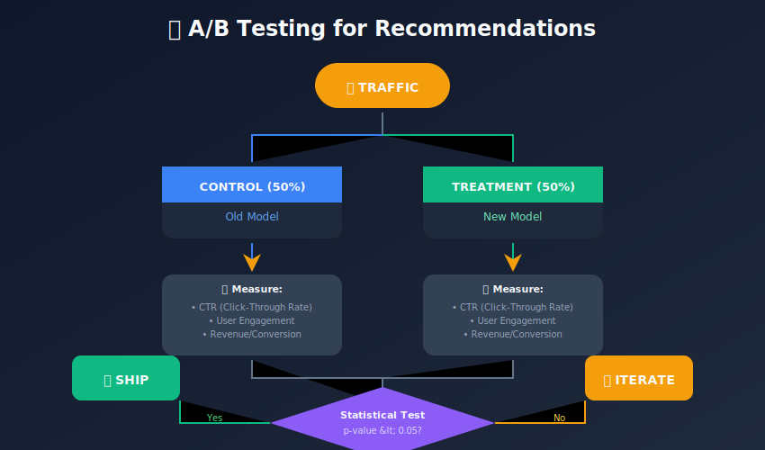
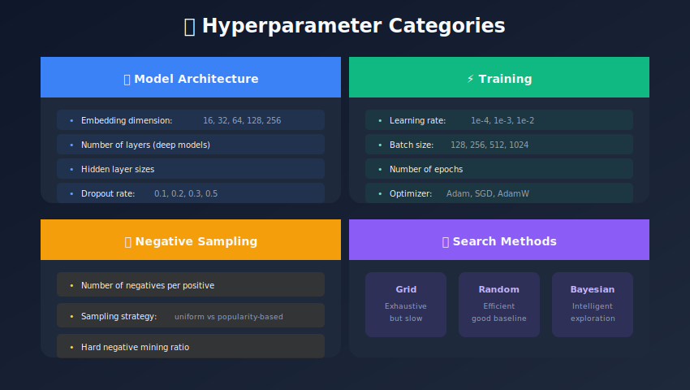

# Model Training & Evaluation for Recommendation Systems

## Building, Training, and Measuring Recommendation Models

---

## 📊 Visual Overview



---

## 📖 Table of Contents

1. [Training Strategies](#training-strategies)
2. [Loss Functions](#loss-functions)
3. [Optimization Techniques](#run-optimization)
4. [Offline Evaluation Metrics](#offline-evaluation-metrics)
5. [Online Evaluation](#online-evaluation)
6. [Cross-Validation Strategies](#cross-validation-strategies)
7. [Hyperparameter Tuning](#hyperparameter-tuning)
8. [Common Pitfalls](#common-pitfalls)

---

## Training Strategies

### Training Pipeline Overview



### Pointwise Training

```python
"""
Pointwise: Predict rating/score for each (user, item) pair
"""
class PointwiseTrainer:
    def train_step(self, user_ids, item_ids, ratings):
        predictions = self.model(user_ids, item_ids)
        loss = nn.MSELoss()(predictions, ratings)
        return loss
```

### Pairwise Training (BPR)

```python
"""
Pairwise: Learn that positive items > negative items
Better for ranking tasks
"""
class BPRTrainer:
    def train_step(self, user_ids, pos_items, neg_items):
        pos_scores = self.model(user_ids, pos_items)
        neg_scores = self.model(user_ids, neg_items)

        # BPR loss: maximize pos_score - neg_score
        loss = -torch.log(torch.sigmoid(pos_scores - neg_scores)).mean()
        return loss
```

### Listwise Training

```python
"""
Listwise: Optimize entire ranked list at once
Best for top-K metrics
"""
class ListwiseTrainer:
    def train_step(self, user_id, item_ids, relevance):
        scores = self.model(user_id, item_ids)

        # ListMLE or ListNet loss
        loss = self.listwise_loss(scores, relevance)
        return loss
```

---

## Loss Functions

### Rating Prediction Losses

```python

# MSE - Mean Squared Error
def mse_loss(predictions, targets):
    return ((predictions - targets) ** 2).mean()

# MAE - Mean Absolute Error
def mae_loss(predictions, targets):
    return torch.abs(predictions - targets).mean()

# Huber Loss - Robust to outliers
def huber_loss(predictions, targets, delta=1.0):
    diff = torch.abs(predictions - targets)
    return torch.where(
        diff < delta,
        0.5 * diff ** 2,
        delta * diff - 0.5 * delta ** 2
    ).mean()
```

### Ranking Losses

```python

# BPR Loss
def bpr_loss(pos_scores, neg_scores):
    return -torch.log(torch.sigmoid(pos_scores - neg_scores)).mean()

# Hinge Loss (Margin Ranking)
def hinge_loss(pos_scores, neg_scores, margin=1.0):
    return torch.clamp(margin - pos_scores + neg_scores, min=0).mean()

# Sampled Softmax
def sampled_softmax_loss(user_embed, pos_item_embed, neg_item_embeds):
    pos_score = (user_embed * pos_item_embed).sum(dim=1)
    neg_scores = torch.matmul(user_embed, neg_item_embeds.T)

    logits = torch.cat([pos_score.unsqueeze(1), neg_scores], dim=1)
    labels = torch.zeros(logits.size(0), dtype=torch.long)

    return nn.CrossEntropyLoss()(logits, labels)
```

---

## Offline Evaluation Metrics

### Accuracy Metrics

```python
def calculate_metrics(predictions, ground_truth, k=10):
    """
    Calculate comprehensive ranking metrics.
    """
    metrics = {}

    # Precision@K
    def precision_at_k(pred, truth, k):
        pred_k = set(pred[:k])
        return len(pred_k & truth) / k

    # Recall@K
    def recall_at_k(pred, truth, k):
        pred_k = set(pred[:k])
        return len(pred_k & truth) / len(truth) if truth else 0

    # NDCG@K
    def ndcg_at_k(pred, truth, k):
        dcg = sum(
            1 / np.log2(i + 2)
            for i, item in enumerate(pred[:k])
            if item in truth
        )
        idcg = sum(1 / np.log2(i + 2) for i in range(min(len(truth), k)))
        return dcg / idcg if idcg > 0 else 0

    # Hit Rate
    def hit_rate(pred, truth, k):
        return 1 if any(item in truth for item in pred[:k]) else 0

    # MRR (Mean Reciprocal Rank)
    def mrr(pred, truth):
        for i, item in enumerate(pred):
            if item in truth:
                return 1 / (i + 1)
        return 0

    # Calculate all metrics
    metrics['precision@' + str(k)] = precision_at_k(predictions, ground_truth, k)
    metrics['recall@' + str(k)] = recall_at_k(predictions, ground_truth, k)
    metrics['ndcg@' + str(k)] = ndcg_at_k(predictions, ground_truth, k)
    metrics['hit_rate@' + str(k)] = hit_rate(predictions, ground_truth, k)
    metrics['mrr'] = mrr(predictions, ground_truth)

    return metrics
```

### Beyond Accuracy Metrics

```python
def calculate_beyond_accuracy_metrics(recommendations, all_items, user_histories):
    """
    Metrics beyond pure accuracy.
    """

    # Coverage: What fraction of items are ever recommended?
    recommended_items = set()
    for recs in recommendations.values():
        recommended_items.update(recs)
    coverage = len(recommended_items) / len(all_items)

    # Diversity: How different are items in a recommendation list?
    def intra_list_diversity(recs, similarity_matrix):
        if len(recs) < 2:
            return 0
        similarities = []
        for i in range(len(recs)):
            for j in range(i + 1, len(recs)):
                similarities.append(similarity_matrix[recs[i], recs[j]])
        return 1 - np.mean(similarities)

    # Novelty: Are we recommending long-tail items?
    def novelty_score(recs, item_popularity):
        return np.mean([
            -np.log2(item_popularity[item] + 1e-10)
            for item in recs
        ])

    # Serendipity: Surprising but relevant recommendations
    def serendipity(recs, expected_items, relevant_items):
        unexpected_relevant = set(recs) - set(expected_items)
        return len(unexpected_relevant & relevant_items) / len(recs)

    return {
        'coverage': coverage,
        'diversity': diversity,
        'novelty': novelty,
        'serendipity': serendipity
    }
```

---

## Online Evaluation

### A/B Testing Framework



### Key Online Metrics

```python
class OnlineMetrics:
    """
    Track online recommendation performance.
    """

    def calculate_ctr(self, impressions, clicks):
        """Click-through rate"""
        return clicks / impressions if impressions > 0 else 0

    def calculate_conversion_rate(self, clicks, conversions):
        """Conversion rate (purchases/signups)"""
        return conversions / clicks if clicks > 0 else 0

    def calculate_engagement(self, sessions):
        """Engagement metrics"""
        return {
            'avg_session_duration': np.mean([s.duration for s in sessions]),
            'avg_items_viewed': np.mean([s.items_viewed for s in sessions]),
            'avg_depth': np.mean([s.scroll_depth for s in sessions]),
        }

    def calculate_revenue_metrics(self, transactions):
        """Revenue impact"""
        return {
            'revenue_per_user': sum(t.amount for t in transactions) / len(set(t.user for t in transactions)),
            'avg_order_value': np.mean([t.amount for t in transactions]),
            'items_per_order': np.mean([len(t.items) for t in transactions]),
        }
```

---

## Cross-Validation Strategies

### Time-Based Split (Recommended)

```python
def temporal_train_test_split(interactions_df, test_ratio=0.2):
    """
    Split by time - most realistic for recommendations.
    """
    interactions_df = interactions_df.sort_values('timestamp')

    split_idx = int(len(interactions_df) * (1 - test_ratio))

    train = interactions_df.iloc[:split_idx]
    test = interactions_df.iloc[split_idx:]

    return train, test

def rolling_window_cv(interactions_df, n_folds=5, gap_days=1):
    """
    Time-series cross-validation with gap to prevent leakage.
    """
    interactions_df = interactions_df.sort_values('timestamp')

    dates = interactions_df['timestamp'].unique()
    fold_size = len(dates) // (n_folds + 1)

    for i in range(n_folds):
        train_end = dates[fold_size * (i + 1)]
        test_start = train_end + timedelta(days=gap_days)
        test_end = dates[min(fold_size * (i + 2), len(dates) - 1)]

        train = interactions_df[interactions_df['timestamp'] <= train_end]
        test = interactions_df[
            (interactions_df['timestamp'] >= test_start) &
            (interactions_df['timestamp'] <= test_end)
        ]

        yield train, test
```

### Leave-One-Out (For Implicit Feedback)

```python
def leave_one_out_split(interactions_df):
    """
    Hold out last interaction per user for testing.
    """
    interactions_df = interactions_df.sort_values(['user_id', 'timestamp'])

    test = interactions_df.groupby('user_id').tail(1)
    train = interactions_df.drop(test.index)

    return train, test
```

---

## Hyperparameter Tuning

### Key Hyperparameters



### Tuning with Optuna

```python
import optuna

def objective(trial):

    # Define hyperparameters to tune
    params = {
        'embedding_dim': trial.suggest_categorical('embedding_dim', [32, 64, 128]),
        'learning_rate': trial.suggest_loguniform('learning_rate', 1e-4, 1e-2),
        'batch_size': trial.suggest_categorical('batch_size', [256, 512, 1024]),
        'dropout': trial.suggest_uniform('dropout', 0.1, 0.5),
        'n_negatives': trial.suggest_int('n_negatives', 1, 10),
        'weight_decay': trial.suggest_loguniform('weight_decay', 1e-6, 1e-3),
    }

    # Train model
    model = build_model(**params)
    model = train_model(model, train_data, val_data, **params)

    # Evaluate
    metrics = evaluate_model(model, val_data)

    return metrics['ndcg@10']

# Run optimization
study = optuna.create_study(direction='maximize')
study.optimize(objective, n_trials=100)

print(f"Best params: {study.best_params}")
print(f"Best NDCG@10: {study.best_value:.4f}")
```

---

## Common Pitfalls

### Data Leakage

```
⚠️ DATA LEAKAGE EXAMPLES:

1. Using future information:
   ❌ Feature: "user_will_purchase_this_item"

2. Target in features:
   ❌ Feature: "item_avg_rating" (includes test ratings)

3. Wrong split:
   ❌ Random split instead of temporal split

4. Global statistics:
   ❌ Computing popularity on full data

SOLUTION: Always use train data only for features
```

### Negative Sampling Bias

```python

# BAD: Uniform random sampling
def bad_negative_sampling(user_id, positive_items, all_items, n=5):
    negatives = random.sample(list(all_items - positive_items), n)
    return negatives

# BETTER: Popularity-weighted sampling
def better_negative_sampling(user_id, positive_items, item_popularity, n=5):
    candidates = list(set(item_popularity.keys()) - positive_items)
    weights = [item_popularity[i] ** 0.75 for i in candidates]  # Damped
    weights = np.array(weights) / sum(weights)
    negatives = np.random.choice(candidates, n, p=weights, replace=False)
    return negatives
```

### Popularity Bias in Evaluation

```python

# Standard metrics favor popular items
# Consider stratified evaluation:

def stratified_evaluation(model, test_data, item_popularity):
    """
    Evaluate separately on popular vs long-tail items.
    """

    # Split items by popularity
    popularity_sorted = sorted(item_popularity.items(), key=lambda x: x[1], reverse=True)

    head_items = set(i for i, _ in popularity_sorted[:int(len(popularity_sorted) * 0.2)])
    tail_items = set(i for i, _ in popularity_sorted[int(len(popularity_sorted) * 0.2):])

    # Evaluate on each segment
    head_metrics = evaluate_on_items(model, test_data, head_items)
    tail_metrics = evaluate_on_items(model, test_data, tail_items)

    return {
        'head': head_metrics,
        'tail': tail_metrics,
        'overall': evaluate_on_items(model, test_data, head_items | tail_items)
    }
```

---

## Summary

Proper training and evaluation are essential for building effective recommendation systems. Use time-based splits, appropriate loss functions, and comprehensive metrics.

### Key Takeaways

1. **Temporal splits** prevent data leakage
2. **Pairwise losses** work better for ranking
3. **Beyond-accuracy metrics** matter (coverage, diversity)
4. **A/B testing** is the gold standard
5. **Watch for biases** in sampling and evaluation

---

## 🎬 Video Resources

### Recommended YouTube Videos

| Video | Channel | Duration |
|-------|---------|----------|
| [Precision, Recall, F1 Explained](https://www.youtube.com/watch?v=jJ7ff7Gcq34) | StatQuest | 12 min |
| [NDCG Explained](https://www.youtube.com/watch?v=hnToPSP4sVs) | Normalized Nerd | 10 min |
| [A/B Testing for ML](https://www.youtube.com/watch?v=hnToPSP4sVs) | Weights & Biases | 25 min |
| [Cross-Validation Strategies](https://www.youtube.com/watch?v=fSytzGwwBVw) | StatQuest | 8 min |
| [Hyperparameter Tuning with Optuna](https://www.youtube.com/watch?v=m5YSKPMjkrk) | sentdex | 20 min |

### Training Deep Dives
- **[Loss Functions Explained](https://www.youtube.com/watch?v=Skc8nqJirJg)** - StatQuest
- **[BPR Loss for Ranking](https://www.youtube.com/watch?v=ZkBQ6YA9E40)** - Papers with Code
- **[Learning to Rank](https://www.youtube.com/watch?v=F3TBF8_5Ui4)** - Stanford CS276

### MLOps & Evaluation
- **[ML Experiment Tracking](https://www.youtube.com/watch?v=TLTU5q9EbVE)** - Weights & Biases
- **[Online vs Offline Metrics](https://www.youtube.com/watch?v=nqj-IyEPEVY)** - MLOps Community

---

## Next Steps

Continue to: [Deep Learning for Recommendations](../07_deep_learning/README.md)

---

*Last Updated: January 2026*
*Author: ML System Design Study Group*

---

<div align="center">

**[⬆ Back to Top](#)** | **[📚 Main Repository](https://github.com/Gaurav14cs17/ml_system_design)**

Made with 💜 by [Gaurav14cs17](https://github.com/Gaurav14cs17)

</div>
