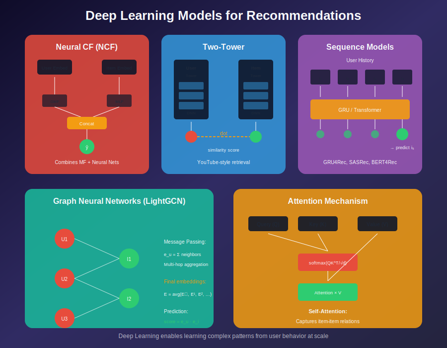
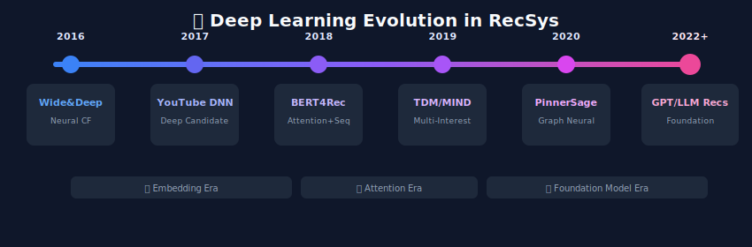
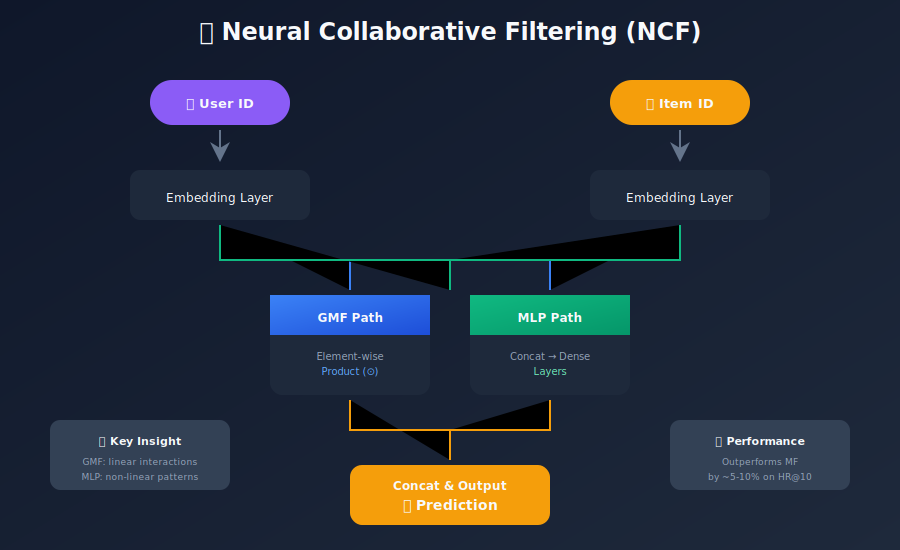
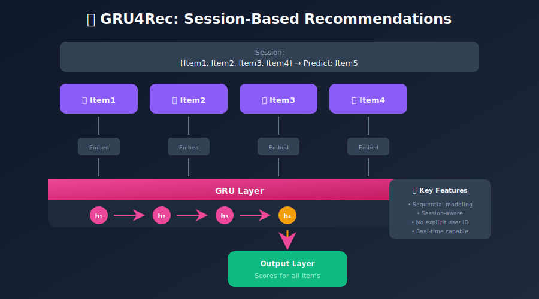
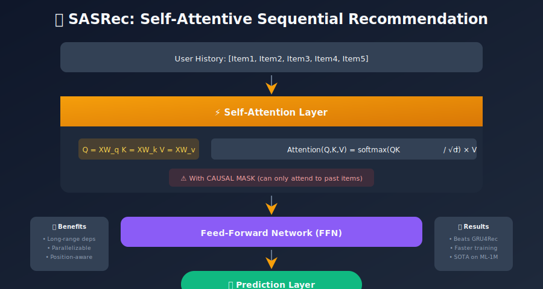
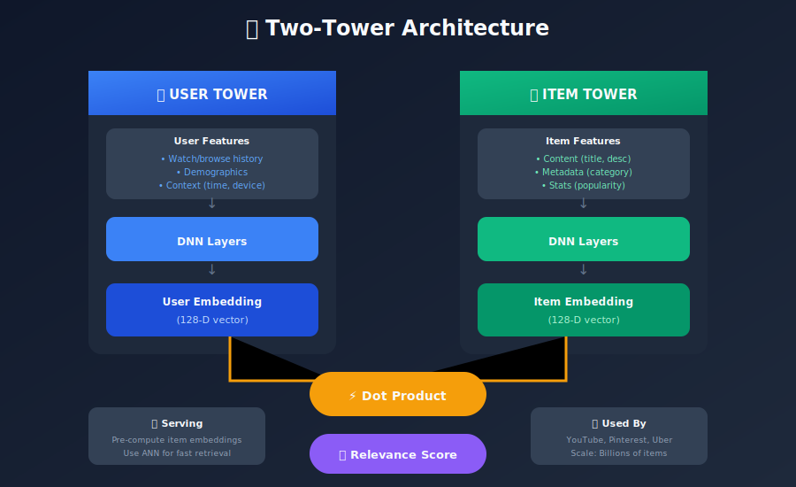
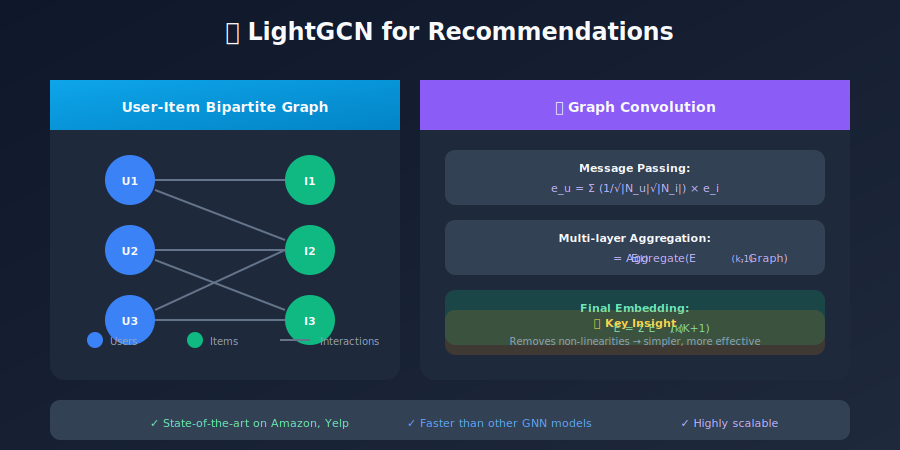

# Deep Learning for Recommendation Systems

## Neural Network Approaches to Modern Recommendations

---

## 📊 Visual Overview



---

## 📖 Table of Contents

1. [Introduction](#introduction)
2. [Neural Collaborative Filtering](#neural-collaborative-filtering)
3. [Deep Matrix Factorization](#deep-learning-foundations)
4. [Sequence Models](#sequence-models)
5. [Attention Mechanisms](#attention-mechanisms)
6. [Two-Tower Architecture](#two-tower-architecture)
7. [Graph Neural Networks](#graph-neural-networks)
8. [Transformer-Based Models](#transformer-based-models)
9. [Implementation Examples](#implementation-tutorials)

---

## Introduction

Deep learning has revolutionized recommendation systems by enabling them to learn complex patterns from user behavior and content.

### Evolution of Deep RecSys



---

## Neural Collaborative Filtering

### NCF Architecture



### PyTorch Implementation

```python
import torch
import torch.nn as nn

class NeuralCF(nn.Module):
    """
    Neural Collaborative Filtering combining GMF and MLP.
    """

    def __init__(self, n_users, n_items,
                 gmf_dim=32, mlp_dims=[64, 32, 16]):
        super().__init__()

        # GMF embeddings
        self.gmf_user_embed = nn.Embedding(n_users, gmf_dim)
        self.gmf_item_embed = nn.Embedding(n_items, gmf_dim)

        # MLP embeddings
        self.mlp_user_embed = nn.Embedding(n_users, mlp_dims[0] // 2)
        self.mlp_item_embed = nn.Embedding(n_items, mlp_dims[0] // 2)

        # MLP layers
        mlp_layers = []
        for i in range(len(mlp_dims) - 1):
            mlp_layers.extend([
                nn.Linear(mlp_dims[i], mlp_dims[i+1]),
                nn.ReLU(),
                nn.Dropout(0.2)
            ])
        self.mlp = nn.Sequential(*mlp_layers)

        # Final prediction layer
        self.output = nn.Linear(gmf_dim + mlp_dims[-1], 1)

        self._init_weights()

    def _init_weights(self):
        for m in self.modules():
            if isinstance(m, nn.Embedding):
                nn.init.normal_(m.weight, std=0.01)
            elif isinstance(m, nn.Linear):
                nn.init.xavier_uniform_(m.weight)

    def forward(self, user_ids, item_ids):

        # GMF path
        gmf_user = self.gmf_user_embed(user_ids)
        gmf_item = self.gmf_item_embed(item_ids)
        gmf_out = gmf_user * gmf_item  # Element-wise product

        # MLP path
        mlp_user = self.mlp_user_embed(user_ids)
        mlp_item = self.mlp_item_embed(item_ids)
        mlp_concat = torch.cat([mlp_user, mlp_item], dim=1)
        mlp_out = self.mlp(mlp_concat)

        # Combine and predict
        combined = torch.cat([gmf_out, mlp_out], dim=1)
        prediction = self.output(combined)

        return prediction.squeeze()
```

---

## Sequence Models

### GRU4Rec - Session-Based Recommendations



### Implementation

```python
class GRU4Rec(nn.Module):
    """
    GRU-based session recommendation model.
    """

    def __init__(self, n_items, embed_dim=64, hidden_dim=128, n_layers=1):
        super().__init__()

        self.embedding = nn.Embedding(n_items, embed_dim, padding_idx=0)
        self.gru = nn.GRU(
            embed_dim,
            hidden_dim,
            n_layers,
            batch_first=True,
            dropout=0.2 if n_layers > 1 else 0
        )
        self.output = nn.Linear(hidden_dim, n_items)

    def forward(self, session_items, lengths):

        # Embed items
        x = self.embedding(session_items)  # (batch, seq_len, embed_dim)

        # Pack for variable length
        packed = nn.utils.rnn.pack_padded_sequence(
            x, lengths, batch_first=True, enforce_sorted=False
        )

        # GRU forward
        _, hidden = self.gru(packed)  # hidden: (n_layers, batch, hidden_dim)

        # Output layer
        out = self.output(hidden[-1])  # (batch, n_items)

        return out
```

---

## Attention Mechanisms

### Self-Attention for Recommendations (SASRec)



### Implementation

```python
class SASRec(nn.Module):
    """
    Self-Attentive Sequential Recommendation.
    """

    def __init__(self, n_items, max_len, embed_dim=64, n_heads=2, n_layers=2):
        super().__init__()

        self.item_embedding = nn.Embedding(n_items + 1, embed_dim, padding_idx=0)
        self.pos_embedding = nn.Embedding(max_len, embed_dim)

        # Transformer encoder layers
        encoder_layer = nn.TransformerEncoderLayer(
            d_model=embed_dim,
            nhead=n_heads,
            dim_feedforward=embed_dim * 4,
            dropout=0.2,
            batch_first=True
        )
        self.transformer = nn.TransformerEncoder(encoder_layer, n_layers)

        self.output = nn.Linear(embed_dim, n_items)
        self.max_len = max_len

    def forward(self, item_seq):
        batch_size, seq_len = item_seq.shape

        # Embeddings
        item_embed = self.item_embedding(item_seq)
        positions = torch.arange(seq_len, device=item_seq.device).unsqueeze(0)
        pos_embed = self.pos_embedding(positions)

        x = item_embed + pos_embed

        # Causal mask (can only look at past)
        mask = torch.triu(torch.ones(seq_len, seq_len), diagonal=1).bool()
        mask = mask.to(item_seq.device)

        # Padding mask
        padding_mask = (item_seq == 0)

        # Transformer
        x = self.transformer(x, mask=mask, src_key_padding_mask=padding_mask)

        # Output
        logits = self.output(x)

        return logits
```

---

## Two-Tower Architecture

### YouTube-Style Two-Tower



### Implementation

```python
class TwoTowerModel(nn.Module):
    """
    Two-tower model for candidate retrieval.
    """

    def __init__(self, user_feature_dim, item_feature_dim, embed_dim=128):
        super().__init__()

        # User tower
        self.user_tower = nn.Sequential(
            nn.Linear(user_feature_dim, 256),
            nn.ReLU(),
            nn.Dropout(0.2),
            nn.Linear(256, 128),
            nn.ReLU(),
            nn.Linear(128, embed_dim),
            nn.LayerNorm(embed_dim)
        )

        # Item tower
        self.item_tower = nn.Sequential(
            nn.Linear(item_feature_dim, 256),
            nn.ReLU(),
            nn.Dropout(0.2),
            nn.Linear(256, 128),
            nn.ReLU(),
            nn.Linear(128, embed_dim),
            nn.LayerNorm(embed_dim)
        )

    def get_user_embedding(self, user_features):
        return self.user_tower(user_features)

    def get_item_embedding(self, item_features):
        return self.item_tower(item_features)

    def forward(self, user_features, item_features):
        user_embed = self.get_user_embedding(user_features)
        item_embed = self.get_item_embedding(item_features)

        # Dot product similarity
        score = (user_embed * item_embed).sum(dim=1)
        return score

    def compute_loss(self, user_features, pos_items, neg_items):
        user_embed = self.get_user_embedding(user_features)
        pos_embed = self.get_item_embedding(pos_items)
        neg_embed = self.get_item_embedding(neg_items)

        pos_score = (user_embed * pos_embed).sum(dim=1)
        neg_score = (user_embed * neg_embed).sum(dim=1)

        # Contrastive loss
        loss = -torch.log(torch.sigmoid(pos_score - neg_score)).mean()
        return loss
```

---

## Graph Neural Networks

### LightGCN Architecture



### Implementation

```python
import torch
import torch.nn as nn
import torch.nn.functional as F
from torch_geometric.nn import MessagePassing

class LightGCNConv(MessagePassing):
    """LightGCN convolution layer."""

    def __init__(self):
        super().__init__(aggr='add')

    def forward(self, x, edge_index, edge_weight):
        return self.propagate(edge_index, x=x, edge_weight=edge_weight)

    def message(self, x_j, edge_weight):
        return edge_weight.view(-1, 1) * x_j

class LightGCN(nn.Module):
    """
    LightGCN for collaborative filtering.
    """

    def __init__(self, n_users, n_items, embed_dim=64, n_layers=3):
        super().__init__()

        self.n_users = n_users
        self.n_items = n_items
        self.n_layers = n_layers

        # Initial embeddings
        self.user_embedding = nn.Embedding(n_users, embed_dim)
        self.item_embedding = nn.Embedding(n_items, embed_dim)

        # GCN layers
        self.convs = nn.ModuleList([LightGCNConv() for _ in range(n_layers)])

        self._init_weights()

    def _init_weights(self):
        nn.init.normal_(self.user_embedding.weight, std=0.1)
        nn.init.normal_(self.item_embedding.weight, std=0.1)

    def forward(self, edge_index, edge_weight):

        # Stack user and item embeddings
        x = torch.cat([
            self.user_embedding.weight,
            self.item_embedding.weight
        ])

        # Multi-layer propagation
        all_embeddings = [x]
        for conv in self.convs:
            x = conv(x, edge_index, edge_weight)
            all_embeddings.append(x)

        # Average across layers
        final_embedding = torch.stack(all_embeddings, dim=1).mean(dim=1)

        user_embeds = final_embedding[:self.n_users]
        item_embeds = final_embedding[self.n_users:]

        return user_embeds, item_embeds

    def predict(self, user_ids, item_ids, user_embeds, item_embeds):
        user_e = user_embeds[user_ids]
        item_e = item_embeds[item_ids]
        return (user_e * item_e).sum(dim=1)
```

---

## Transformer-Based Models

### BERT4Rec

```python
class BERT4Rec(nn.Module):
    """
    BERT-style model for sequential recommendation.
    Uses masked item prediction for training.
    """

    def __init__(self, n_items, max_len=50, embed_dim=64,
                 n_heads=2, n_layers=2, dropout=0.1):
        super().__init__()

        self.item_embedding = nn.Embedding(n_items + 2, embed_dim)  # +2 for PAD, MASK
        self.pos_embedding = nn.Embedding(max_len, embed_dim)

        encoder_layer = nn.TransformerEncoderLayer(
            d_model=embed_dim,
            nhead=n_heads,
            dim_feedforward=embed_dim * 4,
            dropout=dropout,
            batch_first=True
        )
        self.transformer = nn.TransformerEncoder(encoder_layer, n_layers)

        self.output = nn.Linear(embed_dim, n_items)
        self.dropout = nn.Dropout(dropout)
        self.layer_norm = nn.LayerNorm(embed_dim)

        self.mask_token = n_items + 1

    def forward(self, item_seq):
        seq_len = item_seq.size(1)

        # Embeddings
        item_embed = self.item_embedding(item_seq)
        positions = torch.arange(seq_len, device=item_seq.device)
        pos_embed = self.pos_embedding(positions)

        x = self.dropout(self.layer_norm(item_embed + pos_embed))

        # Padding mask
        padding_mask = (item_seq == 0)

        # Transformer (bidirectional - no causal mask)
        x = self.transformer(x, src_key_padding_mask=padding_mask)

        # Output
        logits = self.output(x)

        return logits
```

---

## Summary

Deep learning enables recommendation systems to capture complex patterns and scale to billions of users and items.

### Key Architectures

| Model | Best For | Key Innovation |
|-------|----------|----------------|
| NCF | General CF | Neural + MF combination |
| GRU4Rec | Sessions | Sequential patterns |
| SASRec | Long sequences | Self-attention |
| Two-Tower | Large-scale retrieval | Efficient ANN search |
| LightGCN | Graph structure | Simplified GCN |
| BERT4Rec | Rich history | Bidirectional attention |

---

## 🎬 Video Resources

### Recommended YouTube Videos

| Video | Channel | Duration |
|-------|---------|----------|
| [Neural Collaborative Filtering Paper](https://www.youtube.com/watch?v=ZkBQ6YA9E40) | Yannic Kilcher | 25 min |
| [YouTube DNN Recommendations](https://www.youtube.com/watch?v=BfNNxKL7Kok) | Two Minute Papers | 5 min |
| [Transformers Explained](https://www.youtube.com/watch?v=4Bdc55j80l8) | 3Blue1Brown | 27 min |
| [Graph Neural Networks Intro](https://www.youtube.com/watch?v=JAB_plj2rbA) | Stanford CS224W | 80 min |
| [BERT4Rec Explained](https://www.youtube.com/watch?v=BbuxP5dOXho) | Yannic Kilcher | 25 min |
| [Attention Is All You Need](https://www.youtube.com/watch?v=XSSTuhyAmnI) | Yannic Kilcher | 40 min |

### Deep Learning Foundations
- **[Andrej Karpathy: Neural Networks Zero to Hero](https://www.youtube.com/playlist?list=PLAqhIrjkxbuWI23v9cThsA9GvCAUhRvKZ)** - Build from scratch
- **[3Blue1Brown: Neural Networks](https://www.youtube.com/playlist?list=PLZHQObOWTQDNU6R1_67000Dx_ZCJB-3pi)** - Visual intuition

### Research Paper Discussions
- **[Yannic Kilcher](https://www.youtube.com/@YannicKilcher)** - Deep learning papers explained
- **[Two Minute Papers](https://www.youtube.com/@TwoMinutePapers)** - Quick research summaries
- **[Papers with Code](https://www.youtube.com/@paperswithcode)** - Implementation walkthroughs

### Implementation Tutorials
- **[PyTorch Tutorials](https://www.youtube.com/@PyTorch)** - Official channel
- **[Hugging Face](https://www.youtube.com/@HuggingFace)** - Transformers library

---

## Next Steps

Continue to: [System Architecture & Deployment](../08_system_architecture/README.md)

---

*Last Updated: January 2026*
*Author: ML System Design Study Group*

---

<div align="center">

**[⬆ Back to Top](#)** | **[📚 Main Repository](https://github.com/Gaurav14cs17/ml_system_design)**

Made with 💜 by [Gaurav14cs17](https://github.com/Gaurav14cs17)

</div>
