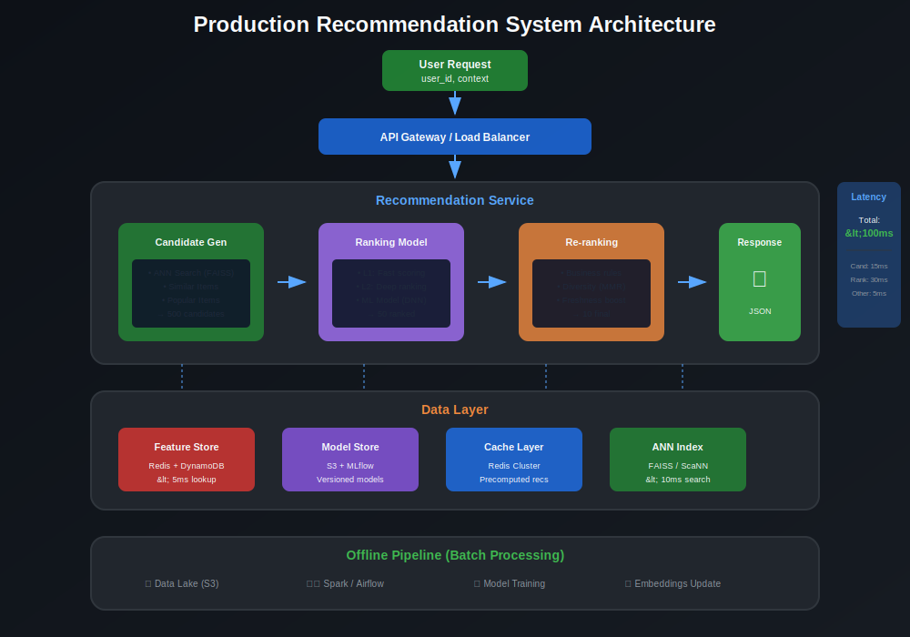
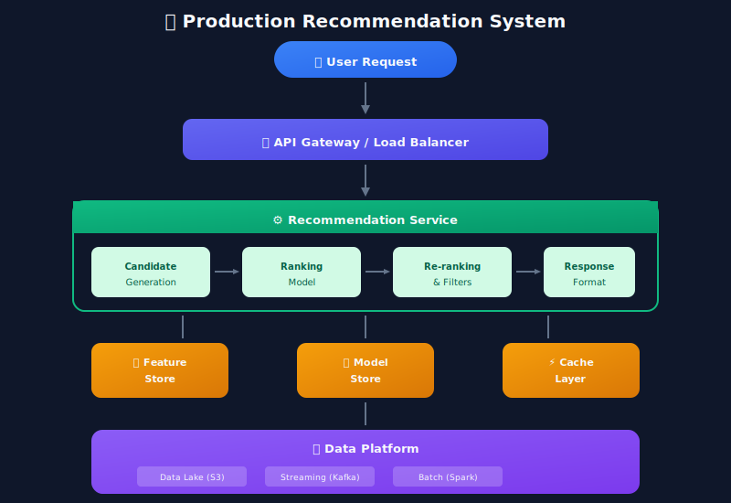
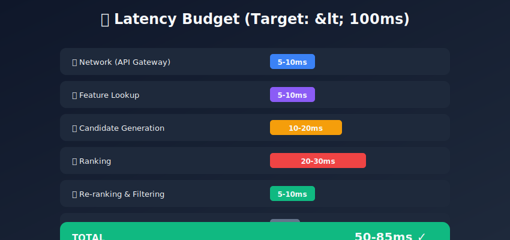
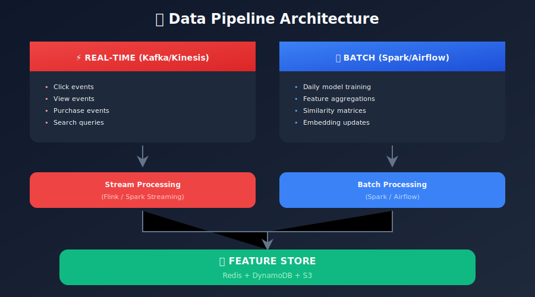
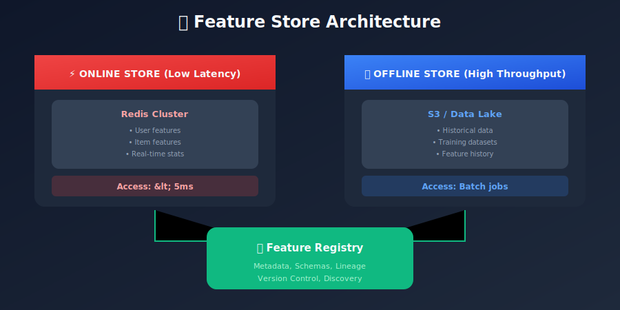
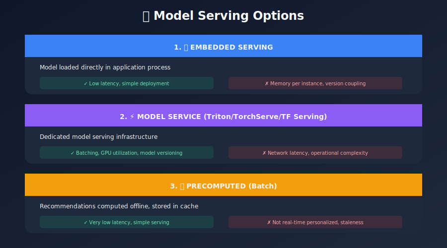
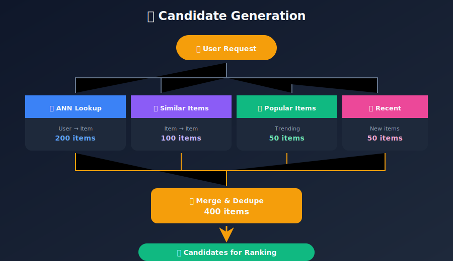
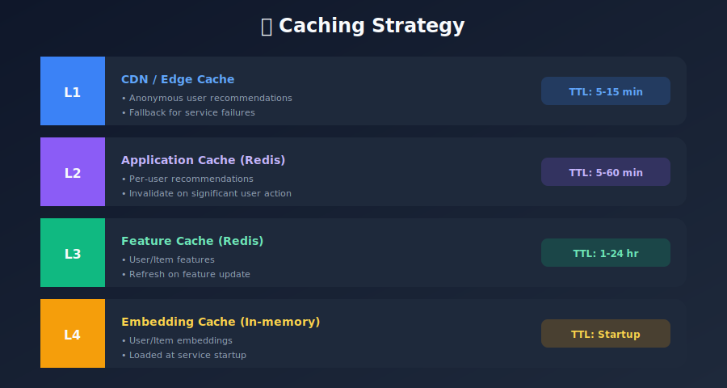
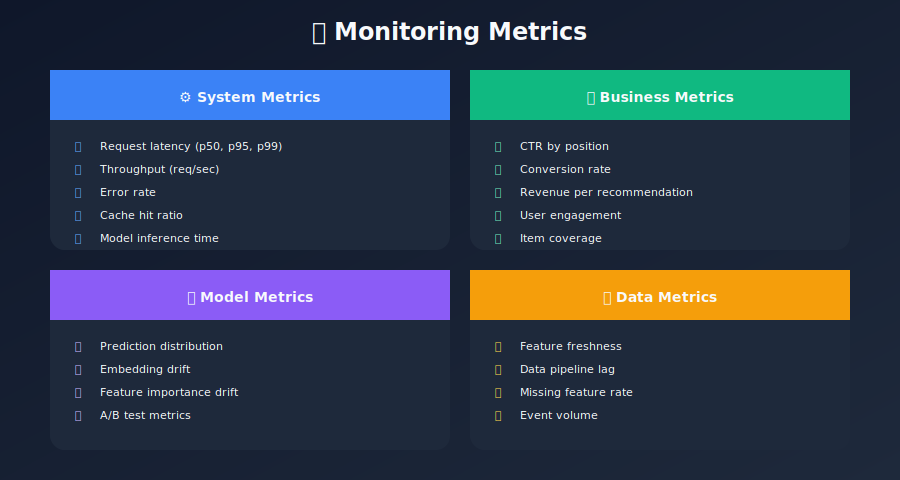
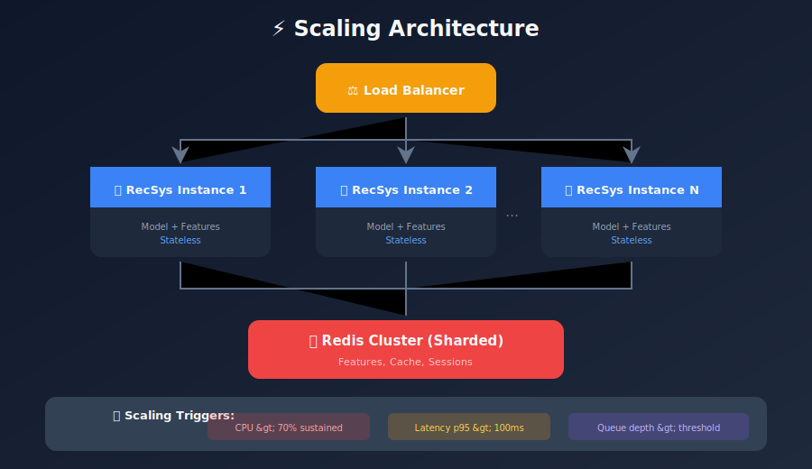

# System Architecture & Deployment

## Building Production-Ready Recommendation Systems

---

## 📊 Visual Overview



---

## 📖 Table of Contents

1. [System Overview](#system-overview)
2. [Data Pipeline](#data-pipeline)
3. [Feature Store](#feature-store)
4. [Model Serving](#model-serving)
5. [Candidate Generation](#candidate-generation)
6. [Ranking Layer](#ranking-layer)
7. [Caching Strategies](#caching-strategies)
8. [Monitoring & Observability](#monitoring-observability)
9. [Scaling Considerations](#scaling-considerations)

---

## System Overview

### High-Level Architecture



### Latency Budget



---

## Data Pipeline

### Batch + Streaming Architecture



### Event Schema

```python
# User Event Schema
class UserEvent:
    event_id: str
    user_id: str
    item_id: str
    event_type: str  # view, click, purchase, rate
    timestamp: datetime
    session_id: str
    context: dict  # device, location, etc.

# Example Kafka Producer
from kafka import KafkaProducer
import json

producer = KafkaProducer(
    bootstrap_servers=['localhost:9092'],
    value_serializer=lambda v: json.dumps(v).encode('utf-8')
)

def log_event(event: UserEvent):
    producer.send('user-events', value=event.__dict__)
```

---

## Feature Store

### Feature Store Architecture



### Feature Store Implementation

```python
import redis
import json
from typing import Dict, List

class FeatureStore:
    """Simple feature store with Redis backend."""

    def __init__(self, redis_host='localhost', redis_port=6379):
        self.redis = redis.Redis(host=redis_host, port=redis_port)

    def set_user_features(self, user_id: str, features: Dict):
        """Store user features."""
        key = f"user:{user_id}"
        self.redis.hset(key, mapping={
            k: json.dumps(v) for k, v in features.items()
        })
        self.redis.expire(key, 86400)  # 24 hour TTL

    def get_user_features(self, user_id: str) -> Dict:
        """Retrieve user features."""
        key = f"user:{user_id}"
        data = self.redis.hgetall(key)
        return {k.decode(): json.loads(v) for k, v in data.items()}

    def set_item_features(self, item_id: str, features: Dict):
        """Store item features."""
        key = f"item:{item_id}"
        self.redis.hset(key, mapping={
            k: json.dumps(v) for k, v in features.items()
        })

    def get_batch_features(self, entity_type: str, ids: List[str]) -> Dict:
        """Batch feature retrieval."""
        pipe = self.redis.pipeline()
        keys = [f"{entity_type}:{id}" for id in ids]

        for key in keys:
            pipe.hgetall(key)

        results = pipe.execute()
        return {
            ids[i]: {k.decode(): json.loads(v) for k, v in r.items()}
            for i, r in enumerate(results)
        }
```

---

## Model Serving

### Model Serving Options



### FastAPI Model Server

```python
from fastapi import FastAPI, HTTPException
from pydantic import BaseModel
import numpy as np
import torch

app = FastAPI()

# Load model
model = torch.jit.load("model.pt")
model.eval()

class RecommendationRequest(BaseModel):
    user_id: str
    n_recommendations: int = 10
    context: dict = {}

class RecommendationResponse(BaseModel):
    user_id: str
    recommendations: list
    metadata: dict

@app.post("/recommend", response_model=RecommendationResponse)
async def get_recommendations(request: RecommendationRequest):
    try:
        # Get user features
        user_features = feature_store.get_user_features(request.user_id)

        # Generate candidates
        candidates = candidate_generator.generate(
            request.user_id,
            n=500
        )

        # Score candidates
        with torch.no_grad():
            scores = model(
                user_features,
                [c['features'] for c in candidates]
            )

        # Sort and return top-N
        top_indices = torch.argsort(scores, descending=True)[:request.n_recommendations]
        recommendations = [candidates[i] for i in top_indices]

        return RecommendationResponse(
            user_id=request.user_id,
            recommendations=recommendations,
            metadata={'model_version': 'v2.1', 'strategy': 'personalized'}
        )

    except Exception as e:
        raise HTTPException(status_code=500, detail=str(e))
```

---

## Candidate Generation

### Multi-Source Candidate Generation



### ANN Index with FAISS

```python
import faiss
import numpy as np

class ANNCandidateGenerator:
    """
    Approximate Nearest Neighbor candidate generation using FAISS.
    """

    def __init__(self, embedding_dim: int, n_lists: int = 100):
        self.embedding_dim = embedding_dim

        # IVF index for fast approximate search
        quantizer = faiss.IndexFlatIP(embedding_dim)  # Inner product
        self.index = faiss.IndexIVFFlat(
            quantizer,
            embedding_dim,
            n_lists,
            faiss.METRIC_INNER_PRODUCT
        )

        self.item_ids = []

    def build_index(self, item_embeddings: np.ndarray, item_ids: list):
        """
        Build the ANN index from item embeddings.
        """
        # Normalize for cosine similarity via inner product
        faiss.normalize_L2(item_embeddings)

        # Train and add
        self.index.train(item_embeddings)
        self.index.add(item_embeddings)
        self.item_ids = item_ids

        # Set search parameters
        self.index.nprobe = 10  # Number of clusters to search

    def search(self, user_embedding: np.ndarray, k: int = 100) -> list:
        """
        Find k nearest items to user embedding.
        """
        # Normalize query
        user_embedding = user_embedding.reshape(1, -1).astype('float32')
        faiss.normalize_L2(user_embedding)

        # Search
        scores, indices = self.index.search(user_embedding, k)

        results = [
            {'item_id': self.item_ids[idx], 'score': float(score)}
            for idx, score in zip(indices[0], scores[0])
            if idx != -1
        ]

        return results
```

---

## Ranking Layer

### Multi-Stage Ranking

```python
class RankingPipeline:
    """
    Multi-stage ranking with L1 and L2 rankers.
    """

    def __init__(self, l1_model, l2_model, feature_store):
        self.l1_model = l1_model  # Fast, simple model
        self.l2_model = l2_model  # Slower, accurate model
        self.feature_store = feature_store

    def rank(self, user_id: str, candidates: list,
             n_final: int = 20) -> list:
        """
        Two-stage ranking pipeline.
        """
        # L1 Ranking (fast filtering)
        # Reduce 500 → 100
        l1_features = self._get_l1_features(user_id, candidates)
        l1_scores = self.l1_model.predict(l1_features)

        top_l1_indices = np.argsort(l1_scores)[-100:]
        l1_candidates = [candidates[i] for i in top_l1_indices]

        # L2 Ranking (accurate scoring)
        # Reduce 100 → 20
        l2_features = self._get_l2_features(user_id, l1_candidates)
        l2_scores = self.l2_model.predict(l2_features)

        top_l2_indices = np.argsort(l2_scores)[-n_final:]
        final_candidates = [
            {**l1_candidates[i], 'score': l2_scores[i]}
            for i in reversed(top_l2_indices)
        ]

        return final_candidates

    def _get_l1_features(self, user_id, candidates):
        """Light features for L1 ranking."""
        return [
            {
                'user_embed': self.feature_store.get_user_embedding(user_id),
                'item_embed': c['embedding'],
                'item_popularity': c['popularity'],
            }
            for c in candidates
        ]

    def _get_l2_features(self, user_id, candidates):
        """Rich features for L2 ranking."""
        user_features = self.feature_store.get_user_features(user_id)

        return [
            {
                **user_features,
                **self.feature_store.get_item_features(c['item_id']),
                'user_item_history': self._get_interaction_features(user_id, c['item_id']),
            }
            for c in candidates
        ]
```

---

## Caching Strategies

### Multi-Layer Caching



---

## Monitoring & Observability

### Key Metrics Dashboard



### Alerting Rules

```python
# Example Prometheus alerting rules
alert_rules = """
groups:
- name: recommendation-alerts
  rules:
  - alert: HighLatency
    expr: histogram_quantile(0.95, rate(recommendation_latency_seconds_bucket[5m])) > 0.2
    for: 5m
    labels:
      severity: warning
    annotations:
      summary: High recommendation latency

  - alert: LowCTR
    expr: rate(recommendation_clicks[1h]) / rate(recommendation_impressions[1h]) < 0.01
    for: 30m
    labels:
      severity: critical
    annotations:
      summary: Recommendation CTR dropped significantly

  - alert: ModelStaleness
    expr: (time() - model_last_update_timestamp) > 86400
    labels:
      severity: warning
    annotations:
      summary: Model not updated in 24 hours
"""
```

---

## Scaling Considerations

### Horizontal Scaling



---

## Summary

Building production recommendation systems requires careful attention to architecture, latency, scalability, and monitoring.

### Key Takeaways

1. **Multi-stage pipeline** - Candidate generation → Ranking → Re-ranking
2. **Feature stores** - Online + Offline for different use cases
3. **Caching** - Multiple layers with appropriate TTLs
4. **Monitoring** - System + Business + Model metrics
5. **Scalability** - Design for horizontal scaling from the start

---

## 🎬 Video Resources

### Recommended YouTube Videos

| Video | Channel | Duration |
|-------|---------|----------|
| [Design a Recommendation System](https://www.youtube.com/watch?v=QQaVDMPw3mo) | System Design Interview | 25 min |
| [Netflix System Design](https://www.youtube.com/watch?v=psQzyFfsUGU) | Gaurav Sen | 20 min |
| [ML System Design Interview](https://www.youtube.com/watch?v=lBRQXwmZ5tQ) | ByteByteGo | 15 min |
| [Feature Stores Explained](https://www.youtube.com/watch?v=YMxU1X-TQrU) | Tecton | 30 min |
| [Scaling RecSys at Pinterest](https://www.youtube.com/watch?v=4NDp2P2a17s) | Strange Loop | 40 min |
| [FAISS: Billion-Scale Similarity](https://www.youtube.com/watch?v=sKyvsdEv6rk) | Meta AI | 35 min |

### System Design Channels
- **[System Design Interview](https://www.youtube.com/@SystemDesignInterview)** - ML systems
- **[ByteByteGo](https://www.youtube.com/@ByteByteGo)** - Scalable architectures
- **[Gaurav Sen](https://www.youtube.com/@gaborsen)** - HLD concepts
- **[Hussein Nasser](https://www.youtube.com/@haborsen)** - Backend deep dives

### MLOps & Production
- **[MLOps Community](https://www.youtube.com/@MLOps)** - Production ML
- **[Weights & Biases](https://www.youtube.com/@WeightsBiases)** - Experiment tracking
- **[Databricks](https://www.youtube.com/@Databricks)** - Spark, MLflow

### Cloud Platforms
- **[AWS re:Invent](https://www.youtube.com/@AWSEventsChannel)** - Amazon Personalize talks
- **[Google Cloud Tech](https://www.youtube.com/@googlecloudtech)** - Vertex AI, Recommendations AI

---

## Next Steps

Continue to: [Real-World Case Studies](../09_case_studies/README.md)

---

*Last Updated: January 2026*
*Author: ML System Design Study Group*

---

<div align="center">

**[⬆ Back to Top](#)** | **[📚 Main Repository](https://github.com/Gaurav14cs17/ml_system_design)**

Made with 💜 by [Gaurav14cs17](https://github.com/Gaurav14cs17)

</div>
