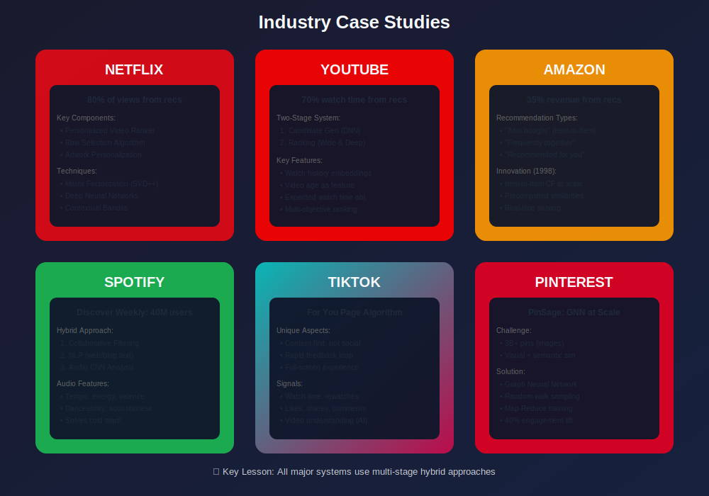
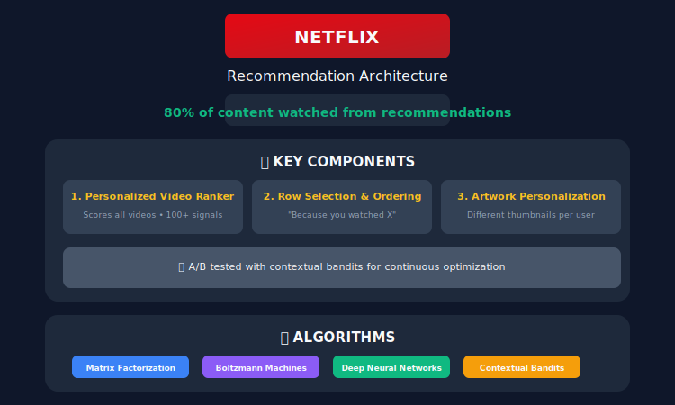
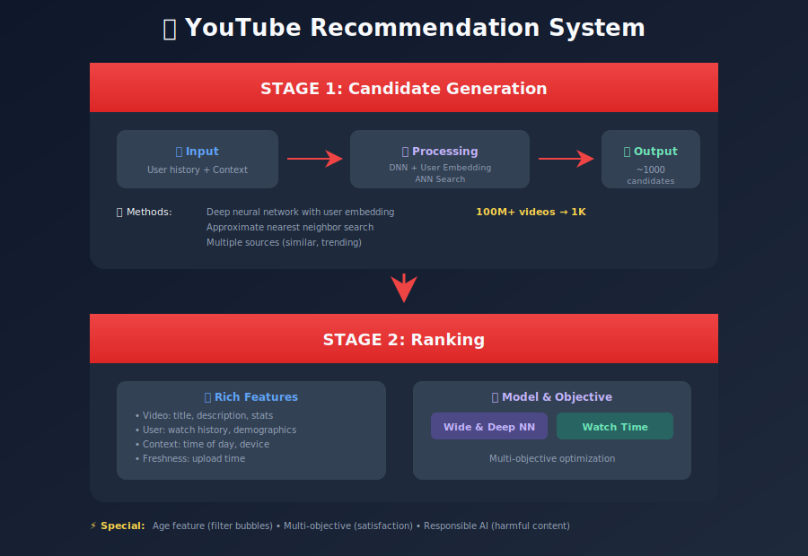
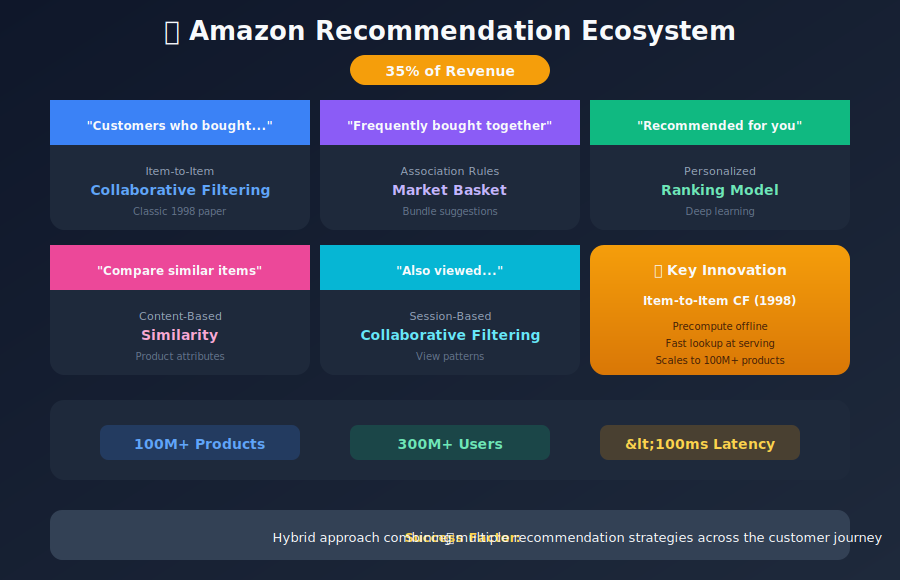
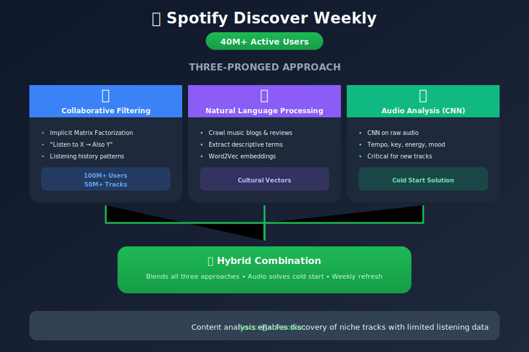
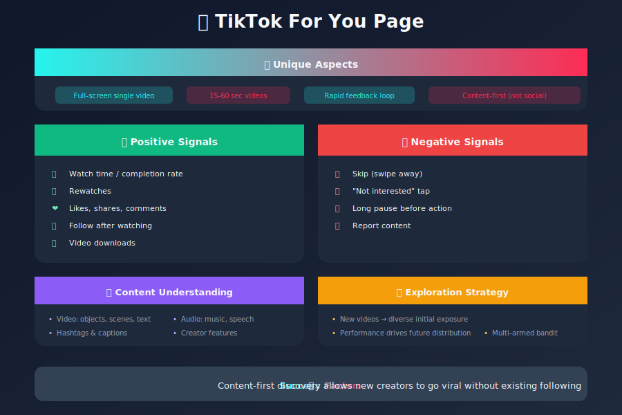
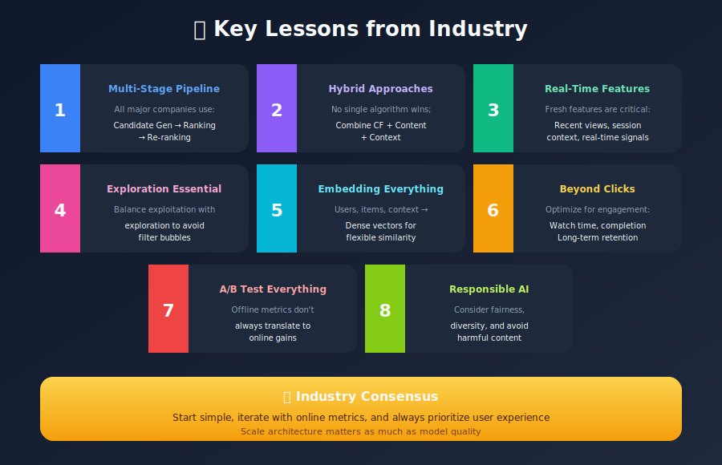

# Real-World Case Studies

## How Top Companies Build Recommendation Systems

---

## 📊 Visual Overview



---

## 📖 Table of Contents

1. [Netflix](#netflix)
2. [YouTube](#youtube)
3. [Amazon](#amazon)
4. [Spotify](#spotify)
5. [TikTok](#tiktok)
6. [Pinterest](#pinterest)
7. [Key Lessons](#key-lessons)

---

## Netflix

### System Overview



### Key Innovations

| Innovation | Description |
|------------|-------------|
| **Artwork Personalization** | Show different thumbnails based on user taste |
| **Row-based Recommendations** | Organize by themes like "Because you watched..." |
| **Contextual Bandits** | Balance exploration vs exploitation |
| **Two-Phase Ranking** | Candidate generation + Ranking |

### Metrics Focus

- **Take Rate**: % of users who play after viewing
- **Completion Rate**: % of content watched
- **Quality Plays**: Filtering out accidental plays
- **Retention**: Long-term user engagement

---

## YouTube

### Two-Stage Architecture



### Training Insights

```python

# YouTube's key training decisions:

# 1. Weighted logistic regression objective
# Weight by watch time, not just clicks
def weighted_loss(predictions, labels, watch_time):
    return -sum(watch_time * labels * log(predictions))

# 2. Example age as feature
# Helps model learn freshness patterns
features['video_age_at_impression'] = impression_time - upload_time

# 3. Negative sampling from impressions
# Use unclicked videos as negatives
negatives = [v for v in impressed_videos if not clicked(v)]
```

---

## Amazon

### Personalization Flywheel



### Item-to-Item Algorithm

```python

# Amazon's Original Algorithm (simplified)

class AmazonItemToItem:
    def __init__(self):
        self.item_similarities = {}

    def compute_similarities(self, purchases):
        """
        For each pair of items, compute similarity based on
        co-purchase patterns.
        """

        # Count co-purchases
        cooccurrence = defaultdict(lambda: defaultdict(int))
        item_counts = defaultdict(int)

        for user, items in purchases.items():
            for item in items:
                item_counts[item] += 1
                for other in items:
                    if item != other:
                        cooccurrence[item][other] += 1

        # Compute cosine similarity
        for item1 in cooccurrence:
            self.item_similarities[item1] = {}
            for item2, co_count in cooccurrence[item1].items():
                sim = co_count / sqrt(item_counts[item1] * item_counts[item2])
                self.item_similarities[item1][item2] = sim

    def recommend(self, user_items, n=10):
        """
        Given items user has purchased, find similar items.
        """
        scores = defaultdict(float)

        for item in user_items:
            for similar_item, score in self.item_similarities.get(item, {}).items():
                if similar_item not in user_items:
                    scores[similar_item] += score

        return sorted(scores.items(), key=lambda x: x[1], reverse=True)[:n]
```

---

## Spotify

### Discover Weekly Magic



### Audio Feature Extraction

```python

# Spotify's audio analysis approach (simplified)

class AudioFeatureExtractor:
    """CNN for audio feature extraction."""

    def __init__(self):
        self.model = nn.Sequential(

            # Mel spectrogram input
            nn.Conv2d(1, 64, kernel_size=3, padding=1),
            nn.ReLU(),
            nn.MaxPool2d(2),

            nn.Conv2d(64, 128, kernel_size=3, padding=1),
            nn.ReLU(),
            nn.MaxPool2d(2),

            nn.Conv2d(128, 256, kernel_size=3, padding=1),
            nn.ReLU(),
            nn.AdaptiveAvgPool2d((1, 1)),

            nn.Flatten(),
            nn.Linear(256, 128),  # Audio embedding
        )

    def extract_features(self, audio_path):

        # Load audio and compute mel spectrogram
        y, sr = librosa.load(audio_path)
        mel = librosa.feature.melspectrogram(y=y, sr=sr)
        mel_db = librosa.power_to_db(mel)

        # Extract features
        mel_tensor = torch.tensor(mel_db).unsqueeze(0).unsqueeze(0)
        features = self.model(mel_tensor)

        return features.detach().numpy()
```

---

## TikTok

### For You Page Algorithm



### Key Design Decisions

1. **Content-First**: New users get recommendations immediately based on content, not social graph
2. **Rapid Adaptation**: Algorithm adjusts within minutes based on user behavior
3. **Creator Diversity**: Prevents monopolization by big creators
4. **Fresh Content Bias**: Strongly favors new content

---

## Pinterest

### PinSage: Graph Neural Networks at Scale


---

## Key Lessons

### Common Patterns Across Companies



### Architecture Comparison

| Company | Candidate Gen | Ranking | Special Feature |
|---------|--------------|---------|-----------------|
| Netflix | MF + DNN | Deep ranking | Artwork personalization |
| YouTube | Two-tower DNN | Wide & Deep | Watch time optimization |
| Amazon | Item-to-Item CF | Personalized | Co-purchase patterns |
| Spotify | Hybrid (CF+Audio) | Personalized | Audio CNN |
| TikTok | Content + CF | Multi-signal | Rapid adaptation |
| Pinterest | PinSage GNN | Visual similarity | Graph neural networks |

---

## Summary

Real-world recommendation systems share common patterns but are tailored to specific domains and user behaviors. The key is understanding your unique context and iterating based on data.

### Key Takeaways

1. **Start simple** - Item-to-item CF still works great
2. **Add complexity incrementally** - Deep learning isn't always needed
3. **Measure what matters** - Clicks ≠ satisfaction
4. **Invest in infrastructure** - Fast serving enables experimentation
5. **Never stop iterating** - A/B testing is continuous

---

## 🎬 Video Resources

### Industry Case Study Videos

| Video | Company | Duration |
|-------|---------|----------|
| [Netflix Recommendations Deep Dive](https://www.youtube.com/watch?v=f8OK1HBEgn0) | Netflix TechBlog | 45 min |
| [Spotify's Discover Weekly](https://www.youtube.com/watch?v=0jspaMLxBig) | Spotify Engineering | 35 min |
| [Pinterest's Visual Search](https://www.youtube.com/watch?v=jmPPMxsRKX8) | Pinterest Engineering | 30 min |
| [TikTok Algorithm Explained](https://www.youtube.com/watch?v=nfczi2cI6Cs) | Wall Street Journal | 12 min |
| [Amazon's Recommendation Engine](https://www.youtube.com/watch?v=5aMIr2HdSbE) | AWS re:Invent | 50 min |
| [Airbnb Search Ranking](https://www.youtube.com/watch?v=tPb2u9kwh2w) | Airbnb Engineering | 40 min |
| [Uber's ML Platform](https://www.youtube.com/watch?v=qLwl2-5z5AA) | Uber Engineering | 35 min |
| [LinkedIn's Feed Ranking](https://www.youtube.com/watch?v=CnL_YNbxM3s) | LinkedIn Engineering | 30 min |
| [Twitter's Recommendation Algorithm](https://www.youtube.com/watch?v=dZHVe4FVBSU) | Twitter Engineering | 25 min |

### Engineering Blog Videos
- **[Netflix Tech Blog](https://www.youtube.com/@NetflixEngineering)** - Engineering talks
- **[Spotify Engineering](https://www.youtube.com/@SpotifyEngineering)** - Music ML
- **[Meta AI](https://www.youtube.com/@MetaAI)** - Facebook/Instagram recommendations
- **[Google AI](https://www.youtube.com/@GoogleAI)** - YouTube, Search recommendations

### Conference Recordings
- **[ACM RecSys Conference](https://www.youtube.com/@acmrecsys)** - Annual conference talks
- **[KDD Conference](https://www.youtube.com/@acmsigkdd)** - Industry day presentations
- **[NeurIPS](https://www.youtube.com/@NeurIPS)** - Research presentations
- **[ICML](https://www.youtube.com/@ICABORL)** - ML research talks

### Podcasts (Video)
- **[Lex Fridman Podcast](https://www.youtube.com/@lexfridman)** - AI researcher interviews
- **[Machine Learning Street Talk](https://www.youtube.com/@MLST)** - Research discussions
- **[Practical AI](https://www.youtube.com/@practicalai)** - Applied ML interviews

---

## Course Complete! 🎉

Congratulations on completing this comprehensive guide to Recommendation Systems!

### Review the Modules

1. [Introduction](../01_introduction/README.md)
2. [Content-Based Filtering](../02_content_based_filtering/README.md)
3. [Collaborative Filtering](../03_collaborative_filtering/README.md)
4. [Hybrid Systems](../04_hybrid_systems/README.md)
5. [Feature Engineering](../05_feature_engineering/README.md)
6. [Model Training & Evaluation](../06_model_training_evaluation/README.md)
7. [Deep Learning](../07_deep_learning/README.md)
8. [System Architecture](../08_system_architecture/README.md)
9. [Case Studies](../09_case_studies/README.md) (You are here!)

---

*Last Updated: January 2026*
*Author: ML System Design Study Group*

---

<div align="center">

**[⬆ Back to Top](#)** | **[📚 Main Repository](https://github.com/Gaurav14cs17/ml_system_design)**

Made with 💜 by [Gaurav14cs17](https://github.com/Gaurav14cs17)

</div>
