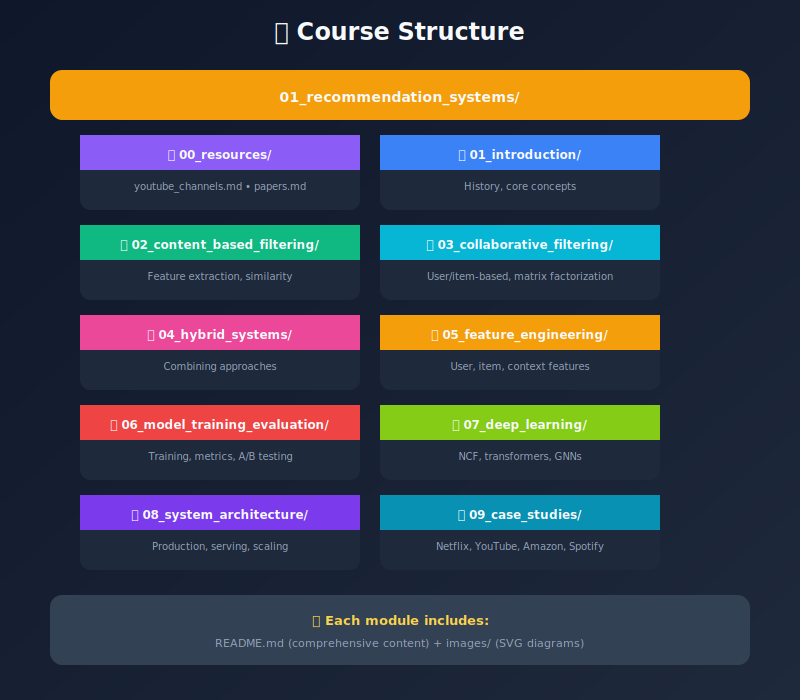
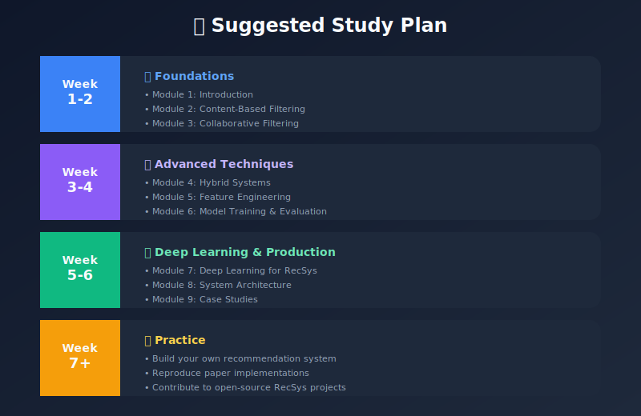

# Recommendation Systems - Complete Study Guide

## A Comprehensive Course on Building Modern Recommendation Engines

---

## 📚 Course Overview

This course provides an in-depth exploration of recommendation systems, from foundational concepts to production-scale implementations. Each module contains detailed explanations, code examples, diagrams, and real-world insights.

---

## 🗂️ Course Structure

---

## 📖 Module Summaries

### [1. Introduction to Recommendation Systems](./01_introduction/README.md)

- What are recommendation systems and why they matter

- Historical evolution from Tapestry to modern transformers

- Core components and system architecture overview

- Types of recommendation approaches

- Key challenges (cold start, scalability, filter bubbles)

- Industry applications and metrics

### [2. Content-Based Filtering](./02_content_based_filtering/README.md)

- Feature extraction from text, images, and metadata

- TF-IDF, word embeddings, and deep features

- Similarity metrics (cosine, Jaccard, Euclidean)

- Building and updating user profiles

- Complete Python implementation

- Pros, cons, and mitigation strategies

### [3. Collaborative Filtering](./03_collaborative_filtering/README.md)

- User-based vs item-based approaches

- Similarity computation methods

- Matrix factorization (SVD, ALS)

- Memory-based vs model-based methods

- Handling sparsity and scalability

- Production implementations

### [4. Hybrid Recommendation Systems](./04_hybrid_systems/README.md)

- Why combine multiple approaches

- Hybridization strategies (weighted, switching, cascade, meta)

- Netflix, YouTube, Spotify architectures

- Implementation patterns

- Handling cold start with hybrids

### [5. Feature Engineering](./05_feature_engineering/README.md)

- User features (demographics, behavioral, preferences)

- Item features (content, popularity, quality signals)

- Interaction features (history, session, context)

- Feature encoding techniques

- Embeddings and representation learning

- Feature selection and importance

### [6. Model Training & Evaluation](./06_model_training_evaluation/README.md)

- Training strategies (pointwise, pairwise, listwise)

- Loss functions for rating and ranking

- Offline metrics (Precision, Recall, NDCG, MRR)

- Beyond-accuracy metrics (coverage, diversity, novelty)

- Online evaluation and A/B testing

- Cross-validation strategies for RecSys

- Hyperparameter tuning

### [7. Deep Learning for Recommendations](./07_deep_learning/README.md)

- Neural Collaborative Filtering (NCF)

- Sequence models (GRU4Rec, SASRec)

- Attention mechanisms and transformers

- Two-tower architecture for retrieval

- Graph neural networks (LightGCN, PinSage)

- BERT4Rec and transformer-based models

### [8. System Architecture & Deployment](./08_system_architecture/README.md)

- Production architecture patterns

- Data pipelines (batch + streaming)

- Feature stores and model serving

- Candidate generation at scale (FAISS, ANN)

- Multi-stage ranking pipelines

- Caching strategies

- Monitoring and observability

- Scaling considerations

### [9. Real-World Case Studies](./09_case_studies/README.md)

- Netflix: Personalized video ranking and artwork

- YouTube: Two-stage deep learning system

- Amazon: Item-to-item collaborative filtering

- Spotify: Discover Weekly hybrid approach

- TikTok: Content-first For You Page

- Pinterest: PinSage graph neural networks

- Key lessons and common patterns

---

## 🎯 Learning Objectives

By completing this course, you will be able to:

1. **Understand** the fundamentals of recommendation systems
2. **Implement** content-based and collaborative filtering from scratch
3. **Design** hybrid systems that combine multiple approaches
4. **Engineer** features for recommendation models
5. **Train and evaluate** models with appropriate metrics
6. **Apply** deep learning techniques for modern RecSys
7. **Architect** production-scale recommendation systems
8. **Learn from** real-world case studies at top companies

---

## 🛠️ Technologies Covered

| Category | Technologies |
|----------|--------------|
| **Languages** | Python |
| **ML Frameworks** | PyTorch, TensorFlow, scikit-learn |
| **Deep Learning** | Transformers, GNNs, Attention |
| **Similarity Search** | FAISS, Annoy, ScaNN |
| **Data Processing** | Pandas, NumPy, Spark |
| **Serving** | FastAPI, TorchServe, Redis |
| **Infrastructure** | Kafka, Airflow, Kubernetes |

---

## 📈 Recommended Learning Path

---

## 📚 Additional Resources

👉 **[Complete YouTube Channels Guide](./00_resources/youtube_channels.md)** - 50+ channels & playlists

👉 **[Essential Research Papers](./00_resources/papers.md)** - Must-read papers with links

### 🎬 Top YouTube Channels

| Category | Channels |
|----------|----------|
| **Theory & Math** | 3Blue1Brown, StatQuest, MIT OCW |
| **ML Fundamentals** | Stanford Online, Andrew Ng, Sentdex |
| **Deep Learning** | Andrej Karpathy, Yannic Kilcher, Two Minute Papers |
| **System Design** | System Design Interview, ByteByteGo, Gaurav Sen |
| **Industry Insights** | Netflix Engineering, Spotify, Amazon Science |
| **Research** | ACM RecSys, Weights & Biases, DeepMind |

### 📖 Books

- "Recommender Systems Handbook" - Ricci et al.

- "Practical Recommender Systems" - Kim Falk

- "Deep Learning for Recommender Systems" - Zhang et al.

### 📄 Top Papers

- [Matrix Factorization Techniques for Recommender Systems](https://datajobs.com/data-science-repo/Recommender-Systems-[Netflix].pdf)

- [Deep Neural Networks for YouTube Recommendations](https://research.google/pubs/pub45530/)

- [Wide & Deep Learning for Recommender Systems](https://arxiv.org/abs/1606.07792)

- [BERT4Rec: Sequential Recommendation with BERT](https://arxiv.org/abs/1904.06690)

- [LightGCN: Simplifying and Powering GCN for Recommendation](https://arxiv.org/abs/2002.02126)

### 🎓 Online Courses

- Stanford CS246: Mining Massive Data Sets

- Coursera: Recommender Systems Specialization

- Fast.ai: Practical Deep Learning for Coders

- Google ML Crash Course: Recommendation Systems

### 🛠️ Open-Source Libraries

- [Surprise](https://surpriselib.com/) - Simple Python library

- [LensKit](https://lenskit.org/) - Research toolkit

- [RecBole](https://recbole.io/) - Unified framework

- [Microsoft Recommenders](https://github.com/microsoft/recommenders)

---

## 🚀 Getting Started

1. Start with [Module 1: Introduction](./01_introduction/README.md)
2. Follow the modules in order
3. Run the code examples in each module
4. Complete the exercises at the end of each section
5. Build a project applying what you've learned

---

## 📝 Notes

- Each module is self-contained but builds on previous concepts

- Code examples are in Python with PyTorch

- **96 SVG diagrams** for visual understanding

- Real-world examples from FAANG companies included

## 🖼️ Visual Content

Each module includes professional SVG diagrams:

| Module | Diagram Count | Key Visuals |
|--------|---------------|-------------|
| Resources | 4 | YouTube Channels, Conference Talks |
| Introduction | 12 | RecSys Overview, Types, Timeline, Challenges |
| Content-Based | 16 | Pipeline, TF-IDF, Similarity, Architecture |
| Collaborative | 15 | User/Item CF, Matrix Factorization, Scalability |
| Hybrid | 14 | Strategies, Netflix/YouTube/Spotify Systems |
| Feature Engineering | 4 | Feature Types, Pipeline, Best Practices |
| Training & Evaluation | 4 | Metrics, A/B Testing, Hyperparameters |
| Deep Learning | 7 | NCF, GRU4Rec, SASRec, Two-Tower, GNN |
| System Architecture | 10 | Production Pipeline, Caching, Monitoring |
| Case Studies | 8 | Netflix, YouTube, Amazon, Spotify, TikTok, Pinterest |

---

## 🤝 Contributing

Found an error or want to add content? Feel free to:

- Open an issue

- Submit a pull request

- Share feedback

---

**Happy Learning! 🎓**

---

**Total: 96 professional SVG diagrams across all modules!**

---

*Last Updated: January 2026*
*Author: ML System Design Study Group*

---

**[⬆ Back to Top](#)** | **[📚 Main Repository](https://github.com/Gaurav14cs17/ml_system_design)**

Made with 💜 by [Gaurav14cs17](https://github.com/Gaurav14cs17)

