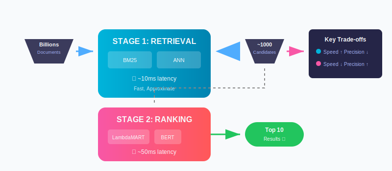
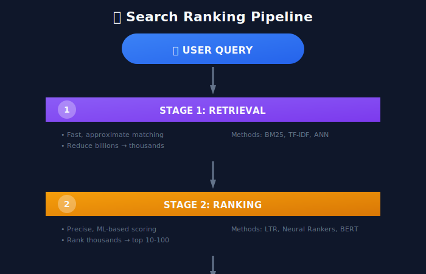
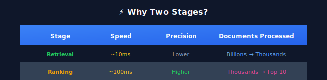
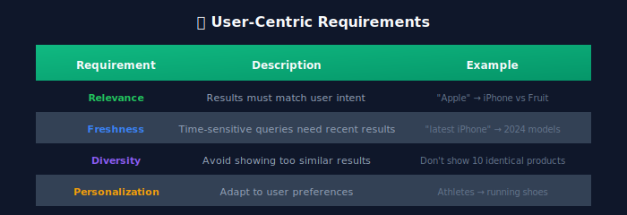
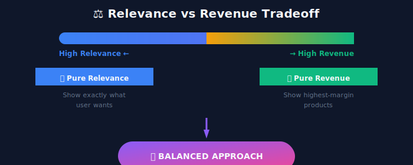
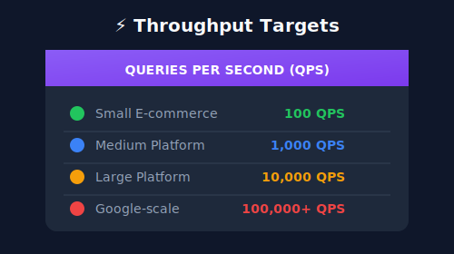
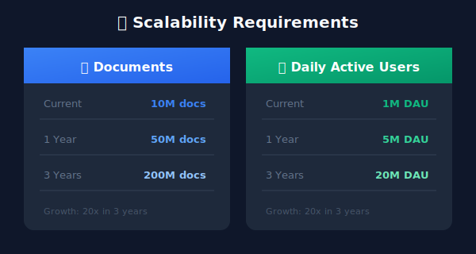
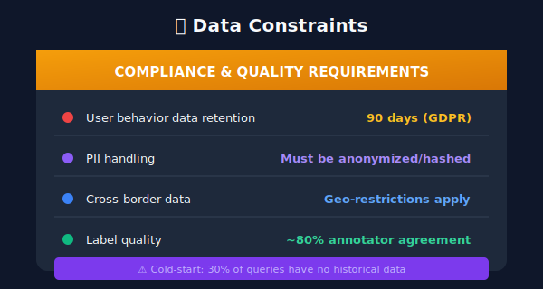

# Search Ranking: Problem Definition & Requirements

## 📋 Table of Contents

1. [Introduction](#introduction)

2. [What is Search Ranking?](#what-is-search-ranking)

3. [Business Requirements](#business-requirements)

4. [Technical Requirements](#technical-requirements)

5. [System Constraints](#system-constraints)

6. [Success Metrics](#success-metrics)

7. [Real-World Case Studies](#real-world-case-studies)

---

<p align="center">
  
</p>

---

## Introduction

Search ranking is one of the most critical components in any information retrieval system. Whether it's Google, Amazon, Netflix, or LinkedIn, the ability to return relevant results in the right order directly impacts user satisfaction and business success.

This guide provides a comprehensive deep-dive into designing search ranking systems from an ML perspective, covering everything from problem formulation to production deployment.

---

## What is Search Ranking?

### The Core Problem

Search ranking is the task of **ordering a set of documents (or items) by their relevance to a user's query**.

```
User Query: "best running shoes for marathon"
    ↓
Search System
    ↓
Ranked Results:

1. Nike Vaporfly Next% 2 (Most Relevant)

2. Adidas Adizero Pro

3. Saucony Endorphin Pro 3
4. ...

```

### The Two-Stage Architecture

Modern search systems typically follow a **two-stage architecture**:



### Why Two Stages?



**The key insight**: We can't run expensive ML models on billions of documents, so we use fast retrieval to get candidates, then apply precise ranking.

---

## Business Requirements

### 1. User-Centric Requirements



### 2. Business-Centric Requirements

```python
# Key Business Metrics
business_requirements = {
    "conversion_rate": "% of searches leading to purchase/click",
    "revenue_per_search": "Average revenue generated per search",
    "engagement": "Time spent, pages viewed after search",
    "retention": "Users returning to search again",
    "advertiser_satisfaction": "For ad-supported search"
}

```

### 3. The Relevance vs. Revenue Trade-off



---

## Technical Requirements

### Latency Requirements

```python
latency_requirements = {
    "p50": "< 100ms",   # 50th percentile
    "p90": "< 200ms",   # 90th percentile
    "p99": "< 500ms",   # 99th percentile
    "p99.9": "< 1000ms" # 99.9th percentile
}

```

**Why latency matters**:

- Every 100ms delay = 1% decrease in conversions (Amazon study)

- Users expect results in < 200ms

### Throughput Requirements



### Availability Requirements

```python
availability_requirements = {
    "target": "99.99%",  # "Four nines"
    "max_downtime_per_year": "52.6 minutes",
    "failover_time": "< 30 seconds",
    "data_consistency": "Eventually consistent (acceptable)"
}

```

### Scalability Requirements



---

## System Constraints

### Infrastructure Constraints

```yaml
infrastructure:
  compute:
    cpu_cores: 10,000
    gpu_count: 100 (for training)
    memory_per_node: 256GB

  storage:
    document_index: 50TB
    feature_store: 10TB
    model_artifacts: 1TB

  network:
    inter_datacenter_latency: 50ms
    intra_datacenter_latency: 1ms

```

### Cost Constraints

```python
cost_model = {
    "infrastructure": {
        "compute": "$100K/month",
        "storage": "$20K/month",
        "network": "$10K/month"
    },
    "ml_specific": {
        "training": "$50K/month (GPU hours)",
        "inference": "$30K/month",
        "feature_store": "$15K/month"
    },
    "total_budget": "$225K/month"
}

```

### Data Constraints



---

## Success Metrics

### Online Metrics (Production)

```python
online_metrics = {
    # Engagement Metrics
    "CTR": "Click-Through Rate = Clicks / Impressions",
    "Position_CTR": "CTR at each position",
    "Successful_Searches": "Searches with at least 1 click",

    # Relevance Metrics
    "Abandonment_Rate": "% searches with no clicks",
    "Reformulation_Rate": "% queries that are reformulated",
    "Dwell_Time": "Time spent on clicked result",

    # Business Metrics
    "Conversion_Rate": "% searches leading to conversion",
    "Revenue_per_Search": "Total revenue / Total searches",
    "GMV": "Gross Merchandise Value from search"
}

```

### Offline Metrics (Evaluation)

```python
offline_metrics = {
    # Ranking Quality
    "NDCG": "Normalized Discounted Cumulative Gain",
    "MAP": "Mean Average Precision",
    "MRR": "Mean Reciprocal Rank",

    # Classification Metrics (for binary relevance)
    "Precision@K": "Relevant docs in top K / K",
    "Recall@K": "Relevant docs in top K / Total relevant"
}

```

### NDCG Deep Dive

```
NDCG (Normalized Discounted Cumulative Gain):

DCG@k = Σ(i=1 to k) [relevance(i) / log2(i+1)]

NDCG@k = DCG@k / IDCG@k

Where IDCG = DCG of perfect ranking

Example:
Ranking: [3, 2, 3, 0, 1] (relevance scores)
DCG@5 = 3/1 + 2/1.58 + 3/2 + 0/2.32 + 1/2.58 = 7.14
IDCG@5 = 3/1 + 3/1.58 + 2/2 + 1/2.32 + 0/2.58 = 6.33
NDCG@5 = 7.14 / 7.14 = 1.0 (if this was perfect)

```

---

## Real-World Case Studies

### Case Study 1: E-commerce Search (Amazon-style)

```yaml
problem:
  domain: "Product search for online retail"
  scale:
    products: 500M+
    queries_per_day: 500M+
    users: 300M+

challenges:
  - Query-product vocabulary gap ("sneakers" vs "athletic footwear")
  - Long-tail queries (80% of queries seen < 10 times)
  - Seasonality (Black Friday, Christmas)
  - Inventory changes (products go in/out of stock)

solution_approach:
  retrieval:
    - Semantic embeddings (BERT-based)
    - Behavioral signals (past purchases)
  ranking:
    - GBDT with 500+ features
    - Real-time personalization
    - Business rule integration (boosting featured products)

```

### Case Study 2: Web Search (Google-style)

```yaml
problem:
  domain: "General web search"
  scale:
    web_pages: 100B+
    queries_per_day: 8.5B
    languages: 100+

challenges:
  - Spam and SEO manipulation
  - Fresh content (news, events)
  - Diverse intents (navigational, informational, transactional)
  - Multi-modal content (text, images, videos)

solution_approach:
  retrieval:
    - PageRank + BM25
    - Neural retrieval (dual encoders)
  ranking:
    - Deep learning (Transformer-based)
    - Real-time signals
    - Multi-objective optimization

```

### Case Study 3: Job Search (LinkedIn-style)

```yaml
problem:
  domain: "Job matching for professionals"
  scale:
    jobs: 20M+
    members: 900M+
    applications_per_day: 10M+

challenges:
  - Two-sided matching (candidate + recruiter satisfaction)
  - Location sensitivity
  - Skills matching (implicit and explicit)
  - Recency (job expires, gets filled)

solution_approach:
  retrieval:
    - Skills-based matching
    - Location filtering
  ranking:
    - XGBoost with personalization
    - Multi-task learning (apply + recruiter response)

```

---

## Key Takeaways

1. **Two-Stage Architecture**: Retrieval (fast, approximate) → Ranking (slow, precise)

2. **Balance Trade-offs**: Relevance vs. Revenue, Latency vs. Quality

3. **Metrics Matter**: Choose metrics that align with business goals

4. **Scale Planning**: Design for 10x current scale from day one

5. **Constraints Drive Design**: Latency, cost, and data constraints shape the system

---

## Next Steps

Continue to the next sections:

- [02_query_understanding](../02_query_understanding/README.md) - Understanding user intent

- [03_document_understanding](../03_document_understanding/README.md) - Processing documents for ranking

---

*Last Updated: January 2026*

---

<div align="center">

**[⬆ Back to Top](#)** | **[📚 Main Repository](https://github.com/Gaurav14cs17/ml_system_design)**

Made with 💜 by [Gaurav14cs17](https://github.com/Gaurav14cs17)

</div>
