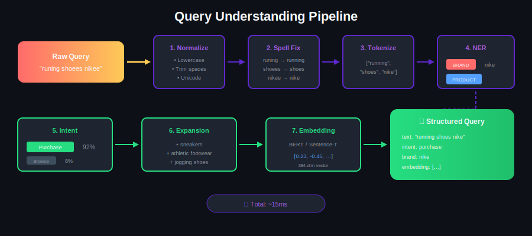
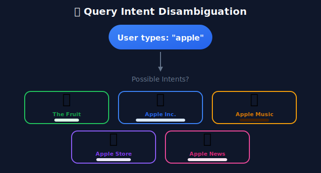
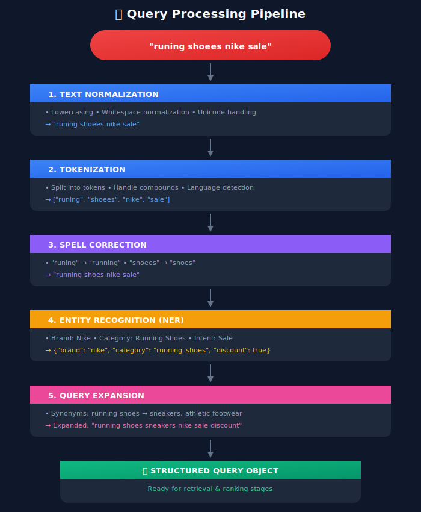
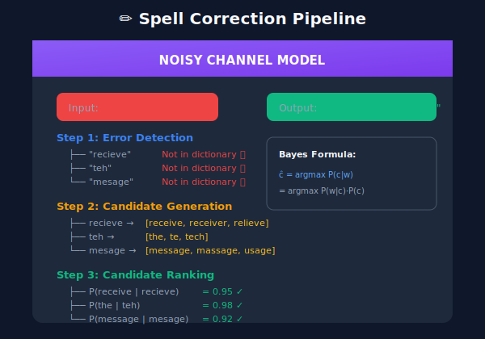

# Query Understanding: Decoding User Intent

## 📋 Table of Contents

1. [Introduction](#introduction)

2. [Query Analysis Pipeline](#query-analysis-pipeline)

3. [Query Classification](#query-classification)

4. [Query Rewriting & Expansion](#query-rewriting-expansion)

5. [Spell Correction](#spell-correction)

6. [Named Entity Recognition](#named-entity-recognition)

7. [Semantic Understanding](#semantic-understanding)

8. [Implementation Deep Dive](#implementation-deep-dive)

9. [Real-World Challenges](#real-world-challenges)

---

<p align="center">
  
</p>

---

## Introduction

Query understanding is the first and most critical step in the search ranking pipeline. A user types a few words, but behind those words lies complex intent, context, and expectations.



---

## Query Analysis Pipeline

### Complete Pipeline Architecture



---

## Query Classification

### Intent Taxonomy

```python
query_intents = {
    "navigational": {
        "description": "User wants a specific website/page",
        "examples": ["facebook login", "amazon", "gmail"],
        "signals": ["brand names", "website names", "login/signin"],
        "action": "Direct to the target page"
    },

    "informational": {
        "description": "User wants to learn something",
        "examples": ["how to tie a tie", "python tutorial", "weather today"],
        "signals": ["how", "what", "why", "when", "tutorial", "guide"],
        "action": "Show educational content"
    },

    "transactional": {
        "description": "User wants to perform an action",
        "examples": ["buy iphone 15", "download spotify", "book flight"],
        "signals": ["buy", "purchase", "download", "book", "order"],
        "action": "Show products/services with clear CTA"
    },

    "commercial": {
        "description": "User is researching before purchase",
        "examples": ["best laptops 2024", "iphone vs samsung", "nike reviews"],
        "signals": ["best", "top", "review", "vs", "compare"],
        "action": "Show comparisons and reviews"
    }
}

```

### Intent Classification Model

```python
import torch
import torch.nn as nn
from transformers import BertModel, BertTokenizer

class QueryIntentClassifier(nn.Module):
    """
    BERT-based query intent classifier
    """
    def __init__(self, num_intents=4, dropout=0.1):
        super().__init__()
        self.bert = BertModel.from_pretrained('bert-base-uncased')
        self.dropout = nn.Dropout(dropout)
        self.classifier = nn.Linear(768, num_intents)

    def forward(self, input_ids, attention_mask):
        # Get BERT embeddings
        outputs = self.bert(
            input_ids=input_ids,
            attention_mask=attention_mask
        )

        # Use [CLS] token representation
        cls_embedding = outputs.last_hidden_state[:, 0, :]

        # Classify
        x = self.dropout(cls_embedding)
        logits = self.classifier(x)

        return logits

# Training data example
training_examples = [
    {"query": "facebook login", "intent": "navigational"},
    {"query": "how to bake a cake", "intent": "informational"},
    {"query": "buy airpods pro", "intent": "transactional"},
    {"query": "best wireless headphones 2024", "intent": "commercial"},
]

```

### Multi-Label Intent Classification

```python
class MultiIntentClassifier(nn.Module):
    """
    Queries can have multiple intents:
    "buy cheap running shoes" → [transactional, price_sensitive]
    """
    def __init__(self, num_intents=10):
        super().__init__()
        self.bert = BertModel.from_pretrained('bert-base-uncased')
        self.classifier = nn.Linear(768, num_intents)

    def forward(self, input_ids, attention_mask):
        outputs = self.bert(input_ids=input_ids, attention_mask=attention_mask)
        cls_embedding = outputs.last_hidden_state[:, 0, :]

        # Use sigmoid for multi-label
        logits = self.classifier(cls_embedding)
        probabilities = torch.sigmoid(logits)

        return probabilities

# Example output
# Query: "cheap nike running shoes near me"
# Intents: {
#   "transactional": 0.95,
#   "price_sensitive": 0.88,
#   "location_based": 0.91,
#   "brand_specific": 0.85
# }

```

---

## Query Rewriting & Expansion

### Why Query Expansion?

```
Problem: Vocabulary Mismatch

User Query: "cheap phones"
Document:   "affordable smartphones"

Without expansion → NO MATCH
With expansion → MATCH (cheap ≈ affordable, phones ≈ smartphones)

```

### Query Expansion Techniques

```python
class QueryExpander:
    """
    Multiple techniques for query expansion
    """

    def __init__(self):
        self.synonym_dict = self._load_synonyms()
        self.embedding_model = self._load_embeddings()
        self.click_graph = self._load_click_data()

    def expand_synonyms(self, query: str) -> list:
        """
        WordNet/Dictionary-based expansion
        """
        expansions = []
        for word in query.split():
            if word in self.synonym_dict:
                expansions.extend(self.synonym_dict[word])
        return expansions

    def expand_embeddings(self, query: str, top_k: int = 5) -> list:
        """
        Semantic expansion using word embeddings
        """
        query_embedding = self.embedding_model.encode(query)

        # Find similar terms
        similar_terms = self.embedding_model.most_similar(
            query_embedding,
            top_k=top_k
        )
        return similar_terms

    def expand_behavioral(self, query: str) -> list:
        """
        Expansion based on user behavior (click patterns)

        If users searching "running shoes" also click on
        "jogging sneakers", these terms are related
        """
        related_queries = self.click_graph.get_related(query)
        return related_queries

    def expand_llm(self, query: str) -> list:
        """
        Use LLM for intelligent expansion
        """
        prompt = f"""
        Given the search query: "{query}"
        Generate 5 related search terms that a user might also search for.
        Focus on synonyms and related concepts.
        Return as a comma-separated list.
        """
        response = self.llm.generate(prompt)
        return response.split(", ")

# Example usage
expander = QueryExpander()

query = "cheap laptop"
expansions = {
    "synonyms": expander.expand_synonyms(query),
    # ["inexpensive", "budget", "affordable", "notebook", "computer"]

    "semantic": expander.expand_embeddings(query),
    # ["budget laptop", "affordable notebook", "low cost computer"]

    "behavioral": expander.expand_behavioral(query),
    # ["best budget laptops 2024", "laptops under 500"]
}

```

### Query Rewriting with Transformers

```python
from transformers import T5ForConditionalGeneration, T5Tokenizer

class QueryRewriter:
    """
    T5-based query rewriting for better retrieval
    """
    def __init__(self):
        self.model = T5ForConditionalGeneration.from_pretrained('t5-base')
        self.tokenizer = T5Tokenizer.from_pretrained('t5-base')

    def rewrite(self, query: str, context: dict = None) -> str:
        """
        Rewrite query for better understanding

        Examples:
        - "NYC pizza" → "pizza restaurants in New York City"
        - "bp oil" → "British Petroleum oil company"
        - "java" → "Java programming language" (if context = tech)
        """
        if context:
            prompt = f"rewrite query with context {context}: {query}"
        else:
            prompt = f"expand and clarify query: {query}"

        inputs = self.tokenizer.encode(prompt, return_tensors="pt")
        outputs = self.model.generate(inputs, max_length=64)
        rewritten = self.tokenizer.decode(outputs[0], skip_special_tokens=True)

        return rewritten

```

---

## Spell Correction

### The Spell Correction Pipeline



### Implementation with SymSpell

```python
from symspellpy import SymSpell, Verbosity

class SpellCorrector:
    """
    Fast spell correction using SymSpell
    (1 million times faster than traditional approaches)
    """

    def __init__(self):
        self.sym_spell = SymSpell(max_dictionary_edit_distance=2)

        # Load dictionary
        self.sym_spell.load_dictionary(
            "frequency_dictionary_en_82_765.txt",
            term_index=0,
            count_index=1
        )

        # Load custom domain dictionary
        self._load_domain_dictionary()

    def _load_domain_dictionary(self):
        """
        Add domain-specific terms that might not be in standard dictionary
        """
        domain_terms = [
            ("iphone", 1000000),
            ("airpods", 500000),
            ("macbook", 500000),
            ("kubernetes", 100000),
            ("tensorflow", 100000),
        ]
        for term, count in domain_terms:
            self.sym_spell.create_dictionary_entry(term, count)

    def correct(self, query: str) -> dict:
        """
        Correct spelling errors in query
        """
        suggestions = self.sym_spell.lookup_compound(
            query,
            max_edit_distance=2,
            transfer_casing=True
        )

        if suggestions:
            corrected = suggestions[0].term
            confidence = 1 - (suggestions[0].distance / len(query))

            return {
                "original": query,
                "corrected": corrected,
                "confidence": confidence,
                "was_corrected": query.lower() != corrected.lower()
            }

        return {
            "original": query,
            "corrected": query,
            "confidence": 1.0,
            "was_corrected": False
        }

# Example usage
corrector = SpellCorrector()
result = corrector.correct("runnign shoees nikee")
# {
#   "original": "runnign shoees nikee",
#   "corrected": "running shoes nike",
#   "confidence": 0.85,
#   "was_corrected": True
# }

```

### Neural Spell Correction

```python
class NeuralSpellCorrector(nn.Module):
    """
    Seq2Seq spell correction with attention
    Handles context-dependent corrections:
    - "I want to by shoes" → "I want to buy shoes"
    - "by the river" → "by the river" (no correction needed)
    """

    def __init__(self, vocab_size, embed_dim=256, hidden_dim=512):
        super().__init__()
        self.embedding = nn.Embedding(vocab_size, embed_dim)
        self.encoder = nn.LSTM(embed_dim, hidden_dim, bidirectional=True)
        self.decoder = nn.LSTM(embed_dim + hidden_dim * 2, hidden_dim)
        self.attention = nn.MultiheadAttention(hidden_dim, num_heads=8)
        self.output_layer = nn.Linear(hidden_dim, vocab_size)

    def forward(self, src, tgt):
        # Encode
        src_embed = self.embedding(src)
        encoder_outputs, (h, c) = self.encoder(src_embed)

        # Decode with attention
        tgt_embed = self.embedding(tgt)
        decoder_outputs = []

        for t in range(tgt.size(1)):
            # Attention over encoder outputs
            attn_output, _ = self.attention(
                tgt_embed[:, t:t+1, :],
                encoder_outputs,
                encoder_outputs
            )

            # Decode
            decoder_input = torch.cat([tgt_embed[:, t:t+1, :], attn_output], dim=-1)
            output, (h, c) = self.decoder(decoder_input, (h, c))
            decoder_outputs.append(output)

        outputs = torch.cat(decoder_outputs, dim=1)
        logits = self.output_layer(outputs)

        return logits

```

---

## Named Entity Recognition

### Entity Types for Search

```python
entity_types = {
    # Product Entities
    "BRAND": ["Nike", "Apple", "Samsung", "Toyota"],
    "PRODUCT_NAME": ["iPhone 15", "Air Jordan 1", "Model S"],
    "PRODUCT_TYPE": ["shoes", "laptop", "headphones"],
    "MODEL_NUMBER": ["A2894", "SM-G998U", "MBP-2024"],

    # Commerce Entities
    "PRICE": ["under $100", "$50-$100", "cheap", "expensive"],
    "SIZE": ["size 10", "large", "XL", "42"],
    "COLOR": ["red", "blue", "black", "rose gold"],

    # Location Entities
    "LOCATION": ["New York", "near me", "downtown"],
    "STORE": ["Best Buy", "Walmart", "Amazon"],

    # Time Entities
    "DATE": ["today", "this week", "Black Friday"],
    "RECENCY": ["new", "latest", "2024"],

    # Intent Modifiers
    "INTENT": ["buy", "review", "compare", "how to"],
    "FILTER": ["free shipping", "sale", "in stock"]
}

```

### NER Model Architecture

```python
from transformers import BertForTokenClassification

class SearchNER:
    """
    BERT-based NER for search queries
    """

    def __init__(self, model_path: str):
        self.model = BertForTokenClassification.from_pretrained(model_path)
        self.tokenizer = BertTokenizer.from_pretrained(model_path)

        self.label_map = {
            0: "O",           # Outside any entity
            1: "B-BRAND",     # Beginning of brand
            2: "I-BRAND",     # Inside brand
            3: "B-PRODUCT",   # Beginning of product
            4: "I-PRODUCT",   # Inside product
            5: "B-COLOR",     # Beginning of color
            6: "I-COLOR",     # Inside color
            7: "B-SIZE",      # Beginning of size
            8: "I-SIZE",      # Inside size
            9: "B-PRICE",     # Beginning of price
            10: "I-PRICE",    # Inside price
        }

    def extract_entities(self, query: str) -> dict:
        """
        Extract entities from query
        """
        # Tokenize
        inputs = self.tokenizer(
            query,
            return_tensors="pt",
            return_offsets_mapping=True
        )

        # Predict
        outputs = self.model(**inputs)
        predictions = torch.argmax(outputs.logits, dim=-1)

        # Parse entities
        entities = self._parse_bio_tags(
            query,
            predictions[0],
            inputs["offset_mapping"][0]
        )

        return entities

    def _parse_bio_tags(self, text, predictions, offsets):
        """
        Convert BIO tags to entity spans
        """
        entities = {}
        current_entity = None
        current_type = None

        for idx, (pred, offset) in enumerate(zip(predictions, offsets)):
            label = self.label_map[pred.item()]

            if label.startswith("B-"):
                # Save previous entity
                if current_entity:
                    entity_type = current_type.lower()
                    if entity_type not in entities:
                        entities[entity_type] = []
                    entities[entity_type].append(current_entity)

                # Start new entity
                current_type = label[2:]
                start, end = offset
                current_entity = text[start:end]

            elif label.startswith("I-") and current_type:
                # Continue entity
                start, end = offset
                current_entity += " " + text[start:end]

            else:
                # Save and reset
                if current_entity:
                    entity_type = current_type.lower()
                    if entity_type not in entities:
                        entities[entity_type] = []
                    entities[entity_type].append(current_entity)
                current_entity = None
                current_type = None

        return entities

# Example usage
ner = SearchNER("./models/search_ner")
entities = ner.extract_entities("red nike air max size 10 under $150")
# {
#   "color": ["red"],
#   "brand": ["nike"],
#   "product": ["air max"],
#   "size": ["size 10"],
#   "price": ["under $150"]
# }

```

---

## Semantic Understanding

### Query Embedding

```python
from sentence_transformers import SentenceTransformer

class QueryEmbedder:
    """
    Generate semantic embeddings for queries
    """

    def __init__(self, model_name: str = "all-MiniLM-L6-v2"):
        self.model = SentenceTransformer(model_name)

    def embed(self, query: str) -> np.ndarray:
        """
        Generate query embedding
        """
        embedding = self.model.encode(query)
        return embedding

    def batch_embed(self, queries: list) -> np.ndarray:
        """
        Batch embedding for efficiency
        """
        embeddings = self.model.encode(queries, batch_size=32)
        return embeddings

    def find_similar_queries(
        self,
        query: str,
        query_index: np.ndarray,
        top_k: int = 5
    ) -> list:
        """
        Find similar historical queries
        """
        query_embedding = self.embed(query)

        # Cosine similarity
        similarities = np.dot(query_index, query_embedding) / (
            np.linalg.norm(query_index, axis=1) * np.linalg.norm(query_embedding)
        )

        top_indices = np.argsort(similarities)[-top_k:][::-1]

        return top_indices, similarities[top_indices]

```

### Semantic Query Understanding with LLMs

```python
class LLMQueryUnderstanding:
    """
    Use LLM for deep query understanding
    """

    def __init__(self, model_name: str = "gpt-4"):
        self.llm = self._initialize_llm(model_name)

    def understand_query(self, query: str, user_context: dict = None) -> dict:
        """
        Deep semantic understanding using LLM
        """
        prompt = f"""
        Analyze this search query and provide structured understanding:

        Query: "{query}"

        User Context: {user_context if user_context else "Not available"}

        Provide analysis in the following JSON format:
        {{
            "intent": "primary intent of the query",
            "entities": {{"type": "value"}},
            "implicit_requirements": ["list of unstated requirements"],
            "ambiguities": ["possible alternative interpretations"],
            "suggested_filters": {{"filter_name": "value"}},
            "query_reformulation": "clearer version of the query"
        }}
        """

        response = self.llm.generate(prompt)
        analysis = json.loads(response)

        return analysis

# Example usage
qlu = LLMQueryUnderstanding()
analysis = qlu.understand_query(
    query="cheap comfortable shoes for standing all day",
    user_context={"occupation": "nurse", "previous_searches": ["scrubs", "medical supplies"]}
)

# Output:
# {
#     "intent": "purchase",
#     "entities": {
#         "product_type": "shoes",
#         "attributes": ["comfortable", "cheap"],
#         "use_case": "standing for long periods"
#     },
#     "implicit_requirements": [
#         "good arch support",
#         "cushioned insoles",
#         "non-slip soles (medical environment)",
#         "professional appearance"
#     ],
#     "ambiguities": [],
#     "suggested_filters": {
#         "category": "nursing shoes",
#         "features": ["arch support", "cushioned"],
#         "price_range": "budget"
#     },
#     "query_reformulation": "affordable comfortable nursing shoes with arch support"
# }

```

---

## Implementation Deep Dive

### Complete Query Understanding Service

```python
from dataclasses import dataclass
from typing import List, Dict, Optional
import asyncio

@dataclass
class QueryUnderstandingResult:
    """
    Complete result from query understanding pipeline
    """
    original_query: str
    normalized_query: str
    corrected_query: str
    entities: Dict[str, List[str]]
    intent: str
    intent_confidence: float
    expansions: List[str]
    filters: Dict[str, any]
    embedding: Optional[np.ndarray]
    processing_time_ms: float

class QueryUnderstandingService:
    """
    Production-ready query understanding service
    """

    def __init__(self, config: dict):
        self.spell_corrector = SpellCorrector()
        self.ner = SearchNER(config["ner_model_path"])
        self.intent_classifier = QueryIntentClassifier()
        self.query_expander = QueryExpander()
        self.embedder = QueryEmbedder()

    async def understand(self, query: str, context: dict = None) -> QueryUnderstandingResult:
        """
        Main entry point for query understanding
        """
        start_time = time.time()

        # Step 1: Normalize
        normalized = self._normalize(query)

        # Step 2: Spell correction
        correction_result = self.spell_corrector.correct(normalized)
        corrected = correction_result["corrected"]

        # Step 3-5: Run in parallel for efficiency
        ner_task = asyncio.create_task(self._extract_entities(corrected))
        intent_task = asyncio.create_task(self._classify_intent(corrected))
        expand_task = asyncio.create_task(self._expand_query(corrected))
        embed_task = asyncio.create_task(self._embed_query(corrected))

        # Gather results
        entities, (intent, confidence), expansions, embedding = await asyncio.gather(
            ner_task, intent_task, expand_task, embed_task
        )

        # Step 6: Extract filters from entities
        filters = self._entities_to_filters(entities)

        processing_time = (time.time() - start_time) * 1000

        return QueryUnderstandingResult(
            original_query=query,
            normalized_query=normalized,
            corrected_query=corrected,
            entities=entities,
            intent=intent,
            intent_confidence=confidence,
            expansions=expansions,
            filters=filters,
            embedding=embedding,
            processing_time_ms=processing_time
        )

    def _normalize(self, query: str) -> str:
        """
        Text normalization
        """
        # Lowercase
        query = query.lower()

        # Normalize whitespace
        query = " ".join(query.split())

        # Remove special characters (keep alphanumeric and spaces)
        query = re.sub(r'[^\w\s]', '', query)

        return query

    async def _extract_entities(self, query: str) -> dict:
        return self.ner.extract_entities(query)

    async def _classify_intent(self, query: str) -> tuple:
        result = self.intent_classifier.predict(query)
        return result["intent"], result["confidence"]

    async def _expand_query(self, query: str) -> list:
        return self.query_expander.expand_synonyms(query)

    async def _embed_query(self, query: str) -> np.ndarray:
        return self.embedder.embed(query)

    def _entities_to_filters(self, entities: dict) -> dict:
        """
        Convert extracted entities to search filters
        """
        filters = {}

        if "brand" in entities:
            filters["brand"] = entities["brand"]

        if "color" in entities:
            filters["color"] = entities["color"]

        if "size" in entities:
            filters["size"] = self._parse_size(entities["size"][0])

        if "price" in entities:
            filters["price_range"] = self._parse_price(entities["price"][0])

        return filters

```

---

## Real-World Challenges

### Challenge 1: Ambiguous Queries

```python
ambiguous_queries = {
    "apple": ["fruit", "company", "music service"],
    "java": ["programming language", "island", "coffee"],
    "python": ["programming language", "snake"],
    "mercury": ["planet", "element", "car brand"],
}

# Solution: Use context
def disambiguate(query: str, user_context: dict) -> str:
    """
    Disambiguate using user context
    """
    if query.lower() == "apple":
        # Check user's recent searches
        recent_searches = user_context.get("recent_searches", [])

        if any("iphone" in s or "mac" in s for s in recent_searches):
            return "apple_company"
        elif any("fruit" in s or "recipe" in s for s in recent_searches):
            return "apple_fruit"

        # Default to most common interpretation
        return "apple_company"

```

### Challenge 2: Long-Tail Queries

```
80% of queries are "long-tail" (seen rarely or never before)

Examples:

- "blue nike air max 90 size 10.5 wide mens"

- "laptop for machine learning under 2000 with 32gb ram"

- "birthday gift for 8 year old boy who likes dinosaurs"

Solution: Compositional understanding

- Break into components

- Understand each component

- Combine understanding

```

### Challenge 3: Multilingual Queries

```python
class MultilingualQueryUnderstanding:
    """
    Handle queries in multiple languages
    """

    def __init__(self):
        self.language_detector = LanguageDetector()
        self.translators = {
            "es": SpanishTranslator(),
            "fr": FrenchTranslator(),
            "de": GermanTranslator(),
            # ... more languages
        }

    def understand(self, query: str) -> dict:
        # Detect language
        language = self.language_detector.detect(query)

        if language != "en":
            # Translate to English for processing
            translated = self.translators[language].to_english(query)

            # Process in English
            result = self._process_english(translated)

            # Add language info
            result["original_language"] = language
            result["translated_query"] = translated

            return result

        return self._process_english(query)

```

---

## Key Takeaways

1. **Query understanding is multi-stage**: Normalization → Correction → Tokenization → NER → Intent → Expansion

2. **Speed matters**: Pipeline must complete in <50ms; use parallel processing

3. **Context is crucial**: Same query can have different meanings based on user context

4. **Handle edge cases**: Spelling errors, ambiguity, multilingual, long-tail queries

5. **Combine techniques**: Rule-based + ML + LLM for best results

---

## Next Steps

Continue to the next sections:

- [03_document_understanding](../03_document_understanding/README.md) - Processing and understanding documents

- [04_feature_engineering](../04_feature_engineering/README.md) - Building features for ranking

---

*Last Updated: January 2026*

---

<div align="center">

**[⬆ Back to Top](#)** | **[📚 Main Repository](https://github.com/Gaurav14cs17/ml_system_design)**

Made with 💜 by [Gaurav14cs17](https://github.com/Gaurav14cs17)

</div>
