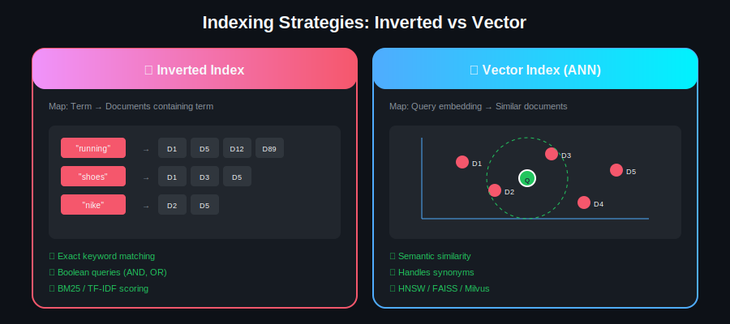
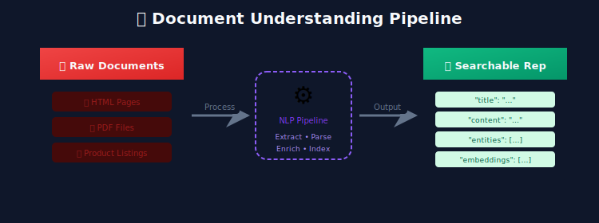
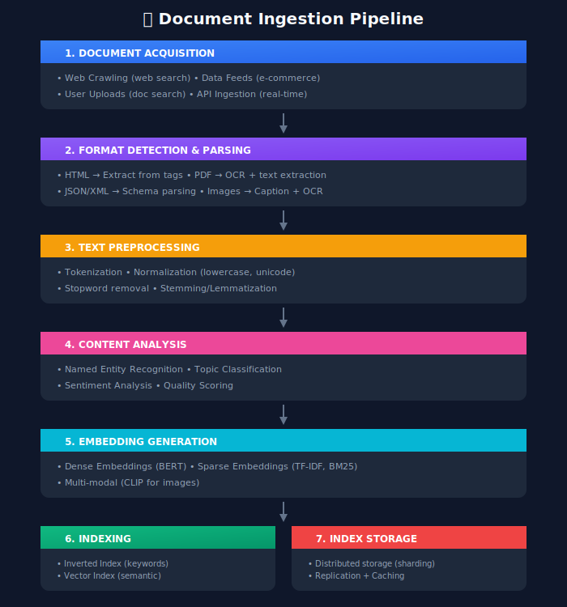
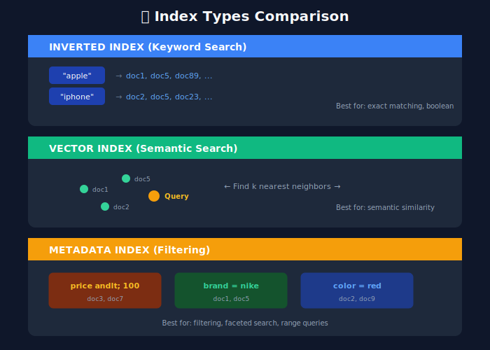
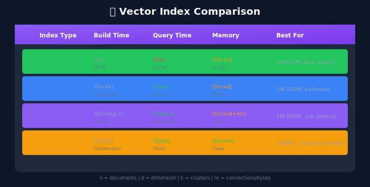
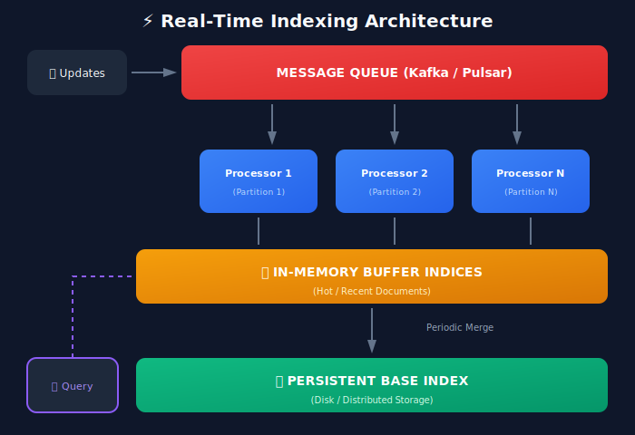

# Document Understanding & Indexing

## 📋 Table of Contents
1. [Introduction](#introduction)
2. [Document Processing Pipeline](#document-processing-pipeline)
3. [Text Extraction & Cleaning](#text-extraction-cleaning)
4. [Document Representation](#document-representation)
5. [Indexing Strategies](#indexing-strategies)
6. [Inverted Index Deep Dive](#inverted-index-deep-dive)
7. [Vector Indexing for Semantic Search](#vector-indexing-for-semantic-search)
8. [Real-Time Indexing](#real-time-indexing)
9. [Scalability Considerations](#scalability-considerations)

---

<p align="center">
  
</p>

---

## Introduction

Document understanding is the process of transforming raw documents into searchable, machine-understandable representations. This is the foundation upon which search ranking operates.



---

## Document Processing Pipeline

### End-to-End Pipeline Architecture



---

## Text Extraction & Cleaning

### HTML Content Extraction

```python
from bs4 import BeautifulSoup
import re
from typing import Dict, List, Optional

class HTMLExtractor:
    """
    Extract structured content from HTML documents
    """

    def __init__(self):
        # Tags to completely remove
        self.remove_tags = ['script', 'style', 'nav', 'footer', 'header', 'aside']

        # Important content tags with weights
        self.content_weights = {
            'title': 3.0,
            'h1': 2.5,
            'h2': 2.0,
            'h3': 1.5,
            'strong': 1.2,
            'b': 1.2,
            'p': 1.0,
            'li': 1.0
        }

    def extract(self, html: str) -> Dict:
        """
        Extract structured content from HTML
        """
        soup = BeautifulSoup(html, 'html.parser')

        # Remove unwanted tags
        for tag in soup.find_all(self.remove_tags):
            tag.decompose()

        # Extract metadata
        metadata = self._extract_metadata(soup)

        # Extract weighted content
        weighted_content = self._extract_weighted_content(soup)

        # Extract links
        links = self._extract_links(soup)

        # Extract images
        images = self._extract_images(soup)

        # Get clean text
        text = self._clean_text(soup.get_text())

        return {
            "metadata": metadata,
            "weighted_content": weighted_content,
            "links": links,
            "images": images,
            "text": text,
            "word_count": len(text.split())
        }

    def _extract_metadata(self, soup: BeautifulSoup) -> Dict:
        """Extract meta tags and structured data"""
        metadata = {}

        # Title
        title_tag = soup.find('title')
        metadata['title'] = title_tag.text.strip() if title_tag else ""

        # Meta description
        meta_desc = soup.find('meta', attrs={'name': 'description'})
        metadata['description'] = meta_desc.get('content', '') if meta_desc else ""

        # Open Graph data
        og_tags = soup.find_all('meta', attrs={'property': re.compile('^og:')})
        metadata['open_graph'] = {
            tag.get('property'): tag.get('content')
            for tag in og_tags
        }

        # Schema.org structured data
        schema_scripts = soup.find_all('script', type='application/ld+json')
        metadata['structured_data'] = [
            json.loads(script.string)
            for script in schema_scripts
            if script.string
        ]

        return metadata

    def _extract_weighted_content(self, soup: BeautifulSoup) -> List[Dict]:
        """Extract content with importance weights"""
        weighted_content = []

        for tag_name, weight in self.content_weights.items():
            for tag in soup.find_all(tag_name):
                text = self._clean_text(tag.get_text())
                if text:
                    weighted_content.append({
                        'tag': tag_name,
                        'text': text,
                        'weight': weight
                    })

        return weighted_content

    def _extract_links(self, soup: BeautifulSoup) -> List[Dict]:
        """Extract all links with anchor text"""
        links = []
        for a in soup.find_all('a', href=True):
            links.append({
                'href': a['href'],
                'anchor_text': self._clean_text(a.get_text()),
                'title': a.get('title', '')
            })
        return links

    def _extract_images(self, soup: BeautifulSoup) -> List[Dict]:
        """Extract image information"""
        images = []
        for img in soup.find_all('img'):
            images.append({
                'src': img.get('src', ''),
                'alt': img.get('alt', ''),
                'title': img.get('title', '')
            })
        return images

    def _clean_text(self, text: str) -> str:
        """Clean extracted text"""
        # Remove extra whitespace
        text = ' '.join(text.split())
        # Remove special characters
        text = re.sub(r'[^\w\s.,!?-]', '', text)
        return text.strip()

```

### PDF Document Processing

```python
import fitz  # PyMuPDF
from PIL import Image
import pytesseract

class PDFExtractor:
    """
    Extract text and images from PDF documents
    """

    def __init__(self, ocr_enabled: bool = True):
        self.ocr_enabled = ocr_enabled

    def extract(self, pdf_path: str) -> Dict:
        """
        Extract content from PDF
        """
        doc = fitz.open(pdf_path)

        pages = []
        all_text = []
        all_images = []

        for page_num, page in enumerate(doc):
            # Extract text
            text = page.get_text()

            # If no text and OCR enabled, try OCR
            if not text.strip() and self.ocr_enabled:
                text = self._ocr_page(page)

            # Extract images
            images = self._extract_images(page, page_num)

            pages.append({
                'page_num': page_num,
                'text': text,
                'images': images
            })

            all_text.append(text)
            all_images.extend(images)

        doc.close()

        return {
            'pages': pages,
            'full_text': '\n\n'.join(all_text),
            'images': all_images,
            'page_count': len(pages),
            'metadata': self._extract_metadata(pdf_path)
        }

    def _ocr_page(self, page) -> str:
        """
        OCR a page that has no extractable text
        """
        # Render page to image
        pix = page.get_pixmap(matrix=fitz.Matrix(2, 2))  # 2x zoom for better OCR
        img = Image.frombytes("RGB", [pix.width, pix.height], pix.samples)

        # Run OCR
        text = pytesseract.image_to_string(img)
        return text

    def _extract_images(self, page, page_num: int) -> List[Dict]:
        """
        Extract images from a page
        """
        images = []
        image_list = page.get_images()

        for img_index, img in enumerate(image_list):
            xref = img[0]
            images.append({
                'page': page_num,
                'index': img_index,
                'xref': xref
            })

        return images

    def _extract_metadata(self, pdf_path: str) -> Dict:
        """
        Extract PDF metadata
        """
        doc = fitz.open(pdf_path)
        metadata = doc.metadata
        doc.close()
        return metadata

```

### E-commerce Product Data Processing

```python
from dataclasses import dataclass
from typing import List, Optional

@dataclass
class Product:
    """
    Structured product representation
    """
    id: str
    title: str
    description: str
    brand: str
    category: List[str]  # Hierarchical: ["Electronics", "Phones", "Smartphones"]
    price: float
    currency: str
    attributes: Dict[str, any]  # color, size, material, etc.
    images: List[str]
    rating: Optional[float]
    review_count: Optional[int]
    availability: str
    seller: str

class ProductProcessor:
    """
    Process and enrich product data for search
    """

    def __init__(self):
        self.entity_extractor = ProductEntityExtractor()
        self.category_classifier = CategoryClassifier()
        self.quality_scorer = ProductQualityScorer()

    def process(self, raw_product: Dict) -> Product:
        """
        Process raw product data into searchable format
        """
        # Basic cleaning
        title = self._clean_text(raw_product.get('title', ''))
        description = self._clean_text(raw_product.get('description', ''))

        # Extract entities from title/description
        entities = self.entity_extractor.extract(title + " " + description)

        # Infer missing attributes
        attributes = self._merge_attributes(
            raw_product.get('attributes', {}),
            entities
        )

        # Classify category if missing
        if not raw_product.get('category'):
            category = self.category_classifier.predict(title, description)
        else:
            category = raw_product['category']

        # Calculate quality score
        quality_score = self.quality_scorer.score(raw_product)

        return Product(
            id=raw_product['id'],
            title=title,
            description=description,
            brand=entities.get('brand', raw_product.get('brand', '')),
            category=category,
            price=float(raw_product.get('price', 0)),
            currency=raw_product.get('currency', 'USD'),
            attributes=attributes,
            images=raw_product.get('images', []),
            rating=raw_product.get('rating'),
            review_count=raw_product.get('review_count'),
            availability=raw_product.get('availability', 'in_stock'),
            seller=raw_product.get('seller', '')
        )

    def _clean_text(self, text: str) -> str:
        """
        Clean product text
        """
        if not text:
            return ""

        # Remove HTML
        text = re.sub(r'<[^>]+>', '', text)

        # Normalize whitespace
        text = ' '.join(text.split())

        # Remove excessive punctuation
        text = re.sub(r'[!]{2,}', '!', text)

        return text.strip()

    def _merge_attributes(self, explicit: Dict, extracted: Dict) -> Dict:
        """
        Merge explicit and extracted attributes
        """
        merged = explicit.copy()

        # Add extracted attributes if not already present
        for key, value in extracted.items():
            if key not in merged:
                merged[key] = value

        return merged

```

---

## Document Representation

### Sparse Representation (TF-IDF / BM25)

```python
import numpy as np
from collections import Counter
from typing import Dict, List

class BM25Vectorizer:
    """
    Convert documents to BM25 weighted sparse vectors
    """

    def __init__(self, k1: float = 1.5, b: float = 0.75):
        self.k1 = k1
        self.b = b
        self.vocabulary = {}
        self.idf = {}
        self.avg_doc_length = 0
        self.doc_count = 0

    def fit(self, documents: List[str]):
        """
        Build vocabulary and calculate IDF scores
        """
        self.doc_count = len(documents)
        doc_frequencies = Counter()
        total_length = 0

        for doc in documents:
            tokens = self._tokenize(doc)
            total_length += len(tokens)

            # Count document frequency (unique terms per doc)
            unique_tokens = set(tokens)
            for token in unique_tokens:
                doc_frequencies[token] += 1

        # Build vocabulary
        self.vocabulary = {
            token: idx
            for idx, token in enumerate(doc_frequencies.keys())
        }

        # Calculate IDF
        for token, df in doc_frequencies.items():
            # IDF with smoothing
            self.idf[token] = np.log(
                (self.doc_count - df + 0.5) / (df + 0.5) + 1
            )

        self.avg_doc_length = total_length / self.doc_count

    def transform(self, document: str) -> Dict[int, float]:
        """
        Transform document to BM25 weighted sparse vector
        """
        tokens = self._tokenize(document)
        doc_length = len(tokens)
        term_frequencies = Counter(tokens)

        sparse_vector = {}

        for token, tf in term_frequencies.items():
            if token in self.vocabulary:
                idx = self.vocabulary[token]
                idf = self.idf.get(token, 0)

                # BM25 term weight
                numerator = tf * (self.k1 + 1)
                denominator = tf + self.k1 * (
                    1 - self.b + self.b * (doc_length / self.avg_doc_length)
                )

                weight = idf * (numerator / denominator)
                sparse_vector[idx] = weight

        return sparse_vector

    def _tokenize(self, text: str) -> List[str]:
        """
        Simple tokenization
        """
        text = text.lower()
        tokens = re.findall(r'\b\w+\b', text)
        return tokens

```

### Dense Representation (Neural Embeddings)

```python
from transformers import AutoTokenizer, AutoModel
import torch

class DocumentEmbedder:
    """
    Generate dense embeddings for documents
    """

    def __init__(self, model_name: str = "sentence-transformers/all-MiniLM-L6-v2"):
        self.tokenizer = AutoTokenizer.from_pretrained(model_name)
        self.model = AutoModel.from_pretrained(model_name)
        self.model.eval()

        self.max_length = 512
        self.embedding_dim = 384  # Depends on model

    def embed(self, text: str) -> np.ndarray:
        """
        Generate embedding for a single document
        """
        # Tokenize
        inputs = self.tokenizer(
            text,
            max_length=self.max_length,
            truncation=True,
            padding=True,
            return_tensors="pt"
        )

        # Generate embedding
        with torch.no_grad():
            outputs = self.model(**inputs)

            # Mean pooling
            attention_mask = inputs['attention_mask']
            token_embeddings = outputs.last_hidden_state

            input_mask_expanded = attention_mask.unsqueeze(-1).expand(
                token_embeddings.size()
            ).float()

            sum_embeddings = torch.sum(token_embeddings * input_mask_expanded, 1)
            sum_mask = torch.clamp(input_mask_expanded.sum(1), min=1e-9)

            embedding = (sum_embeddings / sum_mask).squeeze().numpy()

        return embedding

    def embed_batch(self, texts: List[str], batch_size: int = 32) -> np.ndarray:
        """
        Batch embedding for efficiency
        """
        all_embeddings = []

        for i in range(0, len(texts), batch_size):
            batch = texts[i:i + batch_size]

            inputs = self.tokenizer(
                batch,
                max_length=self.max_length,
                truncation=True,
                padding=True,
                return_tensors="pt"
            )

            with torch.no_grad():
                outputs = self.model(**inputs)

                attention_mask = inputs['attention_mask']
                token_embeddings = outputs.last_hidden_state

                input_mask_expanded = attention_mask.unsqueeze(-1).expand(
                    token_embeddings.size()
                ).float()

                sum_embeddings = torch.sum(token_embeddings * input_mask_expanded, 1)
                sum_mask = torch.clamp(input_mask_expanded.sum(1), min=1e-9)

                embeddings = (sum_embeddings / sum_mask).numpy()
                all_embeddings.append(embeddings)

        return np.vstack(all_embeddings)

class LongDocumentEmbedder:
    """
    Handle documents longer than model context window
    """

    def __init__(self, base_embedder: DocumentEmbedder):
        self.embedder = base_embedder
        self.chunk_size = 500  # words
        self.chunk_overlap = 50  # words

    def embed(self, text: str, strategy: str = "mean") -> np.ndarray:
        """
        Embed long document using chunking

        Strategies:
        - mean: Average of all chunk embeddings
        - first: Use first chunk only
        - max: Element-wise max pooling
        - weighted: Weight by chunk position
        """
        chunks = self._chunk_text(text)
        chunk_embeddings = np.array([
            self.embedder.embed(chunk) for chunk in chunks
        ])

        if strategy == "mean":
            return np.mean(chunk_embeddings, axis=0)
        elif strategy == "first":
            return chunk_embeddings[0]
        elif strategy == "max":
            return np.max(chunk_embeddings, axis=0)
        elif strategy == "weighted":
            # Weight earlier chunks more heavily
            weights = np.array([1 / (i + 1) for i in range(len(chunks))])
            weights = weights / weights.sum()
            return np.average(chunk_embeddings, axis=0, weights=weights)

    def _chunk_text(self, text: str) -> List[str]:
        """
        Split text into overlapping chunks
        """
        words = text.split()
        chunks = []

        for i in range(0, len(words), self.chunk_size - self.chunk_overlap):
            chunk = ' '.join(words[i:i + self.chunk_size])
            if chunk:
                chunks.append(chunk)

        return chunks

```

### Hybrid Representation

```python
@dataclass
class DocumentRepresentation:
    """
    Complete document representation for search
    """
    doc_id: str

    # Sparse representation
    sparse_vector: Dict[int, float]  # BM25 weighted

    # Dense representation
    dense_vector: np.ndarray  # Neural embedding

    # Structured data
    title: str
    content: str
    entities: Dict[str, List[str]]
    categories: List[str]

    # Metadata
    metadata: Dict[str, any]

    # Signals
    quality_score: float
    freshness_score: float
    popularity_score: float

class HybridDocumentProcessor:
    """
    Generate hybrid representations for documents
    """

    def __init__(self):
        self.bm25_vectorizer = BM25Vectorizer()
        self.dense_embedder = LongDocumentEmbedder(DocumentEmbedder())
        self.entity_extractor = EntityExtractor()
        self.quality_scorer = QualityScorer()

    def process(self, doc: Dict) -> DocumentRepresentation:
        """
        Generate complete document representation
        """
        text = f"{doc['title']} {doc['content']}"

        return DocumentRepresentation(
            doc_id=doc['id'],
            sparse_vector=self.bm25_vectorizer.transform(text),
            dense_vector=self.dense_embedder.embed(text),
            title=doc['title'],
            content=doc['content'],
            entities=self.entity_extractor.extract(text),
            categories=doc.get('categories', []),
            metadata=doc.get('metadata', {}),
            quality_score=self.quality_scorer.score(doc),
            freshness_score=self._calculate_freshness(doc),
            popularity_score=doc.get('popularity', 0)
        )

    def _calculate_freshness(self, doc: Dict) -> float:
        """
        Calculate document freshness score (0-1)
        """
        if 'timestamp' not in doc:
            return 0.5  # Default for documents without timestamp

        age_days = (datetime.now() - doc['timestamp']).days

        # Exponential decay
        half_life = 30  # days
        freshness = 0.5 ** (age_days / half_life)

        return freshness

```

---

## Indexing Strategies

### Index Types Overview



---

## Inverted Index Deep Dive

### Inverted Index Structure

```python
from collections import defaultdict
from dataclasses import dataclass
from typing import List, Dict, Tuple
import struct

@dataclass
class Posting:
    """
    A posting represents document occurrence of a term
    """
    doc_id: int
    term_frequency: int
    positions: List[int]  # Term positions within document
    field_weights: Dict[str, float]  # Weight per field (title, body, etc.)

class InvertedIndex:
    """
    Basic inverted index implementation
    """

    def __init__(self):
        # term -> list of postings
        self.index: Dict[str, List[Posting]] = defaultdict(list)

        # Document metadata
        self.doc_lengths: Dict[int, int] = {}
        self.doc_count: int = 0
        self.avg_doc_length: float = 0

        # Vocabulary
        self.vocabulary: Dict[str, int] = {}  # term -> term_id
        self.reverse_vocab: Dict[int, str] = {}  # term_id -> term

    def add_document(self, doc_id: int, fields: Dict[str, str]):
        """
        Add a document to the index

        Args:
            doc_id: Unique document identifier
            fields: Dictionary of field_name -> text content
        """
        # Track document
        total_terms = 0
        term_positions = defaultdict(lambda: defaultdict(list))
        term_counts = defaultdict(lambda: defaultdict(int))

        # Process each field
        for field_name, text in fields.items():
            tokens = self._tokenize(text)

            for position, token in enumerate(tokens):
                term_positions[token][field_name].append(position)
                term_counts[token][field_name] += 1
                total_terms += 1

                # Add to vocabulary if new
                if token not in self.vocabulary:
                    term_id = len(self.vocabulary)
                    self.vocabulary[token] = term_id
                    self.reverse_vocab[term_id] = token

        # Create postings
        for term, field_positions in term_positions.items():
            all_positions = []
            field_weights = {}
            total_tf = 0

            for field_name, positions in field_positions.items():
                all_positions.extend(positions)
                tf = term_counts[term][field_name]
                total_tf += tf

                # Weight by field (title more important than body)
                field_weights[field_name] = self._get_field_weight(field_name) * tf

            posting = Posting(
                doc_id=doc_id,
                term_frequency=total_tf,
                positions=sorted(all_positions),
                field_weights=field_weights
            )

            self.index[term].append(posting)

        # Update document length
        self.doc_lengths[doc_id] = total_terms
        self.doc_count += 1
        self.avg_doc_length = sum(self.doc_lengths.values()) / self.doc_count

    def search(self, query: str, top_k: int = 10) -> List[Tuple[int, float]]:
        """
        Search the index using BM25 scoring
        """
        query_terms = self._tokenize(query)
        scores = defaultdict(float)

        for term in query_terms:
            if term not in self.index:
                continue

            postings = self.index[term]
            idf = self._calculate_idf(len(postings))

            for posting in postings:
                score = self._calculate_bm25(
                    tf=posting.term_frequency,
                    idf=idf,
                    doc_length=self.doc_lengths[posting.doc_id],
                    field_weights=posting.field_weights
                )
                scores[posting.doc_id] += score

        # Sort by score
        ranked = sorted(scores.items(), key=lambda x: x[1], reverse=True)
        return ranked[:top_k]

    def _tokenize(self, text: str) -> List[str]:
        """Simple tokenization"""
        text = text.lower()
        tokens = re.findall(r'\b\w+\b', text)
        # Could add stemming, stopword removal here
        return tokens

    def _get_field_weight(self, field_name: str) -> float:
        """Field importance weights"""
        weights = {
            'title': 2.0,
            'description': 1.0,
            'body': 0.5,
            'tags': 1.5
        }
        return weights.get(field_name, 1.0)

    def _calculate_idf(self, doc_frequency: int) -> float:
        """Calculate IDF score"""
        return np.log((self.doc_count - doc_frequency + 0.5) / (doc_frequency + 0.5) + 1)

    def _calculate_bm25(
        self,
        tf: int,
        idf: float,
        doc_length: int,
        field_weights: Dict[str, float],
        k1: float = 1.5,
        b: float = 0.75
    ) -> float:
        """Calculate BM25 score"""
        # Basic BM25
        numerator = tf * (k1 + 1)
        denominator = tf + k1 * (1 - b + b * (doc_length / self.avg_doc_length))
        base_score = idf * (numerator / denominator)

        # Apply field boosts
        field_boost = sum(field_weights.values()) / max(len(field_weights), 1)

        return base_score * field_boost

```

### Index Compression

```python
class CompressedPostingList:
    """
    Compressed posting list using variable-byte encoding
    and delta compression
    """

    def __init__(self):
        self.compressed_data = bytearray()
        self.doc_count = 0

    def add_posting(self, doc_id: int, tf: int, positions: List[int]):
        """
        Add a posting with compression
        """
        if self.doc_count == 0:
            # First doc_id stored as-is
            delta = doc_id
        else:
            # Subsequent doc_ids stored as deltas
            delta = doc_id - self.last_doc_id

        # Encode doc_id delta
        self.compressed_data.extend(self._vbyte_encode(delta))

        # Encode term frequency
        self.compressed_data.extend(self._vbyte_encode(tf))

        # Encode position count
        self.compressed_data.extend(self._vbyte_encode(len(positions)))

        # Encode positions as deltas
        prev_pos = 0
        for pos in positions:
            pos_delta = pos - prev_pos
            self.compressed_data.extend(self._vbyte_encode(pos_delta))
            prev_pos = pos

        self.last_doc_id = doc_id
        self.doc_count += 1

    def _vbyte_encode(self, n: int) -> bytes:
        """
        Variable-byte encoding
        Small numbers use fewer bytes
        """
        bytes_list = []
        while n >= 128:
            bytes_list.append(n & 127)  # 7 bits
            n >>= 7
        bytes_list.append(n | 128)  # Set high bit on last byte
        return bytes(bytes_list)

    def _vbyte_decode(self, data: bytes, offset: int) -> Tuple[int, int]:
        """
        Decode variable-byte encoded integer
        Returns (value, new_offset)
        """
        n = 0
        shift = 0
        while True:
            byte = data[offset]
            offset += 1
            if byte >= 128:
                n |= (byte & 127) << shift
                break
            n |= byte << shift
            shift += 7
        return n, offset

```

---

## Vector Indexing for Semantic Search

### Approximate Nearest Neighbor (ANN) Indices

```python
import faiss
import numpy as np
from typing import List, Tuple

class VectorIndex:
    """
    FAISS-based vector index for semantic search
    """

    def __init__(self, dimension: int, index_type: str = "IVF"):
        self.dimension = dimension
        self.index_type = index_type
        self.index = None
        self.doc_ids = []  # Map internal IDs to document IDs
        self.is_trained = False

    def build(self, vectors: np.ndarray, doc_ids: List[str], nlist: int = 100):
        """
        Build the index

        Args:
            vectors: (n_docs, dimension) array of document embeddings
            doc_ids: List of document IDs
            nlist: Number of clusters for IVF index
        """
        n_docs = vectors.shape[0]
        self.doc_ids = doc_ids

        if self.index_type == "Flat":
            # Exact search (for small datasets)
            self.index = faiss.IndexFlatIP(self.dimension)  # Inner product

        elif self.index_type == "IVF":
            # Inverted file index (fast approximate search)
            quantizer = faiss.IndexFlatIP(self.dimension)
            self.index = faiss.IndexIVFFlat(
                quantizer,
                self.dimension,
                nlist,
                faiss.METRIC_INNER_PRODUCT
            )
            # Train on vectors
            self.index.train(vectors.astype('float32'))

        elif self.index_type == "HNSW":
            # Hierarchical Navigable Small World
            self.index = faiss.IndexHNSWFlat(self.dimension, 32)  # 32 connections

        elif self.index_type == "PQ":
            # Product Quantization (compressed)
            self.index = faiss.IndexPQ(
                self.dimension,
                8,  # Number of subvectors
                8   # Bits per subvector
            )
            self.index.train(vectors.astype('float32'))

        # Add vectors
        self.index.add(vectors.astype('float32'))
        self.is_trained = True

    def search(
        self,
        query_vector: np.ndarray,
        top_k: int = 10,
        nprobe: int = 10
    ) -> List[Tuple[str, float]]:
        """
        Search for similar documents

        Args:
            query_vector: Query embedding
            top_k: Number of results
            nprobe: Number of clusters to search (for IVF)

        Returns:
            List of (doc_id, score) tuples
        """
        if not self.is_trained:
            raise ValueError("Index not built yet")

        # Set search parameters for IVF
        if self.index_type == "IVF":
            self.index.nprobe = nprobe

        # Search
        query = query_vector.astype('float32').reshape(1, -1)
        scores, indices = self.index.search(query, top_k)

        # Map indices to doc_ids
        results = []
        for idx, score in zip(indices[0], scores[0]):
            if idx >= 0:  # -1 indicates no result
                doc_id = self.doc_ids[idx]
                results.append((doc_id, float(score)))

        return results

    def add_vectors(self, vectors: np.ndarray, doc_ids: List[str]):
        """
        Add new vectors to existing index
        """
        self.index.add(vectors.astype('float32'))
        self.doc_ids.extend(doc_ids)

    def save(self, path: str):
        """Save index to disk"""
        faiss.write_index(self.index, f"{path}.faiss")
        np.save(f"{path}_ids.npy", np.array(self.doc_ids))

    def load(self, path: str):
        """Load index from disk"""
        self.index = faiss.read_index(f"{path}.faiss")
        self.doc_ids = np.load(f"{path}_ids.npy").tolist()
        self.is_trained = True

```

### Index Type Comparison



---

## Real-Time Indexing

### Architecture for Real-Time Updates



### Implementation

```python
import threading
from queue import Queue
import time

class RealTimeIndexer:
    """
    Real-time indexing with buffer and periodic merge
    """

    def __init__(
        self,
        base_index: InvertedIndex,
        buffer_size: int = 10000,
        merge_interval: int = 60  # seconds
    ):
        self.base_index = base_index
        self.buffer_index = InvertedIndex()
        self.buffer_size = buffer_size
        self.merge_interval = merge_interval

        self.update_queue = Queue()
        self.buffer_count = 0
        self.lock = threading.RLock()

        # Start background workers
        self._start_workers()

    def _start_workers(self):
        """Start background processing threads"""
        # Document processor
        self.processor_thread = threading.Thread(target=self._process_updates)
        self.processor_thread.daemon = True
        self.processor_thread.start()

        # Periodic merger
        self.merger_thread = threading.Thread(target=self._periodic_merge)
        self.merger_thread.daemon = True
        self.merger_thread.start()

    def add_document(self, doc_id: int, fields: Dict[str, str]):
        """
        Add document to update queue
        """
        self.update_queue.put(('add', doc_id, fields))

    def delete_document(self, doc_id: int):
        """
        Mark document for deletion
        """
        self.update_queue.put(('delete', doc_id, None))

    def _process_updates(self):
        """
        Process updates from queue
        """
        while True:
            try:
                action, doc_id, fields = self.update_queue.get()

                with self.lock:
                    if action == 'add':
                        self.buffer_index.add_document(doc_id, fields)
                        self.buffer_count += 1
                    elif action == 'delete':
                        self._mark_deleted(doc_id)

                    # Trigger merge if buffer is full
                    if self.buffer_count >= self.buffer_size:
                        self._merge_buffer()

            except Exception as e:
                logging.error(f"Error processing update: {e}")

    def _periodic_merge(self):
        """
        Periodically merge buffer into base index
        """
        while True:
            time.sleep(self.merge_interval)

            with self.lock:
                if self.buffer_count > 0:
                    self._merge_buffer()

    def _merge_buffer(self):
        """
        Merge buffer index into base index
        """
        logging.info(f"Merging {self.buffer_count} documents into base index")

        # Merge logic here (copy postings from buffer to base)
        for term, postings in self.buffer_index.index.items():
            self.base_index.index[term].extend(postings)

        # Reset buffer
        self.buffer_index = InvertedIndex()
        self.buffer_count = 0

    def search(self, query: str, top_k: int = 10) -> List[Tuple[int, float]]:
        """
        Search both base and buffer indices
        """
        with self.lock:
            # Search both indices
            base_results = self.base_index.search(query, top_k * 2)
            buffer_results = self.buffer_index.search(query, top_k * 2)

        # Merge and re-rank
        all_results = {}

        for doc_id, score in base_results:
            if not self._is_deleted(doc_id):
                all_results[doc_id] = all_results.get(doc_id, 0) + score

        for doc_id, score in buffer_results:
            all_results[doc_id] = all_results.get(doc_id, 0) + score

        # Sort and return top_k
        ranked = sorted(all_results.items(), key=lambda x: x[1], reverse=True)
        return ranked[:top_k]

```

---

## Scalability Considerations

### Sharding Strategies


### Replication for High Availability

```python
class DistributedIndex:
    """
    Distributed index with sharding and replication
    """

    def __init__(
        self,
        num_shards: int,
        replication_factor: int = 3
    ):
        self.num_shards = num_shards
        self.replication_factor = replication_factor

        # Shard routing
        self.shard_router = ConsistentHashRing(num_shards)

        # Shard replicas
        self.shards = {}  # shard_id -> list of replica nodes

    def add_document(self, doc_id: str, document: Dict):
        """
        Add document to appropriate shard
        """
        shard_id = self.shard_router.get_shard(doc_id)
        replicas = self.shards[shard_id]

        # Write to all replicas (synchronous for consistency)
        for replica in replicas:
            replica.add_document(doc_id, document)

    def search(self, query: str, top_k: int = 10) -> List:
        """
        Search all shards and merge results
        """
        # Query all shards in parallel
        futures = []
        for shard_id, replicas in self.shards.items():
            # Pick one replica (round-robin for load balancing)
            replica = self._pick_replica(replicas)
            future = executor.submit(replica.search, query, top_k)
            futures.append(future)

        # Gather results
        all_results = []
        for future in futures:
            results = future.result()
            all_results.extend(results)

        # Global re-ranking
        all_results.sort(key=lambda x: x[1], reverse=True)
        return all_results[:top_k]

```

---

## Key Takeaways

1. **Multiple Representations**: Combine sparse (BM25) and dense (embeddings) for best results

2. **Efficient Indexing**: Use inverted indices for keywords, ANN indices for vectors

3. **Real-Time Updates**: Buffer recent updates, merge periodically

4. **Scalability**: Shard data, replicate for availability

5. **Compression**: Compress posting lists for memory efficiency

---

## Next Steps

Continue to the next sections:

- [04_feature_engineering](../04_feature_engineering/README.md) - Building features for ranking

- [05_ranking_models](../05_ranking_models/README.md) - ML models for ranking

---

*Last Updated: January 2026*

---

<div align="center">

**[⬆ Back to Top](#)** | **[📚 Main Repository](https://github.com/Gaurav14cs17/ml_system_design)**

Made with 💜 by [Gaurav14cs17](https://github.com/Gaurav14cs17)

</div>
