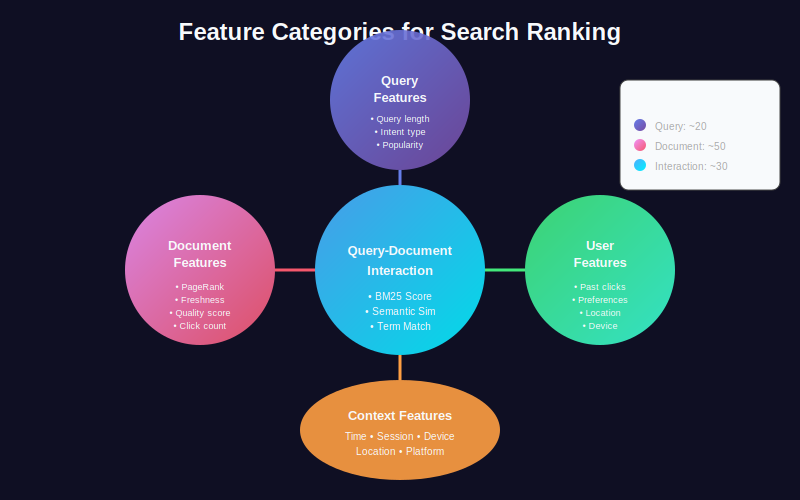
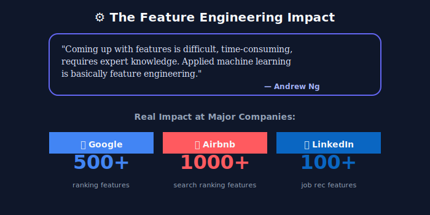
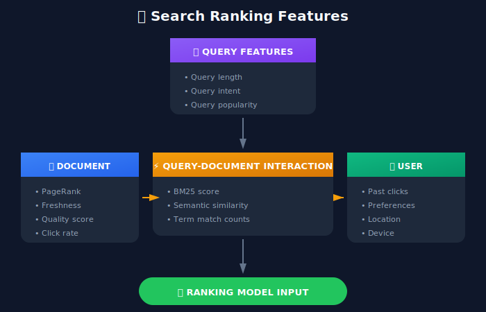
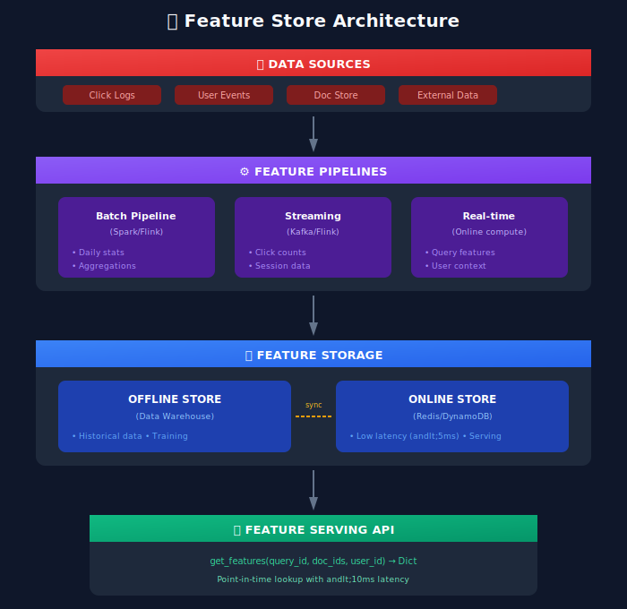

# Feature Engineering for Search Ranking

## 📋 Table of Contents
1. [Introduction](#introduction)
2. [Feature Categories](#feature-categories)
3. [Query Features](#query-features)
4. [Document Features](#document-features)
5. [Query-Document Interaction Features](#query-document-interaction-features)
6. [User & Context Features](#user-context-features)
7. [Behavioral Features](#behavioral-features)
8. [Feature Store Architecture](#feature-store-architecture)
9. [Feature Engineering Best Practices](#feature-engineering-best-practices)

---

<p align="center">
  
</p>

---

## Introduction

Feature engineering is the art and science of transforming raw data into meaningful signals that help ML models make better ranking decisions. In search ranking, good features can often matter more than sophisticated models.



---

## Feature Categories

### The Three Pillars of Search Features



### Feature Taxonomy

```python
feature_taxonomy = {
    "query_features": {
        "static": ["query_length", "num_terms", "has_brand"],
        "derived": ["query_embedding", "intent_vector", "entity_tags"]
    },

    "document_features": {
        "static": ["doc_length", "creation_date", "author_authority"],
        "dynamic": ["click_count", "view_count", "freshness_score"],
        "semantic": ["doc_embedding", "topic_distribution"]
    },

    "query_document_features": {
        "lexical": ["bm25_score", "tf_idf_cosine", "term_overlap"],
        "semantic": ["embedding_cosine", "cross_encoder_score"],
        "structural": ["title_match", "exact_match", "phrase_match"]
    },

    "user_features": {
        "profile": ["user_embedding", "interests", "demographics"],
        "behavioral": ["past_queries", "past_clicks", "dwell_times"],
        "contextual": ["time_of_day", "device", "location"]
    }
}
```

---

## Query Features

### Static Query Features

```python
from dataclasses import dataclass
from typing import List, Dict, Optional
import numpy as np

@dataclass
class QueryFeatures:
    """
    Features extracted from the query itself
    """

    # Basic statistics
    query_length: int              # Character count
    num_terms: int                 # Word count
    num_unique_terms: int          # Unique word count
    avg_term_length: float         # Average word length

    # Query characteristics
    has_numbers: bool              # Contains numeric values
    has_special_chars: bool        # Contains @, #, etc.
    is_question: bool              # Starts with who/what/where/etc.
    has_quotes: bool               # Contains quoted phrases

    # Entity presence
    has_brand: bool                # Contains brand name
    has_location: bool             # Contains location
    has_price_modifier: bool       # Contains "cheap", "under $X"

    # Query type indicators
    navigational_score: float      # Probability of navigational intent
    informational_score: float     # Probability of informational intent
    transactional_score: float     # Probability of transactional intent

class QueryFeatureExtractor:
    """
    Extract features from search queries
    """

    def __init__(self):
        self.brand_detector = BrandDetector()
        self.location_detector = LocationDetector()
        self.intent_classifier = IntentClassifier()
        self.question_words = {'who', 'what', 'where', 'when', 'why', 'how'}
        self.price_modifiers = {'cheap', 'affordable', 'budget', 'expensive', 'under', 'below'}

    def extract(self, query: str) -> QueryFeatures:
        """
        Extract all query features
        """
        tokens = query.lower().split()

        # Basic statistics
        query_length = len(query)
        num_terms = len(tokens)
        num_unique_terms = len(set(tokens))
        avg_term_length = np.mean([len(t) for t in tokens]) if tokens else 0

        # Query characteristics
        has_numbers = any(char.isdigit() for char in query)
        has_special_chars = bool(re.search(r'[@#$%^&*]', query))
        is_question = tokens[0] in self.question_words if tokens else False
        has_quotes = '"' in query

        # Entity detection
        has_brand = self.brand_detector.contains_brand(query)
        has_location = self.location_detector.contains_location(query)
        has_price_modifier = any(mod in tokens for mod in self.price_modifiers)

        # Intent classification
        intent_scores = self.intent_classifier.predict(query)

        return QueryFeatures(
            query_length=query_length,
            num_terms=num_terms,
            num_unique_terms=num_unique_terms,
            avg_term_length=avg_term_length,
            has_numbers=has_numbers,
            has_special_chars=has_special_chars,
            is_question=is_question,
            has_quotes=has_quotes,
            has_brand=has_brand,
            has_location=has_location,
            has_price_modifier=has_price_modifier,
            navigational_score=intent_scores.get('navigational', 0),
            informational_score=intent_scores.get('informational', 0),
            transactional_score=intent_scores.get('transactional', 0)
        )
```

### Query Popularity Features

```python
class QueryPopularityFeatures:
    """
    Features based on query history and popularity
    """

    def __init__(self, query_logs: QueryLogStore):
        self.query_logs = query_logs
        self.cache = LRUCache(maxsize=100000)

    def extract(self, query: str) -> Dict[str, float]:
        """
        Extract popularity-based features
        """
        if query in self.cache:
            return self.cache[query]

        # Get query statistics
        stats = self.query_logs.get_query_stats(query)

        features = {

            # Raw counts
            "query_frequency_1d": stats.get("count_1d", 0),
            "query_frequency_7d": stats.get("count_7d", 0),
            "query_frequency_30d": stats.get("count_30d", 0),

            # Normalized (log-scaled)
            "query_frequency_log": np.log1p(stats.get("count_30d", 0)),

            # Trend features
            "query_trending": self._calculate_trend(stats),
            "query_seasonal": self._calculate_seasonality(stats),

            # Click entropy (diversity of clicked results)
            "click_entropy": stats.get("click_entropy", 0),

            # Success rate
            "query_success_rate": stats.get("clicks", 0) / max(stats.get("impressions", 1), 1),

            # Average result position clicked
            "avg_click_position": stats.get("avg_click_position", 5.0),
        }

        self.cache[query] = features
        return features

    def _calculate_trend(self, stats: Dict) -> float:
        """
        Calculate if query is trending up or down
        """
        recent = stats.get("count_7d", 0)
        historical = stats.get("count_30d", 0) / 4  # Average weekly

        if historical == 0:
            return 0

        return (recent - historical) / historical

    def _calculate_seasonality(self, stats: Dict) -> float:
        """
        Calculate seasonal factor
        """
        current_month = datetime.now().month
        monthly_counts = stats.get("monthly_distribution", {})

        avg_count = np.mean(list(monthly_counts.values())) if monthly_counts else 0
        current_count = monthly_counts.get(current_month, avg_count)

        if avg_count == 0:
            return 1.0

        return current_count / avg_count
```

---

## Document Features

### Static Document Features

```python
@dataclass
class DocumentFeatures:
    """
    Features inherent to the document
    """

    # Content features
    doc_length: int                # Word count
    title_length: int              # Title word count
    num_images: int                # Image count
    num_links: int                 # Link count
    reading_level: float           # Flesch-Kincaid grade level

    # Quality features
    spam_score: float              # Probability of spam (0-1)
    quality_score: float           # Overall quality (0-1)
    grammar_score: float           # Grammar correctness (0-1)

    # Authority features
    page_rank: float               # PageRank score
    domain_authority: float        # Domain reputation
    author_authority: float        # Author expertise score

    # Freshness features
    age_days: int                  # Days since publication
    last_modified_days: int        # Days since last update
    freshness_score: float         # Normalized freshness (0-1)

    # Engagement features
    view_count: int                # Total views
    avg_dwell_time: float          # Average time on page
    bounce_rate: float             # Bounce rate

class DocumentFeatureExtractor:
    """
    Extract features from documents
    """

    def __init__(self):
        self.quality_scorer = DocumentQualityScorer()
        self.spam_detector = SpamDetector()
        self.readability_analyzer = ReadabilityAnalyzer()

    def extract(self, document: Dict) -> DocumentFeatures:
        """
        Extract all document features
        """
        content = document.get('content', '')
        title = document.get('title', '')

        # Content analysis
        doc_length = len(content.split())
        title_length = len(title.split())
        num_images = document.get('image_count', 0)
        num_links = document.get('link_count', 0)
        reading_level = self.readability_analyzer.flesch_kincaid(content)

        # Quality analysis
        spam_score = self.spam_detector.score(content)
        quality_score = self.quality_scorer.score(document)
        grammar_score = self.quality_scorer.grammar_score(content)

        # Authority
        page_rank = document.get('page_rank', 0)
        domain_authority = document.get('domain_authority', 0)
        author_authority = document.get('author_authority', 0)

        # Freshness
        pub_date = document.get('published_date', datetime.now())
        mod_date = document.get('modified_date', pub_date)
        age_days = (datetime.now() - pub_date).days
        last_modified_days = (datetime.now() - mod_date).days
        freshness_score = self._calculate_freshness(age_days)

        # Engagement
        view_count = document.get('view_count', 0)
        avg_dwell_time = document.get('avg_dwell_time', 0)
        bounce_rate = document.get('bounce_rate', 0.5)

        return DocumentFeatures(
            doc_length=doc_length,
            title_length=title_length,
            num_images=num_images,
            num_links=num_links,
            reading_level=reading_level,
            spam_score=spam_score,
            quality_score=quality_score,
            grammar_score=grammar_score,
            page_rank=page_rank,
            domain_authority=domain_authority,
            author_authority=author_authority,
            age_days=age_days,
            last_modified_days=last_modified_days,
            freshness_score=freshness_score,
            view_count=view_count,
            avg_dwell_time=avg_dwell_time,
            bounce_rate=bounce_rate
        )

    def _calculate_freshness(self, age_days: int) -> float:
        """
        Calculate freshness score with exponential decay
        """
        half_life = 30  # days
        return 0.5 ** (age_days / half_life)
```

### E-commerce Product Features

```python
@dataclass
class ProductFeatures:
    """
    Features specific to e-commerce products
    """

    # Price features
    price: float
    price_percentile: float        # Where in category price range
    has_discount: bool
    discount_percentage: float

    # Availability
    in_stock: bool
    stock_quantity: int
    shipping_days: int

    # Ratings & Reviews
    avg_rating: float
    num_reviews: int
    review_sentiment: float        # Aggregate sentiment (-1 to 1)
    rating_trend: float            # Improving or declining

    # Sales performance
    sales_rank: int
    sales_velocity: float          # Sales per day
    conversion_rate: float

    # Product attributes
    num_variants: int              # Color/size options
    num_images: int
    has_video: bool
    description_length: int

class ProductFeatureExtractor:
    """
    Extract features for e-commerce products
    """

    def __init__(self, category_stats: CategoryStatistics):
        self.category_stats = category_stats

    def extract(self, product: Dict, category: str) -> ProductFeatures:
        """
        Extract product features with category-aware normalization
        """

        # Price features
        price = product.get('price', 0)
        category_prices = self.category_stats.get_price_distribution(category)
        price_percentile = self._calculate_percentile(price, category_prices)

        original_price = product.get('original_price', price)
        has_discount = original_price > price
        discount_percentage = (original_price - price) / original_price if has_discount else 0

        # Availability
        in_stock = product.get('availability', 'in_stock') == 'in_stock'
        stock_quantity = product.get('stock_quantity', 0)
        shipping_days = product.get('shipping_days', 7)

        # Ratings
        avg_rating = product.get('rating', 0)
        num_reviews = product.get('review_count', 0)
        review_sentiment = product.get('review_sentiment', 0)
        rating_trend = self._calculate_rating_trend(product)

        # Sales
        sales_rank = product.get('sales_rank', 1000000)
        sales_velocity = product.get('sales_last_30d', 0) / 30
        conversion_rate = product.get('conversion_rate', 0)

        # Attributes
        num_variants = len(product.get('variants', []))
        num_images = len(product.get('images', []))
        has_video = product.get('has_video', False)
        description_length = len(product.get('description', '').split())

        return ProductFeatures(
            price=price,
            price_percentile=price_percentile,
            has_discount=has_discount,
            discount_percentage=discount_percentage,
            in_stock=in_stock,
            stock_quantity=stock_quantity,
            shipping_days=shipping_days,
            avg_rating=avg_rating,
            num_reviews=num_reviews,
            review_sentiment=review_sentiment,
            rating_trend=rating_trend,
            sales_rank=sales_rank,
            sales_velocity=sales_velocity,
            conversion_rate=conversion_rate,
            num_variants=num_variants,
            num_images=num_images,
            has_video=has_video,
            description_length=description_length
        )

    def _calculate_percentile(self, value: float, distribution: List[float]) -> float:
        """Calculate percentile within distribution"""
        return np.searchsorted(sorted(distribution), value) / len(distribution)

    def _calculate_rating_trend(self, product: Dict) -> float:
        """Calculate if ratings are improving or declining"""
        recent_rating = product.get('rating_last_30d', product.get('rating', 0))
        historical_rating = product.get('rating', 0)
        return recent_rating - historical_rating
```

---

## Query-Document Interaction Features

### Lexical Matching Features

```python
class LexicalMatchingFeatures:
    """
    Features based on term overlap between query and document
    """

    def __init__(self):
        self.bm25 = BM25()
        self.stemmer = PorterStemmer()
        self.stopwords = set(stopwords.words('english'))

    def extract(
        self,
        query: str,
        document: Dict
    ) -> Dict[str, float]:
        """
        Extract lexical matching features
        """
        query_terms = self._tokenize(query)
        title_terms = self._tokenize(document.get('title', ''))
        body_terms = self._tokenize(document.get('content', ''))

        features = {}

        # BM25 scores
        features['bm25_title'] = self.bm25.score(query_terms, title_terms)
        features['bm25_body'] = self.bm25.score(query_terms, body_terms)
        features['bm25_combined'] = 0.7 * features['bm25_title'] + 0.3 * features['bm25_body']

        # Term overlap
        features['term_overlap_ratio'] = len(set(query_terms) & set(title_terms + body_terms)) / len(set(query_terms)) if query_terms else 0

        # Exact match features
        features['exact_match_title'] = 1.0 if query.lower() in document.get('title', '').lower() else 0.0
        features['exact_match_body'] = 1.0 if query.lower() in document.get('content', '').lower() else 0.0

        # Term coverage
        features['query_coverage_title'] = self._calculate_coverage(query_terms, title_terms)
        features['query_coverage_body'] = self._calculate_coverage(query_terms, body_terms)

        # Position features
        first_occurrence = self._find_first_occurrence(query_terms, body_terms)
        features['first_occurrence_position'] = first_occurrence / len(body_terms) if body_terms else 1.0

        # Proximity features
        features['min_term_distance'] = self._calculate_min_distance(query_terms, body_terms)

        # TF-IDF features
        features['tfidf_cosine_title'] = self._tfidf_cosine(query_terms, title_terms)
        features['tfidf_cosine_body'] = self._tfidf_cosine(query_terms, body_terms)

        return features

    def _tokenize(self, text: str) -> List[str]:
        """Tokenize and stem text"""
        tokens = word_tokenize(text.lower())
        tokens = [t for t in tokens if t.isalnum() and t not in self.stopwords]
        tokens = [self.stemmer.stem(t) for t in tokens]
        return tokens

    def _calculate_coverage(self, query_terms: List[str], doc_terms: List[str]) -> float:
        """Calculate what fraction of query terms appear in document"""
        if not query_terms:
            return 0.0
        doc_term_set = set(doc_terms)
        matches = sum(1 for term in query_terms if term in doc_term_set)
        return matches / len(query_terms)

    def _find_first_occurrence(self, query_terms: List[str], doc_terms: List[str]) -> int:
        """Find position of first query term occurrence"""
        for i, term in enumerate(doc_terms):
            if term in query_terms:
                return i
        return len(doc_terms)

    def _calculate_min_distance(self, query_terms: List[str], doc_terms: List[str]) -> float:
        """Calculate minimum distance between query term occurrences"""
        positions = {term: [] for term in query_terms}

        for i, term in enumerate(doc_terms):
            if term in positions:
                positions[term].append(i)

        # Find minimum span containing all query terms
        min_distance = float('inf')
        for term_positions in itertools.product(*[positions[t] for t in query_terms if positions[t]]):
            distance = max(term_positions) - min(term_positions)
            min_distance = min(min_distance, distance)

        return min_distance if min_distance != float('inf') else len(doc_terms)

    def _tfidf_cosine(self, query_terms: List[str], doc_terms: List[str]) -> float:
        """Calculate TF-IDF cosine similarity"""

        # Simplified implementation
        all_terms = list(set(query_terms + doc_terms))

        query_vec = np.array([query_terms.count(t) for t in all_terms])
        doc_vec = np.array([doc_terms.count(t) for t in all_terms])

        if np.linalg.norm(query_vec) == 0 or np.linalg.norm(doc_vec) == 0:
            return 0.0

        return np.dot(query_vec, doc_vec) / (np.linalg.norm(query_vec) * np.linalg.norm(doc_vec))
```

### Semantic Similarity Features

```python
from sentence_transformers import SentenceTransformer, CrossEncoder

class SemanticSimilarityFeatures:
    """
    Features based on semantic understanding
    """

    def __init__(self):

        # Bi-encoder for embedding similarity
        self.bi_encoder = SentenceTransformer('all-MiniLM-L6-v2')

        # Cross-encoder for precise similarity
        self.cross_encoder = CrossEncoder('cross-encoder/ms-marco-MiniLM-L-6-v2')

        # Cache for document embeddings
        self.doc_embedding_cache = LRUCache(maxsize=100000)

    def extract(
        self,
        query: str,
        document: Dict
    ) -> Dict[str, float]:
        """
        Extract semantic similarity features
        """
        features = {}

        # Get embeddings
        query_embedding = self.bi_encoder.encode(query)
        title_embedding = self._get_doc_embedding(document['id'], document.get('title', ''))
        body_embedding = self._get_doc_embedding(f"{document['id']}_body", document.get('content', '')[:512])

        # Cosine similarity with bi-encoder
        features['embedding_sim_title'] = self._cosine_similarity(query_embedding, title_embedding)
        features['embedding_sim_body'] = self._cosine_similarity(query_embedding, body_embedding)
        features['embedding_sim_combined'] = 0.6 * features['embedding_sim_title'] + 0.4 * features['embedding_sim_body']

        # Cross-encoder score (more accurate but slower)
        title = document.get('title', '')
        if title:
            features['cross_encoder_title'] = self.cross_encoder.predict([(query, title)])[0]
        else:
            features['cross_encoder_title'] = 0.0

        # Snippet score
        snippet = document.get('snippet', document.get('content', '')[:200])
        if snippet:
            features['cross_encoder_snippet'] = self.cross_encoder.predict([(query, snippet)])[0]
        else:
            features['cross_encoder_snippet'] = 0.0

        return features

    def _get_doc_embedding(self, doc_id: str, text: str) -> np.ndarray:
        """Get document embedding with caching"""
        if doc_id in self.doc_embedding_cache:
            return self.doc_embedding_cache[doc_id]

        embedding = self.bi_encoder.encode(text)
        self.doc_embedding_cache[doc_id] = embedding
        return embedding

    def _cosine_similarity(self, vec1: np.ndarray, vec2: np.ndarray) -> float:
        """Calculate cosine similarity between two vectors"""
        dot_product = np.dot(vec1, vec2)
        norm1 = np.linalg.norm(vec1)
        norm2 = np.linalg.norm(vec2)

        if norm1 == 0 or norm2 == 0:
            return 0.0

        return dot_product / (norm1 * norm2)
```

---

## User & Context Features

### User Profile Features

```python
@dataclass
class UserFeatures:
    """
    Features derived from user profile and history
    """

    # User activity level
    search_count_30d: int
    click_count_30d: int
    purchase_count_30d: int
    activity_level: str            # 'low', 'medium', 'high'

    # User preferences (from history)
    preferred_brands: List[str]
    preferred_categories: List[str]
    price_sensitivity: float       # 0 (low) to 1 (high)
    quality_preference: float      # 0 (budget) to 1 (premium)

    # User embedding (learned from behavior)
    user_embedding: np.ndarray

    # Demographic features (if available)
    age_group: Optional[str]
    location_type: Optional[str]   # 'urban', 'suburban', 'rural'

class UserFeatureExtractor:
    """
    Extract user features from profile and history
    """

    def __init__(self, user_store: UserDataStore):
        self.user_store = user_store
        self.user_embedder = UserEmbedder()

    def extract(self, user_id: str) -> UserFeatures:
        """
        Extract user features
        """
        profile = self.user_store.get_profile(user_id)
        history = self.user_store.get_history(user_id, days=30)

        # Activity metrics
        search_count = len(history.get('searches', []))
        click_count = len(history.get('clicks', []))
        purchase_count = len(history.get('purchases', []))

        # Determine activity level
        if search_count > 100:
            activity_level = 'high'
        elif search_count > 20:
            activity_level = 'medium'
        else:
            activity_level = 'low'

        # Extract preferences from history
        preferred_brands = self._extract_preferred_brands(history)
        preferred_categories = self._extract_preferred_categories(history)
        price_sensitivity = self._calculate_price_sensitivity(history)
        quality_preference = self._calculate_quality_preference(history)

        # Generate user embedding
        user_embedding = self.user_embedder.embed(user_id, history)

        # Demographics
        age_group = profile.get('age_group')
        location_type = profile.get('location_type')

        return UserFeatures(
            search_count_30d=search_count,
            click_count_30d=click_count,
            purchase_count_30d=purchase_count,
            activity_level=activity_level,
            preferred_brands=preferred_brands,
            preferred_categories=preferred_categories,
            price_sensitivity=price_sensitivity,
            quality_preference=quality_preference,
            user_embedding=user_embedding,
            age_group=age_group,
            location_type=location_type
        )

    def _extract_preferred_brands(self, history: Dict) -> List[str]:
        """Extract preferred brands from purchase/click history"""
        brand_counts = Counter()
        for item in history.get('purchases', []) + history.get('clicks', []):
            if 'brand' in item:
                brand_counts[item['brand']] += 1
        return [brand for brand, _ in brand_counts.most_common(5)]

    def _extract_preferred_categories(self, history: Dict) -> List[str]:
        """Extract preferred categories"""
        category_counts = Counter()
        for item in history.get('purchases', []) + history.get('clicks', []):
            if 'category' in item:
                category_counts[item['category']] += 1
        return [cat for cat, _ in category_counts.most_common(5)]

    def _calculate_price_sensitivity(self, history: Dict) -> float:
        """Calculate price sensitivity (0-1)"""
        purchases = history.get('purchases', [])
        if not purchases:
            return 0.5  # Default

        # Look at price distribution of purchases
        prices = [p.get('price', 0) for p in purchases]
        avg_price = np.mean(prices)

        # Compare to category averages
        avg_category_price = np.mean([p.get('category_avg_price', avg_price) for p in purchases])

        # Higher ratio = less price sensitive
        ratio = avg_price / max(avg_category_price, 1)

        # Invert: low ratio = high sensitivity
        return max(0, min(1, 1 - ratio + 0.5))

    def _calculate_quality_preference(self, history: Dict) -> float:
        """Calculate quality preference (0-1)"""
        purchases = history.get('purchases', [])
        if not purchases:
            return 0.5

        # Average rating of purchased items
        ratings = [p.get('rating', 3.0) for p in purchases]
        avg_rating = np.mean(ratings)

        # Normalize to 0-1 (assuming ratings are 1-5)
        return (avg_rating - 1) / 4
```

### Contextual Features

```python
@dataclass
class ContextFeatures:
    """
    Features from the search context
    """

    # Temporal context
    hour_of_day: int
    day_of_week: int
    is_weekend: bool
    is_holiday: bool
    season: str

    # Device context
    device_type: str               # 'mobile', 'desktop', 'tablet'
    browser: str
    os: str
    screen_size: str

    # Location context
    country: str
    region: str
    city: str
    timezone: str

    # Session context
    session_duration: float        # seconds
    queries_in_session: int
    clicks_in_session: int
    is_first_query: bool

class ContextFeatureExtractor:
    """
    Extract features from search context
    """

    def extract(self, request: SearchRequest) -> ContextFeatures:
        """
        Extract context features from search request
        """

        # Temporal
        now = datetime.now(request.timezone)
        hour_of_day = now.hour
        day_of_week = now.weekday()
        is_weekend = day_of_week >= 5
        is_holiday = self._is_holiday(now, request.country)
        season = self._get_season(now, request.country)

        # Device
        user_agent = request.user_agent
        device_info = self._parse_user_agent(user_agent)

        # Location
        geo_info = request.geo_info

        # Session
        session = request.session_info

        return ContextFeatures(
            hour_of_day=hour_of_day,
            day_of_week=day_of_week,
            is_weekend=is_weekend,
            is_holiday=is_holiday,
            season=season,
            device_type=device_info.get('device', 'unknown'),
            browser=device_info.get('browser', 'unknown'),
            os=device_info.get('os', 'unknown'),
            screen_size=device_info.get('screen_size', 'unknown'),
            country=geo_info.get('country', 'unknown'),
            region=geo_info.get('region', 'unknown'),
            city=geo_info.get('city', 'unknown'),
            timezone=str(request.timezone),
            session_duration=session.get('duration', 0),
            queries_in_session=session.get('query_count', 0),
            clicks_in_session=session.get('click_count', 0),
            is_first_query=session.get('query_count', 0) == 0
        )
```

---

## Behavioral Features

### Click-Through Features

```python
class BehavioralFeatures:
    """
    Features derived from user behavior patterns
    """

    def __init__(self, click_log_store: ClickLogStore):
        self.click_logs = click_log_store
        self.cache = LRUCache(maxsize=1000000)

    def extract(
        self,
        query: str,
        document_id: str,
        user_id: Optional[str] = None
    ) -> Dict[str, float]:
        """
        Extract behavioral features for query-document pair
        """
        features = {}

        # Query-document level CTR
        qd_stats = self.click_logs.get_query_doc_stats(query, document_id)
        features['historical_ctr'] = self._calculate_smoothed_ctr(
            qd_stats.get('clicks', 0),
            qd_stats.get('impressions', 0)
        )

        # Document-level popularity
        doc_stats = self.click_logs.get_doc_stats(document_id)
        features['doc_click_count'] = np.log1p(doc_stats.get('total_clicks', 0))
        features['doc_impression_count'] = np.log1p(doc_stats.get('total_impressions', 0))
        features['doc_overall_ctr'] = self._calculate_smoothed_ctr(
            doc_stats.get('total_clicks', 0),
            doc_stats.get('total_impressions', 0)
        )

        # Dwell time features
        features['avg_dwell_time'] = qd_stats.get('avg_dwell_time', 0)
        features['long_click_rate'] = qd_stats.get('long_click_rate', 0)  # Clicks with dwell > 30s

        # Position-normalized CTR (account for position bias)
        features['position_normalized_ctr'] = self._position_normalize_ctr(qd_stats)

        # User-specific features (if user is known)
        if user_id:
            user_doc_stats = self.click_logs.get_user_doc_stats(user_id, document_id)
            features['user_has_clicked'] = 1.0 if user_doc_stats.get('clicks', 0) > 0 else 0.0
            features['user_has_purchased'] = 1.0 if user_doc_stats.get('purchases', 0) > 0 else 0.0
            features['user_click_count'] = user_doc_stats.get('clicks', 0)

        # Freshness of clicks
        features['recent_click_ratio'] = self._calculate_recent_click_ratio(qd_stats)

        return features

    def _calculate_smoothed_ctr(self, clicks: int, impressions: int, prior_ctr: float = 0.02) -> float:
        """
        Calculate smoothed CTR using Bayesian smoothing

        Formula: (clicks + prior * n) / (impressions + n)
        where n is the smoothing factor
        """
        n = 100  # Smoothing factor
        return (clicks + prior_ctr * n) / (impressions + n)

    def _position_normalize_ctr(self, stats: Dict) -> float:
        """
        Normalize CTR by position to remove position bias

        Uses propensity weighting: weighted_ctr = ctr / position_bias[pos]
        """

        # Position bias factors (empirically derived)
        position_bias = {
            1: 1.0, 2: 0.6, 3: 0.4, 4: 0.3, 5: 0.25,
            6: 0.2, 7: 0.18, 8: 0.15, 9: 0.13, 10: 0.1
        }

        position_clicks = stats.get('clicks_by_position', {})
        position_impressions = stats.get('impressions_by_position', {})

        weighted_clicks = 0
        weighted_impressions = 0

        for pos in range(1, 11):
            clicks = position_clicks.get(pos, 0)
            impressions = position_impressions.get(pos, 0)
            bias = position_bias.get(pos, 0.1)

            weighted_clicks += clicks / bias
            weighted_impressions += impressions

        if weighted_impressions == 0:
            return 0.0

        return weighted_clicks / weighted_impressions

    def _calculate_recent_click_ratio(self, stats: Dict) -> float:
        """Calculate ratio of recent clicks to total clicks"""
        total_clicks = stats.get('clicks', 0)
        recent_clicks = stats.get('clicks_7d', 0)

        if total_clicks == 0:
            return 0.5  # Default

        return recent_clicks / total_clicks
```

---

## Feature Store Architecture

### Production Feature Store



### Feature Store Implementation

```python
from typing import Dict, List, Optional
import redis
import numpy as np

class FeatureStore:
    """
    Production feature store for search ranking
    """

    def __init__(
        self,
        online_store: redis.Redis,
        offline_store: DataWarehouse,
        feature_registry: FeatureRegistry
    ):
        self.online_store = online_store
        self.offline_store = offline_store
        self.registry = feature_registry

        # Feature extractors
        self.extractors = {
            'query': QueryFeatureExtractor(),
            'document': DocumentFeatureExtractor(),
            'interaction': InteractionFeatureExtractor(),
            'user': UserFeatureExtractor(),
            'behavioral': BehavioralFeatureExtractor()
        }

    def get_features(
        self,
        query: str,
        document_ids: List[str],
        user_id: Optional[str] = None,
        context: Optional[Dict] = None,
        feature_list: Optional[List[str]] = None
    ) -> Dict[str, np.ndarray]:
        """
        Get features for ranking

        Args:
            query: Search query
            document_ids: List of candidate document IDs
            user_id: User identifier (optional)
            context: Request context (device, location, etc.)
            feature_list: Specific features to retrieve (None = all)

        Returns:
            Dictionary mapping feature names to arrays
        """
        features = {}
        n_docs = len(document_ids)

        # 1. Query features (same for all documents)
        query_features = self._get_query_features(query)
        for name, value in query_features.items():
            features[name] = np.full(n_docs, value)

        # 2. Document features (from online store)
        doc_features = self._get_document_features(document_ids)
        features.update(doc_features)

        # 3. Query-document interaction features (computed real-time)
        interaction_features = self._get_interaction_features(query, document_ids)
        features.update(interaction_features)

        # 4. User features (if user_id provided)
        if user_id:
            user_features = self._get_user_features(user_id)
            for name, value in user_features.items():
                features[name] = np.full(n_docs, value)

            # User-document features
            user_doc_features = self._get_user_document_features(user_id, document_ids)
            features.update(user_doc_features)

        # 5. Behavioral features (from online store)
        behavioral_features = self._get_behavioral_features(query, document_ids)
        features.update(behavioral_features)

        # 6. Context features
        if context:
            context_features = self._get_context_features(context)
            for name, value in context_features.items():
                features[name] = np.full(n_docs, value)

        # Filter to requested features
        if feature_list:
            features = {k: v for k, v in features.items() if k in feature_list}

        return features

    def _get_query_features(self, query: str) -> Dict[str, float]:
        """Get query-level features"""
        cache_key = f"query_features:{hash(query)}"

        # Try cache
        cached = self.online_store.get(cache_key)
        if cached:
            return json.loads(cached)

        # Compute
        features = self.extractors['query'].extract(query)

        # Cache for 1 hour
        self.online_store.setex(cache_key, 3600, json.dumps(features))

        return features

    def _get_document_features(self, document_ids: List[str]) -> Dict[str, np.ndarray]:
        """Get document features in batch"""
        features = {}

        # Batch get from Redis
        pipe = self.online_store.pipeline()
        for doc_id in document_ids:
            pipe.hgetall(f"doc_features:{doc_id}")

        results = pipe.execute()

        # Parse and structure
        feature_names = self.registry.get_feature_names('document')
        for name in feature_names:
            values = []
            for result in results:
                if result and name.encode() in result:
                    values.append(float(result[name.encode()]))
                else:
                    values.append(0.0)  # Default
            features[name] = np.array(values)

        return features

    def _get_interaction_features(
        self,
        query: str,
        document_ids: List[str]
    ) -> Dict[str, np.ndarray]:
        """Compute query-document interaction features"""
        return self.extractors['interaction'].extract_batch(query, document_ids)

    def _get_behavioral_features(
        self,
        query: str,
        document_ids: List[str]
    ) -> Dict[str, np.ndarray]:
        """Get behavioral features from click logs"""
        features = {}

        # Batch get from Redis
        pipe = self.online_store.pipeline()
        for doc_id in document_ids:
            pipe.hgetall(f"behavioral:{query}:{doc_id}")

        results = pipe.execute()

        # Parse results
        for name in ['historical_ctr', 'avg_dwell_time', 'long_click_rate']:
            values = []
            for result in results:
                if result and name.encode() in result:
                    values.append(float(result[name.encode()]))
                else:
                    values.append(0.0)
            features[name] = np.array(values)

        return features

    def materialize_features(
        self,
        feature_group: str,
        entity_ids: List[str],
        start_date: datetime,
        end_date: datetime
    ):
        """
        Materialize features from offline to online store
        """

        # Fetch from offline store
        df = self.offline_store.query(f"""
            SELECT *
            FROM feature_{feature_group}
            WHERE entity_id IN ({','.join(f"'{id}'" for id in entity_ids)})
            AND timestamp BETWEEN '{start_date}' AND '{end_date}'
        """)

        # Write to online store
        pipe = self.online_store.pipeline()
        for _, row in df.iterrows():
            entity_id = row['entity_id']
            features = row.drop(['entity_id', 'timestamp']).to_dict()
            pipe.hmset(f"{feature_group}:{entity_id}", features)

        pipe.execute()
```

---

## Feature Engineering Best Practices

### Feature Normalization

```python
class FeatureNormalizer:
    """
    Normalize features for model training
    """

    def __init__(self):
        self.scalers = {}
        self.stats = {}

    def fit(self, features: pd.DataFrame):
        """
        Fit normalizers on training data
        """
        for column in features.columns:
            values = features[column].values

            # Store statistics
            self.stats[column] = {
                'mean': np.mean(values),
                'std': np.std(values),
                'min': np.min(values),
                'max': np.max(values),
                'median': np.median(values)
            }

            # Determine best normalization based on distribution
            skewness = scipy.stats.skew(values)

            if abs(skewness) > 1:

                # Highly skewed: use log transform
                self.scalers[column] = ('log', None)
            elif self._is_bounded(values):

                # Bounded: use min-max
                scaler = MinMaxScaler()
                scaler.fit(values.reshape(-1, 1))
                self.scalers[column] = ('minmax', scaler)
            else:

                # Normal-ish: use z-score
                scaler = StandardScaler()
                scaler.fit(values.reshape(-1, 1))
                self.scalers[column] = ('zscore', scaler)

    def transform(self, features: pd.DataFrame) -> pd.DataFrame:
        """
        Apply normalization
        """
        normalized = features.copy()

        for column in features.columns:
            if column not in self.scalers:
                continue

            method, scaler = self.scalers[column]
            values = features[column].values

            if method == 'log':

                # Log transform (handle zeros)
                normalized[column] = np.log1p(np.maximum(values, 0))
            elif method == 'minmax':
                normalized[column] = scaler.transform(values.reshape(-1, 1)).flatten()
            elif method == 'zscore':
                normalized[column] = scaler.transform(values.reshape(-1, 1)).flatten()

        return normalized

    def _is_bounded(self, values: np.ndarray) -> bool:
        """Check if values are bounded (e.g., percentages, ratios)"""
        return np.min(values) >= 0 and np.max(values) <= 1
```

### Feature Selection

```python
class FeatureSelector:
    """
    Select the most important features
    """

    def __init__(self, model: Any):
        self.model = model
        self.selected_features = []
        self.feature_importance = {}

    def select_features(
        self,
        X: pd.DataFrame,
        y: np.ndarray,
        method: str = 'importance',
        threshold: float = 0.01
    ) -> List[str]:
        """
        Select features using various methods
        """
        if method == 'importance':
            return self._select_by_importance(X, y, threshold)
        elif method == 'correlation':
            return self._select_by_correlation(X, y, threshold)
        elif method == 'recursive':
            return self._recursive_feature_elimination(X, y)

    def _select_by_importance(
        self,
        X: pd.DataFrame,
        y: np.ndarray,
        threshold: float
    ) -> List[str]:
        """Select by model feature importance"""

        # Train model
        self.model.fit(X, y)

        # Get importance
        if hasattr(self.model, 'feature_importances_'):
            importance = self.model.feature_importances_
        else:

            # Use permutation importance
            result = permutation_importance(self.model, X, y, n_repeats=10)
            importance = result.importances_mean

        # Store importance
        self.feature_importance = dict(zip(X.columns, importance))

        # Select features above threshold
        total_importance = sum(importance)
        relative_importance = importance / total_importance

        selected = [
            col for col, imp in zip(X.columns, relative_importance)
            if imp >= threshold
        ]

        self.selected_features = selected
        return selected

    def _select_by_correlation(
        self,
        X: pd.DataFrame,
        y: np.ndarray,
        threshold: float
    ) -> List[str]:
        """Select features correlated with target, remove redundant"""

        # Correlation with target
        target_corr = {}
        for col in X.columns:
            corr = np.abs(np.corrcoef(X[col], y)[0, 1])
            if not np.isnan(corr):
                target_corr[col] = corr

        # Sort by correlation
        sorted_features = sorted(target_corr.items(), key=lambda x: x[1], reverse=True)

        # Remove redundant (highly correlated with already selected)
        selected = []
        for feature, corr in sorted_features:
            if corr < threshold:
                continue

            # Check correlation with already selected
            is_redundant = False
            for selected_feature in selected:
                feature_corr = np.abs(np.corrcoef(X[feature], X[selected_feature])[0, 1])
                if feature_corr > 0.9:  # Highly correlated
                    is_redundant = True
                    break

            if not is_redundant:
                selected.append(feature)

        self.selected_features = selected
        return selected
```

---

## Key Takeaways

1. **Feature Categories**: Query, Document, Interaction, User, and Behavioral features

2. **Feature Quality > Quantity**: Well-engineered features often outperform complex models

3. **Feature Store**: Essential for production - separate offline (training) and online (serving)

4. **Normalization Matters**: Different features need different normalization strategies

5. **Feature Selection**: Remove redundant features to improve model efficiency

---

## Next Steps

Continue to the next sections:
- [05_ranking_models](../05_ranking_models/README.md) - ML models for ranking
- [06_training_pipeline](../06_training_pipeline/README.md) - Training infrastructure

---

*Last Updated: January 2026*

---

<div align="center">

**[⬆ Back to Top](#)** | **[📚 Main Repository](https://github.com/Gaurav14cs17/ml_system_design)**

Made with 💜 by [Gaurav14cs17](https://github.com/Gaurav14cs17)

</div>
