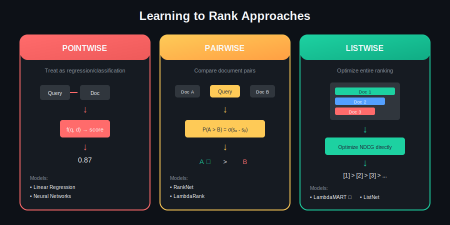
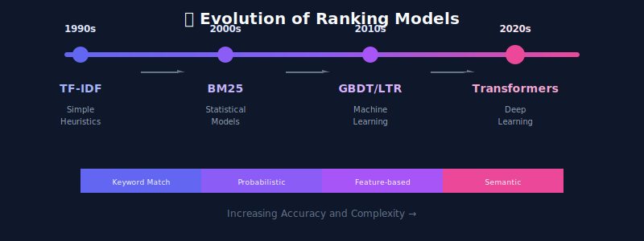
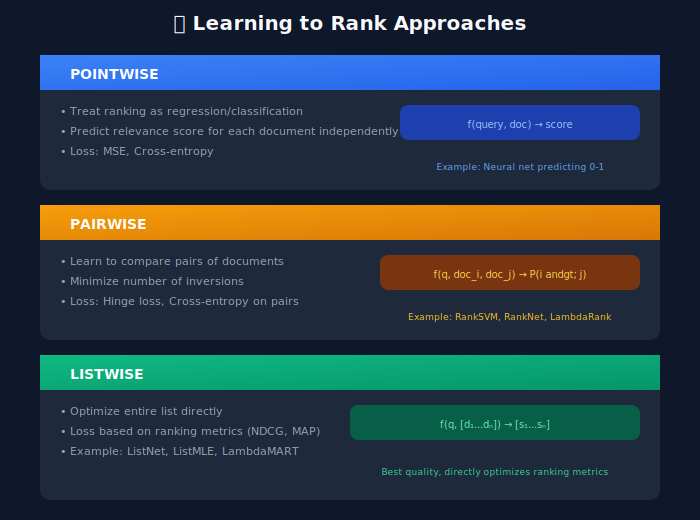

# Ranking Models: From Traditional to Deep Learning

## 📋 Table of Contents
1. [Introduction](#introduction)
2. [Learning to Rank Overview](#learning-to-rank-overview)
3. [Pointwise Models](#pointwise-models)
4. [Pairwise Models](#pairwise-models)
5. [Listwise Models](#listwise-models)
6. [Gradient Boosted Trees](#gradient-boosted-trees)
7. [Neural Ranking Models](#neural-ranking-models)
8. [Transformer-Based Rankers](#transformer-based-rankers)
9. [Model Comparison](#model-comparison)

---

<p align="center">
  
</p>

---

## Introduction

Ranking models are the core ML component that scores and orders documents by relevance. The evolution has gone from simple heuristics to sophisticated neural networks.



---

## Learning to Rank Overview

### The Three Approaches



---

## Pointwise Models

### Simple Regression Approach

```python
import torch
import torch.nn as nn
import numpy as np

class PointwiseRanker(nn.Module):
    """
    Simple pointwise ranking model
    Predicts relevance score for each query-document pair
    """

    def __init__(self, input_dim: int, hidden_dims: List[int] = [256, 128, 64]):
        super().__init__()

        layers = []
        prev_dim = input_dim

        for hidden_dim in hidden_dims:
            layers.extend([
                nn.Linear(prev_dim, hidden_dim),
                nn.BatchNorm1d(hidden_dim),
                nn.ReLU(),
                nn.Dropout(0.2)
            ])
            prev_dim = hidden_dim

        layers.append(nn.Linear(prev_dim, 1))
        layers.append(nn.Sigmoid())  # Output 0-1

        self.network = nn.Sequential(*layers)

    def forward(self, features: torch.Tensor) -> torch.Tensor:
        """
        Args:
            features: [batch_size, input_dim] feature tensor
        Returns:
            scores: [batch_size, 1] relevance scores
        """
        return self.network(features)

class PointwiseTrainer:
    """
    Train pointwise ranking model
    """

    def __init__(self, model: PointwiseRanker, lr: float = 1e-3):
        self.model = model
        self.optimizer = torch.optim.Adam(model.parameters(), lr=lr)
        self.criterion = nn.BCELoss()  # Binary cross-entropy

    def train_epoch(self, dataloader: DataLoader) -> float:
        self.model.train()
        total_loss = 0

        for features, labels in dataloader:
            self.optimizer.zero_grad()

            predictions = self.model(features)
            loss = self.criterion(predictions.squeeze(), labels.float())

            loss.backward()
            self.optimizer.step()

            total_loss += loss.item()

        return total_loss / len(dataloader)
```

---

## Pairwise Models

### RankNet Implementation

```python
class RankNet(nn.Module):
    """
    RankNet: Learning to Rank using Neural Networks

    Key idea: Model probability that doc_i should be ranked higher than doc_j
    P(i > j) = sigmoid(s_i - s_j)
    """

    def __init__(self, input_dim: int, hidden_dims: List[int] = [256, 128]):
        super().__init__()

        layers = []
        prev_dim = input_dim

        for hidden_dim in hidden_dims:
            layers.extend([
                nn.Linear(prev_dim, hidden_dim),
                nn.ReLU(),
                nn.Dropout(0.2)
            ])
            prev_dim = hidden_dim

        layers.append(nn.Linear(prev_dim, 1))
        self.scorer = nn.Sequential(*layers)

    def forward(self, x: torch.Tensor) -> torch.Tensor:
        """Score a single document"""
        return self.scorer(x)

    def forward_pair(
        self,
        x_i: torch.Tensor,
        x_j: torch.Tensor
    ) -> torch.Tensor:
        """
        Compute probability that doc_i > doc_j
        """
        s_i = self.scorer(x_i)
        s_j = self.scorer(x_j)
        return torch.sigmoid(s_i - s_j)

class RankNetLoss(nn.Module):
    """
    RankNet cross-entropy loss

    For pairs where doc_i is more relevant than doc_j:
    L = -log(P(i > j)) = -log(sigmoid(s_i - s_j))
    """

    def forward(
        self,
        scores_i: torch.Tensor,
        scores_j: torch.Tensor,
        labels: torch.Tensor  # 1 if i > j, 0 otherwise
    ) -> torch.Tensor:

        # P(i > j)
        p_ij = torch.sigmoid(scores_i - scores_j)

        # Cross entropy
        loss = -labels * torch.log(p_ij + 1e-10) - (1 - labels) * torch.log(1 - p_ij + 1e-10)

        return loss.mean()
```

### LambdaRank

```python
class LambdaRank(nn.Module):
    """
    LambdaRank: Speed up RankNet by directly optimizing NDCG

    Key insight: Weight gradients by change in NDCG (|ΔNDCG|)
    This focuses learning on pairs that matter most for ranking quality
    """

    def __init__(self, input_dim: int, hidden_dims: List[int] = [256, 128]):
        super().__init__()

        layers = []
        prev_dim = input_dim

        for hidden_dim in hidden_dims:
            layers.extend([
                nn.Linear(prev_dim, hidden_dim),
                nn.ReLU(),
            ])
            prev_dim = hidden_dim

        layers.append(nn.Linear(prev_dim, 1))
        self.scorer = nn.Sequential(*layers)

    def forward(self, x: torch.Tensor) -> torch.Tensor:
        return self.scorer(x).squeeze(-1)

    def compute_lambdas(
        self,
        scores: torch.Tensor,
        relevance: torch.Tensor,
        sigma: float = 1.0
    ) -> torch.Tensor:
        """
        Compute lambda gradients for LambdaRank

        Args:
            scores: [n_docs] predicted scores
            relevance: [n_docs] true relevance labels
            sigma: Scaling factor

        Returns:
            lambdas: [n_docs] gradient weights
        """
        n = len(scores)
        lambdas = torch.zeros(n)

        # Compute IDCG for normalization
        idcg = self._compute_dcg(torch.sort(relevance, descending=True)[0])

        # For each pair
        for i in range(n):
            for j in range(i + 1, n):
                if relevance[i] == relevance[j]:
                    continue

                # Determine which should be ranked higher
                if relevance[i] > relevance[j]:
                    high_idx, low_idx = i, j
                else:
                    high_idx, low_idx = j, i

                # Score difference
                s_diff = scores[high_idx] - scores[low_idx]

                # RankNet gradient
                rho = 1 / (1 + torch.exp(sigma * s_diff))

                # NDCG change if positions swapped
                delta_ndcg = self._compute_delta_ndcg(
                    relevance, high_idx, low_idx, idcg
                )

                # Lambda = rho * |ΔNDCG|
                lambda_ij = sigma * rho * torch.abs(delta_ndcg)

                # Accumulate gradients
                lambdas[high_idx] += lambda_ij
                lambdas[low_idx] -= lambda_ij

        return lambdas

    def _compute_dcg(self, relevance: torch.Tensor) -> torch.Tensor:
        """Compute DCG"""
        positions = torch.arange(1, len(relevance) + 1, dtype=torch.float)
        discounts = torch.log2(positions + 1)
        return torch.sum((2 ** relevance - 1) / discounts)

    def _compute_delta_ndcg(
        self,
        relevance: torch.Tensor,
        i: int,
        j: int,
        idcg: torch.Tensor
    ) -> torch.Tensor:
        """Compute NDCG change if positions i and j are swapped"""

        # Get current positions
        sorted_indices = torch.argsort(relevance, descending=True)

        pos_i = (sorted_indices == i).nonzero()[0].item() + 1
        pos_j = (sorted_indices == j).nonzero()[0].item() + 1

        # Gain difference
        gain_i = 2 ** relevance[i] - 1
        gain_j = 2 ** relevance[j] - 1

        # Discount difference
        disc_i = 1 / np.log2(pos_i + 1)
        disc_j = 1 / np.log2(pos_j + 1)

        # Delta = (gain_i - gain_j) * (1/log(pos_j+1) - 1/log(pos_i+1)) / IDCG
        delta = torch.abs(gain_i - gain_j) * torch.abs(disc_i - disc_j) / idcg

        return delta
```

---

## Listwise Models

### ListNet Implementation

```python
class ListNet(nn.Module):
    """
    ListNet: Listwise approach using Top-One probability distribution

    Key idea: Define probability distribution over permutations
    and minimize KL divergence between predicted and true distributions
    """

    def __init__(self, input_dim: int, hidden_dims: List[int] = [256, 128]):
        super().__init__()

        layers = []
        prev_dim = input_dim

        for hidden_dim in hidden_dims:
            layers.extend([
                nn.Linear(prev_dim, hidden_dim),
                nn.ReLU(),
            ])
            prev_dim = hidden_dim

        layers.append(nn.Linear(prev_dim, 1))
        self.scorer = nn.Sequential(*layers)

    def forward(self, features: torch.Tensor) -> torch.Tensor:
        """
        Args:
            features: [list_size, feature_dim] features for all docs in list
        Returns:
            scores: [list_size] relevance scores
        """
        return self.scorer(features).squeeze(-1)

    def top_one_probability(self, scores: torch.Tensor) -> torch.Tensor:
        """
        Compute top-one probability distribution
        P(d_i is top-1) = exp(s_i) / sum(exp(s_j))
        """
        return torch.softmax(scores, dim=0)

class ListNetLoss(nn.Module):
    """
    ListNet cross-entropy loss

    Minimize KL divergence between predicted and true top-one distributions
    """

    def forward(
        self,
        predicted_scores: torch.Tensor,
        true_relevance: torch.Tensor
    ) -> torch.Tensor:

        # Predicted top-one probability
        p_pred = torch.softmax(predicted_scores, dim=-1)

        # True top-one probability (from relevance scores)
        p_true = torch.softmax(true_relevance, dim=-1)

        # Cross-entropy loss
        loss = -torch.sum(p_true * torch.log(p_pred + 1e-10))

        return loss
```

---

## Gradient Boosted Trees

### LambdaMART (XGBoost/LightGBM)

```python
import lightgbm as lgb
import numpy as np

class LambdaMART:
    """
    LambdaMART: LambdaRank + MART (Multiple Additive Regression Trees)

    Industry standard for production ranking systems
    """

    def __init__(
        self,
        n_estimators: int = 300,
        learning_rate: float = 0.1,
        max_depth: int = 6,
        num_leaves: int = 31,
        min_child_samples: int = 20,
        subsample: float = 0.8,
        colsample_bytree: float = 0.8
    ):
        self.params = {
            'objective': 'lambdarank',
            'metric': 'ndcg',
            'ndcg_eval_at': [1, 3, 5, 10],
            'n_estimators': n_estimators,
            'learning_rate': learning_rate,
            'max_depth': max_depth,
            'num_leaves': num_leaves,
            'min_child_samples': min_child_samples,
            'subsample': subsample,
            'colsample_bytree': colsample_bytree,
            'verbose': -1
        }
        self.model = None

    def train(
        self,
        X_train: np.ndarray,
        y_train: np.ndarray,
        groups_train: np.ndarray,
        X_valid: np.ndarray = None,
        y_valid: np.ndarray = None,
        groups_valid: np.ndarray = None
    ):
        """
        Train LambdaMART model

        Args:
            X_train: [n_samples, n_features] training features
            y_train: [n_samples] relevance labels
            groups_train: [n_queries] number of docs per query
            X_valid: Validation features
            y_valid: Validation labels
            groups_valid: Validation groups
        """
        train_data = lgb.Dataset(
            X_train,
            label=y_train,
            group=groups_train
        )

        valid_sets = [train_data]
        valid_names = ['train']

        if X_valid is not None:
            valid_data = lgb.Dataset(
                X_valid,
                label=y_valid,
                group=groups_valid,
                reference=train_data
            )
            valid_sets.append(valid_data)
            valid_names.append('valid')

        self.model = lgb.train(
            self.params,
            train_data,
            valid_sets=valid_sets,
            valid_names=valid_names,
            callbacks=[
                lgb.early_stopping(50),
                lgb.log_evaluation(100)
            ]
        )

    def predict(self, X: np.ndarray) -> np.ndarray:
        """
        Predict relevance scores
        """
        return self.model.predict(X)

    def get_feature_importance(self) -> dict:
        """
        Get feature importance scores
        """
        importance = self.model.feature_importance(importance_type='gain')
        feature_names = self.model.feature_name()
        return dict(zip(feature_names, importance))

    def save(self, path: str):
        self.model.save_model(path)

    def load(self, path: str):
        self.model = lgb.Booster(model_file=path)

# Training example
def train_lambdamart_example():
    """Example of training LambdaMART for e-commerce search"""

    # Load data
    train_df = load_training_data()

    # Features and labels
    feature_columns = [
        'bm25_score', 'embedding_similarity', 'price', 'rating',
        'review_count', 'click_rate', 'purchase_rate', 'freshness'
    ]

    X_train = train_df[feature_columns].values
    y_train = train_df['relevance'].values

    # Groups (queries)
    groups_train = train_df.groupby('query_id').size().values

    # Train
    model = LambdaMART(
        n_estimators=500,
        learning_rate=0.05,
        max_depth=8
    )

    model.train(X_train, y_train, groups_train)

    # Evaluate
    print("Feature importance:")
    for feature, importance in sorted(
        model.get_feature_importance().items(),
        key=lambda x: x[1],
        reverse=True
    ):
        print(f"  {feature}: {importance:.4f}")

    return model
```

---

## Neural Ranking Models

### DSSM (Deep Structured Semantic Model)

```python
class DSSM(nn.Module):
    """
    DSSM: Deep Structured Semantic Models

    Two-tower architecture:
    - Query tower: Encodes query into embedding
    - Document tower: Encodes document into embedding
    - Similarity: Cosine similarity between embeddings
    """

    def __init__(
        self,
        vocab_size: int,
        embedding_dim: int = 128,
        hidden_dims: List[int] = [512, 256, 128]
    ):
        super().__init__()

        # Shared embedding layer
        self.embedding = nn.Embedding(vocab_size, embedding_dim)

        # Query tower
        self.query_tower = self._build_tower(embedding_dim, hidden_dims)

        # Document tower
        self.doc_tower = self._build_tower(embedding_dim, hidden_dims)

    def _build_tower(self, input_dim: int, hidden_dims: List[int]) -> nn.Module:
        layers = []
        prev_dim = input_dim

        for hidden_dim in hidden_dims:
            layers.extend([
                nn.Linear(prev_dim, hidden_dim),
                nn.Tanh(),
            ])
            prev_dim = hidden_dim

        return nn.Sequential(*layers)

    def encode_query(self, query_tokens: torch.Tensor) -> torch.Tensor:
        """Encode query to embedding"""

        # [batch, seq_len] -> [batch, seq_len, embed_dim]
        embedded = self.embedding(query_tokens)

        # Mean pooling
        pooled = embedded.mean(dim=1)

        # Through tower
        return self.query_tower(pooled)

    def encode_document(self, doc_tokens: torch.Tensor) -> torch.Tensor:
        """Encode document to embedding"""
        embedded = self.embedding(doc_tokens)
        pooled = embedded.mean(dim=1)
        return self.doc_tower(pooled)

    def forward(
        self,
        query_tokens: torch.Tensor,
        doc_tokens: torch.Tensor
    ) -> torch.Tensor:
        """
        Compute similarity score
        """
        query_emb = self.encode_query(query_tokens)
        doc_emb = self.encode_document(doc_tokens)

        # Cosine similarity
        query_norm = F.normalize(query_emb, p=2, dim=-1)
        doc_norm = F.normalize(doc_emb, p=2, dim=-1)

        similarity = (query_norm * doc_norm).sum(dim=-1)

        return similarity
```

### Interaction-Based Neural Ranker

```python
class InteractionRanker(nn.Module):
    """
    Interaction-based ranking model

    Unlike DSSM, this model captures fine-grained query-document interactions
    """

    def __init__(
        self,
        vocab_size: int,
        embedding_dim: int = 128,
        num_filters: int = 128,
        filter_sizes: List[int] = [1, 2, 3]
    ):
        super().__init__()

        self.embedding = nn.Embedding(vocab_size, embedding_dim)

        # Interaction matrix processing with CNNs
        self.convs = nn.ModuleList([
            nn.Conv2d(1, num_filters, (fs, embedding_dim))
            for fs in filter_sizes
        ])

        self.fc = nn.Linear(num_filters * len(filter_sizes), 1)

    def forward(
        self,
        query_tokens: torch.Tensor,
        doc_tokens: torch.Tensor
    ) -> torch.Tensor:

        # Embed
        query_emb = self.embedding(query_tokens)  # [B, Q, D]
        doc_emb = self.embedding(doc_tokens)      # [B, D, D]

        # Interaction matrix: query × document
        interaction = torch.bmm(query_emb, doc_emb.transpose(1, 2))  # [B, Q, D]
        interaction = interaction.unsqueeze(1)  # [B, 1, Q, D]

        # CNN processing
        conv_outputs = []
        for conv in self.convs:
            out = F.relu(conv(interaction))
            out = F.max_pool1d(out.squeeze(-1), out.size(2))
            conv_outputs.append(out.squeeze(-1))

        # Concatenate and score
        features = torch.cat(conv_outputs, dim=1)
        score = self.fc(features)

        return score.squeeze(-1)
```

---

## Transformer-Based Rankers

### BERT Cross-Encoder for Ranking

```python
from transformers import BertModel, BertTokenizer

class BERTRanker(nn.Module):
    """
    BERT-based cross-encoder for ranking

    Concatenates query and document, processes through BERT,
    and predicts relevance score
    """

    def __init__(self, model_name: str = 'bert-base-uncased'):
        super().__init__()

        self.bert = BertModel.from_pretrained(model_name)
        self.classifier = nn.Linear(768, 1)
        self.tokenizer = BertTokenizer.from_pretrained(model_name)

    def forward(
        self,
        input_ids: torch.Tensor,
        attention_mask: torch.Tensor,
        token_type_ids: torch.Tensor
    ) -> torch.Tensor:
        """
        Args:
            input_ids: [CLS] query [SEP] document [SEP]
            attention_mask: Mask for padding
            token_type_ids: 0 for query, 1 for document
        """
        outputs = self.bert(
            input_ids=input_ids,
            attention_mask=attention_mask,
            token_type_ids=token_type_ids
        )

        # Use [CLS] token representation
        cls_output = outputs.last_hidden_state[:, 0, :]

        # Predict relevance
        score = self.classifier(cls_output)

        return score.squeeze(-1)

    def encode_pair(self, query: str, document: str) -> dict:
        """Tokenize query-document pair"""
        return self.tokenizer(
            query,
            document,
            max_length=512,
            truncation=True,
            padding='max_length',
            return_tensors='pt'
        )

class BERTRankerTrainer:
    """Training loop for BERT ranker"""

    def __init__(self, model: BERTRanker, lr: float = 2e-5):
        self.model = model
        self.optimizer = torch.optim.AdamW(model.parameters(), lr=lr)
        self.loss_fn = nn.BCEWithLogitsLoss()

    def train_step(self, batch: dict) -> float:
        self.model.train()
        self.optimizer.zero_grad()

        scores = self.model(
            batch['input_ids'],
            batch['attention_mask'],
            batch['token_type_ids']
        )

        loss = self.loss_fn(scores, batch['labels'].float())
        loss.backward()

        torch.nn.utils.clip_grad_norm_(self.model.parameters(), 1.0)
        self.optimizer.step()

        return loss.item()
```

### ColBERT (Contextualized Late Interaction)

```python
class ColBERT(nn.Module):
    """
    ColBERT: Efficient passage retrieval via Contextualized Late Interaction

    Key innovation: Late interaction allows pre-computing document embeddings
    while maintaining fine-grained matching
    """

    def __init__(
        self,
        model_name: str = 'bert-base-uncased',
        dim: int = 128
    ):
        super().__init__()

        self.bert = BertModel.from_pretrained(model_name)
        self.linear = nn.Linear(768, dim)
        self.dim = dim

    def encode_query(
        self,
        input_ids: torch.Tensor,
        attention_mask: torch.Tensor
    ) -> torch.Tensor:
        """Encode query to contextualized embeddings"""
        outputs = self.bert(input_ids, attention_mask)
        embeddings = outputs.last_hidden_state

        # Project to lower dimension
        embeddings = self.linear(embeddings)

        # Normalize
        embeddings = F.normalize(embeddings, p=2, dim=-1)

        return embeddings  # [batch, query_len, dim]

    def encode_document(
        self,
        input_ids: torch.Tensor,
        attention_mask: torch.Tensor
    ) -> torch.Tensor:
        """Encode document to contextualized embeddings"""
        outputs = self.bert(input_ids, attention_mask)
        embeddings = outputs.last_hidden_state

        embeddings = self.linear(embeddings)
        embeddings = F.normalize(embeddings, p=2, dim=-1)

        return embeddings  # [batch, doc_len, dim]

    def score(
        self,
        query_embeddings: torch.Tensor,
        doc_embeddings: torch.Tensor,
        query_mask: torch.Tensor
    ) -> torch.Tensor:
        """
        Late interaction scoring

        For each query token, find max similarity to any doc token
        Sum over all query tokens
        """

        # [batch, query_len, doc_len]
        similarity = torch.bmm(query_embeddings, doc_embeddings.transpose(1, 2))

        # Max over document tokens
        max_sim = similarity.max(dim=-1).values  # [batch, query_len]

        # Mask and sum over query tokens
        max_sim = max_sim * query_mask
        score = max_sim.sum(dim=-1)

        return score
```

---

## Model Comparison


---

## Key Takeaways

1. **LambdaMART is the industry workhorse** - Fast, interpretable, works well with hundreds of features

2. **Neural models excel with text** - BERT-based models capture semantic nuances

3. **Trade-off: Quality vs Speed** - Cross-encoders are accurate but slow; use in re-ranking stage

4. **Ensemble often wins** - Combine GBDT + Neural for best results

---

## Next Steps

Continue to:
- [06_training_pipeline](../06_training_pipeline/README.md) - Training infrastructure
- [07_serving_infrastructure](../07_serving_infrastructure/README.md) - Production serving

---

*Last Updated: January 2026*

---

<div align="center">

**[⬆ Back to Top](#)** | **[📚 Main Repository](https://github.com/Gaurav14cs17/ml_system_design)**

Made with 💜 by [Gaurav14cs17](https://github.com/Gaurav14cs17)

</div>
