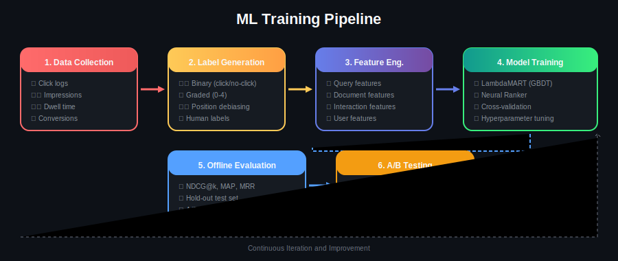
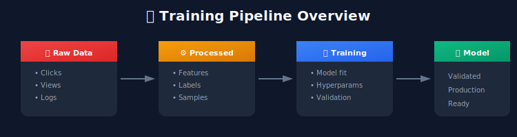

# Training Pipeline: From Data to Models

## 📋 Table of Contents
1. [Introduction](#introduction)
2. [Training Data Collection](#training-data-collection)
3. [Label Generation](#label-generation)
4. [Data Processing Pipeline](#data-processing-pipeline)
5. [Training Infrastructure](#training-infrastructure)
6. [Experiment Management](#experiment-management)
7. [Model Validation](#model-validation)

---

<p align="center">
  
</p>

---

## Introduction

The training pipeline is the backbone of any ML ranking system. It transforms raw user interaction data into trained models ready for production.



---

## Training Data Collection

### Click Log Schema

```python
from dataclasses import dataclass
from datetime import datetime
from typing import List, Optional

@dataclass
class SearchEvent:
    """A single search event from logs"""

    # Identifiers
    session_id: str
    query_id: str
    user_id: Optional[str]

    # Query information
    query: str
    query_timestamp: datetime

    # Results shown
    results: List[ResultImpression]

    # Context
    device: str
    location: str

@dataclass
class ResultImpression:
    """A single result impression"""

    position: int
    document_id: str
    score: float

    # Interaction
    clicked: bool
    click_timestamp: Optional[datetime]
    dwell_time_seconds: Optional[float]

    # Outcome (for e-commerce)
    added_to_cart: bool
    purchased: bool

class ClickLogCollector:
    """Collect and process click logs"""

    def __init__(self, kafka_config: dict):
        self.consumer = KafkaConsumer(**kafka_config)
        self.storage = DataLakeStorage()

    def collect_logs(self, date: str):
        """Collect click logs for a specific date"""

        events = []
        for message in self.consumer.consume(topic='search_events'):
            event = self._parse_event(message)
            if event.query_timestamp.strftime('%Y-%m-%d') == date:
                events.append(event)

        # Store in data lake
        self.storage.write_parquet(
            events,
            path=f"s3://data-lake/click_logs/date={date}/"
        )

        return len(events)
```

### Handling Position Bias

```python
class PositionBiasHandler:
    """
    Handle position bias in click data

    Problem: Items at top positions get more clicks regardless of relevance
    Solution: Propensity weighting or randomization
    """

    def __init__(self):

        # Estimated click propensity by position
        self.position_propensity = {
            1: 1.0, 2: 0.65, 3: 0.45, 4: 0.35, 5: 0.28,
            6: 0.22, 7: 0.18, 8: 0.15, 9: 0.12, 10: 0.10
        }

    def apply_inverse_propensity_weighting(
        self,
        samples: List[TrainingSample]
    ) -> List[TrainingSample]:
        """
        Weight samples by inverse propensity
        """
        weighted_samples = []

        for sample in samples:
            position = sample.position
            propensity = self.position_propensity.get(position, 0.1)

            # Inverse propensity weight
            sample.weight = 1.0 / propensity
            weighted_samples.append(sample)

        return weighted_samples

    def debias_with_randomization(
        self,
        results: List[Document],
        exploration_rate: float = 0.1
    ) -> List[Document]:
        """
        Add randomization to collect unbiased data
        """
        import random

        if random.random() < exploration_rate:

            # Randomly shuffle some results
            top_k = min(10, len(results))
            shuffled_indices = random.sample(range(top_k), top_k)

            new_results = [results[i] for i in shuffled_indices]
            new_results.extend(results[top_k:])

            return new_results, True  # Mark as exploration

        return results, False
```

---

## Label Generation

### Label Generation Strategies

```python
class LabelGenerator:
    """
    Generate relevance labels from implicit feedback
    """

    def __init__(self, config: dict):
        self.click_weight = config.get('click_weight', 1.0)
        self.purchase_weight = config.get('purchase_weight', 5.0)
        self.dwell_threshold = config.get('dwell_threshold', 30)  # seconds

    def generate_binary_labels(self, events: List[SearchEvent]) -> List[TrainingSample]:
        """
        Binary labels: clicked = 1, not clicked = 0
        """
        samples = []

        for event in events:
            for result in event.results:
                sample = TrainingSample(
                    query_id=event.query_id,
                    query=event.query,
                    document_id=result.document_id,
                    position=result.position,
                    label=1.0 if result.clicked else 0.0
                )
                samples.append(sample)

        return samples

    def generate_graded_labels(self, events: List[SearchEvent]) -> List[TrainingSample]:
        """
        Graded labels based on engagement depth

        0: Not clicked
        1: Clicked, short dwell
        2: Clicked, long dwell
        3: Added to cart
        4: Purchased
        """
        samples = []

        for event in events:
            for result in event.results:
                label = self._compute_graded_label(result)

                sample = TrainingSample(
                    query_id=event.query_id,
                    query=event.query,
                    document_id=result.document_id,
                    position=result.position,
                    label=label
                )
                samples.append(sample)

        return samples

    def _compute_graded_label(self, result: ResultImpression) -> float:
        """Compute graded relevance label"""
        if result.purchased:
            return 4.0
        elif result.added_to_cart:
            return 3.0
        elif result.clicked:
            if result.dwell_time_seconds and result.dwell_time_seconds > self.dwell_threshold:
                return 2.0
            else:
                return 1.0
        else:
            return 0.0

class HumanLabelCollection:
    """
    Collect human judgments for evaluation
    """

    def __init__(self, labeling_platform: str):
        self.platform = labeling_platform

    def create_labeling_task(
        self,
        query_doc_pairs: List[tuple],
        instructions: str
    ) -> str:
        """Create a labeling task on crowdsourcing platform"""

        task = {
            "instructions": instructions,
            "labels": [
                {"value": 4, "label": "Perfect", "description": "Exactly what user wants"},
                {"value": 3, "label": "Excellent", "description": "Highly relevant"},
                {"value": 2, "label": "Good", "description": "Relevant but not ideal"},
                {"value": 1, "label": "Fair", "description": "Marginally relevant"},
                {"value": 0, "label": "Bad", "description": "Not relevant"}
            ],
            "pairs": query_doc_pairs
        }

        # Submit to labeling platform
        task_id = self.platform.create_task(task)
        return task_id

    def aggregate_labels(
        self,
        task_id: str,
        min_agreement: float = 0.6
    ) -> List[dict]:
        """Aggregate labels from multiple raters"""

        raw_labels = self.platform.get_results(task_id)

        aggregated = []
        for pair_id, labels in raw_labels.items():

            # Calculate agreement
            label_counts = Counter(labels)
            most_common_label, count = label_counts.most_common(1)[0]
            agreement = count / len(labels)

            if agreement >= min_agreement:
                aggregated.append({
                    'pair_id': pair_id,
                    'label': most_common_label,
                    'agreement': agreement,
                    'num_raters': len(labels)
                })

        return aggregated
```

---

## Data Processing Pipeline

### Apache Spark Pipeline

```python
from pyspark.sql import SparkSession
from pyspark.sql import functions as F
from pyspark.ml.feature import VectorAssembler

class TrainingDataPipeline:
    """
    Spark-based training data pipeline
    """

    def __init__(self, spark: SparkSession):
        self.spark = spark
        self.feature_store = FeatureStoreClient()

    def build_training_data(
        self,
        start_date: str,
        end_date: str,
        output_path: str
    ):
        """Build training dataset from click logs"""

        # 1. Load click logs
        clicks_df = self.spark.read.parquet(
            f"s3://data-lake/click_logs/date>={start_date}/date<={end_date}/"
        )

        # 2. Generate labels
        labeled_df = self._generate_labels(clicks_df)

        # 3. Join with features
        features_df = self._join_features(labeled_df)

        # 4. Handle position bias
        weighted_df = self._apply_position_weighting(features_df)

        # 5. Create training format
        training_df = self._create_training_format(weighted_df)

        # 6. Save
        training_df.write.parquet(output_path)

        return training_df.count()

    def _generate_labels(self, clicks_df):
        """Generate relevance labels"""

        return clicks_df.withColumn(
            "label",
            F.when(F.col("purchased"), 4.0)
            .when(F.col("added_to_cart"), 3.0)
            .when(F.col("clicked") & (F.col("dwell_time") > 30), 2.0)
            .when(F.col("clicked"), 1.0)
            .otherwise(0.0)
        )

    def _join_features(self, labeled_df):
        """Join with pre-computed features"""

        # Query features
        query_features = self.spark.read.parquet(
            "s3://feature-store/query_features/"
        )

        # Document features
        doc_features = self.spark.read.parquet(
            "s3://feature-store/document_features/"
        )

        # Join
        df = labeled_df.join(
            query_features, "query_id", "left"
        ).join(
            doc_features, "document_id", "left"
        )

        return df

    def _apply_position_weighting(self, df):
        """Apply inverse propensity weighting"""

        position_weights = {
            1: 1.0, 2: 1.54, 3: 2.22, 4: 2.86, 5: 3.57,
            6: 4.55, 7: 5.56, 8: 6.67, 9: 8.33, 10: 10.0
        }

        # Create weight column
        weight_expr = F.lit(10.0)  # Default
        for pos, weight in position_weights.items():
            weight_expr = F.when(F.col("position") == pos, weight).otherwise(weight_expr)

        return df.withColumn("sample_weight", weight_expr)

    def _create_training_format(self, df):
        """Create final training format"""

        feature_columns = [
            "bm25_score", "embedding_sim", "title_match",
            "doc_popularity", "doc_freshness", "doc_quality",
            "query_length", "query_popularity",
            "user_preference_match", "price_match"
        ]

        # Assemble feature vector
        assembler = VectorAssembler(
            inputCols=feature_columns,
            outputCol="features"
        )

        df = assembler.transform(df)

        return df.select(
            "query_id",
            "document_id",
            "features",
            "label",
            "sample_weight"
        )
```

---

## Training Infrastructure

### Distributed Training with PyTorch

```python
import torch.distributed as dist
from torch.nn.parallel import DistributedDataParallel as DDP

class DistributedTrainer:
    """
    Distributed training for neural ranking models
    """

    def __init__(
        self,
        model: nn.Module,
        train_dataset: Dataset,
        config: dict
    ):
        self.config = config

        # Initialize distributed
        dist.init_process_group(backend='nccl')
        self.rank = dist.get_rank()
        self.world_size = dist.get_world_size()

        # Model
        self.device = torch.device(f'cuda:{self.rank}')
        self.model = model.to(self.device)
        self.model = DDP(self.model, device_ids=[self.rank])

        # Data
        self.sampler = DistributedSampler(
            train_dataset,
            num_replicas=self.world_size,
            rank=self.rank
        )
        self.dataloader = DataLoader(
            train_dataset,
            batch_size=config['batch_size'],
            sampler=self.sampler,
            num_workers=4
        )

        # Optimizer
        self.optimizer = torch.optim.AdamW(
            self.model.parameters(),
            lr=config['learning_rate']
        )

        # Learning rate scheduler
        self.scheduler = torch.optim.lr_scheduler.CosineAnnealingLR(
            self.optimizer,
            T_max=config['num_epochs']
        )

    def train(self):
        """Main training loop"""

        for epoch in range(self.config['num_epochs']):
            self.sampler.set_epoch(epoch)
            self.model.train()

            epoch_loss = 0
            for batch in self.dataloader:
                loss = self._train_step(batch)
                epoch_loss += loss

            # Synchronize metrics across processes
            avg_loss = self._reduce_metric(epoch_loss / len(self.dataloader))

            if self.rank == 0:
                print(f"Epoch {epoch}: Loss = {avg_loss:.4f}")
                self._save_checkpoint(epoch)

            self.scheduler.step()

    def _train_step(self, batch):
        self.optimizer.zero_grad()

        features = batch['features'].to(self.device)
        labels = batch['labels'].to(self.device)

        outputs = self.model(features)
        loss = self.criterion(outputs, labels)

        loss.backward()
        self.optimizer.step()

        return loss.item()

    def _reduce_metric(self, metric):
        tensor = torch.tensor(metric).to(self.device)
        dist.all_reduce(tensor, op=dist.ReduceOp.SUM)
        return tensor.item() / self.world_size

    def _save_checkpoint(self, epoch):
        checkpoint = {
            'epoch': epoch,
            'model_state_dict': self.model.module.state_dict(),
            'optimizer_state_dict': self.optimizer.state_dict(),
        }
        torch.save(checkpoint, f"checkpoint_epoch_{epoch}.pt")
```

---

## Experiment Management

### MLflow Integration

```python
import mlflow
from mlflow.tracking import MlflowClient

class ExperimentManager:
    """Manage ranking model experiments"""

    def __init__(self, experiment_name: str):
        self.experiment_name = experiment_name
        mlflow.set_experiment(experiment_name)
        self.client = MlflowClient()

    def start_run(self, run_name: str, params: dict):
        """Start a new experiment run"""

        run = mlflow.start_run(run_name=run_name)

        # Log parameters
        mlflow.log_params(params)

        return run

    def log_metrics(self, metrics: dict, step: int = None):
        """Log metrics"""
        for name, value in metrics.items():
            mlflow.log_metric(name, value, step=step)

    def log_model(self, model, artifact_path: str):
        """Log trained model"""
        mlflow.pytorch.log_model(model, artifact_path)

    def end_run(self):
        mlflow.end_run()

    def get_best_model(self, metric: str = "ndcg@10"):
        """Get best model from experiment"""

        experiment = self.client.get_experiment_by_name(self.experiment_name)
        runs = self.client.search_runs(
            experiment_ids=[experiment.experiment_id],
            order_by=[f"metrics.{metric} DESC"],
            max_results=1
        )

        if runs:
            best_run = runs[0]
            model_uri = f"runs:/{best_run.info.run_id}/model"
            return mlflow.pytorch.load_model(model_uri)

        return None
```

---

## Model Validation

### Offline Evaluation

```python
class OfflineEvaluator:
    """Evaluate ranking models offline"""

    def __init__(self):
        self.metrics = {
            'ndcg@1': lambda y_true, y_pred: self._ndcg(y_true, y_pred, k=1),
            'ndcg@5': lambda y_true, y_pred: self._ndcg(y_true, y_pred, k=5),
            'ndcg@10': lambda y_true, y_pred: self._ndcg(y_true, y_pred, k=10),
            'map': self._map,
            'mrr': self._mrr
        }

    def evaluate(
        self,
        model,
        test_data: List[dict]
    ) -> dict:
        """Evaluate model on test data"""

        results = {metric: [] for metric in self.metrics}

        for query_data in test_data:

            # Get predictions
            features = query_data['features']
            true_labels = query_data['labels']

            scores = model.predict(features)

            # Calculate metrics
            for metric_name, metric_fn in self.metrics.items():
                value = metric_fn(true_labels, scores)
                results[metric_name].append(value)

        # Average across queries
        return {
            metric: np.mean(values)
            for metric, values in results.items()
        }

    def _ndcg(self, y_true, y_pred, k):
        """Calculate NDCG@k"""

        # Get ranking
        ranking = np.argsort(y_pred)[::-1][:k]

        # DCG
        dcg = sum(
            (2 ** y_true[idx] - 1) / np.log2(i + 2)
            for i, idx in enumerate(ranking)
        )

        # IDCG
        ideal_ranking = np.argsort(y_true)[::-1][:k]
        idcg = sum(
            (2 ** y_true[idx] - 1) / np.log2(i + 2)
            for i, idx in enumerate(ideal_ranking)
        )

        return dcg / idcg if idcg > 0 else 0.0
```

---

## Key Takeaways

1. **Data Quality > Quantity**: Clean, well-labeled data matters more than volume
2. **Handle Position Bias**: Use IPW or randomization to debias
3. **Experiment Tracking**: Always track experiments systematically
4. **Validate Thoroughly**: Offline metrics + human evaluation + online A/B tests

---

## Next Steps

- [07_serving_infrastructure](../07_serving_infrastructure/README.md) - Serving at scale
- [08_evaluation_metrics](../08_evaluation_metrics/README.md) - Comprehensive evaluation

---

*Last Updated: January 2026*

---

<div align="center">

**[⬆ Back to Top](#)** | **[📚 Main Repository](https://github.com/Gaurav14cs17/ml_system_design)**

Made with 💜 by [Gaurav14cs17](https://github.com/Gaurav14cs17)

</div>
