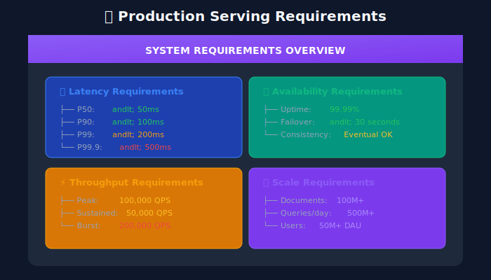
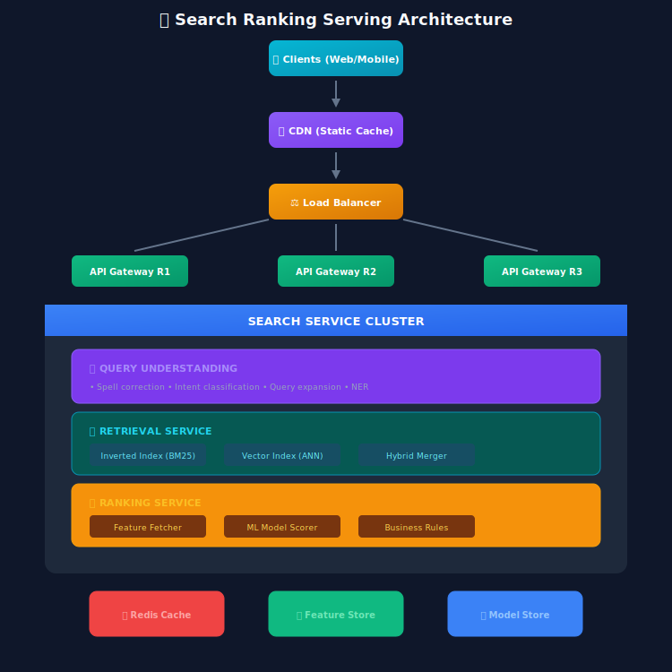
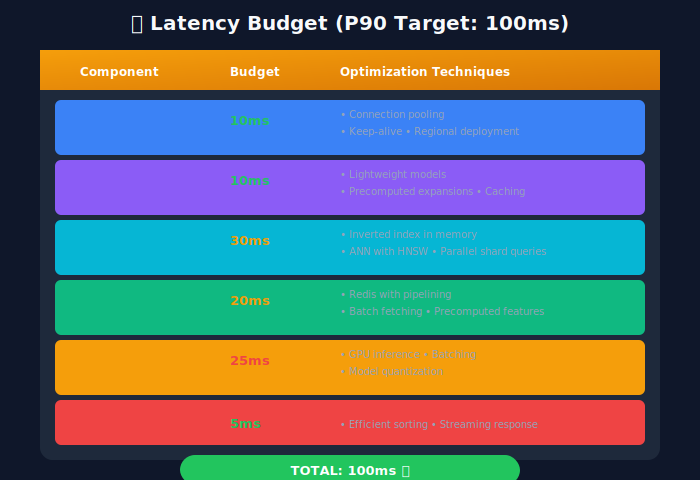

# Serving Infrastructure: Production at Scale

## 📋 Table of Contents
1. [Introduction](#introduction)
2. [System Architecture](#system-architecture)
3. [Real-Time Serving](#real-time-serving)
4. [Caching Strategies](#caching-strategies)
5. [Load Balancing](#load-balancing)
6. [Model Serving](#model-serving)
7. [Latency Optimization](#latency-optimization)
8. [Monitoring & Alerting](#monitoring-alerting)

---

<p align="center">
  
</p>

---

## Introduction

Serving infrastructure is where all the ML work meets reality. A ranking system must serve millions of queries per day with sub-100ms latency while maintaining high availability.



---

## System Architecture

### Complete Serving Architecture



---

## Real-Time Serving

### Search Service Implementation

```python
from fastapi import FastAPI, HTTPException
from pydantic import BaseModel
from typing import List, Optional
import asyncio

app = FastAPI()

class SearchRequest(BaseModel):
    query: str
    user_id: Optional[str] = None
    page: int = 1
    page_size: int = 10
    filters: Optional[dict] = None

class SearchResult(BaseModel):
    document_id: str
    title: str
    snippet: str
    score: float
    metadata: dict

class SearchResponse(BaseModel):
    query: str
    results: List[SearchResult]
    total_results: int
    latency_ms: float

class SearchService:
    """Main search service orchestrator"""

    def __init__(self):
        self.query_understanding = QueryUnderstandingService()
        self.retrieval = RetrievalService()
        self.ranking = RankingService()
        self.cache = CacheService()

    async def search(self, request: SearchRequest) -> SearchResponse:
        start_time = time.time()

        # Check cache
        cache_key = self._build_cache_key(request)
        cached = await self.cache.get(cache_key)
        if cached:
            return cached

        # 1. Query Understanding (parallel operations)
        query_result = await self.query_understanding.process(request.query)

        # 2. Retrieval (get candidates)
        candidates = await self.retrieval.retrieve(
            query=query_result,
            filters=request.filters,
            limit=1000
        )

        # 3. Ranking (ML scoring)
        ranked_results = await self.ranking.rank(
            query=query_result,
            candidates=candidates,
            user_id=request.user_id
        )

        # 4. Pagination
        start_idx = (request.page - 1) * request.page_size
        end_idx = start_idx + request.page_size
        page_results = ranked_results[start_idx:end_idx]

        # Build response
        response = SearchResponse(
            query=request.query,
            results=page_results,
            total_results=len(ranked_results),
            latency_ms=(time.time() - start_time) * 1000
        )

        # Cache response
        await self.cache.set(cache_key, response, ttl=300)

        return response

@app.post("/search", response_model=SearchResponse)
async def search_endpoint(request: SearchRequest):
    service = SearchService()
    return await service.search(request)

```

### Parallel Processing

```python
class ParallelSearchService:
    """
    Execute independent operations in parallel
    """

    async def search_with_parallel_processing(
        self,
        request: SearchRequest
    ) -> SearchResponse:
        """
        Parallelize independent operations for faster response
        """
        # Phase 1: Query understanding + feature prefetch (parallel)
        query_task = asyncio.create_task(
            self.query_understanding.process(request.query)
        )
        user_features_task = asyncio.create_task(
            self.feature_store.get_user_features(request.user_id)
        ) if request.user_id else None

        query_result = await query_task
        user_features = await user_features_task if user_features_task else None

        # Phase 2: Dual retrieval (parallel)
        bm25_task = asyncio.create_task(
            self.inverted_index.search(query_result, limit=500)
        )
        vector_task = asyncio.create_task(
            self.vector_index.search(query_result.embedding, limit=500)
        )

        bm25_results, vector_results = await asyncio.gather(
            bm25_task, vector_task
        )

        # Merge results
        candidates = self._merge_candidates(bm25_results, vector_results)

        # Phase 3: Feature fetching + ranking (parallel feature fetch)
        doc_ids = [c.doc_id for c in candidates]

        doc_features_task = asyncio.create_task(
            self.feature_store.get_document_features(doc_ids)
        )
        interaction_features_task = asyncio.create_task(
            self.feature_store.get_interaction_features(
                query_result.query, doc_ids
            )
        )

        doc_features, interaction_features = await asyncio.gather(
            doc_features_task, interaction_features_task
        )

        # Rank
        ranked = await self.ranker.score(
            candidates,
            doc_features,
            interaction_features,
            user_features
        )

        return ranked

```

---

## Caching Strategies

### Multi-Level Cache

```python
class CacheService:
    """
    Multi-level caching for search

    L1: In-memory (process-local) - ~1ms
    L2: Redis cluster - ~5ms
    L3: CDN edge cache - ~20ms (for static results)
    """

    def __init__(self):
        self.l1_cache = LRUCache(maxsize=10000)  # In-memory
        self.l2_cache = RedisCluster()  # Distributed
        self.l3_cache = CDNClient()  # Edge cache

    async def get(self, key: str) -> Optional[any]:
        """Get from cache, trying each level"""

        # L1: In-memory
        if key in self.l1_cache:
            return self.l1_cache[key]

        # L2: Redis
        value = await self.l2_cache.get(key)
        if value:
            self.l1_cache[key] = value  # Populate L1
            return value

        return None

    async def set(
        self,
        key: str,
        value: any,
        ttl: int = 300
    ):
        """Set in cache at all levels"""

        # L1: In-memory
        self.l1_cache[key] = value

        # L2: Redis
        await self.l2_cache.set(key, value, ttl=ttl)

class QueryResultCache:
    """
    Specialized cache for query results
    """

    def __init__(self, redis_client):
        self.redis = redis_client

        # Cache configuration by query type
        self.cache_config = {
            'navigational': {'ttl': 3600, 'cache': True},   # 1 hour
            'informational': {'ttl': 1800, 'cache': True},  # 30 min
            'transactional': {'ttl': 300, 'cache': True},   # 5 min
            'personalized': {'ttl': 0, 'cache': False}      # Don't cache
        }

    def should_cache(self, query_result) -> bool:
        """Determine if result should be cached"""

        config = self.cache_config.get(
            query_result.intent,
            {'cache': True, 'ttl': 300}
        )
        return config['cache']

    def get_ttl(self, query_result) -> int:
        """Get TTL based on query type"""

        config = self.cache_config.get(
            query_result.intent,
            {'ttl': 300}
        )
        return config['ttl']

    def build_cache_key(self, request: SearchRequest) -> str:
        """Build deterministic cache key"""

        key_parts = [
            'search',
            hashlib.md5(request.query.encode()).hexdigest(),
            str(request.page),
            str(request.page_size)
        ]

        if request.filters:
            filter_str = json.dumps(request.filters, sort_keys=True)
            key_parts.append(hashlib.md5(filter_str.encode()).hexdigest())

        return ':'.join(key_parts)

```

---

## Load Balancing

### Intelligent Load Balancing

```python
class SearchLoadBalancer:
    """
    Load balancer with search-specific logic
    """

    def __init__(self, backends: List[str]):
        self.backends = backends
        self.backend_health = {b: True for b in backends}
        self.backend_latency = {b: 0.0 for b in backends}
        self.backend_load = {b: 0 for b in backends}

    async def route_request(self, request: SearchRequest) -> str:
        """
        Route request to best backend
        """
        healthy_backends = [
            b for b in self.backends
            if self.backend_health[b]
        ]

        if not healthy_backends:
            raise Exception("No healthy backends")

        # Weighted selection based on latency and load
        weights = []
        for backend in healthy_backends:
            latency_weight = 1 / (self.backend_latency[backend] + 1)
            load_weight = 1 / (self.backend_load[backend] + 1)
            weights.append(latency_weight * load_weight)

        # Normalize
        total = sum(weights)
        weights = [w / total for w in weights]

        # Select
        selected = random.choices(healthy_backends, weights=weights)[0]

        # Update load
        self.backend_load[selected] += 1

        return selected

    async def health_check(self):
        """Periodic health check"""

        while True:
            for backend in self.backends:
                try:
                    start = time.time()
                    response = await self._ping(backend)
                    latency = time.time() - start

                    self.backend_health[backend] = response.status == 200
                    self.backend_latency[backend] = latency

                except Exception:
                    self.backend_health[backend] = False

            await asyncio.sleep(5)  # Check every 5 seconds

```

---

## Model Serving

### TensorFlow Serving Integration

```python
import grpc
from tensorflow_serving.apis import predict_pb2
from tensorflow_serving.apis import prediction_service_pb2_grpc

class ModelServingClient:
    """Client for TensorFlow Serving"""

    def __init__(self, server_address: str):
        self.channel = grpc.insecure_channel(server_address)
        self.stub = prediction_service_pb2_grpc.PredictionServiceStub(
            self.channel
        )

    async def predict(
        self,
        features: np.ndarray,
        model_name: str = "ranking_model",
        model_version: int = None
    ) -> np.ndarray:
        """Get model predictions"""

        request = predict_pb2.PredictRequest()
        request.model_spec.name = model_name

        if model_version:
            request.model_spec.version.value = model_version

        # Set input tensor
        request.inputs['features'].CopyFrom(
            tf.make_tensor_proto(features, dtype=tf.float32)
        )

        # Call model
        response = await asyncio.get_event_loop().run_in_executor(
            None,
            lambda: self.stub.Predict(request, timeout=0.1)
        )

        # Parse output
        scores = tf.make_ndarray(response.outputs['scores'])

        return scores

class RankingService:
    """Ranking service with model serving"""

    def __init__(self):
        self.model_client = ModelServingClient("localhost:8501")
        self.feature_store = FeatureStoreClient()

        # Model configuration
        self.primary_model = "ranking_v2"
        self.fallback_model = "ranking_v1"

    async def rank(
        self,
        query,
        candidates: List[Document],
        user_id: str = None
    ) -> List[RankedResult]:
        """Rank candidates using ML model"""

        # Get features
        features = await self.feature_store.get_features(
            query=query.text,
            document_ids=[c.id for c in candidates],
            user_id=user_id
        )

        # Build feature matrix
        feature_matrix = self._build_feature_matrix(features)

        # Get predictions
        try:
            scores = await self.model_client.predict(
                feature_matrix,
                model_name=self.primary_model
            )
        except Exception as e:
            # Fallback to simpler model
            logging.warning(f"Primary model failed: {e}")
            scores = await self.model_client.predict(
                feature_matrix,
                model_name=self.fallback_model
            )

        # Combine with candidates
        ranked = [
            RankedResult(document=c, score=s)
            for c, s in zip(candidates, scores)
        ]

        # Sort by score
        ranked.sort(key=lambda x: x.score, reverse=True)

        return ranked

```

---

## Latency Optimization

### Latency Budget Breakdown



### Optimization Techniques

```python
class LatencyOptimizer:
    """Collection of latency optimization techniques"""

    def __init__(self):
        self.connection_pool = ConnectionPool(max_size=100)
        self.batch_processor = BatchProcessor(max_batch_size=32)

    async def optimized_feature_fetch(
        self,
        doc_ids: List[str],
        feature_names: List[str]
    ) -> Dict:
        """
        Optimized feature fetching with pipelining
        """
        # Use Redis pipeline for batch fetch
        pipe = self.redis.pipeline()

        for doc_id in doc_ids:
            pipe.hmget(f"features:{doc_id}", *feature_names)

        # Single round-trip
        results = await pipe.execute()

        return self._parse_results(results, doc_ids, feature_names)

    async def batched_model_inference(
        self,
        features: List[np.ndarray]
    ) -> List[float]:
        """
        Batch requests for efficient GPU utilization
        """
        # Accumulate requests
        batch = self.batch_processor.add(features)

        if batch.is_full() or batch.timeout_reached():
            # Process batch
            stacked = np.vstack(batch.items)
            scores = await self.model.predict(stacked)
            batch.set_results(scores)

        # Wait for batch to complete
        return await batch.get_results()

    def adaptive_timeout(
        self,
        operation: str,
        default_timeout: float
    ) -> float:
        """
        Adaptive timeout based on recent latency
        """
        recent_latency = self.latency_tracker.get_p99(operation)

        # Set timeout to P99 + buffer
        return min(
            recent_latency * 1.5,
            default_timeout
        )

```

---

## Monitoring & Alerting

### Key Metrics

```python
from prometheus_client import Counter, Histogram, Gauge

# Request metrics
search_requests = Counter(
    'search_requests_total',
    'Total search requests',
    ['endpoint', 'status']
)

search_latency = Histogram(
    'search_latency_seconds',
    'Search latency in seconds',
    ['endpoint'],
    buckets=[.01, .025, .05, .075, .1, .25, .5, 1.0]
)

# Component metrics
retrieval_latency = Histogram(
    'retrieval_latency_seconds',
    'Retrieval latency',
    buckets=[.005, .01, .025, .05, .1]
)

ranking_latency = Histogram(
    'ranking_latency_seconds',
    'Ranking latency',
    buckets=[.005, .01, .025, .05, .1]
)

# Quality metrics
cache_hit_rate = Gauge(
    'cache_hit_rate',
    'Cache hit rate'
)

results_per_query = Histogram(
    'results_per_query',
    'Number of results per query',
    buckets=[0, 1, 10, 50, 100, 500, 1000]
)

class MetricsMiddleware:
    """FastAPI middleware for metrics"""

    async def __call__(self, request, call_next):
        start_time = time.time()

        response = await call_next(request)

        # Record metrics
        duration = time.time() - start_time
        endpoint = request.url.path
        status = response.status_code

        search_requests.labels(endpoint=endpoint, status=status).inc()
        search_latency.labels(endpoint=endpoint).observe(duration)

        return response

```

---

## Key Takeaways

1. **Parallel Processing**: Run independent operations concurrently
2. **Multi-Level Caching**: L1 in-memory → L2 Redis → L3 CDN
3. **Graceful Degradation**: Always have fallback models
4. **Latency Budgets**: Allocate time budgets to each component
5. **Monitor Everything**: Track latency percentiles, not averages

---

## Next Steps

- [08_evaluation_metrics](../08_evaluation_metrics/README.md) - Metrics & evaluation

- [09_advanced_topics](../09_advanced_topics/README.md) - Advanced techniques

---

*Last Updated: January 2026*

---

<div align="center">

**[⬆ Back to Top](#)** | **[📚 Main Repository](https://github.com/Gaurav14cs17/ml_system_design)**

Made with 💜 by [Gaurav14cs17](https://github.com/Gaurav14cs17)

</div>
