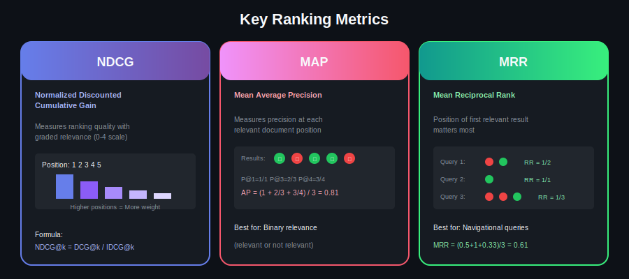
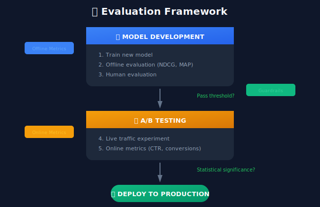
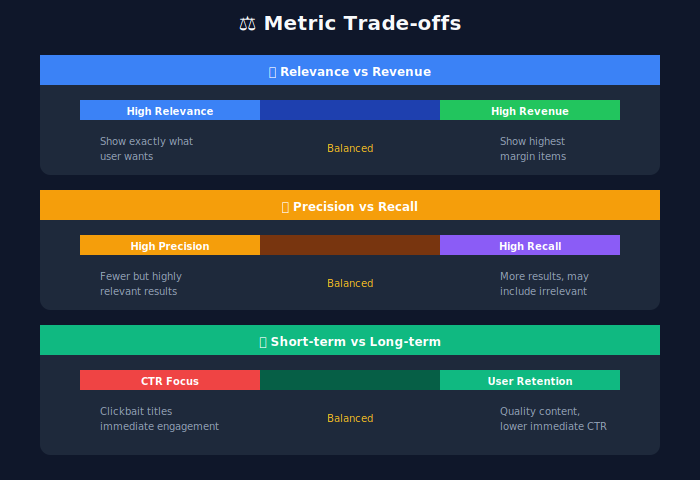

# Evaluation Metrics: Measuring Search Quality

## 📋 Table of Contents
1. [Introduction](#introduction)
2. [Offline Metrics](#offline-metrics)
3. [Online Metrics](#online-metrics)
4. [A/B Testing](#ab-testing)
5. [Interleaving Experiments](#interleaving-experiments)
6. [Metric Trade-offs](#metric-trade-offs)

---

<p align="center">
  
</p>

---

## Introduction

Measuring search quality is crucial for improving ranking systems. We use a combination of offline metrics (on held-out data) and online metrics (in production) to evaluate performance.



---

## Offline Metrics

### NDCG (Normalized Discounted Cumulative Gain)

```python
import numpy as np
from typing import List

def dcg(relevances: List[float], k: int = None) -> float:
    """
    Discounted Cumulative Gain

    DCG@k = Σ (2^rel_i - 1) / log2(i + 1)

    Gives more weight to relevant items at top positions
    """
    if k is not None:
        relevances = relevances[:k]

    gains = np.power(2, relevances) - 1
    discounts = np.log2(np.arange(len(relevances)) + 2)

    return np.sum(gains / discounts)

def ndcg(relevances: List[float], k: int = None) -> float:
    """
    Normalized DCG

    NDCG@k = DCG@k / IDCG@k

    IDCG is the DCG of the ideal ranking (sorted by relevance)
    """
    actual_dcg = dcg(relevances, k)

    # Ideal ranking
    ideal_relevances = sorted(relevances, reverse=True)
    ideal_dcg = dcg(ideal_relevances, k)

    if ideal_dcg == 0:
        return 0.0

    return actual_dcg / ideal_dcg

# Example
relevances = [3, 2, 3, 0, 1, 2]  # Relevance scores for ranked results
print(f"NDCG@5: {ndcg(relevances, k=5):.4f}")
```

### Mean Average Precision (MAP)

```python
def precision_at_k(relevances: List[int], k: int) -> float:
    """Precision at position k"""
    relevant = sum(relevances[:k])
    return relevant / k

def average_precision(relevances: List[int]) -> float:
    """
    Average Precision for a single query

    AP = (1/R) * Σ (P@k * rel_k)

    Where R is total relevant documents
    """
    if sum(relevances) == 0:
        return 0.0

    precisions = []
    for k, rel in enumerate(relevances, 1):
        if rel == 1:
            precisions.append(precision_at_k(relevances, k))

    return sum(precisions) / sum(relevances)

def mean_average_precision(all_relevances: List[List[int]]) -> float:
    """
    MAP across all queries

    MAP = (1/Q) * Σ AP_q
    """
    aps = [average_precision(rels) for rels in all_relevances]
    return np.mean(aps)
```

### Mean Reciprocal Rank (MRR)

```python
def reciprocal_rank(relevances: List[int]) -> float:
    """
    Reciprocal Rank: 1 / position of first relevant result
    """
    for i, rel in enumerate(relevances):
        if rel == 1:
            return 1 / (i + 1)
    return 0.0

def mean_reciprocal_rank(all_relevances: List[List[int]]) -> float:
    """
    MRR across all queries

    Best for: Queries where only first relevant result matters
    (navigational queries)
    """
    rrs = [reciprocal_rank(rels) for rels in all_relevances]
    return np.mean(rrs)
```

---

## Online Metrics

### Click-Based Metrics

```python
class OnlineMetrics:
    """Calculate online search quality metrics"""

    def click_through_rate(self, impressions: int, clicks: int) -> float:
        """
        CTR = Clicks / Impressions

        Overall engagement measure
        """
        if impressions == 0:
            return 0.0
        return clicks / impressions

    def successful_search_rate(self, sessions: List[dict]) -> float:
        """
        % of searches with at least one click

        Measures if users find relevant results
        """
        successful = sum(1 for s in sessions if s['clicks'] > 0)
        return successful / len(sessions)

    def abandonment_rate(self, sessions: List[dict]) -> float:
        """
        % of searches with no clicks

        Lower is better
        """
        abandoned = sum(1 for s in sessions if s['clicks'] == 0)
        return abandoned / len(sessions)

    def mean_reciprocal_rank_online(self, sessions: List[dict]) -> float:
        """
        MRR based on first click position
        """
        rrs = []
        for session in sessions:
            if session['first_click_position']:
                rrs.append(1 / session['first_click_position'])
            else:
                rrs.append(0)
        return np.mean(rrs)

    def average_click_position(self, clicks: List[dict]) -> float:
        """
        Average position of clicked results

        Lower is better (users finding results earlier)
        """
        positions = [c['position'] for c in clicks]
        return np.mean(positions)
```

### Dwell Time Metrics

```python
class DwellTimeMetrics:
    """Dwell time based quality metrics"""

    def __init__(self, short_click_threshold: int = 10):
        self.short_threshold = short_click_threshold

    def long_click_rate(self, clicks: List[dict]) -> float:
        """
        % of clicks with dwell time > 30 seconds

        Long clicks indicate satisfaction
        """
        long_clicks = sum(1 for c in clicks if c['dwell_time'] > 30)
        return long_clicks / len(clicks) if clicks else 0

    def short_click_rate(self, clicks: List[dict]) -> float:
        """
        % of clicks with dwell time < 10 seconds

        Short clicks may indicate poor relevance
        """
        short_clicks = sum(
            1 for c in clicks if c['dwell_time'] < self.short_threshold
        )
        return short_clicks / len(clicks) if clicks else 0

    def pogo_sticking_rate(self, sessions: List[dict]) -> float:
        """
        % of sessions where user clicks, returns quickly, clicks another

        Indicates first result wasn't satisfying
        """
        pogo_sticks = sum(1 for s in sessions if s['is_pogo_stick'])
        return pogo_sticks / len(sessions)
```

### Business Metrics

```python
class BusinessMetrics:
    """Business impact metrics for e-commerce"""

    def conversion_rate(self, sessions: List[dict]) -> float:
        """
        % of searches leading to purchase
        """
        conversions = sum(1 for s in sessions if s['converted'])
        return conversions / len(sessions)

    def revenue_per_search(self, sessions: List[dict]) -> float:
        """
        Average revenue per search session
        """
        total_revenue = sum(s['revenue'] for s in sessions)
        return total_revenue / len(sessions)

    def add_to_cart_rate(self, sessions: List[dict]) -> float:
        """
        % of searches with add-to-cart
        """
        atc = sum(1 for s in sessions if s['added_to_cart'])
        return atc / len(sessions)
```

---

## A/B Testing

### Experiment Design

```python
from scipy import stats
import hashlib

class ABExperiment:
    """A/B testing framework for search ranking"""

    def __init__(
        self,
        experiment_name: str,
        control_model: str,
        treatment_model: str,
        traffic_split: float = 0.5
    ):
        self.name = experiment_name
        self.control = control_model
        self.treatment = treatment_model
        self.split = traffic_split

    def assign_variant(self, user_id: str) -> str:
        """
        Deterministically assign user to variant
        """
        hash_input = f"{self.name}:{user_id}"
        hash_value = int(hashlib.md5(hash_input.encode()).hexdigest(), 16)

        if (hash_value % 100) / 100 < self.split:
            return 'control'
        else:
            return 'treatment'

    def analyze_results(
        self,
        control_metrics: dict,
        treatment_metrics: dict
    ) -> dict:
        """Analyze experiment results"""

        results = {}

        for metric_name in control_metrics:
            control_values = control_metrics[metric_name]
            treatment_values = treatment_metrics[metric_name]

            # Calculate statistics
            control_mean = np.mean(control_values)
            treatment_mean = np.mean(treatment_values)

            # T-test
            t_stat, p_value = stats.ttest_ind(
                control_values,
                treatment_values
            )

            # Effect size
            pooled_std = np.sqrt(
                (np.var(control_values) + np.var(treatment_values)) / 2
            )
            effect_size = (treatment_mean - control_mean) / pooled_std

            # Relative change
            relative_change = (treatment_mean - control_mean) / control_mean

            results[metric_name] = {
                'control_mean': control_mean,
                'treatment_mean': treatment_mean,
                'relative_change': relative_change,
                'p_value': p_value,
                'significant': p_value < 0.05,
                'effect_size': effect_size
            }

        return results

    def calculate_sample_size(
        self,
        baseline_rate: float,
        min_detectable_effect: float,
        power: float = 0.8,
        alpha: float = 0.05
    ) -> int:
        """
        Calculate required sample size
        """
        from statsmodels.stats.power import tt_ind_solve_power

        effect_size = min_detectable_effect / np.sqrt(
            baseline_rate * (1 - baseline_rate)
        )

        n = tt_ind_solve_power(
            effect_size=effect_size,
            alpha=alpha,
            power=power,
            ratio=1.0
        )

        return int(np.ceil(n))
```

### Results Analysis

```python
class ExperimentAnalyzer:
    """Analyze A/B test results"""

    def analyze(self, experiment_data: pd.DataFrame) -> dict:
        """Full experiment analysis"""

        # Split by variant
        control = experiment_data[experiment_data['variant'] == 'control']
        treatment = experiment_data[experiment_data['variant'] == 'treatment']

        # Primary metrics
        primary_results = self._analyze_primary_metrics(control, treatment)

        # Guardrail metrics
        guardrail_results = self._analyze_guardrails(control, treatment)

        # Segment analysis
        segment_results = self._segment_analysis(experiment_data)

        return {
            'primary': primary_results,
            'guardrails': guardrail_results,
            'segments': segment_results,
            'recommendation': self._make_recommendation(
                primary_results, guardrail_results
            )
        }

    def _analyze_primary_metrics(self, control, treatment):
        """Analyze primary success metrics"""

        metrics = {}

        for metric in ['ctr', 'conversion_rate', 'revenue_per_search']:
            c_vals = control[metric].values
            t_vals = treatment[metric].values

            # Bootstrap confidence interval
            ci = self._bootstrap_ci(c_vals, t_vals)

            metrics[metric] = {
                'control': np.mean(c_vals),
                'treatment': np.mean(t_vals),
                'lift': (np.mean(t_vals) - np.mean(c_vals)) / np.mean(c_vals),
                'ci_lower': ci[0],
                'ci_upper': ci[1],
                'significant': ci[0] > 0 or ci[1] < 0
            }

        return metrics

    def _bootstrap_ci(self, control, treatment, n_bootstrap=10000):
        """Calculate bootstrap confidence interval for lift"""

        lifts = []
        n_control = len(control)
        n_treatment = len(treatment)

        for _ in range(n_bootstrap):
            c_sample = np.random.choice(control, n_control, replace=True)
            t_sample = np.random.choice(treatment, n_treatment, replace=True)
            lift = (np.mean(t_sample) - np.mean(c_sample)) / np.mean(c_sample)
            lifts.append(lift)

        return np.percentile(lifts, [2.5, 97.5])

    def _make_recommendation(self, primary, guardrails):
        """Make ship/no-ship recommendation"""

        # Check primary metrics improved
        primary_wins = sum(
            1 for m in primary.values()
            if m['significant'] and m['lift'] > 0
        )

        # Check guardrails not regressed
        guardrail_fails = sum(
            1 for m in guardrails.values()
            if m['significant'] and m['lift'] < -0.01  # 1% regression threshold
        )

        if guardrail_fails > 0:
            return "DO NOT SHIP - Guardrail regression"
        elif primary_wins >= 1:
            return "SHIP - Primary metrics improved"
        else:
            return "NEUTRAL - No significant change"
```

---

## Interleaving Experiments

### Team Draft Interleaving

```python
class InterleavingExperiment:
    """
    Interleaving: More sensitive than A/B testing

    Show interleaved results from both models to same user
    Measure which model's results get more clicks
    """

    def interleave(
        self,
        ranking_a: List[Document],
        ranking_b: List[Document],
        method: str = 'team_draft'
    ) -> tuple:
        """
        Interleave two rankings

        Returns: (interleaved_list, attribution)
        """
        if method == 'team_draft':
            return self._team_draft(ranking_a, ranking_b)
        elif method == 'balanced':
            return self._balanced_interleave(ranking_a, ranking_b)

    def _team_draft(
        self,
        ranking_a: List,
        ranking_b: List
    ) -> tuple:
        """
        Team Draft Interleaving

        Like picking teams: alternately pick best available from each ranking
        """
        interleaved = []
        attribution = []  # 'A' or 'B' for each position

        used = set()
        ptr_a, ptr_b = 0, 0

        # Randomly choose who picks first
        team_a_picks = random.random() < 0.5

        while len(interleaved) < len(ranking_a) + len(ranking_b):
            if team_a_picks:

                # Team A picks
                while ptr_a < len(ranking_a) and ranking_a[ptr_a].id in used:
                    ptr_a += 1
                if ptr_a < len(ranking_a):
                    interleaved.append(ranking_a[ptr_a])
                    attribution.append('A')
                    used.add(ranking_a[ptr_a].id)
            else:

                # Team B picks
                while ptr_b < len(ranking_b) and ranking_b[ptr_b].id in used:
                    ptr_b += 1
                if ptr_b < len(ranking_b):
                    interleaved.append(ranking_b[ptr_b])
                    attribution.append('B')
                    used.add(ranking_b[ptr_b].id)

            team_a_picks = not team_a_picks

        return interleaved, attribution

    def analyze_clicks(
        self,
        experiments: List[dict]
    ) -> dict:
        """
        Analyze interleaving results
        """
        wins_a, wins_b, ties = 0, 0, 0

        for exp in experiments:
            clicks = exp['clicks']  # List of positions clicked
            attribution = exp['attribution']

            clicks_a = sum(1 for pos in clicks if attribution[pos] == 'A')
            clicks_b = sum(1 for pos in clicks if attribution[pos] == 'B')

            if clicks_a > clicks_b:
                wins_a += 1
            elif clicks_b > clicks_a:
                wins_b += 1
            else:
                ties += 1

        total = wins_a + wins_b

        # Binomial test
        from scipy.stats import binom_test
        p_value = binom_test(wins_a, total, 0.5)

        return {
            'wins_a': wins_a,
            'wins_b': wins_b,
            'ties': ties,
            'win_rate_a': wins_a / total if total > 0 else 0.5,
            'p_value': p_value,
            'significant': p_value < 0.05
        }
```

---

## Metric Trade-offs

### Metric Relationships



---

## Key Takeaways

1. **Multi-Metric Approach**: Use both offline (NDCG, MAP) and online (CTR, conversions) metrics
2. **Guardrail Metrics**: Always monitor for regressions in key metrics
3. **Statistical Rigor**: Use proper sample sizes and significance tests
4. **Interleaving**: More sensitive than A/B tests for ranking changes
5. **Balance Trade-offs**: Consider short-term vs long-term, relevance vs revenue

---

## Next Steps

- [09_advanced_topics](../09_advanced_topics/README.md) - Advanced techniques

---

*Last Updated: January 2026*

---

<div align="center">

**[⬆ Back to Top](#)** | **[📚 Main Repository](https://github.com/Gaurav14cs17/ml_system_design)**

Made with 💜 by [Gaurav14cs17](https://github.com/Gaurav14cs17)

</div>
