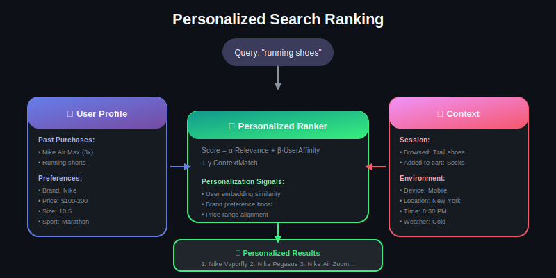
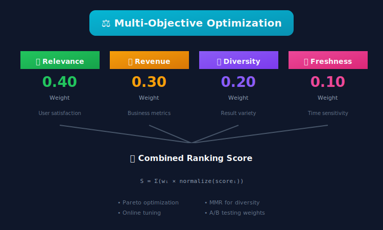
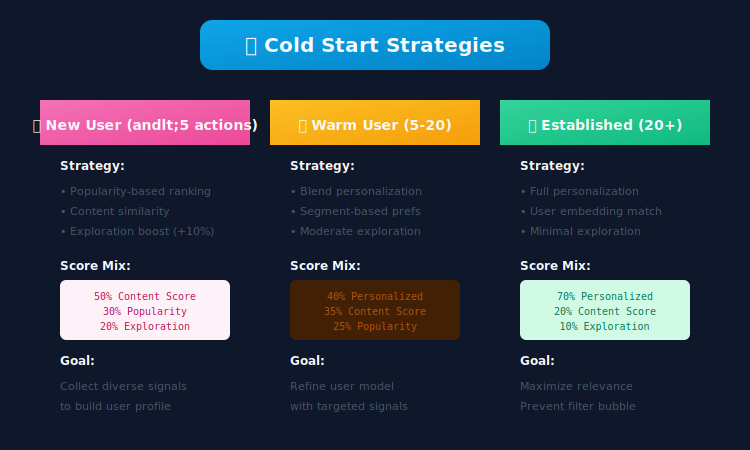
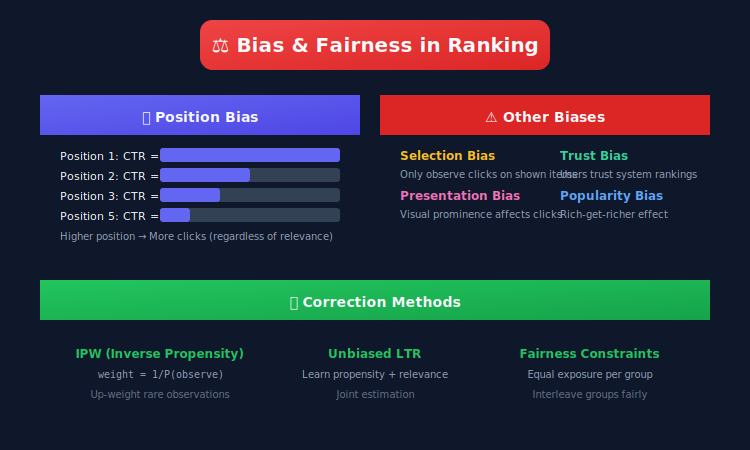
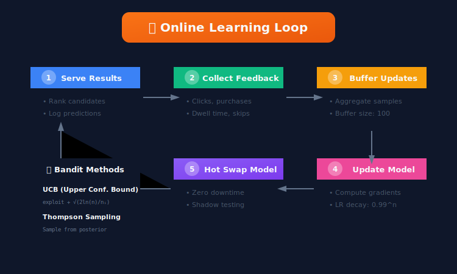

# Advanced Topics in Search Ranking

## 📋 Table of Contents
1. [Personalization](#personalization)
2. [Multi-Objective Optimization](#multi-objective-optimization)
3. [Handling Cold Start](#handling-cold-start)
4. [Bias & Fairness](#bias-fairness)
5. [Real-Time Learning](#real-time-learning)
6. [Federated Search](#federated-search)
7. [Conversational Search](#conversational-search)

---

<p align="center">
  
</p>

---

## Personalization


### User Embedding Based Personalization

```python
class PersonalizedRanker:
    """
    Personalize search results based on user preferences
    """

    def __init__(self, user_embedder, ranker):
        self.user_embedder = user_embedder
        self.ranker = ranker

    def rank(
        self,
        query: str,
        candidates: List[Document],
        user_id: str
    ) -> List[Document]:
        """
        Personalized ranking
        """
        # Get user embedding
        user_embedding = self.user_embedder.get_embedding(user_id)

        # Score each candidate with user context
        scored = []
        for doc in candidates:
            # Base relevance score
            relevance_score = self.ranker.score(query, doc)

            # User-document affinity
            user_affinity = self._compute_affinity(user_embedding, doc)

            # Combined score
            final_score = 0.7 * relevance_score + 0.3 * user_affinity

            scored.append((doc, final_score))

        # Sort by score
        scored.sort(key=lambda x: x[1], reverse=True)

        return [doc for doc, _ in scored]

    def _compute_affinity(self, user_emb: np.ndarray, doc: Document) -> float:
        """Compute user-document affinity"""
        doc_emb = doc.embedding

        # Cosine similarity
        similarity = np.dot(user_emb, doc_emb) / (
            np.linalg.norm(user_emb) * np.linalg.norm(doc_emb)
        )

        return similarity

class UserEmbedder:
    """Generate user embeddings from behavior"""

    def __init__(self, history_window: int = 30):
        self.history_window = history_window
        self.item_embeddings = {}

    def get_embedding(self, user_id: str) -> np.ndarray:
        """Get user embedding based on interaction history"""

        # Get recent interactions
        history = self._get_user_history(user_id)

        if not history:
            return self._get_default_embedding()

        # Weighted average of item embeddings
        embeddings = []
        weights = []

        for interaction in history:
            item_emb = self.item_embeddings.get(interaction['item_id'])
            if item_emb is not None:
                embeddings.append(item_emb)
                # Weight by recency and engagement
                weight = self._compute_weight(interaction)
                weights.append(weight)

        if not embeddings:
            return self._get_default_embedding()

        # Weighted average
        weights = np.array(weights) / sum(weights)
        user_emb = np.average(embeddings, axis=0, weights=weights)

        return user_emb

    def _compute_weight(self, interaction: dict) -> float:
        """Compute interaction weight"""
        # Recency weight (exponential decay)
        days_ago = (datetime.now() - interaction['timestamp']).days
        recency_weight = 0.5 ** (days_ago / 7)

        # Engagement weight
        engagement_weights = {
            'view': 1.0,
            'click': 2.0,
            'add_to_cart': 3.0,
            'purchase': 5.0
        }
        engagement_weight = engagement_weights.get(interaction['type'], 1.0)

        return recency_weight * engagement_weight

```

### Session-Based Personalization

```python
class SessionPersonalizer:
    """
    Personalize based on current session behavior
    """

    def __init__(self):
        self.session_encoder = SessionEncoder()

    def personalize(
        self,
        query: str,
        candidates: List[Document],
        session: Session
    ) -> List[Document]:
        """
        Adjust ranking based on session context
        """
        # Encode session
        session_context = self.session_encoder.encode(session)

        # Get session preferences
        preferences = self._extract_preferences(session)

        # Re-rank based on session
        scored = []
        for doc in candidates:
            base_score = doc.score

            # Boost if matches session preferences
            preference_boost = self._compute_preference_boost(doc, preferences)

            # Avoid showing already-seen items
            novelty_factor = 1.0 if doc.id not in session.viewed_items else 0.5

            final_score = base_score * (1 + preference_boost) * novelty_factor
            scored.append((doc, final_score))

        scored.sort(key=lambda x: x[1], reverse=True)
        return [doc for doc, _ in scored]

    def _extract_preferences(self, session: Session) -> dict:
        """Extract preferences from session behavior"""
        preferences = {
            'brands': Counter(),
            'categories': Counter(),
            'price_range': [],
            'attributes': Counter()
        }

        for click in session.clicks:
            if click.brand:
                preferences['brands'][click.brand] += 1
            if click.category:
                preferences['categories'][click.category] += 1
            if click.price:
                preferences['price_range'].append(click.price)

        return preferences

```

---

## Multi-Objective Optimization



### Pareto Optimization

```python
class MultiObjectiveRanker:
    """
    Balance multiple objectives: relevance, revenue, diversity, freshness
    """

    def __init__(self, objectives: List[str], weights: dict = None):
        self.objectives = objectives
        self.weights = weights or {obj: 1.0 for obj in objectives}

        # Scorers for each objective
        self.scorers = {
            'relevance': RelevanceScorer(),
            'revenue': RevenueScorer(),
            'diversity': DiversityScorer(),
            'freshness': FreshnessScorer()
        }

    def rank(
        self,
        query: str,
        candidates: List[Document]
    ) -> List[Document]:
        """
        Multi-objective ranking with weighted combination
        """
        # Score each objective
        scores = {}
        for obj in self.objectives:
            scores[obj] = self.scorers[obj].score_batch(query, candidates)

        # Normalize scores
        normalized = {}
        for obj, obj_scores in scores.items():
            min_s, max_s = min(obj_scores), max(obj_scores)
            if max_s > min_s:
                normalized[obj] = [(s - min_s) / (max_s - min_s) for s in obj_scores]
            else:
                normalized[obj] = [0.5] * len(obj_scores)

        # Weighted combination
        final_scores = []
        for i in range(len(candidates)):
            score = sum(
                self.weights[obj] * normalized[obj][i]
                for obj in self.objectives
            )
            final_scores.append(score)

        # Sort
        ranked = sorted(
            zip(candidates, final_scores),
            key=lambda x: x[1],
            reverse=True
        )

        return [doc for doc, _ in ranked]

class DiversityReranker:
    """
    Re-rank for diversity using MMR (Maximal Marginal Relevance)
    """

    def __init__(self, lambda_param: float = 0.5):
        self.lambda_param = lambda_param

    def rerank(
        self,
        candidates: List[Document],
        k: int = 10
    ) -> List[Document]:
        """
        MMR re-ranking for diversity

        MMR = λ * relevance - (1-λ) * max_similarity_to_selected
        """
        selected = []
        remaining = list(range(len(candidates)))

        while len(selected) < k and remaining:
            best_idx = None
            best_score = float('-inf')

            for idx in remaining:
                # Relevance score
                relevance = candidates[idx].score

                # Similarity to already selected
                if selected:
                    max_sim = max(
                        self._similarity(candidates[idx], candidates[s])
                        for s in selected
                    )
                else:
                    max_sim = 0

                # MMR score
                mmr = self.lambda_param * relevance - (1 - self.lambda_param) * max_sim

                if mmr > best_score:
                    best_score = mmr
                    best_idx = idx

            selected.append(best_idx)
            remaining.remove(best_idx)

        return [candidates[i] for i in selected]

    def _similarity(self, doc1: Document, doc2: Document) -> float:
        """Compute similarity between documents"""
        return np.dot(doc1.embedding, doc2.embedding) / (
            np.linalg.norm(doc1.embedding) * np.linalg.norm(doc2.embedding)
        )

```

---

## Handling Cold Start



### Cold Start Strategies

```python
class ColdStartHandler:
    """
    Handle cold-start scenarios
    """

    def __init__(self):
        self.popularity_ranker = PopularityRanker()
        self.content_ranker = ContentBasedRanker()

    def rank(
        self,
        query: str,
        candidates: List[Document],
        user_id: str = None
    ) -> List[Document]:
        """
        Adaptive ranking based on cold-start status
        """
        # Determine cold-start status
        user_status = self._get_user_status(user_id)

        if user_status == 'new_user':
            # Cold user: use popularity + content
            return self._rank_for_new_user(query, candidates)

        elif user_status == 'warm_user':
            # Some history: blend personalization with exploration
            return self._rank_for_warm_user(query, candidates, user_id)

        else:
            # Established user: full personalization
            return self._rank_for_established_user(query, candidates, user_id)

    def _rank_for_new_user(
        self,
        query: str,
        candidates: List[Document]
    ) -> List[Document]:
        """
        Ranking strategy for new users
        """
        scored = []

        for doc in candidates:
            # Content-based relevance
            content_score = self.content_ranker.score(query, doc)

            # Popularity as proxy for quality
            popularity_score = self.popularity_ranker.score(doc)

            # Explore diverse items
            exploration_score = self._exploration_score(doc)

            final = 0.5 * content_score + 0.3 * popularity_score + 0.2 * exploration_score
            scored.append((doc, final))

        scored.sort(key=lambda x: x[1], reverse=True)
        return [doc for doc, _ in scored]

    def _get_user_status(self, user_id: str) -> str:
        """Determine user cold-start status"""
        if not user_id:
            return 'new_user'

        interaction_count = self._get_interaction_count(user_id)

        if interaction_count < 5:
            return 'new_user'
        elif interaction_count < 20:
            return 'warm_user'
        else:
            return 'established_user'

class NewItemHandler:
    """
    Handle new items with no behavioral data
    """

    def __init__(self, content_model, popularity_model):
        self.content_model = content_model
        self.popularity_model = popularity_model

    def estimate_ctr(self, item: Document) -> float:
        """
        Estimate CTR for new item using content features
        """
        # Use content-based prediction
        content_features = self._extract_content_features(item)
        predicted_ctr = self.content_model.predict(content_features)

        # Add exploration bonus
        exploration_bonus = 0.1  # Boost new items for exploration

        return predicted_ctr + exploration_bonus

    def bootstrap_with_similar(
        self,
        new_item: Document,
        all_items: List[Document]
    ) -> dict:
        """
        Bootstrap behavioral features from similar existing items
        """
        # Find similar items with history
        similar_items = self._find_similar(new_item, all_items, k=10)

        # Aggregate their behavioral features
        aggregated = {
            'estimated_ctr': np.mean([i.ctr for i in similar_items]),
            'estimated_cvr': np.mean([i.cvr for i in similar_items]),
            'estimated_rating': np.mean([i.rating for i in similar_items if i.rating])
        }

        return aggregated

```

---

## Bias & Fairness



### Position Bias Correction

```python
class PositionBiasCorrector:
    """
    Correct for position bias in training data
    """

    def __init__(self):
        # Learned position propensities
        self.position_propensity = {}

    def estimate_propensities(self, click_data: pd.DataFrame):
        """
        Estimate position propensity using randomization data
        """
        # Use data from randomized experiments
        randomized = click_data[click_data['is_randomized'] == True]

        for position in range(1, 11):
            pos_data = randomized[randomized['position'] == position]
            self.position_propensity[position] = pos_data['clicked'].mean()

        # Normalize by position 1
        base = self.position_propensity[1]
        for pos in self.position_propensity:
            self.position_propensity[pos] /= base

    def apply_ipw(self, samples: List[TrainingSample]) -> List[TrainingSample]:
        """
        Apply Inverse Propensity Weighting
        """
        weighted = []

        for sample in samples:
            propensity = self.position_propensity.get(sample.position, 0.1)
            sample.weight = 1.0 / propensity
            weighted.append(sample)

        return weighted

class FairnessConstraint:
    """
    Apply fairness constraints to ranking
    """

    def __init__(self, protected_attribute: str, fairness_type: str = 'exposure'):
        self.protected_attribute = protected_attribute
        self.fairness_type = fairness_type

    def rerank_for_fairness(
        self,
        candidates: List[Document],
        k: int = 10
    ) -> List[Document]:
        """
        Re-rank to satisfy fairness constraints
        """
        if self.fairness_type == 'exposure':
            return self._equal_exposure_rerank(candidates, k)
        elif self.fairness_type == 'parity':
            return self._demographic_parity_rerank(candidates, k)

    def _equal_exposure_rerank(
        self,
        candidates: List[Document],
        k: int
    ) -> List[Document]:
        """
        Ensure equal exposure across protected groups
        """
        # Group by protected attribute
        groups = {}
        for doc in candidates:
            group = getattr(doc, self.protected_attribute, 'unknown')
            if group not in groups:
                groups[group] = []
            groups[group].append(doc)

        # Sort within groups by relevance
        for group in groups:
            groups[group].sort(key=lambda x: x.score, reverse=True)

        # Interleave groups for equal exposure
        result = []
        group_ptrs = {g: 0 for g in groups}
        group_list = list(groups.keys())

        while len(result) < k:
            for group in group_list:
                if group_ptrs[group] < len(groups[group]):
                    result.append(groups[group][group_ptrs[group]])
                    group_ptrs[group] += 1
                    if len(result) >= k:
                        break

        return result[:k]

```

---

## Real-Time Learning



### Online Learning for Ranking

```python
class OnlineLearningRanker:
    """
    Continuously learn from user feedback
    """

    def __init__(self, base_model, learning_rate: float = 0.01):
        self.model = base_model
        self.learning_rate = learning_rate
        self.update_buffer = []
        self.buffer_size = 100

    def process_feedback(self, feedback: dict):
        """
        Process user feedback for online learning
        """
        self.update_buffer.append(feedback)

        if len(self.update_buffer) >= self.buffer_size:
            self._update_model()
            self.update_buffer = []

    def _update_model(self):
        """Perform online update"""

        # Convert feedback to training samples
        samples = self._feedback_to_samples(self.update_buffer)

        # Compute gradients
        gradients = self.model.compute_gradients(samples)

        # Apply updates with learning rate decay
        current_lr = self.learning_rate * (0.99 ** self.update_count)
        self.model.apply_gradients(gradients, current_lr)

        self.update_count += 1

class BanditRanker:
    """
    Multi-armed bandit for exploration-exploitation
    """

    def __init__(self, n_arms: int, strategy: str = 'ucb'):
        self.n_arms = n_arms
        self.strategy = strategy
        self.counts = np.zeros(n_arms)
        self.values = np.zeros(n_arms)

    def select(self, candidates: List[Document]) -> List[Document]:
        """Select ranking using bandit strategy"""

        if self.strategy == 'ucb':
            return self._ucb_select(candidates)
        elif self.strategy == 'thompson':
            return self._thompson_select(candidates)

    def _ucb_select(self, candidates: List[Document]) -> List[Document]:
        """Upper Confidence Bound selection"""

        total_count = sum(self.counts) + 1

        ucb_values = []
        for i, doc in enumerate(candidates):
            if self.counts[i] == 0:
                ucb = float('inf')  # Explore unseen
            else:
                exploitation = self.values[i]
                exploration = np.sqrt(2 * np.log(total_count) / self.counts[i])
                ucb = exploitation + exploration
            ucb_values.append((doc, ucb))

        ucb_values.sort(key=lambda x: x[1], reverse=True)
        return [doc for doc, _ in ucb_values]

    def update(self, arm_idx: int, reward: float):
        """Update bandit statistics"""
        self.counts[arm_idx] += 1
        n = self.counts[arm_idx]
        old_value = self.values[arm_idx]
        self.values[arm_idx] = old_value + (reward - old_value) / n

```

---

## Federated Search

### Federated Search Architecture

```python
class FederatedSearchOrchestrator:
    """
    Search across multiple independent indexes
    """

    def __init__(self, sources: List[SearchSource]):
        self.sources = sources

    async def search(
        self,
        query: str,
        top_k: int = 10
    ) -> List[FederatedResult]:
        """
        Federated search across all sources
        """
        # Query all sources in parallel
        tasks = [
            source.search(query, top_k=top_k * 2)
            for source in self.sources
        ]

        source_results = await asyncio.gather(*tasks)

        # Merge results
        merged = self._merge_results(source_results)

        # Re-rank merged results
        reranked = self._rerank(query, merged)

        return reranked[:top_k]

    def _merge_results(
        self,
        source_results: List[List[SearchResult]]
    ) -> List[FederatedResult]:
        """
        Merge results from multiple sources
        """
        # Normalize scores within each source
        normalized = []

        for source_idx, results in enumerate(source_results):
            if not results:
                continue

            scores = [r.score for r in results]
            min_s, max_s = min(scores), max(scores)

            for result in results:
                norm_score = (result.score - min_s) / (max_s - min_s + 1e-10)
                normalized.append(FederatedResult(
                    document=result.document,
                    score=norm_score,
                    source=self.sources[source_idx].name
                ))

        return normalized

    def _rerank(
        self,
        query: str,
        results: List[FederatedResult]
    ) -> List[FederatedResult]:
        """
        Re-rank merged results
        """
        # Use cross-source re-ranker
        reranked = self.reranker.rerank(query, results)

        # Apply diversity across sources
        diverse = self._ensure_source_diversity(reranked)

        return diverse

```

---

## Conversational Search

### Multi-Turn Search

```python
class ConversationalSearchEngine:
    """
    Handle multi-turn conversational search
    """

    def __init__(self):
        self.query_rewriter = QueryRewriter()
        self.context_tracker = ContextTracker()
        self.searcher = SearchEngine()

    async def search(
        self,
        utterance: str,
        conversation_history: List[Turn]
    ) -> SearchResponse:
        """
        Search with conversation context
        """
        # Track context
        context = self.context_tracker.update(utterance, conversation_history)

        # Rewrite query with context
        rewritten_query = self.query_rewriter.rewrite(
            utterance,
            context
        )

        # Search
        results = await self.searcher.search(rewritten_query)

        # Generate response
        response = self._generate_response(utterance, results, context)

        return response

    def _generate_response(
        self,
        utterance: str,
        results: List[Document],
        context: ConversationContext
    ) -> SearchResponse:
        """Generate conversational response"""

        # Check if clarification needed
        if self._needs_clarification(utterance, context):
            return SearchResponse(
                type='clarification',
                message=self._generate_clarification(utterance, context),
                results=[]
            )

        # Check if direct answer possible
        if self._can_answer_directly(utterance, results):
            answer = self._extract_answer(utterance, results)
            return SearchResponse(
                type='direct_answer',
                message=answer,
                results=results[:3]
            )

        # Return search results
        return SearchResponse(
            type='results',
            message=f"Here are results for '{utterance}':",
            results=results
        )

class QueryRewriter:
    """Rewrite queries with conversation context"""

    def __init__(self):
        self.model = T5ForConditionalGeneration.from_pretrained('t5-base')
        self.tokenizer = T5Tokenizer.from_pretrained('t5-base')

    def rewrite(
        self,
        utterance: str,
        context: ConversationContext
    ) -> str:
        """
        Rewrite utterance to standalone query
        """
        # Build prompt
        history = " | ".join([
            f"Q: {t.query} A: {t.response[:100]}"
            for t in context.history[-3:]
        ])

        prompt = f"rewrite with context: {history} | current: {utterance}"

        # Generate
        inputs = self.tokenizer.encode(prompt, return_tensors='pt')
        outputs = self.model.generate(inputs, max_length=64)
        rewritten = self.tokenizer.decode(outputs[0], skip_special_tokens=True)

        return rewritten

```

---

## Key Takeaways

1. **Personalization**: Balance relevance with user preferences
2. **Multi-Objective**: Trade off relevance, revenue, diversity, fairness
3. **Cold Start**: Use content + popularity for new users/items
4. **Fairness**: Correct position bias, ensure fair exposure
5. **Online Learning**: Continuously adapt from user feedback
6. **Federated Search**: Merge results from multiple sources
7. **Conversational**: Handle multi-turn context

---

*Last Updated: January 2026*

---

<div align="center">

**[⬆ Back to Top](#)** | **[📚 Main Repository](https://github.com/Gaurav14cs17/ml_system_design)**

Made with 💜 by [Gaurav14cs17](https://github.com/Gaurav14cs17)

</div>
