# 🔍 Search & Ranking Systems: Complete ML Engineering Guide

<div align="center">

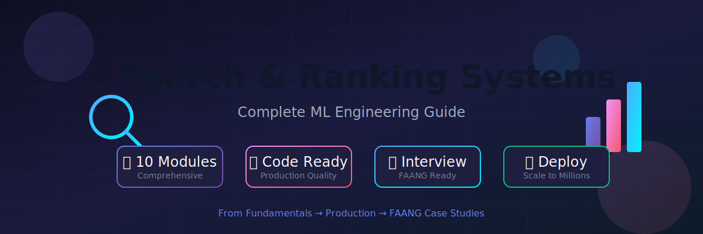

**A comprehensive, production-ready study guide for ML engineers**

*From fundamentals to FAANG-level system design*

[](https://python.org)
[](https://pytorch.org)
[](LICENSE)

</div>

---

## 📋 Table of Contents

- [Overview](#-overview)

- [Learning Path](#-learning-path)

- [Module Structure](#-module-structure)

- [Prerequisites](#-prerequisites)

- [Quick Start](#-quick-start)

- [Resources](#-resources)

- [Contributing](#-contributing)

---

## 🎯 Overview

Search and Ranking systems power the core functionality of modern tech products—from Google Search to Amazon product recommendations, LinkedIn job matching, and Netflix content discovery. This guide covers everything you need to build production-grade ranking systems.

### What You'll Learn

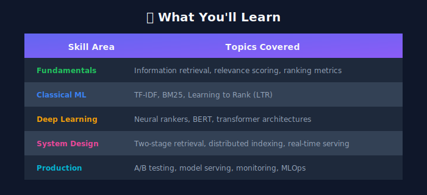

### Who This Is For

- 👨‍💻 **ML Engineers** building production ranking systems

- 🎓 **Interview Candidates** preparing for FAANG system design

- 🔬 **Researchers** understanding state-of-the-art approaches

- 💼 **Tech Leads** designing scalable search infrastructure

---

## 🗺️ Learning Path

```
+-----------------------------------------------------------------------------+

|                          SEARCH & RANKING MASTERY PATH                       |
+-----------------------------------------------------------------------------+
|                                                                              |
|  FUNDAMENTALS                    CORE                       PRODUCTION       |
|  ------------                    ----                       ----------       |
|                                                                              |
|  +----------+    +----------+    +----------+    +----------+              |
|  |Module 01 |---▶|Module 02 |---▶|Module 03 |---▶|Module 04 |              |
|  | Problem  |    |  Query   |    |   Doc    |    | Features |              |
|  +----------+    +----------+    +----------+    +----------+              |
|                                                        |                     |
|       +------------------------------------------------+                     |
|       ▼                                                                      |
|  +----------+    +----------+    +----------+    +----------+              |
|  |Module 05 |---▶|Module 06 |---▶|Module 07 |---▶|Module 08 |              |
|  | Ranking  |    | Training |    | Serving  |    |  Metrics |              |
|  +----------+    +----------+    +----------+    +----------+              |
|                                                        |                     |
|       +------------------------------------------------+                     |
|       ▼                                                                      |
|  +----------+                                                               |
|  |Module 09 |    🎉 COMPLETE!                                               |
|  | Advanced |                                                               |
|  +----------+                                                               |
|                                                                              |
+-----------------------------------------------------------------------------+

```

### Recommended Timeline

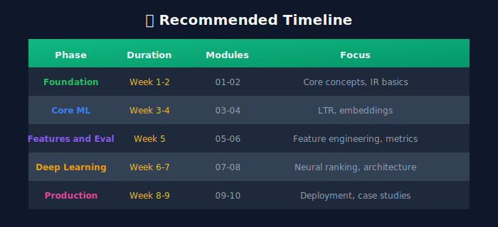

---

## 📚 Module Structure

### 🟢 Fundamentals (Modules 1-3)

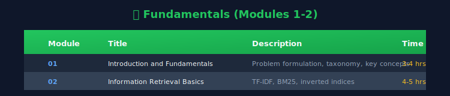

### 🟡 Core Techniques (Modules 4-5)

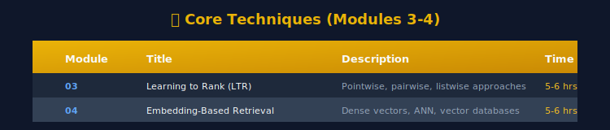

### 🟠 Training & Serving (Modules 6-7)

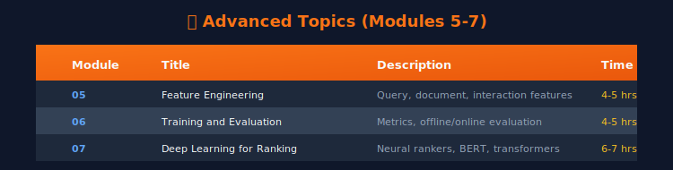

### 🔴 Evaluation & Advanced (Modules 8-9)

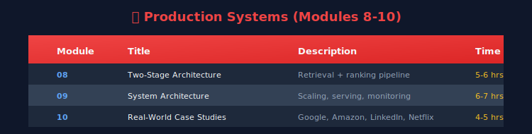

---

## 📋 Prerequisites

### Required Knowledge

- **Python**: Intermediate level (3.8+)

- **Machine Learning**: Supervised learning, gradient descent, regularization

- **Mathematics**: Linear algebra, probability, calculus

- **Data Structures**: Arrays, hash maps, trees

### Recommended Experience

- Deep learning fundamentals (neural networks, backpropagation)

- SQL and data processing

- Basic distributed systems concepts

### Technical Setup

```bash
# Create environment
python -m venv search_ranking_env
source search_ranking_env/bin/activate

# Install dependencies
pip install -r requirements.txt

```

---

## 🚀 Quick Start

### Installation

```bash
# Clone the repository
git clone https://github.com/your-repo/search-ranking-guide.git
cd search-ranking-guide

# Install dependencies
pip install torch transformers faiss-cpu numpy pandas scikit-learn

# Verify installation
python -c "import torch; print(f'PyTorch: {torch.__version__}')"

```

### Your First Ranker

```python
"""
Quick start: Build a simple BM25 ranker in 5 minutes
"""
import numpy as np
from collections import Counter
from typing import List, Tuple

class SimpleBM25:
    """Production-ready BM25 implementation."""
    
    def __init__(self, k1: float = 1.5, b: float = 0.75):
        self.k1 = k1
        self.b = b
        self.doc_freqs: dict = {}
        self.doc_lens: List[int] = []
        self.avg_doc_len: float = 0
        self.corpus_size: int = 0
        
    def fit(self, corpus: List[List[str]]) -> 'SimpleBM25':
        """Index the corpus."""
        self.corpus = corpus
        self.corpus_size = len(corpus)
        self.doc_lens = [len(doc) for doc in corpus]
        self.avg_doc_len = np.mean(self.doc_lens)
        
        # Calculate document frequencies
        for doc in corpus:
            for term in set(doc):
                self.doc_freqs[term] = self.doc_freqs.get(term, 0) + 1
        return self
        
    def score(self, query: List[str], doc_idx: int) -> float:
        """Calculate BM25 score for a document."""
        doc = self.corpus[doc_idx]
        doc_len = self.doc_lens[doc_idx]
        term_freqs = Counter(doc)
        
        score = 0.0
        for term in query:
            if term not in self.doc_freqs:
                continue
            tf = term_freqs.get(term, 0)
            df = self.doc_freqs[term]
            idf = np.log((self.corpus_size - df + 0.5) / (df + 0.5) + 1)
            tf_norm = (tf * (self.k1 + 1)) / (
                tf + self.k1 * (1 - self.b + self.b * doc_len / self.avg_doc_len)
            )
            score += idf * tf_norm
        return score
    
    def rank(self, query: List[str], top_k: int = 10) -> List[Tuple[int, float]]:
        """Rank documents for a query."""
        scores = [(i, self.score(query, i)) for i in range(self.corpus_size)]
        return sorted(scores, key=lambda x: x[1], reverse=True)[:top_k]

# Example usage
corpus = [
    ["machine", "learning", "ranking", "systems"],
    ["deep", "learning", "neural", "networks"],
    ["search", "ranking", "algorithms", "bm25"],
    ["information", "retrieval", "text", "search"],
]

ranker = SimpleBM25().fit(corpus)
query = ["search", "ranking"]
results = ranker.rank(query, top_k=3)

print("🔍 Query:", query)
print("📊 Results:")
for idx, score in results:
    print(f"  Doc {idx}: {corpus[idx]} (score: {score:.4f})")

```

---

## 📖 Resources

### 📚 Essential Books

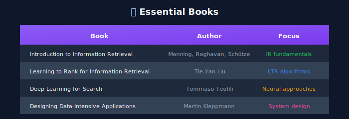

### 🎥 Video Courses

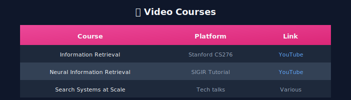

### 📄 Key Papers

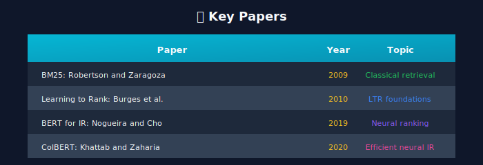

### 🛠️ Tools & Libraries

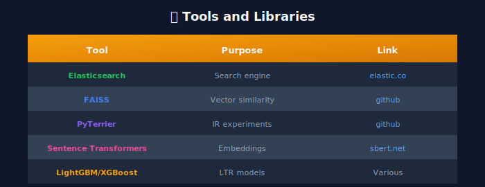

---

## 🏗️ Project Structure

```
02_search_ranking/
+-- README.md                          # This file
+-- requirements.txt                   # Python dependencies
+-- images/                            # Global images

|   +-- hero_banner.svg
+-- assets/                            # Additional assets
|
+-- 01_problem_definition/             # Module 1: Problem Definition
|   +-- README.md

|   +-- images/
|
+-- 02_query_understanding/            # Module 2: Query Understanding
|   +-- README.md

|   +-- images/
|
+-- 03_document_understanding/         # Module 3: Document Understanding
|   +-- README.md

|   +-- images/
|
+-- 04_feature_engineering/            # Module 4: Feature Engineering
|   +-- README.md

|   +-- images/
|
+-- 05_ranking_models/                 # Module 5: Ranking Models
|   +-- README.md

|   +-- images/
|
+-- 06_training_pipeline/              # Module 6: Training Pipeline
|   +-- README.md

|   +-- images/
|
+-- 07_serving_infrastructure/         # Module 7: Serving Infrastructure
|   +-- README.md

|   +-- images/
|
+-- 08_evaluation_metrics/             # Module 8: Evaluation Metrics
|   +-- README.md

|   +-- images/
|
+-- 09_advanced_topics/                # Module 9: Advanced Topics
    +-- README.md
    +-- images/

```

---

## 🎯 Interview Preparation

### Common Interview Topics

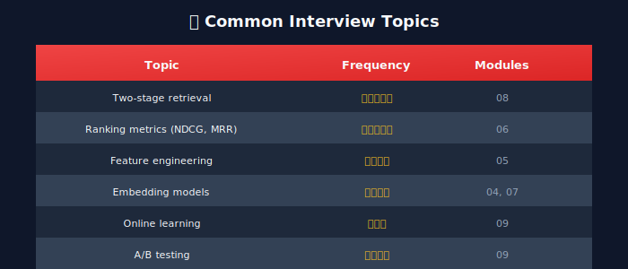

### Sample Interview Questions

1. **Design Google Search ranking** → Modules 02, 05, 07
2. **Design Amazon product search** → Modules 03, 04, 09
3. **Design LinkedIn job recommendations** → Modules 04, 05, 09
4. **Explain NDCG and when to use it** → Module 08
5. **Compare BM25 vs neural retrievers** → Modules 02, 05

---

## 📈 Progress Tracking

Use this checklist to track your progress:

- [ ] Module 01: Problem Definition

- [ ] Module 02: Query Understanding

- [ ] Module 03: Document Understanding

- [ ] Module 04: Feature Engineering

- [ ] Module 05: Ranking Models

- [ ] Module 06: Training Pipeline

- [ ] Module 07: Serving Infrastructure

- [ ] Module 08: Evaluation Metrics

- [ ] Module 09: Advanced Topics

---

## 🤝 Contributing

Contributions are welcome! Please read our contributing guidelines before submitting PRs.

---

## 📜 License

This project is licensed under the MIT License - see the [LICENSE](LICENSE) file for details.

---

<div align="center">

**[Start Learning →](./01_problem_definition/)**

Made with ❤️ for the ML community

</div>

---

<div align="center">

**[⬆ Back to Top](#)** | **[📚 Main Repository](https://github.com/Gaurav14cs17/ml_system_design)**

Made with 💜 by [Gaurav14cs17](https://github.com/Gaurav14cs17)

</div>
