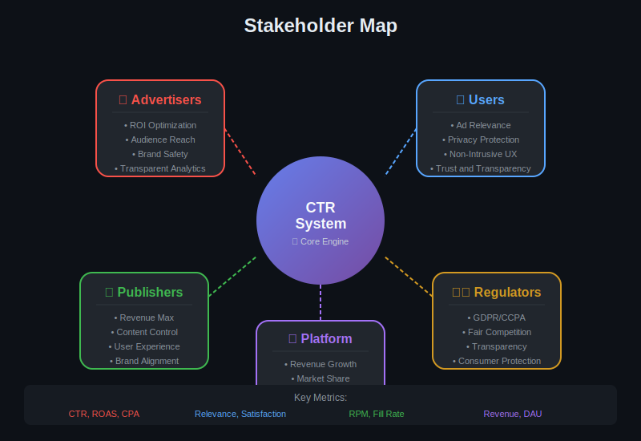
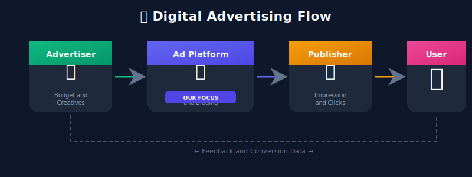
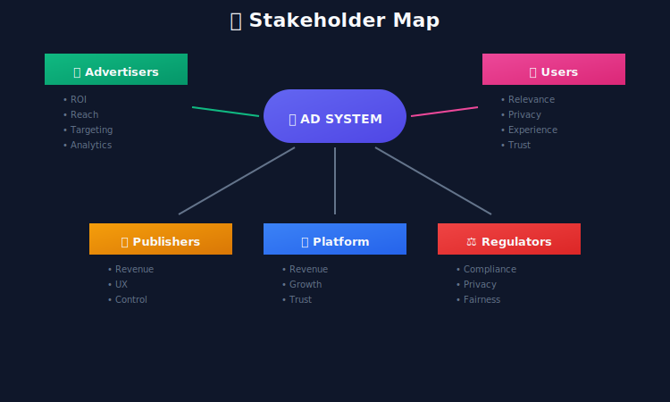

# Module 1: Problem Definition

## Understanding Ads Click Prediction (CTR) Systems

---

## 📊 Visual Overview




---

## 📖 Table of Contents

1. [Executive Summary](#executive-summary)
2. [Business Context](#business-context)
3. [Mathematical Problem Formulation](#mathematical-problem-formulation)
4. [Stakeholder Analysis](#stakeholder-analysis)
5. [Success Metrics](#success-metrics)
6. [Scope & Constraints](#scope--constraints)

---

## Executive Summary

Ads Click Prediction is a **binary classification problem** that predicts the probability of a user clicking on an advertisement. This prediction powers the core revenue engine of digital advertising platforms.

The system must process **millions of ad requests per second** with **sub-10ms latency**.

---

## Business Context

### The Digital Advertising Ecosystem


### Revenue Models

| Model | Description | CTR Role |
|-------|-------------|----------|
| **CPC** (Cost Per Click) | Advertiser pays per click | Directly determines pricing |
| **CPM** (Cost Per Mille) | Pay per 1000 impressions | Affects ad ranking |
| **CPA** (Cost Per Action) | Pay per conversion | Combined with CVR prediction |
| **RTB** (Real-Time Bidding) | Auction-based pricing | Core to bid optimization |

### Revenue Formula

Platform revenue is directly tied to CTR prediction quality:

```math
\text{Revenue} = \sum_{i=1}^{N} \text{pCTR}_i \times \text{Bid}_i \times \mathbb{1}[\text{impression}_i]
```

**Business Impact**: A 1% improvement in CTR prediction accuracy can translate to:
- **$100M+ annual revenue increase** for large platforms
- **10-20% improvement** in advertiser ROI
- **Better user experience** through more relevant ads

---

## Mathematical Problem Formulation

### Formal Definition

Given:
- User $u \in \mathcal{U}$ with features $\mathbf{x}\_u$
- Ad $a \in \mathcal{A}$ with features $\mathbf{x}\_a$
- Context $c \in \mathcal{C}$ with features $\mathbf{x}\_c$

**Objective**: Learn a function $f: \mathcal{U} \times \mathcal{A} \times \mathcal{C} \rightarrow [0, 1]$

```math
\hat{y} = f(\mathbf{x}_u, \mathbf{x}_a, \mathbf{x}_c; \theta) = P(\text{click} = 1 \mid u, a, c)
```

where $\theta$ are learnable parameters.

### Training Objective

Minimize the **Binary Cross-Entropy Loss**:

```math
\mathcal{L}(\theta) = -\frac{1}{N} \sum_{i=1}^{N} \left[ y_i \log(\hat{y}_i) + (1 - y_i) \log(1 - \hat{y}_i) \right]
```

where:
- $y\_i \in \{0, 1\}$ is the true label (clicked or not)
- $\hat{y}\_i \in [0, 1]$ is the predicted probability
- $N$ is the number of training samples

### Key Challenges

| Challenge | Mathematical Implication |
|-----------|-------------------------|
| **Extreme Imbalance** | $P(y=1) \approx 0.01-0.02$, 98-99% negatives |
| **High Cardinality** | $\|\mathcal{U}\| \sim 10^9$, $\|\mathcal{A}\| \sim 10^8$ |
| **Sparsity** | Most user-ad pairs never observed |
| **Non-Stationarity** | $P(y \mid x)$ changes over time |
| **Position Bias** | $P(\text{click}) = P(\text{examine}) \times P(\text{click} \mid \text{examine})$ |

---

## Stakeholder Analysis

### Primary Stakeholders




### Requirements by Stakeholder

| Stakeholder | Key Requirements | Success Metrics |
|-------------|------------------|-----------------|
| **Advertisers** | Maximize ROI, accurate targeting | CTR, CPA, ROAS |
| **Users** | Relevant ads, privacy respected | Ad relevance, complaint rate |
| **Publishers** | Maximize revenue, maintain UX | RPM, Fill Rate |
| **Platform** | Revenue, trust, scalability | Total Revenue, DAU |

---

## Success Metrics

### Offline Metrics (Model Quality)

#### AUC-ROC (Area Under ROC Curve)

Measures ranking quality — probability that a random positive is ranked higher than a random negative:

```math
\text{AUC} = P(\hat{y}_{\text{pos}} > \hat{y}_{\text{neg}})
```

**Target**: AUC > 0.75

#### Log Loss (Cross-Entropy)

Measures calibration — how well predicted probabilities match true probabilities:

```math
\text{LogLoss} = -\frac{1}{N} \sum_{i=1}^{N} \left[ y_i \log(\hat{y}_i) + (1 - y_i) \log(1 - \hat{y}_i) \right]
```

**Target**: LogLoss < 0.4

#### Normalized Cross-Entropy (NCE)

Relative improvement over baseline (predicting average CTR):

```math
\text{NCE} = \frac{\text{LogLoss}_{\text{model}}}{\text{LogLoss}_{\text{baseline}}} = \frac{\text{LogLoss}_{\text{model}}}{-[p \log p + (1-p) \log(1-p)]}
```

where $p = \frac{1}{N} \sum\_i y\_i$ is the base CTR.

**Target**: NCE < 0.85 (lower is better)

#### Calibration Error

Expected difference between predicted and actual probabilities:

```math
\text{ECE} = \sum_{b=1}^{B} \frac{n_b}{N} \left| \text{acc}(b) - \text{conf}(b) \right|
```

**Target**: ECE < 0.02

### Online Metrics (System Quality)

| Metric | Target | Description |
|--------|--------|-------------|
| **Latency p50** | < 5ms | Median response time |
| **Latency p99** | < 15ms | Tail latency |
| **Throughput** | > 1M QPS | Queries per second |
| **Availability** | 99.99% | Uptime SLA |
| **Model Freshness** | < 24h | Time since last update |

### Business Metrics

| Metric | Formula | Target |
|--------|---------|--------|
| **RPM** | $\frac{\text{Revenue}}{\text{Impressions}} \times 1000$ | +5% YoY |
| **eCPM** | $\text{CTR} \times \text{CPC} \times 1000$ | Platform baseline |
| **ROAS** | $\frac{\text{Revenue from ads}}{\text{Ad spend}}$ | > 2x |

---

## Scope & Constraints

### In Scope

✅ Click probability prediction for display ads  
✅ Feature extraction and engineering  
✅ Real-time model serving  
✅ Offline model training  
✅ A/B testing framework  

### Out of Scope

❌ Conversion prediction (post-click)  
❌ Bid optimization algorithms  
❌ Ad creative generation  
❌ Fraud detection (separate system)  

### System Boundaries



### Constraints

| Type | Constraint | Rationale |
|------|------------|-----------|
| **Latency** | p99 < 15ms | Ad auctions have strict time budgets |
| **Throughput** | > 1M QPS | Peak traffic during major events |
| **Availability** | 99.99% | Direct revenue impact |
| **Model Size** | < 10GB | Memory constraints on serving nodes |
| **Data Retention** | 90 days | Privacy regulations (GDPR, CCPA) |

---

## Key Takeaways

1. **CTR = Binary Classification**: Predict $P(\text{click} \mid u, a, c) \in [0, 1]$
2. **Extreme Imbalance**: ~1-2% positive rate requires special handling
3. **Calibration Matters**: Predictions must match actual rates for bidding
4. **Multiple Metrics**: AUC for ranking, LogLoss for calibration, business metrics for impact
5. **Latency Critical**: Sub-10ms inference at million QPS scale

---

## Next Steps

Continue to the next modules:
- [02_system_requirements](../02_system_requirements/README.md) — Define technical specifications
- [03_data_engineering](../03_data_engineering/README.md) — Design data pipelines

---

*Module 1 of 9 • [Back to Overview](../README.md)*

---

<div align="center">

**[⬆ Back to Top](#)** | **[📚 Main Repository](https://github.com/Gaurav14cs17/ml_system_design)**

Made with 💜 by [Gaurav14cs17](https://github.com/Gaurav14cs17)

</div>
