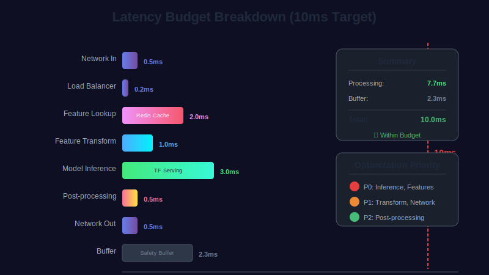
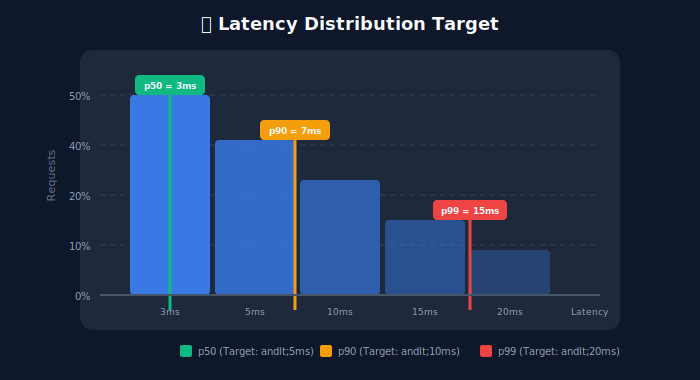
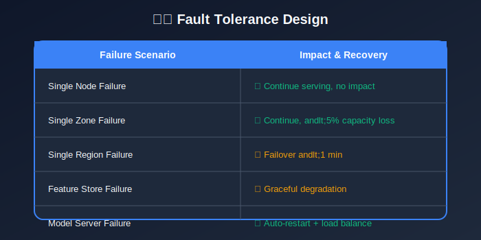
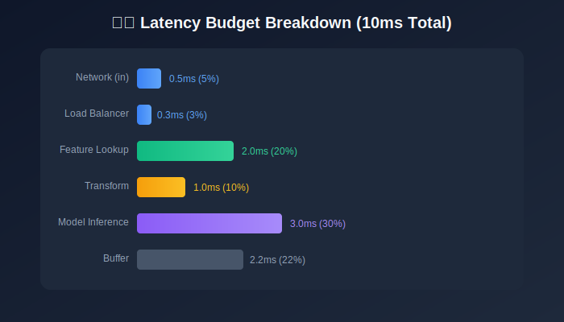
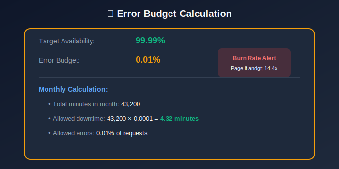
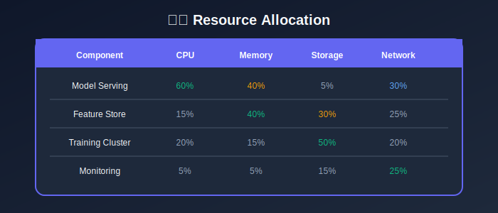

# Module 2: System Requirements

## Technical Specifications for Production CTR Systems

---

## 📊 Visual Overview





---

## 📖 Table of Contents

1. [Functional Requirements](#functional-requirements)
2. [Non-Functional Requirements](#non-functional-requirements)
3. [Scale Estimation](#scale-estimation)
4. [Latency Budget](#latency-budget)
5. [SLA Definitions](#sla-definitions)
6. [API Specifications](#api-specifications)

---

## Functional Requirements

### Core Capabilities

| ID | Requirement | Input | Output |
|----|-------------|-------|--------|
| FR-1 | Real-time prediction | (user, ad, context) | pCTR ∈ [0, 1] |
| FR-2 | Batch prediction | Parquet files | Predictions file |
| FR-3 | Model training | Training data | Model artifacts |
| FR-4 | Feature computation | Raw events | Feature vectors |

### Prediction API Contract

**Input**:
- User ID (hashed)
- Ad ID
- Context (device, time, placement)

**Output**:
- `pCTR`: Predicted click probability
- `model_version`: Model used
- `latency_us`: Processing time

---

## Non-Functional Requirements

### Performance Requirements

#### Latency Targets

| Percentile | Target | Rationale |
|------------|--------|-----------|
| p50 | 3ms | Fast typical response |
| p90 | 7ms | Good user experience |
| p95 | 10ms | Within ad auction budget |
| p99 | 15ms | Tail latency tolerance |
| p99.9 | 25ms | Spike tolerance |

#### Throughput Formula

Required capacity based on traffic:

```math
\text{QPS}_{\text{required}} = \text{DAU} \times \text{PageViews/User} \times \text{Ads/Page} \times \text{Candidates/Slot}
```

**Example calculation**:

```math
\text{QPS} = \frac{500M \times 20 \times 5 \times 3}{86400} \approx 1.7M \text{ QPS}
```

#### Availability Target

| Metric | Target | Downtime Allowed |
|--------|--------|------------------|
| Monthly | 99.99% | 4.38 minutes |
| Yearly | 99.99% | 52.6 minutes |

**Availability formula**:

```math
\text{Availability} = \frac{\text{Total Time} - \text{Downtime}}{\text{Total Time}} = \frac{\text{Successful Requests}}{\text{Total Requests}}
```

### Reliability Requirements



| Requirement | Specification |
|-------------|---------------|
| **Redundancy** | N+2 for all components |
| **Failover** | < 30 seconds |
| **Data Durability** | 99.999999999% (11 nines) |
| **RTO** | 1 minute |
| **RPO** | 0 seconds (no data loss) |

---

## Scale Estimation

### Traffic Estimation

#### Daily Volume

| Metric | Volume | Calculation |
|--------|--------|-------------|
| DAU | 500M | Given |
| Page views/user | 20 | Average |
| Ads per page | 5 | Ad slots |
| Candidates/slot | 3 | Auction size |
| **Daily requests** | 150B | $500M \times 20 \times 5 \times 3$ |
| **Average QPS** | 1.7M | $150B / 86400$ |
| **Peak QPS** | 4.3M | $1.7M \times 2.5$ |

#### Storage Estimation

**Impression logs**:

```math
\text{Daily Storage} = \text{Impressions} \times \text{Size/Record} = 100B \times 500B = 50\text{TB/day}
```

With 10x compression: **5 TB/day**

**Training data (30 days)**:

```math
\text{Training Storage} = 5\text{TB} \times 30 = 150\text{TB}
```

**Feature store**:

```math
\text{User Features} = 1B \times 1000 \times 4B = 4\text{TB}
```

### Compute Estimation

**Model serving capacity**:

```math
\text{Servers} = \frac{\text{QPS} \times \text{Inference Time}}{\text{Cores/Server} \times \text{Utilization} \times 1000}
```

**Example**:

```math
\text{Servers} = \frac{2M \times 2\text{ms}}{32 \times 0.7 \times 1000} \approx 180 \text{ servers}
```

With 2x redundancy: **360 servers**

---

## Latency Budget

### Request Lifecycle


### Budget Breakdown

| Component | Budget | % of Total | Optimization |
|-----------|--------|------------|--------------|
| Network (ingress) | 0.5ms | 5% | Edge locations |
| Load balancing | 0.3ms | 3% | Connection pooling |
| Feature lookup | 2.0ms | 20% | In-memory cache |
| Feature transform | 1.0ms | 10% | Pre-computation |
| **Model inference** | **3.0ms** | **30%** | Batching, quantization |
| Post-processing | 0.5ms | 5% | Vectorization |
| Network (egress) | 0.5ms | 5% | Response compression |
| Buffer | 2.2ms | 22% | Safety margin |
| **Total** | **10ms** | **100%** | - |

### Latency Distribution

For p99 < 15ms with p50 = 5ms, assuming log-normal distribution:

```math
\text{Latency} \sim \text{LogNormal}(\mu, \sigma)
\sigma = \frac{\ln(p99) - \ln(p50)}{z_{0.99} - z_{0.50}} = \frac{\ln(15) - \ln(5)}{2.33 - 0} \approx 0.47
```



---

## SLA Definitions

### Service Level Objectives (SLOs)

| SLO | Target | Measurement |
|-----|--------|-------------|
| Availability | 99.99% | Rolling 30 days |
| Latency p99 | < 15ms | Server-side |
| Error rate | < 0.01% | 5xx + timeouts |
| Throughput | > 500K QPS | Minimum sustained |

### Service Level Indicators (SLIs)

**Availability SLI**:

```math
\text{Availability} = \frac{\text{Successful Requests}}{\text{Total Requests}}
```

where successful = (status < 500) AND (latency < timeout)

**Latency SLI**:

```math
\text{Latency}_{p99} = \text{percentile}_{99}(\text{request\_duration})
```

### Error Budget

Monthly error budget for 99.99% availability:

```math
\text{Error Budget} = (1 - 0.9999) \times 30 \times 24 \times 60 = 4.32 \text{ minutes}
```

**Error budget consumption rate**:

```math
\text{Burn Rate} = \frac{\text{Errors in Window}}{\text{Budget for Window}}
```

If burn rate > 1, SLO will be violated.



---

## API Specifications

### Prediction API

#### Request Schema

| Field | Type | Required | Description |
|-------|------|----------|-------------|
| `request_id` | string | Yes | Unique request ID |
| `user_id` | string | Yes | Hashed user ID |
| `ad_id` | string | Yes | Ad identifier |
| `device_type` | enum | Yes | mobile/desktop/tablet |
| `timestamp` | int64 | Yes | Unix timestamp |
| `placement_id` | string | No | Ad placement |
| `position` | int | No | Position on page |

#### Response Schema

| Field | Type | Description |
|-------|------|-------------|
| `request_id` | string | Echo request ID |
| `pctr` | float | Predicted CTR [0, 1] |
| `model_version` | string | Model version |
| `latency_us` | int64 | Processing time (μs) |

#### Error Codes

| Code | Meaning | Action |
|------|---------|--------|
| 200 | Success | Use prediction |
| 400 | Bad request | Fix input |
| 429 | Rate limited | Backoff |
| 500 | Server error | Retry with fallback |
| 503 | Service unavailable | Use fallback |

### Rate Limits

| Tier | Limit | Burst |
|------|-------|-------|
| Standard | 10K QPS | 15K |
| Premium | 100K QPS | 150K |
| Enterprise | Custom | Custom |

**Rate limiting algorithm**: Token bucket

```math
\text{Tokens} = \min(\text{Bucket Size}, \text{Tokens} + \text{Rate} \times \Delta t)
```

---

## Capacity Planning

### Growth Projection

| Year | QPS | Storage | Servers |
|------|-----|---------|---------|
| Current | 1M | 100TB | 200 |
| Year 1 | 2M | 200TB | 400 |
| Year 3 | 5M | 500TB | 1000 |

### Scaling Formula

```math
\text{Resources}_{t+1} = \text{Resources}_t \times (1 + \text{Growth Rate})
```



---

## Key Takeaways

1. **Latency budget is tight**: 10ms total, 3ms for inference
2. **Scale is massive**: 1M+ QPS, 99.99% availability
3. **Error budgets**: 4.32 minutes/month downtime allowed
4. **Capacity planning**: Design for 3-5x growth
5. **SLIs drive SLOs**: Measure what matters

---

## Next Steps

Continue to the next modules:
- [03_data_engineering](../03_data_engineering/README.md) — Design data pipelines
- [04_feature_engineering](../04_feature_engineering/README.md) — Define feature taxonomy

---

*Module 2 of 9 • [Back to Overview](../README.md)*

---

<div align="center">

**[⬆ Back to Top](#)** | **[📚 Main Repository](https://github.com/Gaurav14cs17/ml_system_design)**

Made with 💜 by [Gaurav14cs17](https://github.com/Gaurav14cs17)

</div>
