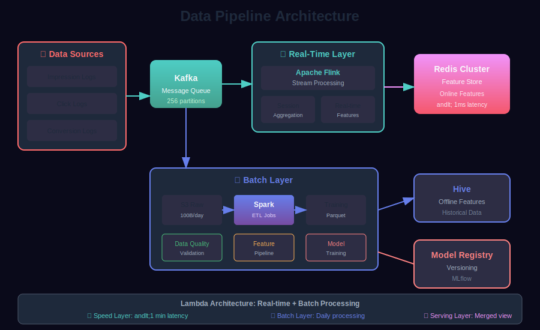
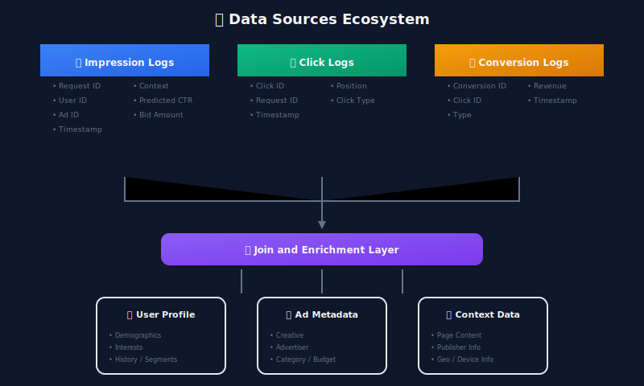
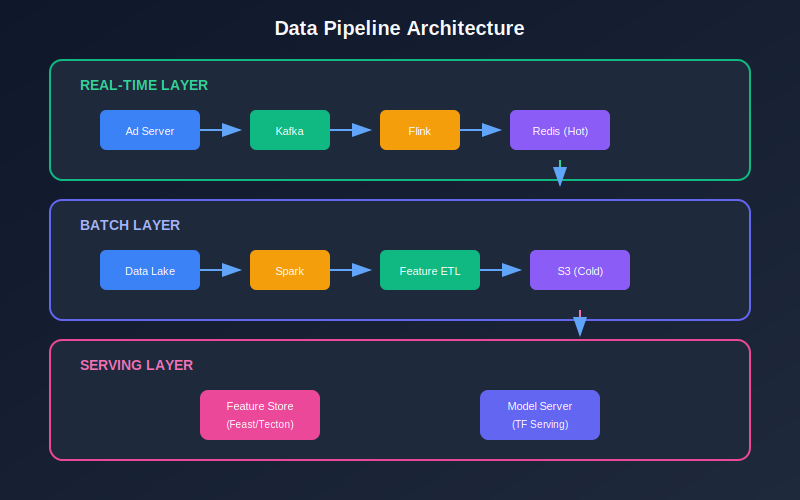
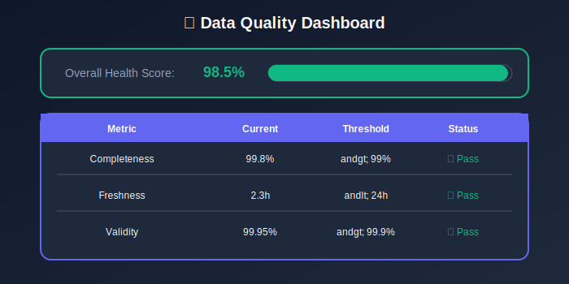
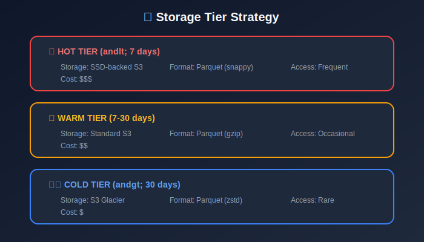
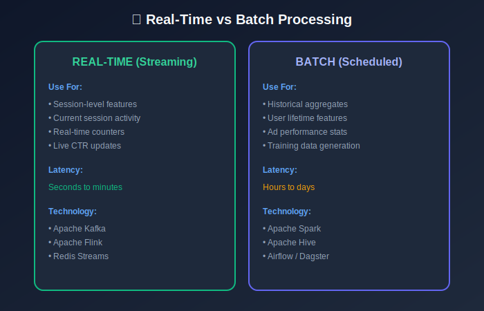

# Module 3: Data Engineering

## Building Robust Data Pipelines for CTR Systems

---

## 📊 Visual Overview





---

## 📖 Table of Contents

1. [Data Sources](#data-sources)
2. [Data Schema](#data-schema)
3. [Pipeline Architecture](#pipeline-architecture)
4. [Label Collection](#label-collection)
5. [Data Quality](#data-quality)
6. [Storage Strategy](#storage-strategy)

---

## Data Sources

### Primary Data Sources

| Source | Volume/Day | Retention | Update Frequency |
|--------|------------|-----------|------------------|
| Impression logs | 100B records | 90 days | Real-time |
| Click logs | 1B records | 90 days | Real-time |
| Conversion logs | 100M records | 1 year | Near real-time |
| User profiles | 1B profiles | Ongoing | Daily |
| Ad metadata | 100M ads | Ongoing | Hourly |

### Data Flow



---

## Data Schema

### Training Example Schema

| Feature Group | Examples | Cardinality |
|---------------|----------|-------------|
| **Labels** | clicked, converted | Binary |
| **User Features** | user_id, age, gender, interests | ~1B users |
| **Ad Features** | ad_id, category, advertiser | ~100M ads |
| **Context Features** | hour, device, position | ~10K |
| **Cross Features** | user×category affinity | Computed |

### Label Definition

**Click label** (binary):

$$
y = \begin{cases}
1 & \text{if user clicked within attribution window} \\
0 & \text{otherwise}
\end{cases}
$$

**Attribution window**: Typically 30 minutes from impression.

---

## Pipeline Architecture

### Lambda Architecture


| Layer | Purpose | Latency | Technology |
|-------|---------|---------|------------|
| **Speed Layer** | Real-time features | Seconds | Flink, Kafka |
| **Batch Layer** | Historical features | Hours | Spark, Hive |
| **Serving Layer** | Feature serving | Milliseconds | Redis, Feature Store |

### Data Flow Equations

**Streaming aggregation** (sliding window):

$$
\text{UserCTR}_{24h}(t) = \frac{\sum_{i: t-24h < t_i \leq t} \mathbb{1}[\text{click}_i]}{\sum_{i: t-24h < t_i \leq t} \mathbb{1}[\text{impression}_i]}
$$

**Exponential decay** for recency:

$$
\text{Feature}(t) = \sum_{i} w_i \cdot e^{-\lambda(t - t_i)}
$$

where $\lambda$ is the decay rate (e.g., $\lambda = \frac{\ln 2}{24h}$ for 24-hour half-life).

---

## Label Collection

### Click Attribution

**Challenge**: Clicks arrive with delay; need to decide when to label an impression as negative.

#### Attribution Window

$$
\text{Label}(\text{impression}) = \begin{cases}
1 & \exists \text{ click with } 0 < t_{\text{click}} - t_{\text{impression}} \leq W \\
0 & \text{after waiting period } T > W
\end{cases}
$$

Typical values: $W = 30$ minutes, $T = 2$ hours.

### Delayed Feedback Handling

**Label confidence** increases over time:

$$
\text{Confidence}(t) = \begin{cases}
1.0 & \text{if clicked (positive)} \\
1 - e^{-\lambda t} & \text{if not clicked (negative)}
\end{cases}
$$

After 24 hours, confidence ≈ 99.9% for negatives.



### Position Bias Correction

Users click more on higher positions regardless of relevance:

$$
P(\text{click} \mid \text{pos}, \text{ad}) = P(\text{examine} \mid \text{pos}) \times P(\text{click} \mid \text{examine}, \text{ad})
$$

**Inverse Propensity Weighting (IPW)**:

$$
w_i = \frac{1}{P(\text{examine} \mid \text{pos}_i)}
$$

**Position propensity estimation**:

$$
\hat{P}(\text{examine} \mid \text{pos}) = \frac{\text{CTR}_{\text{pos}}}{\text{CTR}_{\text{pos}=1}}
$$

---

## Data Quality

### Quality Dimensions

| Dimension | Metric | Threshold |
|-----------|--------|-----------|
| **Completeness** | $1 - \frac{\text{nulls}}{\text{total}}$ | > 99% |
| **Uniqueness** | $\frac{\text{distinct}}{\text{total}}$ | Context-dependent |
| **Freshness** | $t\_{\text{now}} - t\_{\text{latest}}$ | < 24 hours |
| **Validity** | $\frac{\text{valid values}}{\text{total}}$ | > 99.9% |

### Distribution Monitoring

**KL Divergence** for distribution drift:

$$
D_{KL}(P \| Q) = \sum_{x} P(x) \log \frac{P(x)}{Q(x)}
$$

**Population Stability Index (PSI)**:

$$
\text{PSI} = \sum_{i=1}^{n} (A_i - E_i) \times \ln\left(\frac{A_i}{E_i}\right)
$$

where $A\_i$ = actual proportion in bin $i$, $E\_i$ = expected proportion.

| PSI Value | Interpretation |
|-----------|----------------|
| < 0.1 | No significant change |
| 0.1 - 0.2 | Moderate change |
| > 0.2 | Significant shift |



---

## Storage Strategy

### Storage Tiers

| Tier | Technology | Use Case | Latency | Cost |
|------|------------|----------|---------|------|
| **Hot** | Redis Cluster | Real-time features | < 1ms | $$
$ |
| **Warm** | Cassandra/DynamoDB | Recent features | < 10ms |
$$ |
| **Cold** | S3/GCS + Parquet | Historical data | Seconds | $ |

### Partitioning Strategy

**Time-based partitioning**:
```
s3://data-lake/impressions/
  +-- date=2024-01-15/
      +-- hour=14/
          +-- country=US/
              +-- part-00001.parquet
```

**Optimal file size**: 256MB - 1GB for efficient queries.

### Data Retention

| Data Type | Retention | Reason |
|-----------|-----------|--------|
| Raw logs | 90 days | Privacy (GDPR) |
| Training data | 30 days | Model freshness |
| Aggregated features | 1 year | Long-term trends |
| Model artifacts | Forever | Reproducibility |



---

## Training Data Generation

### Join Strategy

**Impression-Click Join**:

$$
\text{TrainingData} = \text{Impressions} \underset{\text{impression\_id}}{\bowtie_{\text{left}}} \text{Clicks}
$$

### Negative Sampling

Due to extreme imbalance (~1% positives), downsample negatives:

$$
\text{Sample Rate} = \frac{\text{Target Positive Rate} \times (1 - \text{Original Positive Rate})}{\text{Original Positive Rate} \times (1 - \text{Target Positive Rate})}
$$

**Example**: To go from 1% to 10% positive rate:

$$
\text{Sample Rate} = \frac{0.10 \times 0.99}{0.01 \times 0.90} \approx 0.11 \text{ (keep 11\% of negatives)}
$$

**Important**: Apply inverse weight during training to correct for sampling:

$$
w_{\text{negative}} = \frac{1}{\text{Sample Rate}}
$$

---

## Key Takeaways

1. **Lambda architecture**: Combine streaming + batch for different latency needs
2. **Delayed feedback**: Wait before labeling negatives; use confidence scores
3. **Position bias**: Apply IPW correction for unbiased training
4. **Data quality**: Monitor PSI for distribution drift
5. **Negative sampling**: Downsample but correct with weights

---

## Next Steps

Continue to the next modules:
- [04_feature_engineering](../04_feature_engineering/README.md) — Design features
- [05_model_architecture](../05_model_architecture/README.md) — Build models

---

*Module 3 of 9 • [Back to Overview](../README.md)*

---

<div align="center">

**[⬆ Back to Top](#)** | **[📚 Main Repository](https://github.com/Gaurav14cs17/ml_system_design)**

Made with 💜 by [Gaurav14cs17](https://github.com/Gaurav14cs17)

</div>
