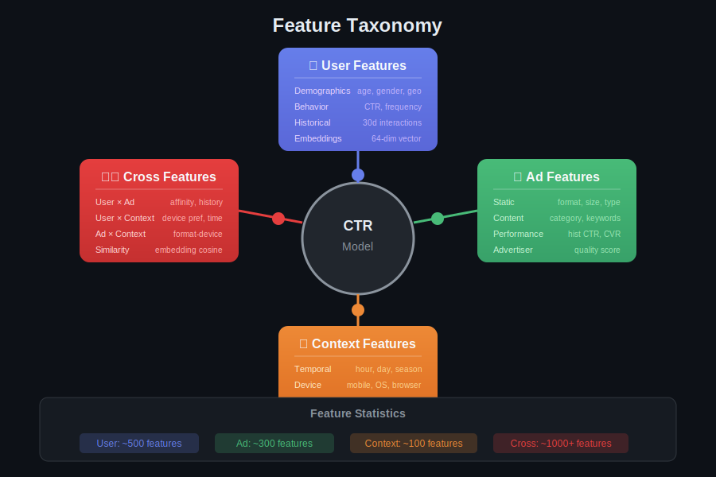
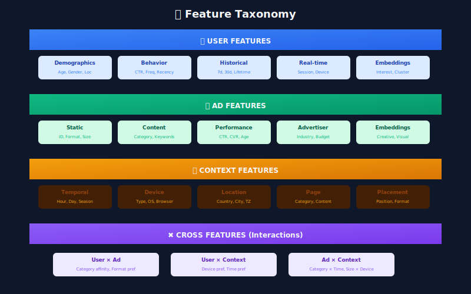
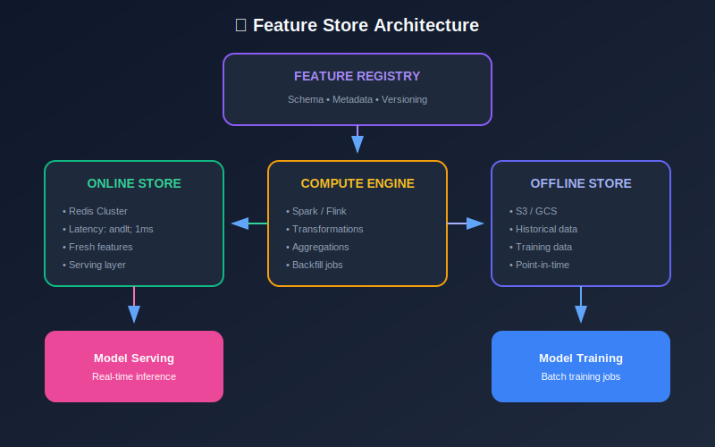
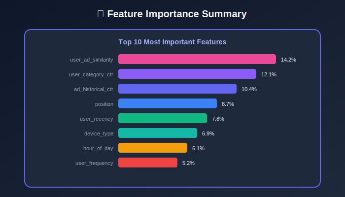

# Module 4: Feature Engineering

## Designing Features for High-Performance CTR Models

---

## 📊 Visual Overview





---

## 📖 Table of Contents

1. [Feature Taxonomy](#feature-taxonomy)

2. [User Features](#user-features)

3. [Ad Features](#ad-features)

4. [Context Features](#context-features)

5. [Cross Features](#cross-features)

6. [Feature Transformations](#feature-transformations)

7. [Feature Store](#feature-store)

---

## Feature Taxonomy

### Feature Categories

| Category | Count | Type | Update Frequency |
|----------|-------|------|------------------|
| **User Features** | ~500 | Dense + Sparse | Hourly |
| **Ad Features** | ~300 | Dense + Sparse | Daily |
| **Context Features** | ~100 | Dense | Real-time |
| **Cross Features** | ~1000+ | Sparse | Computed |

### Feature Types

| Type | Description | Example |
|------|-------------|---------|
| **Continuous** | Numeric values | CTR, age, time since last click |
| **Categorical** | Discrete values | Device type, country, ad category |
| **Embedding** | Learned vectors | User embedding, ad embedding |
| **Sequence** | Ordered list | User click history |

---

## User Features

### Behavioral Features

#### Historical CTR

Smoothed CTR using **Bayesian averaging**:

```math
\text{CTR}_{\text{smoothed}} = \frac{\text{clicks} + \alpha \cdot \text{prior}}{\text{impressions} + \alpha}

```

where:

- $\alpha$ = smoothing factor (typically 100-1000)

- $\text{prior}$ = global average CTR

**Example**: User with 5 clicks, 100 impressions, prior=0.02, α=100:

```math
\text{CTR}_{\text{smoothed}} = \frac{5 + 100 \times 0.02}{100 + 100} = \frac{7}{200} = 0.035

```

#### Recency Features

**Exponential decay** for time-sensitive features:

```math
\text{Recency Score} = e^{-\lambda \cdot \Delta t}

```

where $\Delta t$ = hours since last activity, $\lambda = \frac{\ln 2}{\text{half-life}}$.

| Half-life | Use Case |
|-----------|----------|
| 1 hour | Session-level |
| 24 hours | Daily patterns |
| 7 days | Weekly patterns |

#### Frequency Features

```math
\text{Frequency Bucket} = \lfloor \log_2(\text{impressions} + 1) \rfloor

```

| Bucket | Impressions | User Type |
|--------|-------------|-----------|
| 0 | 1 | New |
| 1-3 | 2-8 | Light |
| 4-6 | 9-64 | Medium |
| 7+ | 65+ | Heavy |

### Interest Embeddings

**User embedding** from interaction history:

```math
\mathbf{u} = \frac{\sum_{i \in \text{history}} w_i \cdot \mathbf{e}_i}{\sum_{i} w_i}

```

where:

- $\mathbf{e}_i$ = embedding of interacted item

- $w_i = r_i \cdot c_i$ = weight (recency × click indicator)

---

## Ad Features

### Performance Features

#### Ad CTR (Smoothed)

```math
\text{AdCTR} = \frac{\text{clicks} + \alpha \cdot \text{prior}}{\text{impressions} + \alpha}

```

#### Quality Score

Composite score combining multiple signals:

```math
\text{Quality} = w_1 \cdot \text{CTR}_{\text{norm}} + w_2 \cdot \text{LandingScore} + w_3 \cdot \text{CreativeScore}

```

where $\sum w_i = 1$.

### Freshness Features

**Ad age effect** (novelty decay):

```math
\text{Freshness} = \begin{cases}
1.0 & \text{age} < 1 \text{ day} \\
0.9 & \text{age} < 7 \text{ days} \\
0.7 & \text{age} < 30 \text{ days} \\
0.5 & \text{otherwise}
\end{cases}

```

### Creative Embeddings

Extract from ad creative using pre-trained models:

```math
\mathbf{a} = \text{Encoder}(\text{image}, \text{text})

```

Common encoders: CLIP, ResNet, BERT.

---

## Context Features

### Temporal Features

#### Cyclical Encoding

For periodic features (hour, day), use sin/cos encoding:

```math
\text{hour}_{\sin} = \sin\left(\frac{2\pi \cdot \text{hour}}{24}\right)
\text{hour}_{\cos} = \cos\left(\frac{2\pi \cdot \text{hour}}{24}\right)

```

This preserves continuity: hour 23 is close to hour 0.

| Feature | Period | Encoding |
|---------|--------|----------|
| Hour | 24 | sin/cos with period 24 |
| Day of week | 7 | sin/cos with period 7 |
| Day of month | 31 | sin/cos with period 31 |
| Month | 12 | sin/cos with period 12 |

### Position Features

**Position bias factor**:

```math
\text{PositionBias}(p) = \frac{\text{CTR}(p)}{\text{CTR}(1)}

```

Typical values:

| Position | Bias Factor |
|----------|-------------|
| 1 | 1.00 |
| 2 | 0.65 |
| 3 | 0.45 |
| 4 | 0.35 |
| 5+ | 0.25 |

---

## Cross Features

### User-Ad Interactions

#### Category Affinity

```math
\text{Affinity}(u, c) = \frac{\text{clicks}_{u,c} + \alpha \cdot \text{prior}_c}{\text{impressions}_{u,c} + \alpha}

```

#### Similarity Score

**Cosine similarity** between user and ad embeddings:

```math
\text{sim}(\mathbf{u}, \mathbf{a}) = \frac{\mathbf{u} \cdot \mathbf{a}}{\|\mathbf{u}\| \|\mathbf{a}\|}

```

#### Ad Fatigue

CTR decreases with repeated exposure:

```math
\text{Fatigue}(n) = \max(0, 1 - \gamma \cdot n)

```

where $n$ = number of previous impressions, $\gamma \approx 0.1$.

### Feature Crossing

#### Polynomial Features

```math
\phi(x_1, x_2) = [x_1, x_2, x_1 \cdot x_2, x_1^2, x_2^2]

```

#### Feature Hashing

For high-cardinality crosses, use hashing:

```math
\text{bucket} = \text{hash}(\text{feature}_1, \text{feature}_2) \mod M

```

where $M$ = number of hash buckets (typically 1M).



---

## Feature Transformations

### Numeric Transformations

| Transform | Formula | Use Case |
|-----------|---------|----------|
| **Log** | $\log(x + 1)$ | Heavy-tailed (impressions) |
| **Sqrt** | $\sqrt{x}$ | Moderate skew |
| **Z-score** | $\frac{x - \mu}{\sigma}$ | Standardization |
| **Min-max** | $\frac{x - \min}{\max - \min}$ | Bounded [0,1] |
| **Bucketize** | $\text{bin}(x, \text{boundaries})$ | Non-linear |

### Categorical Encoding

| Method | Output | Use Case |
|--------|--------|----------|
| **One-hot** | Sparse vector | Low cardinality |
| **Embedding** | Dense vector | High cardinality |
| **Hash** | Integer bucket | Very high cardinality |
| **Target encoding** | Smoothed mean | Categorical → numeric |

#### Target Encoding

```math
\text{TargetEnc}(c) = \lambda \cdot \bar{y}_c + (1-\lambda) \cdot \bar{y}_{\text{global}}

```

where $\lambda = \frac{n_c}{n_c + m}$, $m$ = smoothing parameter.

---

## Feature Store

### Architecture



### Online vs Offline Features

| Aspect | Online | Offline |
|--------|--------|---------|
| **Latency** | < 10ms | Minutes to hours |
| **Storage** | Redis, Memcached | S3, Hive, BigQuery |
| **Features** | User profile, recent activity | Historical aggregates |
| **Update** | Real-time streaming | Batch jobs |

### Feature Freshness

| Feature Type | Freshness | Storage |
|--------------|-----------|---------|
| Static (demographics) | Days | Batch |
| Behavioral (CTR) | Hours | Near-real-time |
| Session (current activity) | Seconds | Real-time |

### Point-in-Time Correctness

For training, features must reflect state at prediction time:

```math
\text{Features}(t) = \text{State}(\text{FeatureStore}, t)

```

Avoid **data leakage**: Never use future information.

---

## Feature Importance

### Metrics

**Permutation Importance**:

```math
\text{Importance}(f) = \text{Score}_{\text{baseline}} - \text{Score}_{f\text{ shuffled}}

```

**SHAP Values** (Shapley):

```math
\phi_i = \sum_{S \subseteq F \setminus \{i\}} \frac{|S|!(|F|-|S|-1)!}{|F|!} [f(S \cup \{i\}) - f(S)]

```

### Typical Importance Ranking

| Rank | Feature Type | Importance |
|------|--------------|------------|
| 1 | User-Ad cross features | 25% |
| 2 | User behavioral | 20% |
| 3 | Ad historical CTR | 15% |
| 4 | Position | 10% |
| 5 | Context (time, device) | 10% |
| 6-N | Other features | 20% |

---

## Key Takeaways

1. **Smoothed CTR**: Use Bayesian averaging for sparse data

2. **Cyclical encoding**: sin/cos for periodic features

3. **Cross features**: User-Ad interactions are most predictive

4. **Feature hashing**: Handle high cardinality efficiently

5. **Point-in-time**: Prevent data leakage in training

---

## Next Steps

Continue to the next modules:

- [05_model_architecture](../05_model_architecture/README.md) — Build prediction models

- [06_serving_infrastructure](../06_serving_infrastructure/README.md) — Deploy to production

---

*Module 4 of 9 • [Back to Overview](../README.md)*

---

<div align="center">

**[⬆ Back to Top](#)** | **[📚 Main Repository](https://github.com/Gaurav14cs17/ml_system_design)**

Made with 💜 by [Gaurav14cs17](https://github.com/Gaurav14cs17)

</div>
