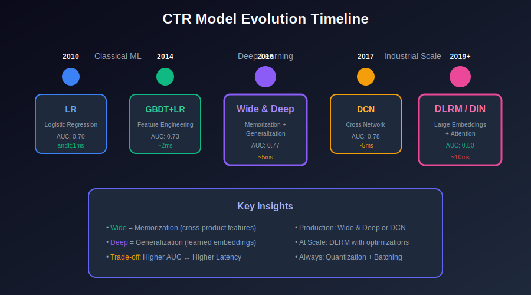
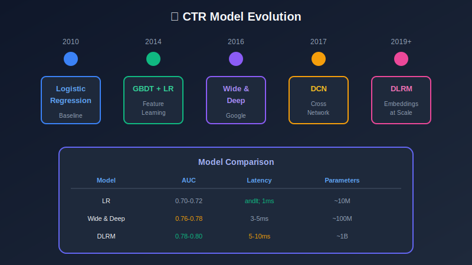

# Module 5: Model Architecture

## Deep Learning Architectures for CTR Prediction

---

## 📊 Visual Overview





---

## 📖 Table of Contents

1. [Model Evolution](#model-evolution)

2. [Deep Learning Architectures](#deep-learning-architectures)

3. [Loss Functions](#loss-functions)

4. [Optimization](#optimization)

5. [Calibration](#calibration)

6. [Model Compression](#model-compression)

---

## Model Evolution

### Historical Progression

| Era | Model | Key Innovation |
|-----|-------|----------------|
| 2010 | Logistic Regression | Baseline, interpretable |
| 2014 | GBDT + LR | Feature learning |
| 2016 | Wide & Deep | Memorization + Generalization |
| 2017 | Deep & Cross Network | Explicit feature crossing |
| 2019 | DLRM | Efficient embeddings |
| 2018+ | DIN, DIEN | Attention on user history |

### Model Comparison

| Model | AUC | Latency | Parameters |
|-------|-----|---------|------------|
| Logistic Regression | 0.70-0.72 | < 1ms | ~10M |
| Wide & Deep | 0.76-0.78 | 3-5ms | ~100M |
| DCN | 0.77-0.79 | 3-5ms | ~100M |
| DLRM | 0.78-0.80 | 5-10ms | ~1B |

---

## Deep Learning Architectures

### Logistic Regression (Baseline)

```math
\hat{y} = \sigma\left(\mathbf{w}^T \mathbf{x} + b\right) = \frac{1}{1 + e^{-(\mathbf{w}^T \mathbf{x} + b)}}

```

**Pros**: Fast, interpretable  
**Cons**: No feature interactions

---

### Factorization Machines (FM)

Model pairwise feature interactions efficiently:

```math
\hat{y} = w_0 + \sum_{i=1}^{d} w_i x_i + \sum_{i=1}^{d} \sum_{j=i+1}^{d} \langle \mathbf{v}_i, \mathbf{v}_j \rangle x_i x_j

```

where $\mathbf{v}_i \in \mathbb{R}^k$ is the latent vector for feature $i$.

**Efficient computation** in $O(kd)$ instead of $O(kd^2)$:

```math
\sum_{i=1}^{d} \sum_{j=i+1}^{d} \langle \mathbf{v}_i, \mathbf{v}_j \rangle x_i x_j = \frac{1}{2} \sum_{f=1}^{k} \left[ \left( \sum_{i=1}^{d} v_{i,f} x_i \right)^2 - \sum_{i=1}^{d} v_{i,f}^2 x_i^2 \right]

```

---

### Wide & Deep

```math
\hat{y} = \sigma\left( \mathbf{w}_{\text{wide}}^T [\mathbf{x}, \phi(\mathbf{x})] + \mathbf{a}_{\text{deep}}^{(L)} + b \right)

```

**Wide Component** (Memorization):

```math
y_{\text{wide}} = \mathbf{w}^T [\mathbf{x}, \phi(\mathbf{x})]

```

where $\phi(\mathbf{x})$ = cross-product features.

**Deep Component** (Generalization):

```math
\mathbf{a}^{(l+1)} = \text{ReLU}(\mathbf{W}^{(l)} \mathbf{a}^{(l)} + \mathbf{b}^{(l)})

```

---

### Deep & Cross Network (DCN)

**Cross Layer**:

```math
\mathbf{x}_{l+1} = \mathbf{x}_0 \cdot (\mathbf{w}_l^T \mathbf{x}_l) + \mathbf{b}_l + \mathbf{x}_l

```

This explicitly models feature interactions of degree $l+1$ at layer $l$.

**DCN-v2** (low-rank):

```math
\mathbf{x}_{l+1} = \mathbf{x}_0 \odot (\mathbf{W}_l \mathbf{x}_l + \mathbf{b}_l) + \mathbf{x}_l

```

where $\mathbf{W}_l = \mathbf{U}_l \mathbf{V}_l^T$ is low-rank.

---

### DLRM (Deep Learning Recommendation Model)

**Architecture**:

1. **Bottom MLP**: Dense features → embedding dimension

```math
\mathbf{e}_{\text{dense}} = \text{MLP}_{\text{bottom}}(\mathbf{x}_{\text{dense}})

```

2. **Embedding Tables**: Sparse features → embeddings

```math
\mathbf{e}_i = \text{Lookup}(\text{EmbeddingTable}_i, x_i)

```

3. **Feature Interaction**: Pairwise dot products

```math
\text{Interactions} = \{\langle \mathbf{e}_i, \mathbf{e}_j \rangle : i < j\}

```

4. **Top MLP**: Concatenate and predict

```math
\hat{y} = \text{MLP}_{\text{top}}([\mathbf{e}_{\text{dense}}; \mathbf{e}_1; ...; \mathbf{e}_n; \text{Interactions}])

```

---

### Deep Interest Network (DIN)

**Attention on user history**:

```math
\mathbf{u} = \sum_{i \in \text{history}} \alpha_i \cdot \mathbf{e}_i

```

where attention weight:

```math
\alpha_i = \frac{\exp(\text{MLP}(\mathbf{e}_i, \mathbf{e}_{\text{ad}}))}{\sum_j \exp(\text{MLP}(\mathbf{e}_j, \mathbf{e}_{\text{ad}}))}

```

The attention is **target-aware**: weights depend on the candidate ad.

---

## Loss Functions

### Binary Cross-Entropy (Log Loss)

```math
\mathcal{L}_{\text{BCE}} = -\frac{1}{N} \sum_{i=1}^{N} \left[ y_i \log(\hat{y}_i) + (1-y_i) \log(1-\hat{y}_i) \right]

```

### Weighted Cross-Entropy

For class imbalance:

```math
\mathcal{L}_{\text{WCE}} = -\frac{1}{N} \sum_{i=1}^{N} \left[ w_+ y_i \log(\hat{y}_i) + w_- (1-y_i) \log(1-\hat{y}_i) \right]

```

Typical weights: $w_+ = 10-100$, $w_- = 1$

### Focal Loss

Down-weight easy examples:

```math
\mathcal{L}_{\text{FL}} = -\frac{1}{N} \sum_{i=1}^{N} \alpha_t (1-p_t)^\gamma \log(p_t)

```

where:

- $p_t = \hat{y}$ if $y=1$, else $1-\hat{y}$

- $\gamma$ = focusing parameter (typically 2)

- $\alpha_t$ = class balancing weight

### Calibration-Aware Loss

```math
\mathcal{L} = \mathcal{L}_{\text{BCE}} + \lambda \cdot (\bar{\hat{y}} - \bar{y})^2

```

Penalizes difference between mean prediction and mean label.

---

## Optimization

### Gradient Descent

**Parameter update**:

```math
\theta_{t+1} = \theta_t - \eta \nabla_\theta \mathcal{L}

```

### Adam Optimizer

Adaptive learning rate per parameter:

```math
m_t = \beta_1 m_{t-1} + (1-\beta_1) g_t
v_t = \beta_2 v_{t-1} + (1-\beta_2) g_t^2
\hat{m}_t = \frac{m_t}{1-\beta_1^t}, \quad \hat{v}_t = \frac{v_t}{1-\beta_2^t}
\theta_{t+1} = \theta_t - \frac{\eta}{\sqrt{\hat{v}_t} + \epsilon} \hat{m}_t

```

Typical values: $\beta_1 = 0.9$, $\beta_2 = 0.999$, $\eta = 0.001$

### Learning Rate Schedule

**Exponential decay**:

```math
\eta_t = \eta_0 \cdot \gamma^{t/T}

```

**Warmup + decay**:

```math
\eta_t = \begin{cases}
\eta_{\max} \cdot \frac{t}{T_{\text{warmup}}} & t < T_{\text{warmup}} \\
\eta_{\max} \cdot \gamma^{(t-T_{\text{warmup}})/T_{\text{decay}}} & t \geq T_{\text{warmup}}
\end{cases}

```

---

## Calibration

### Why Calibration Matters

Predictions are used for bidding:

```math
\text{Bid} = \text{pCTR} \times \text{Value per Click}

```

If pCTR is miscalibrated, bids are wrong → revenue loss.

### Calibration Metrics

**Expected Calibration Error (ECE)**:

```math
\text{ECE} = \sum_{b=1}^{B} \frac{n_b}{N} |\text{acc}(b) - \text{conf}(b)|

```

where:

- $B$ = number of bins

- $\text{acc}(b)$ = accuracy in bin $b$

- $\text{conf}(b)$ = average confidence in bin $b$

### Platt Scaling

Post-hoc calibration:

```math
\hat{y}_{\text{calibrated}} = \sigma(a \cdot \hat{y} + b)

```

Learn $a, b$ on validation set by minimizing log loss.

### Isotonic Regression

Non-parametric calibration:

```math
\hat{y}_{\text{calibrated}} = g(\hat{y})

```

where $g$ is monotonic increasing, fit on validation set.

---

## Model Compression

### Quantization

Reduce precision from FP32 to INT8:

```math
x_{\text{int8}} = \text{round}\left(\frac{x}{\text{scale}}\right) + \text{zero_point}

```

**Benefits**: 4x smaller model, 2-3x faster inference

### Pruning

Remove small weights:

```math
w_{\text{pruned}} = \begin{cases}
w & |w| > \tau \\
0 & |w| \leq \tau
\end{cases}

```

**Benefits**: 2-10x compression, sparse operations

### Knowledge Distillation

Train small student from large teacher:

```math
\mathcal{L} = \alpha \mathcal{L}_{\text{hard}} + (1-\alpha) \mathcal{L}_{\text{soft}}

```

where:

```math
\mathcal{L}_{\text{soft}} = \text{KL}(\sigma(\mathbf{z}_T / T) \| \sigma(\mathbf{z}_S / T))

```

$T$ = temperature (higher = softer distributions)

---

## Training Best Practices

| Aspect | Recommendation |
|--------|----------------|
| **Batch size** | 4096-8192 |
| **Learning rate** | 1e-3 with warmup |
| **Regularization** | Dropout 0.2-0.5, L2 1e-5 |
| **Early stopping** | Patience 3-5 epochs |
| **Validation** | Time-based split (no shuffle) |

---

## Key Takeaways

1. **Wide & Deep**: Memorization (wide) + Generalization (deep)

2. **DCN**: Explicit polynomial feature crossing

3. **DLRM**: Efficient embedding-based architecture

4. **Focal Loss**: Handle extreme class imbalance

5. **Calibration**: Critical for bidding systems

6. **Compression**: Quantization for 4x speedup

---

## Next Steps

Continue to the next modules:

- [06_serving_infrastructure](../06_serving_infrastructure/README.md) — Deploy models

- [07_ab_testing](../07_ab_testing/README.md) — Evaluate models

---

*Module 5 of 9 • [Back to Overview](../README.md)*

---

<div align="center">

**[⬆ Back to Top](#)** | **[📚 Main Repository](https://github.com/Gaurav14cs17/ml_system_design)**

Made with 💜 by [Gaurav14cs17](https://github.com/Gaurav14cs17)

</div>
