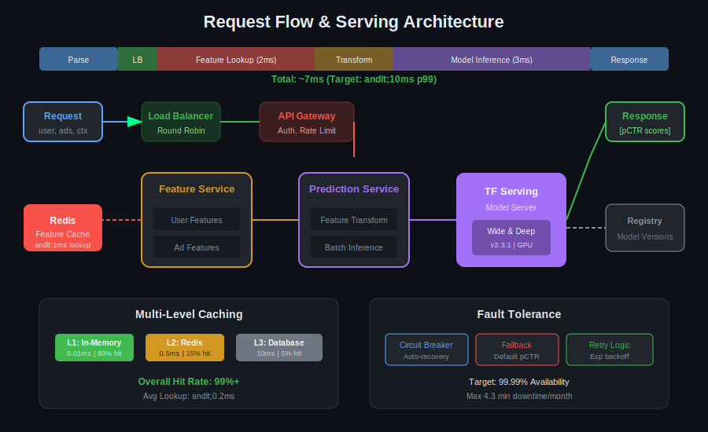
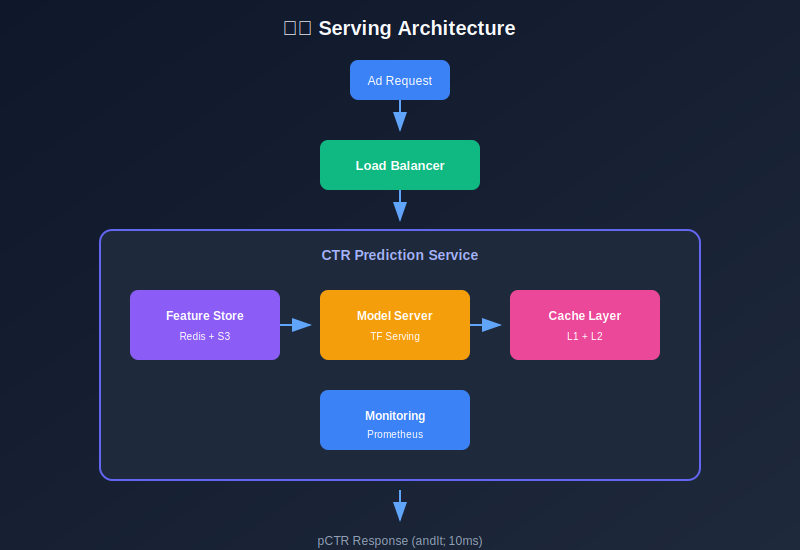
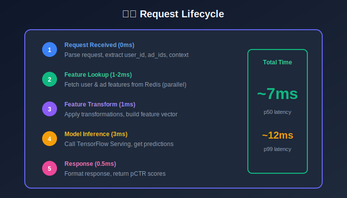
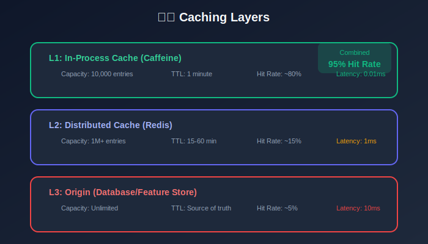

# Module 6: Serving Infrastructure

## Production-Ready Model Serving for CTR Systems

---

## 📊 Visual Overview

---

## 📖 Table of Contents

1. [Architecture Overview](#architecture-overview)

2. [Model Serving](#model-serving)

3. [Feature Serving](#feature-serving)

4. [Caching Strategy](#caching-strategy)

5. [Load Balancing](#load-balancing)

6. [Fault Tolerance](#fault-tolerance)

---

## Architecture Overview

### Request Flow

### Latency Breakdown

| Component | Time | Optimization |
|-----------|------|--------------|
| Load balancer | 0.3ms | Connection pooling |
| Feature lookup | 2.0ms | Multi-level cache |
| Feature transform | 1.0ms | Pre-computation |
| Model inference | 3.0ms | Batching, quantization |
| Response | 0.5ms | Compression |
| **Total** | **~7ms** | - |

---

## Model Serving

### Serving Strategies

| Strategy | Throughput | Latency | Use Case |
|----------|------------|---------|----------|
| **Sync** | Low | Predictable | Simple requests |
| **Batching** | High | Variable | GPU inference |
| **Async** | High | Low | High throughput |

### Dynamic Batching

Collect requests and process together:

**Throughput gain**:

$$\text{Throughput} = \frac{\text{Batch Size}}{\text{Latency}_{\text{batch}}}$$

**Optimal batch size**:

$$B^* = \arg\max_B \frac{B}{T_{\text{setup}} + B \cdot T_{\text{per\_sample}}}$$

| Batch Size | Latency (ms) | Throughput (QPS/GPU) |
|------------|--------------|----------------------|
| 1 | 2 | 500 |
| 32 | 5 | 6,400 |
| 128 | 15 | 8,500 |
| 256 | 28 | 9,100 |

### Batching Trade-off

Wait time vs batch efficiency:

$$\text{Total Latency} = T_{\text{wait}} + T_{\text{inference}}(B)
T_{\text{wait}} = \min(T_{\text{timeout}}, T_{\text{batch\_full}})$$

Typical timeout: 1-5ms

---

## Feature Serving

### Feature Lookup Latency

$$T_{\text{total}} = \max(T_{\text{user}}, T_{\text{ad}}, T_{\text{context}})$$

**Parallel fetching** reduces latency from sum to max.

### Feature Store Design

| Tier | Storage | Latency | Data |
|------|---------|---------|------|
| L1 | In-memory | < 0.1ms | Hot features |
| L2 | Redis | < 1ms | User/Ad features |
| L3 | Database | < 10ms | Cold features |

### Cache Hit Rate Impact

$$T_{\text{avg}} = p_{\text{hit}} \cdot T_{\text{cache}} + (1 - p_{\text{hit}}) \cdot T_{\text{origin}}$$

| Hit Rate | Avg Latency | Notes |
|----------|-------------|-------|
| 90% | 1.9ms | Typical |
| 95% | 1.45ms | Good |
| 99% | 1.09ms | Excellent |

Assuming $T_{\text{cache}} = 1\text{ms}$, $T_{\text{origin}} = 10\text{ms}$.

---

## Caching Strategy

### Multi-Level Cache

### Cache Key Design

$$\text{key} = \text{hash}(\text{entity\_type}, \text{entity\_id}, \text{feature\_version})$$

### TTL Strategy

| Feature Type | TTL | Rationale |
|--------------|-----|-----------|
| User static | 24h | Demographics rarely change |
| User behavioral | 1h | Activity patterns |
| Ad metadata | 24h | Stable |
| Ad stats | 15min | Performance updates |
| Context | 0 | Always compute |

### Cache Invalidation

**Write-through**: Update cache on write

$$\text{Write}(DB) \rightarrow \text{Write}(Cache)$$

**Write-behind**: Async cache update

$$\text{Write}(Cache) \rightarrow \text{Async Write}(DB)$$

### Cache Warming

Pre-populate cache before traffic:

$$\text{Warm Set} = \text{Top-K Users} \cup \text{Active Ads} \cup \text{Common Contexts}$$

---

## Load Balancing

### Algorithms

| Algorithm | Behavior | Best For |
|-----------|----------|----------|
| **Round Robin** | Rotate through servers | Uniform requests |
| **Least Connections** | Route to least busy | Variable latency |
| **Weighted** | Proportional to capacity | Heterogeneous servers |
| **Consistent Hash** | Same user → same server | Session affinity |

### Weighted Load Balancing

$$P(\text{server}_i) = \frac{w_i}{\sum_j w_j}$$

where $w_i$ = server capacity weight.

### Health Checks

**Success rate threshold**:

$$\text{Healthy} = \frac{\text{Successful Checks}}{\text{Total Checks}} > 0.8$$

**Latency threshold**:

$$\text{Healthy} = T_{p99} < T_{\text{threshold}}$$

---

## Fault Tolerance

### Graceful Degradation

When components fail, fall back to simpler predictions:

| Failure | Fallback | Impact |
|---------|----------|--------|
| Model server | Historical CTR | -5% AUC |
| Feature store | Default features | -10% AUC |
| Cache | Direct DB lookup | +10ms latency |

### Fallback Prediction

$$\hat{y}_{\text{fallback}} = \lambda \cdot \text{CTR}_{\text{segment}} + (1-\lambda) \cdot \text{CTR}_{\text{global}}$$

where segment = device type, category, etc.

### Circuit Breaker

State machine to prevent cascade failures:

| State | Behavior | Transition |
|-------|----------|------------|
| **Closed** | Normal operation | → Open if error rate > threshold |
| **Open** | Reject requests | → Half-open after timeout |
| **Half-open** | Allow probe requests | → Closed if success, else Open |

**Error rate threshold**:

$$\text{Open Circuit if } \frac{\text{Failures}}{\text{Requests}} > \epsilon \text{ in window } T$$

Typical: $\epsilon = 0.5$, $T = 10s$

### Retry Strategy

**Exponential backoff**:

$$T_{\text{wait}} = \min(T_{\max}, T_{\text{base}} \cdot 2^{\text{attempt}})$$

**With jitter**:

$$T_{\text{wait}} = T_{\text{base}} \cdot 2^{\text{attempt}} + \text{rand}(0, T_{\text{jitter}})$$

Prevents thundering herd.

---

## Deployment Strategies

### Canary Deployment

Gradually shift traffic to new version:

$$\text{Traffic}_{\text{new}}(t) = \min(100\%, p_0 + r \cdot t)$$

| Phase | Traffic % | Duration |
|-------|-----------|----------|
| 1 | 1% | 1 hour |
| 2 | 5% | 2 hours |
| 3 | 20% | 4 hours |
| 4 | 50% | 8 hours |
| 5 | 100% | - |

### Rollback Criteria

Automatic rollback if:

$$\text{Metric}_{\text{canary}} < \text{Metric}_{\text{baseline}} - \delta$$

| Metric | Threshold (δ) |
|--------|---------------|
| Error rate | +0.1% |
| Latency p99 | +5ms |
| CTR | -1% |

---

## Performance Metrics

### Key SLIs

$$\text{Availability} = \frac{\text{Successful Requests}}{\text{Total Requests}}
\text{Latency}_{p99} = \text{percentile}_{99}(\text{response times})
\text{Throughput} = \frac{\text{Requests}}{\text{Time}}$$

### Capacity Planning

$$\text{Servers Needed} = \frac{\text{Peak QPS}}{\text{QPS per Server} \times \text{Utilization Target}}$$

---

## Key Takeaways

1. **Batching**: 10x throughput with dynamic batching

2. **Multi-level cache**: L1 memory, L2 Redis, L3 database

3. **Parallel fetching**: Max latency instead of sum

4. **Circuit breakers**: Prevent cascade failures

5. **Canary deployments**: Gradual rollout with auto-rollback

---

## Next Steps

Continue to the next modules:

- [07_ab_testing](../07_ab_testing/README.md) — Experiment framework

- [08_monitoring](../08_monitoring/README.md) — Production monitoring

---

*Module 6 of 9 • [Back to Overview](../README.md)*

---

**[⬆ Back to Top](#)** | **[📚 Main Repository](https://github.com/Gaurav14cs17/ml_system_design)**

Made with 💜 by [Gaurav14cs17](https://github.com/Gaurav14cs17)

