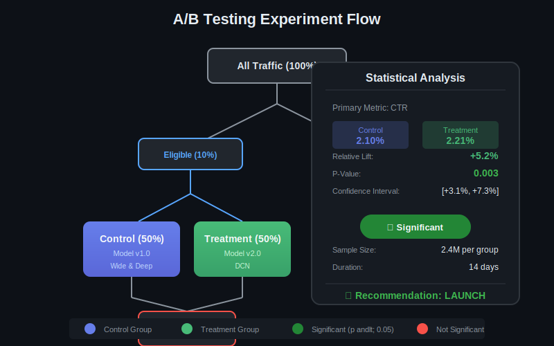
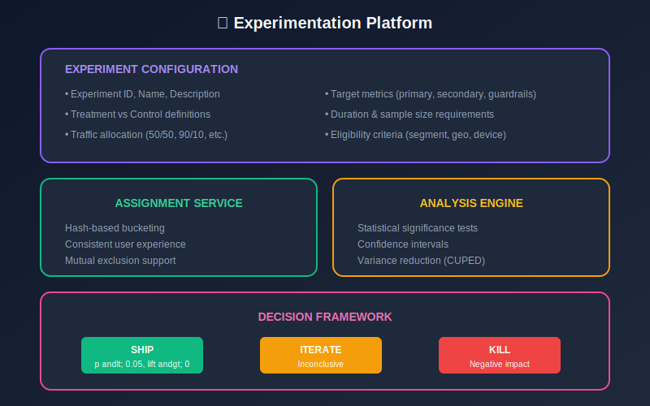
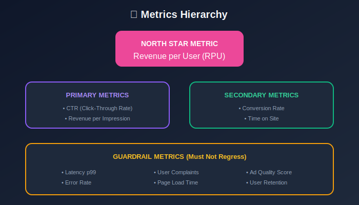
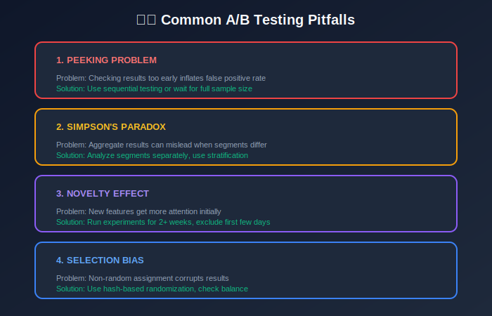
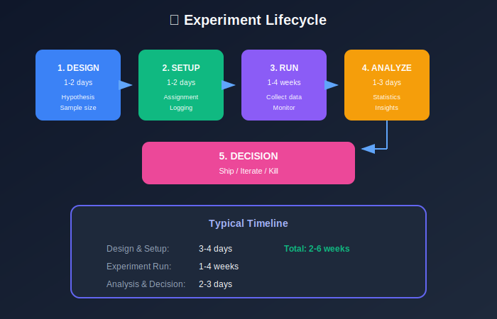

# Module 7: A/B Testing & Experimentation

## Statistical Experimentation for CTR Model Evaluation

---

## 📊 Visual Overview





---

## 📖 Table of Contents

1. [Experimentation Framework](#experimentation-framework)
2. [Experiment Design](#experiment-design)
3. [Statistical Analysis](#statistical-analysis)
4. [Common Pitfalls](#common-pitfalls)
5. [Advanced Methods](#advanced-methods)

---

## Experimentation Framework

### A/B Test Structure

| Component | Description |
|-----------|-------------|
| **Control (A)** | Current production model |
| **Treatment (B)** | New candidate model |
| **Randomization Unit** | User ID (for consistency) |
| **Primary Metric** | CTR or Revenue |

### Traffic Allocation



**Hash-based assignment** for consistency:

```math
\text{bucket} = \text{hash}(\text{user\_id}, \text{experiment\_id}) \mod 1000

```

User always sees same variant.

---

## Experiment Design

### Sample Size Calculation

For detecting relative lift $\delta$ in proportion metric:

```math
n = \frac{2(z_{\alpha/2} + z_\beta)^2 \cdot p(1-p)}{(p \cdot \delta)^2}

```

where:

- $p$ = baseline conversion rate (CTR)

- $\delta$ = minimum detectable effect (relative)

- $z\_{\alpha/2}$ = z-score for significance level (1.96 for α=0.05)

- $z\_\beta$ = z-score for power (0.84 for 80% power)

**Example**: Detect 2% relative lift in 2% CTR:

```math
n = \frac{2(1.96 + 0.84)^2 \cdot 0.02 \cdot 0.98}{(0.02 \cdot 0.02)^2} = \frac{2 \cdot 7.84 \cdot 0.0196}{0.00000016} \approx 1.9M

```

### Sample Size Table

| Baseline CTR | MDE (Relative) | Sample Size (per arm) |
|--------------|----------------|----------------------|
| 1% | 5% | 3.1M |
| 1% | 10% | 784K |
| 2% | 5% | 1.5M |
| 2% | 10% | 392K |
| 5% | 5% | 598K |
| 5% | 10% | 152K |

### Experiment Duration

```math
\text{Duration} = \frac{\text{Sample Size per Arm} \times 2}{\text{Daily Traffic} \times \text{Allocation \%}}

```

**Example**: 2M samples needed, 10M daily traffic, 10% allocation:

```math
\text{Duration} = \frac{2M \times 2}{10M \times 0.1} = \frac{4M}{1M} = 4 \text{ days}

```

**Minimum**: Run for at least 1-2 weeks to capture weekly patterns.

---

## Statistical Analysis

### Hypothesis Testing

**Null hypothesis**: $H\_0: \mu\_B = \mu\_A$ (no difference)

**Alternative**: $H\_1: \mu\_B \neq \mu\_A$ (two-sided)

### Two-Proportion Z-Test (for CTR)

```math
z = \frac{\hat{p}_B - \hat{p}_A}{\sqrt{\hat{p}(1-\hat{p})(\frac{1}{n_A} + \frac{1}{n_B})}}

```

where $\hat{p} = \frac{x\_A + x\_B}{n\_A + n\_B}$ is the pooled proportion.

**P-value** (two-sided):

```math
p = 2 \cdot (1 - \Phi(|z|))

```

### Confidence Interval

For difference $\hat{p}\_B - \hat{p}\_A$:

```math
CI = (\hat{p}_B - \hat{p}_A) \pm z_{\alpha/2} \cdot \sqrt{\frac{\hat{p}_A(1-\hat{p}_A)}{n_A} + \frac{\hat{p}_B(1-\hat{p}_B)}{n_B}}

```

**Interpretation**: If CI excludes 0, difference is significant.

### Relative Lift

```math
\text{Lift} = \frac{\hat{p}_B - \hat{p}_A}{\hat{p}_A} \times 100\%

```

**Confidence interval for lift**:

```math
CI_{\text{lift}} = \frac{CI_{\text{diff}}}{\hat{p}_A}

```

---

### Example Analysis

| Metric | Control | Treatment |
|--------|---------|-----------|
| Impressions | 1,000,000 | 1,000,000 |
| Clicks | 20,000 | 21,000 |
| CTR | 2.00% | 2.10% |

**Calculations**:

- $\hat{p}\_A = 0.020$, $\hat{p}\_B = 0.021$

- $\hat{p} = 0.0205$

- $SE = \sqrt{0.0205 \times 0.9795 \times (\frac{1}{1M} + \frac{1}{1M})} = 0.000202$

- $z = \frac{0.021 - 0.020}{0.000202} = 4.95$

- $p < 0.0001$ ✓ Significant

**Lift**: $\frac{0.001}{0.020} = 5\%$ relative improvement

---

## Metrics Framework

### Metrics Hierarchy

| Type | Examples | Purpose |
|------|----------|---------|
| **Primary** | CTR, Revenue | Decision metric |
| **Secondary** | Conversion rate, Time on site | Supporting evidence |
| **Guardrail** | Latency, Error rate | Must not degrade |



### Guardrail Metrics

Check that guardrails are not violated:

```math
\text{Pass} = \text{Metric}_{\text{treatment}} \geq \text{Metric}_{\text{control}} - \epsilon

```

| Guardrail | Threshold (ε) |
|-----------|---------------|
| Latency p99 | +5ms |
| Error rate | +0.1% |
| User complaints | +10% |

---

## Common Pitfalls

### 1. Peeking Problem

Checking results repeatedly inflates false positive rate.

**Multiple testing correction** (Bonferroni):

```math
\alpha_{\text{adjusted}} = \frac{\alpha}{n_{\text{tests}}}

```

**Sequential testing**: Use spending functions.

### 2. Simpson's Paradox

Aggregate results can mislead when segments differ.

**Solution**: Analyze segments separately.

### 3. Novelty Effect

New features get more attention initially.

**Solution**: Run experiments for 2+ weeks; exclude first few days from analysis.

### 4. Selection Bias

Non-random assignment corrupts results.

**Solution**: Use hash-based randomization; check balance.

### 5. Interference

Users in treatment affect control users.

**Solution**: Use cluster randomization for social effects.



---

## Advanced Methods

### Variance Reduction (CUPED)

Reduce variance using pre-experiment data:

```math
\hat{Y}_{\text{adj}} = \hat{Y} - \theta(\bar{X} - \mathbb{E}[X])

```

where:

- $X$ = pre-experiment metric (covariate)

- $\theta = \frac{\text{Cov}(Y, X)}{\text{Var}(X)}$

**Variance reduction**:

```math
\text{Var}(\hat{Y}_{\text{adj}}) = \text{Var}(\hat{Y})(1 - \rho^2)

```

Can reduce required sample size by 50% if $\rho = 0.7$.

### Stratified Sampling

Ensure balance across important segments:

```math
\hat{\tau} = \sum_{s} w_s \cdot \hat{\tau}_s

```

where $w\_s = \frac{n\_s}{n}$ is stratum weight.

### Bayesian A/B Testing

**Posterior probability** of B being better:

```math
P(\mu_B > \mu_A \mid \text{data}) = \int_0^\infty \int_0^x p(\mu_A \mid \text{data}) \cdot p(\mu_B \mid \text{data}) \, d\mu_A \, d\mu_B

```

**Expected loss** for choosing B:

```math
\mathbb{E}[\text{Loss}_B] = \int \max(0, \mu_A - \mu_B) \cdot p(\mu_A, \mu_B \mid \text{data}) \, d\mu_A \, d\mu_B

```

### Multi-Armed Bandits

**Thompson Sampling**: Balance exploration and exploitation.

```math
\text{Sample } \theta_i \sim \text{Beta}(\alpha_i, \beta_i)
\text{Choose } \arg\max_i \theta_i

```

Use when:

- Many variants to test

- Willing to sacrifice statistical purity for faster learning

---

## Experiment Lifecycle


| Phase | Duration | Activities |
|-------|----------|------------|
| **Design** | 1 week | Define metrics, calculate sample size |
| **Setup** | 1-2 days | Configure assignment, logging |
| **Burn-in** | 1-2 days | Check data quality |
| **Run** | 1-4 weeks | Collect data |
| **Analyze** | 1-3 days | Statistical analysis |
| **Decision** | 1 day | Ship, iterate, or kill |

---

## Key Takeaways

1. **Sample size**: Calculate before running; don't peek
2. **Consistency**: Same user always sees same variant
3. **Duration**: Run full weeks to capture patterns
4. **Guardrails**: Monitor metrics that must not degrade
5. **Variance reduction**: CUPED can halve required sample size
6. **Multiple testing**: Adjust for many comparisons

---

## Next Steps

Continue to the next modules:

- [08_monitoring](../08_monitoring/README.md) — Monitor experiments and production

- [09_scaling_optimization](../09_scaling_optimization/README.md) — Scale the platform

---

*Module 7 of 9 • [Back to Overview](../README.md)*

---

<div align="center">

**[⬆ Back to Top](#)** | **[📚 Main Repository](https://github.com/Gaurav14cs17/ml_system_design)**

Made with 💜 by [Gaurav14cs17](https://github.com/Gaurav14cs17)

</div>
