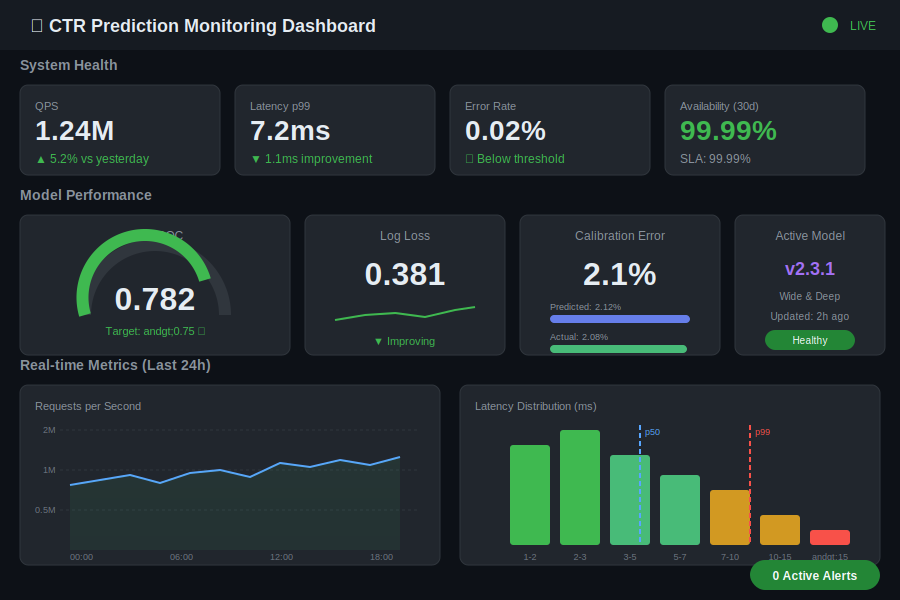
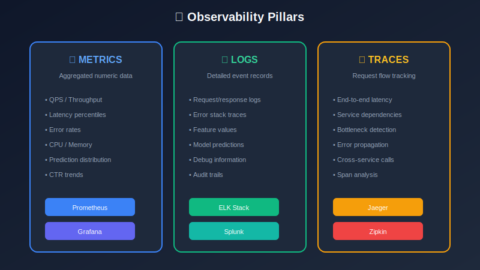
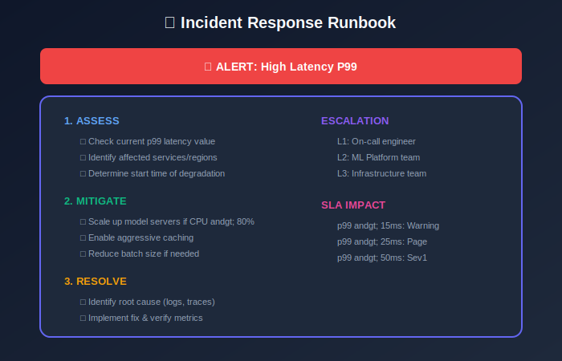

# Module 8: Monitoring & Observability

## Production Monitoring for CTR Systems

---

## 📊 Visual Overview





---

## 📖 Table of Contents

1. [Monitoring Architecture](#monitoring-architecture)

2. [Key Metrics](#key-metrics)

3. [Alerting Strategy](#alerting-strategy)

4. [Model Monitoring](#model-monitoring)

5. [Dashboards](#dashboards)

6. [Incident Response](#incident-response)

---

## Monitoring Architecture

### Three Pillars of Observability

| Pillar | Purpose | Tools |
|--------|---------|-------|
| **Metrics** | Quantitative measurements | Prometheus, Datadog |
| **Logs** | Detailed event records | ELK, Splunk |
| **Traces** | Request flow tracking | Jaeger, Zipkin |

### Monitoring Flow


---

## Key Metrics

### System Metrics

#### Latency

**Percentiles** (more informative than average):

```math
p_{k} = \text{value at } k\text{-th percentile}

```

| Percentile | Target | SLO |
|------------|--------|-----|
| p50 | 3ms | Median experience |
| p90 | 7ms | Most users |
| p99 | 15ms | Tail latency |
| p99.9 | 30ms | Worst case |

#### Throughput

```math
\text{QPS} = \frac{\text{Total Requests}}{\text{Time Window}}
\text{RPS}_{\text{success}} = \frac{\text{2xx Responses}}{\text{Time Window}}

```

#### Error Rate

```math
\text{Error Rate} = \frac{\text{5xx} + \text{Timeouts}}{\text{Total Requests}}

```

Target: < 0.01%

#### Availability

```math
\text{Availability} = \frac{\text{Uptime}}{\text{Total Time}} = \frac{\text{Success Requests}}{\text{Total Requests}}

```

| Target | Monthly Downtime |
|--------|------------------|
| 99.9% | 43.8 minutes |
| 99.99% | 4.38 minutes |
| 99.999% | 26 seconds |

### Resource Metrics

```math
\text{CPU Utilization} = \frac{\text{CPU Time Used}}{\text{CPU Time Available}}
\text{Memory Utilization} = \frac{\text{Memory Used}}{\text{Memory Total}}

```

| Resource | Warning | Critical |
|----------|---------|----------|
| CPU | > 70% | > 90% |
| Memory | > 75% | > 90% |
| Disk | > 80% | > 95% |

---

## Model Metrics

### Prediction Distribution

Monitor shift in predicted CTR:

```math
\bar{p}_{\text{pred}} = \frac{1}{N} \sum_{i=1}^{N} \hat{y}_i

```

**Alert if**:

```math

|\bar{p}_{\text{pred}}(t) - \bar{p}_{\text{pred}}(t-1)| > \epsilon

```

Typical $\epsilon = 0.001$ (10% relative change for 1% CTR).

### Calibration Drift

```math
\text{Calibration Ratio} = \frac{\bar{p}_{\text{pred}}}{\bar{p}_{\text{actual}}}

```

Target: 0.95 - 1.05 (within 5%)

### Feature Missing Rate

```math
\text{Missing Rate}(f) = \frac{\text{Count}(f = \text{null})}{\text{Total Requests}}

```

Alert threshold: > 1% for critical features.

### Model Staleness

```math
\text{Staleness} = t_{\text{now}} - t_{\text{model_trained}}

```

Alert if staleness > 24 hours.

---

## Alerting Strategy

### Alert Levels

| Level | Response Time | Examples |
|-------|---------------|----------|
| **P1 - Critical** | 15 minutes | Service down, > 50% error rate |
| **P2 - High** | 1 hour | Latency spike, model degradation |
| **P3 - Medium** | 4 hours | Feature drift, minor errors |
| **P4 - Low** | 24 hours | Trends, capacity warnings |

### Alert Rules



| Metric | Condition | Severity |
|--------|-----------|----------|
| Error rate | > 0.1% for 5 min | P1 |
| Latency p99 | > 20ms for 10 min | P2 |
| Throughput | < 50% baseline for 5 min | P1 |
| Prediction shift | > 10% for 1 hour | P2 |
| Feature missing | > 5% for 15 min | P2 |
| CTR drop | > 5% for 2 hours | P2 |
| Model staleness | > 48 hours | P3 |

### Burn Rate Alerting

For SLO-based alerting:

```math
\text{Burn Rate} = \frac{\text{Error Rate}}{\text{Error Budget Rate}}

```

where Error Budget Rate = $(1 - \text{SLO Target}) / \text{Period}$

| Burn Rate | Meaning |
|-----------|---------|
| 1x | On track |
| 2x | Will exhaust in half the time |
| 10x | Critical, exhaust in days |

**Alert thresholds**:

- 14.4x burn rate for 1 hour → Page

- 6x burn rate for 6 hours → Page

- 1x burn rate for 3 days → Ticket

---

## Model Monitoring

### Performance Degradation Detection

#### Statistical Tests

**Population Stability Index (PSI)**:

```math
\text{PSI} = \sum_{i=1}^{n} (A_i - E_i) \times \ln\left(\frac{A_i}{E_i}\right)

```

| PSI | Interpretation | Action |
|-----|----------------|--------|
| < 0.1 | No change | None |
| 0.1 - 0.2 | Moderate change | Investigate |
| > 0.2 | Significant shift | Retrain |

#### KL Divergence

```math
D_{KL}(P \| Q) = \sum_{x} P(x) \log \frac{P(x)}{Q(x)}

```

Monitor feature and prediction distributions.

### Concept Drift Detection

**Window comparison**:

```math
\text{Drift Score} = d(\text{Distribution}_{\text{recent}}, \text{Distribution}_{\text{baseline}})

```

Common metrics: KS statistic, Jensen-Shannon divergence.

### A/B Test Monitoring

During experiments, monitor:

- Sample ratio mismatch (SRM)

- Pre-experiment period balance

- Novelty effects

```math
\text{SRM} = \chi^2\left(\frac{n_A}{n_B}, \frac{\text{expected}_A}{\text{expected}_B}\right)

```

---

## Dashboards

### Key Dashboard Panels

| Panel | Metrics |
|-------|---------|
| **Traffic** | QPS, requests by endpoint |
| **Latency** | p50, p90, p99 over time |
| **Errors** | Error rate, error types |
| **Model** | Prediction distribution, calibration |
| **Features** | Missing rates, staleness |
| **Resources** | CPU, memory, disk |

### Dashboard Layout

```
+---------------------------------------------------------+

|  Traffic Overview    |    Error Rate     |   Latency   |
|  ████████████████    |    0.02%          |   p99: 8ms  |
+---------------------------------------------------------+

|  Prediction Distribution           |  Calibration Ratio |
|  ▁▂▃▄▅▆▇█▇▆▅▄▃▂▁                  |       0.98         |
+---------------------------------------------------------+

|  Feature Health                    |  Model Freshness   |
|  Missing: 0.1%                     |  Updated: 2h ago   |
+---------------------------------------------------------+

```

---

## Incident Response

### Runbook Structure

| Section | Content |
|---------|---------|
| **Symptoms** | What alerts fired, user impact |
| **Diagnosis** | Steps to identify root cause |
| **Mitigation** | Immediate actions to reduce impact |
| **Resolution** | How to fully fix the issue |
| **Prevention** | Long-term improvements |

### Common Incidents

| Incident | Detection | Mitigation |
|----------|-----------|------------|
| Model serving down | Error rate spike | Traffic to fallback |
| High latency | p99 alert | Scale up, disable non-critical features |
| Feature store down | Missing rate spike | Use cached/default features |
| Model degradation | CTR drop | Rollback to previous model |
| Data pipeline delay | Staleness alert | Use stale features, investigate pipeline |

### Severity Classification

```math
\text{Severity} = f(\text{User Impact}, \text{Business Impact}, \text{Duration})

```

| Severity | User Impact | Business Impact |
|----------|-------------|-----------------|
| SEV1 | All users affected | Revenue loss |
| SEV2 | > 10% users | Significant degradation |
| SEV3 | < 10% users | Minor degradation |
| SEV4 | No users | Potential future issue |

---

## Best Practices

### Metric Collection

1. **Use percentiles** over averages for latency

2. **Set baselines** before comparing

3. **Aggregate appropriately** (rates for errors, sums for counts)

4. **Retain history** for trend analysis (30+ days)

### Alert Hygiene

1. **Every alert must be actionable**

2. **Reduce noise**: tune thresholds, use aggregation

3. **Test alerts**: verify they fire correctly

4. **Review regularly**: remove stale alerts

### Capacity Planning

```math
\text{Headroom} = 1 - \frac{\text{Current Load}}{\text{Max Capacity}}

```

Maintain > 30% headroom for traffic spikes.

---

## Key Takeaways

1. **Three pillars**: Metrics, logs, traces for complete observability

2. **Percentiles**: Use p50, p90, p99 instead of averages

3. **SLO-based alerting**: Burn rate alerts on error budget

4. **Model monitoring**: Track PSI, calibration, feature health

5. **Runbooks**: Prepare for common incidents

---

## Next Steps

Continue to the next module:

- [09_scaling_optimization](../09_scaling_optimization/README.md) — Scale and optimize

---

*Module 8 of 9 • [Back to Overview](../README.md)*

---

<div align="center">

**[⬆ Back to Top](#)** | **[📚 Main Repository](https://github.com/Gaurav14cs17/ml_system_design)**

Made with 💜 by [Gaurav14cs17](https://github.com/Gaurav14cs17)

</div>
