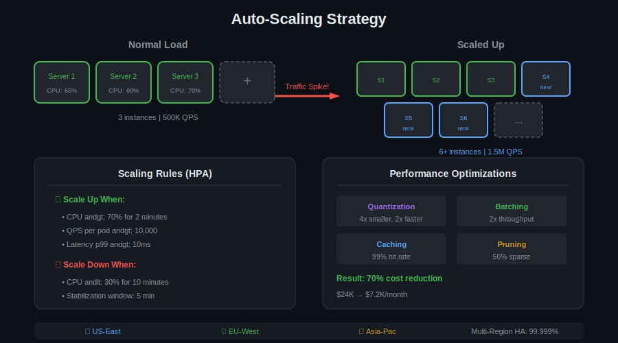
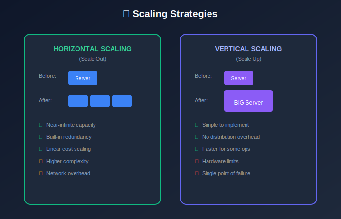
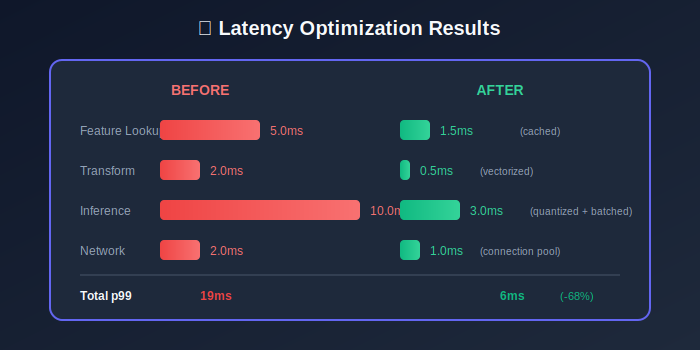
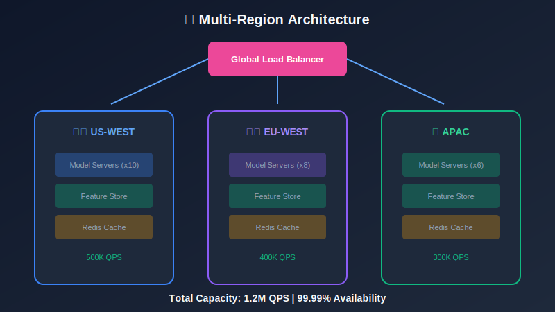
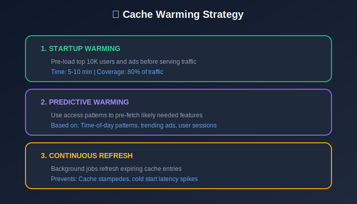
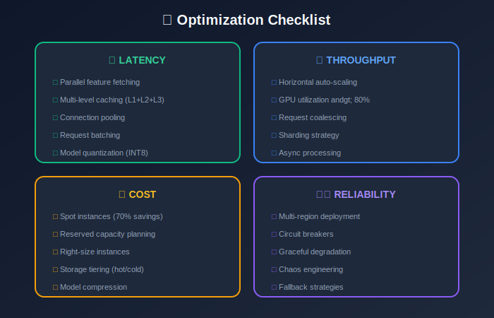

# Module 9: Scaling & Optimization

## Performance Tuning for Production CTR Systems

---

## 📊 Visual Overview





---

## 📖 Table of Contents

1. [Scaling Strategies](#scaling-strategies)
2. [Latency Optimization](#latency-optimization)
3. [Throughput Optimization](#throughput-optimization)
4. [Cost Optimization](#cost-optimization)
5. [Model Optimization](#model-optimization)

---

## Scaling Strategies

### Horizontal vs Vertical Scaling

| Aspect | Horizontal | Vertical |
|--------|------------|----------|
| Approach | Add more machines | Bigger machines |
| Limit | Near-infinite | Hardware limits |
| Complexity | Higher (distributed) | Lower |
| Cost | Linear | Exponential |
| Failover | Built-in redundancy | Single point of failure |

### Scaling Laws

**Amdahl's Law** (speedup limit):

```math
S = \frac{1}{(1-p) + \frac{p}{n}}
```

where:
- $p$ = parallelizable fraction
- $n$ = number of processors

**Example**: 90% parallelizable with 10 machines:

```math
S = \frac{1}{0.1 + \frac{0.9}{10}} = \frac{1}{0.19} = 5.26\times
```

**Universal Scalability Law**:

```math
C(N) = \frac{N}{1 + \alpha(N-1) + \beta N(N-1)}
```

where:
- $\alpha$ = contention parameter
- $\beta$ = coherency parameter

---

### Auto-Scaling

**Target-based scaling**:

```math
\text{Desired Replicas} = \lceil \text{Current Replicas} \times \frac{\text{Current Metric}}{\text{Target Metric}} \rceil
```

**Example**: Current CPU = 80%, Target = 60%, Current replicas = 10:

```math
\text{Desired} = \lceil 10 \times \frac{80}{60} \rceil = \lceil 13.3 \rceil = 14
```

**Scaling cooldown**: Wait 5-10 minutes between scaling events.



---

## Latency Optimization

### Latency Breakdown

| Component | Baseline | Optimized | Technique |
|-----------|----------|-----------|-----------|
| Network | 2ms | 0.5ms | Edge locations |
| Feature lookup | 5ms | 1ms | Caching |
| Inference | 10ms | 2ms | Quantization, batching |
| Post-processing | 2ms | 0.5ms | Vectorization |
| **Total** | **19ms** | **4ms** | - |

### Parallel Fetching

Sequential vs parallel:

```math
T_{\text{sequential}} = \sum_{i} T_i
T_{\text{parallel}} = \max_i(T_i)
```

**Speedup**:

```math
\text{Speedup} = \frac{\sum_i T_i}{\max_i T_i}
```

### Caching Impact

```math
T_{\text{avg}} = p_{\text{hit}} \cdot T_{\text{cache}} + (1 - p_{\text{hit}}) \cdot T_{\text{origin}}
```

| Hit Rate | Avg Latency |
|----------|-------------|
| 80% | 2.8ms |
| 90% | 1.9ms |
| 95% | 1.45ms |
| 99% | 1.09ms |

(Assuming $T\_{\text{cache}}=1\text{ms}$, $T\_{\text{origin}}=10\text{ms}$)

### Connection Pooling

**Pool sizing** (Little's Law):

```math
\text{Pool Size} = \text{Throughput} \times \text{Avg Latency}
```

**Example**: 10K QPS, 5ms latency:

```math
\text{Pool Size} = 10000 \times 0.005 = 50 \text{ connections}
```

With 2x buffer: 100 connections.

---

## Throughput Optimization

### Request Batching

**Batch efficiency**:

```math
\text{Throughput}(B) = \frac{B}{T_{\text{setup}} + B \times T_{\text{marginal}}}
```

**Optimal batch size**:

```math
B^* = \sqrt{\frac{T_{\text{setup}}}{T_{\text{marginal}}}}
```

| Batch Size | Latency | Throughput |
|------------|---------|------------|
| 1 | 2ms | 500 QPS |
| 16 | 4ms | 4,000 QPS |
| 64 | 8ms | 8,000 QPS |
| 256 | 20ms | 12,800 QPS |

### GPU Utilization

```math
\text{Utilization} = \frac{\text{Compute Time}}{\text{Compute Time} + \text{Memory Time} + \text{Idle Time}}
```

**Optimization strategies**:
- Increase batch size
- Use tensor cores (FP16)
- Overlap compute and memory

### Sharding

**Capacity per shard**:

```math
\text{Shards} = \lceil \frac{\text{Total Load}}{\text{Shard Capacity}} \rceil
```

**Consistent hashing**:

```math
\text{shard} = \text{hash}(\text{key}) \mod N
```

Minimizes rebalancing when adding/removing nodes.



---

## Cost Optimization

### Infrastructure Costs

```math
\text{Monthly Cost} = \text{Compute} + \text{Storage} + \text{Network} + \text{Licenses}
```

### Cost per Request

```math
\text{Cost per Request} = \frac{\text{Monthly Cost}}{\text{Monthly Requests}}
```

**Target**: < $0.00001 per request

### Instance Selection

| Instance Type | Cost/hr | QPS Capacity | Cost per 1M requests |
|---------------|---------|--------------|----------------------|
| CPU (c5.xlarge) | $0.17 | 5,000 | $0.94 |
| GPU (g4dn.xlarge) | $0.526 | 50,000 | $0.29 |
| Spot GPU | $0.158 | 50,000 | $0.09 |

**GPU vs CPU breakeven**:

```math
\text{GPU Cost Effective if: } \frac{\text{QPS}_{\text{GPU}}}{\text{QPS}_{\text{CPU}}} > \frac{\text{Cost}_{\text{GPU}}}{\text{Cost}_{\text{CPU}}}
```

### Spot Instances

**Expected cost savings**:

```math
\text{Savings} = 1 - \frac{\text{Spot Price}}{\text{On-Demand Price}} \approx 60-90\%
```

**Risk**: Interruption, mitigate with:
- Mixed instance types
- Graceful shutdown handling
- Checkpointing

### Reserved Capacity

**Break-even analysis**:

```math
\text{Break-even Utilization} = \frac{\text{Reserved Cost}}{\text{On-Demand Cost}}
```

| Commitment | Discount | Break-even Utilization |
|------------|----------|------------------------|
| 1 year | 30-40% | ~60% |
| 3 years | 50-60% | ~40% |

---

## Model Optimization

### Quantization

**INT8 quantization**:

```math
x_{\text{int8}} = \text{round}\left(\frac{x}{\text{scale}}\right) + \text{zero\_point}
```

| Precision | Model Size | Latency | Accuracy Loss |
|-----------|------------|---------|---------------|
| FP32 | 400MB | 10ms | 0% |
| FP16 | 200MB | 5ms | < 0.1% |
| INT8 | 100MB | 3ms | < 0.5% |

### Pruning

Remove small weights:

```math
\text{Sparsity} = \frac{\text{Zero Weights}}{\text{Total Weights}}
```

| Sparsity | Model Size | Speedup | Accuracy Loss |
|----------|------------|---------|---------------|
| 0% | 100% | 1x | 0% |
| 50% | 50% | 1.5x | < 0.1% |
| 90% | 10% | 3x | < 1% |

### Knowledge Distillation

Train small student from large teacher:

```math
\mathcal{L} = \alpha \mathcal{L}_{\text{hard}} + (1-\alpha) T^2 \mathcal{L}_{\text{soft}}
```

where:

```math
\mathcal{L}_{\text{soft}} = \text{KL}\left(\sigma\left(\frac{\mathbf{z}_T}{T}\right) \| \sigma\left(\frac{\mathbf{z}_S}{T}\right)\right)
```

| Model | Parameters | AUC | Latency |
|-------|------------|-----|---------|
| Teacher | 1B | 0.80 | 20ms |
| Student | 10M | 0.78 | 2ms |

### Embedding Compression

**Hash embedding**:

```math
\text{embedding}(x) = \sum_{i=1}^{k} \text{sign}_i(x) \cdot E[\text{hash}_i(x)]
```

Reduces vocabulary from millions to thousands.

**Compositional embedding**:

```math
\mathbf{e}(x) = f(\mathbf{e}_1(x_1), \mathbf{e}_2(x_2), \ldots)
```

Decompose high-cardinality features.



---

## Capacity Planning

### Load Forecasting

**Time series model**:

```math
\hat{L}_{t+h} = f(L_t, L_{t-1}, \ldots, \text{seasonality}, \text{trend})
```

### Headroom Planning

```math
\text{Required Capacity} = \text{Peak Load} \times (1 + \text{Headroom})
```

Typical headroom: 30-50%

### Cost vs Performance Trade-off

```math
\text{Optimize: } \min_{\theta} \text{Cost}(\theta) \text{ subject to } \text{Latency}(\theta) \leq T_{\text{SLO}}
```



---

## Performance Testing

### Load Testing Metrics

```math
\text{Throughput} = \frac{\text{Successful Requests}}{\text{Duration}}
\text{Saturation Point} = \text{Load where } \text{Latency} > 2 \times \text{Baseline}
```

### Stress Testing

Find breaking point:

```math
\text{Breaking Point} = \text{Load where } \text{Error Rate} > 1\%
```

### Performance Targets

| Metric | Target | Method |
|--------|--------|--------|
| p99 latency | < 15ms | Profile, optimize hotspots |
| Throughput | > 500K QPS/node | Batching, caching |
| Error rate | < 0.01% | Fault tolerance |
| Cost | < $0.00001/request | Right-sizing |

---

## Key Takeaways

1. **Horizontal scaling**: Near-infinite capacity, but manage complexity
2. **Latency**: Parallel fetching, caching, connection pooling
3. **Throughput**: Batching, GPU utilization, sharding
4. **Cost**: Spot instances, reserved capacity, right-sizing
5. **Model**: Quantization (4x), pruning, distillation
6. **Capacity**: 30-50% headroom, forecast growth

---

## Summary

Congratulations! You've completed all 9 modules of the CTR Prediction System Design guide.

### What You've Learned

| Module | Key Concepts |
|--------|--------------|
| 1. Problem Definition | Business context, success metrics |
| 2. System Requirements | SLAs, latency budgets, scale |
| 3. Data Engineering | Pipelines, labeling, quality |
| 4. Feature Engineering | Feature taxonomy, transformations |
| 5. Model Architecture | Deep learning, loss functions |
| 6. Serving | Real-time inference, caching |
| 7. A/B Testing | Statistical analysis, experiments |
| 8. Monitoring | Metrics, alerting, observability |
| 9. Scaling | Performance, cost optimization |

---

*Module 9 of 9 • [Back to Overview](../README.md)*

---

<div align="center">

**[⬆ Back to Top](#)** | **[📚 Main Repository](https://github.com/Gaurav14cs17/ml_system_design)**

Made with 💜 by [Gaurav14cs17](https://github.com/Gaurav14cs17)

</div>
