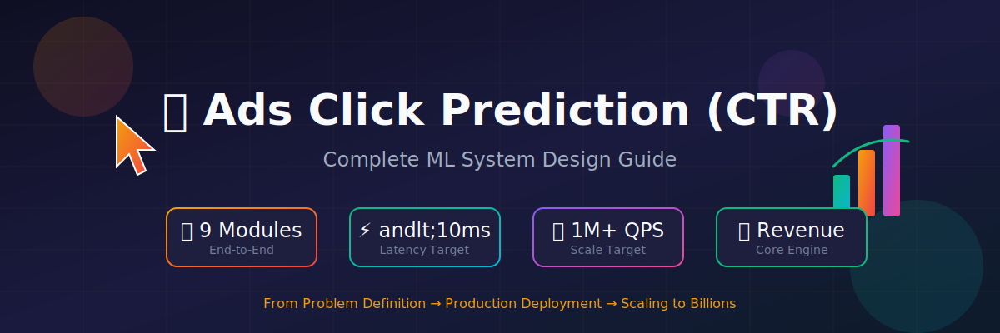
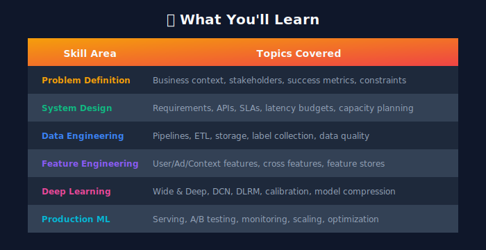
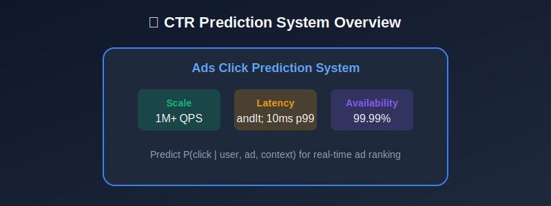
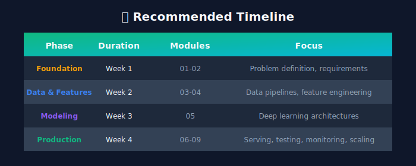
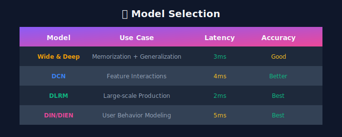
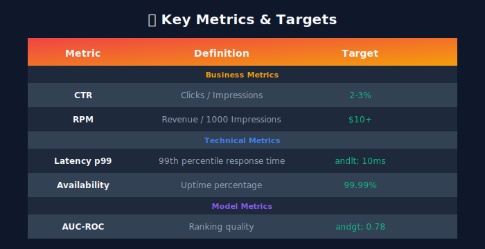
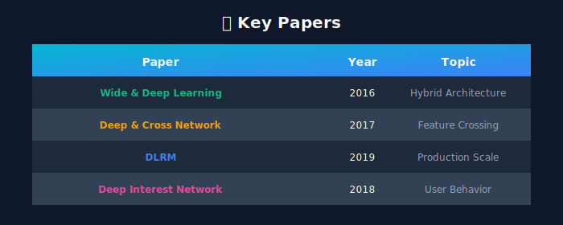
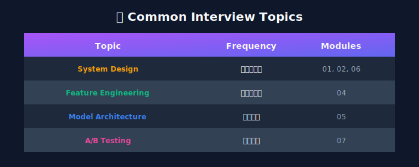

# 🎯 Ads Click Prediction (CTR): Complete ML Engineering Guide

<div align="center">



**A comprehensive, production-ready study guide for ML engineers**

*Building CTR prediction systems that handle millions of predictions per second*

[](https://python.org)
[](https://tensorflow.org)
[](LICENSE)

</div>

---

## 📋 Table of Contents

- [Overview](#-overview)

- [System Architecture](#-system-architecture)

- [Mathematical Foundations](#-mathematical-foundations)

- [Learning Path](#-learning-path)

- [Module Structure](#-module-structure)

- [Key Design Decisions](#-key-design-decisions)

- [Key Metrics](#-key-metrics)

- [Resources](#-resources)

- [Interview Preparation](#-interview-preparation)

---

## 🎯 Overview

Ads Click Prediction (CTR) systems power the core revenue engine of digital advertising platforms—from Google Ads to Meta Ads, Amazon Advertising, and programmatic ad exchanges. This guide covers everything you need to build production-grade CTR prediction systems.

### What You'll Learn



### Who This Is For

- 👨‍💻 **ML Engineers** building production CTR systems

- 🎓 **Interview Candidates** preparing for FAANG system design

- 🔬 **Data Scientists** transitioning to production ML

- 💼 **Tech Leads** designing ad tech infrastructure

---

## 🏛️ System Architecture


### High-Level Flow



---

## 📐 Mathematical Foundations

### Click-Through Rate (CTR)

The fundamental metric we predict:

```math
\text{CTR} = \frac{\text{Number of Clicks}}{\text{Number of Impressions}} = P(\text{click} \mid \text{user}, \text{ad}, \text{context})

```

### Model Prediction

Given user $u$, ad $a$, and context $c$, we predict:

```math
\hat{y} = \sigma(f(u, a, c; \theta)) = \frac{1}{1 + e^{-f(u, a, c; \theta)}}

```

where $\sigma$ is the sigmoid function and $\theta$ are model parameters.

---

### Loss Functions

#### Binary Cross-Entropy (Log Loss)

The primary training objective:

```math
\mathcal{L}_{BCE} = -\frac{1}{N} \sum_{i=1}^{N} \left[ y_i \log(\hat{y}_i) + (1 - y_i) \log(1 - \hat{y}_i) \right]

```

where:

- $y\_i \in \{0, 1\}$ is the true label (click/no-click)

- $\hat{y}\_i \in [0, 1]$ is the predicted probability

- $N$ is the batch size

#### Weighted Cross-Entropy (for class imbalance)

```math
\mathcal{L}_{WCE} = -\frac{1}{N} \sum_{i=1}^{N} \left[ w_+ \cdot y_i \log(\hat{y}_i) + w_- \cdot (1 - y_i) \log(1 - \hat{y}_i) \right]

```

Typical weights: $w\_+ = 10 \text{ to } 100$, $w\_- = 1$ (since CTR ~ 1-5%)

---

### Evaluation Metrics

#### AUC-ROC (Area Under ROC Curve)

Measures ranking quality:

```math
\text{AUC} = P(\hat{y}_{\text{positive}} > \hat{y}_{\text{negative}})

```

#### Normalized Cross-Entropy (NCE)

Also called **Relative Information Gain** or **Normalized Entropy**:

```math
\text{NCE} = \frac{-\frac{1}{N} \sum_{i=1}^{N} \left[ y_i \log(\hat{y}_i) + (1 - y_i) \log(1 - \hat{y}_i) \right]}{-\left[ p \log(p) + (1-p) \log(1-p) \right]}

```

where $p = \frac{1}{N} \sum\_{i=1}^{N} y\_i$ is the average CTR.

**Interpretation**: NCE < 1 means model is better than baseline; lower is better.

#### Calibration Error

```math
\text{ECE} = \sum_{b=1}^{B} \frac{n_b}{N} \left| \text{accuracy}(b) - \text{confidence}(b) \right|

```

where $B$ is number of bins, $n\_b$ is samples in bin $b$.

---

### Feature Interactions

#### Cross Features (Polynomial)

```math
\phi_{\text{cross}}(x) = \sum_{i=1}^{d} \sum_{j=i}^{d} w_{ij} \cdot x_i \cdot x_j

```

#### Factorization Machines (FM)

Efficient pairwise interactions:

```math
\hat{y}_{FM} = w_0 + \sum_{i=1}^{d} w_i x_i + \sum_{i=1}^{d} \sum_{j=i+1}^{d} \langle \mathbf{v}_i, \mathbf{v}_j \rangle x_i x_j

```

where $\mathbf{v}\_i \in \mathbb{R}^k$ are latent vectors.

Efficient computation in $O(kd)$:

```math
\sum_{i=1}^{d} \sum_{j=i+1}^{d} \langle \mathbf{v}_i, \mathbf{v}_j \rangle x_i x_j = \frac{1}{2} \sum_{f=1}^{k} \left[ \left( \sum_{i=1}^{d} v_{i,f} x_i \right)^2 - \sum_{i=1}^{d} v_{i,f}^2 x_i^2 \right]

```

---

### Deep Learning Architectures

#### Wide & Deep

```math
\hat{y} = \sigma\left( \mathbf{w}_{wide}^T [\mathbf{x}, \phi(\mathbf{x})] + \mathbf{w}_{deep}^T \cdot a^{(L)} + b \right)

```

where:

- Wide: $\mathbf{w}\_{wide}^T [\mathbf{x}, \phi(\mathbf{x})]$ — memorization

- Deep: $a^{(L)} = \text{DNN}(\mathbf{x}\_{dense})$ — generalization

#### Deep & Cross Network (DCN)

Cross layer $l$:

```math
\mathbf{x}_{l+1} = \mathbf{x}_0 \mathbf{x}_l^T \mathbf{w}_l + \mathbf{b}_l + \mathbf{x}_l

```

Explicit feature crossing of degree $l+1$ at layer $l$.

---

### Position Bias Correction

Observed CTR is biased by position:

```math
P(\text{click} \mid \text{pos}, \text{ad}) = P(\text{examine} \mid \text{pos}) \cdot P(\text{click} \mid \text{examine}, \text{ad})

```

**Position-aware model**:

```math
\hat{y} = \sigma(f_{\text{ad}}(\mathbf{x}_{\text{ad}}) + g_{\text{pos}}(\text{position}))

```

At inference, use position = 1 or average position.

---

### Calibration (Platt Scaling)

Post-hoc calibration:

```math
\hat{y}_{\text{calibrated}} = \frac{1}{1 + e^{-(a \cdot \hat{y} + b)}}

```

where $a, b$ are learned on validation data.

---

### Expected Revenue

For auction bidding:

```math
\text{Expected Revenue} = \sum_{i} \text{CTR}_i \times \text{Bid}_i
\text{eCPM} = \text{CTR} \times \text{CPC} \times 1000

```

---

## 🗺️ Learning Path



---

## 📚 Module Structure

### 🟢 Fundamentals (Modules 1-2)

| # | Module | Description | Time |
|---|--------|-------------|------|
| 1 | [Problem Definition](./01_problem_definition/README.md) | Business context, stakeholders, success metrics | 2h |
| 2 | [System Requirements](./02_system_requirements/README.md) | Functional/non-functional requirements, SLAs, APIs | 2h |

### 🟡 Data & Features (Modules 3-4)

| # | Module | Description | Time |
|---|--------|-------------|------|
| 3 | [Data Engineering](./03_data_engineering/README.md) | Data pipelines, ETL, storage, label collection | 3h |
| 4 | [Feature Engineering](./04_feature_engineering/README.md) | Feature taxonomy, transformations, feature store | 3h |

### 🟠 Model Development (Module 5)

| # | Module | Description | Time |
|---|--------|-------------|------|
| 5 | [Model Architecture](./05_model_architecture/README.md) | Deep learning models, training, calibration | 4h |

### 🔴 Production Systems (Modules 6-9)

| # | Module | Description | Time |
|---|--------|-------------|------|
| 6 | [Serving Infrastructure](./06_serving_infrastructure/README.md) | Real-time serving, caching, load balancing | 3h |
| 7 | [A/B Testing](./07_ab_testing/README.md) | Experimentation framework, statistical analysis | 2h |
| 8 | [Monitoring](./08_monitoring/README.md) | Metrics, alerting, observability | 2h |
| 9 | [Scaling & Optimization](./09_scaling_optimization/README.md) | Performance tuning, cost optimization | 3h |

---

## 🔑 Key Design Decisions

### Model Selection



### Model Comparison

| Model | Complexity | AUC | Latency | Use Case |
|-------|------------|-----|---------|----------|
| Logistic Regression | $O(d)$ | 0.70-0.72 | < 1ms | Baseline |
| Factorization Machine | $O(kd)$ | 0.73-0.75 | 1-2ms | Sparse features |
| Wide & Deep | $O(H \cdot d)$ | 0.76-0.78 | 3-5ms | Production standard |
| DCN / DCN-v2 | $O(H \cdot d)$ | 0.77-0.79 | 3-5ms | Better interactions |
| DIN / DIEN | $O(H \cdot d \cdot L)$ | 0.78-0.80 | 5-10ms | Sequential behavior |

### Feature Categories

| Category | Examples | Cardinality |
|----------|----------|-------------|
| **User Features** | user_id, age, gender, interests | 10M+ users |
| **Ad Features** | ad_id, advertiser, creative_type | 100M+ ads |
| **Context Features** | time, device, location, placement | 1K-10K |
| **Cross Features** | user×ad, user×context | Combinatorial |

---

## 📊 Key Metrics



### Target Metrics

| Metric | Target | Description |
|--------|--------|-------------|
| **AUC-ROC** | > 0.78 | Ranking quality |
| **NCE** | < 0.85 | Relative improvement over baseline |
| **Calibration** | ECE < 0.02 | Predicted prob ≈ actual prob |
| **Latency p99** | < 10ms | End-to-end prediction time |
| **Throughput** | > 1M QPS | Queries per second |
| **Availability** | 99.99% | Uptime SLA |

---

## 📖 Resources

### 📄 Key Papers



| Paper | Author | Year | Key Contribution |
|-------|--------|------|------------------|
| Wide & Deep Learning | Google | 2016 | Memorization + Generalization |
| Deep & Cross Network | Google | 2017 | Explicit feature crossing |
| DLRM | Meta | 2019 | Embedding tables at scale |
| DIN | Alibaba | 2018 | Attention on user behavior |
| DCN-v2 | Google | 2020 | Low-rank cross network |

### 📚 Essential Books

| Book | Author | Focus |
|------|--------|-------|
| Deep Learning | Goodfellow et al. | DL fundamentals |
| Designing Machine Learning Systems | Chip Huyen | Production ML |
| Building Machine Learning Pipelines | Hapke & Nelson | MLOps |

---

## 🏗️ Project Structure

```
03_ads_click_prediction/
+-- README.md                          # This file
+-- images/                            # Global images (hero, overview diagrams)

|
+-- 01_problem_definition/             # Module 1: Business context & success metrics
|   +-- README.md
|   +-- images/

|
+-- 02_system_requirements/            # Module 2: Requirements, SLAs, APIs
|   +-- README.md
|   +-- images/

|
+-- 03_data_engineering/               # Module 3: Data pipelines, ETL, storage
|   +-- README.md
|   +-- images/

|
+-- 04_feature_engineering/            # Module 4: Feature taxonomy & feature store
|   +-- README.md
|   +-- images/

|
+-- 05_model_architecture/             # Module 5: Deep learning models & training
|   +-- README.md
|   +-- images/

|
+-- 06_serving_infrastructure/         # Module 6: Real-time serving & caching
|   +-- README.md
|   +-- images/

|
+-- 07_ab_testing/                     # Module 7: Experimentation framework
|   +-- README.md
|   +-- images/

|
+-- 08_monitoring/                     # Module 8: Metrics, alerting, observability
|   +-- README.md
|   +-- images/

|
+-- 09_scaling_optimization/           # Module 9: Performance & cost optimization
    +-- README.md
    +-- images/

```

---

## 🎓 Interview Preparation

### Common Interview Topics



### Key Questions by Category

| Category | Sample Questions |
|----------|------------------|
| **System Design** | Design CTR for 1M QPS; Cold start strategy; Low latency at scale |
| **ML Theory** | Why calibration matters; Class imbalance (99% negatives); Position bias |
| **Data Engineering** | Delayed feedback; Feature freshness; Training-serving skew |
| **Production ML** | Model degradation detection; Rollback strategy; A/B test design |

### Mathematical Questions

1. **Derive the gradient of log loss** for logistic regression

2. **Prove FM can be computed in $O(kd)$** instead of $O(k d^2)$

3. **Explain why NCE is better than raw log loss** for comparing models

4. **Calculate sample size** for A/B test with 0.1% CTR lift detection

---

## 📈 Progress Tracking

- [ ] Module 01: Problem Definition

- [ ] Module 02: System Requirements

- [ ] Module 03: Data Engineering

- [ ] Module 04: Feature Engineering

- [ ] Module 05: Model Architecture

- [ ] Module 06: Serving Infrastructure

- [ ] Module 07: A/B Testing

- [ ] Module 08: Monitoring

- [ ] Module 09: Scaling & Optimization

---

<div align="center">

**[Start Learning →](./01_problem_definition/README.md)**

Made with ❤️ for the ML community

</div>

---

*Last Updated: January 2026*

---

<div align="center">

**[⬆ Back to Top](#)** | **[📚 Main Repository](https://github.com/Gaurav14cs17/ml_system_design)**

Made with 💜 by [Gaurav14cs17](https://github.com/Gaurav14cs17)

</div>
