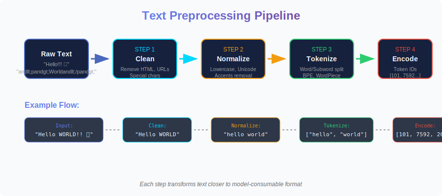
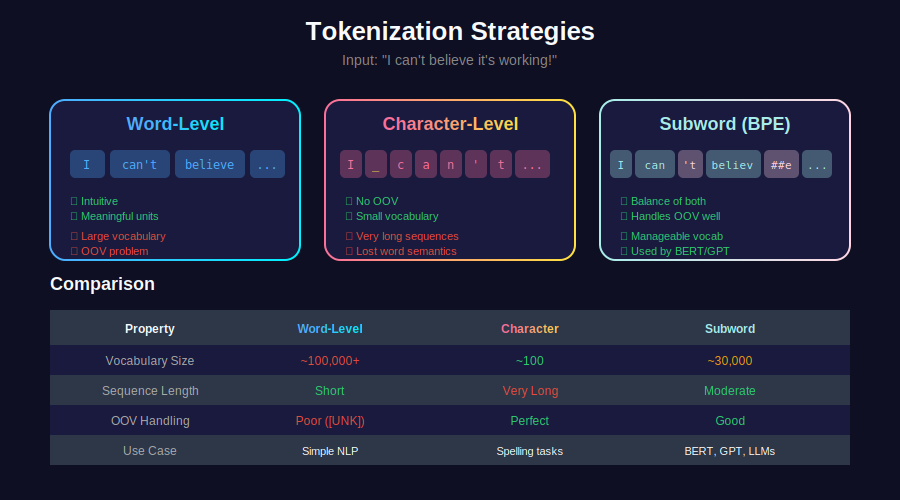
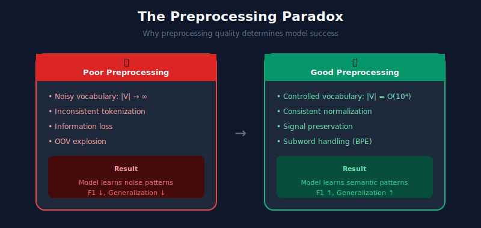
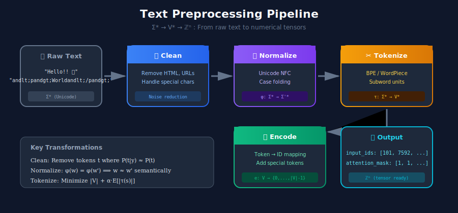
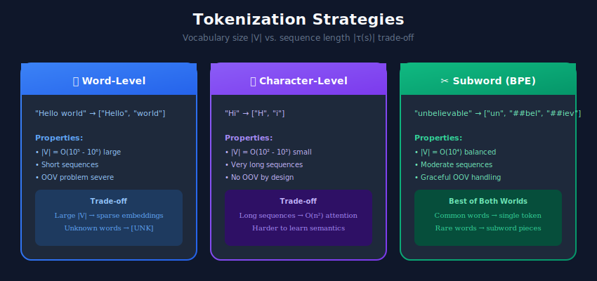

# 📝 Text Preprocessing in NLP Systems

> The mathematical foundation of every NLP pipeline - transforming raw text into numerical representations

---

## 📊 Visual Overview

### Preprocessing Pipeline


### Tokenization Strategies


---

## 🎯 Why Text Preprocessing Matters

Text preprocessing bridges the gap between **human language** and **mathematical computation**. Since neural networks operate on numerical tensors, we must transform discrete text symbols into continuous vector spaces.

> "Data scientists spend 80% of their time preparing data. In NLP, preprocessing defines the mathematical space your model operates in."

### The Preprocessing Paradox



---

## 📐 Mathematical Foundations

### 1. Text as a Mathematical Object

A text document can be formalized as:

- A **sequence** of tokens: $D = (t\_1, t\_2, \ldots, t\_n)$ where $t\_i \in \mathcal{V}$ (vocabulary)

- A **set** of tokens (bag-of-words): $D = \{t\_1, t\_2, \ldots, t\_k\}$ ignoring order

- A **function** mapping positions to tokens: $D: \{1,\ldots,n\} \rightarrow \mathcal{V}$

The vocabulary $\mathcal{V}$ is a finite set of all possible tokens:

```math
\mathcal{V} = \{w_1, w_2, \ldots, w_{|\mathcal{V}|}\}

```

### 2. Term Frequency (TF)

**Raw term frequency** counts token occurrences:

```math
\text{tf}(t, d) = f_{t,d}

```

where $f\_{t,d}$ is the count of term $t$ in document $d$.

**Normalized term frequency** prevents bias toward longer documents:

```math
\text{tf}(t, d) = \frac{f_{t,d}}{\sum_{t' \in d} f_{t',d}} = \frac{f_{t,d}}{|d|}

```

**Log-normalized TF** dampens the effect of high-frequency terms:

```math
\text{tf}(t, d) = 1 + \log(f_{t,d}) \quad \text{if } f_{t,d} > 0, \text{ else } 0

```

### 3. Inverse Document Frequency (IDF)

IDF measures how informative a term is across the corpus:

```math
\text{idf}(t, D) = \log\frac{N}{|\{d \in D : t \in d\}|} = \log\frac{N}{n_t}

```

where:

- $N$ = total number of documents

- $n\_t$ = number of documents containing term $t$

**Smoothed IDF** prevents division by zero and reduces impact of very rare terms:

```math
\text{idf}(t, D) = \log\frac{N + 1}{n_t + 1} + 1

```

### 4. TF-IDF Score

The **TF-IDF** weighting combines both measures:

```math
\text{tf-idf}(t, d, D) = \text{tf}(t, d) \times \text{idf}(t, D)

```

This score is:

- **High** when $t$ appears frequently in $d$ but rarely in the corpus

- **Low** when $t$ is common across many documents (like "the", "is")

- **Zero** when $t$ doesn't appear in $d$

### Document Vector Representation

A document becomes a vector in $\mathbb{R}^{|\mathcal{V}|}$:

```math
\vec{d} = [\text{tf-idf}(t_1, d, D), \text{tf-idf}(t_2, d, D), \ldots, \text{tf-idf}(t_{|\mathcal{V}|}, d, D)]

```

---

## 🏗️ The Text Preprocessing Pipeline

A production preprocessing pipeline handles text transformation in stages:



---

## 1️⃣ Text Cleaning

### Information-Theoretic Perspective

Cleaning removes **noise** that doesn't contribute to the signal. From an information theory standpoint, we aim to maximize:

```math
I(X_{\text{clean}}; Y) \geq I(X_{\text{raw}}; Y)

```

where $X$ is the text representation and $Y$ is the target variable.

### What Needs Cleaning?

| Noise Type | Example | Impact on $\mathcal{V}$ |
|------------|---------|------------------------|
| HTML Tags | `<p>Hello</p>` | Adds uninformative tokens |
| URLs | `https://example.com` | High cardinality, sparse |
| Emails | `user@domain.com` | PII concerns, sparse |
| Special Characters | `Hello!!! @#$%` | Tokenization confusion |
| Emojis | `Hello 🌍 👋` | Task-dependent signal |
| Extra Whitespace | `Hello    World` | Tokenization errors |

### Cleaning Implementation

```python
import re
from bs4 import BeautifulSoup
import unicodedata
from typing import Dict, Optional

class TextCleaner:
    """
    Production-grade text cleaning pipeline.
    
    Mathematical goal: Remove tokens t where:
    - P(t|class) ≈ P(t) (not discriminative)
    - t ∉ natural language (noise)
    """
    
    def __init__(self, config: Optional[Dict] = None):
        self.config = config or self._default_config()
        
        # Compile regex patterns for O(1) lookup
        self.url_pattern = re.compile(
            r'http[s]?://(?:[a-zA-Z]|[0-9]|[$-_@.&+]|'
            r'[!*\\(\\),]|(?:%[0-9a-fA-F][0-9a-fA-F]))+'
        )
        self.email_pattern = re.compile(
            r'\b[A-Za-z0-9._%+-]+@[A-Za-z0-9.-]+\.[A-Z|a-z]{2,}\b'
        )
        self.whitespace_pattern = re.compile(r'\s+')
    
    def _default_config(self) -> Dict:
        return {
            'remove_html': True,
            'remove_urls': True,
            'remove_emails': True,
            'normalize_whitespace': True,
            'remove_control_chars': True,
        }
    
    def clean(self, text: str) -> str:
        """Main cleaning method with O(n) complexity."""
        if not text:
            return ""
        
        if self.config['remove_html']:
            text = BeautifulSoup(text, 'html.parser').get_text(separator=' ')
        
        if self.config['remove_urls']:
            text = self.url_pattern.sub(' [URL] ', text)
        
        if self.config['remove_emails']:
            text = self.email_pattern.sub(' [EMAIL] ', text)
        
        if self.config['remove_control_chars']:
            text = ''.join(c for c in text if unicodedata.category(c) != 'Cc')
        
        if self.config['normalize_whitespace']:
            text = self.whitespace_pattern.sub(' ', text).strip()
        
        return text

```

---

## 2️⃣ Text Normalization

### Case Normalization

Lowercasing maps tokens to equivalence classes:

```math
\phi_{\text{lower}}: \mathcal{V} \rightarrow \mathcal{V}'

```

where $|\mathcal{V}'| < |\mathcal{V}|$ (vocabulary reduction)

**Trade-off**: "Apple" (company) vs "apple" (fruit) become indistinguishable.

### Unicode Normalization

Unicode defines four normalization forms:

| Form | Description | Use Case |
|------|-------------|----------|
| **NFC** | Canonical Decomposition + Composition | Default for most NLP |
| **NFD** | Canonical Decomposition only | Accent removal |
| **NFKC** | Compatibility Decomposition + Composition | Aggressive normalization |
| **NFKD** | Compatibility Decomposition only | Maximum decomposition |

**Example**: The character "é" can be represented as:

- Single code point: U+00E9 (é)

- Combining sequence: U+0065 U+0301 (e + combining acute accent)

NFC ensures consistent representation.

```python
import unicodedata

class TextNormalizer:
    """Unicode and case normalization."""
    
    @staticmethod
    def normalize_unicode(text: str, form: str = 'NFC') -> str:
        """
        Apply Unicode normalization.
        
        Forms:
        - NFC: Canonical composition (recommended)
        - NFKC: Compatibility composition (aggressive)
        """
        return unicodedata.normalize(form, text)
    
    @staticmethod
    def remove_accents(text: str) -> str:
        """
        Remove diacritical marks.
        
        Mathematically: π: Σ* → Σ'* where Σ' ⊂ Σ (ASCII)
        Maps café → cafe
        """
        nfd = unicodedata.normalize('NFD', text)
        return ''.join(c for c in nfd if unicodedata.category(c) != 'Mn')
    
    @staticmethod
    def lowercase_preserve_acronyms(
        text: str, 
        acronyms: set = {'NASA', 'FBI', 'NLP', 'API', 'GPU'}
    ) -> str:
        """
        Lowercase while preserving known acronyms.
        Prevents information loss for domain-specific terms.
        """
        words = text.split()
        result = []
        for word in words:
            clean = ''.join(c for c in word if c.isalnum())
            if clean.upper() in acronyms:
                result.append(word)
            else:
                result.append(word.lower())
        return ' '.join(result)

```

---

## 3️⃣ Tokenization

Tokenization partitions text into atomic units. This is the **most critical** preprocessing step.

### Formal Definition

A tokenizer is a function:

```math
\tau: \Sigma^* \rightarrow \mathcal{V}^*

```

mapping character sequences to token sequences.

### Tokenization Strategies



### Word Tokenization

**Whitespace tokenization**: $\tau\_{\text{ws}}(s) = \text{split}(s, \text{' '})$

**Regex tokenization**: Handles punctuation and special cases.

### Subword Tokenization: BPE

**Byte Pair Encoding (BPE)** learns a vocabulary by iteratively merging frequent character pairs.

**Algorithm**:
1. Initialize vocabulary $\mathcal{V}\_0$ with all characters
2. Count all adjacent symbol pairs
3. Merge most frequent pair $(a, b) \rightarrow ab$
4. Add merged symbol to vocabulary
5. Repeat until $|\mathcal{V}| = $ target size

**Why BPE works**: Balances vocabulary size vs. sequence length:

```math
\text{minimize} \quad |\mathcal{V}| + \alpha \cdot \mathbb{E}[|\tau(s)|]

```

### WordPiece (BERT)

Similar to BPE but maximizes likelihood:

```math
\text{score}(a, b) = \frac{\text{freq}(ab)}{\text{freq}(a) \cdot \text{freq}(b)}

```

Merges pairs that maximize mutual information.

### Implementation

```python
from transformers import AutoTokenizer
from typing import List, Dict

class TokenizerWrapper:
    """
    Unified interface for different tokenization strategies.
    
    Key properties:
    - Vocabulary: V = {t₁, t₂, ..., t_|V|}
    - Encoding: e: V → {0, 1, ..., |V|-1}
    - Decoding: d: {0, 1, ..., |V|-1} → V
    """
    
    def __init__(self, model_name: str = 'bert-base-uncased'):
        self.tokenizer = AutoTokenizer.from_pretrained(model_name)
    
    @property
    def vocab_size(self) -> int:
        """Size of vocabulary |V|."""
        return self.tokenizer.vocab_size
    
    def tokenize(self, text: str) -> List[str]:
        """
        τ: Σ* → V*
        Maps text to token sequence.
        """
        return self.tokenizer.tokenize(text)
    
    def encode(self, text: str, max_length: int = 512) -> Dict:
        """
        Compose tokenization with integer encoding.
        Returns: {input_ids, attention_mask, token_type_ids}
        """
        return self.tokenizer(
            text,
            max_length=max_length,
            padding='max_length',
            truncation=True,
            return_tensors='pt'
        )
    
    def decode(self, token_ids: List[int]) -> str:
        """Inverse mapping: token IDs → text."""
        return self.tokenizer.decode(token_ids, skip_special_tokens=True)

# Demonstrate subword tokenization
tokenizer = TokenizerWrapper('bert-base-uncased')

# Rare word gets split into subwords
print(tokenizer.tokenize("unbelievably"))
# ['un', '##bel', '##ie', '##va', '##bly']

# Common words stay intact
print(tokenizer.tokenize("the cat sat"))
# ['the', 'cat', 'sat']

```

---

## 4️⃣ Sequence Length and Padding

### The Fixed-Length Requirement

Neural networks require fixed-dimension inputs. For sequences:

```math
\mathbf{X} \in \mathbb{R}^{B \times L \times d}

```

where $B$ = batch size, $L$ = sequence length, $d$ = embedding dimension.

### Padding Strategies

**Right padding** (standard):

```
[token1, token2, token3, PAD, PAD, PAD]

```

**Attention mask** indicates real vs. padded tokens:

```
[1, 1, 1, 0, 0, 0]

```

This mask is used in attention computation:

```math
\text{Attention}(Q, K, V) = \text{softmax}\left(\frac{QK^T}{\sqrt{d_k}} + M\right)V

```

where $M\_{ij} = -\infty$ if position $j$ is padded.

### Truncation

For long sequences exceeding max length $L$:

```math
\tau_{\text{trunc}}(s) = s[0:L]

```

More sophisticated: truncate from middle to preserve start/end context.

---

## 5️⃣ Special Tokens

Modern transformers use special tokens with specific semantics:

| Token | Purpose | Mathematical Role |
|-------|---------|-------------------|
| `[CLS]` | Classification | Aggregated representation |
| `[SEP]` | Segment separator | Boundary marker |
| `[PAD]` | Padding | Masked in attention |
| `[MASK]` | MLM training | Prediction target |
| `[UNK]` | Unknown token | OOV handling |

**CLS token aggregation**:

```math
\mathbf{h}_{\text{cls}} = \text{Transformer}(\mathbf{X})[0]

```

This single vector represents the entire sequence for classification.

---

## 📊 Complexity Analysis

| Operation | Time Complexity | Space Complexity |
|-----------|-----------------|------------------|
| Regex cleaning | $O(n \cdot p)$ | $O(n)$ |
| Unicode normalization | $O(n)$ | $O(n)$ |
| Whitespace tokenization | $O(n)$ | $O(n)$ |
| BPE tokenization | $O(n \cdot |\mathcal{V}|)$ | $O(|\mathcal{V}|)$ |
| TF-IDF vectorization | $O(n \cdot |\mathcal{V}|)$ | $O(|\mathcal{V}|)$ |

where $n$ = text length, $p$ = pattern length, $|\mathcal{V}|$ = vocabulary size.

---

## 🎯 Best Practices

### Do's and Don'ts

| ✅ Do | ❌ Don't |
|-------|----------|
| Preserve original text for debugging | Modify in place without backup |
| Use task-specific preprocessing | Apply same preprocessing to all tasks |
| Validate output at each stage | Assume preprocessing always works |
| Profile memory for large corpora | Load everything into memory |

### Task-Specific Guidelines

| Task | Preprocessing Recommendations |
|------|-------------------------------|
| **Sentiment Analysis** | Keep emojis, handle negations |
| **NER** | Preserve case, keep punctuation |
| **Machine Translation** | Minimal cleaning, preserve structure |
| **Search/Retrieval** | Stemming, synonym expansion |

---

## 🔗 Related Topics

- [Embeddings](../02_embeddings/) - What happens after tokenization

- [Language Models](../03_language_models/) - How models consume tokens

- [Text Classification](../04_text_classification/) - Applying preprocessing

---

## 📚 References

1. Sennrich, R., Haddow, B., & Birch, A. (2016). [Neural Machine Translation of Rare Words with Subword Units](https://arxiv.org/abs/1508.07909)
2. Wu, Y., et al. (2016). [Google's Neural Machine Translation System](https://arxiv.org/abs/1609.08144)
3. Kudo, T., & Richardson, J. (2018). [SentencePiece](https://arxiv.org/abs/1808.06226)
4. [Hugging Face Tokenizers Documentation](https://huggingface.co/docs/tokenizers/)

---

<div align="center">

**[⬆ Back to Top](#)** | **[📚 Main Repository](https://github.com/Gaurav14cs17/ml_system_design)**

Made with 💜 by [Gaurav14cs17](https://github.com/Gaurav14cs17)

</div>
