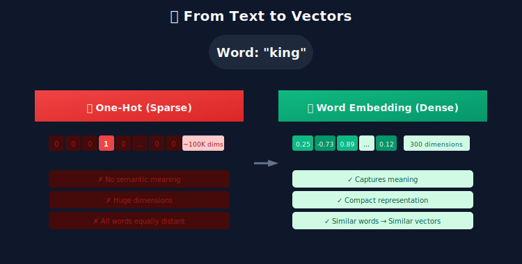
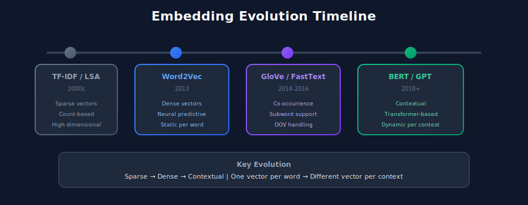
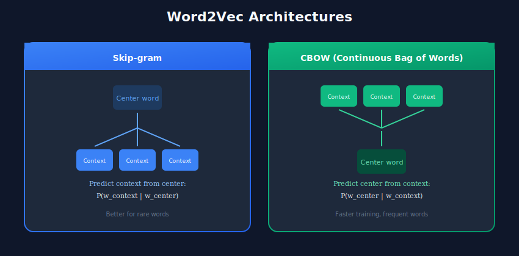
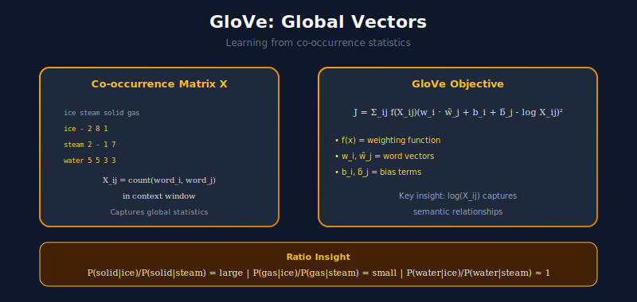
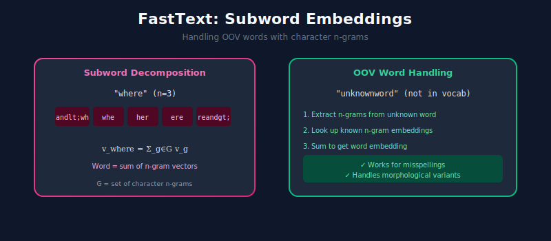
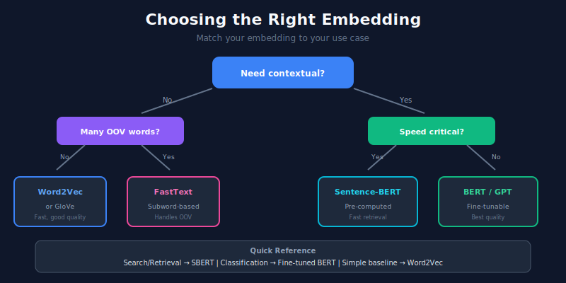

# 🔢 Word Embeddings & Vector Representations

> Transforming discrete symbols into continuous vector spaces where semantic similarity becomes geometric proximity

---

## 📊 Visual Overview

### Evolution of Embeddings


### Word2Vec Architectures


---

## 🎯 What Are Embeddings?

Embeddings are **learned mappings** from discrete symbols to continuous vector spaces:

```math
E: \mathcal{V} \rightarrow \mathbb{R}^d
```

where $\mathcal{V}$ is the vocabulary and $d$ is the embedding dimension.

The fundamental insight: **semantic relationships** can be captured as **geometric relationships** in vector space.



### The Famous Word Analogy

The celebrated property of word embeddings:

```math
\vec{v}_{\text{king}} - \vec{v}_{\text{man}} + \vec{v}_{\text{woman}} \approx \vec{v}_{\text{queen}}
```

This works because embeddings encode **relational structure** through vector arithmetic.

---

## 📐 Mathematical Foundations

### 1. Vector Space Properties

An embedding space $\mathbb{R}^d$ supports:

**Distance metrics** for similarity:

```math
d_{\text{euclidean}}(\mathbf{u}, \mathbf{v}) = \|\mathbf{u} - \mathbf{v}\|_2 = \sqrt{\sum_{i=1}^{d}(u_i - v_i)^2}
```

**Cosine similarity** (direction-based):

```math
\cos(\mathbf{u}, \mathbf{v}) = \frac{\mathbf{u} \cdot \mathbf{v}}{\|\mathbf{u}\| \|\mathbf{v}\|} = \frac{\sum_{i=1}^{d} u_i v_i}{\sqrt{\sum_{i=1}^{d} u_i^2} \sqrt{\sum_{i=1}^{d} v_i^2}}
```

**Cosine distance**:

```math
d_{\text{cosine}}(\mathbf{u}, \mathbf{v}) = 1 - \cos(\mathbf{u}, \mathbf{v})
```

### 2. The Distributional Hypothesis

> "You shall know a word by the company it keeps." — J.R. Firth

Mathematically: Words with similar **context distributions** should have similar **vector representations**.

```math
P(c|w) \approx P(c|w') \implies \vec{w} \approx \vec{w'}
```

where $c$ represents context words.

### 3. The Embedding Matrix

For vocabulary $\mathcal{V}$ with $|\mathcal{V}|$ words and embedding dimension $d$:

```math
\mathbf{E} \in \mathbb{R}^{|\mathcal{V}| \times d}
```

Word $w\_i$ retrieves its embedding via one-hot indexing:

```math
\vec{w}_i = \mathbf{E}^T \mathbf{e}_i
```

where $\mathbf{e}\_i$ is a one-hot vector.

---

## 📊 Evolution of Embeddings



---

## 1️⃣ Count-Based Methods: TF-IDF

### Term Frequency-Inverse Document Frequency

```math
\text{tf-idf}(t, d, D) = \text{tf}(t, d) \times \text{idf}(t, D)
```

**Properties**:
- Sparse: Most entries are zero
- High dimensional: $\mathbb{R}^{|\mathcal{V}|}$ where $|\mathcal{V}| \sim 10^4 - 10^6$
- No semantic smoothing: Similar words have orthogonal vectors

```python
from sklearn.feature_extraction.text import TfidfVectorizer
import numpy as np

class TfidfEmbedding:
    """
    TF-IDF: Sparse high-dimensional embeddings.
    
    Mathematical properties:
    - Vectors in ℝ^|V| (vocabulary size)
    - Sparse: Only non-zero for terms present in document
    - No learned semantic structure
    """
    
    def __init__(self, max_features: int = 10000):
        self.vectorizer = TfidfVectorizer(
            max_features=max_features,
            ngram_range=(1, 2),
            sublinear_tf=True  # Use 1 + log(tf) instead of raw tf
        )
    
    def fit_transform(self, documents: list) -> np.ndarray:
        """Fit and transform documents to TF-IDF vectors."""
        return self.vectorizer.fit_transform(documents).toarray()
    
    def similarity(self, vec1: np.ndarray, vec2: np.ndarray) -> float:
        """Cosine similarity between TF-IDF vectors."""
        return np.dot(vec1, vec2) / (np.linalg.norm(vec1) * np.linalg.norm(vec2))
```

---

## 2️⃣ Word2Vec: Neural Word Embeddings

Word2Vec learns embeddings by predicting context from words (or vice versa).

### Architecture Overview



### Skip-gram Model

**Objective**: Given center word $w\_t$, predict context words $w\_{t+j}$ for $j \in [-c, c] \setminus \{0\}$.

**Probability model** using softmax:

```math
P(w_O | w_I) = \frac{\exp(\vec{v}'_{w_O} \cdot \vec{v}_{w_I})}{\sum_{w=1}^{|\mathcal{V}|} \exp(\vec{v}'_w \cdot \vec{v}_{w_I})}
```

where:
- $\vec{v}\_w$ = input (center) embedding of word $w$
- $\vec{v}'\_w$ = output (context) embedding of word $w$

**Loss function** (negative log-likelihood):

```math
\mathcal{L} = -\frac{1}{T} \sum_{t=1}^{T} \sum_{\substack{-c \leq j \leq c \\ j \neq 0}} \log P(w_{t+j} | w_t)
```

### CBOW (Continuous Bag of Words)

**Objective**: Predict center word from context words.

```math
P(w_t | w_{t-c}, \ldots, w_{t+c}) = \frac{\exp(\vec{v}_{w_t} \cdot \bar{\mathbf{h}})}{\sum_{w=1}^{|\mathcal{V}|} \exp(\vec{v}_w \cdot \bar{\mathbf{h}})}
```

where $\bar{\mathbf{h}} = \frac{1}{2c} \sum\_{j \neq 0} \vec{v}\_{w\_{t+j}}$ is the average context embedding.

### Negative Sampling

Computing the full softmax is expensive: $O(|\mathcal{V}|)$ per update.

**Negative sampling** approximates by sampling $k$ negative examples:

```math
\mathcal{L}_{\text{NEG}} = \log \sigma(\vec{v}'_{w_O} \cdot \vec{v}_{w_I}) + \sum_{i=1}^{k} \mathbb{E}_{w_i \sim P_n(w)} [\log \sigma(-\vec{v}'_{w_i} \cdot \vec{v}_{w_I})]
```

where:
- $\sigma(x) = \frac{1}{1 + e^{-x}}$ (sigmoid function)
- $P\_n(w) \propto f(w)^{3/4}$ (noise distribution, smoothed frequency)

### Implementation

```python
from gensim.models import Word2Vec
import numpy as np
from typing import List, Tuple

class Word2VecModel:
    """
    Word2Vec embedding model.
    
    Two architectures:
    - Skip-gram (sg=1): Predict context from center word
    - CBOW (sg=0): Predict center word from context
    
    Mathematical objective (Skip-gram):
    max Σ_t Σ_j log P(w_{t+j} | w_t)
    """
    
    def __init__(
        self,
        vector_size: int = 300,
        window: int = 5,
        min_count: int = 5,
        sg: int = 1,  # 1 = Skip-gram, 0 = CBOW
        negative: int = 5,  # Number of negative samples
    ):
        self.params = {
            'vector_size': vector_size,
            'window': window,
            'min_count': min_count,
            'sg': sg,
            'negative': negative,
            'workers': 4,
        }
        self.model = None
    
    def train(self, sentences: List[List[str]], epochs: int = 5):
        """
        Train Word2Vec on tokenized sentences.
        
        Each sentence is a list of tokens.
        """
        self.model = Word2Vec(
            sentences=sentences,
            epochs=epochs,
            **self.params
        )
        return self
    
    def get_vector(self, word: str) -> np.ndarray:
        """Get embedding vector for a word."""
        if word in self.model.wv:
            return self.model.wv[word]
        return np.zeros(self.params['vector_size'])
    
    def similarity(self, word1: str, word2: str) -> float:
        """Compute cosine similarity between two words."""
        return self.model.wv.similarity(word1, word2)
    
    def analogy(
        self, 
        positive: List[str], 
        negative: List[str],
        topn: int = 5
    ) -> List[Tuple[str, float]]:
        """
        Solve word analogies using vector arithmetic.
        
        Example: analogy(['king', 'woman'], ['man']) → [('queen', 0.89), ...]
        
        Computes: vec(positive[0]) - vec(negative[0]) + vec(positive[1])
        """
        return self.model.wv.most_similar(
            positive=positive,
            negative=negative,
            topn=topn
        )
    
    def most_similar(self, word: str, topn: int = 10) -> List[Tuple[str, float]]:
        """Find most similar words by cosine similarity."""
        return self.model.wv.most_similar(word, topn=topn)
```

---

## 3️⃣ GloVe: Global Vectors

GloVe learns embeddings by factorizing the **co-occurrence matrix**.

### Co-occurrence Matrix

```math
X_{ij} = \text{count of word } j \text{ appearing in context of word } i
```

### GloVe Objective

```math
\mathcal{J} = \sum_{i,j=1}^{|\mathcal{V}|} f(X_{ij}) \left( \vec{w}_i^T \tilde{\vec{w}}_j + b_i + \tilde{b}_j - \log X_{ij} \right)^2
```

where $f(x)$ is a weighting function:

```math
f(x) = \begin{cases} (x/x_{\max})^\alpha & \text{if } x < x_{\max} \\ 1 & \text{otherwise} \end{cases}
```

with typically $\alpha = 0.75$ and $x\_{\max} = 100$.

**Key insight**: The ratio of co-occurrence probabilities encodes meaning:

```math
\frac{P(k|ice)}{P(k|steam)} = \begin{cases} \text{large} & k = \text{solid} \\ \text{small} & k = \text{gas} \\ \approx 1 & k = \text{water, fashion} \end{cases}
```



```python
import numpy as np
from typing import Dict, List

class GloVeEmbedding:
    """
    Load and use pre-trained GloVe embeddings.
    
    GloVe learns: w_i · w_j + b_i + b_j = log(X_ij)
    Capturing co-occurrence statistics globally.
    """
    
    def __init__(self, path: str, dim: int = 300):
        self.dim = dim
        self.word_to_vec: Dict[str, np.ndarray] = {}
        self._load(path)
    
    def _load(self, path: str):
        """Load GloVe vectors from text file."""
        with open(path, 'r', encoding='utf-8') as f:
            for line in f:
                values = line.split()
                word = values[0]
                vector = np.array(values[1:], dtype='float32')
                self.word_to_vec[word] = vector
    
    def get_vector(self, word: str) -> np.ndarray:
        """Get embedding, return zeros for OOV."""
        return self.word_to_vec.get(word.lower(), np.zeros(self.dim))
    
    def cosine_similarity(self, word1: str, word2: str) -> float:
        """
        Compute cosine similarity.
        
        cos(u, v) = (u · v) / (||u|| ||v||)
        """
        v1, v2 = self.get_vector(word1), self.get_vector(word2)
        norm1, norm2 = np.linalg.norm(v1), np.linalg.norm(v2)
        if norm1 == 0 or norm2 == 0:
            return 0.0
        return np.dot(v1, v2) / (norm1 * norm2)
```

---

## 4️⃣ FastText: Subword Embeddings

FastText extends Word2Vec by representing words as **bags of character n-grams**.

### Subword Representation

For word $w$, let $\mathcal{G}\_w$ be its character n-grams (typically $n \in [3,6]$):

```math
\vec{w} = \sum_{g \in \mathcal{G}_w} \vec{z}_g
```

**Example**: "where" with $n=3$:

```math
\mathcal{G}_{\text{where}} = \{\text{<wh}, \text{whe}, \text{her}, \text{ere}, \text{re>}\}
```

### Advantage: OOV Handling

For unknown word $w'$, compute from known subwords:

```math
\vec{w'} = \sum_{g \in \mathcal{G}_{w'} \cap \mathcal{G}_{\text{known}}} \vec{z}_g
```

This enables embeddings for **misspellings**, **morphological variants**, and **rare words**.



---

## 5️⃣ Contextual Embeddings

Static embeddings assign **one vector per word**. Contextual embeddings produce **different vectors based on context**.

### The Polysemy Problem


"Bank" in different contexts:
- "I deposited money at the bank" → financial institution
- "I sat by the river bank" → geographical feature

Contextual embeddings: $E(w, \text{context}) \rightarrow \mathbb{R}^d$

### BERT Embeddings

BERT produces token embeddings as:

```math
\mathbf{H} = \text{Transformer}(\mathbf{X}) \in \mathbb{R}^{L \times d}
```

where $L$ is sequence length and $d = 768$ (base) or $1024$ (large).

**Sentence embedding** via pooling:

1. **[CLS] token**: $\mathbf{h}\_{\text{sentence}} = \mathbf{H}[0]$

2. **Mean pooling**: 

```math
\mathbf{h}_{\text{sentence}} = \frac{1}{L}\sum_{i=1}^{L} \mathbf{h}_i
```

3. **Mean pooling with attention mask**:

```math
\mathbf{h}_{\text{sentence}} = \frac{\sum_{i=1}^{L} m_i \mathbf{h}_i}{\sum_{i=1}^{L} m_i}
```

```python
import torch
from transformers import BertModel, BertTokenizer
import numpy as np
from typing import List

class BertEmbedding:
    """
    BERT contextual embeddings.
    
    Key difference from static embeddings:
    - Same word gets different vectors based on context
    - Captures polysemy and context-dependent meaning
    """
    
    def __init__(self, model_name: str = 'bert-base-uncased'):
        self.device = torch.device('cuda' if torch.cuda.is_available() else 'cpu')
        self.tokenizer = BertTokenizer.from_pretrained(model_name)
        self.model = BertModel.from_pretrained(model_name).to(self.device)
        self.model.eval()
    
    def encode(
        self, 
        text: str, 
        pooling: str = 'mean'
    ) -> np.ndarray:
        """
        Get sentence embedding with specified pooling strategy.
        
        Pooling options:
        - 'cls': Use [CLS] token (index 0)
        - 'mean': Average all token embeddings
        - 'max': Max pooling across sequence dimension
        """
        inputs = self.tokenizer(
            text,
            return_tensors='pt',
            truncation=True,
            max_length=512
        ).to(self.device)
        
        with torch.no_grad():
            outputs = self.model(**inputs)
        
        hidden_states = outputs.last_hidden_state  # (1, seq_len, hidden_dim)
        attention_mask = inputs['attention_mask']
        
        if pooling == 'cls':
            embedding = hidden_states[:, 0, :]
        
        elif pooling == 'mean':

            # Mean pooling with attention mask
            mask_expanded = attention_mask.unsqueeze(-1).float()
            sum_embeddings = torch.sum(hidden_states * mask_expanded, dim=1)
            sum_mask = mask_expanded.sum(dim=1).clamp(min=1e-9)
            embedding = sum_embeddings / sum_mask
        
        elif pooling == 'max':
            hidden_states[attention_mask == 0] = -1e9
            embedding = torch.max(hidden_states, dim=1)[0]
        
        return embedding.cpu().numpy().flatten()
    
    def similarity(self, text1: str, text2: str) -> float:
        """Compute cosine similarity between two texts."""
        emb1 = self.encode(text1)
        emb2 = self.encode(text2)
        return np.dot(emb1, emb2) / (np.linalg.norm(emb1) * np.linalg.norm(emb2))
```

---

## 6️⃣ Sentence Transformers

Sentence-BERT fine-tunes BERT for efficient sentence embeddings.

### Siamese Network Architecture

Two sentences processed through shared BERT:

```math
\mathbf{u} = \text{pool}(\text{BERT}(s_1)), \quad \mathbf{v} = \text{pool}(\text{BERT}(s_2))
```

### Training Objectives

**Contrastive loss** (for similarity/dissimilarity pairs):

```math
\mathcal{L} = \frac{1}{2}(1-y) \cdot d^2 + \frac{1}{2}y \cdot \max(0, m - d)^2
```

where $d = \|\mathbf{u} - \mathbf{v}\|$, $y \in \{0,1\}$, $m$ is margin.

**Multiple Negatives Ranking Loss** (efficient batch training):

```math
\mathcal{L} = -\log \frac{\exp(\text{sim}(a_i, p_i)/\tau)}{\sum_{j=1}^{N} \exp(\text{sim}(a_i, p_j)/\tau)}
```

where $(a\_i, p\_i)$ are anchor-positive pairs and temperature $\tau$ controls sharpness.

```python
from sentence_transformers import SentenceTransformer
import numpy as np
from typing import List, Tuple

class SentenceEmbedding:
    """
    Sentence embeddings optimized for semantic similarity.
    
    Key advantages over vanilla BERT:
    - Trained specifically for sentence comparison
    - Much faster (single forward pass per sentence)
    - Better performance on retrieval tasks
    """
    
    def __init__(self, model_name: str = 'all-MiniLM-L6-v2'):
        """
        Model options:
        - 'all-MiniLM-L6-v2': Fast, 384 dims
        - 'all-mpnet-base-v2': Best quality, 768 dims
        """
        self.model = SentenceTransformer(model_name)
    
    def encode(
        self, 
        texts: List[str],
        normalize: bool = True
    ) -> np.ndarray:
        """
        Encode texts to dense vectors.
        
        If normalized, ||v|| = 1, so:
        cosine_similarity(u, v) = u · v (simple dot product)
        """
        return self.model.encode(
            texts,
            normalize_embeddings=normalize
        )
    
    def semantic_search(
        self,
        query: str,
        corpus: List[str],
        top_k: int = 5
    ) -> List[Tuple[str, float]]:
        """
        Find most similar documents to query.
        
        Uses efficient matrix multiplication:
        similarities = query_emb @ corpus_emb.T
        """
        query_emb = self.encode([query])
        corpus_emb = self.encode(corpus)
        
        # Dot product (equals cosine sim when normalized)
        similarities = np.dot(corpus_emb, query_emb.T).flatten()
        top_indices = np.argsort(similarities)[::-1][:top_k]
        
        return [(corpus[i], float(similarities[i])) for i in top_indices]
```

---

## 📊 Embedding Comparison

| Model | Dimensions | Contextual | OOV Handling | Training Data |
|-------|------------|------------|--------------|---------------|
| TF-IDF | ~10K+ | ❌ | ❌ | Corpus statistics |
| Word2Vec | 100-300 | ❌ | ❌ | Large text corpus |
| GloVe | 100-300 | ❌ | ❌ | Co-occurrence matrix |
| FastText | 100-300 | ❌ | ✅ (subwords) | Large text corpus |
| BERT | 768/1024 | ✅ | ✅ (WordPiece) | Masked LM pretraining |
| Sentence-BERT | 384-768 | ✅ | ✅ | Contrastive pairs |

### Choosing the Right Embedding



| Use Case | Recommended Approach |
|----------|---------------------|
| Document retrieval (speed-critical) | TF-IDF or BM25 |
| Word similarity, analogies | Word2Vec, GloVe |
| Morphologically rich languages | FastText |
| Semantic search, QA | Sentence-BERT |
| Classification, NER | Fine-tuned BERT |

---

## 🔗 Related Topics

- [Text Preprocessing](../01_text_preprocessing/) - Preparing text before embedding
- [Language Models](../03_language_models/) - Models that power contextual embeddings
- [Search & Retrieval](../09_search_and_retrieval/) - Using embeddings for search

---

## 📚 References

1. Mikolov, T., et al. (2013). [Efficient Estimation of Word Representations in Vector Space](https://arxiv.org/abs/1301.3781)
2. Pennington, J., Socher, R., & Manning, C. (2014). [GloVe: Global Vectors for Word Representation](https://nlp.stanford.edu/pubs/glove.pdf)
3. Bojanowski, P., et al. (2017). [Enriching Word Vectors with Subword Information](https://arxiv.org/abs/1607.04606)
4. Devlin, J., et al. (2018). [BERT: Pre-training of Deep Bidirectional Transformers](https://arxiv.org/abs/1810.04805)
5. Reimers, N., & Gurevych, I. (2019). [Sentence-BERT: Sentence Embeddings using Siamese BERT-Networks](https://arxiv.org/abs/1908.10084)

---

<div align="center">

**[⬆ Back to Top](#)** | **[📚 Main Repository](https://github.com/Gaurav14cs17/ml_system_design)**

Made with 💜 by [Gaurav14cs17](https://github.com/Gaurav14cs17)

</div>
