# 🧠 Language Models: From N-grams to Transformers

> The mathematical foundations of sequence modeling - from statistical n-grams to attention-based architectures

---

## 📊 Visual Overview

### Transformer Architecture
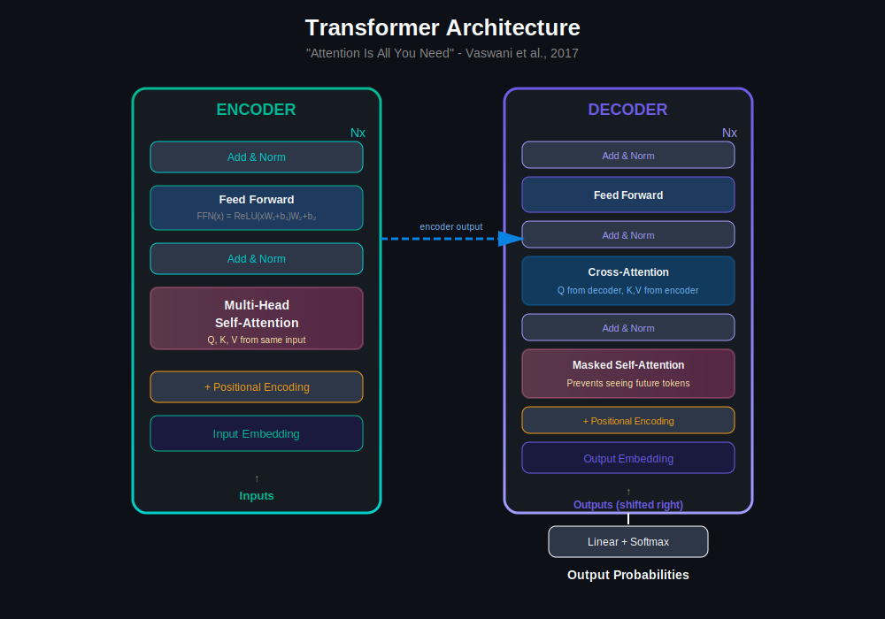

### Self-Attention Mechanism
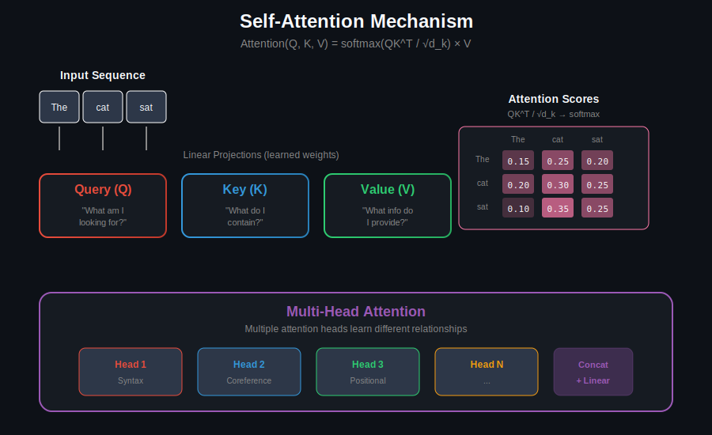

---

## 🎯 What is a Language Model?

A **Language Model (LM)** defines a probability distribution over sequences of tokens:

$$
P(w_1, w_2, \ldots, w_n)
$$

Using the chain rule of probability:

$$
P(w_1, w_2, \ldots, w_n) = \prod_{i=1}^{n} P(w_i | w_1, w_2, \ldots, w_{i-1})
$$

The core task: **estimate conditional probabilities** $P(w\_i | w\_{1:i-1})$.

### Why Language Models Matter

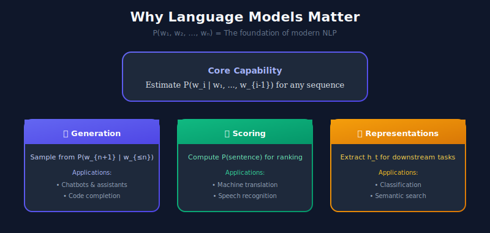

Language models enable:
- **Text generation**: Sample from $P(w\_{n+1} | w\_1, \ldots, w\_n)$
- **Scoring**: Compute $P(\text{sentence})$ for ranking
- **Representation learning**: Extract features from hidden states

---

## 📐 Mathematical Foundations

### Probability and Sequences

For a vocabulary $\mathcal{V}$, a language model defines:

$$
P: \mathcal{V}^* \rightarrow [0, 1]
$$

satisfying $\sum\_{w\_1, \ldots, w\_n \in \mathcal{V}^*} P(w\_1, \ldots, w\_n) = 1$

### Perplexity

**Perplexity** measures how well a model predicts a test set:

$$
\text{PPL}(W) = P(w_1, w_2, \ldots, w_N)^{-1/N}
$$

Equivalently using cross-entropy:

$$
\text{PPL}(W) = \exp\left(-\frac{1}{N}\sum_{i=1}^{N} \log P(w_i | w_{1:i-1})\right) = \exp(H(W))
$$

**Interpretation**: Average branching factor - lower is better.
- PPL = 10 means the model is as uncertain as choosing uniformly from 10 words
- State-of-the-art LLMs achieve PPL < 10 on standard benchmarks

### Cross-Entropy Loss

Training objective for language modeling:

$$
\mathcal{L}_{CE} = -\frac{1}{N}\sum_{i=1}^{N} \log P_\theta(w_i | w_{1:i-1})
$$

This minimizes KL divergence from the true distribution.

---

## 📊 Evolution of Language Models

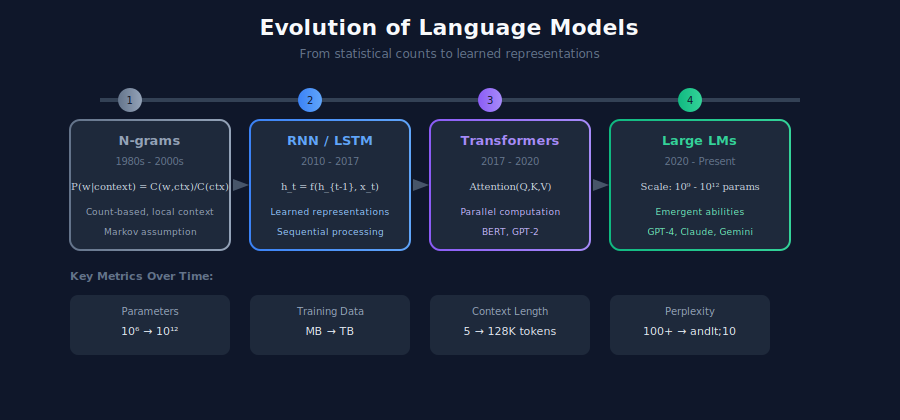

---

## 1️⃣ N-gram Language Models

The simplest approach: approximate with **Markov assumption** of order $n-1$:

$$
P(w_i | w_1, \ldots, w_{i-1}) \approx P(w_i | w_{i-n+1}, \ldots, w_{i-1})
$$

### N-gram Estimation

Using Maximum Likelihood Estimation (MLE):

$$
P_{\text{MLE}}(w_n | w_1, \ldots, w_{n-1}) = \frac{C(w_1, \ldots, w_n)}{C(w_1, \ldots, w_{n-1})}
$$

where $C(\cdot)$ denotes count in training corpus.

### Smoothing Techniques

**Problem**: Zero counts for unseen n-grams → $P = 0$

**Laplace (Add-one) Smoothing**:

$$
P_{\text{Laplace}}(w_n | w_{1:n-1}) = \frac{C(w_{1:n}) + 1}{C(w_{1:n-1}) + |\mathcal{V}|}
$$

**Kneser-Ney Smoothing** (state-of-the-art for n-grams):

$$
P_{KN}(w_i | w_{i-1}) = \frac{\max(C(w_{i-1}, w_i) - d, 0)}{C(w_{i-1})} + \lambda(w_{i-1}) P_{\text{cont}}(w_i)
$$

where $d$ is discount, $\lambda$ is interpolation weight, and $P\_{\text{cont}}$ is continuation probability.

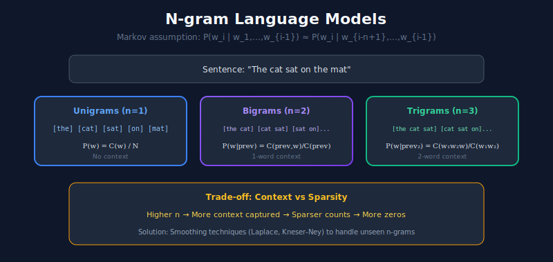

### Implementation

```python
from collections import defaultdict, Counter
import math
from typing import List, Tuple

class NgramLM:
    """
    N-gram language model with smoothing.
    
    Markov assumption: P(w_i | w_1,...,w_{i-1}) ≈ P(w_i | w_{i-n+1},...,w_{i-1})
    """
    
    def __init__(self, n: int = 3, smoothing: str = 'laplace'):
        self.n = n
        self.smoothing = smoothing
        self.ngram_counts = defaultdict(Counter)
        self.context_counts = Counter()
        self.vocab = set()
    
    def train(self, sentences: List[List[str]]):
        """
        Train on tokenized sentences.
        Computes: C(w_1,...,w_n) and C(w_1,...,w_{n-1})
        """
        for sentence in sentences:

            # Add boundary tokens
            tokens = ['<s>'] * (self.n - 1) + sentence + ['</s>']
            
            for i in range(len(tokens) - self.n + 1):
                ngram = tuple(tokens[i:i + self.n])
                context = ngram[:-1]
                word = ngram[-1]
                
                self.ngram_counts[context][word] += 1
                self.context_counts[context] += 1
                self.vocab.add(word)
        
        self.vocab_size = len(self.vocab)
        return self
    
    def probability(self, word: str, context: Tuple[str, ...]) -> float:
        """
        P(word | context) with smoothing.
        
        Laplace: (C(context, word) + 1) / (C(context) + |V|)
        """
        count = self.ngram_counts[context][word]
        context_count = self.context_counts[context]
        
        if self.smoothing == 'laplace':
            return (count + 1) / (context_count + self.vocab_size)
        else:
            if context_count == 0:
                return 1.0 / self.vocab_size
            return count / context_count
    
    def perplexity(self, sentences: List[List[str]]) -> float:
        """
        PPL = exp(-1/N * Σ log P(w_i | context))
        """
        log_prob_sum = 0.0
        total_words = 0
        
        for sentence in sentences:
            tokens = ['<s>'] * (self.n - 1) + sentence + ['</s>']
            
            for i in range(self.n - 1, len(tokens)):
                context = tuple(tokens[i - self.n + 1:i])
                word = tokens[i]
                
                prob = self.probability(word, context)
                log_prob_sum += math.log(max(prob, 1e-10))
                total_words += 1
        
        return math.exp(-log_prob_sum / total_words)
    
    def generate(self, max_length: int = 50, temperature: float = 1.0) -> List[str]:
        """
        Generate text by sampling from P(w | context).
        Temperature: τ > 1 → more random, τ < 1 → more deterministic
        """
        import random
        
        context = tuple(['<s>'] * (self.n - 1))
        generated = []
        
        for _ in range(max_length):
            candidates = self.ngram_counts[context]
            if not candidates:
                break
            
            words = list(candidates.keys())
            counts = [candidates[w] ** (1/temperature) for w in words]
            total = sum(counts)
            probs = [c / total for c in counts]
            
            word = random.choices(words, probs)[0]
            if word == '</s>':
                break
            
            generated.append(word)
            context = tuple(list(context[1:]) + [word])
        
        return generated
```

---

## 2️⃣ Recurrent Neural Networks (RNNs)

RNNs process sequences by maintaining a **hidden state** that evolves over time.

### RNN Equations

For input sequence $\mathbf{x}\_1, \mathbf{x}\_2, \ldots, \mathbf{x}\_T$:

$$
\mathbf{h}_t = \tanh(\mathbf{W}_{hh}\mathbf{h}_{t-1} + \mathbf{W}_{xh}\mathbf{x}_t + \mathbf{b}_h)
\mathbf{y}_t = \text{softmax}(\mathbf{W}_{hy}\mathbf{h}_t + \mathbf{b}_y)
$$

**Parameters**:
- $\mathbf{W}\_{hh} \in \mathbb{R}^{h \times h}$: hidden-to-hidden weights
- $\mathbf{W}\_{xh} \in \mathbb{R}^{h \times d}$: input-to-hidden weights  
- $\mathbf{W}\_{hy} \in \mathbb{R}^{|\mathcal{V}| \times h}$: hidden-to-output weights

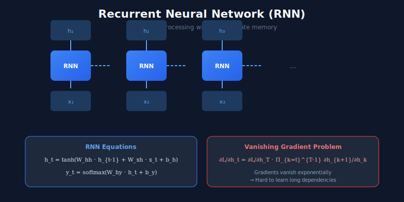

### The Vanishing Gradient Problem

During backpropagation through time (BPTT):

$$
\frac{\partial \mathcal{L}}{\partial \mathbf{h}_t} = \frac{\partial \mathcal{L}}{\partial \mathbf{h}_T} \prod_{k=t}^{T-1} \frac{\partial \mathbf{h}_{k+1}}{\partial \mathbf{h}_k}
$$

If $\|\frac{\partial \mathbf{h}\_{k+1}}{\partial \mathbf{h}\_k}\| < 1$ consistently, gradients vanish exponentially.

---

## 3️⃣ LSTM: Long Short-Term Memory

LSTMs introduce **gating mechanisms** to control information flow.

### LSTM Equations

**Forget gate** (what to discard from cell state):

$$
\mathbf{f}_t = \sigma(\mathbf{W}_f[\mathbf{h}_{t-1}, \mathbf{x}_t] + \mathbf{b}_f)
$$

**Input gate** (what new information to store):

$$
\mathbf{i}_t = \sigma(\mathbf{W}_i[\mathbf{h}_{t-1}, \mathbf{x}_t] + \mathbf{b}_i)
$$

**Candidate cell state**:

$$
\tilde{\mathbf{c}}_t = \tanh(\mathbf{W}_c[\mathbf{h}_{t-1}, \mathbf{x}_t] + \mathbf{b}_c)
$$

**Cell state update**:

$$
\mathbf{c}_t = \mathbf{f}_t \odot \mathbf{c}_{t-1} + \mathbf{i}_t \odot \tilde{\mathbf{c}}_t
$$

**Output gate**:

$$
\mathbf{o}_t = \sigma(\mathbf{W}_o[\mathbf{h}_{t-1}, \mathbf{x}_t] + \mathbf{b}_o)
$$

**Hidden state**:

$$
\mathbf{h}_t = \mathbf{o}_t \odot \tanh(\mathbf{c}_t)
$$

where $\odot$ denotes element-wise multiplication and $\sigma$ is sigmoid.

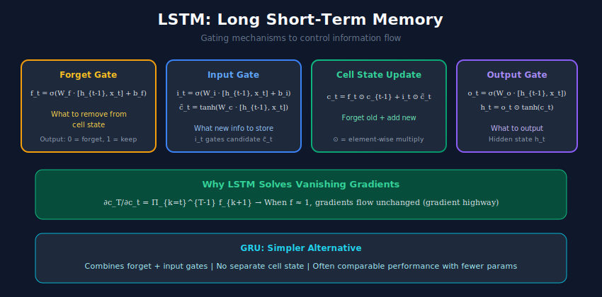

### Why LSTMs Work

The cell state $\mathbf{c}\_t$ provides a **gradient highway**:

$$
\frac{\partial \mathbf{c}_T}{\partial \mathbf{c}_t} = \prod_{k=t}^{T-1} \mathbf{f}_{k+1}
$$

When forget gates are close to 1, gradients flow unchanged.

---

## 4️⃣ The Transformer: Attention Is All You Need

Transformers replace recurrence with **self-attention**, enabling parallel processing and capturing long-range dependencies.

### Self-Attention Mechanism

Given input embeddings $\mathbf{X} \in \mathbb{R}^{n \times d}$:

**Query, Key, Value projections**:

$$
\mathbf{Q} = \mathbf{X}\mathbf{W}_Q, \quad \mathbf{K} = \mathbf{X}\mathbf{W}_K, \quad \mathbf{V} = \mathbf{X}\mathbf{W}_V
$$

**Scaled Dot-Product Attention**:

$$
\text{Attention}(\mathbf{Q}, \mathbf{K}, \mathbf{V}) = \text{softmax}\left(\frac{\mathbf{Q}\mathbf{K}^T}{\sqrt{d_k}}\right)\mathbf{V}
$$

**Why scale by $\sqrt{d\_k}$?**

For random vectors with variance 1, dot products have variance $d\_k$. Scaling ensures softmax inputs have unit variance, preventing saturation.

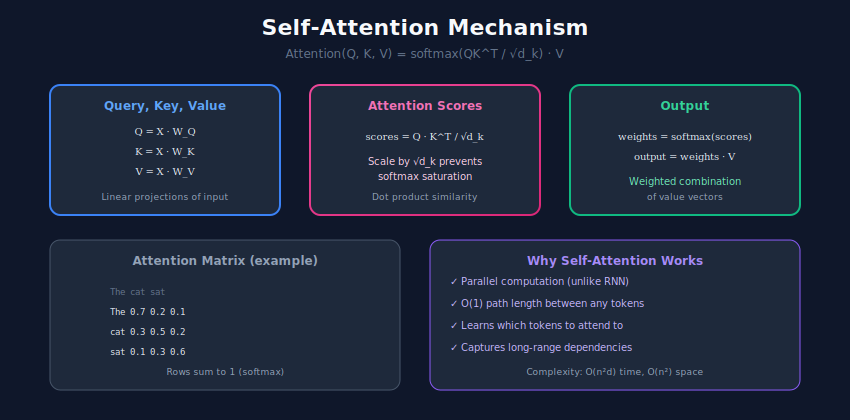

### Multi-Head Attention

Multiple attention heads capture different relationship types:

$$
\text{MultiHead}(\mathbf{Q}, \mathbf{K}, \mathbf{V}) = \text{Concat}(\text{head}_1, \ldots, \text{head}_h)\mathbf{W}_O
$$

where $\text{head}\_i = \text{Attention}(\mathbf{Q}\mathbf{W}\_Q^i, \mathbf{K}\mathbf{W}\_K^i, \mathbf{V}\mathbf{W}\_V^i)$

**Parameters**: 
- $\mathbf{W}\_Q^i, \mathbf{W}\_K^i \in \mathbb{R}^{d \times d\_k}$
- $\mathbf{W}\_V^i \in \mathbb{R}^{d \times d\_v}$
- $\mathbf{W}\_O \in \mathbb{R}^{hd\_v \times d}$

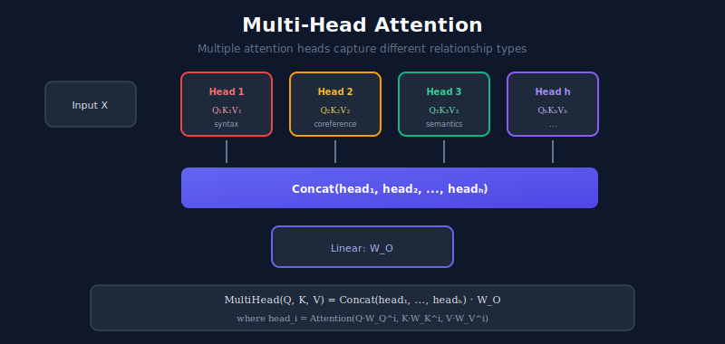

### Position Encodings

Self-attention is **permutation equivariant** - we need to inject position information.

**Sinusoidal positional encoding**:

$$
PE_{(pos, 2i)} = \sin\left(\frac{pos}{10000^{2i/d}}\right)
PE_{(pos, 2i+1)} = \cos\left(\frac{pos}{10000^{2i/d}}\right)
$$

**Why sinusoids?**
- $PE\_{pos+k}$ can be expressed as a linear function of $PE\_{pos}$
- Enables the model to learn relative positions

### Transformer Block

```python
import torch
import torch.nn as nn
import torch.nn.functional as F
import math

class MultiHeadAttention(nn.Module):
    """
    Multi-head self-attention.
    
    Attention(Q, K, V) = softmax(QK^T / √d_k) V
    MultiHead = Concat(head_1, ..., head_h) W_O
    """
    
    def __init__(self, d_model: int = 512, num_heads: int = 8, dropout: float = 0.1):
        super().__init__()
        assert d_model % num_heads == 0
        
        self.d_model = d_model
        self.num_heads = num_heads
        self.d_k = d_model // num_heads
        
        self.W_q = nn.Linear(d_model, d_model)
        self.W_k = nn.Linear(d_model, d_model)
        self.W_v = nn.Linear(d_model, d_model)
        self.W_o = nn.Linear(d_model, d_model)
        
        self.dropout = nn.Dropout(dropout)
    
    def forward(self, query, key, value, mask=None):
        batch_size = query.size(0)
        
        # Linear projections: (batch, seq, d_model) → (batch, seq, d_model)
        Q = self.W_q(query)
        K = self.W_k(key)
        V = self.W_v(value)
        
        # Reshape for multi-head: (batch, seq, d) → (batch, heads, seq, d_k)
        Q = Q.view(batch_size, -1, self.num_heads, self.d_k).transpose(1, 2)
        K = K.view(batch_size, -1, self.num_heads, self.d_k).transpose(1, 2)
        V = V.view(batch_size, -1, self.num_heads, self.d_k).transpose(1, 2)
        
        # Scaled dot-product attention
        scores = torch.matmul(Q, K.transpose(-2, -1)) / math.sqrt(self.d_k)
        
        if mask is not None:
            scores = scores.masked_fill(mask == 0, float('-inf'))
        
        attention = F.softmax(scores, dim=-1)
        attention = self.dropout(attention)
        
        # Apply attention to values
        context = torch.matmul(attention, V)
        
        # Concatenate heads: (batch, heads, seq, d_k) → (batch, seq, d_model)
        context = context.transpose(1, 2).contiguous().view(batch_size, -1, self.d_model)
        
        return self.W_o(context)

class TransformerBlock(nn.Module):
    """
    Single transformer block:
    x → LayerNorm → MultiHeadAttn → + → LayerNorm → FFN → +
        +-----------------------------+   +--------------+
                  (residual)                  (residual)
    """
    
    def __init__(self, d_model: int = 512, num_heads: int = 8, 
                 d_ff: int = 2048, dropout: float = 0.1):
        super().__init__()
        
        self.attention = MultiHeadAttention(d_model, num_heads, dropout)
        self.norm1 = nn.LayerNorm(d_model)
        self.norm2 = nn.LayerNorm(d_model)
        
        self.ffn = nn.Sequential(
            nn.Linear(d_model, d_ff),
            nn.GELU(),
            nn.Dropout(dropout),
            nn.Linear(d_ff, d_model),
            nn.Dropout(dropout)
        )
    
    def forward(self, x, mask=None):

        # Pre-norm architecture (more stable training)
        attn_out = self.attention(self.norm1(x), self.norm1(x), self.norm1(x), mask)
        x = x + attn_out
        
        ffn_out = self.ffn(self.norm2(x))
        x = x + ffn_out
        
        return x
```

---

## 5️⃣ BERT: Bidirectional Encoders

BERT uses **masked language modeling** to learn bidirectional representations.

### Masked Language Modeling (MLM)

Randomly mask 15% of tokens, predict original tokens:

$$
\mathcal{L}_{MLM} = -\mathbb{E}\left[\log P(w_i | w_{\setminus i})\right]
$$

for masked positions $i$.

**Masking strategy**:
- 80%: Replace with [MASK]
- 10%: Replace with random token
- 10%: Keep original

This prevents the model from only learning about [MASK] tokens.

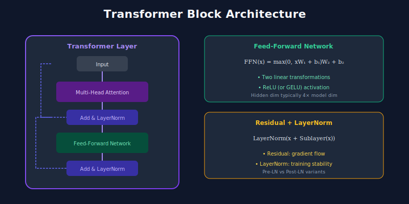

### Next Sentence Prediction (NSP)

Binary classification: Is sentence B the actual next sentence after A?

$$
\mathcal{L}_{NSP} = -\mathbb{E}[\log P(\text{IsNext} | \text{[CLS]})]
$$

Note: Later work (RoBERTa) showed NSP may not be necessary.

---

## 6️⃣ GPT: Generative Pre-Training

GPT uses **causal (autoregressive) language modeling**.

### Causal LM Objective

$$
\mathcal{L}_{CLM} = -\sum_{i=1}^{n} \log P(w_i | w_1, \ldots, w_{i-1})
$$

### Causal Masking

Attention scores are masked to prevent attending to future positions:

$$
\text{CausalAttention}(\mathbf{Q}, \mathbf{K}, \mathbf{V}) = \text{softmax}\left(\frac{\mathbf{Q}\mathbf{K}^T}{\sqrt{d_k}} + \mathbf{M}\right)\mathbf{V}
$$

where $\mathbf{M}\_{ij} = \begin{cases} 0 & \text{if } i \geq j \\ -\infty & \text{if } i < j \end{cases}$

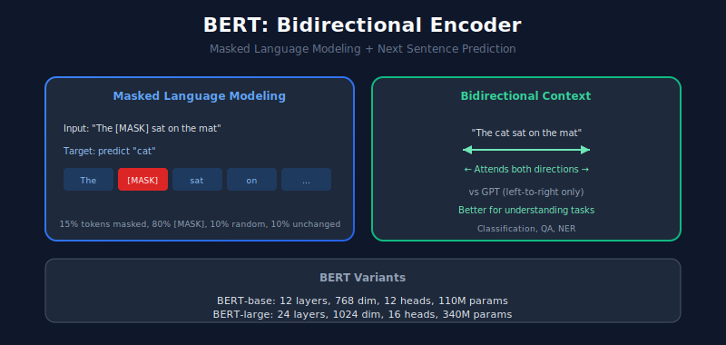

### Decoding Strategies

**Greedy decoding**:

$$
w_t = \arg\max_w P(w | w_{1:t-1})
$$

**Temperature sampling**:

$$
P_\tau(w) = \frac{\exp(z_w / \tau)}{\sum_{w'} \exp(z_{w'} / \tau)}
$$

**Top-k sampling**: Sample from top $k$ most likely tokens.

**Nucleus (Top-p) sampling**: Sample from smallest set where cumulative probability ≥ $p$.

```python
import torch
import torch.nn.functional as F

def top_p_sampling(logits: torch.Tensor, p: float = 0.9, temperature: float = 1.0):
    """
    Nucleus (top-p) sampling for text generation.
    
    Sample from smallest set V_p where Σ_{w∈V_p} P(w) ≥ p
    """

    # Apply temperature
    logits = logits / temperature
    
    # Sort by probability (descending)
    sorted_logits, sorted_indices = torch.sort(logits, descending=True)
    cumulative_probs = torch.cumsum(F.softmax(sorted_logits, dim=-1), dim=-1)
    
    # Remove tokens with cumulative probability above threshold
    sorted_indices_to_remove = cumulative_probs > p

    # Keep at least one token
    sorted_indices_to_remove[..., 1:] = sorted_indices_to_remove[..., :-1].clone()
    sorted_indices_to_remove[..., 0] = 0
    
    indices_to_remove = sorted_indices_to_remove.scatter(
        dim=-1, index=sorted_indices, src=sorted_indices_to_remove
    )
    logits[indices_to_remove] = float('-inf')
    
    # Sample
    probs = F.softmax(logits, dim=-1)
    return torch.multinomial(probs, num_samples=1)
```

---

## 📊 Model Comparison

| Model | Architecture | Context | Training Objective | Typical Use |
|-------|--------------|---------|-------------------|-------------|
| N-gram | Statistical | $n-1$ tokens | MLE on counts | Baseline, spell check |
| RNN | Recurrent | All previous | Next token prediction | Simple sequences |
| LSTM | Gated recurrent | All previous | Next token prediction | Longer sequences |
| Transformer | Self-attention | Full window | Various | Most NLP tasks |
| BERT | Encoder | Bidirectional | MLM + NSP | Understanding tasks |
| GPT | Decoder | Left-to-right | Causal LM | Generation tasks |

### Computational Complexity

| Model | Time per Layer | Memory |
|-------|---------------|--------|
| RNN | $O(nd^2)$ | $O(nd)$ |
| LSTM | $O(nd^2)$ | $O(nd)$ |
| Self-Attention | $O(n^2d)$ | $O(n^2 + nd)$ |
| Linear Attention | $O(nd^2)$ | $O(nd)$ |

where $n$ = sequence length, $d$ = model dimension.

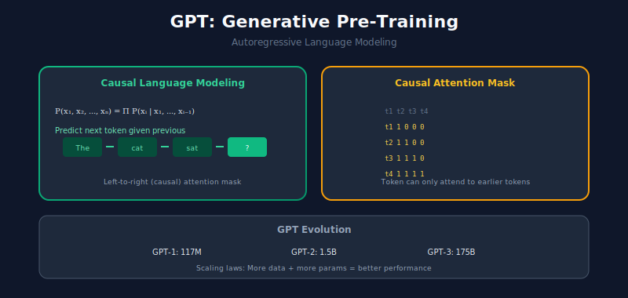

---

## 🔗 Related Topics

- [Embeddings](../02_embeddings/) - Vector representations from language models
- [Text Classification](../04_text_classification/) - Using LMs for classification
- [LLM Systems](../10_llm_systems/) - Large-scale language model deployment

---

## 📚 References

1. Vaswani, A., et al. (2017). [Attention Is All You Need](https://arxiv.org/abs/1706.03762)
2. Devlin, J., et al. (2018). [BERT: Pre-training of Deep Bidirectional Transformers](https://arxiv.org/abs/1810.04805)
3. Radford, A., et al. (2019). [Language Models are Unsupervised Multitask Learners](https://openai.com/research/better-language-models)
4. Brown, T., et al. (2020). [Language Models are Few-Shot Learners](https://arxiv.org/abs/2005.14165)
5. [The Illustrated Transformer](https://jalammar.github.io/illustrated-transformer/) - Jay Alammar

---

<div align="center">

**[⬆ Back to Top](#)** | **[📚 Main Repository](https://github.com/Gaurav14cs17/ml_system_design)**

Made with 💜 by [Gaurav14cs17](https://github.com/Gaurav14cs17)

</div>
