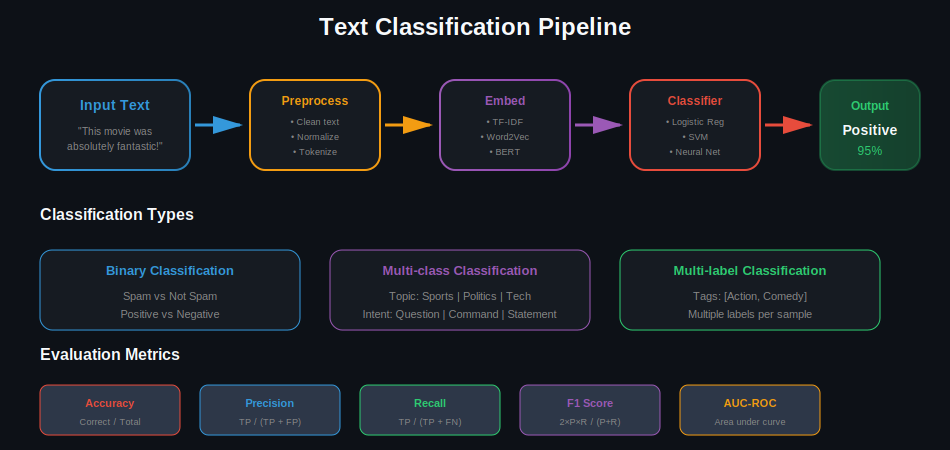
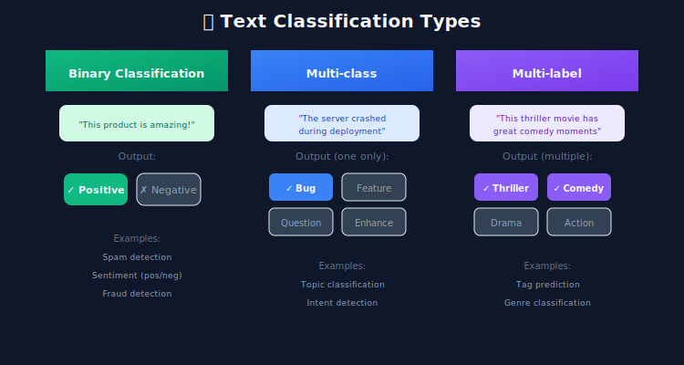
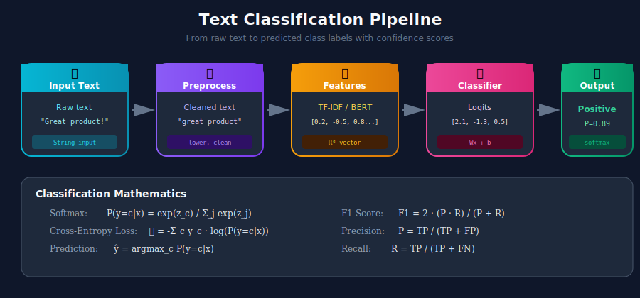

# 📊 Text Classification Systems

> Building production-ready systems for sentiment analysis, topic classification, and intent detection

---

## 📊 Visual Overview

### Classification Pipeline


---

## 🎯 What is Text Classification?

Text classification assigns predefined categories to text documents. It's one of the most common NLP tasks in production systems.



---

## 🏗️ Classification Pipeline Architecture



---

## 1️⃣ Traditional ML Approaches

### TF-IDF + Classical ML

```python
import numpy as np
from sklearn.feature_extraction.text import TfidfVectorizer
from sklearn.linear_model import LogisticRegression
from sklearn.svm import LinearSVC
from sklearn.naive_bayes import MultinomialNB
from sklearn.ensemble import RandomForestClassifier
from sklearn.pipeline import Pipeline
from sklearn.model_selection import cross_val_score, GridSearchCV
from sklearn.metrics import classification_report, confusion_matrix
from typing import List, Tuple

class TraditionalTextClassifier:
    """
    Traditional ML text classification with TF-IDF features.
    Fast, interpretable, good baseline.
    """

    def __init__(self, model_type: str = 'logistic'):
        self.model_type = model_type
        self.pipeline = self._create_pipeline()

    def _create_pipeline(self) -> Pipeline:
        """Create sklearn pipeline."""
        vectorizer = TfidfVectorizer(
            max_features=10000,
            ngram_range=(1, 2),
            min_df=2,
            max_df=0.95,
            sublinear_tf=True
        )

        models = {
            'logistic': LogisticRegression(max_iter=1000, C=1.0),
            'svm': LinearSVC(C=1.0, max_iter=10000),
            'naive_bayes': MultinomialNB(alpha=0.1),
            'random_forest': RandomForestClassifier(n_estimators=100)
        }

        return Pipeline([
            ('vectorizer', vectorizer),
            ('classifier', models[self.model_type])
        ])

    def train(self, texts: List[str], labels: List[int]):
        """Train the classifier."""
        self.pipeline.fit(texts, labels)
        return self

    def predict(self, texts: List[str]) -> np.ndarray:
        """Predict labels."""
        return self.pipeline.predict(texts)

    def predict_proba(self, texts: List[str]) -> np.ndarray:
        """Predict probabilities (if supported)."""
        if hasattr(self.pipeline.named_steps['classifier'], 'predict_proba'):
            return self.pipeline.predict_proba(texts)
        return self.pipeline.decision_function(texts)

    def evaluate(
        self,
        texts: List[str],
        labels: List[int],
        label_names: List[str] = None
    ) -> dict:
        """Evaluate the classifier."""
        predictions = self.predict(texts)

        report = classification_report(
            labels, predictions,
            target_names=label_names,
            output_dict=True
        )

        return {
            'classification_report': report,
            'confusion_matrix': confusion_matrix(labels, predictions).tolist(),
            'accuracy': report['accuracy']
        }

    def cross_validate(
        self,
        texts: List[str],
        labels: List[int],
        cv: int = 5
    ) -> dict:
        """Perform cross-validation."""
        scores = cross_val_score(self.pipeline, texts, labels, cv=cv)
        return {
            'mean_accuracy': scores.mean(),
            'std_accuracy': scores.std(),
            'fold_scores': scores.tolist()
        }

    def get_feature_importance(self, top_n: int = 20) -> dict:
        """Get most important features per class."""
        vectorizer = self.pipeline.named_steps['vectorizer']
        classifier = self.pipeline.named_steps['classifier']

        feature_names = vectorizer.get_feature_names_out()

        if hasattr(classifier, 'coef_'):
            importance = {}
            coefs = classifier.coef_

            if len(coefs.shape) == 1:
                coefs = coefs.reshape(1, -1)

            for idx, class_coef in enumerate(coefs):
                top_indices = np.argsort(class_coef)[-top_n:][::-1]
                importance[f'class_{idx}'] = [
                    (feature_names[i], float(class_coef[i]))
                    for i in top_indices
                ]

            return importance

        return {}

# Usage
texts = [
    "This movie was fantastic!",
    "Terrible waste of time",
    "Amazing performance by the lead actor",
    "Boring and predictable plot"
]
labels = [1, 0, 1, 0]  # 1 = positive, 0 = negative

classifier = TraditionalTextClassifier(model_type='logistic')
classifier.train(texts, labels)

# Predict
new_texts = ["I loved every minute of it!"]
predictions = classifier.predict(new_texts)
print(f"Prediction: {'Positive' if predictions[0] == 1 else 'Negative'}")
```

---

## 2️⃣ Deep Learning Approaches

### BERT Text Classification

```python
import torch
import torch.nn as nn
from torch.utils.data import Dataset, DataLoader
from transformers import BertTokenizer, BertModel, AdamW, get_linear_schedule_with_warmup
from typing import List, Dict, Tuple
import numpy as np
from tqdm import tqdm

class TextClassificationDataset(Dataset):
    """Dataset for text classification."""

    def __init__(
        self,
        texts: List[str],
        labels: List[int],
        tokenizer: BertTokenizer,
        max_length: int = 128
    ):
        self.texts = texts
        self.labels = labels
        self.tokenizer = tokenizer
        self.max_length = max_length

    def __len__(self):
        return len(self.texts)

    def __getitem__(self, idx):
        text = self.texts[idx]
        label = self.labels[idx]

        encoding = self.tokenizer(
            text,
            max_length=self.max_length,
            padding='max_length',
            truncation=True,
            return_tensors='pt'
        )

        return {
            'input_ids': encoding['input_ids'].squeeze(),
            'attention_mask': encoding['attention_mask'].squeeze(),
            'label': torch.tensor(label, dtype=torch.long)
        }

class BertClassifier(nn.Module):
    """BERT-based text classifier."""

    def __init__(
        self,
        num_classes: int,
        model_name: str = 'bert-base-uncased',
        dropout: float = 0.3,
        freeze_bert: bool = False
    ):
        super().__init__()

        self.bert = BertModel.from_pretrained(model_name)
        self.dropout = nn.Dropout(dropout)
        self.classifier = nn.Linear(self.bert.config.hidden_size, num_classes)

        if freeze_bert:
            for param in self.bert.parameters():
                param.requires_grad = False

    def forward(
        self,
        input_ids: torch.Tensor,
        attention_mask: torch.Tensor
    ) -> torch.Tensor:
        outputs = self.bert(
            input_ids=input_ids,
            attention_mask=attention_mask
        )

        # Use [CLS] token representation
        pooled_output = outputs.pooler_output
        pooled_output = self.dropout(pooled_output)
        logits = self.classifier(pooled_output)

        return logits

class BertTextClassifier:
    """Complete BERT classification pipeline."""

    def __init__(
        self,
        num_classes: int,
        model_name: str = 'bert-base-uncased',
        max_length: int = 128,
        batch_size: int = 16,
        learning_rate: float = 2e-5,
        epochs: int = 3
    ):
        self.device = torch.device('cuda' if torch.cuda.is_available() else 'cpu')
        self.tokenizer = BertTokenizer.from_pretrained(model_name)
        self.model = BertClassifier(num_classes, model_name).to(self.device)

        self.max_length = max_length
        self.batch_size = batch_size
        self.learning_rate = learning_rate
        self.epochs = epochs
        self.num_classes = num_classes

    def train(
        self,
        train_texts: List[str],
        train_labels: List[int],
        val_texts: List[str] = None,
        val_labels: List[int] = None
    ) -> Dict:
        """Train the classifier."""

        # Create datasets
        train_dataset = TextClassificationDataset(
            train_texts, train_labels, self.tokenizer, self.max_length
        )
        train_loader = DataLoader(
            train_dataset, batch_size=self.batch_size, shuffle=True
        )

        if val_texts:
            val_dataset = TextClassificationDataset(
                val_texts, val_labels, self.tokenizer, self.max_length
            )
            val_loader = DataLoader(
                val_dataset, batch_size=self.batch_size
            )

        # Optimizer and scheduler
        optimizer = AdamW(self.model.parameters(), lr=self.learning_rate)
        total_steps = len(train_loader) * self.epochs
        scheduler = get_linear_schedule_with_warmup(
            optimizer,
            num_warmup_steps=total_steps // 10,
            num_training_steps=total_steps
        )

        criterion = nn.CrossEntropyLoss()
        history = {'train_loss': [], 'val_loss': [], 'val_accuracy': []}

        for epoch in range(self.epochs):

            # Training
            self.model.train()
            total_loss = 0

            for batch in tqdm(train_loader, desc=f'Epoch {epoch + 1}'):
                optimizer.zero_grad()

                input_ids = batch['input_ids'].to(self.device)
                attention_mask = batch['attention_mask'].to(self.device)
                labels = batch['label'].to(self.device)

                logits = self.model(input_ids, attention_mask)
                loss = criterion(logits, labels)

                loss.backward()
                torch.nn.utils.clip_grad_norm_(self.model.parameters(), 1.0)
                optimizer.step()
                scheduler.step()

                total_loss += loss.item()

            avg_train_loss = total_loss / len(train_loader)
            history['train_loss'].append(avg_train_loss)

            # Validation
            if val_texts:
                val_loss, val_acc = self._evaluate(val_loader, criterion)
                history['val_loss'].append(val_loss)
                history['val_accuracy'].append(val_acc)

                print(f'Epoch {epoch + 1}: Train Loss={avg_train_loss:.4f}, '
                      f'Val Loss={val_loss:.4f}, Val Acc={val_acc:.4f}')

        return history

    def _evaluate(self, dataloader, criterion) -> Tuple[float, float]:
        """Evaluate on a dataloader."""
        self.model.eval()
        total_loss = 0
        correct = 0
        total = 0

        with torch.no_grad():
            for batch in dataloader:
                input_ids = batch['input_ids'].to(self.device)
                attention_mask = batch['attention_mask'].to(self.device)
                labels = batch['label'].to(self.device)

                logits = self.model(input_ids, attention_mask)
                loss = criterion(logits, labels)

                total_loss += loss.item()
                predictions = torch.argmax(logits, dim=1)
                correct += (predictions == labels).sum().item()
                total += labels.size(0)

        return total_loss / len(dataloader), correct / total

    def predict(self, texts: List[str]) -> np.ndarray:
        """Predict class labels."""
        self.model.eval()
        predictions = []

        for text in texts:
            encoding = self.tokenizer(
                text,
                max_length=self.max_length,
                padding='max_length',
                truncation=True,
                return_tensors='pt'
            ).to(self.device)

            with torch.no_grad():
                logits = self.model(
                    encoding['input_ids'],
                    encoding['attention_mask']
                )
                pred = torch.argmax(logits, dim=1).item()
                predictions.append(pred)

        return np.array(predictions)

    def predict_proba(self, texts: List[str]) -> np.ndarray:
        """Predict class probabilities."""
        self.model.eval()
        probabilities = []

        for text in texts:
            encoding = self.tokenizer(
                text,
                max_length=self.max_length,
                padding='max_length',
                truncation=True,
                return_tensors='pt'
            ).to(self.device)

            with torch.no_grad():
                logits = self.model(
                    encoding['input_ids'],
                    encoding['attention_mask']
                )
                probs = torch.softmax(logits, dim=1).cpu().numpy()
                probabilities.append(probs[0])

        return np.array(probabilities)

    def save(self, path: str):
        """Save model."""
        torch.save({
            'model_state_dict': self.model.state_dict(),
            'num_classes': self.num_classes
        }, path)

    def load(self, path: str):
        """Load model."""
        checkpoint = torch.load(path, map_location=self.device)
        self.model.load_state_dict(checkpoint['model_state_dict'])

# Usage
classifier = BertTextClassifier(
    num_classes=3,
    model_name='bert-base-uncased',
    epochs=3
)

# Train
history = classifier.train(
    train_texts=["Great product!", "Terrible service", "Just okay"],
    train_labels=[2, 0, 1],
    val_texts=["Love it!", "Hate it"],
    val_labels=[2, 0]
)

# Predict
predictions = classifier.predict(["This is amazing!"])
probabilities = classifier.predict_proba(["This is amazing!"])
```

---

## 3️⃣ Multi-Label Classification

```python
import torch
import torch.nn as nn
from typing import List
import numpy as np

class MultiLabelClassifier(nn.Module):
    """Multi-label text classifier using BERT."""

    def __init__(
        self,
        num_labels: int,
        model_name: str = 'bert-base-uncased',
        threshold: float = 0.5
    ):
        super().__init__()
        from transformers import BertModel

        self.bert = BertModel.from_pretrained(model_name)
        self.dropout = nn.Dropout(0.3)
        self.classifier = nn.Linear(
            self.bert.config.hidden_size,
            num_labels
        )
        self.threshold = threshold

    def forward(self, input_ids, attention_mask):
        outputs = self.bert(input_ids, attention_mask)
        pooled = self.dropout(outputs.pooler_output)
        logits = self.classifier(pooled)
        return torch.sigmoid(logits)

    def predict(self, probabilities: torch.Tensor) -> torch.Tensor:
        """Convert probabilities to binary predictions."""
        return (probabilities >= self.threshold).int()

class MultiLabelTrainer:
    """Trainer for multi-label classification."""

    def __init__(self, model: MultiLabelClassifier, device: torch.device):
        self.model = model.to(device)
        self.device = device
        self.criterion = nn.BCELoss()

    def train_step(self, batch, optimizer):
        self.model.train()
        optimizer.zero_grad()

        input_ids = batch['input_ids'].to(self.device)
        attention_mask = batch['attention_mask'].to(self.device)
        labels = batch['labels'].float().to(self.device)

        outputs = self.model(input_ids, attention_mask)
        loss = self.criterion(outputs, labels)

        loss.backward()
        optimizer.step()

        return loss.item()

    def evaluate(self, dataloader) -> dict:
        """Evaluate with multi-label metrics."""
        self.model.eval()
        all_preds = []
        all_labels = []

        with torch.no_grad():
            for batch in dataloader:
                input_ids = batch['input_ids'].to(self.device)
                attention_mask = batch['attention_mask'].to(self.device)
                labels = batch['labels']

                outputs = self.model(input_ids, attention_mask)
                preds = self.model.predict(outputs)

                all_preds.extend(preds.cpu().numpy())
                all_labels.extend(labels.numpy())

        all_preds = np.array(all_preds)
        all_labels = np.array(all_labels)

        # Calculate metrics
        from sklearn.metrics import (
            hamming_loss,
            f1_score,
            precision_score,
            recall_score
        )

        return {
            'hamming_loss': hamming_loss(all_labels, all_preds),
            'micro_f1': f1_score(all_labels, all_preds, average='micro'),
            'macro_f1': f1_score(all_labels, all_preds, average='macro'),
            'precision': precision_score(all_labels, all_preds, average='micro'),
            'recall': recall_score(all_labels, all_preds, average='micro')
        }
```

---

## 4️⃣ Production Deployment

### Classification API Service

```python
from fastapi import FastAPI, HTTPException
from pydantic import BaseModel
from typing import List, Optional
import torch
from functools import lru_cache

app = FastAPI(title="Text Classification API")

class ClassificationRequest(BaseModel):
    texts: List[str]
    return_probabilities: bool = False

class ClassificationResponse(BaseModel):
    predictions: List[dict]
    model_version: str

class ClassificationService:
    """Production classification service."""

    _instance = None

    def __new__(cls):
        if cls._instance is None:
            cls._instance = super().__new__(cls)
            cls._instance._initialize()
        return cls._instance

    def _initialize(self):
        self.device = torch.device('cuda' if torch.cuda.is_available() else 'cpu')
        self.model = None
        self.tokenizer = None
        self.label_map = {0: 'negative', 1: 'neutral', 2: 'positive'}
        self.model_version = "1.0.0"

    def load_model(self, model_path: str):
        """Load model for inference."""
        from transformers import BertTokenizer

        self.tokenizer = BertTokenizer.from_pretrained('bert-base-uncased')
        self.model = BertClassifier(num_classes=3)
        self.model.load_state_dict(torch.load(model_path, map_location=self.device))
        self.model.to(self.device)
        self.model.eval()

    @lru_cache(maxsize=1000)
    def _cached_predict(self, text: str) -> tuple:
        """Cache predictions for repeated texts."""
        encoding = self.tokenizer(
            text,
            max_length=128,
            padding='max_length',
            truncation=True,
            return_tensors='pt'
        ).to(self.device)

        with torch.no_grad():
            logits = self.model(
                encoding['input_ids'],
                encoding['attention_mask']
            )
            probs = torch.softmax(logits, dim=1)[0]
            pred = torch.argmax(probs).item()

        return pred, tuple(probs.cpu().numpy())

    def predict(
        self,
        texts: List[str],
        return_probs: bool = False
    ) -> List[dict]:
        """Predict with optional probabilities."""
        results = []

        for text in texts:
            pred, probs = self._cached_predict(text)

            result = {
                'text': text[:100] + '...' if len(text) > 100 else text,
                'label': self.label_map[pred],
                'confidence': float(max(probs))
            }

            if return_probs:
                result['probabilities'] = {
                    self.label_map[i]: float(p)
                    for i, p in enumerate(probs)
                }

            results.append(result)

        return results

service = ClassificationService()

@app.on_event("startup")
async def load_model():
    """Load model on startup."""

    # service.load_model("path/to/model.pt")
    pass

@app.post("/classify", response_model=ClassificationResponse)
async def classify(request: ClassificationRequest):
    """Classify texts."""
    if not request.texts:
        raise HTTPException(status_code=400, detail="No texts provided")

    if len(request.texts) > 100:
        raise HTTPException(status_code=400, detail="Max 100 texts per request")

    predictions = service.predict(
        request.texts,
        return_probs=request.return_probabilities
    )

    return ClassificationResponse(
        predictions=predictions,
        model_version=service.model_version
    )

@app.get("/health")
async def health():
    return {"status": "healthy", "model_loaded": service.model is not None}
```

---

## 📊 Evaluation Metrics

| Metric | Formula | When to Use |
|--------|---------|-------------|
| **Accuracy** | Correct / Total | Balanced classes |
| **Precision** | TP / (TP + FP) | False positives costly |
| **Recall** | TP / (TP + FN) | False negatives costly |
| **F1 Score** | 2 × (P × R) / (P + R) | Imbalanced classes |
| **AUC-ROC** | Area under ROC | Binary classification |
| **Hamming Loss** | Wrong labels / Total labels | Multi-label |

---

## 🎯 Best Practices

1. **Start with baselines** - TF-IDF + Logistic Regression first
2. **Handle class imbalance** - Weighted loss, oversampling, SMOTE
3. **Proper evaluation** - Stratified splits, cross-validation
4. **Monitor confidence** - Don't just look at predictions
5. **Version your models** - Track data, code, and model versions

---

## 🔗 Related Topics

- [Text Preprocessing](../01_text_preprocessing/) - Clean text before classification
- [Embeddings](../02_embeddings/) - Feature extraction
- [Language Models](../03_language_models/) - BERT fundamentals

---

## 📚 References

1. [BERT for Text Classification](https://arxiv.org/abs/1810.04805)
2. [ULMFiT](https://arxiv.org/abs/1801.06146) - Universal Language Model Fine-tuning
3. [scikit-learn Text Classification](https://scikit-learn.org/stable/tutorial/text_analytics/working_with_text_data.html)

---

<div align="center">

**[⬆ Back to Top](#)** | **[📚 Main Repository](https://github.com/Gaurav14cs17/ml_system_design)**

Made with 💜 by [Gaurav14cs17](https://github.com/Gaurav14cs17)

</div>
