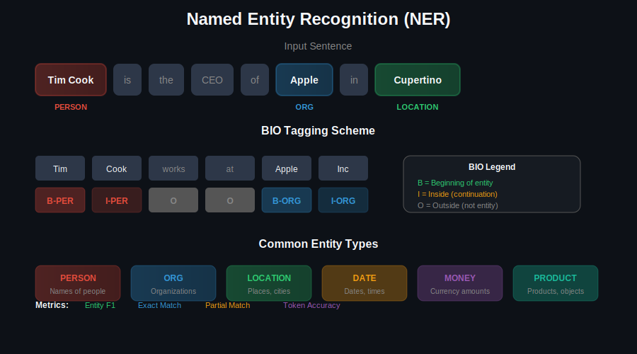
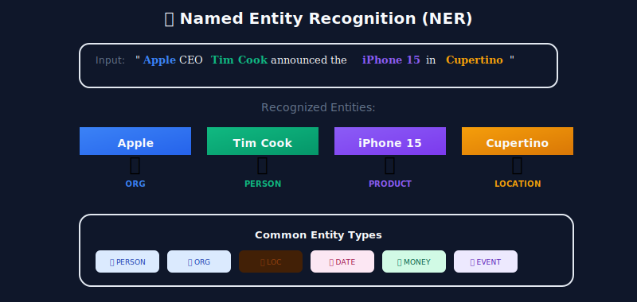
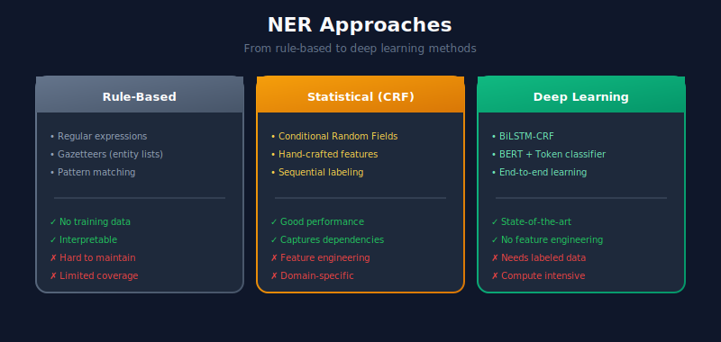
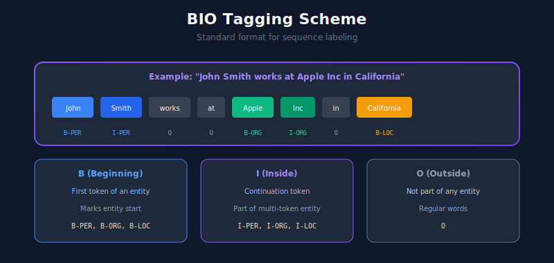

# 🏷️ Named Entity Recognition (NER) Systems

> Identifying and classifying named entities in text - people, organizations, locations, and more

---

## 📊 Visual Overview

### NER Architecture


---

## 🎯 What is Named Entity Recognition?

NER is the task of identifying and classifying named entities in text into predefined categories.



---

## 🏗️ NER Approaches



---

## 1️⃣ BIO Tagging Scheme



---

## 2️⃣ Using spaCy for NER

```python
import spacy
from spacy.tokens import Doc
from typing import List, Tuple, Dict

class SpacyNER:
    """Production NER using spaCy."""

    def __init__(self, model: str = "en_core_web_trf"):
        """
        Models:
        - en_core_web_sm: Small, fast
        - en_core_web_md: Medium, balanced
        - en_core_web_lg: Large, accurate
        - en_core_web_trf: Transformer-based, best
        """
        self.nlp = spacy.load(model)

    def extract_entities(self, text: str) -> List[Dict]:
        """Extract entities from text."""
        doc = self.nlp(text)

        entities = []
        for ent in doc.ents:
            entities.append({
                'text': ent.text,
                'label': ent.label_,
                'start': ent.start_char,
                'end': ent.end_char,
                'description': spacy.explain(ent.label_)
            })

        return entities

    def extract_with_context(
        self,
        text: str,
        context_window: int = 50
    ) -> List[Dict]:
        """Extract entities with surrounding context."""
        doc = self.nlp(text)

        entities = []
        for ent in doc.ents:
            start = max(0, ent.start_char - context_window)
            end = min(len(text), ent.end_char + context_window)

            entities.append({
                'text': ent.text,
                'label': ent.label_,
                'context': text[start:end],
                'position': (ent.start_char, ent.end_char)
            })

        return entities

    def batch_extract(self, texts: List[str]) -> List[List[Dict]]:
        """Batch entity extraction for efficiency."""
        results = []
        for doc in self.nlp.pipe(texts, batch_size=50):
            entities = [
                {
                    'text': ent.text,
                    'label': ent.label_,
                    'start': ent.start_char,
                    'end': ent.end_char
                }
                for ent in doc.ents
            ]
            results.append(entities)
        return results

    def get_entity_statistics(self, texts: List[str]) -> Dict:
        """Get entity distribution statistics."""
        from collections import Counter

        entity_counts = Counter()
        label_counts = Counter()

        for doc in self.nlp.pipe(texts, batch_size=50):
            for ent in doc.ents:
                entity_counts[ent.text] += 1
                label_counts[ent.label_] += 1

        return {
            'top_entities': entity_counts.most_common(20),
            'label_distribution': dict(label_counts),
            'total_entities': sum(label_counts.values())
        }

# Usage
ner = SpacyNER("en_core_web_sm")

text = "Apple CEO Tim Cook announced the iPhone 15 in Cupertino on September 12, 2023."
entities = ner.extract_entities(text)

for ent in entities:
    print(f"{ent['text']:20} | {ent['label']:10} | {ent['description']}")

```

---

## 3️⃣ BERT-based NER (Token Classification)

```python
import torch
import torch.nn as nn
from torch.utils.data import Dataset, DataLoader
from transformers import BertTokenizerFast, BertForTokenClassification, AdamW
from typing import List, Dict, Tuple
import numpy as np
from seqeval.metrics import classification_report, f1_score

class NERDataset(Dataset):
    """Dataset for NER with BIO tags."""

    def __init__(
        self,
        texts: List[List[str]],  # Tokenized sentences
        labels: List[List[str]], # BIO tags
        tokenizer: BertTokenizerFast,
        label2id: Dict[str, int],
        max_length: int = 128
    ):
        self.texts = texts
        self.labels = labels
        self.tokenizer = tokenizer
        self.label2id = label2id
        self.max_length = max_length

    def __len__(self):
        return len(self.texts)

    def __getitem__(self, idx):
        words = self.texts[idx]
        word_labels = self.labels[idx]

        # Tokenize with word-piece alignment
        encoding = self.tokenizer(
            words,
            is_split_into_words=True,
            max_length=self.max_length,
            padding='max_length',
            truncation=True,
            return_tensors='pt'
        )

        # Align labels with tokens
        word_ids = encoding.word_ids()
        label_ids = []
        previous_word_idx = None

        for word_idx in word_ids:
            if word_idx is None:
                label_ids.append(-100)  # Ignore padding
            elif word_idx != previous_word_idx:
                label_ids.append(self.label2id[word_labels[word_idx]])
            else:
                # For word pieces, use I- tag or ignore
                label_ids.append(-100)
            previous_word_idx = word_idx

        return {
            'input_ids': encoding['input_ids'].squeeze(),
            'attention_mask': encoding['attention_mask'].squeeze(),
            'labels': torch.tensor(label_ids, dtype=torch.long)
        }

class BertNER:
    """BERT-based Named Entity Recognition."""

    def __init__(
        self,
        labels: List[str],
        model_name: str = 'bert-base-uncased',
        max_length: int = 128
    ):
        self.device = torch.device('cuda' if torch.cuda.is_available() else 'cpu')
        self.tokenizer = BertTokenizerFast.from_pretrained(model_name)

        self.labels = labels
        self.label2id = {label: i for i, label in enumerate(labels)}
        self.id2label = {i: label for label, i in self.label2id.items()}

        self.model = BertForTokenClassification.from_pretrained(
            model_name,
            num_labels=len(labels),
            id2label=self.id2label,
            label2id=self.label2id
        ).to(self.device)

        self.max_length = max_length

    def train(
        self,
        train_texts: List[List[str]],
        train_labels: List[List[str]],
        epochs: int = 3,
        batch_size: int = 16,
        learning_rate: float = 5e-5
    ):
        """Train the NER model."""
        dataset = NERDataset(
            train_texts, train_labels,
            self.tokenizer, self.label2id, self.max_length
        )
        dataloader = DataLoader(dataset, batch_size=batch_size, shuffle=True)

        optimizer = AdamW(self.model.parameters(), lr=learning_rate)

        for epoch in range(epochs):
            self.model.train()
            total_loss = 0

            for batch in dataloader:
                optimizer.zero_grad()

                outputs = self.model(
                    input_ids=batch['input_ids'].to(self.device),
                    attention_mask=batch['attention_mask'].to(self.device),
                    labels=batch['labels'].to(self.device)
                )

                loss = outputs.loss
                loss.backward()
                optimizer.step()

                total_loss += loss.item()

            print(f"Epoch {epoch + 1}, Loss: {total_loss / len(dataloader):.4f}")

    def predict(self, text: str) -> List[Dict]:
        """Predict entities in text."""
        self.model.eval()

        # Tokenize
        words = text.split()  # Simple whitespace tokenization
        encoding = self.tokenizer(
            words,
            is_split_into_words=True,
            return_tensors='pt',
            padding=True,
            truncation=True,
            max_length=self.max_length
        ).to(self.device)

        # Predict
        with torch.no_grad():
            outputs = self.model(**encoding)
            predictions = torch.argmax(outputs.logits, dim=2)[0]

        # Align predictions with words
        word_ids = encoding.word_ids()
        entities = []
        current_entity = None

        for idx, (word_idx, pred) in enumerate(zip(word_ids, predictions)):
            if word_idx is None:
                continue

            label = self.id2label[pred.item()]

            if label.startswith('B-'):
                if current_entity:
                    entities.append(current_entity)
                current_entity = {
                    'text': words[word_idx],
                    'label': label[2:],
                    'start_word': word_idx,
                    'end_word': word_idx
                }
            elif label.startswith('I-') and current_entity:
                if label[2:] == current_entity['label']:
                    current_entity['text'] += ' ' + words[word_idx]
                    current_entity['end_word'] = word_idx
            else:
                if current_entity:
                    entities.append(current_entity)
                    current_entity = None

        if current_entity:
            entities.append(current_entity)

        return entities

    def evaluate(
        self,
        test_texts: List[List[str]],
        test_labels: List[List[str]]
    ) -> Dict:
        """Evaluate the NER model."""
        self.model.eval()

        all_preds = []
        all_labels = []

        for words, labels in zip(test_texts, test_labels):
            encoding = self.tokenizer(
                words,
                is_split_into_words=True,
                return_tensors='pt',
                padding=True,
                truncation=True
            ).to(self.device)

            with torch.no_grad():
                outputs = self.model(**encoding)
                predictions = torch.argmax(outputs.logits, dim=2)[0]

            word_ids = encoding.word_ids()
            pred_labels = []
            true_labels = []

            prev_word_idx = None
            for idx, word_idx in enumerate(word_ids):
                if word_idx is None or word_idx == prev_word_idx:
                    continue
                pred_labels.append(self.id2label[predictions[idx].item()])
                true_labels.append(labels[word_idx])
                prev_word_idx = word_idx

            all_preds.append(pred_labels)
            all_labels.append(true_labels)

        return {
            'f1_score': f1_score(all_labels, all_preds),
            'report': classification_report(all_labels, all_preds)
        }

# Usage
labels = ['O', 'B-PER', 'I-PER', 'B-ORG', 'I-ORG', 'B-LOC', 'I-LOC']

ner = BertNER(labels=labels)

# Training data (tokenized)
train_texts = [
    ["Tim", "Cook", "is", "the", "CEO", "of", "Apple"],
    ["Google", "was", "founded", "in", "California"]
]
train_labels = [
    ["B-PER", "I-PER", "O", "O", "O", "O", "B-ORG"],
    ["B-ORG", "O", "O", "O", "B-LOC"]
]

# Train and predict
ner.train(train_texts, train_labels, epochs=3)
entities = ner.predict("Tim Cook announced new products at Apple headquarters")

```

---

## 4️⃣ Custom Entity Types

```python
from spacy.training import Example
import spacy
from spacy.util import minibatch
import random

class CustomNERTrainer:
    """Train spaCy NER with custom entity types."""

    def __init__(self, entity_types: List[str]):
        self.nlp = spacy.blank("en")
        self.ner = self.nlp.add_pipe("ner")

        for entity_type in entity_types:
            self.ner.add_label(entity_type)

    def prepare_training_data(
        self,
        texts: List[str],
        annotations: List[Dict]
    ) -> List[Example]:
        """
        Prepare training data.

        annotations format:
        [{"entities": [(start, end, label), ...]}]
        """
        examples = []
        for text, ann in zip(texts, annotations):
            doc = self.nlp.make_doc(text)
            example = Example.from_dict(doc, ann)
            examples.append(example)
        return examples

    def train(
        self,
        train_data: List[Example],
        epochs: int = 30,
        dropout: float = 0.3
    ):
        """Train the NER model."""
        optimizer = self.nlp.begin_training()

        for epoch in range(epochs):
            random.shuffle(train_data)
            losses = {}

            batches = minibatch(train_data, size=8)
            for batch in batches:
                self.nlp.update(batch, drop=dropout, losses=losses)

            if epoch % 10 == 0:
                print(f"Epoch {epoch}, Loss: {losses['ner']:.4f}")

    def save(self, path: str):
        self.nlp.to_disk(path)

    @classmethod
    def load(cls, path: str):
        nlp = spacy.load(path)
        return nlp

# Example: Training for product entities
entity_types = ["PRODUCT", "BRAND", "PRICE"]

trainer = CustomNERTrainer(entity_types)

texts = [
    "The iPhone 15 Pro costs $999",
    "Samsung Galaxy S24 is available at $899"
]
annotations = [
    {"entities": [(4, 17, "PRODUCT"), (24, 28, "PRICE")]},
    {"entities": [(0, 18, "PRODUCT"), (0, 7, "BRAND"), (36, 40, "PRICE")]}
]

examples = trainer.prepare_training_data(texts, annotations)
trainer.train(examples, epochs=30)

```

---

## 📊 Evaluation Metrics

| Metric | Description | Formula |
|--------|-------------|---------|
| **Entity F1** | Per-entity type F1 | 2 × P × R / (P + R) |
| **Micro F1** | Global F1 | Aggregate all entities |
| **Macro F1** | Average of per-type F1 | Mean of type F1s |
| **Exact Match** | Full entity matches | Correct / Total |
| **Partial Match** | Overlapping matches | Relaxed matching |

---

## 🔗 Related Topics

- [Text Preprocessing](../01_text_preprocessing/) - Prepare text for NER
- [Language Models](../03_language_models/) - BERT for NER
- [Search & Retrieval](../09_search_and_retrieval/) - Entity-based search

---

## 📚 References

1. [spaCy NER Guide](https://spacy.io/usage/linguistic-features#named-entities)
2. [BERT for NER](https://arxiv.org/abs/1810.04805)
3. [CoNLL-2003 Dataset](https://www.clips.uantwerpen.be/conll2003/ner/)

---

<div align="center">

**[⬆ Back to Top](#)** | **[📚 Main Repository](https://github.com/Gaurav14cs17/ml_system_design)**

Made with 💜 by [Gaurav14cs17](https://github.com/Gaurav14cs17)

</div>
