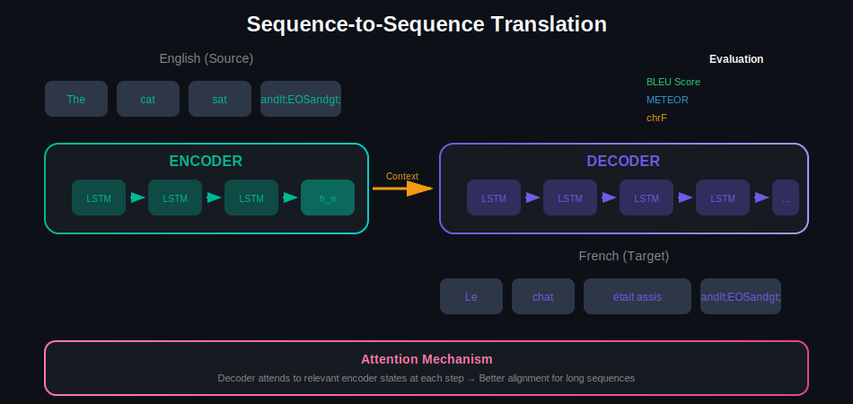
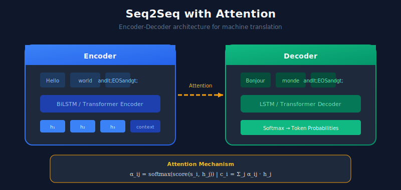
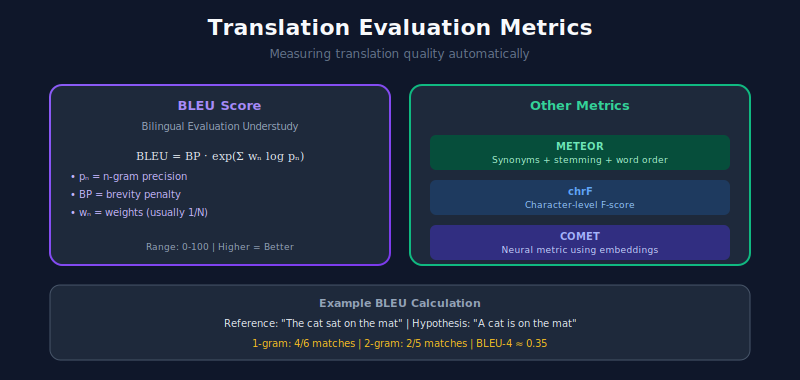

# 🌍 Machine Translation Systems

> Building systems that translate text between languages using neural networks

---

## 📊 Visual Overview

### Seq2Seq Architecture


---

## 🎯 What is Machine Translation?

Machine Translation (MT) automatically converts text from one language to another.


---

## 🏗️ MT Architecture Evolution



---

## 1️⃣ Sequence-to-Sequence with Attention



### Implementation

```python
import torch
import torch.nn as nn
import torch.nn.functional as F
from typing import Tuple

class Encoder(nn.Module):
    """Bidirectional LSTM encoder."""

    def __init__(
        self,
        vocab_size: int,
        embedding_dim: int = 256,
        hidden_dim: int = 512,
        num_layers: int = 2,
        dropout: float = 0.3
    ):
        super().__init__()
        self.embedding = nn.Embedding(vocab_size, embedding_dim)
        self.lstm = nn.LSTM(
            embedding_dim, hidden_dim,
            num_layers=num_layers,
            bidirectional=True,
            dropout=dropout,
            batch_first=True
        )
        self.dropout = nn.Dropout(dropout)

    def forward(self, src: torch.Tensor) -> Tuple[torch.Tensor, Tuple]:
        embedded = self.dropout(self.embedding(src))
        outputs, (hidden, cell) = self.lstm(embedded)
        return outputs, (hidden, cell)

class Attention(nn.Module):
    """Bahdanau attention mechanism."""

    def __init__(self, encoder_dim: int, decoder_dim: int):
        super().__init__()
        self.attn = nn.Linear(encoder_dim + decoder_dim, decoder_dim)
        self.v = nn.Linear(decoder_dim, 1, bias=False)

    def forward(
        self,
        hidden: torch.Tensor,
        encoder_outputs: torch.Tensor
    ) -> torch.Tensor:
        batch_size, src_len, _ = encoder_outputs.shape

        hidden = hidden.unsqueeze(1).repeat(1, src_len, 1)
        energy = torch.tanh(self.attn(
            torch.cat([hidden, encoder_outputs], dim=2)
        ))
        attention = self.v(energy).squeeze(2)

        return F.softmax(attention, dim=1)

class Decoder(nn.Module):
    """LSTM decoder with attention."""

    def __init__(
        self,
        vocab_size: int,
        embedding_dim: int = 256,
        hidden_dim: int = 512,
        encoder_dim: int = 1024,
        num_layers: int = 2,
        dropout: float = 0.3
    ):
        super().__init__()
        self.embedding = nn.Embedding(vocab_size, embedding_dim)
        self.attention = Attention(encoder_dim, hidden_dim)
        self.lstm = nn.LSTM(
            embedding_dim + encoder_dim, hidden_dim,
            num_layers=num_layers,
            dropout=dropout,
            batch_first=True
        )
        self.fc = nn.Linear(hidden_dim + encoder_dim + embedding_dim, vocab_size)
        self.dropout = nn.Dropout(dropout)

    def forward(
        self,
        input: torch.Tensor,
        hidden: Tuple[torch.Tensor, torch.Tensor],
        encoder_outputs: torch.Tensor
    ):
        embedded = self.dropout(self.embedding(input.unsqueeze(1)))

        attn_weights = self.attention(hidden[0][-1], encoder_outputs)
        context = torch.bmm(attn_weights.unsqueeze(1), encoder_outputs)

        lstm_input = torch.cat([embedded, context], dim=2)
        output, hidden = self.lstm(lstm_input, hidden)

        prediction = self.fc(torch.cat([
            output.squeeze(1), context.squeeze(1), embedded.squeeze(1)
        ], dim=1))

        return prediction, hidden, attn_weights

class Seq2SeqMT(nn.Module):
    """Complete Seq2Seq translation model."""

    def __init__(
        self,
        src_vocab_size: int,
        tgt_vocab_size: int,
        embedding_dim: int = 256,
        hidden_dim: int = 512
    ):
        super().__init__()
        self.encoder = Encoder(src_vocab_size, embedding_dim, hidden_dim)
        self.decoder = Decoder(
            tgt_vocab_size, embedding_dim, hidden_dim,
            encoder_dim=hidden_dim * 2
        )

    def forward(
        self,
        src: torch.Tensor,
        tgt: torch.Tensor,
        teacher_forcing_ratio: float = 0.5
    ):
        batch_size, tgt_len = tgt.shape
        tgt_vocab_size = self.decoder.fc.out_features

        outputs = torch.zeros(batch_size, tgt_len, tgt_vocab_size)
        encoder_outputs, hidden = self.encoder(src)

        # Combine bidirectional hidden states
        hidden = (
            hidden[0].view(2, 2, batch_size, -1).mean(1),
            hidden[1].view(2, 2, batch_size, -1).mean(1)
        )

        input = tgt[:, 0]  # <sos> token

        for t in range(1, tgt_len):
            output, hidden, _ = self.decoder(input, hidden, encoder_outputs)
            outputs[:, t] = output

            teacher_force = torch.rand(1).item() < teacher_forcing_ratio
            input = tgt[:, t] if teacher_force else output.argmax(1)

        return outputs

```

---

## 2️⃣ Transformer Translation

```python
import torch
import torch.nn as nn
import math

class TransformerMT(nn.Module):
    """Transformer-based machine translation."""

    def __init__(
        self,
        src_vocab_size: int,
        tgt_vocab_size: int,
        d_model: int = 512,
        nhead: int = 8,
        num_encoder_layers: int = 6,
        num_decoder_layers: int = 6,
        dim_feedforward: int = 2048,
        dropout: float = 0.1,
        max_len: int = 512
    ):
        super().__init__()

        self.src_embedding = nn.Embedding(src_vocab_size, d_model)
        self.tgt_embedding = nn.Embedding(tgt_vocab_size, d_model)
        self.pos_encoding = self._create_positional_encoding(max_len, d_model)

        self.transformer = nn.Transformer(
            d_model=d_model,
            nhead=nhead,
            num_encoder_layers=num_encoder_layers,
            num_decoder_layers=num_decoder_layers,
            dim_feedforward=dim_feedforward,
            dropout=dropout,
            batch_first=True
        )

        self.fc_out = nn.Linear(d_model, tgt_vocab_size)
        self.dropout = nn.Dropout(dropout)
        self.d_model = d_model

    def _create_positional_encoding(self, max_len, d_model):
        pe = torch.zeros(max_len, d_model)
        position = torch.arange(0, max_len).unsqueeze(1).float()
        div_term = torch.exp(
            torch.arange(0, d_model, 2).float() *
            (-math.log(10000.0) / d_model)
        )
        pe[:, 0::2] = torch.sin(position * div_term)
        pe[:, 1::2] = torch.cos(position * div_term)
        return pe.unsqueeze(0)

    def forward(
        self,
        src: torch.Tensor,
        tgt: torch.Tensor,
        src_mask: torch.Tensor = None,
        tgt_mask: torch.Tensor = None
    ):
        src_emb = self.src_embedding(src) * math.sqrt(self.d_model)
        src_emb = src_emb + self.pos_encoding[:, :src.size(1)].to(src.device)
        src_emb = self.dropout(src_emb)

        tgt_emb = self.tgt_embedding(tgt) * math.sqrt(self.d_model)
        tgt_emb = tgt_emb + self.pos_encoding[:, :tgt.size(1)].to(tgt.device)
        tgt_emb = self.dropout(tgt_emb)

        if tgt_mask is None:
            tgt_mask = self.transformer.generate_square_subsequent_mask(
                tgt.size(1)
            ).to(tgt.device)

        output = self.transformer(src_emb, tgt_emb, tgt_mask=tgt_mask)
        return self.fc_out(output)

    @torch.no_grad()
    def translate(
        self,
        src: torch.Tensor,
        max_len: int = 100,
        sos_token: int = 1,
        eos_token: int = 2
    ) -> torch.Tensor:
        """Greedy decoding for translation."""
        self.eval()

        src_emb = self.src_embedding(src) * math.sqrt(self.d_model)
        src_emb = src_emb + self.pos_encoding[:, :src.size(1)].to(src.device)

        memory = self.transformer.encoder(src_emb)

        tgt = torch.tensor([[sos_token]]).to(src.device)

        for _ in range(max_len):
            tgt_emb = self.tgt_embedding(tgt) * math.sqrt(self.d_model)
            tgt_emb = tgt_emb + self.pos_encoding[:, :tgt.size(1)].to(src.device)

            tgt_mask = self.transformer.generate_square_subsequent_mask(
                tgt.size(1)
            ).to(src.device)

            output = self.transformer.decoder(tgt_emb, memory, tgt_mask)
            next_token = self.fc_out(output[:, -1]).argmax(dim=-1, keepdim=True)

            tgt = torch.cat([tgt, next_token], dim=1)

            if next_token.item() == eos_token:
                break

        return tgt

```

---

## 3️⃣ Using Pre-trained Models

```python
from transformers import MarianMTModel, MarianTokenizer
from typing import List

class TranslationService:
    """Translation service using Hugging Face models."""

    def __init__(self, src_lang: str = "en", tgt_lang: str = "fr"):
        model_name = f"Helsinki-NLP/opus-mt-{src_lang}-{tgt_lang}"
        self.tokenizer = MarianTokenizer.from_pretrained(model_name)
        self.model = MarianMTModel.from_pretrained(model_name)

    def translate(
        self,
        texts: List[str],
        max_length: int = 512
    ) -> List[str]:
        """Translate a batch of texts."""
        inputs = self.tokenizer(
            texts, return_tensors="pt",
            padding=True, truncation=True,
            max_length=max_length
        )

        outputs = self.model.generate(
            **inputs,
            max_length=max_length,
            num_beams=4,
            early_stopping=True
        )

        return self.tokenizer.batch_decode(outputs, skip_special_tokens=True)

# Usage
translator = TranslationService("en", "fr")
result = translator.translate(["Hello, how are you?"])
print(result)  # ["Bonjour, comment allez-vous?"]

```

---

## 📊 Evaluation Metrics

| Metric | Description |
|--------|-------------|
| **BLEU** | N-gram overlap with reference |
| **METEOR** | Alignment-based, includes synonyms |
| **TER** | Edit distance to reference |
| **chrF** | Character n-gram F-score |
| **COMET** | Neural-based quality estimation |

```python
from sacrebleu import corpus_bleu

def evaluate_translation(hypotheses: List[str], references: List[str]):
    """Evaluate translation quality."""
    bleu = corpus_bleu(hypotheses, [references])
    return {'bleu': bleu.score, 'signature': bleu.get_signature()}

```

---

## 🔗 Related Topics

- [Language Models](../03_language_models/) - Transformer architecture
- [Text Generation](../08_text_generation/) - Generation techniques
- [LLM Systems](../10_llm_systems/) - LLMs for translation

---

## 📚 References

1. [Attention Is All You Need](https://arxiv.org/abs/1706.03762)
2. [Neural Machine Translation](https://arxiv.org/abs/1409.0473)
3. [OPUS-MT Models](https://github.com/Helsinki-NLP/Opus-MT)

---

<div align="center">

**[⬆ Back to Top](#)** | **[📚 Main Repository](https://github.com/Gaurav14cs17/ml_system_design)**

Made with 💜 by [Gaurav14cs17](https://github.com/Gaurav14cs17)

</div>
