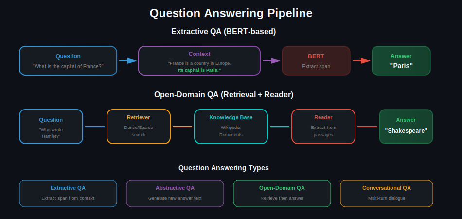
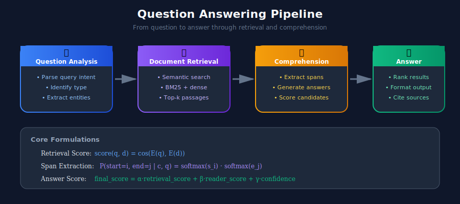

# ❓ Question Answering Systems

> Building systems that understand questions and extract or generate accurate answers

---

## 📊 Visual Overview

### QA Pipeline


---

## 🎯 What is Question Answering?

QA systems automatically answer questions posed in natural language using knowledge sources.


---

## 🏗️ QA System Architecture



---

## 1️⃣ Extractive QA with BERT

```python
import torch
import torch.nn as nn
from transformers import BertTokenizer, BertModel
from typing import Dict, List, Tuple

class ExtractiveQA(nn.Module):
    """BERT-based extractive question answering."""

    def __init__(self, model_name: str = "bert-base-uncased"):
        super().__init__()
        self.bert = BertModel.from_pretrained(model_name)
        self.qa_outputs = nn.Linear(self.bert.config.hidden_size, 2)

    def forward(
        self,
        input_ids: torch.Tensor,
        attention_mask: torch.Tensor,
        token_type_ids: torch.Tensor
    ) -> Tuple[torch.Tensor, torch.Tensor]:
        outputs = self.bert(
            input_ids=input_ids,
            attention_mask=attention_mask,
            token_type_ids=token_type_ids
        )

        sequence_output = outputs.last_hidden_state
        logits = self.qa_outputs(sequence_output)

        start_logits, end_logits = logits.split(1, dim=-1)
        return start_logits.squeeze(-1), end_logits.squeeze(-1)

class QASystem:
    """Complete QA system with preprocessing and postprocessing."""

    def __init__(self, model_name: str = "bert-base-uncased"):
        self.device = torch.device("cuda" if torch.cuda.is_available() else "cpu")
        self.tokenizer = BertTokenizer.from_pretrained(model_name)
        self.model = ExtractiveQA(model_name).to(self.device)
        self.max_length = 384
        self.doc_stride = 128

    def answer(
        self,
        question: str,
        context: str,
        n_best: int = 5
    ) -> List[Dict]:
        """Get top-n answers for a question."""
        # Tokenize
        encoding = self.tokenizer(
            question,
            context,
            max_length=self.max_length,
            truncation="only_second",
            stride=self.doc_stride,
            return_overflowing_tokens=True,
            return_offsets_mapping=True,
            padding="max_length",
            return_tensors="pt"
        )

        # Get predictions
        self.model.eval()
        with torch.no_grad():
            input_ids = encoding["input_ids"].to(self.device)
            attention_mask = encoding["attention_mask"].to(self.device)
            token_type_ids = encoding["token_type_ids"].to(self.device)

            start_logits, end_logits = self.model(
                input_ids, attention_mask, token_type_ids
            )

        # Process predictions
        answers = []
        offset_mapping = encoding["offset_mapping"][0].tolist()

        for start_idx in torch.topk(start_logits[0], n_best).indices:
            for end_idx in torch.topk(end_logits[0], n_best).indices:
                if end_idx >= start_idx and end_idx - start_idx < 30:
                    start_char = offset_mapping[start_idx][0]
                    end_char = offset_mapping[end_idx][1]

                    score = (start_logits[0][start_idx] +
                            end_logits[0][end_idx]).item()

                    answers.append({
                        "text": context[start_char:end_char],
                        "score": score,
                        "start": start_char,
                        "end": end_char
                    })

        # Sort by score
        answers = sorted(answers, key=lambda x: x["score"], reverse=True)
        return answers[:n_best]

# Usage
qa = QASystem()

context = """
The Eiffel Tower is a wrought-iron lattice tower on the Champ de Mars
in Paris, France. It is named after the engineer Gustave Eiffel, whose
company designed and built the tower. Constructed from 1887 to 1889,
it was initially criticized by some of France's leading artists and
intellectuals. It is 330 meters tall.
"""

question = "How tall is the Eiffel Tower?"
answers = qa.answer(question, context)
print(f"Answer: {answers[0]['text']}")  # "330 meters"
```

---

## 2️⃣ Using Hugging Face Pipeline

```python
from transformers import pipeline
from typing import List, Dict

class SimpleQA:
    """Simple QA using Hugging Face pipeline."""

    def __init__(self, model_name: str = "deepset/roberta-base-squad2"):
        self.qa_pipeline = pipeline(
            "question-answering",
            model=model_name,
            device=0 if torch.cuda.is_available() else -1
        )

    def answer(
        self,
        question: str,
        context: str,
        top_k: int = 3
    ) -> List[Dict]:
        """Get answers with confidence scores."""
        results = self.qa_pipeline(
            question=question,
            context=context,
            top_k=top_k,
            handle_impossible_answer=True
        )

        if isinstance(results, dict):
            results = [results]

        return [
            {
                "answer": r["answer"],
                "confidence": r["score"],
                "start": r["start"],
                "end": r["end"]
            }
            for r in results
        ]

    def batch_answer(
        self,
        questions: List[str],
        contexts: List[str]
    ) -> List[Dict]:
        """Answer multiple questions in batch."""
        inputs = [
            {"question": q, "context": c}
            for q, c in zip(questions, contexts)
        ]
        return self.qa_pipeline(inputs)

# Usage
qa = SimpleQA()
answer = qa.answer(
    question="What is the capital of France?",
    context="France is a country in Europe. Its capital is Paris."
)
print(answer)
```

---

## 3️⃣ Open-Domain QA with Retrieval

```python
from sentence_transformers import SentenceTransformer
import numpy as np
from typing import List, Dict, Tuple

class OpenDomainQA:
    """
    Open-domain QA with dense retrieval.
    Retrieves relevant passages, then extracts answers.
    """

    def __init__(
        self,
        retriever_model: str = "sentence-transformers/all-MiniLM-L6-v2",
        reader_model: str = "deepset/roberta-base-squad2"
    ):
        self.retriever = SentenceTransformer(retriever_model)
        self.reader = pipeline("question-answering", model=reader_model)

        self.documents = []
        self.doc_embeddings = None

    def index_documents(self, documents: List[str]):
        """Index documents for retrieval."""
        self.documents = documents
        self.doc_embeddings = self.retriever.encode(
            documents,
            show_progress_bar=True,
            convert_to_numpy=True
        )
        # Normalize for cosine similarity
        self.doc_embeddings = self.doc_embeddings / np.linalg.norm(
            self.doc_embeddings, axis=1, keepdims=True
        )

    def retrieve(
        self,
        question: str,
        top_k: int = 5
    ) -> List[Tuple[str, float]]:
        """Retrieve relevant documents for a question."""
        q_embedding = self.retriever.encode([question])
        q_embedding = q_embedding / np.linalg.norm(q_embedding)

        scores = np.dot(self.doc_embeddings, q_embedding.T).squeeze()
        top_indices = np.argsort(scores)[::-1][:top_k]

        return [
            (self.documents[idx], float(scores[idx]))
            for idx in top_indices
        ]

    def answer(
        self,
        question: str,
        top_k_docs: int = 3,
        top_k_answers: int = 3
    ) -> List[Dict]:
        """Full pipeline: retrieve, then read."""
        # Retrieve relevant documents
        retrieved = self.retrieve(question, top_k=top_k_docs)

        # Extract answers from each document
        all_answers = []
        for doc, retrieval_score in retrieved:
            try:
                answers = self.reader(
                    question=question,
                    context=doc,
                    top_k=top_k_answers
                )

                if isinstance(answers, dict):
                    answers = [answers]

                for ans in answers:
                    all_answers.append({
                        "answer": ans["answer"],
                        "reader_score": ans["score"],
                        "retrieval_score": retrieval_score,
                        "combined_score": ans["score"] * retrieval_score,
                        "source": doc[:100] + "..."
                    })
            except Exception:
                continue

        # Sort by combined score
        all_answers = sorted(
            all_answers,
            key=lambda x: x["combined_score"],
            reverse=True
        )

        return all_answers[:top_k_answers]

# Usage
qa = OpenDomainQA()

# Index knowledge base
documents = [
    "The Eiffel Tower is in Paris, France. It is 330 meters tall.",
    "The Great Wall of China is over 20,000 km long.",
    "Mount Everest is the tallest mountain at 8,849 meters.",
    "The Amazon River is the largest river by volume."
]
qa.index_documents(documents)

# Answer questions
answer = qa.answer("How tall is the Eiffel Tower?")
print(f"Answer: {answer[0]['answer']}")
```

---

## 4️⃣ Generative QA with LLMs

```python
from transformers import T5ForConditionalGeneration, T5Tokenizer

class GenerativeQA:
    """Generative QA using T5."""

    def __init__(self, model_name: str = "google/flan-t5-base"):
        self.tokenizer = T5Tokenizer.from_pretrained(model_name)
        self.model = T5ForConditionalGeneration.from_pretrained(model_name)

    def answer(
        self,
        question: str,
        context: str = None,
        max_length: int = 100
    ) -> str:
        """Generate an answer."""
        if context:
            prompt = f"Answer the question based on the context.\n\nContext: {context}\n\nQuestion: {question}\n\nAnswer:"
        else:
            prompt = f"Answer the question.\n\nQuestion: {question}\n\nAnswer:"

        inputs = self.tokenizer(prompt, return_tensors="pt", truncation=True)

        outputs = self.model.generate(
            **inputs,
            max_length=max_length,
            num_beams=4,
            early_stopping=True
        )

        return self.tokenizer.decode(outputs[0], skip_special_tokens=True)

# Usage
gen_qa = GenerativeQA()
answer = gen_qa.answer(
    question="Explain how photosynthesis works",
    context="Photosynthesis is the process by which plants convert sunlight into energy..."
)
```

---

## 📊 Evaluation Metrics

| Metric | Description | Formula |
|--------|-------------|---------|
| **Exact Match (EM)** | Strict equality | 1 if exact match, 0 otherwise |
| **F1 Score** | Token overlap | 2×P×R / (P+R) |
| **ROUGE-L** | Longest common subsequence | For abstractive QA |

```python
from collections import Counter

def compute_f1(prediction: str, ground_truth: str) -> float:
    """Compute F1 score between prediction and ground truth."""
    pred_tokens = prediction.lower().split()
    truth_tokens = ground_truth.lower().split()

    common = Counter(pred_tokens) & Counter(truth_tokens)
    num_same = sum(common.values())

    if len(pred_tokens) == 0 or len(truth_tokens) == 0:
        return int(pred_tokens == truth_tokens)

    precision = num_same / len(pred_tokens)
    recall = num_same / len(truth_tokens)

    if precision + recall == 0:
        return 0.0

    return 2 * precision * recall / (precision + recall)
```

---

## 🔗 Related Topics

- [Language Models](../03_language_models/) - BERT/T5 for QA
- [Search & Retrieval](../09_search_and_retrieval/) - Document retrieval
- [RAG Systems](../11_rag_systems/) - Retrieval-augmented generation

---

## 📚 References

1. [SQuAD Dataset](https://rajpurkar.github.io/SQuAD-explorer/)
2. [BERT for QA](https://arxiv.org/abs/1810.04805)
3. [Dense Passage Retrieval](https://arxiv.org/abs/2004.04906)

---

<div align="center">

**[⬆ Back to Top](#)** | **[📚 Main Repository](https://github.com/Gaurav14cs17/ml_system_design)**

Made with 💜 by [Gaurav14cs17](https://github.com/Gaurav14cs17)

</div>
