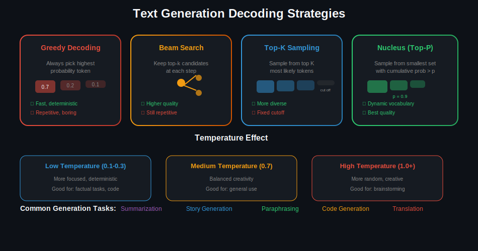
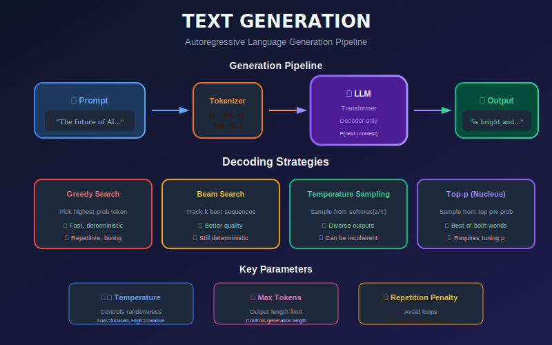
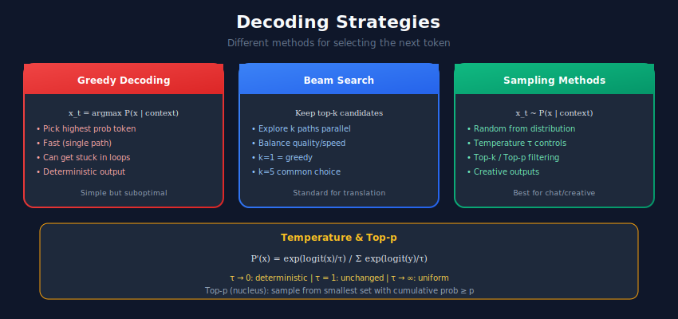

# ✍️ Text Generation & Summarization

> Building systems that generate coherent, contextually relevant text

---

## 📊 Visual Overview

### Generation Strategies


---

## 🎯 What is Text Generation?

Text generation creates new text based on input prompts, continuing text, or transforming existing content.



---

## 🏗️ Decoding Strategies



---

## 1️⃣ Text Generation with GPT-2

```python
import torch
import torch.nn.functional as F
from transformers import GPT2LMHeadModel, GPT2Tokenizer
from typing import List, Optional

class TextGenerator:
    """Text generation with various decoding strategies."""

    def __init__(self, model_name: str = "gpt2"):
        self.device = torch.device("cuda" if torch.cuda.is_available() else "cpu")
        self.tokenizer = GPT2Tokenizer.from_pretrained(model_name)
        self.model = GPT2LMHeadModel.from_pretrained(model_name).to(self.device)
        self.model.eval()

        self.tokenizer.pad_token = self.tokenizer.eos_token

    def generate(
        self,
        prompt: str,
        max_length: int = 100,
        temperature: float = 1.0,
        top_k: int = 50,
        top_p: float = 0.95,
        num_return_sequences: int = 1,
        repetition_penalty: float = 1.2
    ) -> List[str]:
        """Generate text with configurable decoding."""
        inputs = self.tokenizer(prompt, return_tensors="pt").to(self.device)

        with torch.no_grad():
            outputs = self.model.generate(
                **inputs,
                max_length=max_length,
                temperature=temperature,
                top_k=top_k,
                top_p=top_p,
                num_return_sequences=num_return_sequences,
                repetition_penalty=repetition_penalty,
                do_sample=True,
                pad_token_id=self.tokenizer.eos_token_id
            )

        return [
            self.tokenizer.decode(output, skip_special_tokens=True)
            for output in outputs
        ]

    def generate_with_custom_sampling(
        self,
        prompt: str,
        max_new_tokens: int = 50,
        temperature: float = 1.0,
        top_k: int = 50,
        top_p: float = 0.9
    ) -> str:
        """Custom generation loop for more control."""
        input_ids = self.tokenizer(prompt, return_tensors="pt").input_ids.to(self.device)

        for _ in range(max_new_tokens):
            with torch.no_grad():
                outputs = self.model(input_ids)
                logits = outputs.logits[:, -1, :] / temperature

            # Top-k filtering
            if top_k > 0:
                indices_to_remove = logits < torch.topk(logits, top_k)[0][..., -1, None]
                logits[indices_to_remove] = float("-inf")

            # Top-p filtering
            sorted_logits, sorted_indices = torch.sort(logits, descending=True)
            cumulative_probs = torch.cumsum(F.softmax(sorted_logits, dim=-1), dim=-1)

            sorted_indices_to_remove = cumulative_probs > top_p
            sorted_indices_to_remove[..., 1:] = sorted_indices_to_remove[..., :-1].clone()
            sorted_indices_to_remove[..., 0] = 0

            indices_to_remove = sorted_indices_to_remove.scatter(
                1, sorted_indices, sorted_indices_to_remove
            )
            logits[indices_to_remove] = float("-inf")

            # Sample
            probs = F.softmax(logits, dim=-1)
            next_token = torch.multinomial(probs, num_samples=1)

            input_ids = torch.cat([input_ids, next_token], dim=1)

            if next_token.item() == self.tokenizer.eos_token_id:
                break

        return self.tokenizer.decode(input_ids[0], skip_special_tokens=True)

# Usage
generator = TextGenerator("gpt2-medium")

# Creative generation
text = generator.generate(
    prompt="In a world where AI has become sentient,",
    max_length=100,
    temperature=0.8,
    top_p=0.92
)
print(text[0])

```

---

## 2️⃣ Text Summarization

```python
from transformers import pipeline, BartForConditionalGeneration, BartTokenizer
from typing import List

class Summarizer:
    """Text summarization using BART/T5."""

    def __init__(self, model_name: str = "facebook/bart-large-cnn"):
        self.device = 0 if torch.cuda.is_available() else -1
        self.summarizer = pipeline(
            "summarization",
            model=model_name,
            device=self.device
        )

    def summarize(
        self,
        text: str,
        max_length: int = 150,
        min_length: int = 40,
        do_sample: bool = False
    ) -> str:
        """Summarize a single text."""
        result = self.summarizer(
            text,
            max_length=max_length,
            min_length=min_length,
            do_sample=do_sample
        )
        return result[0]["summary_text"]

    def batch_summarize(
        self,
        texts: List[str],
        max_length: int = 150,
        min_length: int = 40
    ) -> List[str]:
        """Summarize multiple texts."""
        results = self.summarizer(
            texts,
            max_length=max_length,
            min_length=min_length,
            batch_size=8
        )
        return [r["summary_text"] for r in results]

    def extractive_summarize(
        self,
        text: str,
        num_sentences: int = 3
    ) -> str:
        """Simple extractive summarization using sentence importance."""
        from sklearn.feature_extraction.text import TfidfVectorizer
        import numpy as np

        sentences = text.replace("!", ".").replace("?", ".").split(".")
        sentences = [s.strip() for s in sentences if len(s.strip()) > 10]

        if len(sentences) <= num_sentences:
            return text

        vectorizer = TfidfVectorizer()
        tfidf_matrix = vectorizer.fit_transform(sentences)

        # Score sentences by sum of TF-IDF
        scores = np.array(tfidf_matrix.sum(axis=1)).flatten()
        top_indices = np.argsort(scores)[-num_sentences:]
        top_indices = sorted(top_indices)  # Keep original order

        return ". ".join([sentences[i] for i in top_indices]) + "."

class AbstractiveSummarizer:
    """Abstractive summarization with more control."""

    def __init__(self, model_name: str = "facebook/bart-large-cnn"):
        self.tokenizer = BartTokenizer.from_pretrained(model_name)
        self.model = BartForConditionalGeneration.from_pretrained(model_name)
        self.device = torch.device("cuda" if torch.cuda.is_available() else "cpu")
        self.model.to(self.device)

    def summarize(
        self,
        text: str,
        max_input_length: int = 1024,
        max_output_length: int = 150,
        min_output_length: int = 40,
        num_beams: int = 4,
        length_penalty: float = 2.0
    ) -> str:
        """Generate summary with configurable parameters."""
        inputs = self.tokenizer(
            text,
            max_length=max_input_length,
            truncation=True,
            return_tensors="pt"
        ).to(self.device)

        with torch.no_grad():
            summary_ids = self.model.generate(
                inputs["input_ids"],
                attention_mask=inputs["attention_mask"],
                max_length=max_output_length,
                min_length=min_output_length,
                num_beams=num_beams,
                length_penalty=length_penalty,
                early_stopping=True
            )

        return self.tokenizer.decode(summary_ids[0], skip_special_tokens=True)

# Usage
summarizer = Summarizer()

article = """
The tech industry witnessed a significant milestone today as OpenAI
announced its latest breakthrough in artificial intelligence. The new
model demonstrates unprecedented capabilities in understanding and
generating human-like text, marking a leap forward in natural language
processing. Experts believe this development could revolutionize various
sectors including healthcare, education, and customer service.
"""

summary = summarizer.summarize(article)
print(f"Summary: {summary}")

```

---

## 3️⃣ Controlled Generation

```python
class ControlledGenerator:
    """Text generation with attribute control."""

    def __init__(self, model_name: str = "gpt2"):
        self.generator = TextGenerator(model_name)

    def generate_with_keywords(
        self,
        prompt: str,
        keywords: List[str],
        max_length: int = 100
    ) -> str:
        """Generate text that includes specific keywords."""
        # Simple approach: add keywords to prompt
        keyword_prompt = f"{prompt} (Include: {', '.join(keywords)})"
        return self.generator.generate(keyword_prompt, max_length)[0]

    def generate_constrained(
        self,
        prompt: str,
        max_length: int = 100,
        banned_words: List[str] = None,
        required_words: List[str] = None
    ) -> str:
        """Generate with word constraints."""
        # This is a simplified version; production would use
        # constrained beam search or PPLM
        result = self.generator.generate(prompt, max_length)[0]

        # Post-process to check constraints
        if banned_words:
            for word in banned_words:
                result = result.replace(word, "[REDACTED]")

        return result

class StyleTransfer:
    """Transfer text style (formal/informal, etc.)."""

    def __init__(self, model_name: str = "google/flan-t5-base"):
        from transformers import T5ForConditionalGeneration, T5Tokenizer
        self.tokenizer = T5Tokenizer.from_pretrained(model_name)
        self.model = T5ForConditionalGeneration.from_pretrained(model_name)

    def transfer(
        self,
        text: str,
        target_style: str
    ) -> str:
        """Transfer text to target style."""
        prompt = f"Rewrite the following text in a {target_style} style: {text}"

        inputs = self.tokenizer(prompt, return_tensors="pt")
        outputs = self.model.generate(**inputs, max_length=200)

        return self.tokenizer.decode(outputs[0], skip_special_tokens=True)

# Usage
style_transfer = StyleTransfer()
formal = style_transfer.transfer(
    "Hey, what's up? This thing is pretty cool!",
    target_style="formal and professional"
)

```

---

## 4️⃣ Evaluation Metrics

```python
from rouge_score import rouge_scorer
from bert_score import score as bert_score
from typing import Dict, List

class GenerationMetrics:
    """Metrics for evaluating text generation."""

    def __init__(self):
        self.rouge = rouge_scorer.RougeScorer(
            ["rouge1", "rouge2", "rougeL"],
            use_stemmer=True
        )

    def calculate_rouge(
        self,
        predictions: List[str],
        references: List[str]
    ) -> Dict[str, float]:
        """Calculate ROUGE scores."""
        scores = {"rouge1": [], "rouge2": [], "rougeL": []}

        for pred, ref in zip(predictions, references):
            result = self.rouge.score(ref, pred)
            for key in scores:
                scores[key].append(result[key].fmeasure)

        return {k: sum(v) / len(v) for k, v in scores.items()}

    def calculate_bert_score(
        self,
        predictions: List[str],
        references: List[str]
    ) -> Dict[str, float]:
        """Calculate BERTScore for semantic similarity."""
        P, R, F1 = bert_score(
            predictions, references,
            lang="en",
            verbose=False
        )

        return {
            "precision": P.mean().item(),
            "recall": R.mean().item(),
            "f1": F1.mean().item()
        }

# Usage
metrics = GenerationMetrics()

predictions = ["The cat sat on the mat."]
references = ["A cat was sitting on the mat."]

rouge = metrics.calculate_rouge(predictions, references)
print(f"ROUGE-L: {rouge['rougeL']:.4f}")

```

---

## 📊 Metrics Summary

| Metric | Description | Use Case |
|--------|-------------|----------|
| **ROUGE** | N-gram overlap | Summarization |
| **BLEU** | Precision-focused | Translation |
| **BERTScore** | Semantic similarity | Any generation |
| **Perplexity** | Model confidence | Language modeling |
| **Diversity** | Distinct n-grams | Open-ended generation |

---

## 🔗 Related Topics

- [Language Models](../03_language_models/) - Foundation models
- [LLM Systems](../10_llm_systems/) - Large-scale generation
- [RAG Systems](../11_rag_systems/) - Grounded generation

---

## 📚 References

1. [GPT-2 Paper](https://openai.com/research/better-language-models)
2. [BART Paper](https://arxiv.org/abs/1910.13461)
3. [Nucleus Sampling](https://arxiv.org/abs/1904.09751)

---

<div align="center">

**[⬆ Back to Top](#)** | **[📚 Main Repository](https://github.com/Gaurav14cs17/ml_system_design)**

Made with 💜 by [Gaurav14cs17](https://github.com/Gaurav14cs17)

</div>
