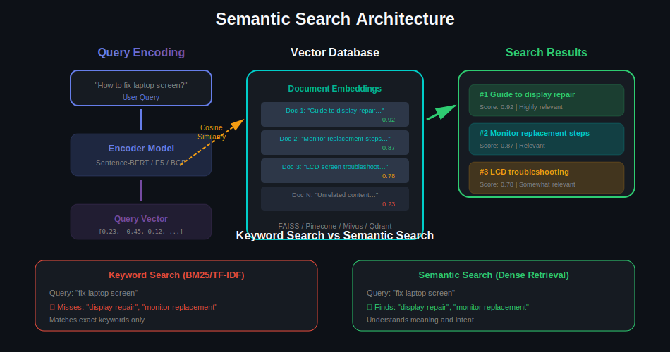
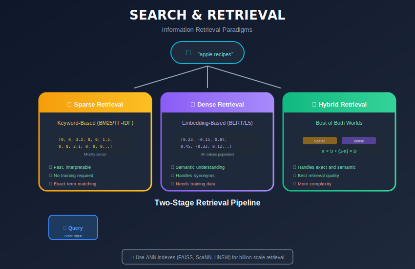
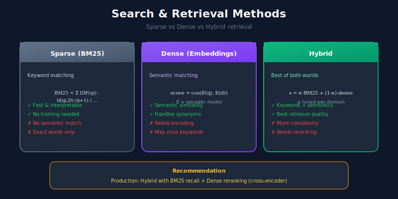

# 🔍 Search & Retrieval Systems

> Building semantic search systems with vector databases and dense retrieval

---

## 📊 Visual Overview

### Semantic Search Architecture


---

## 🎯 What is Semantic Search?

Semantic search finds documents based on **meaning**, not just keyword matching.



---

## 🏗️ Search System Architecture



---

## 1️⃣ Dense Retrieval with Sentence Transformers

```python
from sentence_transformers import SentenceTransformer
import numpy as np
from typing import List, Tuple, Dict

class DenseRetriever:
    """Dense retrieval using sentence embeddings."""

    def __init__(self, model_name: str = "all-MiniLM-L6-v2"):
        self.model = SentenceTransformer(model_name)
        self.documents = []
        self.embeddings = None

    def index(self, documents: List[str], batch_size: int = 32):
        """Index documents by computing embeddings."""
        self.documents = documents
        self.embeddings = self.model.encode(
            documents,
            batch_size=batch_size,
            show_progress_bar=True,
            normalize_embeddings=True
        )

    def search(
        self,
        query: str,
        top_k: int = 10
    ) -> List[Tuple[str, float]]:
        """Search for relevant documents."""
        query_embedding = self.model.encode(
            [query],
            normalize_embeddings=True
        )

        # Cosine similarity (embeddings are normalized)
        scores = np.dot(self.embeddings, query_embedding.T).flatten()
        top_indices = np.argsort(scores)[::-1][:top_k]

        return [
            (self.documents[idx], float(scores[idx]))
            for idx in top_indices
        ]

    def batch_search(
        self,
        queries: List[str],
        top_k: int = 10
    ) -> List[List[Tuple[str, float]]]:
        """Search multiple queries at once."""
        query_embeddings = self.model.encode(
            queries,
            normalize_embeddings=True
        )

        scores = np.dot(query_embeddings, self.embeddings.T)

        results = []
        for query_scores in scores:
            top_indices = np.argsort(query_scores)[::-1][:top_k]
            results.append([
                (self.documents[idx], float(query_scores[idx]))
                for idx in top_indices
            ])

        return results

# Usage
retriever = DenseRetriever()

documents = [
    "Machine learning is a subset of artificial intelligence",
    "Python is a popular programming language",
    "Neural networks are inspired by biological brains",
    "Data science involves analyzing large datasets"
]

retriever.index(documents)
results = retriever.search("What is AI?", top_k=2)

for doc, score in results:
    print(f"Score: {score:.3f} | {doc}")

```

---

## 2️⃣ Vector Databases

### Using FAISS

```python
import faiss
import numpy as np
from sentence_transformers import SentenceTransformer
from typing import List, Tuple

class FAISSVectorStore:
    """Vector store using Facebook's FAISS library."""

    def __init__(
        self,
        embedding_model: str = "all-MiniLM-L6-v2",
        index_type: str = "flat"
    ):
        self.encoder = SentenceTransformer(embedding_model)
        self.dimension = self.encoder.get_sentence_embedding_dimension()
        self.index_type = index_type
        self.index = None
        self.documents = []

    def _create_index(self, n_docs: int):
        """Create FAISS index."""
        if self.index_type == "flat":
            # Exact search (brute force)
            self.index = faiss.IndexFlatIP(self.dimension)

        elif self.index_type == "ivf":
            # Approximate search with inverted file
            n_clusters = min(n_docs, 100)
            quantizer = faiss.IndexFlatIP(self.dimension)
            self.index = faiss.IndexIVFFlat(
                quantizer, self.dimension, n_clusters
            )

        elif self.index_type == "hnsw":
            # Approximate search with HNSW
            self.index = faiss.IndexHNSWFlat(self.dimension, 32)

    def add(self, documents: List[str], batch_size: int = 32):
        """Add documents to the index."""
        self.documents.extend(documents)

        embeddings = self.encoder.encode(
            documents,
            batch_size=batch_size,
            normalize_embeddings=True,
            show_progress_bar=True
        ).astype("float32")

        if self.index is None:
            self._create_index(len(documents))

            if self.index_type == "ivf":
                self.index.train(embeddings)

        self.index.add(embeddings)

    def search(
        self,
        query: str,
        top_k: int = 10
    ) -> List[Tuple[str, float]]:
        """Search the index."""
        query_embedding = self.encoder.encode(
            [query],
            normalize_embeddings=True
        ).astype("float32")

        scores, indices = self.index.search(query_embedding, top_k)

        return [
            (self.documents[idx], float(score))
            for idx, score in zip(indices[0], scores[0])
            if idx != -1
        ]

    def save(self, path: str):
        """Save index to disk."""
        faiss.write_index(self.index, f"{path}.index")
        with open(f"{path}.docs", "w") as f:
            for doc in self.documents:
                f.write(doc + "\n")

    def load(self, path: str):
        """Load index from disk."""
        self.index = faiss.read_index(f"{path}.index")
        with open(f"{path}.docs", "r") as f:
            self.documents = [line.strip() for line in f]

# Usage
vector_store = FAISSVectorStore(index_type="flat")
vector_store.add(documents)
results = vector_store.search("What is machine learning?")

```

### Using Pinecone

```python
import pinecone
from sentence_transformers import SentenceTransformer
from typing import List, Dict

class PineconeVectorStore:
    """Vector store using Pinecone (managed service)."""

    def __init__(
        self,
        api_key: str,
        index_name: str,
        embedding_model: str = "all-MiniLM-L6-v2"
    ):
        pinecone.init(api_key=api_key)
        self.encoder = SentenceTransformer(embedding_model)
        self.index_name = index_name

        # Create index if not exists
        if index_name not in pinecone.list_indexes():
            pinecone.create_index(
                name=index_name,
                dimension=self.encoder.get_sentence_embedding_dimension(),
                metric="cosine"
            )

        self.index = pinecone.Index(index_name)

    def upsert(
        self,
        documents: List[str],
        ids: List[str] = None,
        metadata: List[Dict] = None,
        batch_size: int = 100
    ):
        """Add or update documents."""
        if ids is None:
            ids = [str(i) for i in range(len(documents))]

        embeddings = self.encoder.encode(
            documents,
            normalize_embeddings=True
        ).tolist()

        vectors = []
        for i, (id_, emb, doc) in enumerate(zip(ids, embeddings, documents)):
            meta = {"text": doc}
            if metadata:
                meta.update(metadata[i])
            vectors.append((id_, emb, meta))

        # Batch upsert
        for i in range(0, len(vectors), batch_size):
            batch = vectors[i:i + batch_size]
            self.index.upsert(vectors=batch)

    def search(
        self,
        query: str,
        top_k: int = 10,
        filter: Dict = None
    ) -> List[Dict]:
        """Search with optional filtering."""
        query_embedding = self.encoder.encode(
            [query],
            normalize_embeddings=True
        ).tolist()[0]

        results = self.index.query(
            vector=query_embedding,
            top_k=top_k,
            include_metadata=True,
            filter=filter
        )

        return [
            {
                "id": match.id,
                "score": match.score,
                "text": match.metadata.get("text", ""),
                "metadata": match.metadata
            }
            for match in results.matches
        ]

```

---

## 3️⃣ Hybrid Search

```python
from rank_bm25 import BM25Okapi
from sentence_transformers import SentenceTransformer
import numpy as np
from typing import List, Tuple

class HybridSearch:
    """Combine BM25 (sparse) with dense retrieval."""

    def __init__(
        self,
        embedding_model: str = "all-MiniLM-L6-v2",
        alpha: float = 0.5  # Weight for dense vs sparse
    ):
        self.encoder = SentenceTransformer(embedding_model)
        self.alpha = alpha
        self.documents = []
        self.bm25 = None
        self.embeddings = None

    def index(self, documents: List[str]):
        """Index documents for both sparse and dense search."""
        self.documents = documents

        # BM25 (sparse)
        tokenized = [doc.lower().split() for doc in documents]
        self.bm25 = BM25Okapi(tokenized)

        # Dense embeddings
        self.embeddings = self.encoder.encode(
            documents,
            normalize_embeddings=True
        )

    def search(
        self,
        query: str,
        top_k: int = 10
    ) -> List[Tuple[str, float]]:
        """Hybrid search combining BM25 and dense."""
        # BM25 scores
        tokenized_query = query.lower().split()
        bm25_scores = self.bm25.get_scores(tokenized_query)

        # Normalize BM25 scores
        if bm25_scores.max() > 0:
            bm25_scores = bm25_scores / bm25_scores.max()

        # Dense scores
        query_embedding = self.encoder.encode(
            [query],
            normalize_embeddings=True
        )
        dense_scores = np.dot(self.embeddings, query_embedding.T).flatten()

        # Normalize dense scores
        dense_scores = (dense_scores - dense_scores.min()) / (
            dense_scores.max() - dense_scores.min() + 1e-8
        )

        # Combine scores
        combined_scores = (
            self.alpha * dense_scores +
            (1 - self.alpha) * bm25_scores
        )

        top_indices = np.argsort(combined_scores)[::-1][:top_k]

        return [
            (self.documents[idx], float(combined_scores[idx]))
            for idx in top_indices
        ]

# Usage
hybrid = HybridSearch(alpha=0.7)  # 70% dense, 30% BM25
hybrid.index(documents)
results = hybrid.search("machine learning algorithms")

```

---

## 4️⃣ Reranking

```python
from sentence_transformers import CrossEncoder
from typing import List, Tuple

class Reranker:
    """Rerank search results using cross-encoder."""

    def __init__(self, model_name: str = "cross-encoder/ms-marco-MiniLM-L-6-v2"):
        self.model = CrossEncoder(model_name)

    def rerank(
        self,
        query: str,
        documents: List[str],
        top_k: int = None
    ) -> List[Tuple[str, float]]:
        """Rerank documents for a query."""
        pairs = [[query, doc] for doc in documents]
        scores = self.model.predict(pairs)

        ranked = sorted(
            zip(documents, scores),
            key=lambda x: x[1],
            reverse=True
        )

        if top_k:
            ranked = ranked[:top_k]

        return ranked

class TwoStageRetriever:
    """Two-stage retrieval: fast retrieval + reranking."""

    def __init__(self):
        self.retriever = DenseRetriever()
        self.reranker = Reranker()

    def index(self, documents: List[str]):
        self.retriever.index(documents)

    def search(
        self,
        query: str,
        retrieve_k: int = 100,
        rerank_k: int = 10
    ) -> List[Tuple[str, float]]:
        """Retrieve then rerank."""
        # First stage: fast retrieval
        candidates = self.retriever.search(query, top_k=retrieve_k)

        # Second stage: rerank
        docs = [doc for doc, _ in candidates]
        reranked = self.reranker.rerank(query, docs, top_k=rerank_k)

        return reranked

```

---

## 📊 Metrics

| Metric | Description |
|--------|-------------|
| **MRR** | Mean Reciprocal Rank |
| **nDCG** | Normalized Discounted Cumulative Gain |
| **Recall@K** | Relevant docs in top K |
| **Precision@K** | Precision at K |

---

## 🔗 Related Topics

- [Embeddings](../02_embeddings/) - Vector representations
- [RAG Systems](../11_rag_systems/) - Retrieval + Generation
- [Question Answering](../07_question_answering/) - Using retrieval for QA

---

## 📚 References

1. [Dense Passage Retrieval](https://arxiv.org/abs/2004.04906)
2. [FAISS Library](https://github.com/facebookresearch/faiss)
3. [Sentence Transformers](https://www.sbert.net/)

---

<div align="center">

**[⬆ Back to Top](#)** | **[📚 Main Repository](https://github.com/Gaurav14cs17/ml_system_design)**

Made with 💜 by [Gaurav14cs17](https://github.com/Gaurav14cs17)

</div>
