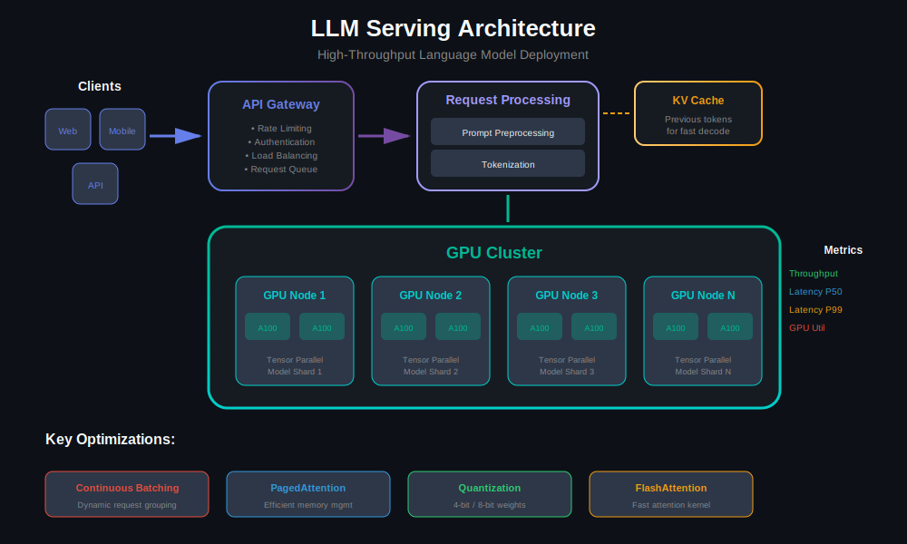
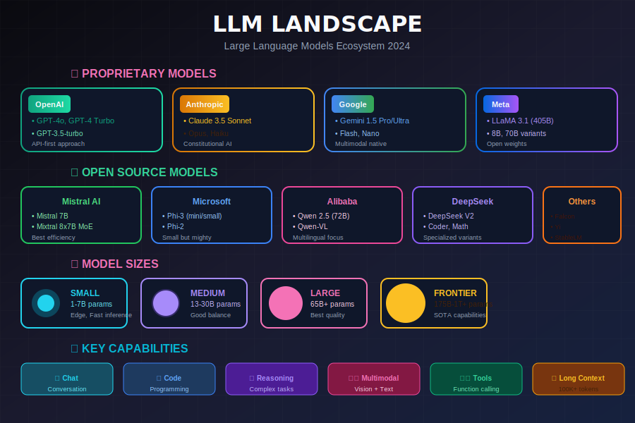
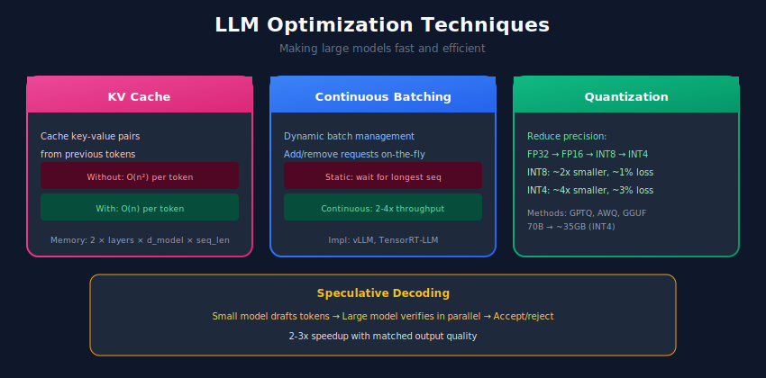

# 🤖 Large Language Model (LLM) Systems

> Building, fine-tuning, and deploying large language models at scale

---

## 📊 Visual Overview

### LLM Serving Architecture


---

## 🎯 What are LLM Systems?

LLM systems are production infrastructure for deploying and serving large language models.



---

## 🏗️ LLM System Architecture



---

## 1️⃣ Using OpenAI API

```python
from openai import OpenAI
from typing import List, Dict, Optional
import tiktoken

class OpenAIClient:
    """Client for OpenAI API with best practices."""

    def __init__(self, api_key: str, model: str = "gpt-4"):
        self.client = OpenAI(api_key=api_key)
        self.model = model
        self.encoding = tiktoken.encoding_for_model(model)

    def count_tokens(self, text: str) -> int:
        """Count tokens in text."""
        return len(self.encoding.encode(text))

    def chat(
        self,
        messages: List[Dict[str, str]],
        temperature: float = 0.7,
        max_tokens: int = 1000,
        stream: bool = False
    ):
        """Send chat completion request."""
        response = self.client.chat.completions.create(
            model=self.model,
            messages=messages,
            temperature=temperature,
            max_tokens=max_tokens,
            stream=stream
        )

        if stream:
            return self._handle_stream(response)

        return {
            "content": response.choices[0].message.content,
            "usage": {
                "prompt_tokens": response.usage.prompt_tokens,
                "completion_tokens": response.usage.completion_tokens,
                "total_tokens": response.usage.total_tokens
            }
        }

    def _handle_stream(self, response):
        """Handle streaming response."""
        for chunk in response:
            if chunk.choices[0].delta.content:
                yield chunk.choices[0].delta.content

    def with_system_prompt(
        self,
        user_message: str,
        system_prompt: str = "You are a helpful assistant."
    ) -> str:
        """Simple completion with system prompt."""
        messages = [
            {"role": "system", "content": system_prompt},
            {"role": "user", "content": user_message}
        ]
        return self.chat(messages)["content"]

# Usage
client = OpenAIClient(api_key="your-key", model="gpt-4")
response = client.with_system_prompt(
    user_message="Explain quantum computing in simple terms",
    system_prompt="You are a physics teacher explaining to high school students."
)

```

---

## 2️⃣ Local LLM with Hugging Face

```python
import torch
from transformers import (
    AutoModelForCausalLM,
    AutoTokenizer,
    pipeline,
    BitsAndBytesConfig
)
from typing import List, Dict

class LocalLLM:
    """Run LLMs locally with optimizations."""

    def __init__(
        self,
        model_name: str = "mistralai/Mistral-7B-Instruct-v0.2",
        quantization: str = None,  # "4bit", "8bit", or None
        device_map: str = "auto"
    ):
        self.device = torch.device("cuda" if torch.cuda.is_available() else "cpu")

        # Quantization config
        bnb_config = None
        if quantization == "4bit":
            bnb_config = BitsAndBytesConfig(
                load_in_4bit=True,
                bnb_4bit_quant_type="nf4",
                bnb_4bit_compute_dtype=torch.float16
            )
        elif quantization == "8bit":
            bnb_config = BitsAndBytesConfig(load_in_8bit=True)

        # Load model
        self.tokenizer = AutoTokenizer.from_pretrained(model_name)
        self.model = AutoModelForCausalLM.from_pretrained(
            model_name,
            quantization_config=bnb_config,
            device_map=device_map,
            torch_dtype=torch.float16
        )

        if self.tokenizer.pad_token is None:
            self.tokenizer.pad_token = self.tokenizer.eos_token

    def generate(
        self,
        prompt: str,
        max_new_tokens: int = 256,
        temperature: float = 0.7,
        top_p: float = 0.9,
        do_sample: bool = True
    ) -> str:
        """Generate text from prompt."""
        inputs = self.tokenizer(prompt, return_tensors="pt").to(self.device)

        with torch.no_grad():
            outputs = self.model.generate(
                **inputs,
                max_new_tokens=max_new_tokens,
                temperature=temperature,
                top_p=top_p,
                do_sample=do_sample,
                pad_token_id=self.tokenizer.pad_token_id
            )

        return self.tokenizer.decode(outputs[0], skip_special_tokens=True)

    def chat(
        self,
        messages: List[Dict[str, str]],
        **kwargs
    ) -> str:
        """Chat completion format."""
        # Format messages for instruction models
        prompt = ""
        for msg in messages:
            role = msg["role"]
            content = msg["content"]
            if role == "system":
                prompt += f"<s>[INST] {content} [/INST]</s>"
            elif role == "user":
                prompt += f"<s>[INST] {content} [/INST]"
            elif role == "assistant":
                prompt += f"{content}</s>"

        return self.generate(prompt, **kwargs)

# Usage
llm = LocalLLM(
    model_name="mistralai/Mistral-7B-Instruct-v0.2",
    quantization="4bit"
)

response = llm.chat([
    {"role": "user", "content": "What is machine learning?"}
])

```

---

## 3️⃣ High-Performance Serving with vLLM

```python
from vllm import LLM, SamplingParams
from typing import List

class VLLMServer:
    """High-throughput LLM serving with vLLM."""

    def __init__(
        self,
        model_name: str = "mistralai/Mistral-7B-Instruct-v0.2",
        tensor_parallel_size: int = 1,
        gpu_memory_utilization: float = 0.9
    ):
        self.llm = LLM(
            model=model_name,
            tensor_parallel_size=tensor_parallel_size,
            gpu_memory_utilization=gpu_memory_utilization
        )

    def generate(
        self,
        prompts: List[str],
        max_tokens: int = 256,
        temperature: float = 0.7,
        top_p: float = 0.9
    ) -> List[str]:
        """Generate completions for multiple prompts."""
        sampling_params = SamplingParams(
            max_tokens=max_tokens,
            temperature=temperature,
            top_p=top_p
        )

        outputs = self.llm.generate(prompts, sampling_params)

        return [output.outputs[0].text for output in outputs]

    def batch_generate(
        self,
        prompts: List[str],
        batch_size: int = 32,
        **kwargs
    ) -> List[str]:
        """Process large batches efficiently."""
        results = []
        for i in range(0, len(prompts), batch_size):
            batch = prompts[i:i + batch_size]
            results.extend(self.generate(batch, **kwargs))
        return results

# Usage
server = VLLMServer(
    model_name="mistralai/Mistral-7B-Instruct-v0.2",
    tensor_parallel_size=2  # Use 2 GPUs
)

prompts = ["Explain AI:", "What is Python?", "How does the internet work?"]
responses = server.generate(prompts)

```

---

## 4️⃣ Fine-tuning LLMs

```python
from transformers import (
    AutoModelForCausalLM,
    AutoTokenizer,
    TrainingArguments,
    Trainer
)
from peft import LoraConfig, get_peft_model, TaskType
from datasets import Dataset
from typing import Dict, List

class LLMFineTuner:
    """Fine-tune LLMs with LoRA (Parameter-Efficient Fine-Tuning)."""

    def __init__(
        self,
        model_name: str = "mistralai/Mistral-7B-v0.1",
        lora_r: int = 16,
        lora_alpha: int = 32,
        lora_dropout: float = 0.1
    ):
        self.tokenizer = AutoTokenizer.from_pretrained(model_name)
        self.model = AutoModelForCausalLM.from_pretrained(
            model_name,
            torch_dtype=torch.float16,
            device_map="auto"
        )

        if self.tokenizer.pad_token is None:
            self.tokenizer.pad_token = self.tokenizer.eos_token

        # LoRA config
        lora_config = LoraConfig(
            r=lora_r,
            lora_alpha=lora_alpha,
            lora_dropout=lora_dropout,
            target_modules=["q_proj", "k_proj", "v_proj", "o_proj"],
            task_type=TaskType.CAUSAL_LM
        )

        self.model = get_peft_model(self.model, lora_config)
        self.model.print_trainable_parameters()

    def prepare_dataset(
        self,
        data: List[Dict[str, str]],
        max_length: int = 512
    ) -> Dataset:
        """Prepare dataset for training."""
        def tokenize(example):
            prompt = f"### Instruction:\n{example['instruction']}\n\n### Response:\n{example['response']}"
            return self.tokenizer(
                prompt,
                truncation=True,
                max_length=max_length,
                padding="max_length"
            )

        dataset = Dataset.from_list(data)
        return dataset.map(tokenize, remove_columns=dataset.column_names)

    def train(
        self,
        train_dataset: Dataset,
        output_dir: str = "./lora_model",
        epochs: int = 3,
        batch_size: int = 4,
        learning_rate: float = 2e-4
    ):
        """Train the model."""
        training_args = TrainingArguments(
            output_dir=output_dir,
            num_train_epochs=epochs,
            per_device_train_batch_size=batch_size,
            learning_rate=learning_rate,
            fp16=True,
            logging_steps=10,
            save_strategy="epoch",
            gradient_accumulation_steps=4
        )

        trainer = Trainer(
            model=self.model,
            args=training_args,
            train_dataset=train_dataset,
            data_collator=lambda x: {
                "input_ids": torch.stack([torch.tensor(i["input_ids"]) for i in x]),
                "attention_mask": torch.stack([torch.tensor(i["attention_mask"]) for i in x]),
                "labels": torch.stack([torch.tensor(i["input_ids"]) for i in x])
            }
        )

        trainer.train()
        self.model.save_pretrained(output_dir)

# Usage
fine_tuner = LLMFineTuner()

training_data = [
    {"instruction": "Summarize the text", "response": "..."},
    {"instruction": "Translate to French", "response": "..."}
]

dataset = fine_tuner.prepare_dataset(training_data)
fine_tuner.train(dataset)

```

---

## 5️⃣ Prompt Engineering

```python
from typing import List, Dict

class PromptManager:
    """Manage prompts for LLM applications."""

    def __init__(self):
        self.templates = {}

    def register_template(self, name: str, template: str):
        """Register a prompt template."""
        self.templates[name] = template

    def format(self, name: str, **kwargs) -> str:
        """Format a template with variables."""
        return self.templates[name].format(**kwargs)

    @staticmethod
    def few_shot(
        instruction: str,
        examples: List[Dict[str, str]],
        query: str
    ) -> str:
        """Create few-shot prompt."""
        prompt = f"{instruction}\n\n"

        for ex in examples:
            prompt += f"Input: {ex['input']}\nOutput: {ex['output']}\n\n"

        prompt += f"Input: {query}\nOutput:"
        return prompt

    @staticmethod
    def chain_of_thought(
        question: str,
        examples: List[Dict[str, str]] = None
    ) -> str:
        """Create Chain-of-Thought prompt."""
        prompt = "Let's think step by step.\n\n"

        if examples:
            for ex in examples:
                prompt += f"Q: {ex['question']}\n"
                prompt += f"A: Let's think step by step. {ex['reasoning']}\n"
                prompt += f"Therefore, the answer is {ex['answer']}.\n\n"

        prompt += f"Q: {question}\nA: Let's think step by step."
        return prompt

# Common templates
prompt_manager = PromptManager()

prompt_manager.register_template(
    "classifier",
    """Classify the following text into one of these categories: {categories}

Text: {text}

Category:"""
)

prompt_manager.register_template(
    "summarizer",
    """Summarize the following text in {length} sentences:

{text}

Summary:"""
)

```

---

## 📊 Optimization Techniques

| Technique | Description | Speedup |
|-----------|-------------|---------|
| **Quantization** | 4-bit/8-bit weights | 2-4x memory reduction |
| **KV Cache** | Cache key-value pairs | Faster generation |
| **Batching** | Process multiple requests | Higher throughput |
| **Tensor Parallel** | Shard across GPUs | Scale to larger models |
| **FlashAttention** | Efficient attention | 2-4x faster |

---

## 🔗 Related Topics

- [Language Models](../03_language_models/) - Model architecture

- [RAG Systems](../11_rag_systems/) - LLMs with retrieval

- [Conversational AI](../12_conversational_ai/) - Chatbot systems

---

## 📚 References

1. [LLaMA Paper](https://arxiv.org/abs/2302.13971)
2. [vLLM](https://github.com/vllm-project/vllm)
3. [LoRA Paper](https://arxiv.org/abs/2106.09685)

---

<div align="center">

**[⬆ Back to Top](#)** | **[📚 Main Repository](https://github.com/Gaurav14cs17/ml_system_design)**

Made with 💜 by [Gaurav14cs17](https://github.com/Gaurav14cs17)

</div>
