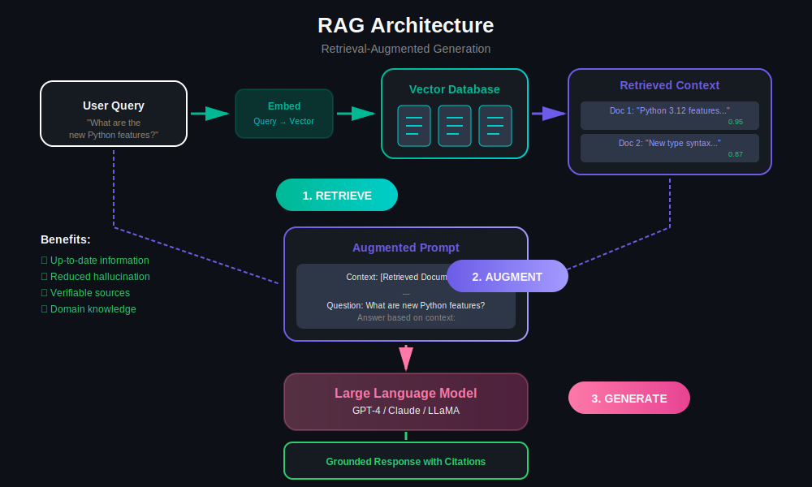
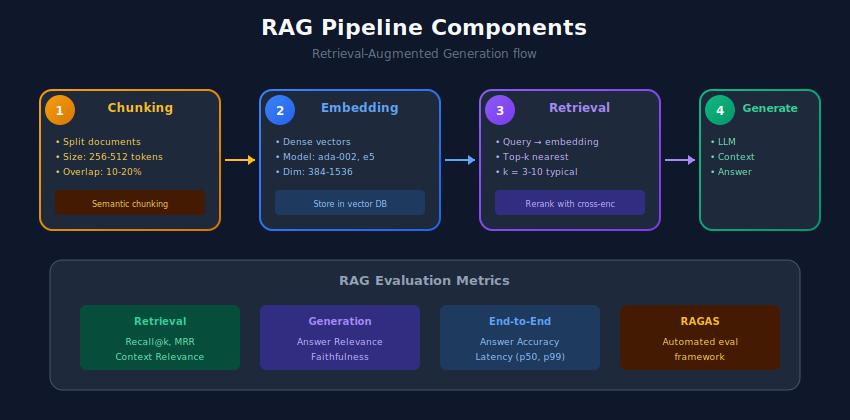

# 📚 Retrieval-Augmented Generation (RAG)

> Combining retrieval with LLMs for grounded, accurate, and up-to-date responses

---

## 📊 Visual Overview



---

## 🎯 What is RAG?

RAG combines **retrieval** (finding relevant information) with **generation** (LLM responses) to produce accurate, grounded answers.


---

## 🏗️ RAG Pipeline Components



---

## 1️⃣ Basic RAG Implementation

```python
from sentence_transformers import SentenceTransformer
from openai import OpenAI
import numpy as np
from typing import List, Dict

class SimpleRAG:
    """Basic RAG implementation."""

    def __init__(
        self,
        embedding_model: str = "all-MiniLM-L6-v2",
        llm_model: str = "gpt-3.5-turbo",
        api_key: str = None
    ):
        self.encoder = SentenceTransformer(embedding_model)
        self.client = OpenAI(api_key=api_key)
        self.llm_model = llm_model

        self.documents = []
        self.embeddings = None

    def add_documents(self, documents: List[str]):
        """Index documents for retrieval."""
        self.documents.extend(documents)
        new_embeddings = self.encoder.encode(
            documents,
            normalize_embeddings=True
        )

        if self.embeddings is None:
            self.embeddings = new_embeddings
        else:
            self.embeddings = np.vstack([self.embeddings, new_embeddings])

    def retrieve(
        self,
        query: str,
        top_k: int = 3
    ) -> List[str]:
        """Retrieve relevant documents."""
        query_embedding = self.encoder.encode(
            [query],
            normalize_embeddings=True
        )

        scores = np.dot(self.embeddings, query_embedding.T).flatten()
        top_indices = np.argsort(scores)[::-1][:top_k]

        return [self.documents[i] for i in top_indices]

    def generate(
        self,
        query: str,
        context: List[str],
        system_prompt: str = None
    ) -> str:
        """Generate response using context."""
        if system_prompt is None:
            system_prompt = """You are a helpful assistant. Answer the question
based on the provided context. If the context doesn't contain relevant
information, say so."""

        context_str = "\n\n".join([f"Document {i+1}: {doc}"
                                   for i, doc in enumerate(context)])

        messages = [
            {"role": "system", "content": system_prompt},
            {"role": "user", "content": f"""Context:
{context_str}

Question: {query}

Answer:"""}
        ]

        response = self.client.chat.completions.create(
            model=self.llm_model,
            messages=messages,
            temperature=0.7
        )

        return response.choices[0].message.content

    def query(
        self,
        question: str,
        top_k: int = 3
    ) -> Dict:
        """Full RAG pipeline: retrieve + generate."""
        # Retrieve
        relevant_docs = self.retrieve(question, top_k=top_k)

        # Generate
        answer = self.generate(question, relevant_docs)

        return {
            "question": question,
            "answer": answer,
            "sources": relevant_docs
        }

# Usage
rag = SimpleRAG(api_key="your-key")

# Add documents
documents = [
    "Python 3.12 introduced improved error messages with better suggestions.",
    "The new type parameter syntax in Python 3.12 allows for cleaner generic code.",
    "Python 3.12 includes performance improvements of 5% on average.",
    "The asyncio module received significant updates in Python 3.12."
]
rag.add_documents(documents)

# Query
result = rag.query("What are the new features in Python 3.12?")
print(result["answer"])

```

---

## 2️⃣ Advanced RAG with LangChain

```python
from langchain.document_loaders import DirectoryLoader, TextLoader
from langchain.text_splitter import RecursiveCharacterTextSplitter
from langchain.embeddings import OpenAIEmbeddings
from langchain.vectorstores import FAISS
from langchain.chat_models import ChatOpenAI
from langchain.chains import RetrievalQA
from langchain.prompts import PromptTemplate
from typing import List, Dict

class LangChainRAG:
    """Advanced RAG using LangChain."""

    def __init__(
        self,
        embedding_model: str = "text-embedding-ada-002",
        llm_model: str = "gpt-4",
        chunk_size: int = 1000,
        chunk_overlap: int = 200
    ):
        self.embeddings = OpenAIEmbeddings(model=embedding_model)
        self.llm = ChatOpenAI(model=llm_model, temperature=0)

        self.text_splitter = RecursiveCharacterTextSplitter(
            chunk_size=chunk_size,
            chunk_overlap=chunk_overlap,
            separators=["\n\n", "\n", ". ", " ", ""]
        )

        self.vectorstore = None
        self.qa_chain = None

    def load_documents(self, path: str, glob: str = "**/*.txt"):
        """Load documents from directory."""
        loader = DirectoryLoader(path, glob=glob, loader_cls=TextLoader)
        documents = loader.load()
        return documents

    def index_documents(self, documents: List):
        """Split and index documents."""
        # Split documents
        texts = self.text_splitter.split_documents(documents)

        # Create vector store
        self.vectorstore = FAISS.from_documents(texts, self.embeddings)

        # Create QA chain
        self._create_qa_chain()

        return len(texts)

    def _create_qa_chain(self):
        """Create the QA chain with custom prompt."""
        prompt_template = """Use the following pieces of context to answer
the question at the end. If you don't know the answer, say that you don't
know. Always cite the source documents.

Context:
{context}

Question: {question}

Answer with citations:"""

        prompt = PromptTemplate(
            template=prompt_template,
            input_variables=["context", "question"]
        )

        self.qa_chain = RetrievalQA.from_chain_type(
            llm=self.llm,
            chain_type="stuff",
            retriever=self.vectorstore.as_retriever(
                search_kwargs={"k": 4}
            ),
            chain_type_kwargs={"prompt": prompt},
            return_source_documents=True
        )

    def query(self, question: str) -> Dict:
        """Query the RAG system."""
        result = self.qa_chain({"query": question})

        return {
            "answer": result["result"],
            "sources": [
                {
                    "content": doc.page_content[:200] + "...",
                    "metadata": doc.metadata
                }
                for doc in result["source_documents"]
            ]
        }

    def save_index(self, path: str):
        """Save vector store to disk."""
        self.vectorstore.save_local(path)

    def load_index(self, path: str):
        """Load vector store from disk."""
        self.vectorstore = FAISS.load_local(path, self.embeddings)
        self._create_qa_chain()

```

---

## 3️⃣ Advanced Chunking Strategies

```python
from typing import List
import re

class DocumentChunker:
    """Advanced document chunking strategies."""

    @staticmethod
    def fixed_size_chunks(
        text: str,
        chunk_size: int = 500,
        overlap: int = 100
    ) -> List[str]:
        """Simple fixed-size chunking with overlap."""
        chunks = []
        start = 0

        while start < len(text):
            end = start + chunk_size
            chunk = text[start:end]
            chunks.append(chunk)
            start = end - overlap

        return chunks

    @staticmethod
    def semantic_chunks(
        text: str,
        max_chunk_size: int = 1000
    ) -> List[str]:
        """Chunk by semantic units (paragraphs, sections)."""
        # Split by double newlines (paragraphs)
        paragraphs = text.split("\n\n")

        chunks = []
        current_chunk = ""

        for para in paragraphs:
            if len(current_chunk) + len(para) < max_chunk_size:
                current_chunk += para + "\n\n"
            else:
                if current_chunk:
                    chunks.append(current_chunk.strip())
                current_chunk = para + "\n\n"

        if current_chunk:
            chunks.append(current_chunk.strip())

        return chunks

    @staticmethod
    def hierarchical_chunks(
        text: str,
        section_pattern: str = r"^#+\s"
    ) -> List[Dict]:
        """Chunk by document structure (headers, sections)."""
        sections = re.split(section_pattern, text, flags=re.MULTILINE)

        chunks = []
        for i, section in enumerate(sections):
            if section.strip():
                chunks.append({
                    "content": section.strip(),
                    "section_id": i,
                    "parent_id": max(0, i - 1)
                })

        return chunks

    @staticmethod
    def sentence_window_chunks(
        text: str,
        window_size: int = 5,
        stride: int = 2
    ) -> List[str]:
        """Chunk using sliding window of sentences."""
        # Simple sentence splitting
        sentences = re.split(r'[.!?]+', text)
        sentences = [s.strip() for s in sentences if s.strip()]

        chunks = []
        for i in range(0, len(sentences), stride):
            window = sentences[i:i + window_size]
            chunks.append(". ".join(window) + ".")

        return chunks

```

---

## 4️⃣ Query Transformation

```python
class QueryTransformer:
    """Transform queries for better retrieval."""

    def __init__(self, llm_client):
        self.llm = llm_client

    def expand_query(self, query: str) -> List[str]:
        """Expand query with variations."""
        prompt = f"""Generate 3 alternative phrasings of this question
that might help find relevant information:

Original: {query}

Alternatives:"""

        response = self.llm.generate(prompt)
        alternatives = [q.strip() for q in response.split("\n") if q.strip()]

        return [query] + alternatives[:3]

    def decompose_query(self, query: str) -> List[str]:
        """Break complex query into sub-queries."""
        prompt = f"""Break this complex question into simpler sub-questions:

Question: {query}

Sub-questions:"""

        response = self.llm.generate(prompt)
        return [q.strip() for q in response.split("\n") if q.strip()]

    def hypothetical_document(self, query: str) -> str:
        """Generate hypothetical answer for HyDE retrieval."""
        prompt = f"""Write a short passage that would answer this question:

Question: {query}

Passage:"""

        return self.llm.generate(prompt)

class MultiQueryRAG:
    """RAG with query expansion for better recall."""

    def __init__(self, base_rag, query_transformer):
        self.rag = base_rag
        self.transformer = query_transformer

    def query(self, question: str, top_k: int = 5) -> Dict:
        """Query with multiple reformulations."""
        # Expand query
        queries = self.transformer.expand_query(question)

        # Retrieve for each query
        all_docs = []
        for q in queries:
            docs = self.rag.retrieve(q, top_k=top_k)
            all_docs.extend(docs)

        # Deduplicate and rank
        unique_docs = list(set(all_docs))

        # Generate final answer
        answer = self.rag.generate(question, unique_docs[:top_k])

        return {
            "answer": answer,
            "expanded_queries": queries,
            "sources": unique_docs[:top_k]
        }

```

---

## 5️⃣ Evaluation Metrics

```python
from typing import List, Dict
import numpy as np

class RAGEvaluator:
    """Evaluate RAG system performance."""

    @staticmethod
    def retrieval_precision_at_k(
        retrieved: List[str],
        relevant: List[str],
        k: int
    ) -> float:
        """Precision of top-k retrieved documents."""
        retrieved_k = retrieved[:k]
        hits = sum(1 for doc in retrieved_k if doc in relevant)
        return hits / k

    @staticmethod
    def retrieval_recall_at_k(
        retrieved: List[str],
        relevant: List[str],
        k: int
    ) -> float:
        """Recall of top-k retrieved documents."""
        retrieved_k = retrieved[:k]
        hits = sum(1 for doc in retrieved_k if doc in relevant)
        return hits / len(relevant) if relevant else 0

    @staticmethod
    def mrr(ranked_results: List[List[str]], ground_truth: List[str]) -> float:
        """Mean Reciprocal Rank."""
        rr_sum = 0
        for results, truth in zip(ranked_results, ground_truth):
            for i, doc in enumerate(results):
                if doc == truth:
                    rr_sum += 1 / (i + 1)
                    break
        return rr_sum / len(ranked_results)

    @staticmethod
    def faithfulness(
        answer: str,
        context: List[str],
        llm_judge
    ) -> float:
        """Check if answer is faithful to context."""
        prompt = f"""Rate if the answer is supported by the context.
Score 1 if fully supported, 0 if not.

Context: {' '.join(context)}
Answer: {answer}

Score:"""

        score = llm_judge.generate(prompt)
        return float(score.strip())

# Usage
evaluator = RAGEvaluator()

retrieved = ["doc1", "doc2", "doc3", "doc4", "doc5"]
relevant = ["doc2", "doc4"]

precision = evaluator.retrieval_precision_at_k(retrieved, relevant, k=3)
recall = evaluator.retrieval_recall_at_k(retrieved, relevant, k=5)

```

---

## 📊 RAG Optimization Techniques

| Technique | Purpose | Improvement |
|-----------|---------|-------------|
| **Hybrid Search** | Combine dense + sparse | Better recall |
| **Reranking** | Cross-encoder scoring | Better precision |
| **Query Expansion** | Multiple query variations | Wider coverage |
| **HyDE** | Hypothetical document | Semantic matching |
| **Parent Document** | Return larger context | More coherent |

---

## 🔗 Related Topics

- [Search & Retrieval](../09_search_and_retrieval/) - Retrieval fundamentals
- [LLM Systems](../10_llm_systems/) - LLM serving
- [Embeddings](../02_embeddings/) - Vector representations

---

## 📚 References

1. [RAG Paper](https://arxiv.org/abs/2005.11401)
2. [LangChain](https://python.langchain.com/)
3. [LlamaIndex](https://www.llamaindex.ai/)

---

<div align="center">

**[⬆ Back to Top](#)** | **[📚 Main Repository](https://github.com/Gaurav14cs17/ml_system_design)**

Made with 💜 by [Gaurav14cs17](https://github.com/Gaurav14cs17)

</div>
