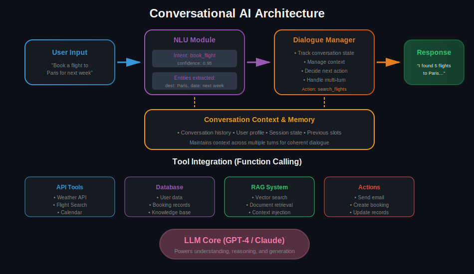
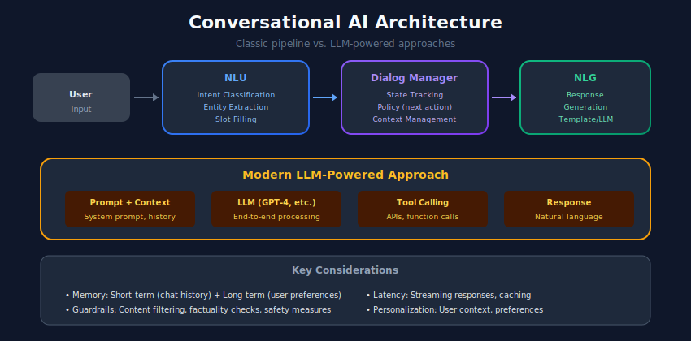

# 💬 Conversational AI Systems

> Building intelligent chatbots and dialogue systems for natural human-computer interaction

---

## 📊 Visual Overview

### Chatbot Architecture


---

## 🎯 What is Conversational AI?

Conversational AI enables computers to understand, process, and respond to human language in natural dialogue.


---

## 🏗️ Dialogue System Architecture



---

## 1️⃣ LLM-Based Chatbot

```python
from openai import OpenAI
from typing import List, Dict, Optional
from dataclasses import dataclass, field
from datetime import datetime

@dataclass
class Message:
    role: str
    content: str
    timestamp: datetime = field(default_factory=datetime.now)

class ChatBot:
    """LLM-based conversational agent with memory."""

    def __init__(
        self,
        api_key: str,
        model: str = "gpt-4",
        system_prompt: str = None,
        max_history: int = 20
    ):
        self.client = OpenAI(api_key=api_key)
        self.model = model
        self.system_prompt = system_prompt or "You are a helpful assistant."
        self.max_history = max_history
        self.conversation_history: List[Message] = []

    def add_message(self, role: str, content: str):
        """Add message to history."""
        self.conversation_history.append(Message(role=role, content=content))

        # Trim history if needed
        if len(self.conversation_history) > self.max_history:
            self.conversation_history = self.conversation_history[-self.max_history:]

    def get_messages(self) -> List[Dict[str, str]]:
        """Format messages for API call."""
        messages = [{"role": "system", "content": self.system_prompt}]

        for msg in self.conversation_history:
            messages.append({"role": msg.role, "content": msg.content})

        return messages

    def chat(self, user_message: str) -> str:
        """Send message and get response."""
        self.add_message("user", user_message)

        response = self.client.chat.completions.create(
            model=self.model,
            messages=self.get_messages(),
            temperature=0.7
        )

        assistant_message = response.choices[0].message.content
        self.add_message("assistant", assistant_message)

        return assistant_message

    def reset(self):
        """Clear conversation history."""
        self.conversation_history = []

    def summarize_history(self) -> str:
        """Summarize long conversations to save context."""
        if len(self.conversation_history) < 10:
            return None

        history_text = "\n".join([
            f"{m.role}: {m.content}"
            for m in self.conversation_history[:-4]
        ])

        response = self.client.chat.completions.create(
            model=self.model,
            messages=[
                {"role": "system", "content": "Summarize this conversation briefly:"},
                {"role": "user", "content": history_text}
            ]
        )

        return response.choices[0].message.content

# Usage
bot = ChatBot(
    api_key="your-key",
    system_prompt="You are a friendly travel assistant helping users plan trips."
)

response = bot.chat("I want to plan a trip to Japan")
print(response)

response = bot.chat("What's the best time to visit?")
print(response)

```

---

## 2️⃣ Tool-Using Agent

```python
from typing import List, Dict, Callable, Any
import json

class Tool:
    """Represents a callable tool for the agent."""

    def __init__(
        self,
        name: str,
        description: str,
        parameters: Dict,
        func: Callable
    ):
        self.name = name
        self.description = description
        self.parameters = parameters
        self.func = func

    def to_openai_format(self) -> Dict:
        """Convert to OpenAI function calling format."""
        return {
            "type": "function",
            "function": {
                "name": self.name,
                "description": self.description,
                "parameters": self.parameters
            }
        }

    def execute(self, **kwargs) -> Any:
        """Execute the tool."""
        return self.func(**kwargs)

class ToolAgent:
    """Conversational agent with tool use capabilities."""

    def __init__(
        self,
        api_key: str,
        model: str = "gpt-4",
        system_prompt: str = None
    ):
        self.client = OpenAI(api_key=api_key)
        self.model = model
        self.system_prompt = system_prompt or "You are a helpful assistant with access to tools."
        self.tools: Dict[str, Tool] = {}
        self.conversation_history: List[Dict] = []

    def register_tool(self, tool: Tool):
        """Register a tool for the agent to use."""
        self.tools[tool.name] = tool

    def chat(self, user_message: str) -> str:
        """Chat with potential tool use."""
        self.conversation_history.append({
            "role": "user",
            "content": user_message
        })

        messages = [
            {"role": "system", "content": self.system_prompt}
        ] + self.conversation_history

        tools = [t.to_openai_format() for t in self.tools.values()]

        response = self.client.chat.completions.create(
            model=self.model,
            messages=messages,
            tools=tools if tools else None,
            tool_choice="auto" if tools else None
        )

        message = response.choices[0].message

        # Check for tool calls
        if message.tool_calls:
            return self._handle_tool_calls(message)

        assistant_content = message.content
        self.conversation_history.append({
            "role": "assistant",
            "content": assistant_content
        })

        return assistant_content

    def _handle_tool_calls(self, message) -> str:
        """Execute tool calls and continue conversation."""
        self.conversation_history.append({
            "role": "assistant",
            "content": message.content,
            "tool_calls": [
                {
                    "id": tc.id,
                    "type": tc.type,
                    "function": {
                        "name": tc.function.name,
                        "arguments": tc.function.arguments
                    }
                }
                for tc in message.tool_calls
            ]
        })

        # Execute each tool
        for tool_call in message.tool_calls:
            tool_name = tool_call.function.name
            tool_args = json.loads(tool_call.function.arguments)

            if tool_name in self.tools:
                result = self.tools[tool_name].execute(**tool_args)
            else:
                result = f"Error: Tool {tool_name} not found"

            self.conversation_history.append({
                "role": "tool",
                "tool_call_id": tool_call.id,
                "content": str(result)
            })

        # Get final response
        messages = [
            {"role": "system", "content": self.system_prompt}
        ] + self.conversation_history

        response = self.client.chat.completions.create(
            model=self.model,
            messages=messages
        )

        final_response = response.choices[0].message.content
        self.conversation_history.append({
            "role": "assistant",
            "content": final_response
        })

        return final_response

# Example tools
def get_weather(location: str) -> str:
    """Simulated weather API."""
    return f"The weather in {location} is 72°F and sunny."

def search_flights(origin: str, destination: str, date: str) -> str:
    """Simulated flight search."""
    return f"Found 5 flights from {origin} to {destination} on {date}. Prices from $299."

# Usage
agent = ToolAgent(api_key="your-key")

agent.register_tool(Tool(
    name="get_weather",
    description="Get current weather for a location",
    parameters={
        "type": "object",
        "properties": {
            "location": {"type": "string", "description": "City name"}
        },
        "required": ["location"]
    },
    func=get_weather
))

agent.register_tool(Tool(
    name="search_flights",
    description="Search for flights",
    parameters={
        "type": "object",
        "properties": {
            "origin": {"type": "string"},
            "destination": {"type": "string"},
            "date": {"type": "string", "description": "YYYY-MM-DD format"}
        },
        "required": ["origin", "destination", "date"]
    },
    func=search_flights
))

response = agent.chat("What's the weather in Tokyo and find me flights from NYC to Tokyo next week?")

```

---

## 3️⃣ Intent Classification & Slot Filling

```python
from transformers import pipeline
from typing import Dict, List, Tuple

class IntentClassifier:
    """Classify user intent from text."""

    def __init__(self, intents: List[str]):
        self.classifier = pipeline(
            "zero-shot-classification",
            model="facebook/bart-large-mnli"
        )
        self.intents = intents

    def classify(self, text: str) -> Dict:
        """Classify intent with confidence scores."""
        result = self.classifier(text, self.intents)

        return {
            "text": text,
            "intent": result["labels"][0],
            "confidence": result["scores"][0],
            "all_scores": dict(zip(result["labels"], result["scores"]))
        }

class SlotFiller:
    """Extract slot values from utterances."""

    def __init__(self):
        self.ner = pipeline("ner", grouped_entities=True)

    def extract_slots(
        self,
        text: str,
        slot_mapping: Dict[str, List[str]] = None
    ) -> Dict[str, str]:
        """Extract entities and map to slots."""
        entities = self.ner(text)

        # Default mapping from NER types to slots
        default_mapping = {
            "destination": ["LOC", "GPE"],
            "date": ["DATE"],
            "time": ["TIME"],
            "person": ["PER"],
            "organization": ["ORG"],
            "money": ["MONEY"]
        }

        mapping = slot_mapping or default_mapping

        slots = {}
        for entity in entities:
            entity_type = entity["entity_group"]
            for slot, types in mapping.items():
                if entity_type in types:
                    slots[slot] = entity["word"]

        return slots

class DialogueStateTracker:
    """Track dialogue state across turns."""

    def __init__(self, slots: List[str]):
        self.slots = {slot: None for slot in slots}
        self.history = []

    def update(
        self,
        intent: str,
        extracted_slots: Dict[str, str]
    ) -> Dict:
        """Update state with new information."""
        # Update slots
        for slot, value in extracted_slots.items():
            if value and slot in self.slots:
                self.slots[slot] = value

        # Track history
        self.history.append({
            "intent": intent,
            "slots": extracted_slots.copy(),
            "state": self.slots.copy()
        })

        return self.get_state()

    def get_state(self) -> Dict:
        """Get current dialogue state."""
        return {
            "slots": self.slots.copy(),
            "missing_slots": [s for s, v in self.slots.items() if v is None],
            "is_complete": all(v is not None for v in self.slots.values())
        }

    def reset(self):
        """Reset state."""
        self.slots = {slot: None for slot in self.slots}
        self.history = []

# Usage
intent_classifier = IntentClassifier([
    "book_flight", "cancel_booking", "check_status", "general_inquiry"
])

slot_filler = SlotFiller()
state_tracker = DialogueStateTracker(["origin", "destination", "date"])

# Process utterance
utterance = "I want to book a flight from New York to Paris on December 15th"

intent = intent_classifier.classify(utterance)
slots = slot_filler.extract_slots(utterance)
state = state_tracker.update(intent["intent"], slots)

print(f"Intent: {intent['intent']}")
print(f"Slots: {slots}")
print(f"State: {state}")

```

---

## 4️⃣ Multi-Turn Conversation Management

```python
from enum import Enum
from typing import Optional

class ConversationState(Enum):
    GREETING = "greeting"
    GATHERING_INFO = "gathering_info"
    CONFIRMING = "confirming"
    EXECUTING = "executing"
    COMPLETED = "completed"
    ERROR = "error"

class ConversationManager:
    """Manage multi-turn conversation flow."""

    def __init__(self, chatbot):
        self.chatbot = chatbot
        self.state = ConversationState.GREETING
        self.context = {}

    def process(self, user_input: str) -> str:
        """Process user input based on current state."""
        if self.state == ConversationState.GREETING:
            return self._handle_greeting(user_input)

        elif self.state == ConversationState.GATHERING_INFO:
            return self._handle_info_gathering(user_input)

        elif self.state == ConversationState.CONFIRMING:
            return self._handle_confirmation(user_input)

        elif self.state == ConversationState.COMPLETED:
            return self._handle_completed(user_input)

        return "I'm sorry, something went wrong."

    def _handle_greeting(self, user_input: str) -> str:
        self.state = ConversationState.GATHERING_INFO
        return "Hello! How can I help you today?"

    def _handle_info_gathering(self, user_input: str) -> str:
        # Extract information using the chatbot
        response = self.chatbot.chat(user_input)

        # Check if we have enough info
        if self._has_required_info():
            self.state = ConversationState.CONFIRMING
            return f"Let me confirm: {self._summarize_context()}. Is this correct?"

        return response

    def _handle_confirmation(self, user_input: str) -> str:
        if "yes" in user_input.lower():
            self.state = ConversationState.EXECUTING
            result = self._execute_action()
            self.state = ConversationState.COMPLETED
            return result
        else:
            self.state = ConversationState.GATHERING_INFO
            return "What would you like to change?"

    def _handle_completed(self, user_input: str) -> str:
        if "bye" in user_input.lower() or "thanks" in user_input.lower():
            self.reset()
            return "Goodbye! Have a great day!"
        else:
            self.state = ConversationState.GATHERING_INFO
            return "Is there anything else I can help you with?"

    def _has_required_info(self) -> bool:
        required = ["destination", "date"]
        return all(key in self.context for key in required)

    def _summarize_context(self) -> str:
        return ", ".join(f"{k}: {v}" for k, v in self.context.items())

    def _execute_action(self) -> str:
        return f"Done! Your request has been processed."

    def reset(self):
        self.state = ConversationState.GREETING
        self.context = {}

```

---

## 📊 Evaluation Metrics

| Metric | Description |
|--------|-------------|
| **Task Completion** | % of tasks completed successfully |
| **Turn Efficiency** | Turns needed to complete task |
| **User Satisfaction** | Rating from users |
| **Response Quality** | Relevance, coherence, helpfulness |
| **Error Rate** | Failed interactions |

---

## 🔗 Related Topics

- [LLM Systems](../10_llm_systems/) - LLM deployment
- [RAG Systems](../11_rag_systems/) - Knowledge grounding
- [Question Answering](../07_question_answering/) - QA systems

---

## 📚 References

1. [Rasa Open Source](https://rasa.com/)
2. [OpenAI Function Calling](https://platform.openai.com/docs/guides/function-calling)
3. [Dialogue Systems Survey](https://arxiv.org/abs/2006.10958)

---

<div align="center">

**[⬆ Back to Top](#)** | **[📚 Main Repository](https://github.com/Gaurav14cs17/ml_system_design)**

Made with 💜 by [Gaurav14cs17](https://github.com/Gaurav14cs17)

</div>
