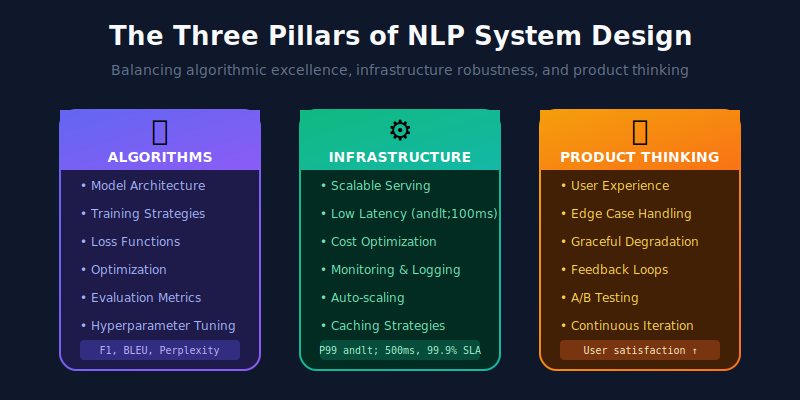
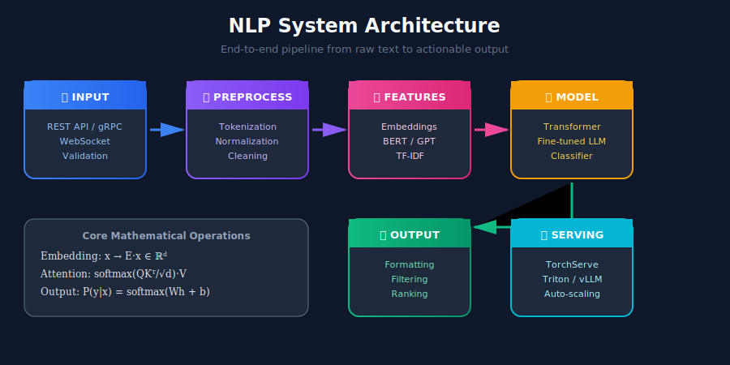
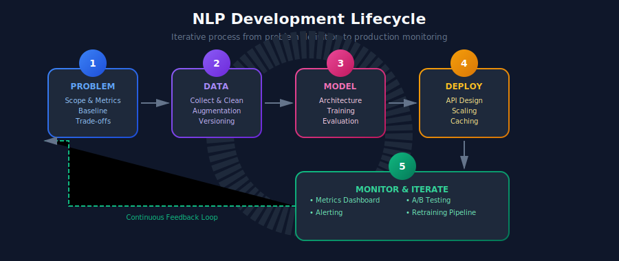
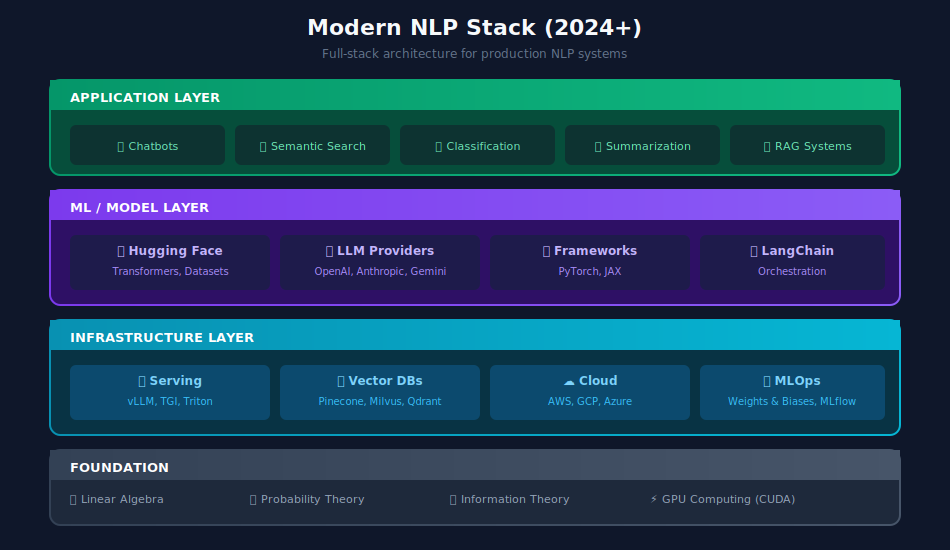

# 🧠 NLP Systems Design - Complete Guide

> A comprehensive deep-dive into Natural Language Processing systems from mathematical foundations to production deployment

---

## 📚 Table of Contents

| Module | Topic | Description |
|--------|-------|-------------|
| 01 | [Text Preprocessing](./01_text_preprocessing/) | Tokenization, normalization, cleaning pipelines |
| 02 | [Embeddings](./02_embeddings/) | Word2Vec, GloVe, FastText, contextual embeddings |
| 03 | [Language Models](./03_language_models/) | N-grams, RNNs, LSTMs, Transformers, BERT, GPT |
| 04 | [Text Classification](./04_text_classification/) | Sentiment analysis, topic modeling, intent detection |
| 05 | [Named Entity Recognition](./05_named_entity_recognition/) | NER systems, sequence labeling, entity linking |
| 06 | [Machine Translation](./06_machine_translation/) | Seq2Seq, attention mechanisms, neural MT |
| 07 | [Question Answering](./07_question_answering/) | Extractive QA, generative QA, reading comprehension |
| 08 | [Text Generation](./08_text_generation/) | Summarization, paraphrasing, creative generation |
| 09 | [Search & Retrieval](./09_search_and_retrieval/) | Semantic search, vector databases, dense retrieval |
| 10 | [LLM Systems](./10_llm_systems/) | Large language models, fine-tuning, deployment |
| 11 | [RAG Systems](./11_rag_systems/) | Retrieval-augmented generation architecture |
| 12 | [Conversational AI](./12_conversational_ai/) | Chatbots, dialogue systems, voice assistants |

---

## 🎯 What is NLP System Design?

Natural Language Processing (NLP) System Design is the art and science of building production-ready systems that can understand, process, and generate human language at scale. Unlike academic NLP which focuses on algorithms and benchmarks, **NLP System Design** emphasizes:

### The Three Pillars



---

## 🔢 Mathematical Foundations

Understanding NLP systems requires a solid grasp of the underlying mathematics. Here are the core concepts that power modern NLP:

### Vector Spaces and Embeddings

Words and documents are represented as vectors in high-dimensional spaces. The fundamental insight is that **semantic similarity** can be captured through **geometric proximity**.

**Cosine Similarity** measures the angle between two vectors:

$$
\text{cos}(\mathbf{a}, \mathbf{b}) = \frac{\mathbf{a} \cdot \mathbf{b}}{\|\mathbf{a}\| \|\mathbf{b}\|} = \frac{\sum_{i=1}^{n} a_i b_i}{\sqrt{\sum_{i=1}^{n} a_i^2} \sqrt{\sum_{i=1}^{n} b_i^2}}
$$

### Probability and Language Models

Language models estimate the probability of text sequences. The **chain rule of probability** decomposes joint distributions:

$$
P(w_1, w_2, \ldots, w_n) = \prod_{i=1}^{n} P(w_i | w_1, w_2, \ldots, w_{i-1})
$$

**Perplexity** measures how well a model predicts a sample:

$$
\text{PPL}(W) = P(w_1, w_2, \ldots, w_n)^{-1/n} = \exp\left(-\frac{1}{n}\sum_{i=1}^{n} \log P(w_i | w_{1:i-1})\right)
$$

### Attention Mechanism

The **scaled dot-product attention** is the core of Transformer models:

$$
\text{Attention}(Q, K, V) = \text{softmax}\left(\frac{QK^T}{\sqrt{d_k}}\right)V
$$

Where:
- $Q$ = Query matrix of shape $(n, d\_k)$
- $K$ = Key matrix of shape $(m, d\_k)$  
- $V$ = Value matrix of shape $(m, d\_v)$
- $d\_k$ = dimensionality of keys (scaling factor)

### Information Theory

**Cross-Entropy Loss** for classification:

$$
\mathcal{L}_{CE} = -\sum_{c=1}^{C} y_c \log(\hat{y}_c)
$$

**KL Divergence** measures distribution difference:

$$
D_{KL}(P \| Q) = \sum_{x} P(x) \log\frac{P(x)}{Q(x)}
$$

---

## 🏗️ Anatomy of an NLP System

Every production NLP system follows a similar high-level architecture:



### Key Components

| Component | Purpose | Technologies |
|-----------|---------|--------------|
| **Input Handler** | Accept and validate text input | REST APIs, gRPC, WebSockets |
| **Preprocessor** | Clean, tokenize, normalize text | spaCy, NLTK, custom pipelines |
| **Feature Extractor** | Convert text to numerical features | Embeddings, TF-IDF, custom features |
| **Model** | Core ML/DL model for inference | PyTorch, TensorFlow, ONNX |
| **Postprocessor** | Format and filter model outputs | Custom logic, templates |
| **Serving Layer** | Serve predictions at scale | TorchServe, Triton, FastAPI |

---

## 🔄 The NLP Development Lifecycle



---

## 📊 Key Metrics for NLP Systems

### Model Performance Metrics

| Task | Primary Metrics | Mathematical Definition |
|------|-----------------|------------------------|
| Classification | F1, Accuracy | $F\_1 = 2 \cdot \frac{P \cdot R}{P + R}$ |
| NER | Entity-level F1 | Span-exact match scoring |
| Translation | BLEU | $\text{BLEU} = BP \cdot \exp\left(\sum\_{n=1}^{N} w\_n \log p\_n\right)$ |
| QA | Exact Match, F1 | Token overlap $F\_1$ |
| Generation | ROUGE, BERTScore | N-gram overlap / embedding similarity |

### System Performance Metrics

| Metric | Target Range | Why It Matters |
|--------|--------------|----------------|
| **Latency (P50)** | < 100ms | User experience |
| **Latency (P99)** | < 500ms | Tail latency affects perception |
| **Throughput** | Task-dependent | Cost efficiency |
| **Error Rate** | < 0.1% | Reliability |
| **Model Size** | Task-dependent | Memory, loading time |

---

## 🚀 Modern NLP Stack (2024+)



---

## 🎓 Learning Path

### Beginner Path
1. Start with **Text Preprocessing** - understand tokenization and text cleaning
2. Learn **Embeddings** - how text becomes numbers
3. Study **Text Classification** - your first NLP model

### Intermediate Path
4. Master **Language Models** - from RNNs to Transformers
5. Build **NER Systems** - sequence labeling at production scale
6. Understand **Search & Retrieval** - semantic search fundamentals

### Advanced Path
7. Deploy **LLM Systems** - large model serving and optimization
8. Architect **RAG Systems** - combine retrieval with generation
9. Build **Conversational AI** - end-to-end dialogue systems

---

## 📐 Essential Mathematical Background

Before diving into specific NLP topics, ensure familiarity with these concepts:

### Linear Algebra
- **Vectors and matrices**: Representations of text and transformations
- **Matrix multiplication**: $C\_{ij} = \sum\_k A\_{ik} B\_{kj}$
- **Eigendecomposition**: Used in dimensionality reduction (SVD, PCA)

### Calculus
- **Gradients**: $\nabla\_\theta \mathcal{L}$ for optimization
- **Chain rule**: Essential for backpropagation
- **Softmax derivative**: $\frac{\partial \text{softmax}\_i}{\partial z\_j} = \text{softmax}\_i (\delta\_{ij} - \text{softmax}\_j)$

### Probability Theory
- **Bayes' theorem**: $P(A|B) = \frac{P(B|A)P(A)}{P(B)}$
- **Maximum likelihood estimation**: $\hat{\theta} = \arg\max\_\theta P(D|\theta)$
- **Conditional independence**: Markov assumptions in sequence models

### Information Theory
- **Entropy**: $H(X) = -\sum\_x P(x) \log P(x)$
- **Mutual information**: $I(X;Y) = H(X) - H(X|Y)$
- **Cross-entropy**: Loss function for classification

---

## 🔧 Tools & Frameworks

### Model Development
- **Hugging Face Transformers** - Pre-trained models and fine-tuning
- **spaCy** - Industrial-strength NLP
- **PyTorch / TensorFlow** - Deep learning frameworks
- **OpenAI API / Anthropic API** - Hosted LLM access

### Data Processing
- **Apache Spark** - Distributed text processing
- **Dask** - Parallel computing for large datasets
- **Ray** - Distributed computing and hyperparameter tuning

### Model Serving
- **vLLM** - High-throughput LLM serving
- **Triton Inference Server** - Multi-model serving
- **BentoML** - ML model serving framework
- **FastAPI** - High-performance API framework

### Vector Databases
- **Pinecone** - Managed vector database
- **Milvus** - Open-source vector database
- **Weaviate** - Vector search engine
- **Qdrant** - Vector similarity search

---

## 📖 How to Use This Guide

Each subdirectory contains:

1. **README.md** - Comprehensive explanation with mathematical foundations
2. **diagrams/** - Architecture and concept visualizations
3. Code examples integrated within documentation

### Suggested Workflow

```bash

# Navigate to a topic
cd 01_text_preprocessing

# Read the guide
cat README.md

# Each topic builds on previous ones
# Follow the learning path for best results
```

---

## 🌟 Key Principles

### 1. Start Simple, Iterate
> "The best model is the one that ships. Start with a baseline and improve."

### 2. Data Quality > Model Complexity
> "Garbage in, garbage out. Invest in data quality before model tuning."

### 3. Measure Everything
> "If you can't measure it, you can't improve it. Log metrics from day one."

### 4. Design for Failure
> "Systems fail. Design graceful degradation and fallbacks."

### 5. Think About Scale Early
> "Rewriting for scale is expensive. Consider scale in initial design."

---

## 📚 Prerequisites

Before diving in, ensure familiarity with:

- **Python** - Primary language for NLP
- **Linear Algebra** - Vectors, matrices, transformations
- **Probability & Statistics** - Distributions, sampling, estimation
- **Machine Learning Basics** - Classification, regression, evaluation
- **Deep Learning Fundamentals** - Neural networks, backpropagation

---

## 🤝 Contributing

This is a living document. Contributions welcome:

1. Fix errors or outdated information
2. Add new examples or use cases
3. Improve explanations
4. Share production experiences

---

*Built with ❤️ for the ML Systems Design community*

---

<div align="center">

**[⬆ Back to Top](#)** | **[📚 Main Repository](https://github.com/Gaurav14cs17/ml_system_design)**

Made with 💜 by [Gaurav14cs17](https://github.com/Gaurav14cs17)

</div>
