# 🎨 Computer Vision Fundamentals

> Understanding the building blocks of digital images and visual computing

<p align="center">
  
</p>

---

## 📑 Table of Contents

1. [What is Computer Vision?](#what-is-computer-vision)
2. [Digital Image Representation](#digital-image-representation)
3. [Color Spaces](#color-spaces)
4. [Image Formats and Compression](#image-formats-and-compression)
5. [Image Coordinates and Transformations](#image-coordinates-and-transformations)
6. [Histograms and Statistics](#histograms-and-statistics)
7. [System Design Considerations](#system-design-considerations)
8. [Code Examples](#code-examples)

---

## What is Computer Vision?

Computer Vision (CV) is a field of artificial intelligence that enables computers to interpret and understand visual information from the world. It bridges the gap between raw pixel data and semantic understanding.

### Mathematical Foundation

At its core, computer vision treats images as **mathematical functions**. A grayscale image can be represented as a continuous function:

```math
I: \mathbb{R}^2 \rightarrow \mathbb{R}

```

where $I(x, y)$ gives the intensity at spatial coordinates $(x, y)$.

For digital images, we discretize this into a matrix:

```math
I \in \mathbb{R}^{H \times W}

```

For color images with $C$ channels (e.g., RGB where $C=3$):

```math
I \in \mathbb{R}^{H \times W \times C}

```

### The Vision Pipeline

```mermaid
flowchart LR
    subgraph Input["📷 Input"]
        A[Camera/Sensor]
        B[Image File]
        C[Video Stream]
    end

    subgraph Preprocess["⚙️ Preprocessing"]
        D[Resize]
        E[Normalize]
        F[Augment]
    end

    subgraph Features["🔍 Feature Extraction"]
        G[Traditional<br/>SIFT/HOG]
        H[Deep Learning<br/>CNN/ViT]
    end

    subgraph Model["🧠 Model"]
        I[Classification]
        J[Detection]
        K[Segmentation]
    end

    subgraph Output["📤 Output"]
        L[Classes]
        M[Bounding Boxes]
        N[Masks]
    end

    A --> D
    B --> D
    C --> D
    D --> E --> F
    F --> G
    F --> H
    G --> I
    H --> I
    H --> J
    H --> K
    I --> L
    J --> M
    K --> N

    style A fill:#e3f2fd
    style H fill:#fff3e0
    style L fill:#e8f5e9

```




### Applications in Production

| Domain | Application | Scale |
|--------|-------------|-------|
| **Autonomous Vehicles** | Object detection, lane keeping | Millions of frames/day |
| **Healthcare** | Medical imaging, pathology | Petabytes of scans |
| **Retail** | Visual search, inventory | Billions of products |
| **Manufacturing** | Quality inspection | Real-time processing |
| **Security** | Surveillance, face recognition | 24/7 streaming |

---

## Digital Image Representation

### What is a Digital Image?

A digital image is a 2D array (matrix) of discrete picture elements called **pixels**. Each pixel contains intensity or color information.


### Mathematical Formulation

A digital image $I$ is formally defined as a mapping from a discrete spatial domain to an intensity/color space:

```math
I: \{0, 1, ..., H-1\} \times \{0, 1, ..., W-1\} \rightarrow \mathcal{V}

```

where:
- $H$ = image height (rows)
- $W$ = image width (columns)
- $\mathcal{V}$ = value space (intensity or color)

**For grayscale images** (8-bit):

```math
\mathcal{V} = \{0, 1, 2, ..., 255\}

```

**For RGB color images**:

```math
\mathcal{V} = \{0, ..., 255\}^3

```

Each pixel $I(i, j)$ can be accessed using matrix indexing where $i \in [0, H-1]$ is the row and $j \in [0, W-1]$ is the column.

### Quantization and Bit Depth

The **bit depth** $b$ determines the number of discrete intensity levels:

```math
L = 2^b

```

| Bit Depth | Levels | Common Use |
|-----------|--------|------------|
| 1-bit | 2 | Binary/mask images |
| 8-bit | 256 | Standard images |
| 16-bit | 65,536 | Medical imaging, HDR |
| 32-bit (float) | Continuous | Scientific computing |

### Image Types

#### 1. Binary Images (1-bit)

```
Pixel values: {0, 1} or {Black, White}
Memory: W × H bits

Use cases:
• Document scanning
• Mask generation
• QR code reading

```

#### 2. Grayscale Images (8-bit)

```
Pixel values: 0-255 (256 intensity levels)
Memory: W × H bytes

Use cases:
• Medical imaging (X-rays, CT)
• Document processing
• Edge detection preprocessing

```

#### 3. Color Images (24-bit RGB)


#### 4. Images with Alpha Channel (32-bit RGBA)

```
Pixel values: 4 channels × 8 bits = 32 bits per pixel
Memory: W × H × 4 bytes

Alpha channel: 0 (transparent) to 255 (opaque)

Use cases:
• Overlays and compositing
• UI elements
• Watermarks

```

### Memory Calculations

```python
# Memory calculation for different image types
def calculate_memory(width, height, channels, bit_depth=8):
    """
    Calculate memory requirements for an image.

    Args:
        width: Image width in pixels
        height: Image height in pixels
        channels: Number of color channels (1=gray, 3=RGB, 4=RGBA)
        bit_depth: Bits per channel (typically 8 or 16)

    Returns:
        Memory in bytes
    """
    bits_per_pixel = channels * bit_depth
    total_bits = width * height * bits_per_pixel
    return total_bits // 8

# Examples
print(f"1080p Grayscale: {calculate_memory(1920, 1080, 1):,} bytes")  # ~2 MB
print(f"1080p RGB: {calculate_memory(1920, 1080, 3):,} bytes")        # ~6 MB
print(f"4K RGB: {calculate_memory(3840, 2160, 3):,} bytes")           # ~24 MB
print(f"8K RGB: {calculate_memory(7680, 4320, 3):,} bytes")           # ~99 MB

```

---

## Color Spaces

<p align="center">
  
</p>

Color spaces define how colors are represented numerically. Different color spaces are optimized for different tasks.

### RGB (Red, Green, Blue)

The most common color space for display devices.


**Mathematical Representation:**

An RGB color is a 3-tuple $(R, G, B)$ where each component $\in [0, 255]$ for 8-bit images:

```math
\text{Color} = R \cdot \mathbf{e}_R + G \cdot \mathbf{e}_G + B \cdot \mathbf{e}_B

```

The RGB cube occupies a 3D space where:
- $(0, 0, 0)$ = Black
- $(255, 255, 255)$ = White
- $(255, 0, 0)$ = Pure Red

**Grayscale Conversion (Luminance):**

```math
Y = 0.299R + 0.587G + 0.114B

```

This weighted average reflects human eye sensitivity (most sensitive to green, least to blue).

**Pros:**
- Native format for displays
- Simple and intuitive
- Hardware accelerated

**Cons:**
- Mixes luminance and chrominance
- Not perceptually uniform
- Difficult for color-based segmentation

### HSV/HSB (Hue, Saturation, Value/Brightness)

Separates color information from brightness.


**Mathematical Conversion (RGB → HSV):**

Given normalized RGB values $R', G', B' \in [0, 1]$:

```math
C_{max} = \max(R', G', B')
C_{min} = \min(R', G', B')
\Delta = C_{max} - C_{min}

```

**Value (Brightness):**

```math
V = C_{max}

```

**Saturation:**

```math
S = \begin{cases} 0 & \text{if } C_{max} = 0 \\ \frac{\Delta}{C_{max}} & \text{otherwise} \end{cases}

```

**Hue (in degrees):**

```math
H = \begin{cases} 
0° & \text{if } \Delta = 0 \\
60° \times \left(\frac{G' - B'}{\Delta} \mod 6\right) & \text{if } C_{max} = R' \\
60° \times \left(\frac{B' - R'}{\Delta} + 2\right) & \text{if } C_{max} = G' \\
60° \times \left(\frac{R' - G'}{\Delta} + 4\right) & \text{if } C_{max} = B'
\end{cases}

```

**Interpretation:**
- **H** (0°-360°): Color type (red=0°, green=120°, blue=240°)
- **S** (0-1): Color purity (0=gray, 1=vivid)
- **V** (0-1): Brightness (0=black, 1=brightest)

**Use Cases:**
- Color-based object detection
- Skin tone detection
- Traffic light recognition
- Color filtering

```python
import cv2
import numpy as np

def detect_color_objects(image, lower_hsv, upper_hsv):
    """
    Detect objects of a specific color range.

    Args:
        image: BGR image (OpenCV format)
        lower_hsv: Lower HSV threshold (H, S, V)
        upper_hsv: Upper HSV threshold (H, S, V)

    Returns:
        Binary mask of detected regions
    """
    # Convert BGR to HSV
    hsv = cv2.cvtColor(image, cv2.COLOR_BGR2HSV)

    # Create mask for color range
    mask = cv2.inRange(hsv, lower_hsv, upper_hsv)

    return mask

# Example: Detect red objects
lower_red = np.array([0, 100, 100])
upper_red = np.array([10, 255, 255])

```

### LAB (Lightness, A, B)

Perceptually uniform color space based on human vision.


**Mathematical Foundation:**

The LAB color space is derived from XYZ (CIE 1931) through a nonlinear transformation. First, convert RGB to XYZ using a matrix:

```math
\begin{bmatrix} X \\ Y \\ Z \end{bmatrix} = \mathbf{M} \begin{bmatrix} R \\ G \\ B \end{bmatrix}

```

where $\mathbf{M}$ is the RGB-to-XYZ transformation matrix (depends on RGB color space, e.g., sRGB).

**XYZ to LAB Conversion:**

```math
L^* = 116 \cdot f\left(\frac{Y}{Y_n}\right) - 16
a^* = 500 \cdot \left[f\left(\frac{X}{X_n}\right) - f\left(\frac{Y}{Y_n}\right)\right]
b^* = 200 \cdot \left[f\left(\frac{Y}{Y_n}\right) - f\left(\frac{Z}{Z_n}\right)\right]

```

where $(X\_n, Y\_n, Z\_n)$ is the reference white point and:

```math
f(t) = \begin{cases} t^{1/3} & \text{if } t > \left(\frac{6}{29}\right)^3 \\ \frac{1}{3}\left(\frac{29}{6}\right)^2 t + \frac{4}{29} & \text{otherwise} \end{cases}

```

**Perceptual Color Difference (ΔE):**

```math
\Delta E = \sqrt{(\Delta L^*)^2 + (\Delta a^*)^2 + (\Delta b^*)^2}

```

| $\Delta E$ | Perception |
|------------|------------|
| < 1 | Not perceptible |
| 1-2 | Slight (expert only) |
| 2-10 | Noticeable |
| > 10 | Obvious |

**Advantages:**
- Perceptually uniform (equal numerical changes = equal perceived changes)
- Separates luminance from color
- Better for color difference calculations

**Use Cases:**
- Color correction and matching
- Image quality assessment
- Color-based clustering

### YCbCr (Luminance, Chrominance)

Used in video compression and broadcasting.


**Use Cases:**
- JPEG compression
- Video streaming (H.264, HEVC)
- Face detection (skin tone)

### Color Space Conversion Summary


```python
import cv2

# Common color space conversions in OpenCV

# RGB ↔ BGR (OpenCV uses BGR by default)
rgb_image = cv2.cvtColor(bgr_image, cv2.COLOR_BGR2RGB)
bgr_image = cv2.cvtColor(rgb_image, cv2.COLOR_RGB2BGR)

# RGB/BGR ↔ Grayscale
gray = cv2.cvtColor(bgr_image, cv2.COLOR_BGR2GRAY)
bgr_from_gray = cv2.cvtColor(gray, cv2.COLOR_GRAY2BGR)

# BGR ↔ HSV
hsv = cv2.cvtColor(bgr_image, cv2.COLOR_BGR2HSV)
bgr_from_hsv = cv2.cvtColor(hsv, cv2.COLOR_HSV2BGR)

# BGR ↔ LAB
lab = cv2.cvtColor(bgr_image, cv2.COLOR_BGR2LAB)
bgr_from_lab = cv2.cvtColor(lab, cv2.COLOR_LAB2BGR)

# BGR ↔ YCrCb
ycrcb = cv2.cvtColor(bgr_image, cv2.COLOR_BGR2YCrCb)
bgr_from_ycrcb = cv2.cvtColor(ycrcb, cv2.COLOR_YCrCb2BGR)

```

---

## Image Formats and Compression

### Common Image Formats


### JPEG Compression Deep Dive

JPEG uses lossy compression with these steps:


**Quality vs Size Trade-off:**

| Quality | File Size | Use Case |
|---------|-----------|----------|
| 95-100 | Large | Archival, printing |
| 80-90 | Medium | High-quality web |
| 60-80 | Small | General web use |
| 30-60 | Very small | Thumbnails |
| <30 | Tiny | Placeholder images |

```python
import cv2

def save_jpeg_with_quality(image, path, quality=85):
    """
    Save image as JPEG with specified quality.

    Args:
        image: Image array (BGR format)
        path: Output file path
        quality: JPEG quality (0-100)
    """
    cv2.imwrite(path, image, [cv2.IMWRITE_JPEG_QUALITY, quality])

# Compare file sizes at different qualities
for quality in [95, 80, 60, 40]:
    save_jpeg_with_quality(image, f'output_q{quality}.jpg', quality)

```

### PNG Compression

PNG uses lossless compression:


**Compression Levels:**

```python
import cv2

# PNG compression level (0-9, higher = more compression, slower)
cv2.imwrite('output.png', image, [cv2.IMWRITE_PNG_COMPRESSION, 9])

```

---

## Image Coordinates and Transformations

### Coordinate Systems


**Image vs Cartesian Coordinates:**

In image processing, we use matrix indexing where:
- Origin $(0, 0)$ is at the **top-left** corner
- $x$-axis points **right** (columns)
- $y$-axis points **down** (rows)

This differs from standard Cartesian coordinates where $y$ points up.

### Basic Geometric Transformations

All 2D geometric transformations can be expressed using **homogeneous coordinates**:

```math
\mathbf{p}' = \mathbf{T} \cdot \mathbf{p}

```

where $\mathbf{p} = \begin{bmatrix} x \\ y \\ 1 \end{bmatrix}$ (homogeneous form)

#### 1. Translation


Shift by $(t\_x, t\_y)$:

```math
\mathbf{T}_{trans} = \begin{bmatrix} 1 & 0 & t_x \\ 0 & 1 & t_y \\ 0 & 0 & 1 \end{bmatrix}
\begin{bmatrix} x' \\ y' \\ 1 \end{bmatrix} = \begin{bmatrix} 1 & 0 & t_x \\ 0 & 1 & t_y \\ 0 & 0 & 1 \end{bmatrix} \begin{bmatrix} x \\ y \\ 1 \end{bmatrix} = \begin{bmatrix} x + t_x \\ y + t_y \\ 1 \end{bmatrix}

```

#### 2. Rotation


Rotate by angle $\theta$ (counter-clockwise about origin):

```math
\mathbf{T}_{rot} = \begin{bmatrix} \cos\theta & -\sin\theta & 0 \\ \sin\theta & \cos\theta & 0 \\ 0 & 0 & 1 \end{bmatrix}

```

**Rotation about point $(c\_x, c\_y)$:**

```math
\mathbf{T} = \mathbf{T}_{trans}(c_x, c_y) \cdot \mathbf{T}_{rot}(\theta) \cdot \mathbf{T}_{trans}(-c_x, -c_y)

```

#### 3. Scaling


Scale by factors $(s\_x, s\_y)$:

```math
\mathbf{T}_{scale} = \begin{bmatrix} s_x & 0 & 0 \\ 0 & s_y & 0 \\ 0 & 0 & 1 \end{bmatrix}

```

When $s\_x = s\_y$, this is **uniform scaling** (preserves aspect ratio).

### Affine vs Perspective Transformations


**Affine Transformation (6 DOF):**

```math
\mathbf{T}_{affine} = \begin{bmatrix} a_{11} & a_{12} & t_x \\ a_{21} & a_{22} & t_y \\ 0 & 0 & 1 \end{bmatrix}

```

- Preserves: parallel lines, ratios of distances along lines
- Includes: translation, rotation, scaling, shearing

**Perspective (Projective) Transformation (8 DOF):**

```math
\mathbf{T}_{perspective} = \begin{bmatrix} h_{11} & h_{12} & h_{13} \\ h_{21} & h_{22} & h_{23} \\ h_{31} & h_{32} & 1 \end{bmatrix}

```

With **projective division**:

```math
x' = \frac{h_{11}x + h_{12}y + h_{13}}{h_{31}x + h_{32}y + 1}
y' = \frac{h_{21}x + h_{22}y + h_{23}}{h_{31}x + h_{32}y + 1}

```

| Transformation | DOF | Preserves | Use Case |
|---------------|-----|-----------|----------|
| Translation | 2 | Everything | Shift images |
| Rigid | 3 | Distances, angles | Rotation + translation |
| Similarity | 4 | Angles, ratios | Resize + rotate |
| Affine | 6 | Parallelism | Shear + skew |
| Perspective | 8 | Collinearity | Document scanning |

```python
import cv2
import numpy as np

def apply_perspective_transform(image, src_points, dst_points):
    """
    Apply perspective transformation to an image.

    Args:
        image: Input image
        src_points: 4 source points as numpy array
        dst_points: 4 destination points as numpy array

    Returns:
        Transformed image
    """
    # Compute perspective transformation matrix
    matrix = cv2.getPerspectiveTransform(src_points, dst_points)

    # Get output dimensions from dst_points
    width = int(max(dst_points[:, 0]) - min(dst_points[:, 0]))
    height = int(max(dst_points[:, 1]) - min(dst_points[:, 1]))

    # Apply transformation
    result = cv2.warpPerspective(image, matrix, (width, height))

    return result

# Example: Document scanner perspective correction
src = np.float32([[100, 50], [400, 80], [380, 450], [80, 420]])
dst = np.float32([[0, 0], [300, 0], [300, 400], [0, 400]])
corrected = apply_perspective_transform(document_image, src, dst)

```

---

## Histograms and Statistics

### Image Histogram

A histogram shows the distribution of pixel intensities in an image.


**Mathematical Definition:**

For a grayscale image with $L$ intensity levels (e.g., $L=256$), the histogram $h(k)$ counts pixels at each intensity:

```math
h(k) = \sum_{i=0}^{H-1} \sum_{j=0}^{W-1} \mathbf{1}[I(i,j) = k], \quad k \in \{0, 1, ..., L-1\}

```

**Normalized Histogram (Probability Distribution):**

```math
p(k) = \frac{h(k)}{H \times W}

```

where $\sum\_{k=0}^{L-1} p(k) = 1$

### Histogram Equalization

Improves contrast by spreading out intensity distribution.


**Mathematical Foundation:**

The goal is to find a transformation $T(r)$ that maps input intensity $r$ to output $s$, such that the output histogram is approximately uniform.

**Cumulative Distribution Function (CDF):**

```math
\text{CDF}(k) = \sum_{j=0}^{k} p(j)

```

**Equalization Transform:**

```math
s = T(r) = (L - 1) \cdot \text{CDF}(r)

```

This maps the CDF to a straight line, effectively flattening the histogram.

**Algorithm:**
1. Compute histogram $h(k)$
2. Compute normalized CDF: $\text{CDF}(k) = \frac{1}{HW}\sum\_{j=0}^{k} h(j)$
3. Map each pixel: $I'(i,j) = \lfloor (L-1) \cdot \text{CDF}(I(i,j)) \rfloor$

**CLAHE (Contrast Limited Adaptive Histogram Equalization):**

Standard histogram equalization is global. CLAHE applies equalization locally:

1. Divide image into tiles (e.g., 8×8)
2. Apply histogram equalization to each tile
3. Apply contrast limiting to prevent noise amplification
4. Bilinearly interpolate at tile boundaries

```math
\text{clip}(h(k)) = \min(h(k), \text{clip\_limit})

```

```python
import cv2
import numpy as np

def enhance_contrast(image):
    """
    Enhance image contrast using histogram equalization.

    For color images, apply equalization to luminance channel only.
    """
    if len(image.shape) == 2:
        # Grayscale
        return cv2.equalizeHist(image)
    else:
        # Color image - equalize only the luminance
        ycrcb = cv2.cvtColor(image, cv2.COLOR_BGR2YCrCb)
        ycrcb[:, :, 0] = cv2.equalizeHist(ycrcb[:, :, 0])
        return cv2.cvtColor(ycrcb, cv2.COLOR_YCrCb2BGR)

# CLAHE (Contrast Limited Adaptive Histogram Equalization)
# Better for local contrast enhancement
def apply_clahe(image, clip_limit=2.0, tile_size=(8, 8)):
    """
    Apply CLAHE for adaptive contrast enhancement.

    Args:
        image: Input image (grayscale or color)
        clip_limit: Threshold for contrast limiting
        tile_size: Size of grid for histogram equalization
    """
    clahe = cv2.createCLAHE(clipLimit=clip_limit, tileGridSize=tile_size)

    if len(image.shape) == 2:
        return clahe.apply(image)
    else:
        lab = cv2.cvtColor(image, cv2.COLOR_BGR2LAB)
        lab[:, :, 0] = clahe.apply(lab[:, :, 0])
        return cv2.cvtColor(lab, cv2.COLOR_LAB2BGR)

```

### Image Statistics

```python
import numpy as np

def compute_image_statistics(image):
    """
    Compute comprehensive statistics for an image.
    """
    stats = {
        'min': np.min(image),
        'max': np.max(image),
        'mean': np.mean(image),
        'std': np.std(image),
        'median': np.median(image),
        'variance': np.var(image),
    }

    if len(image.shape) == 3:
        # Per-channel statistics for color images
        for i, channel in enumerate(['blue', 'green', 'red']):
            stats[f'{channel}_mean'] = np.mean(image[:, :, i])
            stats[f'{channel}_std'] = np.std(image[:, :, i])

    return stats

```

---

## System Design Considerations

### Image Pipeline Architecture

```mermaid
flowchart TB
    subgraph Client["👤 Client Layer"]
        C1[Web App]
        C2[Mobile App]
        C3[API Client]
    end

    subgraph LB["⚖️ Load Balancer"]
        NGINX[NGINX/HAProxy]
    end

    subgraph API["🌐 API Layer"]
        A1[FastAPI Server 1]
        A2[FastAPI Server 2]
        A3[FastAPI Server 3]
    end

    subgraph Queue["📬 Message Queue"]
        REDIS[(Redis/RabbitMQ)]
    end

    subgraph Workers["⚡ GPU Workers"]
        W1[GPU Worker 1]
        W2[GPU Worker 2]
        W3[GPU Worker 3]
    end

    subgraph Storage["💾 Storage"]
        S3[(S3/MinIO)]
        DB[(PostgreSQL)]
    end

    C1 & C2 & C3 --> NGINX
    NGINX --> A1 & A2 & A3
    A1 & A2 & A3 --> REDIS
    REDIS --> W1 & W2 & W3
    W1 & W2 & W3 --> S3
    A1 & A2 & A3 --> DB

    style NGINX fill:#ffecb3
    style REDIS fill:#ffcdd2
    style S3 fill:#c8e6c9

```




### Key Design Decisions

#### 1. Image Storage Strategy

| Approach | Pros | Cons | Use When |
|----------|------|------|----------|
| **Database BLOB** | Simple, ACID | Slow, expensive | Small images, <1MB |
| **Object Storage** | Scalable, cheap | Eventual consistency | Large scale, CDN |
| **File System** | Fast local access | Not distributed | Single server |
| **Hybrid** | Balanced | Complex | Enterprise systems |

#### 2. Image Size Handling

```python
class ImageSizePolicy:
    """
    Define image size policies for different use cases.
    """
    THUMBNAIL = (150, 150)      # Gallery previews
    SMALL = (320, 320)          # Mobile thumbnails
    MEDIUM = (640, 640)         # Web display
    LARGE = (1280, 1280)        # Full screen
    ORIGINAL = None             # Keep original

    # Maximum sizes for upload
    MAX_DIMENSION = 4096        # Prevent huge uploads
    MAX_FILE_SIZE = 10 * 1024 * 1024  # 10 MB

def resize_image_smart(image, max_size, maintain_aspect=True):
    """
    Resize image while maintaining quality and aspect ratio.
    """
    h, w = image.shape[:2]

    if max(h, w) <= max_size:
        return image  # No resize needed

    if maintain_aspect:
        scale = max_size / max(h, w)
        new_w, new_h = int(w * scale), int(h * scale)
    else:
        new_w, new_h = max_size, max_size

    # Use appropriate interpolation
    if scale < 1:
        # Downscaling - use AREA for best quality
        interpolation = cv2.INTER_AREA
    else:
        # Upscaling - use LANCZOS for best quality
        interpolation = cv2.INTER_LANCZOS4

    return cv2.resize(image, (new_w, new_h), interpolation=interpolation)

```

#### 3. Batch Processing Patterns

```python
from concurrent.futures import ThreadPoolExecutor, ProcessPoolExecutor
from typing import List, Callable
import numpy as np

class ImageBatchProcessor:
    """
    Efficient batch processing for images.
    """

    def __init__(self, num_workers: int = 4, use_gpu: bool = False):
        self.num_workers = num_workers
        self.use_gpu = use_gpu

    def process_batch_cpu(
        self,
        images: List[np.ndarray],
        process_fn: Callable
    ) -> List[np.ndarray]:
        """
        Process images in parallel using CPU.
        """
        with ProcessPoolExecutor(max_workers=self.num_workers) as executor:
            results = list(executor.map(process_fn, images))
        return results

    def process_batch_io(
        self,
        image_paths: List[str],
        process_fn: Callable
    ) -> List:
        """
        Process images with I/O-bound operations (loading, saving).
        Use threads for I/O parallelism.
        """
        with ThreadPoolExecutor(max_workers=self.num_workers) as executor:
            results = list(executor.map(process_fn, image_paths))
        return results

```

---

## Code Examples

### Complete Image Loading and Preprocessing

```python
"""
Complete image preprocessing pipeline for production.
"""

import cv2
import numpy as np
from pathlib import Path
from typing import Tuple, Optional, Union
from dataclasses import dataclass
from enum import Enum

class ColorMode(Enum):
    RGB = "rgb"
    BGR = "bgr"
    GRAYSCALE = "grayscale"
    RGBA = "rgba"

@dataclass
class ImageMetadata:
    """Metadata about a loaded image."""
    width: int
    height: int
    channels: int
    dtype: str
    file_size: Optional[int] = None
    format: Optional[str] = None

class ImageLoader:
    """
    Production-ready image loader with validation and preprocessing.
    """

    SUPPORTED_FORMATS = {'.jpg', '.jpeg', '.png', '.bmp', '.tiff', '.webp'}

    def __init__(
        self,
        target_size: Optional[Tuple[int, int]] = None,
        color_mode: ColorMode = ColorMode.RGB,
        normalize: bool = True,
        dtype: np.dtype = np.float32
    ):
        self.target_size = target_size
        self.color_mode = color_mode
        self.normalize = normalize
        self.dtype = dtype

    def load(
        self,
        path: Union[str, Path]
    ) -> Tuple[np.ndarray, ImageMetadata]:
        """
        Load and preprocess an image.

        Args:
            path: Path to image file

        Returns:
            Tuple of (preprocessed image, metadata)

        Raises:
            FileNotFoundError: If image doesn't exist
            ValueError: If format not supported
        """
        path = Path(path)

        # Validate file exists
        if not path.exists():
            raise FileNotFoundError(f"Image not found: {path}")

        # Validate format
        if path.suffix.lower() not in self.SUPPORTED_FORMATS:
            raise ValueError(f"Unsupported format: {path.suffix}")

        # Load image
        if self.color_mode == ColorMode.GRAYSCALE:
            image = cv2.imread(str(path), cv2.IMREAD_GRAYSCALE)
        elif self.color_mode == ColorMode.RGBA:
            image = cv2.imread(str(path), cv2.IMREAD_UNCHANGED)
        else:
            image = cv2.imread(str(path), cv2.IMREAD_COLOR)

        if image is None:
            raise ValueError(f"Failed to load image: {path}")

        # Convert color space
        if self.color_mode == ColorMode.RGB and len(image.shape) == 3:
            image = cv2.cvtColor(image, cv2.COLOR_BGR2RGB)

        # Store original metadata
        h, w = image.shape[:2]
        channels = image.shape[2] if len(image.shape) == 3 else 1

        metadata = ImageMetadata(
            width=w,
            height=h,
            channels=channels,
            dtype=str(image.dtype),
            file_size=path.stat().st_size,
            format=path.suffix.lower()
        )

        # Resize if needed
        if self.target_size is not None:
            image = self._resize(image)

        # Normalize
        if self.normalize:
            image = image.astype(self.dtype) / 255.0
        elif image.dtype != self.dtype:
            image = image.astype(self.dtype)

        return image, metadata

    def _resize(self, image: np.ndarray) -> np.ndarray:
        """Resize image to target size."""
        target_h, target_w = self.target_size

        # Determine interpolation method
        h, w = image.shape[:2]
        if target_h * target_w < h * w:
            # Downsampling
            interpolation = cv2.INTER_AREA
        else:
            # Upsampling
            interpolation = cv2.INTER_LINEAR

        return cv2.resize(image, (target_w, target_h), interpolation=interpolation)

    def load_batch(
        self,
        paths: list
    ) -> Tuple[np.ndarray, list]:
        """
        Load multiple images as a batch.

        Returns:
            Tuple of (stacked images array, list of metadata)
        """
        images = []
        metadata_list = []

        for path in paths:
            try:
                image, metadata = self.load(path)
                images.append(image)
                metadata_list.append(metadata)
            except Exception as e:
                print(f"Warning: Failed to load {path}: {e}")

        if not images:
            raise ValueError("No images successfully loaded")

        # Stack into batch
        batch = np.stack(images, axis=0)

        return batch, metadata_list

# Usage example
if __name__ == "__main__":
    loader = ImageLoader(
        target_size=(224, 224),
        color_mode=ColorMode.RGB,
        normalize=True
    )

    # Load single image
    image, metadata = loader.load("sample.jpg")
    print(f"Loaded image: {metadata}")
    print(f"Shape: {image.shape}, Range: [{image.min():.2f}, {image.max():.2f}]")

    # Load batch
    paths = ["img1.jpg", "img2.jpg", "img3.jpg"]
    batch, metadata_list = loader.load_batch(paths)
    print(f"Batch shape: {batch.shape}")  # (3, 224, 224, 3)

```

---

## 📚 Key Takeaways

1. **Digital images are 2D arrays** of pixels with intensity/color values
2. **Color spaces** serve different purposes - RGB for display, HSV for segmentation, LAB for perception
3. **Compression trade-offs** exist between quality, size, and use case
4. **Coordinate systems** differ between libraries - always verify (x,y) vs (row,col)
5. **Production systems** need efficient loading, caching, and batch processing
6. **Preprocessing consistency** is critical - training and inference must match

---

## 🔗 Next Steps

- [Image Processing →](../02_image_processing/) - Learn filtering and transformations
- [Feature Extraction →](../03_feature_extraction/) - Traditional CV features

---

*Master the fundamentals before diving into deep learning - they remain essential for preprocessing, debugging, and edge cases.* 🎯

---

<div align="center">

**[⬆ Back to Top](#)** | **[📚 Main Repository](https://github.com/Gaurav14cs17/ml_system_design)**

Made with 💜 by [Gaurav14cs17](https://github.com/Gaurav14cs17)

</div>
