# 🔧 Image Processing

> Transforming raw images into meaningful visual data through filtering, enhancement, and morphological operations

---

## 📑 Table of Contents

1. [Introduction to Image Processing](#introduction-to-image-processing)
2. [Convolution and Filtering](#convolution-and-filtering)
3. [Noise Reduction](#noise-reduction)
4. [Edge Detection](#edge-detection)
5. [Morphological Operations](#morphological-operations)
6. [Image Thresholding](#image-thresholding)
7. [Geometric Transformations](#geometric-transformations)
8. [Image Enhancement](#image-enhancement)
9. [Production Pipeline Design](#production-pipeline-design)
10. [Code Examples](#usage-example)

---

## Introduction to Image Processing

Image processing is the foundation of computer vision. It involves applying mathematical operations to images to enhance, transform, or extract information from them.

### Processing Categories


### The Image Processing Pipeline

```mermaid
flowchart LR
    subgraph Input["📷 Input"]
        A[Raw Image]
    end

    subgraph Denoise["🔇 Denoise"]
        B[Gaussian Blur]
        C[Bilateral Filter]
        D[NL Means]
    end

    subgraph Enhance["✨ Enhance"]
        E[CLAHE]
        F[Histogram Eq]
        G[Gamma Correct]
    end

    subgraph Detect["🔍 Detect"]
        H[Canny Edge]
        I[Sobel]
        J[Threshold]
    end

    subgraph Output["📤 Output"]
        K[Features]
        L[Masks]
        M[Enhanced Image]
    end

    A --> B & C & D
    B & C & D --> E & F & G
    E & F & G --> H & I & J
    H --> K
    I --> K
    J --> L
    F --> M

    style A fill:#e3f2fd
    style K fill:#c8e6c9
    style L fill:#c8e6c9

```




---

## Convolution and Filtering

Convolution is the fundamental operation in image processing. It applies a kernel (filter) across an image to transform it.

### Mathematical Definition

**Discrete 2D Convolution:**

Given an image $I$ and a kernel $K$ of size $(2m+1) \times (2n+1)$:

```math
(I * K)(i, j) = \sum_{u=-m}^{m} \sum_{v=-n}^{n} K(u, v) \cdot I(i-u, j-v)

```

> **Note:** The kernel is flipped in true convolution. In practice, most libraries use **cross-correlation** (no flip):

```math
(I \star K)(i, j) = \sum_{u=-m}^{m} \sum_{v=-n}^{n} K(u, v) \cdot I(i+u, j+v)

```

**Properties:**

- **Linearity:** $(aI\_1 + bI\_2) * K = a(I\_1 * K) + b(I\_2 * K)$

- **Commutativity:** $I * K = K * I$

- **Associativity:** $(I * K\_1) * K\_2 = I * (K\_1 * K\_2)$

- **Separability:** If $K = K\_x \cdot K\_y^T$, then $I * K = (I * K\_x) * K\_y^T$ (much faster!)

### How Convolution Works


### Common Kernels


**Identity Kernel:**

```math
K_{identity} = \begin{bmatrix} 0 & 0 & 0 \\ 0 & 1 & 0 \\ 0 & 0 & 0 \end{bmatrix}

```

**Box Blur (Mean Filter):**

```math
K_{box} = \frac{1}{9}\begin{bmatrix} 1 & 1 & 1 \\ 1 & 1 & 1 \\ 1 & 1 & 1 \end{bmatrix}

```

**Gaussian Blur (σ = 1):**

```math
K_{gauss} = \frac{1}{16}\begin{bmatrix} 1 & 2 & 1 \\ 2 & 4 & 2 \\ 1 & 2 & 1 \end{bmatrix}

```

**Sharpen:**

```math
K_{sharp} = \begin{bmatrix} 0 & -1 & 0 \\ -1 & 5 & -1 \\ 0 & -1 & 0 \end{bmatrix}

```

**Laplacian (Edge Detection):**

```math
K_{laplacian} = \begin{bmatrix} 0 & 1 & 0 \\ 1 & -4 & 1 \\ 0 & 1 & 0 \end{bmatrix}

```

### Border Handling

When the kernel extends beyond image boundaries:


```python
import cv2
import numpy as np

# Border handling in OpenCV
image = cv2.imread('image.jpg')

# Different border modes
padded_constant = cv2.copyMakeBorder(image, 10, 10, 10, 10, cv2.BORDER_CONSTANT, value=0)
padded_replicate = cv2.copyMakeBorder(image, 10, 10, 10, 10, cv2.BORDER_REPLICATE)
padded_reflect = cv2.copyMakeBorder(image, 10, 10, 10, 10, cv2.BORDER_REFLECT)
padded_wrap = cv2.copyMakeBorder(image, 10, 10, 10, 10, cv2.BORDER_WRAP)

```

---

## Noise Reduction

Noise in images comes from sensors, transmission, or compression. Removing noise while preserving edges is a key challenge.

### Types of Noise


### Filtering Methods Comparison

| Method | Preserves Edges | Removes Gaussian | Removes Salt&Pepper | Speed |
|--------|----------------|------------------|---------------------|-------|
| Box Filter | ❌ | ✅ | ❌ | ⚡⚡⚡ |
| Gaussian Filter | ❌ | ✅✅ | ❌ | ⚡⚡⚡ |
| Median Filter | ✅ | ⚠️ | ✅✅ | ⚡⚡ |
| Bilateral Filter | ✅✅ | ✅✅ | ⚠️ | ⚡ |
| Non-Local Means | ✅✅ | ✅✅✅ | ✅ | 🐢 |

### Gaussian Blur


**Mathematical Foundation:**

The 2D Gaussian function:

```math
G(x, y; \sigma) = \frac{1}{2\pi\sigma^2} \exp\left(-\frac{x^2 + y^2}{2\sigma^2}\right)

```

**Key Properties:**

- $\sigma$ controls the spread (blur amount)

- Kernel size typically: $k = \lceil 6\sigma \rceil$ (captures 99.7% of distribution)

- **Separable:** $G(x, y) = G(x) \cdot G(y)$, enabling efficient 1D convolutions

**Computational Advantage of Separability:**

For a $k \times k$ kernel:

- Direct 2D: $O(k^2)$ operations per pixel

- Separable: $O(2k)$ operations per pixel

For $k=7$: 49 vs 14 operations (3.5× faster!)

### Bilateral Filter

Preserves edges while smoothing - uses both spatial AND intensity distance.


**Mathematical Formulation:**

```math
BF[I](p) = \frac{1}{W_p} \sum_{q \in \Omega} G_s(\|p - q\|) \cdot G_r(|I(p) - I(q)|) \cdot I(q)

```

where:

- $G\_s$ = spatial Gaussian (distance in pixels)

- $G\_r$ = range Gaussian (difference in intensity)

- $W\_p$ = normalization factor

- $\Omega$ = neighborhood window

**Components:**

```math
G_s(\|p - q\|) = \exp\left(-\frac{\|p - q\|^2}{2\sigma_s^2}\right)
G_r(|I(p) - I(q)|) = \exp\left(-\frac{|I(p) - I(q)|^2}{2\sigma_r^2}\right)

```

**Effect:**

- Similar intensity pixels → full weight → smoothing

- Different intensity (edges) → low weight → preservation

```python
import cv2

def denoise_image(image, method='bilateral'):
    """
    Apply denoising with different methods.

    Args:
        image: Input image
        method: 'gaussian', 'median', 'bilateral', 'nlm'

    Returns:
        Denoised image
    """
    if method == 'gaussian':
        # Fast but blurs edges
        return cv2.GaussianBlur(image, (5, 5), sigmaX=1.5)

    elif method == 'median':
        # Great for salt & pepper noise
        return cv2.medianBlur(image, 5)

    elif method == 'bilateral':
        # Preserves edges, good balance
        return cv2.bilateralFilter(image, d=9, sigmaColor=75, sigmaSpace=75)

    elif method == 'nlm':
        # Best quality but slowest
        if len(image.shape) == 2:
            return cv2.fastNlMeansDenoising(image, h=10)
        else:
            return cv2.fastNlMeansDenoisingColored(image, h=10, hColor=10)

    raise ValueError(f"Unknown method: {method}")

```

---

## Edge Detection

Edges represent significant local intensity changes - boundaries between objects.

### Mathematical Foundation

**Image Gradient:**

The gradient of an image $I$ at point $(x, y)$ is:

```math
\nabla I = \begin{bmatrix} \frac{\partial I}{\partial x} \\ \frac{\partial I}{\partial y} \end{bmatrix} = \begin{bmatrix} G_x \\ G_y \end{bmatrix}

```

**Gradient Magnitude (Edge Strength):**

```math

|\nabla I| = \sqrt{G_x^2 + G_y^2}

```

Approximation for speed: $|\nabla I| \approx |G\_x| + |G\_y|$

**Gradient Direction (Edge Orientation):**

```math
\theta = \arctan\left(\frac{G_y}{G_x}\right)

```

The gradient direction is **perpendicular** to the edge.

### Gradient-Based Edge Detection


### Sobel Edge Detector

**Sobel Kernels:**

```math
G_x = \begin{bmatrix} -1 & 0 & 1 \\ -2 & 0 & 2 \\ -1 & 0 & 1 \end{bmatrix} * I \quad\quad G_y = \begin{bmatrix} -1 & -2 & -1 \\ 0 & 0 & 0 \\ 1 & 2 & 1 \end{bmatrix} * I

```

These kernels combine:
1. **Smoothing** (weighted average of neighbors)
2. **Differentiation** (difference between sides)

**Separable Form:**

```math
G_x = \begin{bmatrix} 1 \\ 2 \\ 1 \end{bmatrix} \begin{bmatrix} -1 & 0 & 1 \end{bmatrix}

```

```python
import cv2
import numpy as np

def sobel_edges(image, ksize=3):
    """
    Detect edges using Sobel operator.

    Returns:
        Dictionary with gradient components and magnitude
    """
    # Convert to grayscale if needed
    if len(image.shape) == 3:
        gray = cv2.cvtColor(image, cv2.COLOR_BGR2GRAY)
    else:
        gray = image.copy()

    # Compute gradients in X and Y directions
    sobel_x = cv2.Sobel(gray, cv2.CV_64F, 1, 0, ksize=ksize)
    sobel_y = cv2.Sobel(gray, cv2.CV_64F, 0, 1, ksize=ksize)

    # Compute magnitude and direction
    magnitude = np.sqrt(sobel_x**2 + sobel_y**2)
    direction = np.arctan2(sobel_y, sobel_x)

    # Normalize magnitude to 0-255
    magnitude = np.clip(magnitude / magnitude.max() * 255, 0, 255).astype(np.uint8)

    return {
        'gradient_x': sobel_x,
        'gradient_y': sobel_y,
        'magnitude': magnitude,
        'direction': direction
    }

```

### Canny Edge Detector

The gold standard for edge detection - multi-stage algorithm.

```mermaid
graph TB
    subgraph NMS["Non-Maximum Suppression"]
        direction LR
        NMS1["Thick Edge<br/>▓▓▓▓▓"] -->|Suppress| NMS2["Thin Edge<br/>░▓░"]
    end

    subgraph Hysteresis["Hysteresis Thresholding"]
        H1["Strong Edge<br/>(> high)"] -->|Keep| OUT[Output]
        H2["Weak Edge<br/>(low < x < high)"] -->|Connected to Strong?| OUT
        H3["Non-Edge<br/>(< low)"] -->|Discard| X[❌]
    end

    style H1 fill:#4caf50,color:#fff
    style H2 fill:#ffeb3b
    style H3 fill:#f44336,color:#fff

```




```python
import cv2
import numpy as np

def canny_edges(image, low_threshold=50, high_threshold=150, blur_ksize=5):
    """
    Apply Canny edge detection with preprocessing.

    Args:
        image: Input image
        low_threshold: Lower threshold for hysteresis
        high_threshold: Upper threshold for hysteresis
        blur_ksize: Gaussian blur kernel size

    Returns:
        Binary edge map
    """
    # Convert to grayscale
    if len(image.shape) == 3:
        gray = cv2.cvtColor(image, cv2.COLOR_BGR2GRAY)
    else:
        gray = image.copy()

    # Apply Gaussian blur to reduce noise
    blurred = cv2.GaussianBlur(gray, (blur_ksize, blur_ksize), 0)

    # Apply Canny edge detection
    edges = cv2.Canny(blurred, low_threshold, high_threshold)

    return edges

def auto_canny(image, sigma=0.33):
    """
    Automatic Canny edge detection with optimal thresholds.
    Uses median intensity to determine thresholds.
    """
    if len(image.shape) == 3:
        gray = cv2.cvtColor(image, cv2.COLOR_BGR2GRAY)
    else:
        gray = image.copy()

    # Compute optimal thresholds based on median
    median = np.median(gray)
    low_threshold = int(max(0, (1.0 - sigma) * median))
    high_threshold = int(min(255, (1.0 + sigma) * median))

    blurred = cv2.GaussianBlur(gray, (5, 5), 0)
    edges = cv2.Canny(blurred, low_threshold, high_threshold)

    return edges

```

---

## Morphological Operations

Morphological operations are based on shapes (structuring elements) and are useful for binary image processing.

### Mathematical Foundation

Morphological operations use **set theory**. A binary image is treated as a set of foreground pixel coordinates:

```math
A = \{(x, y) : I(x, y) = 1\}

```

The **structuring element** $B$ defines a neighborhood shape.

### Structuring Elements


### Basic Operations


**Erosion ($\ominus$):**

```math
A \ominus B = \{z : B_z \subseteq A\}

```

Shrinks white regions. A pixel is white only if **all** structuring element pixels are white.

**Dilation ($\oplus$):**

```math
A \oplus B = \{z : (\hat{B})_z \cap A \neq \emptyset\}

```

Expands white regions. A pixel is white if **any** structuring element pixel touches white.

**Opening ($\circ$):**

```math
A \circ B = (A \ominus B) \oplus B

```

Removes small white noise (erosion) then restores shape (dilation).

**Closing ($\bullet$):**

```math
A \bullet B = (A \oplus B) \ominus B

```

Fills small holes (dilation) then restores shape (erosion).

**Morphological Gradient:**

```math
\text{gradient}(A, B) = (A \oplus B) - (A \ominus B)

```

Extracts edge boundaries.

### Advanced Morphological Operations


```python
import cv2
import numpy as np

class MorphologyProcessor:
    """
    Comprehensive morphological operations toolkit.
    """

    def __init__(self, kernel_size=(5, 5), kernel_shape='rect'):
        """
        Initialize morphology processor.

        Args:
            kernel_size: Size of structuring element
            kernel_shape: 'rect', 'ellipse', or 'cross'
        """
        shapes = {
            'rect': cv2.MORPH_RECT,
            'ellipse': cv2.MORPH_ELLIPSE,
            'cross': cv2.MORPH_CROSS
        }
        self.kernel = cv2.getStructuringElement(shapes[kernel_shape], kernel_size)

    def erode(self, image, iterations=1):
        """Erosion - shrinks white regions."""
        return cv2.erode(image, self.kernel, iterations=iterations)

    def dilate(self, image, iterations=1):
        """Dilation - expands white regions."""
        return cv2.dilate(image, self.kernel, iterations=iterations)

    def opening(self, image):
        """Opening - removes noise (erosion then dilation)."""
        return cv2.morphologyEx(image, cv2.MORPH_OPEN, self.kernel)

    def closing(self, image):
        """Closing - fills holes (dilation then erosion)."""
        return cv2.morphologyEx(image, cv2.MORPH_CLOSE, self.kernel)

    def gradient(self, image):
        """Morphological gradient - edge detection."""
        return cv2.morphologyEx(image, cv2.MORPH_GRADIENT, self.kernel)

    def top_hat(self, image):
        """Top hat - extract bright features smaller than kernel."""
        return cv2.morphologyEx(image, cv2.MORPH_TOPHAT, self.kernel)

    def black_hat(self, image):
        """Black hat - extract dark features smaller than kernel."""
        return cv2.morphologyEx(image, cv2.MORPH_BLACKHAT, self.kernel)

    def skeleton(self, image):
        """
        Skeletonization - reduce to 1-pixel wide skeleton.
        """
        skeleton = np.zeros(image.shape, np.uint8)
        temp = image.copy()

        while True:
            eroded = cv2.erode(temp, self.kernel)
            opened = cv2.dilate(eroded, self.kernel)
            diff = cv2.subtract(temp, opened)
            skeleton = cv2.bitwise_or(skeleton, diff)
            temp = eroded.copy()

            if cv2.countNonZero(temp) == 0:
                break

        return skeleton

```

---

## Image Thresholding

Converting grayscale images to binary images by separating foreground from background.

### Thresholding Methods


### Otsu's Method

Automatically finds optimal threshold by minimizing intra-class variance.


**Mathematical Derivation:**

Given a threshold $t$, pixels are divided into two classes:

- $C\_0$: pixels with intensity $\leq t$ (background)

- $C\_1$: pixels with intensity $> t$ (foreground)

**Class probabilities:**

```math
\omega_0(t) = \sum_{i=0}^{t} p(i) \quad\quad \omega_1(t) = \sum_{i=t+1}^{L-1} p(i) = 1 - \omega_0(t)

```

**Class means:**

```math
\mu_0(t) = \frac{\sum_{i=0}^{t} i \cdot p(i)}{\omega_0(t)} \quad\quad \mu_1(t) = \frac{\sum_{i=t+1}^{L-1} i \cdot p(i)}{\omega_1(t)}

```

**Within-class variance:**

```math
\sigma_w^2(t) = \omega_0(t)\sigma_0^2(t) + \omega_1(t)\sigma_1^2(t)

```

**Between-class variance:**

```math
\sigma_b^2(t) = \omega_0(t)\omega_1(t)[\mu_0(t) - \mu_1(t)]^2

```

**Otsu's Criterion:**

Find threshold $t^*$ that maximizes between-class variance:

```math
t^* = \arg\max_{t} \sigma_b^2(t)

```

This is equivalent to minimizing within-class variance since:

```math
\sigma^2_{total} = \sigma_w^2 + \sigma_b^2

```

```python
import cv2
import numpy as np

def apply_thresholding(image, method='otsu'):
    """
    Apply various thresholding methods.

    Args:
        image: Input grayscale image
        method: 'binary', 'otsu', 'adaptive_mean', 'adaptive_gaussian', 'triangle'

    Returns:
        Binary thresholded image
    """
    if len(image.shape) == 3:
        gray = cv2.cvtColor(image, cv2.COLOR_BGR2GRAY)
    else:
        gray = image.copy()

    if method == 'binary':
        _, binary = cv2.threshold(gray, 127, 255, cv2.THRESH_BINARY)
        return binary

    elif method == 'otsu':
        _, binary = cv2.threshold(gray, 0, 255, cv2.THRESH_BINARY + cv2.THRESH_OTSU)
        return binary

    elif method == 'triangle':
        _, binary = cv2.threshold(gray, 0, 255, cv2.THRESH_BINARY + cv2.THRESH_TRIANGLE)
        return binary

    elif method == 'adaptive_mean':
        return cv2.adaptiveThreshold(
            gray, 255, cv2.ADAPTIVE_THRESH_MEAN_C,
            cv2.THRESH_BINARY, blockSize=11, C=2
        )

    elif method == 'adaptive_gaussian':
        return cv2.adaptiveThreshold(
            gray, 255, cv2.ADAPTIVE_THRESH_GAUSSIAN_C,
            cv2.THRESH_BINARY, blockSize=11, C=2
        )

    raise ValueError(f"Unknown method: {method}")

def multi_otsu(image, classes=3):
    """
    Multi-level Otsu thresholding using scikit-image.
    """
    from skimage.filters import threshold_multiotsu

    if len(image.shape) == 3:
        gray = cv2.cvtColor(image, cv2.COLOR_BGR2GRAY)
    else:
        gray = image.copy()

    thresholds = threshold_multiotsu(gray, classes=classes)

    # Create multi-level image
    regions = np.digitize(gray, bins=thresholds)

    return regions, thresholds

```

---

## Geometric Transformations

### Comprehensive Transformation Examples

```python
import cv2
import numpy as np
from typing import Tuple, Optional

class GeometricTransformer:
    """
    Complete geometric transformation toolkit.
    """

    @staticmethod
    def resize(
        image: np.ndarray,
        target_size: Optional[Tuple[int, int]] = None,
        scale: Optional[float] = None,
        interpolation: str = 'auto'
    ) -> np.ndarray:
        """
        Resize image with optimal interpolation.

        Args:
            image: Input image
            target_size: (width, height) tuple
            scale: Scale factor (alternative to target_size)
            interpolation: 'auto', 'nearest', 'linear', 'cubic', 'area', 'lanczos'
        """
        h, w = image.shape[:2]

        if target_size is not None:
            new_w, new_h = target_size
        elif scale is not None:
            new_w, new_h = int(w * scale), int(h * scale)
        else:
            raise ValueError("Either target_size or scale must be provided")

        # Select interpolation method
        if interpolation == 'auto':
            if new_w * new_h < w * h:
                interp = cv2.INTER_AREA  # Best for downscaling
            else:
                interp = cv2.INTER_LINEAR  # Good for upscaling
        else:
            interp_map = {
                'nearest': cv2.INTER_NEAREST,
                'linear': cv2.INTER_LINEAR,
                'cubic': cv2.INTER_CUBIC,
                'area': cv2.INTER_AREA,
                'lanczos': cv2.INTER_LANCZOS4
            }
            interp = interp_map.get(interpolation, cv2.INTER_LINEAR)

        return cv2.resize(image, (new_w, new_h), interpolation=interp)

    @staticmethod
    def rotate(
        image: np.ndarray,
        angle: float,
        center: Optional[Tuple[int, int]] = None,
        scale: float = 1.0,
        expand: bool = False
    ) -> np.ndarray:
        """
        Rotate image around a center point.

        Args:
            image: Input image
            angle: Rotation angle in degrees (counter-clockwise)
            center: Center of rotation (default: image center)
            scale: Optional scaling factor
            expand: If True, expand canvas to fit rotated image
        """
        h, w = image.shape[:2]

        if center is None:
            center = (w // 2, h // 2)

        # Get rotation matrix
        M = cv2.getRotationMatrix2D(center, angle, scale)

        if expand:
            # Calculate new canvas size
            cos = np.abs(M[0, 0])
            sin = np.abs(M[0, 1])
            new_w = int(h * sin + w * cos)
            new_h = int(h * cos + w * sin)

            # Adjust translation
            M[0, 2] += (new_w - w) / 2
            M[1, 2] += (new_h - h) / 2

            return cv2.warpAffine(image, M, (new_w, new_h))

        return cv2.warpAffine(image, M, (w, h))

    @staticmethod
    def flip(image: np.ndarray, direction: str) -> np.ndarray:
        """
        Flip image horizontally or vertically.

        Args:
            image: Input image
            direction: 'horizontal', 'vertical', or 'both'
        """
        flip_codes = {
            'horizontal': 1,
            'vertical': 0,
            'both': -1
        }
        return cv2.flip(image, flip_codes[direction])

    @staticmethod
    def crop(
        image: np.ndarray,
        x: int, y: int,
        width: int, height: int
    ) -> np.ndarray:
        """Extract rectangular region from image."""
        return image[y:y+height, x:x+width].copy()

    @staticmethod
    def perspective_correct(
        image: np.ndarray,
        src_points: np.ndarray,
        output_size: Tuple[int, int]
    ) -> np.ndarray:
        """
        Correct perspective distortion (e.g., document scanning).

        Args:
            image: Input image
            src_points: 4 corner points as float32 array [(x,y), ...]
            output_size: (width, height) of output
        """
        width, height = output_size

        # Destination points (rectangle)
        dst_points = np.array([
            [0, 0],
            [width - 1, 0],
            [width - 1, height - 1],
            [0, height - 1]
        ], dtype=np.float32)

        # Compute perspective transform
        M = cv2.getPerspectiveTransform(src_points, dst_points)

        return cv2.warpPerspective(image, M, (width, height))

```

---

## Image Enhancement

### Histogram-Based Enhancement

```python
import cv2
import numpy as np

class ImageEnhancer:
    """
    Production-ready image enhancement toolkit.
    """

    @staticmethod
    def adjust_brightness_contrast(
        image: np.ndarray,
        brightness: float = 0,
        contrast: float = 1.0
    ) -> np.ndarray:
        """
        Adjust brightness and contrast.

        Args:
            image: Input image
            brightness: Value to add (-255 to 255)
            contrast: Multiplier (0 to 3, 1 = no change)
        """
        # Apply contrast and brightness
        adjusted = cv2.convertScaleAbs(image, alpha=contrast, beta=brightness)
        return adjusted

    @staticmethod
    def gamma_correction(image: np.ndarray, gamma: float = 1.0) -> np.ndarray:
        """
        Apply gamma correction.

        gamma < 1: Brighten image
        gamma > 1: Darken image
        gamma = 1: No change
        """
        # Build lookup table
        inv_gamma = 1.0 / gamma
        table = np.array([
            ((i / 255.0) ** inv_gamma) * 255
            for i in np.arange(0, 256)
        ]).astype("uint8")

        return cv2.LUT(image, table)

    @staticmethod
    def histogram_equalization(image: np.ndarray) -> np.ndarray:
        """
        Global histogram equalization.
        For color images, equalizes luminance channel only.
        """
        if len(image.shape) == 2:
            return cv2.equalizeHist(image)

        # Convert to YCrCb and equalize Y channel
        ycrcb = cv2.cvtColor(image, cv2.COLOR_BGR2YCrCb)
        ycrcb[:, :, 0] = cv2.equalizeHist(ycrcb[:, :, 0])
        return cv2.cvtColor(ycrcb, cv2.COLOR_YCrCb2BGR)

    @staticmethod
    def clahe(
        image: np.ndarray,
        clip_limit: float = 2.0,
        tile_size: Tuple[int, int] = (8, 8)
    ) -> np.ndarray:
        """
        Contrast Limited Adaptive Histogram Equalization.
        Better than global equalization for most images.
        """
        clahe = cv2.createCLAHE(clipLimit=clip_limit, tileGridSize=tile_size)

        if len(image.shape) == 2:
            return clahe.apply(image)

        # Apply to L channel in LAB color space
        lab = cv2.cvtColor(image, cv2.COLOR_BGR2LAB)
        lab[:, :, 0] = clahe.apply(lab[:, :, 0])
        return cv2.cvtColor(lab, cv2.COLOR_LAB2BGR)

    @staticmethod
    def sharpen(image: np.ndarray, strength: float = 1.0) -> np.ndarray:
        """
        Sharpen image using unsharp masking.
        """
        # Create blurred version
        blurred = cv2.GaussianBlur(image, (0, 0), 3)

        # Unsharp mask: original + (original - blurred) * strength
        sharpened = cv2.addWeighted(image, 1.0 + strength, blurred, -strength, 0)

        return sharpened

    @staticmethod
    def denoise(
        image: np.ndarray,
        strength: int = 10,
        method: str = 'bilateral'
    ) -> np.ndarray:
        """
        Denoise image while preserving edges.
        """
        if method == 'bilateral':
            return cv2.bilateralFilter(image, 9, strength * 2, strength * 2)
        elif method == 'nlm':
            if len(image.shape) == 2:
                return cv2.fastNlMeansDenoising(image, h=strength)
            return cv2.fastNlMeansDenoisingColored(image, h=strength, hColor=strength)
        else:
            return cv2.GaussianBlur(image, (5, 5), 0)

```

---

## Production Pipeline Design

### Complete Preprocessing Pipeline

```python
"""
Production-ready image preprocessing pipeline.
"""

import cv2
import numpy as np
from dataclasses import dataclass
from typing import List, Callable, Optional, Dict, Any
from enum import Enum
import logging

logging.basicConfig(level=logging.INFO)
logger = logging.getLogger(__name__)

class ProcessingStep(Enum):
    """Available preprocessing steps."""
    RESIZE = "resize"
    DENOISE = "denoise"
    NORMALIZE = "normalize"
    ENHANCE = "enhance"
    EDGE_DETECT = "edge_detect"
    THRESHOLD = "threshold"

@dataclass
class PipelineConfig:
    """Configuration for preprocessing pipeline."""
    target_size: Optional[tuple] = (224, 224)
    normalize: bool = True
    denoise_method: str = 'bilateral'
    denoise_strength: int = 10
    enhance_contrast: bool = True
    clahe_clip_limit: float = 2.0

    def to_dict(self) -> Dict[str, Any]:
        return {
            'target_size': self.target_size,
            'normalize': self.normalize,
            'denoise_method': self.denoise_method,
            'denoise_strength': self.denoise_strength,
            'enhance_contrast': self.enhance_contrast,
            'clahe_clip_limit': self.clahe_clip_limit
        }

class ImagePreprocessingPipeline:
    """
    Configurable image preprocessing pipeline for production.

    Features:
    - Chainable operations
    - Consistent preprocessing
    - Logging and metrics
    - Error handling
    """

    def __init__(self, config: PipelineConfig):
        self.config = config
        self.steps: List[Callable] = []
        self._build_pipeline()

    def _build_pipeline(self):
        """Build the preprocessing pipeline based on config."""

        # Step 1: Resize
        if self.config.target_size:
            self.steps.append(self._resize)

        # Step 2: Denoise
        if self.config.denoise_strength > 0:
            self.steps.append(self._denoise)

        # Step 3: Enhance contrast
        if self.config.enhance_contrast:
            self.steps.append(self._enhance)

        # Step 4: Normalize
        if self.config.normalize:
            self.steps.append(self._normalize)

    def _resize(self, image: np.ndarray) -> np.ndarray:
        """Resize image to target size."""
        h, w = image.shape[:2]
        target_w, target_h = self.config.target_size

        # Choose interpolation based on scaling direction
        if target_w * target_h < w * h:
            interpolation = cv2.INTER_AREA
        else:
            interpolation = cv2.INTER_LINEAR

        return cv2.resize(image, (target_w, target_h), interpolation=interpolation)

    def _denoise(self, image: np.ndarray) -> np.ndarray:
        """Apply denoising."""
        if self.config.denoise_method == 'bilateral':
            return cv2.bilateralFilter(
                image, 9,
                self.config.denoise_strength * 2,
                self.config.denoise_strength * 2
            )
        elif self.config.denoise_method == 'gaussian':
            return cv2.GaussianBlur(image, (5, 5), 0)
        return image

    def _enhance(self, image: np.ndarray) -> np.ndarray:
        """Apply contrast enhancement using CLAHE."""
        clahe = cv2.createCLAHE(
            clipLimit=self.config.clahe_clip_limit,
            tileGridSize=(8, 8)
        )

        if len(image.shape) == 2:
            return clahe.apply(image)

        lab = cv2.cvtColor(image, cv2.COLOR_BGR2LAB)
        lab[:, :, 0] = clahe.apply(lab[:, :, 0])
        return cv2.cvtColor(lab, cv2.COLOR_LAB2BGR)

    def _normalize(self, image: np.ndarray) -> np.ndarray:
        """Normalize to [0, 1] range."""
        return image.astype(np.float32) / 255.0

    def process(self, image: np.ndarray) -> np.ndarray:
        """
        Process a single image through the pipeline.

        Args:
            image: Input image (BGR format for color)

        Returns:
            Processed image
        """
        result = image.copy()

        for step in self.steps:
            try:
                result = step(result)
            except Exception as e:
                logger.error(f"Error in {step.__name__}: {e}")
                raise

        return result

    def process_batch(self, images: List[np.ndarray]) -> np.ndarray:
        """
        Process a batch of images.

        Returns:
            Stacked numpy array of shape (N, H, W, C) or (N, H, W)
        """
        processed = [self.process(img) for img in images]
        return np.stack(processed, axis=0)

# Usage example
if __name__ == "__main__":
    # Create pipeline
    config = PipelineConfig(
        target_size=(224, 224),
        normalize=True,
        denoise_method='bilateral',
        denoise_strength=10,
        enhance_contrast=True,
        clahe_clip_limit=2.0
    )

    pipeline = ImagePreprocessingPipeline(config)

    # Process image
    image = cv2.imread("input.jpg")
    processed = pipeline.process(image)

    print(f"Input shape: {image.shape}")
    print(f"Output shape: {processed.shape}")
    print(f"Output range: [{processed.min():.2f}, {processed.max():.2f}]")

```

---

## 📚 Key Takeaways

1. **Convolution** is the fundamental operation - understand kernels and their effects
2. **Choose denoising methods** based on noise type and edge preservation needs
3. **Canny is gold standard** for edge detection - use auto-thresholding for robustness
4. **Morphological ops** are essential for binary image cleaning
5. **Adaptive thresholding** handles varying lighting better than global
6. **Pipeline consistency** between training and inference is critical

---

## 🔗 Next Steps

- [Feature Extraction →](../03_feature_extraction/) - SIFT, SURF, ORB, HOG

- [CNN Architectures →](../04_cnn_architectures/) - Deep learning approaches

---

*Image processing is the foundation - master it before diving into deep learning.* 🎯

---

<div align="center">

**[⬆ Back to Top](#)** | **[📚 Main Repository](https://github.com/Gaurav14cs17/ml_system_design)**

Made with 💜 by [Gaurav14cs17](https://github.com/Gaurav14cs17)

</div>
