# 🔍 Feature Extraction

> Traditional computer vision features: SIFT, SURF, ORB, HOG, and beyond

---

## 📑 Table of Contents

1. [What are Image Features?](#what-are-image-features)

2. [Interest Point Detection](#interest-point-detection)

3. [SIFT (Scale-Invariant Feature Transform)](#sift)

4. [SURF (Speeded-Up Robust Features)](#surf)

5. [ORB (Oriented FAST and Rotated BRIEF)](#orb)

6. [HOG (Histogram of Oriented Gradients)](#hog)

7. [Feature Matching](#feature-matching)

8. [System Design Considerations](#system-design-considerations)

---

## What are Image Features?

Features are distinctive, repeatable patterns in images that can be used for matching, recognition, and understanding.

```mermaid
flowchart LR
    subgraph Input["📷 Input"]
        A[Image]
    end

    subgraph Detection["🔍 Keypoint Detection"]
        B[Find Interest Points]
        C[Corners, Blobs, Edges]
    end

    subgraph Description["📝 Description"]
        D[Compute Descriptor]
        E[128-512 dim vector]
    end

    subgraph Matching["🔗 Matching"]
        F[Compare Descriptors]
        G[Find Correspondences]
    end

    subgraph Tasks["🎯 Tasks"]
        H[Image Matching]
        I[Object Recognition]
        J[SLAM/SfM]
    end

    A --> B --> C --> D --> E --> F --> G --> H & I & J

    style B fill:#fff3e0
    style D fill:#e8f5e9

```

```mermaid
graph TB
    subgraph Detectors["🔍 Keypoint Detectors"]
        D1[Harris Corners]
        D2[FAST]
        D3[DoG/SIFT]
    end

    subgraph Descriptors["📝 Descriptors"]
        DESC1[SIFT - 128d float]
        DESC2[SURF - 64d float]
        DESC3[ORB - 256 bits]
        DESC4[HOG - dense]
    end

    D1 --> DESC1 & DESC2 & DESC3
    D2 --> DESC3
    D3 --> DESC1

    style D2 fill:#c8e6c9
    style DESC3 fill:#c8e6c9

```





### Properties of Good Features

| Property | Description | Why Important |
|----------|-------------|---------------|
| **Repeatability** | Same features found despite changes | Essential for matching |
| **Distinctiveness** | Unique local appearance | Avoid false matches |
| **Locality** | Compact spatial extent | Robust to occlusion |
| **Quantity** | Enough features detected | Better matching coverage |
| **Efficiency** | Fast to compute | Real-time applications |

---

## Interest Point Detection

### Corner Detection (Harris)

Corners are good features because they're distinctive in all directions.


**Mathematical Foundation:**

Consider shifting a window by $(u, v)$. The sum of squared differences:

```math
E(u, v) = \sum_{(x,y) \in W} [I(x+u, y+v) - I(x, y)]^2

```

Using Taylor expansion for small shifts:

```math
E(u, v) \approx \begin{bmatrix} u & v \end{bmatrix} \mathbf{M} \begin{bmatrix} u \\ v \end{bmatrix}

```

where $\mathbf{M}$ is the **structure tensor**:

```math
\mathbf{M} = \sum_{(x,y) \in W} \begin{bmatrix} I_x^2 & I_x I_y \\ I_x I_y & I_y^2 \end{bmatrix}

```

**Harris Corner Response:**

```math
R = \det(\mathbf{M}) - k \cdot \text{trace}(\mathbf{M})^2 = \lambda_1 \lambda_2 - k(\lambda_1 + \lambda_2)^2

```

where $\lambda\_1, \lambda\_2$ are eigenvalues of $\mathbf{M}$ and $k \approx 0.04-0.06$.

**Classification:**

- **Flat region:** $\lambda\_1 \approx \lambda\_2 \approx 0$ → $R \approx 0$

- **Edge:** $\lambda\_1 \gg \lambda\_2$ or $\lambda\_2 \gg \lambda\_1$ → $R < 0$

- **Corner:** $\lambda\_1 \approx \lambda\_2 \gg 0$ → $R > 0$ (large positive)

```python
import cv2
import numpy as np

def detect_harris_corners(image, block_size=2, ksize=3, k=0.04, threshold=0.01):
    """
    Detect corners using Harris corner detector.
    """
    gray = cv2.cvtColor(image, cv2.COLOR_BGR2GRAY) if len(image.shape) == 3 else image
    gray = np.float32(gray)

    # Harris corner detection
    harris_response = cv2.cornerHarris(gray, block_size, ksize, k)

    # Dilate to mark corner regions
    harris_response = cv2.dilate(harris_response, None)

    # Threshold to get corners
    corners = harris_response > threshold * harris_response.max()

    # Get corner coordinates
    corner_coords = np.argwhere(corners)

    return corner_coords, harris_response

```

### FAST (Features from Accelerated Segment Test)

Extremely fast corner detection using pixel intensity comparisons.


---

## SIFT

### Scale-Invariant Feature Transform

The most robust traditional feature - invariant to scale, rotation, and partially to illumination.


### Mathematical Foundation

**SIFT consists of four main stages:**

#### 1. Scale-Space Extrema Detection

Build a **Gaussian scale-space**:

```math
L(x, y, \sigma) = G(x, y, \sigma) * I(x, y)

```

where $G(x, y, \sigma) = \frac{1}{2\pi\sigma^2}e^{-\frac{x^2+y^2}{2\sigma^2}}$

**Difference of Gaussians (DoG):**

```math
D(x, y, \sigma) = L(x, y, k\sigma) - L(x, y, \sigma)

```

DoG approximates the Laplacian of Gaussian (LoG), which is scale-normalized:

```math
\sigma^2 \nabla^2 G \approx \frac{G(x, y, k\sigma) - G(x, y, \sigma)}{k - 1}

```

#### 2. Keypoint Localization

Find extrema in DoG space (compare with 26 neighbors: 8 spatial + 9 above + 9 below).

**Sub-pixel refinement** via Taylor expansion:

```math
D(\mathbf{x}) \approx D + \frac{\partial D^T}{\partial \mathbf{x}}\mathbf{x} + \frac{1}{2}\mathbf{x}^T \frac{\partial^2 D}{\partial \mathbf{x}^2}\mathbf{x}

```

Optimal offset: $\hat{\mathbf{x}} = -\frac{\partial^2 D^{-1}}{\partial \mathbf{x}^2}\frac{\partial D}{\partial \mathbf{x}}$

#### 3. Orientation Assignment

Compute gradient magnitude and orientation:

```math
m(x, y) = \sqrt{(L(x+1, y) - L(x-1, y))^2 + (L(x, y+1) - L(x, y-1))^2}
\theta(x, y) = \arctan\left(\frac{L(x, y+1) - L(x, y-1)}{L(x+1, y) - L(x-1, y)}\right)

```

Build orientation histogram (36 bins, 10° each). Peak = dominant orientation.

#### 4. Descriptor Generation

- 16×16 window around keypoint

- Divided into 4×4 sub-regions

- 8-bin orientation histogram per sub-region

- **Result:** 4×4×8 = **128-dimensional** descriptor

Normalization: $\mathbf{d} \leftarrow \mathbf{d} / \|\mathbf{d}\|\_2$

### SIFT Implementation

```python
import cv2
import numpy as np

class SIFTExtractor:
    """SIFT feature extraction wrapper."""

    def __init__(self, n_features=0, n_octave_layers=3, contrast_threshold=0.04,
                 edge_threshold=10, sigma=1.6):
        self.sift = cv2.SIFT_create(
            nfeatures=n_features,
            nOctaveLayers=n_octave_layers,
            contrastThreshold=contrast_threshold,
            edgeThreshold=edge_threshold,
            sigma=sigma
        )

    def detect_and_compute(self, image, mask=None):
        """
        Detect keypoints and compute descriptors.

        Returns:
            keypoints: List of cv2.KeyPoint objects
            descriptors: numpy array of shape (N, 128)
        """
        gray = cv2.cvtColor(image, cv2.COLOR_BGR2GRAY) if len(image.shape) == 3 else image
        keypoints, descriptors = self.sift.detectAndCompute(gray, mask)
        return keypoints, descriptors

    def extract_keypoint_info(self, keypoints):
        """Extract structured info from keypoints."""
        return [{
            'pt': kp.pt,           # (x, y) coordinates
            'size': kp.size,       # Diameter of meaningful keypoint area
            'angle': kp.angle,     # Orientation in degrees
            'response': kp.response,  # Strength of keypoint
            'octave': kp.octave    # Pyramid octave
        } for kp in keypoints]

```

---

## SURF

### Speeded-Up Robust Features

Faster alternative to SIFT using integral images and box filters.


```python
# SURF Example (Note: may require opencv-contrib-python)
import cv2

def extract_surf_features(image, hessian_threshold=400):
    """Extract SURF features from image."""
    surf = cv2.xfeatures2d.SURF_create(hessianThreshold=hessian_threshold)

    gray = cv2.cvtColor(image, cv2.COLOR_BGR2GRAY) if len(image.shape) == 3 else image
    keypoints, descriptors = surf.detectAndCompute(gray, None)

    return keypoints, descriptors

```

---

## ORB

### Oriented FAST and Rotated BRIEF

Fast, open-source alternative to SIFT/SURF. Great for real-time applications.


### ORB Implementation

```python
import cv2
import numpy as np

class ORBExtractor:
    """ORB feature extraction with configuration."""

    def __init__(self, n_features=500, scale_factor=1.2, n_levels=8,
                 edge_threshold=31, first_level=0, wta_k=2,
                 patch_size=31, fast_threshold=20):
        self.orb = cv2.ORB_create(
            nfeatures=n_features,
            scaleFactor=scale_factor,
            nlevels=n_levels,
            edgeThreshold=edge_threshold,
            firstLevel=first_level,
            WTA_K=wta_k,
            patchSize=patch_size,
            fastThreshold=fast_threshold
        )

    def detect_and_compute(self, image, mask=None):
        """Detect keypoints and compute binary descriptors."""
        gray = cv2.cvtColor(image, cv2.COLOR_BGR2GRAY) if len(image.shape) == 3 else image
        keypoints, descriptors = self.orb.detectAndCompute(gray, mask)
        return keypoints, descriptors

    def compute_similarity(self, desc1, desc2):
        """
        Compute similarity using Hamming distance.
        Binary descriptors use Hamming, not Euclidean distance.
        """
        # Hamming distance = number of different bits
        xor = np.bitwise_xor(desc1, desc2)
        hamming = np.unpackbits(xor).sum()

        # Convert to similarity (256 bits total)
        similarity = 1.0 - hamming / 256.0
        return similarity

```

---

## HOG

### Histogram of Oriented Gradients

Dense feature descriptor, originally designed for pedestrian detection.


### Mathematical Foundation

**HOG Pipeline:**

#### 1. Gradient Computation

For each pixel, compute gradient:

```math
G_x(x, y) = I(x+1, y) - I(x-1, y)
G_y(x, y) = I(x, y+1) - I(x, y-1)

```

**Magnitude:**

```math
m(x, y) = \sqrt{G_x^2 + G_y^2}

```

**Orientation:**

```math
\theta(x, y) = \arctan\left(\frac{G_y}{G_x}\right)

```

For unsigned gradients: $\theta \in [0°, 180°)$

#### 2. Cell Histograms

Divide image into **cells** (typically 8×8 pixels).

For each cell, build orientation histogram:

- Typically 9 bins (20° each for unsigned gradients)

- Each pixel votes with its magnitude

- **Soft binning:** Magnitude split between adjacent bins

```math
H_k = \sum_{(x,y) \in \text{cell}} m(x,y) \cdot w_k(\theta(x,y))

```

where $w\_k$ is the interpolation weight for bin $k$.

#### 3. Block Normalization

Group cells into **blocks** (typically 2×2 cells = 16×16 pixels).

Concatenate histograms and normalize:

**L2-Hys Normalization:**

```math
\mathbf{v} \leftarrow \frac{\mathbf{v}}{\sqrt{\|\mathbf{v}\|_2^2 + \epsilon^2}}

```

Then clip: $v\_i \leftarrow \min(v\_i, 0.2)$

Then renormalize.

#### 4. Feature Vector

For a 64×128 detection window:

- 7×15 blocks (overlapping)

- 4 cells per block

- 9 bins per cell

**Total:** 7 × 15 × 4 × 9 = **3,780 dimensions**

### HOG Implementation

```python
import cv2
import numpy as np
from skimage.feature import hog
from skimage import exposure

class HOGExtractor:
    """HOG feature extraction for object detection."""

    def __init__(self, orientations=9, pixels_per_cell=(8, 8),
                 cells_per_block=(2, 2), block_norm='L2-Hys'):
        self.orientations = orientations
        self.pixels_per_cell = pixels_per_cell
        self.cells_per_block = cells_per_block
        self.block_norm = block_norm

    def extract(self, image, visualize=False):
        """
        Extract HOG features from image.

        Args:
            image: Input image (grayscale or color)
            visualize: If True, return visualization image

        Returns:
            features: 1D feature vector
            hog_image: (optional) visualization
        """
        if len(image.shape) == 3:
            gray = cv2.cvtColor(image, cv2.COLOR_BGR2GRAY)
        else:
            gray = image

        if visualize:
            features, hog_image = hog(
                gray,
                orientations=self.orientations,
                pixels_per_cell=self.pixels_per_cell,
                cells_per_block=self.cells_per_block,
                block_norm=self.block_norm,
                visualize=True,
                feature_vector=True
            )
            # Enhance visualization
            hog_image = exposure.rescale_intensity(hog_image, in_range=(0, 10))
            return features, hog_image

        features = hog(
            gray,
            orientations=self.orientations,
            pixels_per_cell=self.pixels_per_cell,
            cells_per_block=self.cells_per_block,
            block_norm=self.block_norm,
            visualize=False,
            feature_vector=True
        )
        return features

    def extract_batch(self, images):
        """Extract HOG features from batch of images."""
        return np.array([self.extract(img) for img in images])

```

---

## Feature Matching

### Matching Strategies


### Feature Matching Implementation

```python
import cv2
import numpy as np
from typing import List, Tuple

class FeatureMatcher:
    """Feature matching with multiple strategies."""

    def __init__(self, method='bf', descriptor_type='float'):
        """
        Initialize matcher.

        Args:
            method: 'bf' (brute force) or 'flann'
            descriptor_type: 'float' (SIFT/SURF) or 'binary' (ORB/BRIEF)
        """
        self.method = method
        self.descriptor_type = descriptor_type
        self.matcher = self._create_matcher()

    def _create_matcher(self):
        if self.method == 'bf':
            if self.descriptor_type == 'binary':
                return cv2.BFMatcher(cv2.NORM_HAMMING, crossCheck=False)
            return cv2.BFMatcher(cv2.NORM_L2, crossCheck=False)

        # FLANN matcher
        if self.descriptor_type == 'binary':
            # LSH for binary descriptors
            index_params = dict(
                algorithm=6,  # FLANN_INDEX_LSH
                table_number=6,
                key_size=12,
                multi_probe_level=1
            )
        else:
            # KD-Tree for float descriptors
            index_params = dict(algorithm=1, trees=5)  # FLANN_INDEX_KDTREE

        search_params = dict(checks=50)
        return cv2.FlannBasedMatcher(index_params, search_params)

    def match(self, desc1, desc2, ratio_threshold=0.75):
        """
        Match descriptors using ratio test.

        Args:
            desc1, desc2: Descriptor arrays
            ratio_threshold: Lowe's ratio test threshold

        Returns:
            List of good matches
        """
        if desc1 is None or desc2 is None:
            return []

        # Find 2 nearest neighbors
        matches = self.matcher.knnMatch(desc1, desc2, k=2)

        # Apply ratio test
        good_matches = []
        for match_pair in matches:
            if len(match_pair) == 2:
                m, n = match_pair
                if m.distance < ratio_threshold * n.distance:
                    good_matches.append(m)

        return good_matches

    def match_images(self, img1, img2, detector='orb', ratio_threshold=0.75):
        """
        Complete pipeline: detect, describe, match.

        Returns:
            keypoints1, keypoints2, good_matches
        """
        # Create detector
        if detector == 'orb':
            det = cv2.ORB_create(nfeatures=1000)
        elif detector == 'sift':
            det = cv2.SIFT_create()
        else:
            raise ValueError(f"Unknown detector: {detector}")

        # Detect and compute
        gray1 = cv2.cvtColor(img1, cv2.COLOR_BGR2GRAY) if len(img1.shape) == 3 else img1
        gray2 = cv2.cvtColor(img2, cv2.COLOR_BGR2GRAY) if len(img2.shape) == 3 else img2

        kp1, desc1 = det.detectAndCompute(gray1, None)
        kp2, desc2 = det.detectAndCompute(gray2, None)

        # Match
        matches = self.match(desc1, desc2, ratio_threshold)

        return kp1, kp2, matches

    def find_homography(self, kp1, kp2, matches, reproj_thresh=5.0):
        """
        Find homography matrix from matches using RANSAC.
        """
        if len(matches) < 4:
            return None, None

        # Extract matched point coordinates
        src_pts = np.float32([kp1[m.queryIdx].pt for m in matches]).reshape(-1, 1, 2)
        dst_pts = np.float32([kp2[m.trainIdx].pt for m in matches]).reshape(-1, 1, 2)

        # Find homography with RANSAC
        H, mask = cv2.findHomography(src_pts, dst_pts, cv2.RANSAC, reproj_thresh)

        return H, mask

```

---

## System Design Considerations

### Feature Comparison Summary

| Feature | Descriptor Size | Speed | Rotation | Scale | Best For |
|---------|----------------|-------|----------|-------|----------|
| SIFT | 128 float | Slow | ✅ | ✅ | Accuracy-critical |
| SURF | 64/128 float | Medium | ✅ | ✅ | Balanced |
| ORB | 256 binary | Fast | ✅ | ❌* | Real-time |
| BRIEF | 256 binary | Very fast | ❌ | ❌ | With good keypoints |
| HOG | ~3780 float | Medium | ❌ | ❌ | Dense detection |

*ORB has limited scale invariance

### When to Use What

```python
def choose_feature_detector(requirements):
    """
    Guide for choosing feature detector.
    """
    if requirements['real_time'] and requirements['embedded']:
        return 'ORB'  # Fast, no patents

    elif requirements['accuracy'] > requirements['speed']:
        return 'SIFT'  # Most robust

    elif requirements['dense_detection']:
        return 'HOG'  # Good for sliding window

    elif requirements['balanced']:
        return 'SURF'  # Good tradeoff

    else:
        return 'ORB'  # Default choice

```

---

## 📚 Key Takeaways

1. **SIFT** is most robust but slowest - use for accuracy-critical applications

2. **ORB** is best for real-time - fast, open-source, good enough for most cases

3. **HOG** is for dense detection - sliding window approaches

4. **Ratio test** is essential - reject ambiguous matches

5. **RANSAC** filters outliers - always use for homography estimation

---

## 🔗 Next Steps

- [CNN Architectures →](../04_cnn_architectures/) - Deep learning features

- [Object Detection →](../05_object_detection/) - Detection pipelines

---

*Traditional features remain valuable - they work without training data and are interpretable.* 🎯

---

<div align="center">

**[⬆ Back to Top](#)** | **[📚 Main Repository](https://github.com/Gaurav14cs17/ml_system_design)**

Made with 💜 by [Gaurav14cs17](https://github.com/Gaurav14cs17)

</div>
