# 🏗️ CNN Architectures

> From LeNet to Vision Transformers: Evolution of Deep Learning for Computer Vision

<p align="center">
  
</p>

---

## 📑 Table of Contents

1. [Evolution of CNN Architectures](#evolution-of-cnn-architectures)

2. [Foundational Architectures](#foundational-architectures)

3. [Modern Architectures](#modern-architectures)

4. [Vision Transformers](#vision-transformers)

5. [Architecture Selection Guide](#architecture-selection-guide)

6. [Implementation Examples](#vit-implementation)

---

## Evolution of CNN Architectures


### ImageNet Top-5 Error Rate Progress

| Year | Architecture | Error Rate | Depth | Parameters |
|------|--------------|------------|-------|------------|
| 2012 | AlexNet | 16.4% | 8 | 60M |
| 2013 | ZFNet | 14.8% | 8 | 60M |
| 2014 | VGG-16 | 7.3% | 16 | 138M |
| 2014 | GoogLeNet | 6.7% | 22 | 4M |
| 2015 | ResNet-152 | 3.6% | 152 | 60M |
| 2017 | SENet | 2.3% | 154 | 66M |
| 2019 | EfficientNet-B7 | 2.0% | - | 66M |
| 2020 | ViT-H/14 | 1.5% | - | 632M |

---

## Foundational Architectures

### CNN Mathematical Building Blocks

Before diving into specific architectures, let's formalize the key operations:

#### Convolution Layer

**Forward Pass:**

$$y_{c_{out}}^{(i,j)} = \sum_{c_{in}=1}^{C_{in}} \sum_{u=0}^{k-1} \sum_{v=0}^{k-1} W_{c_{out}, c_{in}}^{(u,v)} \cdot x_{c_{in}}^{(i \cdot s + u, j \cdot s + v)} + b_{c_{out}}$$

where:

- $W$ = learnable kernel weights

- $k$ = kernel size

- $s$ = stride

- $b$ = bias

**Output spatial dimensions:**

$$H_{out} = \left\lfloor \frac{H_{in} + 2p - k}{s} \right\rfloor + 1
W_{out} = \left\lfloor \frac{W_{in} + 2p - k}{s} \right\rfloor + 1$$

**Parameter count:** $C_{out} \times C_{in} \times k^2 + C_{out}$

#### Activation Functions

**ReLU:** $f(x) = \max(0, x)$

**Leaky ReLU:** $f(x) = \max(\alpha x, x)$, typically $\alpha = 0.01$

**GELU:** $f(x) = x \cdot \Phi(x)$ where $\Phi$ is standard Gaussian CDF

#### Pooling (Max/Average)

**Max Pooling:** $y^{(i,j)} = \max_{(u,v) \in R_{i,j}} x^{(u,v)}$

**Average Pooling:** $y^{(i,j)} = \frac{1}{|R|} \sum_{(u,v) \in R_{i,j}} x^{(u,v)}$

### LeNet-5 (1998)

The architecture that started it all - designed for digit recognition.


### AlexNet (2012)

Breakthrough architecture that won ImageNet 2012 by a large margin.


### VGG (2014)

Demonstrated that depth matters - use many small 3×3 filters.


### ResNet (2015)

Solved the degradation problem with skip connections - enabled very deep networks.


**Mathematical Foundation:**

**The Degradation Problem:** Deeper networks should not perform worse than shallower ones (they can always learn identity mappings). But in practice, optimization fails.

**Residual Learning:**

Instead of learning $\mathcal{H}(x)$ directly, learn the residual:

$$\mathcal{F}(x) = \mathcal{H}(x) - x$$

The output becomes:

$$y = \mathcal{F}(x, \{W_i\}) + x$$

**Why it works:**

1. **Easier optimization:** Learning $\mathcal{F}(x) \approx 0$ is easier than learning identity

2. **Gradient flow:** Skip connections provide "gradient highways"

**Gradient during backpropagation:**

$$\frac{\partial \mathcal{L}}{\partial x} = \frac{\partial \mathcal{L}}{\partial y} \cdot \frac{\partial y}{\partial x} = \frac{\partial \mathcal{L}}{\partial y} \cdot \left(1 + \frac{\partial \mathcal{F}}{\partial x}\right)$$

The "1" ensures gradients can flow directly back, preventing vanishing gradients.

**Bottleneck Block (ResNet-50+):**

Reduces computation using 1×1 convolutions:

$$\text{1×1 conv (reduce)} \rightarrow \text{3×3 conv} \rightarrow \text{1×1 conv (expand)}$$

---

## Modern Architectures

### EfficientNet (2019)

Compound scaling: balance depth, width, and resolution.


### MobileNet (Efficient for Edge)

Depthwise separable convolutions for mobile/edge deployment.


---

## Vision Transformers

### ViT (Vision Transformer)

Applies transformer architecture directly to images.


### Mathematical Foundation

#### 1. Patch Embedding

Split image into $N$ non-overlapping patches of size $P \times P$:

$$N = \frac{HW}{P^2}$$

Each patch is flattened and linearly projected:

$$\mathbf{z}_0^i = \mathbf{x}_p^i \mathbf{E} + \mathbf{e}_{pos}^i$$

where:

- $\mathbf{x}_p^i \in \mathbb{R}^{P^2 \cdot C}$ = flattened patch

- $\mathbf{E} \in \mathbb{R}^{(P^2 \cdot C) \times D}$ = projection matrix

- $\mathbf{e}_{pos}^i \in \mathbb{R}^D$ = positional embedding

#### 2. Multi-Head Self-Attention

**Self-Attention:**

$$\text{Attention}(Q, K, V) = \text{softmax}\left(\frac{QK^T}{\sqrt{d_k}}\right)V$$

where $Q = XW^Q$, $K = XW^K$, $V = XW^V$

**Multi-Head:**

$$\text{MultiHead}(X) = \text{Concat}(\text{head}_1, ..., \text{head}_h)W^O
\text{head}_i = \text{Attention}(XW_i^Q, XW_i^K, XW_i^V)$$

**Computational complexity:** $O(N^2 \cdot D)$ — quadratic in sequence length

#### 3. Transformer Block

$$\mathbf{z}'_\ell = \text{MSA}(\text{LN}(\mathbf{z}_{\ell-1})) + \mathbf{z}_{\ell-1}
\mathbf{z}_\ell = \text{MLP}(\text{LN}(\mathbf{z}'_\ell)) + \mathbf{z}'_\ell$$

where:

- MSA = Multi-head Self-Attention

- LN = Layer Normalization

- MLP = 2-layer feedforward network with GELU

#### 4. Classification Head

Use [CLS] token output for classification:

$$\mathbf{y} = \text{MLP}(\text{LN}(\mathbf{z}_L^0))$$

### ViT Implementation

```python
import torch
import torch.nn as nn

class PatchEmbedding(nn.Module):
    """Split image into patches and embed them."""

    def __init__(self, img_size=224, patch_size=16, in_channels=3, embed_dim=768):
        super().__init__()
        self.img_size = img_size
        self.patch_size = patch_size
        self.n_patches = (img_size // patch_size) ** 2

        # Use conv layer to both split and embed patches
        self.proj = nn.Conv2d(
            in_channels, embed_dim,
            kernel_size=patch_size, stride=patch_size
        )

    def forward(self, x):
        # x: (B, C, H, W)
        x = self.proj(x)  # (B, embed_dim, H/P, W/P)
        x = x.flatten(2)  # (B, embed_dim, n_patches)
        x = x.transpose(1, 2)  # (B, n_patches, embed_dim)
        return x

class MultiHeadAttention(nn.Module):
    """Multi-head self-attention."""

    def __init__(self, embed_dim=768, n_heads=12, dropout=0.1):
        super().__init__()
        self.n_heads = n_heads
        self.head_dim = embed_dim // n_heads

        self.qkv = nn.Linear(embed_dim, embed_dim * 3)
        self.proj = nn.Linear(embed_dim, embed_dim)
        self.dropout = nn.Dropout(dropout)

    def forward(self, x):
        B, N, C = x.shape

        qkv = self.qkv(x).reshape(B, N, 3, self.n_heads, self.head_dim)
        qkv = qkv.permute(2, 0, 3, 1, 4)  # (3, B, heads, N, head_dim)
        q, k, v = qkv[0], qkv[1], qkv[2]

        # Attention
        scale = self.head_dim ** -0.5
        attn = (q @ k.transpose(-2, -1)) * scale
        attn = attn.softmax(dim=-1)
        attn = self.dropout(attn)

        x = (attn @ v).transpose(1, 2).reshape(B, N, C)
        x = self.proj(x)
        return x

class TransformerBlock(nn.Module):
    """Transformer encoder block."""

    def __init__(self, embed_dim=768, n_heads=12, mlp_ratio=4, dropout=0.1):
        super().__init__()
        self.norm1 = nn.LayerNorm(embed_dim)
        self.attn = MultiHeadAttention(embed_dim, n_heads, dropout)
        self.norm2 = nn.LayerNorm(embed_dim)
        self.mlp = nn.Sequential(
            nn.Linear(embed_dim, embed_dim * mlp_ratio),
            nn.GELU(),
            nn.Dropout(dropout),
            nn.Linear(embed_dim * mlp_ratio, embed_dim),
            nn.Dropout(dropout)
        )

    def forward(self, x):
        x = x + self.attn(self.norm1(x))
        x = x + self.mlp(self.norm2(x))
        return x

class VisionTransformer(nn.Module):
    """Vision Transformer (ViT)."""

    def __init__(self, img_size=224, patch_size=16, in_channels=3,
                 n_classes=1000, embed_dim=768, depth=12, n_heads=12,
                 mlp_ratio=4, dropout=0.1):
        super().__init__()

        self.patch_embed = PatchEmbedding(img_size, patch_size, in_channels, embed_dim)
        n_patches = self.patch_embed.n_patches

        self.cls_token = nn.Parameter(torch.zeros(1, 1, embed_dim))
        self.pos_embed = nn.Parameter(torch.zeros(1, n_patches + 1, embed_dim))
        self.dropout = nn.Dropout(dropout)

        self.blocks = nn.Sequential(*[
            TransformerBlock(embed_dim, n_heads, mlp_ratio, dropout)
            for _ in range(depth)
        ])

        self.norm = nn.LayerNorm(embed_dim)
        self.head = nn.Linear(embed_dim, n_classes)

        self._init_weights()

    def _init_weights(self):
        nn.init.trunc_normal_(self.pos_embed, std=0.02)
        nn.init.trunc_normal_(self.cls_token, std=0.02)

    def forward(self, x):
        B = x.shape[0]

        x = self.patch_embed(x)
        cls_tokens = self.cls_token.expand(B, -1, -1)
        x = torch.cat([cls_tokens, x], dim=1)
        x = x + self.pos_embed
        x = self.dropout(x)

        x = self.blocks(x)
        x = self.norm(x)

        cls_output = x[:, 0]
        return self.head(cls_output)

```

---

## Architecture Selection Guide

```mermaid
flowchart TB
    START((🎯 Start)) --> Q1{Deployment<br/>Target?}

    Q1 -->|Mobile/Edge| MOBILE[📱 Mobile]
    Q1 -->|GPU Server| SERVER[🖥️ Server]
    Q1 -->|Cloud Scale| CLOUD[☁️ Cloud]

    MOBILE --> M1[MobileNetV3]
    MOBILE --> M2[EfficientNet-Lite]

    SERVER --> Q2{Data Size?}

    Q2 -->|< 10K| SMALL[ResNet-18<br/>EfficientNet-B0]
    Q2 -->|10K-1M| MEDIUM[ResNet-50<br/>EfficientNet-B3]
    Q2 -->|> 1M| LARGE[ResNet-101<br/>EfficientNet-B5]

    CLOUD --> C1[ViT-Large]
    CLOUD --> C2[EfficientNet-B7]
    CLOUD --> C3[Swin Transformer]

    style START fill:#4caf50,color:#fff
    style MOBILE fill:#2196f3,color:#fff
    style SERVER fill:#ff9800,color:#fff
    style CLOUD fill:#9c27b0,color:#fff

```




### Quick Reference

| Use Case | Recommended | Why |
|----------|-------------|-----|
| Mobile app | MobileNetV3 | Optimized for mobile CPUs |
| Edge device | EfficientNet-Lite | Good accuracy/speed tradeoff |
| General purpose | ResNet-50 | Well-studied, reliable |
| Maximum accuracy | ViT-L, EfficientNet-B7 | SOTA performance |
| Limited data | ResNet-18 + pretrained | Less overfitting |
| Real-time | MobileNetV2/V3 | Very fast inference |

---

## 📚 Key Takeaways

1. **Depth matters** but skip connections are essential (ResNet)

2. **Width, depth, resolution** should scale together (EfficientNet)

3. **Transformers** are SOTA but need more data and compute

4. **MobileNets** trade accuracy for speed - right choice for edge

5. **Transfer learning** is almost always better than training from scratch

---

## 🔗 Next Steps

- [Object Detection →](../05_object_detection/) - Detection architectures

- [Image Classification →](../08_image_classification/) - Training strategies

---

*The best architecture depends on your constraints - there's no one-size-fits-all.* 🎯

---

<div align="center">

**[⬆ Back to Top](#)** | **[📚 Main Repository](https://github.com/Gaurav14cs17/ml_system_design)**

Made with 💜 by [Gaurav14cs17](https://github.com/Gaurav14cs17)

</div>
