# 🎯 Object Detection

> Locating and classifying multiple objects in images: from R-CNN to YOLO

<p align="center">
  
</p>

---

## 📑 Table of Contents

1. [Object Detection Overview](#object-detection-overview)
2. [Two-Stage Detectors](#two-stage-detectors)
3. [One-Stage Detectors](#one-stage-detectors)
4. [YOLO Family](#yolo-family)
5. [Anchor-Free Detectors](#anchor-free-detectors)
6. [Evaluation Metrics](#evaluation-metrics)
7. [Implementation Guide](#yolov8-implementation)

---

## Object Detection Overview

Object detection = Classification + Localization for multiple objects.


### Mathematical Formulation

**Detection as Regression + Classification:**

Given an image $I$, predict for each object $i$:
- **Bounding box:** $\mathbf{b}\_i = (x, y, w, h)$ or $(x\_1, y\_1, x\_2, y\_2)$
- **Class probabilities:** $\mathbf{p}\_i = (p\_1, ..., p\_C)$
- **Confidence:** $c\_i$ (objectness score)

**Multi-Task Loss:**

```math
\mathcal{L} = \lambda_{cls} \mathcal{L}_{cls} + \lambda_{box} \mathcal{L}_{box} + \lambda_{obj} \mathcal{L}_{obj}
```

**Classification Loss (Cross-Entropy):**

```math
\mathcal{L}_{cls} = -\sum_{c=1}^{C} y_c \log(\hat{p}_c)
```

**Bounding Box Regression Loss:**

**Smooth L1 (Huber):**
```math
\mathcal{L}_{box} = \sum_{i \in \{x, y, w, h\}} \text{smooth}_{L1}(t_i - \hat{t}_i)
```

where $\text{smooth}\_{L1}(x) = \begin{cases} 0.5x^2 & \text{if } |x| < 1 \\ |x| - 0.5 & \text{otherwise} \end{cases}$

**IoU Loss:**
```math
\mathcal{L}_{IoU} = 1 - \text{IoU}
```

**CIoU Loss (Complete IoU):**
```math
\mathcal{L}_{CIoU} = 1 - \text{IoU} + \frac{\rho^2(\mathbf{b}, \mathbf{b}^{gt})}{c^2} + \alpha v
```

where:
- $\rho$ = Euclidean distance between centers
- $c$ = diagonal of smallest enclosing box
- $v$ = aspect ratio consistency term

### Detection Paradigms

```mermaid
flowchart TB
    subgraph TwoStage["🎯 Two-Stage Detectors"]
        direction TB
        T1[Input Image] --> T2[Region Proposal<br/>Network]
        T2 --> T3[~2000 Proposals]
        T3 --> T4[Classify + Refine<br/>Each Region]
        T4 --> T5[Final Detections]
    end

    subgraph OneStage["⚡ One-Stage Detectors"]
        direction TB
        O1[Input Image] --> O2[Dense Predictions<br/>at All Locations]
        O2 --> O3[NMS Filter]
        O3 --> O4[Final Detections]
    end

    style T2 fill:#fff3e0
    style O2 fill:#e8f5e9
```




| Aspect | Two-Stage | One-Stage |
|--------|-----------|-----------|
| **Speed** | 🐢 Slower | 🚀 Faster |
| **Accuracy** | ✅ Higher | ⚠️ Slightly Lower |
| **Best For** | Accuracy-critical | Real-time |
| **Examples** | Faster R-CNN | YOLO, SSD |

---

## Two-Stage Detectors

### R-CNN Family Evolution


### Faster R-CNN Architecture


### Faster R-CNN Implementation

```python
import torch
import torch.nn as nn
import torchvision
from torchvision.models.detection import fasterrcnn_resnet50_fpn
from torchvision.models.detection.faster_rcnn import FastRCNNPredictor

class FasterRCNNDetector:
    """Faster R-CNN object detection wrapper."""

    def __init__(self, num_classes, pretrained=True, device='cuda'):
        self.device = device
        self.num_classes = num_classes
        self.model = self._build_model(num_classes, pretrained)
        self.model.to(device)

    def _build_model(self, num_classes, pretrained):
        """Build Faster R-CNN with custom number of classes."""
        # Load pretrained model
        model = fasterrcnn_resnet50_fpn(pretrained=pretrained)

        # Replace classification head
        in_features = model.roi_heads.box_predictor.cls_score.in_features
        model.roi_heads.box_predictor = FastRCNNPredictor(in_features, num_classes)

        return model

    def train_step(self, images, targets, optimizer):
        """Single training step."""
        self.model.train()

        images = [img.to(self.device) for img in images]
        targets = [{k: v.to(self.device) for k, v in t.items()} for t in targets]

        loss_dict = self.model(images, targets)
        losses = sum(loss for loss in loss_dict.values())

        optimizer.zero_grad()
        losses.backward()
        optimizer.step()

        return {k: v.item() for k, v in loss_dict.items()}

    @torch.no_grad()
    def predict(self, images, score_threshold=0.5):
        """Run inference."""
        self.model.eval()

        images = [img.to(self.device) for img in images]
        outputs = self.model(images)

        # Filter by score threshold
        filtered = []
        for output in outputs:
            mask = output['scores'] > score_threshold
            filtered.append({
                'boxes': output['boxes'][mask].cpu(),
                'labels': output['labels'][mask].cpu(),
                'scores': output['scores'][mask].cpu()
            })

        return filtered
```

---

## One-Stage Detectors

### SSD (Single Shot Detector)


### RetinaNet (Focal Loss)

Addresses class imbalance with Focal Loss.


**The Class Imbalance Problem:**

In one-stage detectors, most anchors are negative (background). This imbalance:
- Dominates the loss
- Easy negatives contribute no useful learning signal

**Cross-Entropy Loss:**

```math
\text{CE}(p, y) = -y \log(p) - (1-y)\log(1-p)
```

For binary case with $p\_t = \begin{cases} p & \text{if } y = 1 \\ 1-p & \text{otherwise} \end{cases}$:

```math
\text{CE}(p_t) = -\log(p_t)
```

**Focal Loss:**

```math
\text{FL}(p_t) = -\alpha_t (1 - p_t)^\gamma \log(p_t)
```

where:
- $\gamma$ = focusing parameter (typically 2)
- $\alpha\_t$ = class balancing weight

**Effect of $(1 - p\_t)^\gamma$:**

| $p\_t$ (confidence) | $(1-p\_t)^\gamma$, $\gamma=2$ | Effect |
|---|---|---|
| 0.9 (easy) | 0.01 | 100× down-weighted |
| 0.5 (moderate) | 0.25 | 4× down-weighted |
| 0.1 (hard) | 0.81 | Nearly full weight |

This automatically focuses training on hard examples!

---

## YOLO Family

<p align="center">
  
</p>

### YOLO Evolution


| Version | mAP (COCO) | FPS (GPU) | Key Innovation |
|---------|------------|-----------|----------------|
| YOLOv1 | 63.4 | 45 | Real-time detection |
| YOLOv2 | 76.8 | 67 | Anchor boxes |
| YOLOv3 | 57.9 AP | 30 | Multi-scale FPN |
| YOLOv4 | 65.7 AP50 | 62 | CSPDarknet |
| YOLOv5m | 64.1 AP50 | 140 | PyTorch native |
| YOLOv8m | 67.2 AP50 | 180+ | Anchor-free |

### YOLO Architecture (v3+)


### YOLOv8 Implementation

```python
from ultralytics import YOLO
import cv2
import numpy as np

class YOLOv8Detector:
    """YOLOv8 object detection wrapper."""

    def __init__(self, model_size='m', task='detect'):
        """
        Initialize YOLOv8.

        Args:
            model_size: 'n' (nano), 's' (small), 'm' (medium), 'l' (large), 'x' (xlarge)
            task: 'detect', 'segment', 'pose'
        """
        model_name = f'yolov8{model_size}.pt'
        self.model = YOLO(model_name)

    def predict(self, image, conf_threshold=0.25, iou_threshold=0.45):
        """
        Run inference on image.

        Args:
            image: numpy array (BGR) or path
            conf_threshold: confidence threshold
            iou_threshold: NMS IoU threshold

        Returns:
            List of detections
        """
        results = self.model(
            image,
            conf=conf_threshold,
            iou=iou_threshold
        )

        detections = []
        for result in results:
            boxes = result.boxes
            for i in range(len(boxes)):
                det = {
                    'bbox': boxes.xyxy[i].cpu().numpy(),  # x1, y1, x2, y2
                    'confidence': boxes.conf[i].cpu().item(),
                    'class_id': int(boxes.cls[i].cpu().item()),
                    'class_name': result.names[int(boxes.cls[i])]
                }
                detections.append(det)

        return detections

    def train(self, data_yaml, epochs=100, imgsz=640, batch=16):
        """
        Train YOLOv8 on custom dataset.

        Args:
            data_yaml: Path to dataset YAML file
            epochs: Number of training epochs
            imgsz: Image size
            batch: Batch size
        """
        results = self.model.train(
            data=data_yaml,
            epochs=epochs,
            imgsz=imgsz,
            batch=batch
        )
        return results

    def export(self, format='onnx'):
        """Export model to different formats."""
        # Formats: 'onnx', 'tflite', 'coreml', 'engine' (TensorRT)
        self.model.export(format=format)

# Usage example
if __name__ == "__main__":
    detector = YOLOv8Detector(model_size='m')

    # Inference
    image = cv2.imread('image.jpg')
    detections = detector.predict(image)

    # Draw boxes
    for det in detections:
        x1, y1, x2, y2 = det['bbox'].astype(int)
        label = f"{det['class_name']}: {det['confidence']:.2f}"
        cv2.rectangle(image, (x1, y1), (x2, y2), (0, 255, 0), 2)
        cv2.putText(image, label, (x1, y1-10), cv2.FONT_HERSHEY_SIMPLEX, 0.5, (0,255,0), 2)
```

---

## Anchor-Free Detectors

### FCOS (Fully Convolutional One-Stage)


---

## Evaluation Metrics

### IoU (Intersection over Union)


**Mathematical Definition:**

For two bounding boxes $A$ (predicted) and $B$ (ground truth):

```math
\text{IoU}(A, B) = \frac{|A \cap B|}{|A \cup B|} = \frac{|A \cap B|}{|A| + |B| - |A \cap B|}
```

**For axis-aligned boxes:**

Given boxes $(x\_1^A, y\_1^A, x\_2^A, y\_2^A)$ and $(x\_1^B, y\_1^B, x\_2^B, y\_2^B)$:

```math
\text{Intersection width} = \max(0, \min(x_2^A, x_2^B) - \max(x_1^A, x_1^B))
\text{Intersection height} = \max(0, \min(y_2^A, y_2^B) - \max(y_1^A, y_1^B))
```

**IoU Properties:**
- $\text{IoU} \in [0, 1]$
- $\text{IoU} = 1$ → perfect overlap
- $\text{IoU} = 0$ → no overlap
- Common threshold: IoU ≥ 0.5 for "correct" detection

**Generalized IoU (GIoU):**

```math
\text{GIoU} = \text{IoU} - \frac{|C \setminus (A \cup B)|}{|C|}
```

where $C$ is the smallest enclosing box. GIoU $\in [-1, 1]$ and handles non-overlapping boxes better.

### Mean Average Precision (mAP)


**Precision and Recall:**

```math
\text{Precision} = \frac{TP}{TP + FP}
\text{Recall} = \frac{TP}{TP + FN}
```

where:
- TP = True Positives (IoU ≥ threshold with GT)
- FP = False Positives (no matching GT or IoU < threshold)
- FN = False Negatives (unmatched ground truth)

**Average Precision (AP):**

For each class, compute precision at each recall level:

```math
\text{AP} = \int_0^1 p(r) \, dr
```

In practice, discretized as:

```math
\text{AP} = \sum_{i=1}^{n} (r_i - r_{i-1}) \cdot p_{interp}(r_i)
```

where $p\_{interp}(r) = \max\_{r' \geq r} p(r')$ (interpolated precision)

**Mean Average Precision:**

```math
\text{mAP} = \frac{1}{|C|} \sum_{c \in C} \text{AP}_c
```

**COCO mAP (mAP@[.5:.95]):**

Average AP across IoU thresholds from 0.5 to 0.95 (step 0.05):

```math
\text{mAP}_{COCO} = \frac{1}{10} \sum_{t \in \{.5, .55, ..., .95\}} \text{mAP}@t
```

### NMS (Non-Maximum Suppression)

```python
import numpy as np

def nms(boxes, scores, iou_threshold=0.5):
    """
    Non-Maximum Suppression.

    Args:
        boxes: (N, 4) array of [x1, y1, x2, y2]
        scores: (N,) array of confidence scores
        iou_threshold: IoU threshold for suppression

    Returns:
        Indices of kept boxes
    """
    x1, y1, x2, y2 = boxes[:, 0], boxes[:, 1], boxes[:, 2], boxes[:, 3]
    areas = (x2 - x1) * (y2 - y1)

    # Sort by score (descending)
    order = scores.argsort()[::-1]

    keep = []
    while order.size > 0:
        i = order[0]
        keep.append(i)

        if order.size == 1:
            break

        # Compute IoU with remaining boxes
        xx1 = np.maximum(x1[i], x1[order[1:]])
        yy1 = np.maximum(y1[i], y1[order[1:]])
        xx2 = np.minimum(x2[i], x2[order[1:]])
        yy2 = np.minimum(y2[i], y2[order[1:]])

        w = np.maximum(0, xx2 - xx1)
        h = np.maximum(0, yy2 - yy1)
        intersection = w * h

        iou = intersection / (areas[i] + areas[order[1:]] - intersection)

        # Keep boxes with low IoU
        inds = np.where(iou <= iou_threshold)[0]
        order = order[inds + 1]

    return np.array(keep)
```

---

## 📚 Key Takeaways

1. **Two-stage** (Faster R-CNN) for accuracy, **one-stage** (YOLO) for speed
2. **YOLO** is the go-to for real-time detection
3. **Focal loss** addresses class imbalance in one-stage detectors
4. **Anchor-free** methods are simpler and often competitive
5. **mAP@0.5:0.95** is the standard metric (COCO)
6. **NMS** is essential post-processing step

---

## 🔗 Next Steps

- [Semantic Segmentation →](../06_semantic_segmentation/) - Pixel-level classification
- [Instance Segmentation →](../07_instance_segmentation/) - Detection + Segmentation

---

*Object detection is the foundation for many vision tasks - master it well.* 🎯

---

<div align="center">

**[⬆ Back to Top](#)** | **[📚 Main Repository](https://github.com/Gaurav14cs17/ml_system_design)**

Made with 💜 by [Gaurav14cs17](https://github.com/Gaurav14cs17)

</div>
