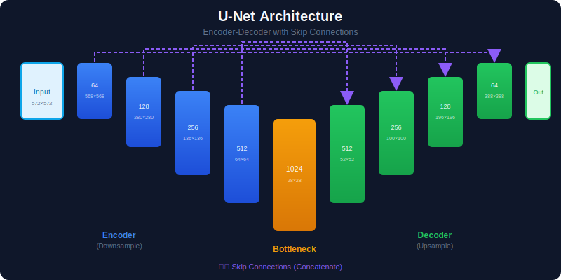
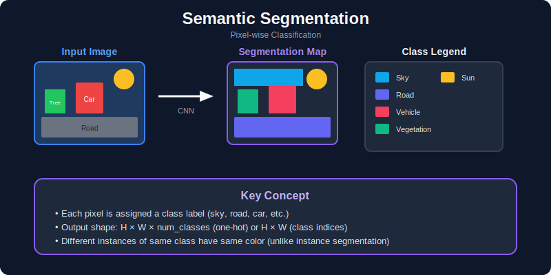
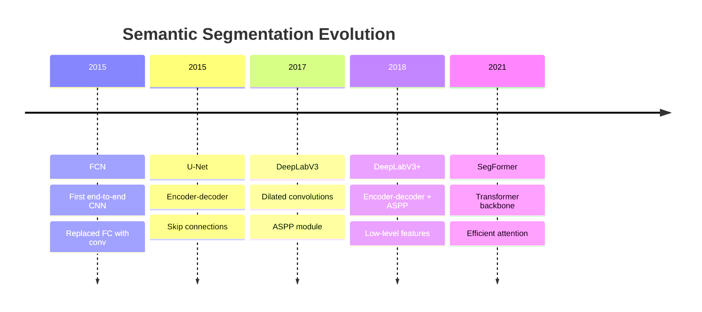
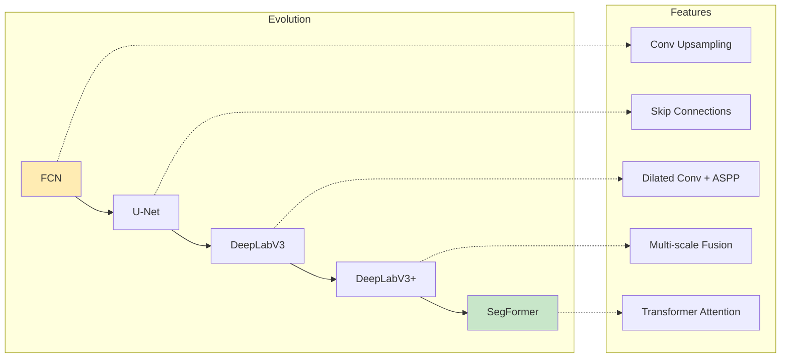
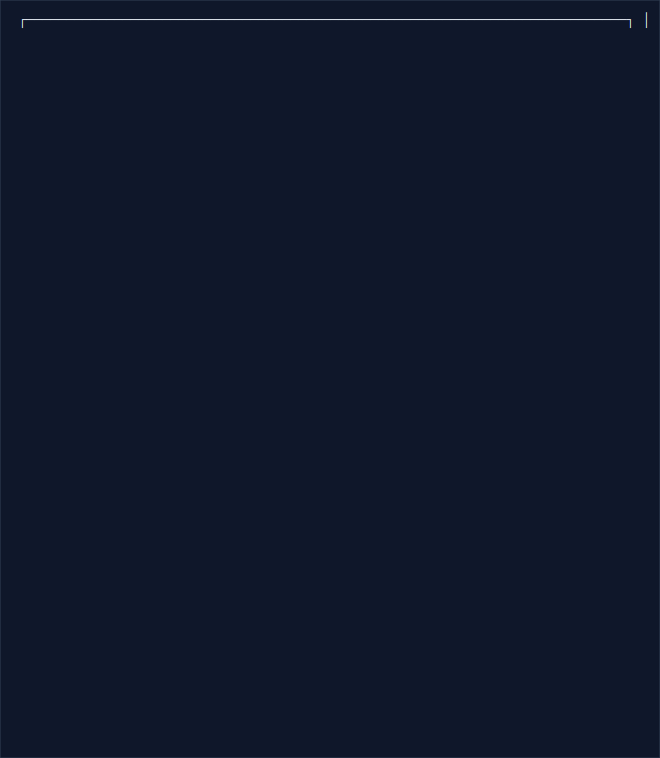
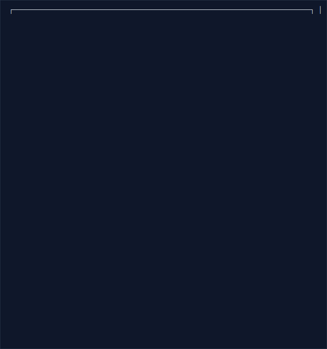
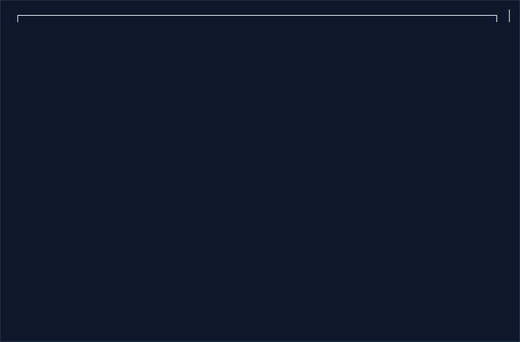
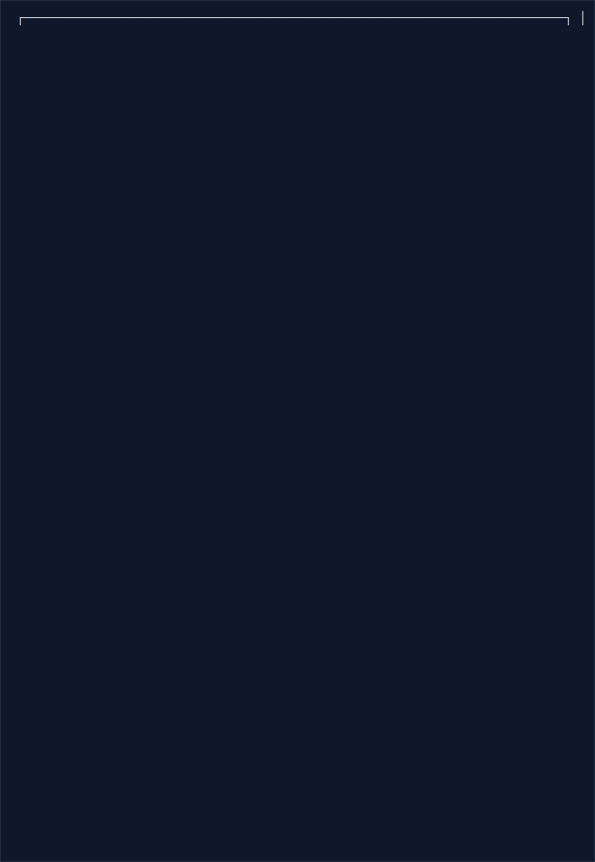

# 🎨 Semantic Segmentation

> Pixel-wise classification: labeling every pixel in an image

<p align="center">
  
</p>

---

## 📑 Table of Contents

1. [What is Semantic Segmentation?](#what-is-semantic-segmentation)

2. [Architecture Evolution](#architecture-evolution)

3. [FCN (Fully Convolutional Networks)](#fcn)

4. [U-Net](#u-net)

5. [DeepLab Family](#deeplab-family)

6. [Loss Functions](#loss-functions)

7. [Implementation Guide](#implementation-guide)

---

## What is Semantic Segmentation?

Semantic segmentation assigns a class label to every pixel in an image.



### Mathematical Formulation

**Problem Definition:**

Given an input image $I \in \mathbb{R}^{H \times W \times C}$, predict a label map:

```math
Y: \{0, ..., H-1\} \times \{0, ..., W-1\} \rightarrow \{1, ..., K\}

```

where $K$ is the number of classes.

**Network Output:**

The network produces logits $\mathbf{z} \in \mathbb{R}^{H \times W \times K}$

**Per-Pixel Softmax:**

```math
p_{i,j,k} = \frac{\exp(z_{i,j,k})}{\sum_{c=1}^{K} \exp(z_{i,j,c})}

```

**Prediction:**

```math
\hat{y}_{i,j} = \arg\max_k p_{i,j,k}

```

### Applications

| Domain | Application | Classes |
|--------|-------------|---------|
| Autonomous Driving | Road, vehicles, pedestrians | 20-30 |
| Medical Imaging | Organs, tumors, lesions | 2-10 |
| Satellite/Aerial | Land use, buildings | 5-20 |
| Fashion | Clothing parts | 10-20 |
| Robotics | Objects, surfaces | Varies |

---

## Architecture Evolution





---

## FCN

### Fully Convolutional Networks

First end-to-end trainable segmentation network.



---

## U-Net

<p align="center">
  
</p>

### Encoder-Decoder with Skip Connections

Originally designed for biomedical image segmentation.



### U-Net Implementation

```python
import torch
import torch.nn as nn

class DoubleConv(nn.Module):
    """Two consecutive conv-bn-relu blocks."""

    def __init__(self, in_channels, out_channels):
        super().__init__()
        self.conv = nn.Sequential(
            nn.Conv2d(in_channels, out_channels, 3, padding=1),
            nn.BatchNorm2d(out_channels),
            nn.ReLU(inplace=True),
            nn.Conv2d(out_channels, out_channels, 3, padding=1),
            nn.BatchNorm2d(out_channels),
            nn.ReLU(inplace=True)
        )

    def forward(self, x):
        return self.conv(x)

class UNet(nn.Module):
    """U-Net architecture for semantic segmentation."""

    def __init__(self, in_channels=3, out_channels=1, features=[64, 128, 256, 512]):
        super().__init__()

        self.encoder = nn.ModuleList()
        self.decoder = nn.ModuleList()
        self.pool = nn.MaxPool2d(2, 2)

        # Encoder (downsampling)
        for feature in features:
            self.encoder.append(DoubleConv(in_channels, feature))
            in_channels = feature

        # Bottleneck
        self.bottleneck = DoubleConv(features[-1], features[-1] * 2)

        # Decoder (upsampling)
        for feature in reversed(features):
            self.decoder.append(
                nn.ConvTranspose2d(feature * 2, feature, kernel_size=2, stride=2)
            )
            self.decoder.append(DoubleConv(feature * 2, feature))

        # Final classification layer
        self.final_conv = nn.Conv2d(features[0], out_channels, kernel_size=1)

    def forward(self, x):
        skip_connections = []

        # Encoder path
        for encoder_block in self.encoder:
            x = encoder_block(x)
            skip_connections.append(x)
            x = self.pool(x)

        x = self.bottleneck(x)
        skip_connections = skip_connections[::-1]  # Reverse

        # Decoder path
        for i in range(0, len(self.decoder), 2):
            x = self.decoder[i](x)  # Upsample
            skip = skip_connections[i // 2]

            # Handle size mismatch
            if x.shape != skip.shape:
                x = nn.functional.interpolate(x, size=skip.shape[2:])

            x = torch.cat([skip, x], dim=1)  # Concatenate
            x = self.decoder[i + 1](x)  # Double conv

        return self.final_conv(x)

```

---

## DeepLab Family

### Dilated (Atrous) Convolutions



**Mathematical Definition:**

Standard convolution with dilation rate $r$:

```math
(f *_r g)(p) = \sum_s f(s) \cdot g(p + r \cdot s)

```

**Effective Receptive Field:**

For a $k \times k$ kernel with dilation rate $r$:

```math
\text{Effective kernel size} = k + (k-1)(r-1) = r(k-1) + 1

```

| Kernel Size | Dilation | Effective Size |
|---|---|---|
| 3×3 | 1 | 3×3 |
| 3×3 | 2 | 5×5 |
| 3×3 | 4 | 9×9 |
| 3×3 | 8 | 17×17 |

**Advantage:** Exponentially increase receptive field without increasing parameters!

**Multi-Scale Context with ASPP:**

Use parallel dilated convolutions with different rates to capture multi-scale features.

### ASPP (Atrous Spatial Pyramid Pooling)



---

## Loss Functions

### Mathematical Foundation

**Pixel-wise Cross-Entropy:**

```math
\mathcal{L}_{CE} = -\frac{1}{HW}\sum_{i=1}^{H}\sum_{j=1}^{W}\sum_{k=1}^{K} y_{i,j,k} \log(p_{i,j,k})

```

where $y_{i,j,k}$ is the one-hot encoded ground truth.

**Weighted Cross-Entropy (for class imbalance):**

```math
\mathcal{L}_{WCE} = -\frac{1}{HW}\sum_{i,j}\sum_{k} w_k \cdot y_{i,j,k} \log(p_{i,j,k})

```

where $w_k = \frac{N}{K \cdot N_k}$ and $N_k$ is the number of pixels in class $k$.

**Dice Loss:**

Based on the Sørensen–Dice coefficient:

```math
\text{Dice}(P, G) = \frac{2|P \cap G|}{|P| + |G|} = \frac{2\sum_{i,j} p_{i,j} \cdot g_{i,j}}{\sum_{i,j} p_{i,j} + \sum_{i,j} g_{i,j}}
\mathcal{L}_{Dice} = 1 - \frac{2\sum_{i,j} p_{i,j} \cdot g_{i,j} + \epsilon}{\sum_{i,j} p_{i,j} + \sum_{i,j} g_{i,j} + \epsilon}

```

**Generalized Dice Loss (multi-class):**

```math
\mathcal{L}_{GDL} = 1 - 2\frac{\sum_{k} w_k \sum_{i,j} p_{i,j,k} \cdot g_{i,j,k}}{\sum_{k} w_k \sum_{i,j} (p_{i,j,k} + g_{i,j,k})}

```

where $w_k = \frac{1}{(\sum_{i,j} g_{i,j,k})^2}$ to weight smaller classes more.

**Tversky Loss:**

Generalization of Dice that balances false positives and false negatives:

```math
\mathcal{L}_{Tversky} = 1 - \frac{TP}{TP + \alpha \cdot FP + \beta \cdot FN}

```

Setting $\alpha = \beta = 0.5$ gives Dice loss.

### Cross-Entropy Loss

```python
import torch
import torch.nn as nn
import torch.nn.functional as F

class SegmentationLosses:
    """Collection of segmentation loss functions."""

    @staticmethod
    def cross_entropy(pred, target, weight=None, ignore_index=255):
        """
        Standard cross-entropy loss for segmentation.

        Args:
            pred: (B, C, H, W) logits
            target: (B, H, W) ground truth labels
        """
        return F.cross_entropy(pred, target, weight=weight, ignore_index=ignore_index)

    @staticmethod
    def dice_loss(pred, target, smooth=1.0):
        """
        Dice loss - good for imbalanced datasets.

        Dice = 2 * |A ∩ B| / (|A| + |B|)
        """
        pred = torch.softmax(pred, dim=1)

        # One-hot encode target
        num_classes = pred.shape[1]
        target_one_hot = F.one_hot(target, num_classes).permute(0, 3, 1, 2).float()

        # Compute Dice per class
        intersection = (pred * target_one_hot).sum(dim=(2, 3))
        union = pred.sum(dim=(2, 3)) + target_one_hot.sum(dim=(2, 3))

        dice = (2 * intersection + smooth) / (union + smooth)

        return 1 - dice.mean()

    @staticmethod
    def focal_loss(pred, target, alpha=0.25, gamma=2.0):
        """
        Focal loss - handles class imbalance.
        """
        ce_loss = F.cross_entropy(pred, target, reduction='none')
        pt = torch.exp(-ce_loss)
        focal_loss = alpha * (1 - pt) ** gamma * ce_loss
        return focal_loss.mean()

    @staticmethod
    def combined_loss(pred, target, ce_weight=0.5, dice_weight=0.5):
        """Combined CE + Dice loss."""
        ce = SegmentationLosses.cross_entropy(pred, target)
        dice = SegmentationLosses.dice_loss(pred, target)
        return ce_weight * ce + dice_weight * dice

```

### IoU/Dice Metrics

```python
def compute_iou(pred, target, num_classes, ignore_index=255):
    """
    Compute IoU per class.

    Args:
        pred: (B, H, W) predicted labels
        target: (B, H, W) ground truth labels
        num_classes: number of classes

    Returns:
        iou_per_class: IoU for each class
        mean_iou: Mean IoU
    """
    ious = []

    for cls in range(num_classes):
        pred_mask = (pred == cls)
        target_mask = (target == cls)

        # Ignore specified index
        valid = (target != ignore_index)
        pred_mask = pred_mask & valid
        target_mask = target_mask & valid

        intersection = (pred_mask & target_mask).sum().float()
        union = (pred_mask | target_mask).sum().float()

        if union == 0:
            iou = float('nan')  # Class not present
        else:
            iou = intersection / union

        ious.append(iou)

    # Compute mean (ignoring NaN)
    valid_ious = [iou for iou in ious if not np.isnan(iou)]
    mean_iou = sum(valid_ious) / len(valid_ious) if valid_ious else 0

    return ious, mean_iou

```

---

## Implementation Guide

### Complete Training Pipeline

```python
import torch
import torch.nn as nn
import torch.optim as optim
from torch.utils.data import DataLoader
import segmentation_models_pytorch as smp

class SegmentationTrainer:
    """Complete segmentation training pipeline."""

    def __init__(self, model, num_classes, device='cuda'):
        self.device = device
        self.model = model.to(device)
        self.num_classes = num_classes

    @classmethod
    def from_pretrained(cls, encoder='resnet50', num_classes=21, device='cuda'):
        """Create trainer with pretrained encoder."""
        model = smp.Unet(
            encoder_name=encoder,
            encoder_weights='imagenet',
            in_channels=3,
            classes=num_classes
        )
        return cls(model, num_classes, device)

    def train_epoch(self, dataloader, optimizer, criterion):
        """Train for one epoch."""
        self.model.train()
        total_loss = 0

        for batch in dataloader:
            images = batch['image'].to(self.device)
            masks = batch['mask'].to(self.device)

            optimizer.zero_grad()
            outputs = self.model(images)
            loss = criterion(outputs, masks)

            loss.backward()
            optimizer.step()

            total_loss += loss.item()

        return total_loss / len(dataloader)

    @torch.no_grad()
    def validate(self, dataloader, criterion):
        """Validate and compute metrics."""
        self.model.eval()
        total_loss = 0
        all_ious = []

        for batch in dataloader:
            images = batch['image'].to(self.device)
            masks = batch['mask'].to(self.device)

            outputs = self.model(images)
            loss = criterion(outputs, masks)
            total_loss += loss.item()

            # Compute IoU
            preds = outputs.argmax(dim=1)
            _, miou = compute_iou(preds.cpu(), masks.cpu(), self.num_classes)
            all_ious.append(miou)

        return {
            'loss': total_loss / len(dataloader),
            'miou': sum(all_ious) / len(all_ious)
        }

    def train(self, train_loader, val_loader, epochs=100, lr=1e-4):
        """Full training loop."""
        optimizer = optim.AdamW(self.model.parameters(), lr=lr)
        scheduler = optim.lr_scheduler.CosineAnnealingLR(optimizer, epochs)
        criterion = nn.CrossEntropyLoss(ignore_index=255)

        best_miou = 0

        for epoch in range(epochs):
            train_loss = self.train_epoch(train_loader, optimizer, criterion)
            val_metrics = self.validate(val_loader, criterion)
            scheduler.step()

            print(f"Epoch {epoch+1}: Train Loss={train_loss:.4f}, "
                  f"Val Loss={val_metrics['loss']:.4f}, mIoU={val_metrics['miou']:.4f}")

            if val_metrics['miou'] > best_miou:
                best_miou = val_metrics['miou']
                torch.save(self.model.state_dict(), 'best_model.pth')

```

---

## 📚 Key Takeaways

1. **U-Net** is great for medical imaging with skip connections

2. **DeepLab** with dilated convolutions captures multi-scale context

3. **Dice loss** helps with class imbalance

4. **mIoU** is the standard evaluation metric

5. **Pretrained encoders** significantly improve results

---

## 🔗 Next Steps

- [Instance Segmentation →](../07_instance_segmentation/) - Mask R-CNN, SOLO

- [Deployment →](../15_deployment/) - Optimizing for production

---

*Semantic segmentation is the basis for scene understanding.* 🎯

---

<div align="center">

**[⬆ Back to Top](#)** | **[📚 Main Repository](https://github.com/Gaurav14cs17/ml_system_design)**

Made with 💜 by [Gaurav14cs17](https://github.com/Gaurav14cs17)

</div>
